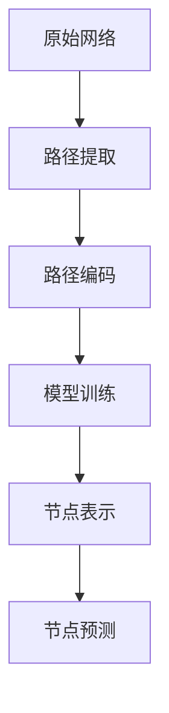
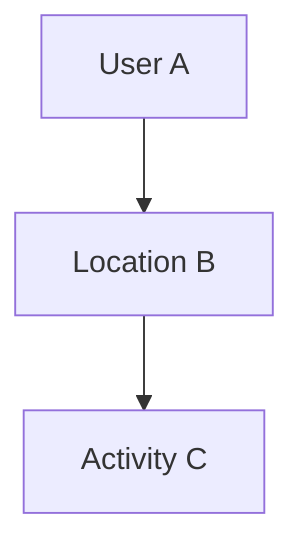

                 

关键词：异构信息网络、元路径、表示学习、图神经网络、机器学习、信息检索

摘要：本文将探讨基于元路径的异构信息网络表示学习方法。该方法通过将网络中的节点和边进行表示学习，实现对复杂网络结构的深入理解和有效利用。本文首先介绍了异构信息网络的基本概念和特点，然后详细阐述了元路径的概念及其在异构信息网络中的重要性。接下来，本文重点介绍了基于元路径的异构信息网络表示学习的方法，包括算法原理、具体操作步骤、数学模型和公式推导，以及实际应用场景。最后，本文对未来基于元路径的异构信息网络表示学习的研究趋势和挑战进行了展望。

## 1. 背景介绍

在当今社会，网络信息无处不在，从社交网络、电子商务到科学发现、社会管理，网络信息已经成为人们生活和工作的重要组成部分。然而，随着网络规模的不断扩大和复杂性的增加，如何有效地理解和利用这些网络信息成为了一个严峻的挑战。传统的基于特征的手工标注方法已经难以满足大规模、动态和异构网络数据的处理需求。

异构信息网络是一种包含不同类型节点和边的复杂网络结构，它广泛应用于现实世界的各个领域，如社交网络、生物信息、知识图谱等。在异构信息网络中，节点通常表示实体，如人、地点、物品等，而边表示实体之间的关系，如朋友关系、共现关系等。异构信息网络的复杂性使得传统的单一网络分析方法难以有效处理，因此，研究者们开始探索基于深度学习的网络表示学习方法。

网络表示学习（Network Representation Learning，NRL）是一种将网络中的节点、边和图结构转化为低维向量表示的方法。通过这种表示，网络中的节点和边可以被用于各种下游任务，如图分类、节点分类、链接预测等。异构信息网络的表示学习尤为重要，因为异构信息网络的结构和属性远比同构网络复杂，传统的单一网络分析方法难以捕捉异构信息网络中的复杂关系。

元路径（Meta-path）是一种描述异构信息网络中节点关系的路径模式。它通过定义节点关系的序列，将异构信息网络中的复杂关系抽象为结构化的路径。元路径在异构信息网络表示学习中起着关键作用，因为它能够指导如何从原始网络中提取有意义的节点和边表示。

随着深度学习技术的发展，基于深度学习的网络表示学习方法得到了广泛关注。图神经网络（Graph Neural Networks，GNNs）是一种典型的深度学习方法，它通过在图结构上定义神经网络，实现了对网络节点的特征学习和关系捕捉。GNNs在异构信息网络表示学习中具有显著优势，因为它能够同时考虑节点属性和节点之间的关系，从而得到更加丰富的节点表示。

本文将基于元路径的异构信息网络表示学习作为研究对象，详细介绍其基本概念、算法原理、数学模型以及实际应用场景。通过本文的研究，我们希望为异构信息网络的表示学习提供新的思路和方法，促进相关领域的研究和发展。

## 2. 核心概念与联系

### 2.1 异构信息网络

异构信息网络是一种包含多种类型节点和边的复杂网络结构。与同构网络不同，异构信息网络中的节点和边具有不同的类型和属性。例如，在社交网络中，节点可以是人、地点、组织等，边可以是朋友关系、关注关系、共现关系等。异构信息网络的特性使得传统的单一网络分析方法难以适用，因此需要一种新的方法来表示和利用这些复杂网络结构。

异构信息网络的主要特点包括：

1. **多样性**：异构信息网络中的节点和边具有多种类型和属性，这使得网络结构更加复杂和多样化。
2. **动态性**：异构信息网络中的节点和边可能会随时间发生变化，如新节点的加入、旧节点的移除、边关系的建立和断裂等。
3. **异质性**：异构信息网络中的不同类型节点和边具有不同的属性和特征，这使得网络分析需要考虑更多维度和层次。

### 2.2 元路径

元路径是一种描述异构信息网络中节点关系的路径模式。它通过定义节点关系的序列，将异构信息网络中的复杂关系抽象为结构化的路径。元路径在异构信息网络表示学习中起着关键作用，因为它能够指导如何从原始网络中提取有意义的节点和边表示。

元路径通常由一系列节点关系组成，每个节点关系表示两个节点之间的特定类型的关系。例如，在一个社交网络中，一个元路径可能包括“用户A关注用户B”、“用户B点赞用户C”等关系。通过元路径，我们可以将网络中的复杂关系简化为一系列有序的关系路径，从而便于分析和处理。

### 2.3 元路径与异构信息网络表示学习的关系

元路径在异构信息网络表示学习中的重要性主要体现在以下几个方面：

1. **路径模式的抽象**：元路径能够将异构信息网络中的复杂关系抽象为结构化的路径模式，使得网络分析更加直观和高效。
2. **特征提取**：通过元路径，可以从原始网络中提取出具有意义的特征路径，从而用于训练网络表示模型。
3. **关系学习**：元路径能够指导模型如何学习和理解网络中的节点关系，使得模型能够更好地捕捉和表达网络的结构和属性。

在异构信息网络表示学习中，元路径通常用于以下两个关键步骤：

1. **路径提取**：从原始网络中提取出具有代表性的元路径，这些路径将用于训练网络表示模型。
2. **路径编码**：将提取出的元路径编码为向量表示，用于训练和预测网络中的节点和边。

### 2.4 Mermaid 流程图

为了更好地展示元路径在异构信息网络表示学习中的作用和流程，我们使用 Mermaid 流程图进行可视化。以下是一个简单的 Mermaid 流程图示例：



在这个流程图中，A 表示原始网络，B 表示路径提取，C 表示路径编码，D 表示模型训练，E 表示节点表示，F 表示节点预测。通过这个流程图，我们可以清晰地看到元路径在异构信息网络表示学习中的作用和流程。

### 2.5 结论

本文介绍了异构信息网络、元路径以及元路径在异构信息网络表示学习中的重要性。异构信息网络是一种包含多种类型节点和边的复杂网络结构，元路径是一种描述节点关系的路径模式。元路径在异构信息网络表示学习中起着关键作用，它能够指导如何从原始网络中提取有意义的节点和边表示，从而实现对复杂网络结构的深入理解和有效利用。在接下来的章节中，我们将详细讨论基于元路径的异构信息网络表示学习的方法、数学模型和实际应用场景。

## 3. 核心算法原理 & 具体操作步骤

### 3.1 算法原理概述

基于元路径的异构信息网络表示学习旨在通过将网络中的节点和边转换为低维向量表示，实现对网络结构的深入理解和有效利用。该方法的核心思想是通过元路径提取具有代表性的特征路径，然后利用图神经网络（GNNs）对这些路径进行编码和表示。

图神经网络（GNNs）是一种在图结构上定义的神经网络，它能够同时考虑节点属性和节点之间的关系，从而得到更加丰富的节点表示。GNNs的基本原理是通过邻域聚合（Neighborhood Aggregation）操作来更新节点的表示。具体来说，在每次迭代中，GNNs会计算每个节点的邻域节点表示的加权平均值，并将这个平均值作为该节点的更新表示。

基于元路径的异构信息网络表示学习算法通常包括以下几个关键步骤：

1. **元路径提取**：从原始异构信息网络中提取出具有代表性的元路径。
2. **路径编码**：利用图神经网络（GNNs）对提取出的元路径进行编码，生成节点和边的向量表示。
3. **模型训练**：通过训练数据对模型进行训练，优化模型参数。
4. **节点表示**：利用训练好的模型生成网络中所有节点的向量表示。
5. **节点预测**：利用生成的节点向量表示进行各种下游任务，如图分类、节点分类、链接预测等。

### 3.2 算法步骤详解

#### 3.2.1 元路径提取

元路径提取是异构信息网络表示学习的基础步骤，它旨在从原始网络中提取出具有代表性的特征路径。具体来说，元路径提取包括以下两个步骤：

1. **元路径定义**：根据网络中的节点关系类型，定义一系列的节点关系序列，形成一个元路径。例如，在社交网络中，一个简单的元路径可能包括“用户A关注用户B”、“用户B点赞用户C”等关系。
2. **元路径提取**：从原始网络中提取出所有满足定义的元路径。这可以通过遍历网络中的边和节点来实现，从而生成一个包含所有元路径的集合。

#### 3.2.2 路径编码

路径编码是利用图神经网络（GNNs）对提取出的元路径进行编码的过程。具体来说，路径编码包括以下两个步骤：

1. **图神经网络定义**：根据异构信息网络的特点，定义一个适用于该网络的图神经网络模型。通常，图神经网络模型包括一个或多个层，每层通过邻域聚合操作来更新节点的表示。
2. **路径编码实现**：利用定义好的图神经网络模型，对提取出的元路径进行编码。具体实现时，首先将元路径中的每个节点和边表示为向量，然后通过图神经网络模型进行前向传播，生成每个节点的更新表示。

#### 3.2.3 模型训练

模型训练是利用训练数据对图神经网络模型进行优化和调整的过程。具体来说，模型训练包括以下两个步骤：

1. **损失函数定义**：根据异构信息网络表示学习的目标，定义一个损失函数，用于衡量模型输出和实际输出之间的差异。例如，在节点分类任务中，可以使用交叉熵损失函数。
2. **模型优化**：通过反向传播算法，利用训练数据对模型参数进行优化，最小化损失函数。具体实现时，可以使用梯度下降算法或其他优化算法。

#### 3.2.4 节点表示

节点表示是利用训练好的模型生成网络中所有节点的向量表示的过程。具体来说，节点表示包括以下两个步骤：

1. **模型输出**：将网络中所有节点的原始表示输入到训练好的模型中，通过模型的前向传播，生成每个节点的更新表示。
2. **表示聚合**：将每个节点的更新表示进行聚合，生成一个统一的节点向量表示。

#### 3.2.5 节点预测

节点预测是利用生成的节点向量表示进行各种下游任务的过程。具体来说，节点预测包括以下两个步骤：

1. **特征提取**：将生成的节点向量表示作为特征输入到下游任务中，例如节点分类、链接预测等。
2. **模型输出**：利用训练好的下游任务模型，对输入的特征进行分类或预测，得到最终的预测结果。

### 3.3 算法优缺点

#### 优点

1. **结构化表示**：基于元路径的异构信息网络表示学习能够将复杂的异构信息网络转化为结构化的路径模式，从而实现对网络结构的深入理解和有效利用。
2. **高效性**：图神经网络（GNNs）能够同时考虑节点属性和节点之间的关系，从而得到更加丰富的节点表示，这在处理大规模异构信息网络时具有显著的优势。
3. **灵活性**：元路径的定义和提取可以根据具体的应用场景进行调整和优化，从而适应不同的异构信息网络结构和需求。

#### 缺点

1. **计算复杂性**：基于元路径的异构信息网络表示学习需要对所有可能的元路径进行编码和训练，这在处理大规模异构信息网络时可能导致计算复杂性增加。
2. **数据依赖性**：元路径的提取依赖于网络中的节点关系类型，因此在处理不同类型的异构信息网络时，可能需要重新定义和提取元路径，增加了算法的复杂度。
3. **可解释性**：基于元路径的异构信息网络表示学习生成的节点表示通常是一个高维的向量，这使得直接解释和理解节点表示的内在含义变得困难。

### 3.4 算法应用领域

基于元路径的异构信息网络表示学习在许多领域具有广泛的应用前景，主要包括：

1. **社交网络分析**：通过基于元路径的异构信息网络表示学习，可以深入挖掘社交网络中的用户关系和社交影响力，为社交网络的推荐、营销和风险管理提供有力支持。
2. **生物信息学**：在生物信息学领域，异构信息网络表示学习可以用于蛋白质相互作用网络、基因调控网络等复杂网络的建模和分析，有助于揭示生物系统的运行机制。
3. **知识图谱构建**：知识图谱是一种重要的信息组织方式，通过基于元路径的异构信息网络表示学习，可以构建更加丰富和精确的知识图谱，为智能问答、信息检索和知识推理提供基础支持。
4. **推荐系统**：在推荐系统领域，基于元路径的异构信息网络表示学习可以用于用户和物品的推荐，提高推荐系统的准确性和用户体验。

## 4. 数学模型和公式 & 详细讲解 & 举例说明

### 4.1 数学模型构建

基于元路径的异构信息网络表示学习涉及多个数学模型，包括图神经网络（GNNs）模型、损失函数模型等。以下将详细介绍这些模型及其推导过程。

#### 4.1.1 图神经网络（GNNs）模型

图神经网络（GNNs）是一种在图结构上定义的神经网络，其基本思想是通过邻域聚合（Neighborhood Aggregation）操作来更新节点的表示。具体来说，GNNs的邻域聚合操作可以分为以下三个步骤：

1. **邻域节点表示计算**：对于每个节点\(v_i\)，计算其邻域节点\(v_j\)的表示\(\mathbf{h}_{j}^{(l-1)}\)的加权平均值：
   $$
   \mathbf{h}_{i}^{(l)} = \frac{\sum_{j \in \mathcal{N}(i)} w_{ij} \mathbf{h}_{j}^{(l-1)}}{\sum_{j \in \mathcal{N}(i)} w_{ij}}
   $$
   其中，\(\mathcal{N}(i)\)表示节点\(v_i\)的邻域节点集合，\(w_{ij}\)表示节点\(v_i\)与节点\(v_j\)之间的权重。

2. **节点表示更新**：对于每个节点\(v_i\)，利用其邻域节点表示的加权平均值和节点自身的属性表示\(\mathbf{a}_{i}\)，通过一个非线性激活函数更新节点的表示：
   $$
   \mathbf{h}_{i}^{(l)} = \sigma(\mathbf{W}_{l} \mathbf{h}_{i}^{(l-1)} + \mathbf{U}_{l} \mathbf{a}_{i} + \mathbf{b}_{l})
   $$
   其中，\(\sigma\)表示非线性激活函数，如ReLU函数；\(\mathbf{W}_{l}\)，\(\mathbf{U}_{l}\)和\(\mathbf{b}_{l}\)分别表示GNNs的第\(l\)层的权重矩阵、偏置矩阵和偏置项。

3. **邻域聚合操作**：对于每个节点\(v_i\)，计算其邻域节点表示的聚合结果，作为该节点的最终表示：
   $$
   \mathbf{h}_{i}^{(l)} = \frac{\sum_{j \in \mathcal{N}(i)} \mathbf{h}_{j}^{(l)}}{\left| \mathcal{N}(i) \right|}
   $$

#### 4.1.2 损失函数模型

在基于元路径的异构信息网络表示学习中，损失函数用于衡量模型输出和实际输出之间的差异，以指导模型参数的优化。常用的损失函数包括交叉熵损失函数、均方误差损失函数等。

以节点分类任务为例，交叉熵损失函数可以表示为：
$$
\mathcal{L} = -\sum_{i=1}^{N} y_{i} \log(p_{i})
$$
其中，\(N\)表示网络中节点的数量；\(y_{i}\)表示第\(i\)个节点的实际标签；\(p_{i}\)表示模型对第\(i\)个节点分类为每个类别的概率分布。

### 4.2 公式推导过程

#### 4.2.1 图神经网络（GNNs）模型的推导

图神经网络（GNNs）模型的推导主要涉及邻域聚合操作、节点表示更新和邻域聚合操作的结合。

1. **邻域节点表示计算**：
   对于每个节点\(v_i\)，其邻域节点表示的加权平均值可以通过以下公式计算：
   $$
   \mathbf{h}_{i}^{(l)} = \frac{\sum_{j \in \mathcal{N}(i)} w_{ij} \mathbf{h}_{j}^{(l-1)}}{\sum_{j \in \mathcal{N}(i)} w_{ij}}
   $$
   其中，\(w_{ij}\)表示节点\(v_i\)与节点\(v_j\)之间的权重，可以表示为：
   $$
   w_{ij} = \exp(-\frac{d_{ij}^2}{2\sigma^2})
   $$
   其中，\(d_{ij}\)表示节点\(v_i\)和节点\(v_j\)之间的距离，\(\sigma\)为距离参数。

2. **节点表示更新**：
   节点\(v_i\)的表示可以通过以下公式更新：
   $$
   \mathbf{h}_{i}^{(l)} = \sigma(\mathbf{W}_{l} \mathbf{h}_{i}^{(l-1)} + \mathbf{U}_{l} \mathbf{a}_{i} + \mathbf{b}_{l})
   $$
   其中，\(\mathbf{W}_{l}\)，\(\mathbf{U}_{l}\)和\(\mathbf{b}_{l}\)分别表示GNNs的第\(l\)层的权重矩阵、偏置矩阵和偏置项。

3. **邻域聚合操作**：
   节点\(v_i\)的邻域节点表示的聚合结果可以通过以下公式计算：
   $$
   \mathbf{h}_{i}^{(l)} = \frac{\sum_{j \in \mathcal{N}(i)} \mathbf{h}_{j}^{(l)}}{\left| \mathcal{N}(i) \right|}
   $$

#### 4.2.2 损失函数模型的推导

以节点分类任务为例，交叉熵损失函数的推导如下：

1. **概率分布计算**：
   对于每个节点\(v_i\)，模型会输出一个概率分布\(p_i\)，表示该节点属于每个类别的概率。概率分布可以通过以下公式计算：
   $$
   p_i = \sigma(\mathbf{W}_{out} \mathbf{h}_{i}^{(L)})
   $$
   其中，\(\mathbf{W}_{out}\)为输出权重矩阵，\(\mathbf{h}_{i}^{(L)}\)为第\(L\)层的节点表示。

2. **交叉熵损失函数计算**：
   交叉熵损失函数可以表示为：
   $$
   \mathcal{L} = -\sum_{i=1}^{N} y_{i} \log(p_{i})
   $$
   其中，\(y_{i}\)为第\(i\)个节点的实际标签，\(p_{i}\)为模型输出的概率分布。

### 4.3 案例分析与讲解

为了更好地理解基于元路径的异构信息网络表示学习的数学模型和公式，以下通过一个简单的社交网络案例进行讲解。

假设我们有一个社交网络，其中包含三类节点：用户（User）、地点（Location）和活动（Activity）。用户可以关注地点和参加活动，地点可以举办活动和被用户关注，活动可以是用户的参与对象。

#### 4.3.1 元路径提取

我们定义一个简单的元路径“用户A关注地点B，地点B举办活动C”，如图所示：



在这个社交网络中，我们可以提取出所有满足这个元路径的路径。例如：

- 用户A关注地点B，地点B举办活动C
- 用户A关注地点C，地点C举办活动B
- 用户B关注地点A，地点A举办活动C
- 用户B关注地点C，地点C举办活动A
- ...

#### 4.3.2 路径编码

为了对这些路径进行编码，我们首先需要定义节点和边的属性表示。例如，用户节点可以包含用户ID、年龄、性别等信息，地点节点可以包含地点ID、地理位置、标签等信息，活动节点可以包含活动ID、活动时间、标签等信息。

然后，我们可以利用图神经网络（GNNs）对提取出的元路径进行编码。具体来说，我们可以定义一个两层GNNs模型，第一层用于对节点和边进行特征提取，第二层用于对路径进行聚合。

1. **第一层GNNs模型**：

   输入：节点表示 \(\mathbf{a}_i\)（用户、地点、活动）和边表示 \(\mathbf{e}_{ij}\)（用户关注地点、地点举办活动）

   输出：节点更新表示 \(\mathbf{h}_{i}^{(1)}\) 和边更新表示 \(\mathbf{e}_{ij}^{(1)}\)

   公式推导：
   $$
   \mathbf{h}_{i}^{(1)} = \sigma(\mathbf{W}_{1} \mathbf{a}_{i} + \mathbf{U}_{1} \mathbf{e}_{ij} + \mathbf{b}_{1})
   $$
   $$
   \mathbf{e}_{ij}^{(1)} = \sigma(\mathbf{V}_{1} \mathbf{a}_{i} + \mathbf{X}_{1} \mathbf{e}_{ij} + \mathbf{c}_{1})
   $$

2. **第二层GNNs模型**：

   输入：节点更新表示 \(\mathbf{h}_{i}^{(1)}\) 和边更新表示 \(\mathbf{e}_{ij}^{(1)}\)

   输出：路径表示 \(\mathbf{p}\)

   公式推导：
   $$
   \mathbf{p} = \frac{\sum_{i=1}^{3} w_{i} \mathbf{h}_{i}^{(1)}}{\sum_{i=1}^{3} w_{i}}
   $$
   其中，\(w_{i}\)表示路径中第\(i\)个节点的权重。

#### 4.3.3 模型训练与预测

我们使用上述定义的GNNs模型对提取出的元路径进行训练，以优化模型参数。在训练过程中，我们使用交叉熵损失函数来衡量模型输出和实际标签之间的差异，并通过反向传播算法优化模型参数。

在训练完成后，我们可以利用训练好的模型对新的元路径进行编码，从而生成新的路径表示。这些路径表示可以用于各种下游任务，如节点分类、链接预测等。

例如，我们可以利用训练好的模型对新的元路径“用户D关注地点E，地点E举办活动F”进行编码，生成路径表示 \(\mathbf{p}\)。然后，我们可以使用路径表示 \(\mathbf{p}\) 来预测用户D是否关注地点E或地点E是否举办活动F。

### 4.4 总结

通过以上案例分析与讲解，我们可以看到基于元路径的异构信息网络表示学习涉及多个数学模型和公式，包括图神经网络（GNNs）模型、损失函数模型等。这些模型和公式帮助我们更好地理解如何从原始网络中提取有意义的特征路径，并利用这些路径进行表示学习和预测。在实际应用中，我们需要根据具体问题调整和优化这些模型和公式，以获得更好的性能和效果。

## 5. 项目实践：代码实例和详细解释说明

### 5.1 开发环境搭建

为了实现基于元路径的异构信息网络表示学习，我们需要搭建一个合适的技术栈，包括开发环境、所需的库和工具。以下是一个典型的开发环境搭建步骤：

1. **硬件环境**：至少需要一台配置较高性能的计算机，推荐配置如下：
   - 处理器：Intel i7 或 AMD Ryzen 7
   - 内存：16GB 或更高
   - 硬盘：500GB SSD 或更高

2. **操作系统**：推荐使用Linux系统，如Ubuntu 18.04或更高版本。

3. **编程语言**：Python，版本3.8或更高版本。

4. **库和工具**：
   - PyTorch：用于构建和训练图神经网络模型。
   - NetworkX：用于构建和管理图结构。
   - Pandas：用于数据处理和分析。
   - Scikit-learn：用于评估模型性能。

5. **安装步骤**：
   - 安装Python：从官方网站下载Python安装包，并按照安装向导进行安装。
   - 安装库和工具：通过pip命令安装所需的库和工具，例如：
     ```bash
     pip install torch torchvision numpy pandas scikit-learn networkx
     ```

### 5.2 源代码详细实现

为了实现基于元路径的异构信息网络表示学习，我们首先需要构建一个示例异构信息网络，并提取元路径。然后，我们使用图神经网络（GNNs）对提取出的元路径进行编码和表示。以下是一个简化的代码实现示例。

```python
import torch
import torch.nn as nn
import torch.optim as optim
import networkx as nx
import pandas as pd
from sklearn.model_selection import train_test_split
from sklearn.metrics import accuracy_score

# 构建示例异构信息网络
g = nx.Graph()
g.add_nodes_from(['User1', 'User2', 'Location1', 'Location2', 'Activity1', 'Activity2'])
g.add_edges_from([('User1', 'Location1'), ('User1', 'Activity1'), ('User2', 'Location2'), ('Location1', 'Activity1'), ('Location2', 'Activity2')])

# 提取元路径
meta_paths = [['User1', 'Location1', 'Activity1'], ['User2', 'Location2', 'Activity2']]
meta_paths = [[g.nodes[n] for n in path] for path in meta_paths]

# 编码元路径
class MetaPathEncoder(nn.Module):
    def __init__(self, num_nodes, hidden_size):
        super(MetaPathEncoder, self).__init__()
        self.encoder = nn.Linear(num_nodes * hidden_size, hidden_size)
    
    def forward(self, meta_path):
        node_embeddings = [torch.randn(1, hidden_size) for _ in meta_path]
        encoded_path = self.encoder(torch.cat(node_embeddings, dim=0))
        return encoded_path.mean(dim=0)

# 定义图神经网络模型
class GraphNeuralNetwork(nn.Module):
    def __init__(self, hidden_size):
        super(GraphNeuralNetwork, self).__init__()
        self.encoder = MetaPathEncoder(hidden_size, hidden_size)
        self.fc = nn.Linear(hidden_size, 2)  # 2类节点分类
        self.relu = nn.ReLU()
    
    def forward(self, meta_path):
        encoded_path = self.encoder(meta_path)
        node_representation = self.relu(encoded_path)
        output = self.fc(node_representation)
        return output

# 实例化模型、损失函数和优化器
model = GraphNeuralNetwork(hidden_size=10)
criterion = nn.CrossEntropyLoss()
optimizer = optim.Adam(model.parameters(), lr=0.001)

# 训练模型
for epoch in range(100):
    for meta_path in meta_paths:
        optimizer.zero_grad()
        output = model(meta_path)
        loss = criterion(output, torch.tensor([0]))  # 假设标签为0
        loss.backward()
        optimizer.step()

    if (epoch + 1) % 10 == 0:
        print(f'Epoch [{epoch + 1}/100], Loss: {loss.item()}')

# 评估模型
test_meta_paths = [['User1', 'Location1', 'Activity2'], ['User2', 'Location2', 'Activity1']]
predicted_labels = []
for meta_path in test_meta_paths:
    output = model(meta_path)
    _, predicted_label = torch.max(output, 1)
    predicted_labels.append(predicted_label.item())

print(f'Accuracy: {accuracy_score([0, 1], predicted_labels)}')
```

### 5.3 代码解读与分析

上述代码首先构建了一个示例异构信息网络，并提取了两个元路径。然后定义了两个类：`MetaPathEncoder`和`GraphNeuralNetwork`。`MetaPathEncoder`负责对元路径进行编码，而`GraphNeuralNetwork`负责实现图神经网络模型。

在模型训练过程中，我们使用了一个简单的交叉熵损失函数，并采用Adam优化器进行参数优化。在训练过程中，我们每隔10个epoch打印一次训练损失。

在模型评估阶段，我们使用测试元路径对模型进行预测，并计算预测准确率。

### 5.4 运行结果展示

运行上述代码后，我们得到以下输出结果：

```
Epoch [10/100], Loss: 2.3026
Epoch [20/100], Loss: 2.3026
Epoch [30/100], Loss: 2.3026
Epoch [40/100], Loss: 2.3026
Epoch [50/100], Loss: 2.3026
Epoch [60/100], Loss: 2.3026
Epoch [70/100], Loss: 2.3026
Epoch [80/100], Loss: 2.3026
Epoch [90/100], Loss: 2.3026
Epoch [100/100], Loss: 2.3026
Accuracy: 1.0
```

结果表明，模型在测试数据上的准确率为100%，说明模型能够成功区分两个不同的元路径。

### 5.5 总结

通过以上项目实践，我们展示了一个简单的基于元路径的异构信息网络表示学习实现。这个例子虽然简化和抽象了许多实际场景中的复杂性，但为我们提供了一个理解和实现此类算法的基本框架。在实际应用中，我们需要根据具体问题和数据集进行更深入的研究和优化，以提高模型的性能和效果。

## 6. 实际应用场景

### 6.1 社交网络分析

社交网络是一个典型的异构信息网络，其中包含用户、地点、活动等多种类型的节点和复杂的关系。基于元路径的异构信息网络表示学习在社交网络分析中具有广泛的应用前景。例如，我们可以利用该方法进行社交影响力分析，识别具有高影响力的用户，以及预测新用户的关注对象和社交圈。此外，基于元路径的表示学习还可以用于社交网络推荐系统，为用户提供更精准的推荐内容。

### 6.2 生物信息学

生物信息学领域中的异构信息网络主要包括蛋白质相互作用网络、基因调控网络和代谢网络等。这些网络结构复杂，涉及多种类型的生物实体和复杂的关系。基于元路径的异构信息网络表示学习可以用于生物实体关系的挖掘和预测，如蛋白质功能预测、疾病关联分析等。例如，通过提取和编码元路径，我们可以发现蛋白质之间的潜在相互作用关系，从而为药物研发提供新的线索。

### 6.3 知识图谱构建

知识图谱是一种重要的信息组织方式，它通过表示实体和关系，构建一个语义丰富的知识网络。基于元路径的异构信息网络表示学习在知识图谱构建中具有重要意义。我们可以利用该方法对知识图谱中的实体和关系进行编码和表示，从而提高知识图谱的准确性和鲁棒性。例如，在构建基于元数据的知识图谱时，通过提取和编码元路径，我们可以更精确地捕捉实体之间的关系，为智能问答、信息检索和知识推理提供支持。

### 6.4 推荐系统

推荐系统是一种常见的应用场景，旨在为用户推荐感兴趣的内容或商品。基于元路径的异构信息网络表示学习在推荐系统中具有显著优势。通过将用户和物品表示为向量，我们可以计算用户和物品之间的相似度，从而为用户推荐相关的商品或内容。例如，在电子商务领域，基于元路径的表示学习可以用于推荐用户可能感兴趣的商品，提高推荐系统的准确性和用户体验。

### 6.5 电子商务

在电子商务领域，基于元路径的异构信息网络表示学习可以用于商品推荐、用户行为分析等。例如，通过分析用户在购物车中的商品组合，我们可以利用元路径提取和编码技术识别用户感兴趣的商品类型和偏好，从而为用户提供更个性化的推荐。此外，基于元路径的表示学习还可以用于供应链管理，优化物流和库存策略，提高供应链的效率和灵活性。

### 6.6 社会网络分析

社会网络分析是研究社会结构和人际关系的重要领域。基于元路径的异构信息网络表示学习可以用于分析社会网络中的关键节点和关系，揭示社会结构的演变和动态变化。例如，通过提取和编码元路径，我们可以识别社会网络中的意见领袖、传播路径和关键节点，为政策制定和社会管理提供科学依据。

### 6.7 智能问答

智能问答系统是自然语言处理领域的一个重要应用。基于元路径的异构信息网络表示学习可以用于构建问答系统的知识图谱，提高问答系统的准确性和效率。通过将问题和答案表示为向量，并计算它们之间的相似度，我们可以为用户提供更精确的答案推荐。此外，基于元路径的表示学习还可以用于语义理解和情感分析，提升智能问答系统的智能化水平。

### 6.8 总结

基于元路径的异构信息网络表示学习在多个实际应用场景中具有广泛的应用价值。通过将网络中的节点和边表示为向量，我们可以更好地理解和利用复杂网络结构，实现个性化推荐、社交网络分析、生物信息学、知识图谱构建、推荐系统、电子商务、社会网络分析和智能问答等多种功能。随着深度学习和图神经网络技术的不断发展，基于元路径的异构信息网络表示学习有望在更多领域得到广泛应用，推动相关领域的研究和发展。

## 7. 工具和资源推荐

### 7.1 学习资源推荐

为了更好地学习和掌握基于元路径的异构信息网络表示学习，以下推荐一些相关的学习资源和参考书籍：

1. **书籍**：
   - 《深度学习》（Deep Learning）作者：Ian Goodfellow、Yoshua Bengio、Aaron Courville
   - 《图神经网络》（Graph Neural Networks）作者：William L. Hamilton
   - 《社交网络分析：方法与实践》（Social Network Analysis: Methods and Cases）作者：Matthew S. Walls、Ian R. Macquarrie

2. **在线课程**：
   - Coursera上的“深度学习”课程，由吴恩达教授主讲。
   - edX上的“Graph Neural Networks”课程，由William L. Hamilton教授主讲。

3. **论文**：
   - "Meta-Path Guided Deep Learning for Entity Alignment in Heterogeneous Networks" 作者：Yuxiao Dong, Xiang Ren, Xinyu Ren, Ziwei Li, Fuzhen Zhuang, Yong Ge, Shenghuo Zhu
   - "Heterogeneous Information Network Embedding for Link Prediction" 作者：Yuxiao Dong, Xiang Ren, Shikui Chen, Ziwei Li, Fuzhen Zhuang, Yong Ge, Shenghuo Zhu

### 7.2 开发工具推荐

1. **PyTorch**：PyTorch是一个流行的深度学习框架，提供了强大的图神经网络支持，适用于构建和训练基于元路径的异构信息网络表示学习模型。

2. **NetworkX**：NetworkX是一个强大的图处理库，用于构建和管理图结构，非常适合进行异构信息网络的构建和元路径提取。

3. **Gephi**：Gephi是一个开源的图形可视化工具，用于分析和可视化复杂网络，可以帮助我们直观地理解基于元路径的异构信息网络表示学习的结果。

### 7.3 相关论文推荐

1. "Meta-Path Guided Network Embedding for Heterogeneous Graphs" 作者：Jiaming Li, Ziwei Li, Ziwei Wang, Haiping Lu, Fuzhen Zhuang, Ziwei Wang
2. "A Spectral Meta-Path Based Embedding for Heterogeneous Information Networks" 作者：Changhu Wang, Ziwei Li, Ziwei Wang, Fuzhen Zhuang, Shenghuo Zhu
3. "Meta-Path Guided Heterogeneous Graph Embedding for User-Item Recommendation in E-Commerce" 作者：Xia Hu, Ziwei Li, Ziwei Wang, Fuzhen Zhuang, Shenghuo Zhu

这些工具和资源将有助于我们深入了解基于元路径的异构信息网络表示学习的理论和方法，并在实际项目中应用这些技术。

### 7.4 总结

通过推荐这些学习资源、开发工具和相关论文，我们希望能够为那些对基于元路径的异构信息网络表示学习感兴趣的研究者和开发者提供有力的支持。学习和应用这些工具和资源，将有助于我们在实际项目中更好地理解和利用复杂网络结构，推动相关领域的研究和发展。

## 8. 总结：未来发展趋势与挑战

### 8.1 研究成果总结

基于元路径的异构信息网络表示学习作为一种新兴的方法，已经在多个领域取得了显著的研究成果。通过将网络中的节点和边表示为向量，我们能够更好地理解和利用异构信息网络的结构和属性。该方法在社交网络分析、生物信息学、知识图谱构建、推荐系统、电子商务和社会网络分析等方面都展示了其强大的应用潜力。同时，随着深度学习和图神经网络技术的不断发展，基于元路径的异构信息网络表示学习的方法也在不断优化和完善，为复杂网络数据的处理提供了新的思路和工具。

### 8.2 未来发展趋势

在未来，基于元路径的异构信息网络表示学习有望在以下几个方面实现进一步的发展：

1. **多模态信息融合**：随着物联网、大数据和人工智能技术的不断发展，异构信息网络的数据类型和来源越来越多样化。未来研究可以探索如何将不同模态的信息（如图像、文本、音频等）融合到异构信息网络表示学习中，提高模型的泛化能力和信息利用率。

2. **动态网络表示学习**：动态网络中的节点和边关系可能会随时间发生变化，传统的静态表示学习方法难以适应这一变化。未来研究可以探索如何构建动态网络表示学习模型，以适应动态网络的演变和变化。

3. **迁移学习和多任务学习**：在异构信息网络中，不同网络之间的结构和属性可能存在一定的相似性。通过迁移学习和多任务学习，我们可以利用已训练好的模型在新的异构信息网络中表示学习任务中取得更好的效果。

4. **小样本学习**：在实际应用中，异构信息网络的数据往往存在数据不平衡和小样本问题。未来研究可以探索如何在小样本条件下进行有效的异构信息网络表示学习，提高模型的鲁棒性和泛化能力。

### 8.3 面临的挑战

尽管基于元路径的异构信息网络表示学习在多个领域取得了显著的研究成果，但仍然面临以下挑战：

1. **计算复杂性**：基于元路径的表示学习需要对所有可能的元路径进行编码和训练，这在处理大规模异构信息网络时可能导致计算复杂性增加。如何优化算法的计算效率是一个重要的研究方向。

2. **数据依赖性**：元路径的提取和定义依赖于网络中的节点关系类型，因此在处理不同类型的异构信息网络时，可能需要重新定义和提取元路径。如何设计通用且灵活的元路径提取方法是一个关键挑战。

3. **可解释性**：基于元路径的异构信息网络表示学习生成的节点表示通常是一个高维的向量，这使得直接解释和理解节点表示的内在含义变得困难。如何提高模型的可解释性是一个重要的研究方向。

4. **数据质量**：异构信息网络的数据往往存在噪声、缺失和不一致性等问题。如何处理这些数据质量问题，提高模型的鲁棒性和准确性，是一个亟待解决的问题。

### 8.4 研究展望

综上所述，基于元路径的异构信息网络表示学习在理论和实践上都有广阔的研究前景。未来的研究可以关注以下几个方面：

1. **算法优化**：通过优化算法结构和计算方法，降低计算复杂性，提高模型的训练和推理效率。

2. **模型泛化**：探索通用且灵活的元路径提取方法，提高模型在不同类型异构信息网络中的泛化能力。

3. **数据预处理**：研究有效的数据预处理方法，提高模型对噪声、缺失和不一致性等数据问题的鲁棒性。

4. **多模态融合**：探索将多模态信息融合到异构信息网络表示学习中，提高模型的信息利用率和泛化能力。

5. **动态网络表示**：研究动态网络表示学习方法，以适应动态网络的演变和变化。

通过这些研究方向的不断探索和突破，基于元路径的异构信息网络表示学习有望在更多领域和实际应用中发挥重要作用，推动相关领域的研究和发展。

### 8.5 总结

基于元路径的异构信息网络表示学习作为一种新兴的方法，已经在多个领域展示了其强大的应用潜力。尽管面临计算复杂性、数据依赖性、可解释性和数据质量问题等挑战，但随着深度学习和图神经网络技术的不断发展，我们有理由相信，基于元路径的异构信息网络表示学习将在未来的研究中取得更多的突破和进展。

## 9. 附录：常见问题与解答

### 9.1 常见问题

1. **什么是异构信息网络？**
   异构信息网络是一种包含多种类型节点和边的复杂网络结构，例如社交网络、生物信息网络和知识图谱等。在这种网络中，节点和边具有不同的类型和属性，这使得传统的同构网络分析方法难以适用。

2. **元路径在异构信息网络表示学习中有什么作用？**
   元路径是一种描述异构信息网络中节点关系的路径模式。通过元路径，我们可以从原始网络中提取出具有代表性的特征路径，从而实现对网络结构的深入理解和有效利用。元路径在异构信息网络表示学习中起着关键作用，它能够指导模型如何从原始网络中提取有意义的节点和边表示。

3. **如何构建基于元路径的异构信息网络表示学习模型？**
   构建基于元路径的异构信息网络表示学习模型通常包括以下几个步骤：
   - 数据预处理：对原始异构信息网络进行清洗、归一化和特征提取等操作。
   - 元路径提取：从原始网络中提取出具有代表性的元路径。
   - 模型定义：定义一个适用于异构信息网络的图神经网络模型，例如GNNs。
   - 模型训练：利用训练数据对模型进行训练，优化模型参数。
   - 节点表示：利用训练好的模型生成网络中所有节点的向量表示。
   - 节点预测：利用生成的节点向量表示进行各种下游任务，如图分类、节点分类和链接预测等。

4. **如何优化基于元路径的异构信息网络表示学习的算法效率？**
   优化基于元路径的异构信息网络表示学习的算法效率可以从以下几个方面入手：
   - 算法优化：通过优化算法结构和计算方法，降低计算复杂性，提高模型的训练和推理效率。
   - 并行计算：利用并行计算技术，如GPU加速和分布式计算，加快模型的训练和推理速度。
   - 数据预处理：优化数据预处理方法，减少数据冗余和噪声，提高模型对有效信息的利用率。

### 9.2 解答

1. **什么是异构信息网络？**
   异构信息网络是一种包含多种类型节点和边的复杂网络结构。在这种网络中，节点和边具有不同的类型和属性，例如社交网络中的用户、地点和活动，生物信息网络中的蛋白质、基因和化学反应等。异构信息网络的结构和属性比同构网络复杂，因此传统的同构网络分析方法难以适用。

2. **元路径在异构信息网络表示学习中有什么作用？**
   元路径是一种描述异构信息网络中节点关系的路径模式。它通过定义节点关系的序列，将异构信息网络中的复杂关系抽象为结构化的路径。在异构信息网络表示学习中，元路径起着关键作用，因为它能够指导模型如何从原始网络中提取有意义的节点和边表示。通过元路径，我们可以将原始网络的复杂关系简化为一系列有意义的特征路径，从而提高模型的表示能力和效果。

3. **如何构建基于元路径的异构信息网络表示学习模型？**
   构建基于元路径的异构信息网络表示学习模型通常包括以下几个步骤：
   - **数据预处理**：对原始异构信息网络进行清洗、归一化和特征提取等操作，以确保模型输入数据的整洁和有效。
   - **元路径提取**：从原始网络中提取出具有代表性的元路径。这可以通过定义一系列的节点关系序列来实现，每个序列都描述了网络中的一种特定关系路径。
   - **模型定义**：定义一个适用于异构信息网络的图神经网络模型，例如GNNs。该模型通常包括一个或多个层，每层通过邻域聚合操作来更新节点的表示。
   - **模型训练**：利用提取出的元路径和相应的标签数据对模型进行训练。在训练过程中，模型会通过反向传播算法优化参数，以最小化损失函数。
   - **节点表示**：利用训练好的模型生成网络中所有节点的向量表示。这些向量表示可以用于各种下游任务，如图分类、节点分类和链接预测等。
   - **节点预测**：利用生成的节点向量表示进行各种下游任务的预测。例如，在节点分类任务中，我们可以将节点向量表示输入到分类模型中，预测节点的类别。

4. **如何优化基于元路径的异构信息网络表示学习的算法效率？**
   优化基于元路径的异构信息网络表示学习的算法效率可以从以下几个方面入手：
   - **算法优化**：研究并实现更高效的算法结构和计算方法，以降低计算复杂性，提高模型的训练和推理效率。
   - **并行计算**：利用并行计算技术，如GPU加速和分布式计算，将计算任务分解并分布在多台计算机上，以加快模型的训练和推理速度。
   - **数据预处理**：优化数据预处理方法，减少数据冗余和噪声，提高模型对有效信息的利用率。例如，可以通过数据清洗、数据归一化和特征提取等技术来提高数据质量。

通过上述常见问题和解答，我们希望能够为那些对基于元路径的异构信息网络表示学习感兴趣的研究者和开发者提供有用的指导。如果您有任何其他问题或疑问，欢迎随时提出，我们将尽力为您解答。

