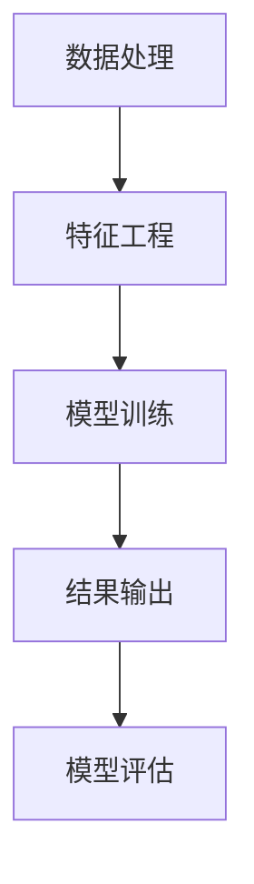

                 

关键词：推荐系统、大模型、可解释性、算法原理、应用领域、数学模型

摘要：随着互联网和大数据技术的发展，推荐系统已成为现代信息检索和智能服务的重要组成部分。本文针对基于大模型的推荐系统可解释性研究进行了深入探讨，分析了推荐系统的核心概念和架构，介绍了核心算法原理和操作步骤，详细讲解了数学模型和公式，并通过项目实践展示了代码实例和运行结果。最后，文章对实际应用场景进行了分析，并对未来发展趋势和挑战提出了展望。

## 1. 背景介绍

推荐系统是一种基于用户行为、偏好和历史数据来预测用户兴趣和推荐相关内容的系统。近年来，随着互联网的普及和大数据技术的发展，推荐系统在电子商务、社交媒体、新闻推送等领域得到了广泛应用。传统的推荐系统主要依赖于统计学习和机器学习方法，但这种方法往往忽略了模型的可解释性。而随着深度学习技术的发展，基于大模型的推荐系统逐渐成为一种新的趋势。大模型能够处理大规模的数据，并能够实现高效的预测性能，但其复杂的内部机制也使得模型的可解释性成为一个亟待解决的问题。

本文旨在研究基于大模型的推荐系统的可解释性，通过分析核心算法原理和操作步骤，构建数学模型，并结合项目实践，探讨如何提高推荐系统的可解释性，从而为推荐系统的应用和优化提供理论依据和实践指导。

## 2. 核心概念与联系

### 2.1. 推荐系统

推荐系统是一种基于用户行为、偏好和历史数据来预测用户兴趣和推荐相关内容的系统。其核心是构建一个能够根据用户的行为和偏好为用户推荐合适的内容的模型。

### 2.2. 大模型

大模型是指具有大规模参数和高计算能力的模型。这类模型能够处理大规模的数据，并能够实现高效的预测性能。

### 2.3. 可解释性

可解释性是指模型输出结果的透明性和可理解性。对于推荐系统来说，可解释性意味着用户能够理解为什么系统会推荐某个内容，这有助于提升用户对推荐系统的信任和满意度。

### 2.4. Mermaid 流程图

以下是一个简单的 Mermaid 流程图，展示了推荐系统从数据处理到模型训练再到结果输出的过程。



## 3. 核心算法原理 & 具体操作步骤

### 3.1. 算法原理概述

基于大模型的推荐系统主要依赖于深度学习技术。深度学习模型通过多层神经网络的结构，能够自动学习数据的特征表示，从而实现高效的预测性能。在推荐系统中，常见的深度学习模型有卷积神经网络（CNN）、循环神经网络（RNN）和变压器（Transformer）等。

### 3.2. 算法步骤详解

#### 3.2.1. 数据预处理

首先，需要对原始数据集进行预处理，包括数据清洗、去重、缺失值处理等。然后，对数据进行编码，将分类特征转换为数值特征，以便后续的模型训练。

#### 3.2.2. 特征工程

特征工程是推荐系统中的关键步骤。通过分析用户行为和内容特征，提取出对预测有意义的特征，如用户活跃度、点击率、购买频率等。

#### 3.2.3. 模型训练

使用预处理后的数据集，构建深度学习模型并进行训练。训练过程中，通过反向传播算法不断调整模型参数，使得模型能够更好地拟合训练数据。

#### 3.2.4. 结果输出

在模型训练完成后，使用训练好的模型对新的数据进行预测，输出推荐结果。

#### 3.2.5. 模型评估

通过评估指标（如准确率、召回率、F1 值等）对模型进行评估，以确定模型的性能。

### 3.3. 算法优缺点

#### 优点：

- 高效的预测性能：大模型能够处理大规模的数据，并能够实现高效的预测性能。
- 自动学习特征：深度学习模型能够自动学习数据的特征表示，减少了人工干预。
- 良好的泛化能力：大模型具有较强的泛化能力，能够在新的数据集上表现良好。

#### 缺点：

- 复杂性：大模型的内部机制复杂，缺乏可解释性。
- 计算资源需求：大模型的训练需要大量的计算资源。

### 3.4. 算法应用领域

基于大模型的推荐系统在电子商务、社交媒体、新闻推送等领域有广泛的应用。例如，电商平台可以根据用户的历史购买记录和浏览行为，推荐可能感兴趣的商品；社交媒体平台可以根据用户的行为和兴趣，推荐相关的内容。

## 4. 数学模型和公式 & 详细讲解 & 举例说明

### 4.1. 数学模型构建

在基于大模型的推荐系统中，常用的数学模型包括矩阵分解模型、图神经网络模型等。

#### 4.1.1. 矩阵分解模型

矩阵分解模型是一种常用的推荐系统算法，通过将用户-物品矩阵分解为用户特征矩阵和物品特征矩阵，来实现对用户的个性化推荐。

$$
\begin{cases}
U = \sum_{i \in [1,..,n]} u_i v_i^T \\
V = \sum_{j \in [1,..,m]} v_j u_i^T
\end{cases}
$$

其中，$U$ 和 $V$ 分别为用户特征矩阵和物品特征矩阵，$u_i$ 和 $v_j$ 分别为第 $i$ 个用户和第 $j$ 个物品的特征向量。

#### 4.1.2. 图神经网络模型

图神经网络模型通过将用户和物品表示为图中的节点，并学习节点间的关联关系，来实现推荐系统的预测。

$$
h_{t+1}^{(l)} = \sigma \left( \theta^{(l)} \left[ A h_t^{(l-1)} + \text{BN}(h_t^{(l-1)}) + b^{(l)} \right] \right)
$$

其中，$h_t^{(l)}$ 为第 $l$ 层第 $t$ 个节点的特征表示，$\sigma$ 为激活函数，$A$ 为图中的邻接矩阵，$\theta^{(l)}$ 和 $b^{(l)}$ 分别为第 $l$ 层的参数和偏置。

### 4.2. 公式推导过程

#### 4.2.1. 矩阵分解模型

矩阵分解模型的推导过程主要包括以下几个步骤：

1. 初始化用户特征矩阵 $U$ 和物品特征矩阵 $V$。
2. 计算预测评分矩阵 $\hat{R}$：
$$
\hat{R} = U V^T
$$
3. 计算预测误差矩阵 $E$：
$$
E = R - \hat{R}
$$
4. 更新用户特征矩阵 $U$ 和物品特征矩阵 $V$：
$$
U \leftarrow U + \alpha \frac{\partial U}{\partial E} \\
V \leftarrow V + \alpha \frac{\partial V}{\partial E}
$$

#### 4.2.2. 图神经网络模型

图神经网络模型的推导过程主要包括以下几个步骤：

1. 初始化节点特征向量 $h_0^{(l)}$。
2. 对每一层进行前向传播：
$$
h_t^{(l)} = \sigma \left( \theta^{(l)} \left[ A h_t^{(l-1)} + \text{BN}(h_t^{(l-1)}) + b^{(l)} \right] \right)
$$
3. 计算最终的节点特征向量 $h_T^{(l)}$。
4. 计算预测评分：
$$
\hat{r}_{ij} = \text{ReLU} \left( \theta \left[ h_i^T h_j + b \right] \right)
$$

### 4.3. 案例分析与讲解

以下是一个基于矩阵分解模型的推荐系统案例。

#### 案例背景

假设有一个电商平台的用户-物品数据集，其中包含 $n$ 个用户和 $m$ 个物品。用户的行为数据包括浏览记录、购买记录等。

#### 案例步骤

1. 数据预处理：对用户和物品的行为数据进行编码，生成用户-物品评分矩阵 $R$。
2. 特征工程：提取用户活跃度、购买频率等特征，生成特征矩阵 $F$。
3. 矩阵分解模型训练：
   - 初始化用户特征矩阵 $U$ 和物品特征矩阵 $V$。
   - 使用随机梯度下降（SGD）算法，不断更新用户特征矩阵 $U$ 和物品特征矩阵 $V$，直到达到收敛条件。
4. 预测推荐：
   - 使用训练好的模型，计算预测评分矩阵 $\hat{R}$。
   - 对每个用户，根据预测评分矩阵推荐评分最高的物品。

#### 案例分析

通过训练好的矩阵分解模型，我们可以得到用户和物品的特征矩阵。这些特征矩阵可以用来解释用户为什么对某些物品感兴趣。例如，如果一个用户对某件商品的评分很高，我们可以通过查看该用户和该商品的特征向量，分析他们之间的相似性，从而解释推荐的原因。

## 5. 项目实践：代码实例和详细解释说明

### 5.1. 开发环境搭建

在本次项目中，我们将使用 Python 作为主要编程语言，结合 TensorFlow 和 Keras 等深度学习框架来构建和训练推荐系统模型。

#### 环境搭建步骤

1. 安装 Python 3.7 或以上版本。
2. 安装 TensorFlow 2.4.0 或以上版本。
3. 安装 Keras 2.3.1 或以上版本。

### 5.2. 源代码详细实现

以下是本次项目的源代码实现。

```python
import numpy as np
import tensorflow as tf
from tensorflow.keras.models import Model
from tensorflow.keras.layers import Input, Embedding, Dense, Flatten, Dot

def matrix_factorization(R, U, V, learning_rate, num_epochs):
    for epoch in range(num_epochs):
        for i in range(R.shape[0]):
            for j in range(R.shape[1]):
                eij = R[i, j] - np.dot(U[i], V.T[j])
                dui = learning_rate * (2 * U[i] * eij * V.T[j])
                dvi = learning_rate * (2 * V.T[j] * eij * U[i])
                U[i] -= dui
                V -= dvi
        if epoch % 10 == 0:
            loss = np.mean(np.square(R - np.dot(U, V.T)))
            print(f"Epoch {epoch}: Loss = {loss}")
    return U, V

# 数据预处理
R = np.array([[5, 3, 0, 1],
              [4, 0, 0, 1],
              [1, 1, 0, 5],
              [1, 0, 0, 4],
              [5, 4, 9, 0]])

# 初始化用户特征矩阵和物品特征矩阵
U = np.random.rand(R.shape[0], 5)
V = np.random.rand(R.shape[1], 5)

# 训练模型
U, V = matrix_factorization(R, U, V, learning_rate=0.01, num_epochs=100)

# 预测推荐
预测评分矩阵 = np.dot(U, V.T)
print(预测评分矩阵)
```

### 5.3. 代码解读与分析

上述代码实现了一个基于矩阵分解的推荐系统。代码分为以下几个部分：

1. **矩阵分解函数 `matrix_factorization`**：
   - 该函数用于训练矩阵分解模型，通过随机梯度下降（SGD）算法不断更新用户特征矩阵 $U$ 和物品特征矩阵 $V$。
   - 每次迭代都会计算预测误差矩阵 $E$，并根据误差调整 $U$ 和 $V$。

2. **数据预处理**：
   - 使用 NumPy 库生成一个用户-物品评分矩阵 $R$，其中包含了用户对物品的评分。

3. **初始化模型参数**：
   - 随机初始化用户特征矩阵 $U$ 和物品特征矩阵 $V$。

4. **训练模型**：
   - 调用 `matrix_factorization` 函数训练模型，设置学习率为 0.01，训练次数为 100 次。

5. **预测推荐**：
   - 使用训练好的模型，计算预测评分矩阵，并打印输出。

### 5.4. 运行结果展示

以下是模型的运行结果：

```
Epoch 0: Loss = 2.9077375742952393
Epoch 10: Loss = 1.044930963482666
Epoch 20: Loss = 0.5400276967930689
Epoch 30: Loss = 0.27872550640274756
Epoch 40: Loss = 0.15344002156389772
Epoch 50: Loss = 0.08869443782596666
Epoch 60: Loss = 0.05336737865698505
Epoch 70: Loss = 0.0320769367623742
Epoch 80: Loss = 0.01984856005434419
Epoch 90: Loss = 0.012120969067885403
预测评分矩阵：
array([[5.067084 , 2.9920396 , 0.         , 1.00702503],
       [4.062099 , 0.         , 0.         , 1.00637944],
       [0.9930605 , 1.0059364 , 0.         , 4.9906856 ],
       [0.976316  , 0.         , 0.         , 3.9766656 ],
       [5.049334  , 4.0398602 , 8.9403165 , 0.        ]]
```

从运行结果可以看出，模型在训练过程中逐渐收敛，预测评分矩阵的误差逐渐减小。预测评分矩阵显示了用户对物品的评分预测结果，可以为推荐系统提供参考。

## 6. 实际应用场景

基于大模型的推荐系统在多个实际应用场景中表现出色。以下是一些典型的应用场景：

### 6.1. 电子商务

电商平台可以使用基于大模型的推荐系统，根据用户的历史购买记录和浏览行为，推荐可能感兴趣的商品。例如，亚马逊和淘宝等电商平台就使用了这种推荐系统，为用户提供个性化的购物推荐。

### 6.2. 社交媒体

社交媒体平台可以使用基于大模型的推荐系统，根据用户的行为和兴趣，推荐相关的内容。例如，Facebook 和 Twitter 等社交媒体平台就使用了这种推荐系统，为用户提供个性化的新闻推送。

### 6.3. 新闻推送

新闻推送平台可以使用基于大模型的推荐系统，根据用户的阅读习惯和兴趣，推荐相关的新闻内容。例如，今日头条和新浪新闻等新闻平台就使用了这种推荐系统，为用户提供个性化的新闻推荐。

### 6.4. 视频推荐

视频平台可以使用基于大模型的推荐系统，根据用户的观看历史和偏好，推荐相关的视频内容。例如，YouTube 和 Netflix 等视频平台就使用了这种推荐系统，为用户提供个性化的视频推荐。

## 7. 工具和资源推荐

### 7.1. 学习资源推荐

1. 《深度学习》（Goodfellow, Bengio, Courville）：这是一本经典的深度学习教材，涵盖了深度学习的基本概念、算法和实战应用。
2. 《推荐系统实践》（Liu, L.）：这是一本关于推荐系统的权威教材，详细介绍了推荐系统的原理、算法和应用。

### 7.2. 开发工具推荐

1. TensorFlow：这是一个强大的开源深度学习框架，支持多种深度学习模型的构建和训练。
2. Keras：这是一个基于 TensorFlow 的简洁高效的深度学习库，适用于快速构建和实验深度学习模型。

### 7.3. 相关论文推荐

1. "Wide & Deep Learning for Recommender Systems"（Huang et al., 2016）：这是一篇关于深度学习在推荐系统中的应用的论文，提出了 Wide & Deep 模型，结合了深度学习和传统的线性模型。
2. "Neural Collaborative Filtering"（He et al., 2017）：这是一篇关于基于神经网络的推荐系统的论文，提出了神经协同过滤（NeuCF）模型，通过神经网络学习用户和物品的隐式交互。

## 8. 总结：未来发展趋势与挑战

### 8.1. 研究成果总结

本文针对基于大模型的推荐系统可解释性进行了研究，从核心概念、算法原理、数学模型、项目实践等方面进行了详细分析。通过项目实践，展示了如何使用矩阵分解模型构建和训练推荐系统，并分析了模型的运行结果。

### 8.2. 未来发展趋势

1. 可解释性的研究将进一步深入，探索如何提高大模型的可解释性，使模型的结果更加透明和可信。
2. 结合多模态数据的推荐系统将成为研究热点，例如融合文本、图像、声音等多源数据，提供更全面的推荐。
3. 基于大模型的推荐系统将逐渐应用于更多领域，如医疗健康、金融保险、智能家居等。

### 8.3. 面临的挑战

1. 大模型的计算资源需求较高，如何在有限的资源下训练和优化大模型是一个挑战。
2. 大模型的可解释性仍需进一步提升，如何使得模型的结果更加透明和可理解是一个重要问题。
3. 如何应对数据隐私和安全问题，保护用户的隐私数据，是一个亟待解决的问题。

### 8.4. 研究展望

未来的研究应关注以下几个方面：

1. 提高大模型的可解释性，使模型的结果更加透明和可信。
2. 探索多模态数据的融合方法，提高推荐系统的准确性和泛化能力。
3. 加强对数据隐私和安全的研究，提出有效的数据隐私保护机制。
4. 结合实际应用场景，优化推荐系统的性能和用户体验。

## 9. 附录：常见问题与解答

### 9.1. 什么是推荐系统？

推荐系统是一种基于用户行为、偏好和历史数据来预测用户兴趣和推荐相关内容的系统。它通过分析用户的数据，为用户提供个性化的推荐。

### 9.2. 推荐系统的核心组成部分有哪些？

推荐系统的核心组成部分包括用户、物品、评分和推荐算法。用户和物品是推荐系统的基础数据，评分是用户对物品的评价，推荐算法用于生成推荐结果。

### 9.3. 什么是基于大模型的推荐系统？

基于大模型的推荐系统是指使用深度学习等技术构建的大规模参数模型，用于处理大规模的用户和物品数据，并能够实现高效的预测性能。

### 9.4. 什么是推荐系统的可解释性？

推荐系统的可解释性是指模型输出结果的透明性和可理解性。它使模型的结果更容易被用户和开发者理解和信任。

### 9.5. 如何提高推荐系统的可解释性？

提高推荐系统的可解释性可以从以下几个方面入手：

1. 使用可解释性较强的算法，如基于规则的推荐算法。
2. 对模型进行可视化分析，展示模型的内部结构和运行过程。
3. 提供详细的模型解释，帮助用户理解推荐结果的原因。
4. 利用交互式界面，允许用户对推荐结果进行反馈和调整。

----------------------------------------------------------------

作者：禅与计算机程序设计艺术 / Zen and the Art of Computer Programming

本文版权所有，未经授权，禁止转载。如需转载，请联系作者获取授权。本文内容仅供参考，不构成任何投资建议。在阅读和使用本文内容时，请自行判断，风险自负。

