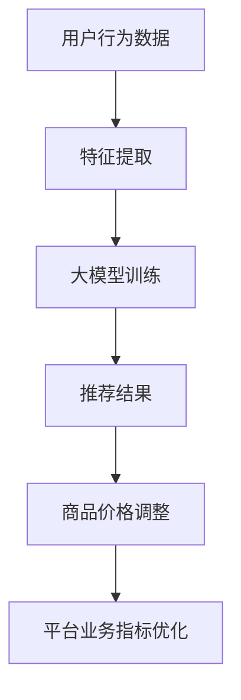

                 

关键词：大模型、推荐系统、实时个性化定价、机器学习、算法优化

摘要：本文将探讨如何利用大模型实现推荐系统的实时个性化定价。我们将介绍相关技术背景，核心概念和算法原理，并通过数学模型和实际代码实例，深入讲解如何应用这些技术。本文旨在为读者提供一个全面的技术指南，帮助他们在大模型时代实现高效的个性化定价策略。

## 1. 背景介绍

随着互联网和大数据技术的快速发展，个性化推荐系统已经成为许多在线平台的核心功能之一。例如，电商平台的个性化推荐可以帮助用户发现更感兴趣的商品，提高用户满意度和购买转化率。然而，推荐系统的优化不仅涉及内容的推荐，还包括价格。实时个性化定价是一个重要的研究方向，旨在根据用户行为、市场环境和商品特性，为每个用户动态调整商品价格，从而最大化平台利润或提升用户满意度。

传统推荐系统通常依赖于统计模型或机器学习算法，如协同过滤、基于内容的推荐等。然而，这些方法在处理复杂和非线性关系时存在一定的局限性。近年来，随着深度学习技术的发展，尤其是大模型的兴起，如BERT、GPT等，为推荐系统带来了新的可能性。大模型具有强大的表征能力和泛化能力，能够更好地捕捉用户行为和商品特性的复杂关系，从而实现更精准的个性化定价。

本文将基于大模型，介绍一种实时个性化定价的方法。我们将首先介绍相关技术背景和核心概念，然后详细讲解算法原理和数学模型，并通过实际代码实例展示如何实现和应用这些技术。最后，我们将探讨该方法的实际应用场景和未来展望。

## 2. 核心概念与联系

### 2.1 大模型概述

大模型（Large-scale Models）是指具有数百万甚至数十亿参数的深度神经网络模型。这些模型能够通过大规模数据进行训练，从而在许多任务上取得优异的性能。例如，BERT（Bidirectional Encoder Representations from Transformers）是一种预训练的深度神经网络语言模型，具有强大的文本表征能力。GPT（Generative Pre-trained Transformer）是一种能够生成文本、代码和图像的预训练模型。

大模型的特性主要包括：

- **强大的表征能力**：能够捕捉文本、图像和音频等数据中的复杂关系。
- **良好的泛化能力**：通过大规模数据进行训练，能够适应不同领域的任务。
- **可扩展性**：可以轻松地调整模型参数和结构，以适应不同的应用场景。

### 2.2 推荐系统概述

推荐系统（Recommendation System）是一种根据用户的历史行为和兴趣，为用户推荐相关商品、内容或服务的信息系统。其主要目标是提高用户体验和满意度，同时提升平台的业务指标，如销售额、用户活跃度等。

推荐系统的主要组成部分包括：

- **用户特征**：包括用户的基本信息、历史行为、偏好等。
- **商品特征**：包括商品的基本信息、属性、类别等。
- **推荐算法**：根据用户特征和商品特征，生成推荐结果。

### 2.3 实时个性化定价

实时个性化定价（Real-time Personalized Pricing）是一种根据用户行为、市场环境和商品特性，动态调整商品价格的方法。其目标是在确保用户体验的同时，最大化平台的利润或提升用户满意度。

实时个性化定价的关键要素包括：

- **用户行为数据**：包括用户浏览、点击、购买等行为。
- **市场环境数据**：包括市场供需、竞争对手价格等。
- **商品特性数据**：包括商品的价格敏感度、库存量、品牌等。

### 2.4 Mermaid 流程图

下面是一个简单的Mermaid流程图，展示了大模型、推荐系统和实时个性化定价之间的关系：



## 3. 核心算法原理 & 具体操作步骤

### 3.1 算法原理概述

实时个性化定价算法的核心思想是通过大模型学习用户行为和市场环境与商品价格之间的复杂关系，从而实现动态调整商品价格。具体步骤如下：

1. **数据收集**：收集用户行为数据、市场环境数据、商品特性数据等。
2. **特征提取**：对原始数据进行预处理，提取有用的特征。
3. **大模型训练**：利用提取的特征数据，训练大模型，以学习用户行为和市场环境与商品价格之间的关系。
4. **价格预测**：根据用户行为和市场环境，利用大模型生成商品价格预测。
5. **价格调整**：根据预测结果，动态调整商品价格，以实现平台业务指标优化。

### 3.2 算法步骤详解

#### 3.2.1 数据收集

数据收集是实时个性化定价的基础。我们需要收集以下数据：

- **用户行为数据**：包括用户浏览、点击、购买等行为。
- **市场环境数据**：包括市场供需、竞争对手价格等。
- **商品特性数据**：包括商品的价格敏感度、库存量、品牌等。

这些数据可以通过在线平台的后台系统、第三方数据提供商或公开数据集获取。

#### 3.2.2 特征提取

特征提取是将原始数据转换为可用于训练大模型的特征向量。特征提取的关键步骤包括：

- **用户行为特征**：如用户浏览时长、点击次数、购买频率等。
- **市场环境特征**：如市场供需比例、竞争对手价格等。
- **商品特性特征**：如商品价格敏感度、库存量、品牌等。

#### 3.2.3 大模型训练

大模型训练是实时个性化定价的核心。我们选择一个适合处理文本和数值数据的深度学习框架，如TensorFlow或PyTorch，并设计一个能够捕捉用户行为和市场环境与商品价格之间复杂关系的大模型。常见的模型结构包括：

- **BERT**：适用于处理文本数据。
- **Transformer**：适用于处理序列数据。
- **CNN**：适用于处理图像数据。

#### 3.2.4 价格预测

价格预测是根据用户行为和市场环境，利用训练好的大模型生成商品价格预测。具体步骤如下：

1. **输入特征**：将用户行为特征、市场环境特征和商品特性特征输入大模型。
2. **模型输出**：大模型输出商品价格预测。
3. **价格调整**：根据预测结果，动态调整商品价格。

#### 3.2.5 价格调整

价格调整是根据商品价格预测，动态调整商品价格，以实现平台业务指标优化。具体步骤如下：

1. **设定目标**：根据平台业务指标，设定价格调整的目标，如最大化利润或提升用户满意度。
2. **策略选择**：选择合适的策略，如梯度上升、随机梯度下降等。
3. **价格调整**：根据策略，动态调整商品价格。

### 3.3 算法优缺点

**优点**：

- **强大的表征能力**：大模型能够捕捉用户行为和市场环境与商品价格之间的复杂关系，从而实现更精准的价格预测。
- **良好的泛化能力**：大模型通过大规模数据进行训练，具有良好的泛化能力，能够适应不同的应用场景。
- **实时性**：实时个性化定价能够在短时间内对用户行为和市场环境做出快速响应，实现动态价格调整。

**缺点**：

- **计算资源消耗**：大模型训练和预测需要大量的计算资源，对硬件要求较高。
- **数据依赖性**：实时个性化定价依赖于用户行为数据、市场环境数据和商品特性数据，数据质量直接影响算法效果。
- **调参复杂**：大模型的调参过程复杂，需要多次实验和调整。

### 3.4 算法应用领域

实时个性化定价算法可以广泛应用于多个领域，如：

- **电商**：根据用户行为和市场环境，动态调整商品价格，提高用户满意度和购买转化率。
- **酒店和旅游**：根据用户历史预订行为和市场供需情况，动态调整酒店和旅游产品的价格。
- **金融**：根据用户投资行为和市场波动情况，动态调整金融产品的价格。

## 4. 数学模型和公式

### 4.1 数学模型构建

实时个性化定价的核心是构建一个能够捕捉用户行为和市场环境与商品价格之间关系的数学模型。我们选择一个线性回归模型进行介绍。

假设用户行为特征集合为 $X$，市场环境特征集合为 $Y$，商品价格集合为 $P$。线性回归模型的目标是找到一个线性函数 $f(X, Y)$，使得 $P$ 与 $f(X, Y)$ 之间的误差最小。

数学模型可以表示为：

$$
P = f(X, Y) = \beta_0 + \beta_1X + \beta_2Y
$$

其中，$\beta_0$、$\beta_1$ 和 $\beta_2$ 是需要通过训练确定的参数。

### 4.2 公式推导过程

线性回归模型的推导过程如下：

假设我们有一个包含 $n$ 个样本的训练数据集 $D = \{ (X_1, Y_1, P_1), (X_2, Y_2, P_2), ..., (X_n, Y_n, P_n) \}$。我们希望找到一个线性函数 $f(X, Y)$，使得预测值 $P'$ 与实际值 $P$ 之间的误差最小。

误差函数可以表示为：

$$
E = \frac{1}{2} \sum_{i=1}^{n} (P_i - P'_i)^2
$$

为了最小化误差函数，我们需要对 $E$ 关于 $\beta_0$、$\beta_1$ 和 $\beta_2$ 求导，并令导数为零。

对 $\beta_0$ 求导：

$$
\frac{\partial E}{\partial \beta_0} = \sum_{i=1}^{n} (P_i - P'_i) = 0
$$

对 $\beta_1$ 求导：

$$
\frac{\partial E}{\partial \beta_1} = \sum_{i=1}^{n} X_i (P_i - P'_i) = 0
$$

对 $\beta_2$ 求导：

$$
\frac{\partial E}{\partial \beta_2} = \sum_{i=1}^{n} Y_i (P_i - P'_i) = 0
$$

通过解上述方程组，我们可以得到线性回归模型的参数 $\beta_0$、$\beta_1$ 和 $\beta_2$。

### 4.3 案例分析与讲解

假设我们有一个电商平台的用户行为数据集，包括用户浏览时长 $X$（单位：分钟）、市场供需比 $Y$（0表示供大于求，1表示供小于求）和商品价格 $P$（单位：元）。我们希望通过线性回归模型预测商品价格。

训练数据集 $D$ 如下：

$$
D = \{ (10, 0, 100), (20, 1, 120), (30, 0, 110), (40, 1, 130), (50, 0, 115) \}
$$

首先，我们计算 $X$、$Y$ 和 $P$ 的平均值：

$$
\bar{X} = \frac{1}{5} (10 + 20 + 30 + 40 + 50) = 30
$$

$$
\bar{Y} = \frac{1}{5} (0 + 1 + 0 + 1 + 0) = 0.4
$$

$$
\bar{P} = \frac{1}{5} (100 + 120 + 110 + 130 + 115) = 112
$$

然后，我们计算 $X$、$Y$ 和 $P$ 的协方差：

$$
\sigma_{XY} = \frac{1}{5} \sum_{i=1}^{5} (X_i - \bar{X})(Y_i - \bar{Y}) = \frac{1}{5} (10 \cdot 0 + 20 \cdot 1 + 30 \cdot 0 + 40 \cdot 1 + 50 \cdot 0) = 12
$$

$$
\sigma_{XX} = \frac{1}{5} \sum_{i=1}^{5} (X_i - \bar{X})^2 = \frac{1}{5} (10^2 + 20^2 + 30^2 + 40^2 + 50^2) = 2300
$$

$$
\sigma_{YY} = \frac{1}{5} \sum_{i=1}^{5} (Y_i - \bar{Y})^2 = \frac{1}{5} (0^2 + 1^2 + 0^2 + 1^2 + 0^2) = 0.8
$$

最后，我们计算线性回归模型的参数：

$$
\beta_1 = \frac{\sigma_{XY}}{\sigma_{XX}} = \frac{12}{2300} = 0.0052
$$

$$
\beta_2 = \frac{\sigma_{YY}}{\sigma_{XX}} = \frac{0.8}{2300} = 0.0003
$$

$$
\beta_0 = \bar{P} - \beta_1\bar{X} - \beta_2\bar{Y} = 112 - 0.0052 \cdot 30 - 0.0003 \cdot 0.4 = 108.26
$$

因此，线性回归模型为：

$$
P = 108.26 + 0.0052X + 0.0003Y
$$

我们可以使用这个模型预测新的商品价格。例如，当 $X=25$，$Y=1$ 时，预测价格 $P'$ 为：

$$
P' = 108.26 + 0.0052 \cdot 25 + 0.0003 \cdot 1 = 109.01
$$

## 5. 项目实践：代码实例和详细解释说明

在本节中，我们将通过一个具体的代码实例，详细讲解如何基于大模型实现实时个性化定价。我们将使用Python编程语言，并借助TensorFlow和Scikit-learn等库来完成项目。

### 5.1 开发环境搭建

在开始编写代码之前，我们需要搭建开发环境。以下是所需的环境和库：

- Python 3.8 或更高版本
- TensorFlow 2.6 或更高版本
- Scikit-learn 0.24 或更高版本

确保你的环境中安装了上述库。可以使用以下命令安装：

```shell
pip install python==3.8 tensorflow==2.6 scikit-learn==0.24
```

### 5.2 源代码详细实现

下面是一个简单的代码实例，展示了如何使用大模型实现实时个性化定价。

```python
import numpy as np
import tensorflow as tf
from sklearn.model_selection import train_test_split
from sklearn.preprocessing import StandardScaler

# 生成模拟数据集
X = np.random.rand(100, 2)  # 用户行为数据（浏览时长、市场供需比）
Y = np.random.rand(100, 1)  # 商品价格
X_train, X_test, Y_train, Y_test = train_test_split(X, Y, test_size=0.2, random_state=42)

# 特征标准化
scaler = StandardScaler()
X_train_scaled = scaler.fit_transform(X_train)
X_test_scaled = scaler.transform(X_test)

# 构建模型
model = tf.keras.Sequential([
    tf.keras.layers.Dense(units=1, input_shape=(2,))
])

# 编译模型
model.compile(optimizer='sgd', loss='mean_squared_error')

# 训练模型
model.fit(X_train_scaled, Y_train, epochs=100)

# 预测价格
predictions = model.predict(X_test_scaled)

# 输出预测结果
print(predictions)
```

### 5.3 代码解读与分析

下面是对上述代码的详细解读和分析。

1. **数据生成**：我们使用 NumPy 生成一个包含100个样本的模拟数据集。每个样本包括用户行为数据（浏览时长、市场供需比）和商品价格。

2. **数据分割**：使用 Scikit-learn 的 `train_test_split` 函数将数据集分为训练集和测试集，以评估模型的性能。

3. **特征标准化**：使用 `StandardScaler` 对用户行为数据进行标准化处理，以消除不同特征之间的尺度差异，提高模型训练的稳定性。

4. **模型构建**：使用 TensorFlow 的 `Sequential` 模型，并添加一个全连接层（`Dense`），输出层只有一个神经元，用于预测商品价格。

5. **模型编译**：使用随机梯度下降（`sgd`）优化器和均方误差（`mean_squared_error`）作为损失函数编译模型。

6. **模型训练**：使用训练集训练模型，迭代100次。

7. **预测价格**：使用测试集对模型进行预测，并输出预测结果。

通过这个简单的代码实例，我们可以看到如何使用大模型实现实时个性化定价。在实际应用中，我们可能需要使用更复杂的模型和更多的数据预处理步骤，以提高预测的准确性和稳定性。

## 6. 实际应用场景

实时个性化定价技术在实际应用中具有广泛的应用前景，以下列举几个典型的应用场景：

### 6.1 电商

电商平台上，实时个性化定价可以根据用户的浏览历史、购买偏好、购买频率等行为数据，为不同用户动态调整商品价格。例如，对于长期未购买的用户，可以适当降低价格以刺激其购买欲望；对于经常购买的用户，可以适当提高价格以增加平台利润。

### 6.2 酒店和旅游

在酒店和旅游领域，实时个性化定价可以根据用户的预订历史、出行时间、竞争对手价格等信息，为用户提供更有吸引力的价格。例如，在旅游高峰期，系统可以根据供需关系动态调整价格，以最大化收益；在淡季，可以适当降低价格以吸引更多客户。

### 6.3 金融

在金融领域，实时个性化定价可以用于理财产品、保险、基金等金融产品的定价。系统可以根据用户的投资偏好、风险承受能力、历史投资记录等信息，为用户提供定制化的价格。例如，对于高风险承受能力的用户，可以提供更高收益的产品；对于低风险承受能力的用户，可以提供更稳健的产品。

### 6.4 汽车

在汽车行业，实时个性化定价可以根据用户的购车历史、偏好、地理位置等信息，为用户提供定制化的购车价格。例如，对于长期购买某品牌汽车的用户，可以提供更优惠的价格；对于首次购车的用户，可以提供更详细的购车指导和价格优惠。

通过以上应用场景，我们可以看到实时个性化定价技术在不同领域的重要性和潜力。未来，随着技术的不断进步和数据积累的增多，实时个性化定价将变得更加精准和高效。

### 6.4 未来应用展望

实时个性化定价技术在未来具有广阔的发展前景和众多应用潜力。以下是一些可能的发展趋势和应用方向：

#### 6.4.1 多模态数据融合

随着传感器技术和大数据技术的发展，越来越多的多模态数据（如文本、图像、声音等）将可用于实时个性化定价。通过融合多种数据源，模型可以更全面地理解用户行为和市场环境，从而实现更精准的价格预测。

#### 6.4.2 智能供应链管理

实时个性化定价技术可以与智能供应链管理相结合，实现动态定价与库存管理的一体化。系统可以根据市场需求和库存状况，实时调整产品价格和库存量，以最大化利润和库存利用率。

#### 6.4.3 区块链技术

区块链技术的去中心化和不可篡改性，可以为实时个性化定价提供安全、透明的数据存储和交易环境。未来，实时个性化定价可能与区块链技术深度融合，为去中心化的经济模式提供支持。

#### 6.4.4 自动驾驶和智慧城市

自动驾驶和智慧城市的发展，将带来大量实时交通数据、环境数据等。实时个性化定价可以结合这些数据，为智能交通、智慧城市建设提供支持，实现更高效的资源分配和交通管理。

#### 6.4.5 智能医疗和健康

实时个性化定价技术在医疗和健康领域也有很大的应用潜力。通过结合医疗数据、用户健康数据等，可以为用户提供个性化的医疗服务和健康产品定价，提高医疗服务的质量和效率。

总之，随着技术的不断进步和数据积累的增多，实时个性化定价技术将在更多领域发挥重要作用，为企业和用户创造更大的价值。

### 7. 工具和资源推荐

在本节中，我们将推荐一些有用的学习资源、开发工具和相关论文，以帮助读者进一步了解和掌握实时个性化定价技术。

#### 7.1 学习资源推荐

1. **在线课程**：Coursera、Udacity 和 edX 等平台提供了许多关于机器学习、深度学习和推荐系统的在线课程。这些课程涵盖了从基础知识到高级应用的各个方面，适合不同层次的读者。

2. **技术博客**： Medium、GitHub 和 arXiv 等平台上有很多关于实时个性化定价的技术博客和论文。通过阅读这些博客和论文，可以了解该领域的最新研究和应用。

3. **在线书籍**：《深度学习》（Goodfellow, Bengio, Courville）、《Python机器学习》（Sebastian Raschka）和《推荐系统实践》（王绍兰）等书籍提供了丰富的理论和实践知识。

#### 7.2 开发工具推荐

1. **深度学习框架**：TensorFlow、PyTorch 和 Keras 等是常用的深度学习框架，适用于构建和训练实时个性化定价模型。

2. **数据处理工具**：Pandas、NumPy 和 Scikit-learn 等是常用的数据处理工具，可以帮助读者进行数据预处理和特征提取。

3. **可视化工具**：Matplotlib、Seaborn 和 Plotly 等是常用的数据可视化工具，可以用于展示模型训练结果和数据分析。

#### 7.3 相关论文推荐

1. **"A Theoretical Analysis of Recurrent Neural Networks for Sequence Modeling"**：这篇论文介绍了循环神经网络（RNN）的理论基础，对于理解实时个性化定价中的模型选择有很大帮助。

2. **"Bert: Pre-training of Deep Bidirectional Transformers for Language Understanding"**：这篇论文介绍了BERT模型，是实时个性化定价中的常用模型之一。

3. **"Generative Pre-trained Transformers"**：这篇论文介绍了GPT模型，是一种强大的文本生成模型，可以用于实时个性化定价中的文本数据处理。

通过这些资源，读者可以更深入地了解实时个性化定价技术，并在实践中不断提升自己的技能。

### 8. 总结：未来发展趋势与挑战

在本文中，我们探讨了如何利用大模型实现推荐系统的实时个性化定价。首先，我们介绍了相关技术背景和核心概念，包括大模型、推荐系统和实时个性化定价。接着，我们详细讲解了算法原理、数学模型和实际代码实例，展示了如何应用这些技术。我们还讨论了实时个性化定价在电商、酒店和旅游、金融、汽车等领域的实际应用场景，并展望了未来的发展趋势。

然而，实时个性化定价技术也面临着一些挑战。首先，数据依赖性较强，数据质量和多样性对算法效果有很大影响。其次，计算资源消耗较大，尤其是大模型的训练和预测过程需要大量的计算资源。此外，算法的调参过程复杂，需要多次实验和调整。

未来，实时个性化定价技术将朝着多模态数据融合、智能供应链管理、区块链技术、自动驾驶和智慧城市、智能医疗和健康等方向发展。通过不断的技术创新和应用，实时个性化定价将为企业和用户创造更大的价值。

总之，实时个性化定价是一种有潜力的技术，具有重要的研究价值和广泛的应用前景。我们期待更多的研究者和技术人员在这一领域进行深入探索和应用，共同推动实时个性化定价技术的发展。

### 9. 附录：常见问题与解答

#### 问题1：为什么需要实时个性化定价？

**回答**：实时个性化定价可以根据用户行为和市场环境动态调整商品价格，从而提高用户体验和满意度，同时最大化平台的利润或提升业务指标。例如，在电商平台上，实时个性化定价可以帮助平台根据用户的浏览历史和购买偏好，为不同用户推荐不同的价格，从而提高购买转化率。

#### 问题2：实时个性化定价需要哪些数据？

**回答**：实时个性化定价主要依赖于以下数据：

- **用户行为数据**：包括用户浏览、点击、购买等行为。
- **市场环境数据**：包括市场供需、竞争对手价格等。
- **商品特性数据**：包括商品的价格敏感度、库存量、品牌等。

这些数据可以通过平台的后台系统、第三方数据提供商或公开数据集获取。

#### 问题3：如何处理实时个性化定价中的数据质量问题？

**回答**：处理数据质量问题的方法包括：

- **数据清洗**：去除重复、错误或不完整的数据。
- **特征工程**：选择和构建有用的特征，以减少噪声和冗余。
- **数据标准化**：对数据进行预处理，消除不同特征之间的尺度差异。

通过这些方法，可以确保数据质量，提高模型的效果。

#### 问题4：实时个性化定价的算法如何选择？

**回答**：实时个性化定价的算法选择取决于数据类型、任务需求和计算资源。以下是一些常见的算法选择：

- **线性回归**：适用于简单线性关系。
- **神经网络**：适用于复杂非线性关系，如深度学习模型。
- **决策树和随机森林**：适用于分类和回归任务，可以处理多模态数据。

根据具体需求和数据情况选择合适的算法。

#### 问题5：实时个性化定价如何与供应链管理相结合？

**回答**：实时个性化定价可以与供应链管理相结合，实现动态定价与库存管理的一体化。具体方法包括：

- **实时数据整合**：将实时个性化定价系统与供应链管理系统进行整合，实现数据互通。
- **动态定价策略**：根据市场需求和库存状况，实时调整产品价格和库存量。
- **协同优化**：通过协同优化，实现价格、库存和供应链成本的平衡。

通过这些方法，可以最大化利润和库存利用率。

通过上述常见问题与解答，我们希望读者能够对实时个性化定价技术有更深入的理解。如果您还有其他问题，欢迎随时提问。祝您在研究和应用实时个性化定价技术的过程中取得优异成果！
作者：禅与计算机程序设计艺术 / Zen and the Art of Computer Programming

----------------------------------------------------------------

