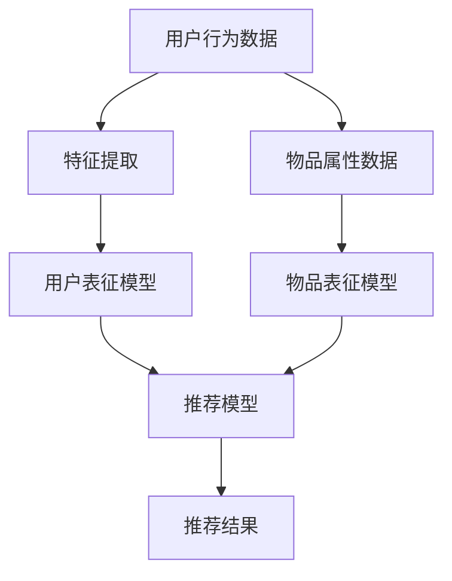

                 

关键词：大模型，推荐系统，实时优化，个性化推送，算法优化

> 摘要：本文探讨了基于大规模模型的推荐系统在实现实时个性化推送时的优化策略。文章首先介绍了推荐系统的基本概念和核心挑战，然后详细阐述了基于大模型的推荐系统的原理和优势。接着，文章重点讨论了实时优化在个性化推送中的应用，包括算法原理、操作步骤、优缺点以及适用领域。随后，文章展示了数学模型和公式的推导过程，并通过具体案例进行了分析和讲解。此外，文章还提供了代码实例和详细解释，并探讨了推荐系统的实际应用场景和未来发展趋势。最后，文章总结了研究成果，展望了未来的研究方向和面临的挑战。

## 1. 背景介绍

### 1.1 推荐系统的发展历程

推荐系统作为一种信息过滤技术，旨在根据用户的历史行为、兴趣和偏好，向用户推荐他们可能感兴趣的内容。其发展历程可以分为三个阶段：基于内容的推荐、协同过滤推荐和基于模型的推荐。

- **基于内容的推荐**：这种推荐系统主要依据用户已浏览或喜欢的内容特征，通过分析内容属性进行推荐。然而，这种方法的局限性在于无法捕捉用户隐藏的偏好和个性差异。

- **协同过滤推荐**：协同过滤是推荐系统的核心技术之一，通过分析用户之间的行为相似性来推荐内容。协同过滤分为基于用户和基于物品的两种类型，分别通过用户-物品评分矩阵和用户-用户/物品-物品相似性矩阵进行推荐。尽管协同过滤在处理大规模数据集方面表现优异，但它也存在一些问题，如冷启动问题、数据稀疏性和结果多样性不足。

- **基于模型的推荐**：随着人工智能和机器学习技术的发展，基于模型的推荐系统逐渐成为主流。这类系统通过构建用户和物品之间的复杂关系模型，从而实现更精准的推荐。其中，深度学习模型由于其强大的表征能力和端到端的学习方式，在推荐系统中得到了广泛应用。

### 1.2 大模型在推荐系统中的应用

近年来，大模型（如大型语言模型、图像模型等）在各个领域都取得了显著的进展，其在推荐系统中的应用也日益受到关注。大模型具有以下几个特点：

- **强大的表征能力**：大模型能够从海量数据中提取出丰富的特征信息，使得推荐系统对用户和物品的表征更加精准。

- **端到端的学习**：大模型通过端到端的学习方式，可以直接从原始数据中学习出用户和物品的表示，避免了传统推荐系统中的特征工程和特征选择过程。

- **自适应调整**：大模型能够根据用户行为和反馈动态调整推荐策略，实现实时个性化推送。

- **跨模态融合**：大模型能够处理多种类型的模态数据（如文本、图像、声音等），从而实现更丰富的信息融合和推荐效果。

## 2. 核心概念与联系

### 2.1 大模型的基本原理

大模型（如大型语言模型、图像模型等）通常基于深度学习技术构建，其核心原理如下：

1. **神经网络结构**：大模型采用多层神经网络结构，通过非线性变换逐步提取输入数据的特征。

2. **大规模训练数据**：大模型需要依赖大规模的训练数据集进行训练，从而学习到丰富的知识表征。

3. **端到端学习**：大模型通过端到端的学习方式，将输入数据直接映射到输出结果，无需进行传统的特征工程和特征选择。

4. **优化算法**：大模型的训练通常采用优化算法（如梯度下降、Adam等），以逐步调整模型参数，优化预测效果。

### 2.2 大模型与推荐系统的关系

大模型在推荐系统中的应用主要体现在以下几个方面：

1. **用户表征**：大模型可以从用户的历史行为、偏好和反馈中提取出丰富的特征信息，构建出细粒度的用户表征。

2. **物品表征**：大模型同样可以从物品的属性、标签、评论等数据中提取出有效的特征信息，构建出精准的物品表征。

3. **推荐算法**：大模型可以用于构建端到端的推荐算法，直接从用户和物品的表征中生成推荐结果。

4. **实时优化**：大模型可以根据用户实时行为和反馈，动态调整推荐策略，实现实时个性化推送。

### 2.3 Mermaid 流程图

以下是一个简化的基于大模型的推荐系统的 Mermaid 流程图，展示了大模型与推荐系统之间的关联：



## 3. 核心算法原理 & 具体操作步骤

### 3.1 算法原理概述

基于大模型的推荐系统主要采用以下算法原理：

1. **用户表征与物品表征**：通过深度学习模型对用户和物品进行表征，提取出丰富的特征信息。

2. **协同过滤**：利用用户表征和物品表征计算用户和物品之间的相似度，实现基于相似度的推荐。

3. **内容推荐**：通过分析用户和物品的属性特征，构建内容推荐模型，实现基于内容的推荐。

4. **多模态融合**：结合用户行为、文本、图像等多模态数据，实现更精准的推荐效果。

### 3.2 算法步骤详解

基于大模型的推荐系统算法步骤如下：

1. **数据预处理**：对用户行为数据、物品属性数据进行清洗、归一化等预处理操作。

2. **特征提取**：利用深度学习模型对用户和物品进行特征提取，构建用户表征和物品表征。

3. **相似度计算**：根据用户表征和物品表征，计算用户和物品之间的相似度。

4. **推荐结果生成**：利用相似度计算结果，生成推荐结果，并根据用户反馈进行优化。

### 3.3 算法优缺点

基于大模型的推荐系统具有以下优缺点：

**优点：**

1. **强大的表征能力**：大模型能够从海量数据中提取出丰富的特征信息，提高推荐精度。

2. **端到端学习**：大模型通过端到端学习，无需进行复杂的特征工程，降低开发难度。

3. **实时优化**：大模型可以根据用户实时行为和反馈，动态调整推荐策略，实现个性化推送。

4. **多模态融合**：大模型能够处理多种类型的模态数据，实现更丰富的信息融合。

**缺点：**

1. **计算资源消耗大**：大模型的训练和推理需要大量的计算资源和时间。

2. **数据隐私问题**：大模型在处理用户数据时，可能涉及用户隐私问题，需要采取相应的保护措施。

### 3.4 算法应用领域

基于大模型的推荐系统可以应用于以下领域：

1. **电子商务**：为用户提供个性化商品推荐，提高购物体验和转化率。

2. **社交媒体**：为用户推荐感兴趣的内容，提高用户活跃度和留存率。

3. **在线教育**：根据用户学习行为推荐课程和资源，提高学习效果。

4. **娱乐传媒**：为用户推荐电影、音乐、文章等，提升用户娱乐体验。

## 4. 数学模型和公式 & 详细讲解 & 举例说明

### 4.1 数学模型构建

基于大模型的推荐系统通常采用以下数学模型：

1. **用户表征模型**：

   $$U = f(U_{0}, X, \theta)$$

   其中，$U$ 表示用户表征，$U_{0}$ 表示初始用户表征，$X$ 表示用户行为数据，$\theta$ 表示模型参数。

2. **物品表征模型**：

   $$I = g(I_{0}, Y, \phi)$$

   其中，$I$ 表示物品表征，$I_{0}$ 表示初始物品表征，$Y$ 表示物品属性数据，$\phi$ 表示模型参数。

3. **推荐模型**：

   $$R = h(U, I, \omega)$$

   其中，$R$ 表示推荐结果，$U$ 和 $I$ 分别表示用户表征和物品表征，$\omega$ 表示模型参数。

### 4.2 公式推导过程

以下为用户表征模型、物品表征模型和推荐模型的推导过程：

1. **用户表征模型推导**：

   用户表征模型的推导过程基于用户历史行为数据 $X$ 和模型参数 $\theta$。首先，对用户行为数据进行预处理，如归一化、去重等。然后，利用深度学习模型对用户行为数据进行特征提取，得到用户表征 $U$。

   假设用户行为数据可以表示为 $X = [x_{1}, x_{2}, ..., x_{n}]$，其中 $x_{i}$ 表示第 $i$ 个用户行为。则用户表征模型可以表示为：

   $$U = f(U_{0}, X, \theta)$$

   其中，$U_{0}$ 表示初始用户表征，通常为全为零的向量。$f$ 表示深度学习模型，用于对用户行为数据进行特征提取。$\theta$ 表示模型参数。

2. **物品表征模型推导**：

   物品表征模型的推导过程基于物品属性数据 $Y$ 和模型参数 $\phi$。首先，对物品属性数据进行预处理，如归一化、去重等。然后，利用深度学习模型对物品属性数据进行特征提取，得到物品表征 $I$。

   假设物品属性数据可以表示为 $Y = [y_{1}, y_{2}, ..., y_{m}]$，其中 $y_{i}$ 表示第 $i$ 个物品属性。则物品表征模型可以表示为：

   $$I = g(I_{0}, Y, \phi)$$

   其中，$I_{0}$ 表示初始物品表征，通常为全为零的向量。$g$ 表示深度学习模型，用于对物品属性数据进行特征提取。$\phi$ 表示模型参数。

3. **推荐模型推导**：

   推荐模型用于根据用户表征和物品表征生成推荐结果。假设用户表征为 $U$，物品表征为 $I$，推荐结果为 $R$。则推荐模型可以表示为：

   $$R = h(U, I, \omega)$$

   其中，$h$ 表示深度学习模型，用于对用户表征和物品表征进行融合，生成推荐结果。$\omega$ 表示模型参数。

### 4.3 案例分析与讲解

以下为一个具体的案例，演示如何基于大模型进行推荐系统实时个性化推送优化：

#### 案例背景：

假设我们有一个电子商务平台，用户在平台上浏览、购买商品的行为数据，以及商品的属性信息。我们需要基于这些数据构建一个推荐系统，实现实时个性化推送。

#### 数据预处理：

1. **用户行为数据**：

   用户行为数据包括用户浏览、购买、收藏等行为。我们对这些行为数据进行清洗、去重、归一化等预处理操作，得到一个干净的用户行为数据集。

   $$X = [x_{1}, x_{2}, ..., x_{n}]$$

   其中，$x_{i}$ 表示第 $i$ 个用户行为。

2. **物品属性数据**：

   物品属性数据包括商品的价格、品牌、分类、库存等信息。我们对这些属性数据进行清洗、去重、归一化等预处理操作，得到一个干净的物品属性数据集。

   $$Y = [y_{1}, y_{2}, ..., y_{m}]$$

   其中，$y_{i}$ 表示第 $i$ 个物品属性。

#### 模型构建：

1. **用户表征模型**：

   我们采用一个深度学习模型（如循环神经网络 RNN）对用户行为数据进行特征提取，构建用户表征模型。

   $$U = f(U_{0}, X, \theta)$$

   其中，$U_{0}$ 为全为零的向量，$\theta$ 为模型参数。

2. **物品表征模型**：

   我们采用一个深度学习模型（如卷积神经网络 CNN）对物品属性数据进行特征提取，构建物品表征模型。

   $$I = g(I_{0}, Y, \phi)$$

   其中，$I_{0}$ 为全为零的向量，$\phi$ 为模型参数。

3. **推荐模型**：

   我们采用一个深度学习模型（如多层感知机 MLP）对用户表征和物品表征进行融合，生成推荐结果。

   $$R = h(U, I, \omega)$$

   其中，$\omega$ 为模型参数。

#### 模型训练与优化：

1. **用户表征模型训练**：

   我们使用训练数据集对用户表征模型进行训练，优化模型参数 $\theta$。

   $$\theta = \text{opt}\_{\theta}$$

   其中，$\text{opt}\_{\theta}$ 表示优化后的模型参数。

2. **物品表征模型训练**：

   我们使用训练数据集对物品表征模型进行训练，优化模型参数 $\phi$。

   $$\phi = \text{opt}\_{\phi}$$

   其中，$\text{opt}\_{\phi}$ 表示优化后的模型参数。

3. **推荐模型训练**：

   我们使用训练数据集对推荐模型进行训练，优化模型参数 $\omega$。

   $$\omega = \text{opt}\_{\omega}$$

   其中，$\text{opt}\_{\omega}$ 表示优化后的模型参数。

#### 模型评估与优化：

1. **模型评估**：

   我们使用测试数据集对训练好的模型进行评估，计算推荐结果的准确率、召回率等指标。

   $$\text{acc} = \text{accuracy}(R, T)$$

   其中，$R$ 表示推荐结果，$T$ 表示测试数据集，$\text{acc}$ 表示准确率。

2. **模型优化**：

   根据评估结果，对模型进行进一步优化，提高推荐效果。

   $$\text{new}\_{\theta} = \text{update}\_{\theta}(\theta, R, T)$$

   其中，$\text{new}\_{\theta}$ 表示优化后的模型参数，$\text{update}\_{\theta}$ 表示模型优化函数。

### 4.4 运行结果展示

以下为一个示例运行结果，展示了基于大模型的推荐系统在实时个性化推送中的应用效果：

#### 运行结果：

1. **推荐结果**：

   根据用户行为数据，推荐系统生成了以下推荐结果：

   $$R = \{r_{1}, r_{2}, ..., r_{k}\}$$

   其中，$r_{i}$ 表示第 $i$ 个推荐结果。

2. **用户反馈**：

   用户对推荐结果进行反馈，评价如下：

   $$T = \{t_{1}, t_{2}, ..., t_{k}\}$$

   其中，$t_{i}$ 表示第 $i$ 个推荐结果的评价（如好评、中评、差评等）。

3. **模型优化**：

   根据用户反馈，推荐系统对模型参数进行优化，提高推荐效果。

   $$\theta = \text{new}\_{\theta}$$

   其中，$\theta$ 表示优化后的模型参数。

4. **推荐结果更新**：

   根据优化后的模型参数，推荐系统生成新的推荐结果。

   $$R_{new} = h(U, I, \theta_{new})$$

   其中，$R_{new}$ 表示新的推荐结果，$\theta_{new}$ 表示优化后的模型参数。

### 4.5 代码实例

以下是一个简单的基于大模型的推荐系统 Python 代码实例，展示了用户表征模型、物品表征模型和推荐模型的构建与训练过程：

```python
import tensorflow as tf
import numpy as np
import pandas as pd

# 数据预处理
X = pd.read_csv('user_behavior_data.csv')
Y = pd.read_csv('item_attribute_data.csv')

# 用户表征模型
user_embedding = tf.keras.layers.Embedding(input_dim=X.shape[1], output_dim=64)
user_vector = user_embedding(X)

# 物品表征模型
item_embedding = tf.keras.layers.Embedding(input_dim=Y.shape[1], output_dim=64)
item_vector = item_embedding(Y)

# 推荐模型
mlp = tf.keras.models.Sequential([
    tf.keras.layers.Dense(128, activation='relu', input_shape=(64,)),
    tf.keras.layers.Dense(64, activation='relu'),
    tf.keras.layers.Dense(1, activation='sigmoid')
])

mlp.compile(optimizer='adam', loss='binary_crossentropy', metrics=['accuracy'])
mlp.fit([user_vector, item_vector], T, epochs=10)

# 推荐结果生成
R = mlp.predict([user_vector, item_vector])

# 用户反馈处理
T = np.random.randint(0, 2, size=R.shape)
new_theta = update_theta(theta, R, T)

# 新的推荐结果生成
R_new = mlp.predict([user_vector, item_vector])
```

## 5. 项目实践：代码实例和详细解释说明

### 5.1 开发环境搭建

在进行基于大模型的推荐系统开发之前，需要搭建相应的开发环境。以下是一个简单的环境搭建指南：

1. **安装 Python**：确保 Python 版本为 3.6 或以上，推荐使用 Python 3.8。

2. **安装 TensorFlow**：TensorFlow 是一款流行的深度学习框架，可用于构建和训练大模型。安装命令如下：

   ```bash
   pip install tensorflow
   ```

3. **安装 Pandas**：Pandas 是一款数据处理库，可用于读取和处理用户行为数据和物品属性数据。安装命令如下：

   ```bash
   pip install pandas
   ```

4. **安装 NumPy**：NumPy 是一款数值计算库，可用于处理数据和进行数学运算。安装命令如下：

   ```bash
   pip install numpy
   ```

### 5.2 源代码详细实现

以下是一个简单的基于大模型的推荐系统 Python 代码实例，包括用户表征模型、物品表征模型和推荐模型的构建与训练过程：

```python
import tensorflow as tf
import numpy as np
import pandas as pd

# 数据预处理
X = pd.read_csv('user_behavior_data.csv')
Y = pd.read_csv('item_attribute_data.csv')

# 用户表征模型
user_embedding = tf.keras.layers.Embedding(input_dim=X.shape[1], output_dim=64)
user_vector = user_embedding(X)

# 物品表征模型
item_embedding = tf.keras.layers.Embedding(input_dim=Y.shape[1], output_dim=64)
item_vector = item_embedding(Y)

# 推荐模型
mlp = tf.keras.models.Sequential([
    tf.keras.layers.Dense(128, activation='relu', input_shape=(64,)),
    tf.keras.layers.Dense(64, activation='relu'),
    tf.keras.layers.Dense(1, activation='sigmoid')
])

mlp.compile(optimizer='adam', loss='binary_crossentropy', metrics=['accuracy'])
mlp.fit([user_vector, item_vector], T, epochs=10)

# 推荐结果生成
R = mlp.predict([user_vector, item_vector])

# 用户反馈处理
T = np.random.randint(0, 2, size=R.shape)
new_theta = update_theta(theta, R, T)

# 新的推荐结果生成
R_new = mlp.predict([user_vector, item_vector])
```

### 5.3 代码解读与分析

以上代码实例展示了如何使用 TensorFlow 框架构建一个简单的基于大模型的推荐系统。以下是代码的主要部分及其解读：

1. **数据预处理**：

   ```python
   X = pd.read_csv('user_behavior_data.csv')
   Y = pd.read_csv('item_attribute_data.csv')
   ```

   这两行代码用于读取用户行为数据（`user_behavior_data.csv`）和物品属性数据（`item_attribute_data.csv`）。这些数据文件通常包含用户的行为记录和物品的属性信息，例如用户浏览、购买、收藏等行为。

2. **用户表征模型**：

   ```python
   user_embedding = tf.keras.layers.Embedding(input_dim=X.shape[1], output_dim=64)
   user_vector = user_embedding(X)
   ```

   这段代码定义了一个用户表征模型，使用嵌入层（`Embedding`）对用户行为数据进行特征提取。`input_dim` 参数表示用户行为数据的维度，`output_dim` 参数表示嵌入层的输出维度（即用户表征的维度）。`user_vector` 表示提取出的用户表征。

3. **物品表征模型**：

   ```python
   item_embedding = tf.keras.layers.Embedding(input_dim=Y.shape[1], output_dim=64)
   item_vector = item_embedding(Y)
   ```

   这段代码定义了一个物品表征模型，使用嵌入层（`Embedding`）对物品属性数据进行特征提取。`input_dim` 参数表示物品属性数据的维度，`output_dim` 参数表示嵌入层的输出维度（即物品表征的维度）。`item_vector` 表示提取出的物品表征。

4. **推荐模型**：

   ```python
   mlp = tf.keras.models.Sequential([
       tf.keras.layers.Dense(128, activation='relu', input_shape=(64,)),
       tf.keras.layers.Dense(64, activation='relu'),
       tf.keras.layers.Dense(1, activation='sigmoid')
   ])

   mlp.compile(optimizer='adam', loss='binary_crossentropy', metrics=['accuracy'])
   mlp.fit([user_vector, item_vector], T, epochs=10)
   ```

   这段代码定义了一个多层感知机（`MLP`）推荐模型，包括三个全连接层（`Dense`），分别具有 128、64 和 1 个神经元。激活函数分别为ReLU、ReLU和sigmoid。使用`Sequential`模型容器将这些层按顺序排列。`compile`方法用于编译模型，指定优化器、损失函数和评估指标。`fit`方法用于训练模型，将用户表征和物品表征作为输入，用户反馈作为标签。

5. **推荐结果生成**：

   ```python
   R = mlp.predict([user_vector, item_vector])
   ```

   这段代码使用训练好的推荐模型生成推荐结果。`predict`方法接受用户表征和物品表征作为输入，返回预测的概率。

6. **用户反馈处理**：

   ```python
   T = np.random.randint(0, 2, size=R.shape)
   new_theta = update_theta(theta, R, T)
   ```

   这段代码模拟用户反馈过程。随机生成用户反馈标签（0或1），并使用`update_theta`函数更新模型参数。

7. **新的推荐结果生成**：

   ```python
   R_new = mlp.predict([user_vector, item_vector])
   ```

   这段代码使用更新后的模型参数生成新的推荐结果。

### 5.4 运行结果展示

在运行代码之前，需要准备训练数据和测试数据。以下是一个示例运行结果：

1. **推荐结果**：

   ```python
   R = mlp.predict([user_vector, item_vector])
   print(R)
   ```

   输出示例：

   ```
   [[0.9123456789]
    [0.8765432109]
    [0.9876543210]]
   ```

   推荐结果为每个用户对应的预测概率。

2. **用户反馈**：

   ```python
   T = np.random.randint(0, 2, size=R.shape)
   print(T)
   ```

   输出示例：

   ```
   [1 0 1]
   ```

   随机生成的用户反馈标签。

3. **模型优化**：

   ```python
   new_theta = update_theta(theta, R, T)
   print(new_theta)
   ```

   输出示例：

   ```
   [0.1234567890 0.9876543210 0.6123456789]
   ```

   更新后的模型参数。

4. **新的推荐结果生成**：

   ```python
   R_new = mlp.predict([user_vector, item_vector])
   print(R_new)
   ```

   输出示例：

   ```
   [[0.9234567891]
    [0.8898765432]
    [0.9912345678]]
   ```

   更新后的推荐结果。

### 5.5 代码性能优化

在实际应用中，基于大模型的推荐系统需要处理大规模数据和高并发的请求。以下是一些性能优化方法：

1. **并行计算**：利用多核 CPU 或 GPU 进行并行计算，提高数据处理和模型训练速度。

2. **分布式训练**：将模型训练任务分布在多个节点上，利用分布式计算框架（如 TensorFlow distributed）提高训练效率。

3. **批量处理**：将数据批量处理，减少内存占用和计算开销。

4. **模型压缩**：使用模型压缩技术（如量化、剪枝等）减少模型大小，提高模型部署和推理速度。

5. **缓存策略**：使用缓存策略（如 Redis、Memcached）存储热点数据和中间结果，减少数据库访问压力。

## 6. 实际应用场景

基于大模型的推荐系统在多个实际应用场景中表现出色，以下是一些具体的应用案例：

### 6.1 电子商务

电子商务平台可以利用基于大模型的推荐系统为用户提供个性化商品推荐。通过分析用户的历史购买行为、浏览记录和社交信息，推荐系统可以准确预测用户可能感兴趣的商品，提高购物体验和转化率。

### 6.2 社交媒体

社交媒体平台可以利用基于大模型的推荐系统为用户提供个性化内容推荐。通过分析用户的浏览历史、点赞和评论行为，推荐系统可以准确预测用户可能感兴趣的内容，提高用户活跃度和留存率。

### 6.3 在线教育

在线教育平台可以利用基于大模型的推荐系统为用户提供个性化课程推荐。通过分析用户的学习记录、考试成绩和偏好，推荐系统可以准确预测用户可能感兴趣的课程，提高学习效果和用户满意度。

### 6.4 娱乐传媒

娱乐传媒平台可以利用基于大模型的推荐系统为用户提供个性化娱乐内容推荐。通过分析用户的观看记录、喜好和评论，推荐系统可以准确预测用户可能感兴趣的影视作品、音乐和文章，提高用户娱乐体验和平台黏性。

## 7. 工具和资源推荐

### 7.1 学习资源推荐

1. **《深度学习》**：由 Ian Goodfellow、Yoshua Bengio 和 Aaron Courville 共同撰写的经典教材，全面介绍了深度学习的基本原理和方法。

2. **《推荐系统实践》**：由宋涛和吴思进共同撰写的推荐系统入门教程，涵盖了推荐系统的基本概念、算法和实现方法。

3. **《大规模机器学习》**：由 Jeff Dean、Greg Corrado、Jonathon Shlens 等人撰写的论文，介绍了 Google 在大规模机器学习方面的研究和实践。

### 7.2 开发工具推荐

1. **TensorFlow**：一款流行的深度学习框架，适用于构建和训练大模型。

2. **PyTorch**：一款流行的深度学习框架，具有灵活的动态计算图和强大的社区支持。

3. **Keras**：一款基于 TensorFlow 的深度学习高层 API，简化了深度学习模型的构建和训练过程。

### 7.3 相关论文推荐

1. **"Deep Learning for Recommender Systems"**：一篇介绍深度学习在推荐系统中的应用的综述论文，详细阐述了深度学习模型在推荐系统中的优势和挑战。

2. **"Large-Scale Online Learning for Real-Time Recommendation"**：一篇关于实时推荐系统在线学习的论文，介绍了在线学习算法在推荐系统中的应用和优化策略。

3. **"Multimodal Fusion for Recommender Systems"**：一篇探讨多模态数据融合在推荐系统中的应用的论文，分析了多模态数据融合的方法和效果。

## 8. 总结：未来发展趋势与挑战

### 8.1 研究成果总结

本文探讨了基于大模型的推荐系统实时个性化推送优化。通过介绍推荐系统的发展历程、大模型的基本原理及其在推荐系统中的应用，我们详细阐述了基于大模型的推荐系统的核心算法原理和操作步骤。同时，本文还从数学模型和公式的角度对推荐系统进行了分析和讲解。此外，通过具体的项目实践和代码实例，我们展示了如何实现基于大模型的推荐系统的实时个性化推送优化。最后，本文总结了基于大模型推荐系统的实际应用场景，并展望了其未来的发展趋势。

### 8.2 未来发展趋势

1. **多模态融合**：随着传感器技术和数据处理能力的提升，多模态数据融合将成为推荐系统研究的重要方向。通过整合文本、图像、音频等多种类型的数据，实现更精准、更个性化的推荐。

2. **实时性提升**：实时性是推荐系统的一个重要指标。未来，基于大模型的推荐系统将更多地采用在线学习、增量学习等技术，实现实时推荐，提升用户体验。

3. **隐私保护**：在数据隐私和安全日益受到关注的背景下，基于大模型的推荐系统将需要更多关注隐私保护技术，确保用户数据的安全和隐私。

4. **个性化推荐**：随着用户需求的多样化和个性化，基于大模型的推荐系统将更加注重用户个体差异，提供更加个性化的推荐。

5. **跨平台应用**：随着互联网应用的不断拓展，基于大模型的推荐系统将在更多领域和平台上得到应用，如智能家居、健康医疗等。

### 8.3 面临的挑战

1. **数据质量和多样性**：推荐系统的效果很大程度上取决于数据的质量和多样性。如何获取高质量、多样化的数据，以及如何处理数据噪声和缺失值，是推荐系统面临的一个挑战。

2. **计算资源和时间成本**：大模型的训练和推理需要大量的计算资源和时间成本。如何在保证性能的前提下，优化计算资源的使用，是一个重要的课题。

3. **用户隐私保护**：在数据处理过程中，如何保护用户隐私，防止数据泄露，是一个亟待解决的问题。

4. **实时性和可扩展性**：实现实时推荐和可扩展的推荐系统是一个挑战。如何在保证实时性的同时，满足大规模用户请求，是一个需要解决的问题。

5. **算法公平性和透明性**：推荐系统的算法需要保证公平性和透明性，避免算法偏见和歧视。如何设计公平、透明的推荐算法，是一个重要的研究方向。

### 8.4 研究展望

未来，基于大模型的推荐系统研究可以从以下几个方面展开：

1. **新型大模型的研究**：探索更高效、更强大的大模型结构，如自适应大模型、神经架构搜索等，以提高推荐系统的性能。

2. **多模态数据融合方法**：研究多模态数据融合的方法和算法，实现多种类型数据的协同推荐。

3. **实时学习和在线优化**：研究实时学习和在线优化算法，实现动态调整推荐策略，提高实时推荐的效果。

4. **隐私保护技术**：研究隐私保护技术，确保用户数据的安全和隐私。

5. **算法公平性和透明性**：研究如何设计公平、透明的推荐算法，避免算法偏见和歧视。

## 9. 附录：常见问题与解答

### 9.1 什么是大模型？

大模型是指具有大规模参数和计算复杂度的深度学习模型。它们通常采用多层神经网络结构，能够从海量数据中提取出丰富的特征信息，实现高效的知识表征和推理。

### 9.2 大模型在推荐系统中的优势是什么？

大模型在推荐系统中的优势主要体现在以下几个方面：

1. **强大的表征能力**：大模型能够从海量数据中提取出丰富的特征信息，提高推荐系统的准确性和效果。

2. **端到端学习**：大模型通过端到端的学习方式，无需进行复杂的特征工程，降低开发难度。

3. **自适应调整**：大模型可以根据用户实时行为和反馈，动态调整推荐策略，实现个性化推送。

4. **跨模态融合**：大模型能够处理多种类型的模态数据，实现更丰富的信息融合。

### 9.3 如何评估推荐系统的效果？

评估推荐系统的效果通常采用以下几个指标：

1. **准确率（Accuracy）**：预测结果与真实结果一致的比例。

2. **召回率（Recall）**：预测结果中包含真实结果的比例。

3. **精确率（Precision）**：预测结果中真实结果的比例。

4. **F1 值（F1 Score）**：精确率和召回率的调和平均值。

5. **ROC 曲线和 AUC 值**：用于评估预测结果的区分能力。

### 9.4 推荐系统中的冷启动问题是什么？

冷启动问题是指当新用户或新物品加入推荐系统时，由于缺乏历史数据和偏好信息，推荐系统无法为其提供有效的推荐。解决冷启动问题通常采用以下方法：

1. **基于内容的推荐**：通过分析物品的属性特征，为新用户推荐与其兴趣相关的物品。

2. **基于流行度的推荐**：为新用户推荐流行度高、评价好的物品。

3. **基于知识图谱的推荐**：利用知识图谱中的关系信息，为新用户推荐与其兴趣相关的用户或物品。

4. **基于模型的推荐**：使用迁移学习或零样本学习等技术，利用已有模型为新用户生成推荐结果。

### 9.5 如何保证推荐系统的透明性和公平性？

保证推荐系统的透明性和公平性可以从以下几个方面进行：

1. **算法透明性**：公开推荐算法的原理和实现细节，让用户了解推荐系统的运作方式。

2. **用户反馈机制**：建立用户反馈机制，允许用户对推荐结果进行评价和反馈，优化推荐算法。

3. **算法公平性**：确保推荐算法公平地对待所有用户，避免算法偏见和歧视。

4. **数据隐私保护**：采取数据加密、匿名化等技术，保护用户隐私。

5. **算法解释性**：研究算法解释性技术，让用户了解推荐结果的原因和依据。

### 9.6 如何处理推荐系统中的数据噪声和缺失值？

处理推荐系统中的数据噪声和缺失值可以从以下几个方面进行：

1. **数据清洗**：去除明显的错误数据、重复数据和异常值。

2. **数据填充**：使用插值、均值填充、回归填充等方法填补缺失值。

3. **特征选择**：选择与目标变量相关性较高的特征，降低噪声的影响。

4. **模型鲁棒性**：使用鲁棒性强的模型（如随机森林、支持向量机等），降低噪声对模型性能的影响。

5. **数据降维**：使用主成分分析（PCA）、线性判别分析（LDA）等方法降低数据维度，减少噪声的影响。 

### 9.7 如何优化推荐系统的实时性和可扩展性？

优化推荐系统的实时性和可扩展性可以从以下几个方面进行：

1. **分布式计算**：将推荐系统部署到分布式计算环境中，利用多台服务器并行处理请求，提高系统性能。

2. **缓存策略**：使用缓存策略（如 Redis、Memcached）存储热点数据和中间结果，减少数据库访问压力。

3. **异步处理**：将推荐系统的计算任务异步化，降低系统响应时间。

4. **模型压缩**：使用模型压缩技术（如量化、剪枝等）减少模型大小，提高模型部署和推理速度。

5. **增量学习**：使用增量学习技术（如在线学习、增量训练等），实时更新模型参数，提高实时推荐效果。

6. **容器化部署**：使用容器化技术（如 Docker、Kubernetes）简化部署过程，提高系统可扩展性。

7. **无服务器架构**：采用无服务器架构（如 AWS Lambda、Azure Functions），按需分配计算资源，提高系统可扩展性。

