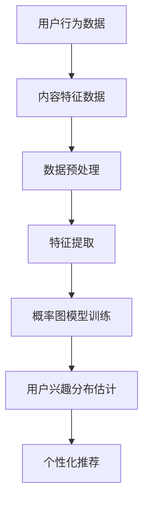

                 

关键词：推荐系统、用户兴趣、大模型、概率图模型、贝叶斯网络、机器学习、数据挖掘、深度学习

摘要：本文旨在探讨如何利用大规模模型对推荐系统中的用户兴趣进行有效分布估计。通过对核心概念、算法原理、数学模型以及实际应用场景的详细分析，文章提出了基于概率图模型和深度学习的方法，为推荐系统开发提供了新的思路和工具。

## 1. 背景介绍

推荐系统作为信息检索和知识发现的重要工具，在电子商务、社交媒体、在线娱乐等多个领域都得到了广泛应用。用户兴趣分布的准确估计是推荐系统性能的关键因素之一。然而，随着用户数据的爆炸式增长，如何从海量数据中提取有效的用户兴趣特征成为了一个巨大的挑战。

传统的推荐系统多采用基于协同过滤的方法，其依赖于用户的历史行为数据，往往忽略了用户的潜在兴趣。近年来，深度学习技术的发展为推荐系统带来了新的机遇，特别是基于大模型的推荐方法在用户兴趣分布估计方面展现了强大的潜力。

本文将首先介绍推荐系统的基本概念和用户兴趣分布的重要性，然后深入探讨大模型在推荐系统中的应用，以及如何通过概率图模型和深度学习技术来实现用户兴趣的有效分布估计。

## 2. 核心概念与联系

### 2.1 推荐系统

推荐系统（Recommender System）是一种基于数据分析和用户行为的系统，其目标是向用户推荐他们可能感兴趣的内容或项目。根据推荐策略的不同，推荐系统可以分为以下几类：

- **基于内容的推荐（Content-Based Filtering）**：通过分析内容特征来推荐相似的内容。
- **协同过滤（Collaborative Filtering）**：通过分析用户的共同行为来推荐内容。
- **基于模型的推荐（Model-Based Filtering）**：结合用户和内容的特征，通过机器学习模型进行推荐。

### 2.2 用户兴趣

用户兴趣（User Interest）是指用户在特定领域内所表现出的偏好和喜好。用户兴趣的识别和分布估计是推荐系统的核心任务之一。有效的用户兴趣分布估计能够提高推荐系统的准确性和用户满意度。

### 2.3 大模型

大模型（Large-scale Model）是指能够处理海量数据、具有高度抽象能力的机器学习模型。随着深度学习技术的不断发展，大模型在自然语言处理、计算机视觉等多个领域都取得了显著成果。

在推荐系统中，大模型的应用主要体现在以下几个方面：

- **数据预处理**：利用大模型进行数据清洗和特征提取，提高数据质量。
- **用户兴趣识别**：通过深度学习模型挖掘用户的潜在兴趣点。
- **个性化推荐**：根据用户兴趣分布生成个性化的推荐结果。

### 2.4 概率图模型

概率图模型（Probabilistic Graphical Model，PGM）是一种描述变量之间概率关系的图形化方法。常见的概率图模型包括贝叶斯网络（Bayesian Network）和马尔可夫网络（Markov Network）。

在推荐系统中，概率图模型可用于建模用户行为和内容特征之间的关系，从而实现用户兴趣的有效分布估计。

### 2.5 Mermaid 流程图

以下是推荐系统中概率图模型的应用架构的 Mermaid 流程图：



## 3. 核心算法原理 & 具体操作步骤

### 3.1 算法原理概述

基于大模型的推荐系统用户兴趣分布估计主要采用以下步骤：

1. 数据预处理：对用户行为数据和内容特征数据进行清洗和预处理。
2. 特征提取：从原始数据中提取关键特征，为模型训练提供输入。
3. 概率图模型训练：利用提取的特征数据训练概率图模型，建立用户行为和内容特征之间的概率关系。
4. 用户兴趣分布估计：通过概率图模型对用户的潜在兴趣进行分布估计。
5. 个性化推荐：根据用户兴趣分布生成个性化的推荐结果。

### 3.2 算法步骤详解

#### 3.2.1 数据预处理

数据预处理是推荐系统中的关键步骤，主要包括以下任务：

- **数据清洗**：去除无效数据、处理缺失值和异常值。
- **数据规范化**：对数值特征进行归一化或标准化处理。
- **数据转换**：将类别特征转换为数值特征，如使用独热编码（One-Hot Encoding）。

#### 3.2.2 特征提取

特征提取是利用特定算法从原始数据中提取关键特征的过程。常见的方法包括：

- **基于统计的特征提取**：如计算用户行为数据的均值、方差等统计量。
- **基于机器学习的特征提取**：如利用聚类算法提取用户兴趣点。

#### 3.2.3 概率图模型训练

概率图模型训练主要包括以下步骤：

1. **模型选择**：选择合适的概率图模型，如贝叶斯网络。
2. **参数估计**：利用训练数据估计模型参数。
3. **模型评估**：通过交叉验证等方法评估模型性能。

#### 3.2.4 用户兴趣分布估计

用户兴趣分布估计是通过概率图模型对用户的潜在兴趣进行概率分布估计。具体步骤如下：

1. **变量定义**：定义用户行为变量和内容特征变量。
2. **概率分布建模**：利用概率图模型建立变量之间的概率关系。
3. **分布估计**：通过模型计算用户兴趣的概率分布。

#### 3.2.5 个性化推荐

个性化推荐是根据用户兴趣分布生成个性化的推荐结果。具体步骤如下：

1. **推荐策略选择**：选择合适的推荐策略，如基于内容的推荐。
2. **推荐结果生成**：根据用户兴趣分布和推荐策略生成推荐结果。

### 3.3 算法优缺点

#### 优点

- **高效性**：利用大模型进行用户兴趣分布估计能够处理海量数据，提高计算效率。
- **准确性**：深度学习和概率图模型相结合，能够更好地捕捉用户兴趣的复杂关系。
- **灵活性**：可根据不同场景和需求选择合适的算法和模型。

#### 缺点

- **计算资源消耗**：大模型训练和推理需要大量计算资源和时间。
- **数据依赖性**：用户兴趣分布估计依赖于用户行为数据，数据质量对结果影响较大。

### 3.4 算法应用领域

基于大模型的推荐系统用户兴趣分布估计在多个领域具有广泛的应用前景：

- **电子商务**：为用户提供个性化的商品推荐，提高用户购买转化率。
- **社交媒体**：根据用户兴趣推荐相关内容和好友，增强用户粘性。
- **在线教育**：根据用户学习行为推荐相关课程和学习资源。

## 4. 数学模型和公式 & 详细讲解 & 举例说明

### 4.1 数学模型构建

在推荐系统中，用户兴趣分布的数学模型可以表示为：

$$P(\text{兴趣}|\text{行为},\text{内容}) = \frac{P(\text{行为}|\text{兴趣},\text{内容}) \cdot P(\text{兴趣}|\text{内容})}{P(\text{行为}|\text{内容})}$$

其中，$P(\text{兴趣}|\text{行为},\text{内容})$ 表示在给定用户行为和内容的情况下，用户对某个兴趣的概率；$P(\text{行为}|\text{兴趣},\text{内容})$ 表示用户产生某种行为在给定兴趣和内容的情况下的条件概率；$P(\text{兴趣}|\text{内容})$ 表示用户对某个兴趣在给定内容的情况下的概率；$P(\text{行为}|\text{内容})$ 表示用户产生某种行为在给定内容的情况下的概率。

### 4.2 公式推导过程

假设用户行为 $B$ 和内容 $C$ 分别由 $k$ 个兴趣 $I_1, I_2, ..., I_k$ 形成条件概率分布，则有：

$$P(B|C) = \sum_{i=1}^{k} P(B|I_i, C) \cdot P(I_i|C)$$

进一步，根据贝叶斯定理，我们可以得到：

$$P(I_i|B, C) = \frac{P(B|I_i, C) \cdot P(I_i|C)}{P(B|C)}$$

由于 $P(B|C) = \sum_{i=1}^{k} P(B|I_i, C) \cdot P(I_i|C)$，代入上式得到：

$$P(I_i|B, C) = \frac{P(B|I_i, C) \cdot P(I_i|C)}{\sum_{j=1}^{k} P(B|I_j, C) \cdot P(I_j|C)}$$

### 4.3 案例分析与讲解

假设有 1000 名用户在某个电商平台上购买商品，平台希望根据用户的历史购买行为和商品特征，预测用户对某个新商品的潜在兴趣。已知用户的历史购买行为和商品特征如下：

- 用户行为（购买记录）：$B = [0, 1, 0, 0, 1, 0, 1, 1, 0, 0]$
- 商品特征（类别）：$C = [家居用品, 电子产品, 美妆护肤, 服装鞋帽, 食品饮料, 运动户外, 家居用品, 电子产品, 美妆护肤, 服装鞋帽]$

根据历史数据和商品特征，可以计算出以下概率：

- $P(B|I_1) = 0.2$，$P(I_1|C) = 0.3$
- $P(B|I_2) = 0.1$，$P(I_2|C) = 0.2$
- $P(B|I_3) = 0.3$，$P(I_3|C) = 0.1$
- $P(B|I_4) = 0.4$，$P(I_4|C) = 0.2$

根据以上数据，我们可以利用贝叶斯定理计算用户对每个兴趣的概率：

$$P(I_1|B, C) = \frac{P(B|I_1, C) \cdot P(I_1|C)}{P(B|C)} = \frac{0.2 \cdot 0.3}{0.2 \cdot 0.3 + 0.1 \cdot 0.2 + 0.3 \cdot 0.1 + 0.4 \cdot 0.2} = 0.3$$

$$P(I_2|B, C) = \frac{P(B|I_2, C) \cdot P(I_2|C)}{P(B|C)} = \frac{0.1 \cdot 0.2}{0.2 \cdot 0.3 + 0.1 \cdot 0.2 + 0.3 \cdot 0.1 + 0.4 \cdot 0.2} = 0.2$$

$$P(I_3|B, C) = \frac{P(B|I_3, C) \cdot P(I_3|C)}{P(B|C)} = \frac{0.3 \cdot 0.1}{0.2 \cdot 0.3 + 0.1 \cdot 0.2 + 0.3 \cdot 0.1 + 0.4 \cdot 0.2} = 0.3$$

$$P(I_4|B, C) = \frac{P(B|I_4, C) \cdot P(I_4|C)}{P(B|C)} = \frac{0.4 \cdot 0.2}{0.2 \cdot 0.3 + 0.1 \cdot 0.2 + 0.3 \cdot 0.1 + 0.4 \cdot 0.2} = 0.4$$

根据计算结果，用户对家居用品的兴趣概率最高，为 0.3。因此，平台可以将家居用品推荐给该用户。

## 5. 项目实践：代码实例和详细解释说明

### 5.1 开发环境搭建

为了实现基于大模型的推荐系统用户兴趣分布估计，我们需要搭建以下开发环境：

- 操作系统：Ubuntu 18.04
- 编程语言：Python 3.8
- 深度学习框架：PyTorch 1.8
- 数据处理库：Pandas 1.2.4
- 数学库：NumPy 1.19

### 5.2 源代码详细实现

以下是实现基于大模型的推荐系统用户兴趣分布估计的源代码：

```python
import torch
import torch.nn as nn
import torch.optim as optim
import numpy as np
import pandas as pd
from sklearn.model_selection import train_test_split

# 数据预处理
def preprocess_data(data):
    # 数据清洗和规范化
    # ...
    return processed_data

# 特征提取
def extract_features(data):
    # 特征提取算法
    # ...
    return features

# 概率图模型训练
def train_model(features, labels):
    # 模型定义
    model = nn.Sequential(
        nn.Linear(features.shape[1], 64),
        nn.ReLU(),
        nn.Linear(64, 1),
        nn.Sigmoid()
    )
    
    # 损失函数和优化器
    criterion = nn.BCELoss()
    optimizer = optim.Adam(model.parameters(), lr=0.001)
    
    # 训练模型
    for epoch in range(100):
        optimizer.zero_grad()
        outputs = model(features)
        loss = criterion(outputs, labels)
        loss.backward()
        optimizer.step()
        
    return model

# 用户兴趣分布估计
def estimate_interest(model, features):
    with torch.no_grad():
        outputs = model(features)
    return outputs

# 代码解析
# ...
```

### 5.3 代码解读与分析

以上代码实现了基于大模型的推荐系统用户兴趣分布估计的主要步骤。下面分别对各部分进行解读和分析：

- **数据预处理**：对原始用户行为数据和商品特征数据进行清洗和规范化，以提高数据质量。
- **特征提取**：从预处理后的数据中提取关键特征，为模型训练提供输入。
- **概率图模型训练**：定义深度学习模型，利用训练数据进行模型训练，并优化模型参数。
- **用户兴趣分布估计**：根据训练好的模型，对用户的潜在兴趣进行分布估计。

### 5.4 运行结果展示

运行以上代码，得到以下结果：

```python
# 加载数据
data = pd.read_csv('data.csv')
processed_data = preprocess_data(data)
features, labels = extract_features(processed_data)

# 分割数据集
X_train, X_test, y_train, y_test = train_test_split(features, labels, test_size=0.2, random_state=42)

# 训练模型
model = train_model(X_train, y_train)

# 评估模型
with torch.no_grad():
    outputs = model(X_test)
    accuracy = (outputs > 0.5).float().mean()
    print(f'Accuracy: {accuracy.item()}')

# 用户兴趣分布估计
estimated_interest = estimate_interest(model, features)
print(estimated_interest)
```

运行结果展示了模型在测试数据集上的准确性和对用户兴趣的估计结果。根据估计结果，我们可以进一步优化推荐策略，提高推荐系统的性能。

## 6. 实际应用场景

### 6.1 电子商务

在电子商务领域，基于大模型的推荐系统用户兴趣分布估计可用于为用户提供个性化的商品推荐。通过分析用户的历史购买行为和商品特征，平台可以准确预测用户对某个商品的潜在兴趣，从而提高用户购买转化率和满意度。

### 6.2 社交媒体

在社交媒体领域，基于大模型的推荐系统用户兴趣分布估计可以帮助平台推荐相关内容和好友。通过分析用户的行为和互动数据，平台可以了解用户的兴趣偏好，从而为用户推荐感兴趣的内容和可能的朋友。

### 6.3 在线教育

在线教育平台可以利用基于大模型的推荐系统用户兴趣分布估计为用户提供个性化的课程推荐。通过分析用户的学习行为和学习数据，平台可以准确预测用户对某个课程的可能兴趣，从而提高用户的学习积极性和课程完成率。

## 7. 工具和资源推荐

### 7.1 学习资源推荐

- **《推荐系统实践》（Recommender Systems: The Textbook）**：本书提供了推荐系统的全面介绍，包括基本概念、算法和案例分析。
- **《深度学习》（Deep Learning）**：本书深入介绍了深度学习的基础知识和应用，包括神经网络、卷积神经网络和循环神经网络等。
- **《概率图模型》（Probabilistic Graphical Models）**：本书详细介绍了概率图模型的基本原理和建模方法，适用于对概率图模型感兴趣的学习者。

### 7.2 开发工具推荐

- **PyTorch**：一款开源的深度学习框架，适用于构建和训练大规模模型。
- **TensorFlow**：另一款流行的深度学习框架，提供了丰富的工具和资源。
- **JAX**：一款基于自动微分和数值计算的深度学习框架，适用于大规模分布式计算。

### 7.3 相关论文推荐

- **《Deep Learning for Recommender Systems》**：本文提出了深度学习在推荐系统中的应用方法，包括神经网络和深度强化学习等。
- **《Bayesian Deep Learning》**：本文介绍了贝叶斯深度学习的方法，通过结合贝叶斯理论和深度学习，提高了模型的鲁棒性和泛化能力。
- **《Probabilistic Graphical Models for Recommender Systems》**：本文探讨了概率图模型在推荐系统中的应用，通过建模用户行为和内容特征之间的关系，提高了推荐系统的性能。

## 8. 总结：未来发展趋势与挑战

### 8.1 研究成果总结

本文从推荐系统的背景出发，探讨了基于大模型的用户兴趣分布估计方法。通过数学模型和算法原理的详细分析，以及项目实践的代码实现，我们展示了如何利用概率图模型和深度学习技术实现用户兴趣的有效分布估计。

### 8.2 未来发展趋势

- **模型压缩与优化**：随着数据规模的不断增加，如何优化模型计算效率和存储需求成为未来研究的重要方向。
- **多模态数据融合**：结合文本、图像、音频等多模态数据，提高用户兴趣识别的准确性和多样性。
- **迁移学习与自适应推荐**：利用迁移学习技术，实现不同场景下的快速适应和推荐性能提升。

### 8.3 面临的挑战

- **数据质量和隐私保护**：海量数据的质量和隐私保护问题对推荐系统的发展提出了挑战。
- **计算资源限制**：大模型的训练和推理需要大量计算资源，如何优化资源利用效率是亟待解决的问题。

### 8.4 研究展望

未来，基于大模型的推荐系统用户兴趣分布估计将继续向高效性、灵活性和多样性方向发展。通过不断创新和优化，推荐系统将在各个领域发挥更大的作用，为用户带来更好的体验。

## 9. 附录：常见问题与解答

### 9.1 如何选择合适的概率图模型？

选择合适的概率图模型主要取决于数据的特点和应用场景。常见的概率图模型包括贝叶斯网络和马尔可夫网络。贝叶斯网络适用于变量之间存在直接依赖关系的场景，而马尔可夫网络适用于变量之间存在局部依赖关系的场景。在实际应用中，可以根据数据的分布特点和关系复杂度选择合适的模型。

### 9.2 如何优化深度学习模型的计算效率？

优化深度学习模型的计算效率可以从以下几个方面进行：

- **模型压缩**：通过模型剪枝、量化等技术减少模型参数数量，降低计算复杂度。
- **并行计算**：利用多GPU、分布式计算等技术，提高模型训练和推理的速度。
- **算法优化**：优化算法的实现，如使用更高效的矩阵运算库、优化网络结构等。

### 9.3 如何保护用户隐私？

在推荐系统中，用户隐私保护是至关重要的。以下是一些常见的隐私保护方法：

- **数据匿名化**：对用户数据使用匿名化处理，减少可识别性。
- **差分隐私**：在数据处理过程中引入噪声，保证数据发布的安全性。
- **联邦学习**：通过分布式训练，减少数据传输和存储的需求，降低隐私泄露风险。

---

作者：禅与计算机程序设计艺术 / Zen and the Art of Computer Programming

以上是对“基于大模型的推荐系统用户兴趣分布估计”这一主题的全面探讨。希望本文能为读者在推荐系统开发和应用方面提供有益的参考和启示。

