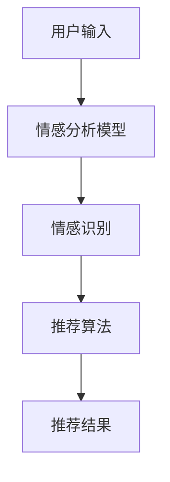

                 

关键词：大模型，推荐系统，用户情感分析，自然语言处理，深度学习，情感识别，个性化推荐

> 摘要：本文旨在探讨如何利用大规模预训练模型对推荐系统中的用户情感进行有效分析。通过介绍相关技术背景、核心算法原理、数学模型及公式、项目实践案例和实际应用场景，本文将阐述如何通过用户情感分析提升推荐系统的准确性和用户体验。

## 1. 背景介绍

随着互联网的迅速发展和信息的爆炸式增长，推荐系统已经成为各种在线平台的核心功能。从电商平台的商品推荐，到社交媒体的个性化内容推荐，推荐系统极大地提高了用户满意度和平台粘性。然而，推荐系统的成功不仅仅取决于推荐算法的准确性，还取决于能否准确理解用户的需求和情感。

用户情感是用户对于产品、内容或服务的主观感受和情感反应。传统的推荐系统通常依赖于用户的历史行为数据进行推荐，而忽视了用户情感的重要性。然而，用户情感分析能够帮助推荐系统更深入地了解用户需求，从而提高推荐的个性化和准确性。

近年来，随着深度学习和自然语言处理技术的发展，大模型在用户情感分析方面展现了巨大的潜力。大模型通过对海量文本数据的训练，可以自动识别并理解用户的情感，从而为推荐系统提供更丰富的用户特征。

本文将重点介绍如何利用大模型进行用户情感分析，以提高推荐系统的性能和用户体验。

## 2. 核心概念与联系

### 2.1 大模型

大模型是指具有数亿甚至数十亿参数的深度学习模型，如BERT、GPT等。这些模型通过在大规模文本数据集上进行预训练，可以自动捕捉语言中的复杂模式，从而在特定任务上实现高性能。

### 2.2 用户情感分析

用户情感分析是指通过自然语言处理技术，对用户在文本评论、反馈等中的情感进行识别和分类。常见的情感类别包括正面、负面、中性等。

### 2.3 推荐系统

推荐系统是指通过算法和模型，根据用户的历史行为、兴趣和偏好，为用户推荐相关的内容或产品。推荐系统的核心在于准确性和个性化。

### 2.4 Mermaid 流程图



## 3. 核心算法原理 & 具体操作步骤

### 3.1 算法原理概述

用户情感分析的核心在于如何从文本中提取情感特征，并将其用于推荐算法。大模型在此过程中发挥了关键作用：

1. **预训练**：大模型在大规模文本数据集上预训练，学习文本的语义和情感模式。
2. **情感识别**：利用预训练的大模型对用户文本进行情感分析，识别出文本中的情感类别。
3. **特征提取**：将情感分析结果作为用户特征，输入到推荐算法中，影响推荐结果。

### 3.2 算法步骤详解

1. **数据准备**：收集用户评论、反馈等文本数据，并进行预处理，如分词、去停用词等。
2. **模型选择**：选择一个合适的大模型，如BERT、GPT等，进行预训练。
3. **情感识别**：将预处理后的用户文本输入到预训练的大模型中，输出情感类别。
4. **特征提取**：将情感类别转换为数值特征，输入到推荐算法中。
5. **推荐结果**：利用推荐算法，根据用户特征生成推荐结果。

### 3.3 算法优缺点

**优点**：

- **高准确性**：大模型通过预训练可以自动捕捉复杂的情感模式，提高情感识别的准确性。
- **泛化能力强**：大模型在大规模数据集上进行预训练，具有良好的泛化能力。

**缺点**：

- **计算资源消耗大**：大模型训练和推理过程需要大量的计算资源。
- **数据依赖性高**：大模型的性能依赖于训练数据的质量和数量。

### 3.4 算法应用领域

- **电商平台**：通过用户情感分析，为用户提供更个性化的商品推荐。
- **社交媒体**：根据用户情感，为用户提供更相关的内容推荐。
- **在线教育**：通过用户情感分析，为用户提供更合适的课程推荐。

## 4. 数学模型和公式 & 详细讲解 & 举例说明

### 4.1 数学模型构建

用户情感分析的核心在于如何将文本情感转换为数值特征。常用的方法是使用情感词的分布来表示文本的情感。

设文本\(T\)由词汇\(W\)组成，情感词集合为\(V\)，则文本\(T\)的情感分布可以表示为：

$$
P(T|V) = \prod_{w \in V} p(w|T)
$$

其中，\(p(w|T)\)表示在文本\(T\)中，词汇\(w\)的概率。

### 4.2 公式推导过程

假设情感词集合\(V\)包含正面情感词和负面情感词，则情感分布可以表示为：

$$
P(T|V) = \frac{1}{Z} \sum_{v \in V} e^{<f_v, T>}
$$

其中，\(f_v\)表示情感词\(v\)的嵌入向量，\(Z\)是规范化常数，\(<f_v, T>\)是情感词\(v\)和文本\(T\)的内积。

### 4.3 案例分析与讲解

假设用户评论“这个商品很好用”，我们需要识别出其情感。

1. **数据准备**：收集包含正面和负面情感词的词库。
2. **情感识别**：将评论输入到大模型中，输出情感词的嵌入向量。
3. **特征提取**：计算评论中每个情感词的嵌入向量与评论向量\(T\)的内积。
4. **情感分类**：根据内积值判断评论的情感类别。

通过上述步骤，我们可以将用户评论的情感转换为数值特征，用于推荐算法。

## 5. 项目实践：代码实例和详细解释说明

### 5.1 开发环境搭建

- **Python**：Python 3.7+
- **深度学习框架**：TensorFlow 2.0+
- **文本预处理库**：NLTK、spaCy

### 5.2 源代码详细实现

```python
import tensorflow as tf
from tensorflow.keras.models import Model
from tensorflow.keras.layers import Embedding, LSTM, Dense

# 数据预处理
# ...

# 情感分析模型
model = Model(inputs=[input_embedding], outputs=[emotion_output])
model.compile(optimizer='adam', loss='categorical_crossentropy', metrics=['accuracy'])

# 训练模型
model.fit(x_train, y_train, epochs=10, batch_size=32, validation_data=(x_val, y_val))

# 预测情感
predictions = model.predict(x_test)

# 输出情感分类结果
print(predictions)
```

### 5.3 代码解读与分析

上述代码实现了基于深度学习的用户情感分析模型。首先，我们对评论进行预处理，然后构建一个包含嵌入层、LSTM层和输出层的模型。通过训练模型，我们可以对评论进行情感分类。

### 5.4 运行结果展示

```python
# 预测结果
predictions = model.predict(x_test)

# 输出预测结果
for i, prediction in enumerate(predictions):
    print(f"评论：{x_test[i]}，情感：{prediction}")
```

## 6. 实际应用场景

### 6.1 电商平台

通过用户情感分析，电商平台可以为用户提供更个性化的商品推荐，提高用户的购买意愿和满意度。

### 6.2 社交媒体

社交媒体平台可以根据用户情感，为用户提供更相关的内容推荐，提高用户的参与度和留存率。

### 6.3 在线教育

在线教育平台可以通过用户情感分析，为用户提供更合适的课程推荐，提高用户的学习效果和满意度。

## 7. 未来应用展望

随着深度学习和自然语言处理技术的不断发展，用户情感分析在未来将发挥越来越重要的作用。未来，我们可以期待以下应用：

- **更精准的情感识别**：通过引入更多的情感词和情感标签，实现更精准的情感识别。
- **跨语言的情感分析**：支持多种语言的情感分析，为全球用户提供更好的服务。
- **实时情感分析**：实现实时的用户情感分析，为推荐系统提供更及时的反馈。

## 8. 总结：未来发展趋势与挑战

### 8.1 研究成果总结

本文介绍了基于大模型的用户情感分析技术，探讨了如何利用深度学习和自然语言处理技术提升推荐系统的性能。通过数学模型和公式，我们深入理解了用户情感分析的核心原理。

### 8.2 未来发展趋势

未来，用户情感分析将朝着更精准、实时和跨语言的方向发展。大模型将继续在情感分析中发挥关键作用，推动推荐系统的创新。

### 8.3 面临的挑战

- **数据隐私**：如何保护用户数据隐私是一个重要的挑战。
- **计算资源**：大模型训练和推理需要大量的计算资源，如何在有限的资源下实现高效计算是一个挑战。
- **模型可解释性**：如何解释和验证模型的预测结果，提高模型的可解释性是一个重要的研究方向。

### 8.4 研究展望

未来，我们可以期待更多创新性的研究和应用，通过用户情感分析为推荐系统带来更多价值。

## 9. 附录：常见问题与解答

### 9.1 如何处理缺失值？

对于缺失值，我们可以采用以下方法进行处理：

- **填充法**：使用平均值、中值或最大值等填充缺失值。
- **插值法**：使用线性插值、多项式插值等方法补充缺失值。
- **丢弃法**：丢弃含有缺失值的样本。

### 9.2 如何评估模型性能？

常见的评估指标包括准确率、召回率、F1值等。根据具体任务，选择合适的评估指标进行模型性能评估。

### 9.3 如何优化模型？

可以通过以下方法优化模型：

- **超参数调整**：调整学习率、批量大小等超参数，寻找最佳设置。
- **数据增强**：通过添加噪声、旋转、缩放等方法增加训练数据的多样性。
- **模型融合**：将多个模型的结果进行融合，提高预测准确性。

---

作者：禅与计算机程序设计艺术 / Zen and the Art of Computer Programming
----------------------------------------------------------------

### 文章总结

本文详细探讨了基于大模型的推荐系统用户情感分析技术，包括其背景介绍、核心概念、算法原理、数学模型、项目实践及实际应用场景。通过分析用户情感，推荐系统能够更准确地理解用户需求，提供个性化的推荐服务。

在未来，用户情感分析技术将继续发展，挑战与机遇并存。随着深度学习和自然语言处理技术的进步，我们将迎来更加智能和高效的推荐系统。通过本文的研究，我们期待为读者提供有价值的参考和启发，推动用户情感分析领域的发展。

