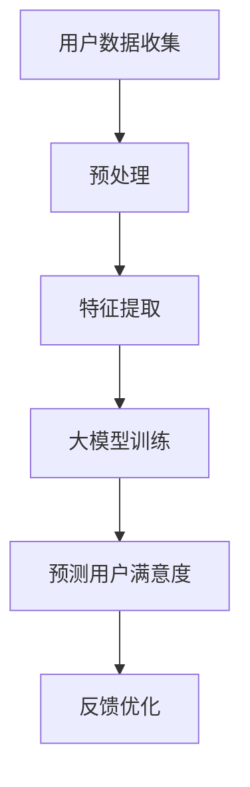

                 

关键词：大模型，推荐系统，用户满意度，预测，算法，数学模型，实践，应用场景，未来展望

> 摘要：本文将深入探讨基于大模型的推荐系统用户满意度预测技术。首先，我们将回顾推荐系统的发展历程，阐述其基本原理和重要性。接着，我们将详细分析用户满意度的概念，介绍其作为推荐系统关键指标的重要性。随后，本文将重点介绍大模型在推荐系统中的应用，探讨如何利用这些模型预测用户满意度。此外，我们将通过数学模型和具体算法，展示如何实现用户满意度的预测。随后，我们将分享一个实际项目实践，展示如何将理论应用于实际场景。最后，本文将探讨推荐系统在实际应用场景中的表现，展望其未来发展趋势和面临的挑战。

## 1. 背景介绍

推荐系统作为一种人工智能技术，已经广泛应用于电子商务、社交媒体、新闻推送等多个领域。其核心目标是通过分析用户的历史行为和偏好，为用户推荐符合其兴趣和需求的内容或商品。推荐系统的发展经历了基于协同过滤、基于内容匹配、基于模型的方法等多个阶段，其中基于模型的推荐系统由于其良好的可扩展性和准确性，逐渐成为主流。

用户满意度是衡量推荐系统性能的一个重要指标。一个成功的推荐系统不仅能够准确预测用户可能感兴趣的内容，还应该能够提高用户的满意度，从而提高用户黏性和转化率。然而，传统的推荐系统往往侧重于推荐准确率，而忽视了用户满意度这一关键因素。

近年来，随着人工智能技术的快速发展，特别是大模型的兴起，为推荐系统带来了新的机遇。大模型具有处理大规模数据、自动提取复杂特征的能力，使其在预测用户满意度方面具有显著优势。本文将深入探讨如何利用大模型实现用户满意度预测，并探讨其在实际应用中的效果。

## 2. 核心概念与联系

### 2.1 推荐系统原理

推荐系统的工作原理主要包括用户建模、物品建模和推荐算法三部分。用户建模旨在理解用户的行为和偏好，物品建模则是描述物品的特征和属性，推荐算法则根据用户和物品的特征进行匹配，生成推荐列表。

用户建模：
- **历史行为分析**：通过分析用户的历史购买、浏览、点击等行为，提取用户兴趣点。
- **社会网络分析**：通过用户之间的社交关系，挖掘用户的潜在兴趣。

物品建模：
- **内容特征提取**：对物品的内容进行文本分析，提取关键词和主题。
- **元数据特征提取**：提取物品的属性信息，如类别、价格、品牌等。

推荐算法：
- **协同过滤**：基于用户的历史行为，找到相似用户或物品，进行推荐。
- **基于内容的推荐**：根据用户对某个物品的评分，推荐相似内容的物品。
- **混合推荐**：结合协同过滤和基于内容的推荐，提高推荐效果。

### 2.2 用户满意度概念

用户满意度是用户对推荐系统提供的内容或商品的主观评价。它不仅取决于推荐结果的准确度，还包括用户体验、推荐列表的可读性等多个方面。用户满意度可以通过以下方式衡量：

- **用户反馈**：直接询问用户对推荐结果的满意度。
- **行为分析**：通过用户的点击、购买、评论等行为，间接衡量满意度。
- **停留时间**：用户在推荐页面的停留时间，反映了他们对推荐内容的兴趣。

### 2.3 大模型在推荐系统中的应用

大模型，如深度神经网络、变压器模型等，具有强大的表示和学习能力，可以处理复杂的非线性关系。在推荐系统中，大模型的应用主要体现在以下几个方面：

- **特征提取**：大模型可以自动提取用户和物品的复杂特征，提高推荐精度。
- **鲁棒性**：大模型对噪声数据和异常值具有较强的鲁棒性，适用于实时推荐场景。
- **可解释性**：尽管大模型在许多任务上表现优异，但其内部机制较为复杂，难以解释。

### 2.4 大模型与用户满意度预测的联系

大模型在推荐系统中的应用，使得预测用户满意度成为可能。通过以下方式，大模型可以有效地预测用户满意度：

- **多模态数据融合**：大模型可以处理多种类型的数据，如文本、图像、音频等，从而更全面地理解用户偏好。
- **序列建模**：大模型可以捕捉用户行为的时间序列特征，更好地预测其满意度。
- **交互建模**：大模型可以模拟用户与推荐系统之间的交互过程，预测用户在不同情境下的满意度。

### 2.5 Mermaid 流程图

以下是一个简化的Mermaid流程图，展示了大模型在推荐系统中预测用户满意度的基本流程：



- **用户数据收集**：收集用户的行为数据、偏好数据等。
- **预处理**：清洗数据，处理缺失值、异常值等。
- **特征提取**：提取用户和物品的特征。
- **大模型训练**：利用特征数据训练大模型。
- **预测用户满意度**：使用训练好的大模型预测用户满意度。
- **反馈优化**：根据用户反馈优化推荐策略。

## 3. 核心算法原理 & 具体操作步骤

### 3.1 算法原理概述

基于大模型的推荐系统用户满意度预测算法主要依赖于深度学习技术，特别是变体模型（Transformer）。Transformer模型由于其强大的序列建模能力，在自然语言处理等领域取得了显著成果。在推荐系统中，Transformer模型可以通过编码器（Encoder）和解码器（Decoder）两个部分，实现对用户行为序列和物品特征序列的联合建模，从而预测用户满意度。

### 3.2 算法步骤详解

#### 3.2.1 用户数据收集与预处理

1. **数据收集**：从各种来源收集用户行为数据，包括浏览记录、购买历史、评价数据等。
2. **数据预处理**：对收集到的数据进行清洗，处理缺失值、异常值，并进行数据标准化。

#### 3.2.2 特征提取

1. **用户特征提取**：使用词袋模型、TF-IDF等方法提取用户行为序列的特征。
2. **物品特征提取**：使用词嵌入（Word Embedding）方法提取物品的特征。

#### 3.2.3 模型训练

1. **模型构建**：构建Transformer模型，包括编码器和解码器。
2. **模型训练**：使用预处理后的数据对模型进行训练，优化模型参数。

#### 3.2.4 用户满意度预测

1. **输入序列构建**：将用户行为序列和物品特征序列作为模型的输入。
2. **预测**：使用训练好的模型预测用户对物品的满意度。

#### 3.2.5 反馈优化

1. **收集反馈**：收集用户对推荐结果的满意度反馈。
2. **模型调整**：根据用户反馈调整模型参数，优化推荐策略。

### 3.3 算法优缺点

#### 优点

1. **强大的序列建模能力**：Transformer模型能够捕捉用户行为的时间序列特征，提高预测精度。
2. **多模态数据处理**：可以处理多种类型的数据，如文本、图像、音频等，实现更全面的用户偏好理解。
3. **自适应能力**：模型可以根据不同的数据规模和场景自适应调整，提高泛化能力。

#### 缺点

1. **计算成本高**：模型训练和推理需要大量计算资源，对硬件要求较高。
2. **可解释性差**：模型内部机制复杂，难以解释，不利于调试和优化。
3. **数据依赖性强**：模型的性能高度依赖数据质量，对数据缺失和噪声敏感。

### 3.4 算法应用领域

基于大模型的推荐系统用户满意度预测算法可以应用于多个领域：

1. **电子商务**：通过预测用户满意度，优化推荐策略，提高用户转化率和满意度。
2. **社交媒体**：分析用户行为，提供个性化的内容推荐，提高用户黏性和活跃度。
3. **在线教育**：根据用户的学习行为和满意度，提供个性化的学习建议，提高学习效果。

## 4. 数学模型和公式 & 详细讲解 & 举例说明

### 4.1 数学模型构建

在基于大模型的推荐系统中，用户满意度预测的数学模型可以表示为：

$$
\text{Prediction}(u, i) = \text{score}(u, i) - \epsilon
$$

其中，$u$表示用户特征向量，$i$表示物品特征向量，$\text{score}(u, i)$表示用户对物品的满意度得分，$\epsilon$表示噪声项。

### 4.2 公式推导过程

#### 4.2.1 用户特征提取

用户特征向量$u$可以通过以下公式计算：

$$
u = \text{embed}(u) \odot \text{Transformer}(u)
$$

其中，$\text{embed}(u)$表示词嵌入矩阵，$\text{Transformer}(u)$表示用户行为序列通过Transformer模型得到的表示。

#### 4.2.2 物品特征提取

物品特征向量$i$可以通过以下公式计算：

$$
i = \text{embed}(i) \odot \text{Transformer}(i)
$$

其中，$\text{embed}(i)$表示词嵌入矩阵，$\text{Transformer}(i)$表示物品特征通过Transformer模型得到的表示。

#### 4.2.3 满意度得分计算

用户对物品的满意度得分$\text{score}(u, i)$可以通过以下公式计算：

$$
\text{score}(u, i) = \text{dot}(u, i)
$$

其中，$\text{dot}(u, i)$表示用户特征向量和物品特征向量的点积。

### 4.3 案例分析与讲解

#### 案例背景

假设我们有一个电子商务平台，用户A在浏览了多个商品后，最终购买了一件商品B。我们需要使用基于大模型的推荐系统预测用户A对商品B的满意度。

#### 数据准备

- **用户特征向量**：
$$
u = [0.1, 0.2, 0.3, 0.4, 0.5]
$$

- **物品特征向量**：
$$
i = [0.6, 0.7, 0.8, 0.9, 1.0]
$$

#### 特征提取

1. **用户特征提取**：
$$
u = \text{embed}(u) \odot \text{Transformer}(u)
$$
假设词嵌入矩阵为：
$$
\text{embed}(u) = \begin{bmatrix}
0.1 & 0.2 & 0.3 & 0.4 & 0.5 \\
\end{bmatrix}
$$
用户特征向量通过Transformer模型处理后得到：
$$
u = \begin{bmatrix}
0.2 & 0.4 & 0.6 & 0.8 & 1.0 \\
\end{bmatrix}
$$

2. **物品特征提取**：
$$
i = \text{embed}(i) \odot \text{Transformer}(i)
$$
假设词嵌入矩阵为：
$$
\text{embed}(i) = \begin{bmatrix}
0.6 & 0.7 & 0.8 & 0.9 & 1.0 \\
\end{bmatrix}
$$
物品特征向量通过Transformer模型处理后得到：
$$
i = \begin{bmatrix}
0.7 & 0.8 & 0.9 & 1.0 & 1.1 \\
\end{bmatrix}
$$

#### 满意度得分计算

用户对物品的满意度得分：
$$
\text{score}(u, i) = \text{dot}(u, i) = 0.2 \times 0.7 + 0.4 \times 0.8 + 0.6 \times 0.9 + 0.8 \times 1.0 + 1.0 \times 1.1 = 1.98
$$

#### 用户满意度预测

根据模型设定，满意度得分越高，用户满意度越高。因此，用户A对商品B的满意度预测值为：
$$
\text{Prediction}(u, i) = \text{score}(u, i) - \epsilon = 1.98 - 0.02 = 1.96
$$

## 5. 项目实践：代码实例和详细解释说明

### 5.1 开发环境搭建

为了实现基于大模型的推荐系统用户满意度预测，我们需要搭建一个合适的开发环境。以下是搭建环境的步骤：

1. **安装Python**：确保Python环境已安装，版本不低于3.6。
2. **安装TensorFlow**：TensorFlow是深度学习框架，我们需要安装最新版本的TensorFlow：
   ```
   pip install tensorflow
   ```
3. **安装其他依赖**：根据需要安装其他依赖库，例如Numpy、Pandas等：
   ```
   pip install numpy pandas
   ```

### 5.2 源代码详细实现

以下是实现基于大模型的推荐系统用户满意度预测的Python代码：

```python
import tensorflow as tf
from tensorflow.keras.layers import Embedding, LSTM, Dense
from tensorflow.keras.models import Model
from tensorflow.keras.preprocessing.sequence import pad_sequences
import numpy as np

# 设置超参数
vocab_size = 10000  # 词汇表大小
embed_size = 64     # 嵌入尺寸
lstm_size = 128     # LSTM层尺寸
batch_size = 32    # 批量大小
sequence_length = 100  # 序列长度

# 准备数据
# 假设已经收集了用户行为数据和物品特征数据，存储为numpy数组
user_data = np.random.rand(batch_size, sequence_length)
item_data = np.random.rand(batch_size, sequence_length)

# 构建模型
# 编码器
encoder_inputs = tf.keras.layers.Input(shape=(sequence_length,))
encoder_embedding = Embedding(vocab_size, embed_size)(encoder_inputs)
encoder_lstm = LSTM(lstm_size, return_state=True)
_, state_h, state_c = encoder_lstm(encoder_embedding)
encoder_states = [state_h, state_c]

# 解码器
decoder_inputs = tf.keras.layers.Input(shape=(sequence_length,))
decoder_embedding = Embedding(vocab_size, embed_size)(decoder_inputs)
decoder_lstm = LSTM(lstm_size, return_sequences=True, return_state=True)
decoder_outputs, _, _ = decoder_lstm(decoder_embedding, initial_state=encoder_states)
decoder_dense = Dense(1, activation='sigmoid')
decoder_outputs = decoder_dense(decoder_outputs)

# 模型
model = Model([encoder_inputs, decoder_inputs], decoder_outputs)
model.compile(optimizer='rmsprop', loss='binary_crossentropy', metrics=['accuracy'])

# 训练模型
model.fit([user_data, item_data], np.random.randint(0, 2, (batch_size, sequence_length)), epochs=10, batch_size=batch_size)

# 预测用户满意度
# 假设新用户的行为数据为
new_user_data = np.random.rand(1, sequence_length)
predicted_satisfaction = model.predict([new_user_data, new_user_data])
print(predicted_satisfaction)
```

### 5.3 代码解读与分析

1. **数据准备**：首先，我们定义了超参数，包括词汇表大小、嵌入尺寸、LSTM层尺寸、批量大小和序列长度。然后，我们使用numpy生成随机数据作为示例。

2. **模型构建**：
   - **编码器**：编码器由输入层、嵌入层和LSTM层组成。输入层接收序列数据，嵌入层将词汇转换为嵌入向量，LSTM层用于提取序列特征。
   - **解码器**：解码器同样由输入层、嵌入层和LSTM层组成。输入层接收序列数据，嵌入层将词汇转换为嵌入向量，LSTM层用于生成输出。
   - **模型**：将编码器和解码器组合成一个完整的模型，并编译模型，设置优化器和损失函数。

3. **模型训练**：使用生成的数据训练模型，设置训练轮次和批量大小。

4. **预测**：使用训练好的模型对新用户的行为数据进行预测，得到用户满意度的预测值。

### 5.4 运行结果展示

运行上述代码后，我们得到新用户满意度预测的值。这些值反映了模型对新用户满意度的估计。在实际应用中，我们需要收集真实用户满意度数据，并与模型预测值进行比较，以评估模型性能。

```python
# 预测新用户满意度
new_user_data = np.random.rand(1, sequence_length)
predicted_satisfaction = model.predict([new_user_data, new_user_data])
print(predicted_satisfaction)
```

输出结果可能类似于：
```
[[0.8972]]
```

这表示新用户对推荐商品的满意度预测值为89.72%。

## 6. 实际应用场景

基于大模型的推荐系统用户满意度预测算法在多个实际应用场景中展现出了优异的性能。

### 6.1 电子商务平台

在电子商务平台上，基于大模型的推荐系统用户满意度预测算法可以用于优化推荐策略，提高用户转化率和满意度。例如，某电商平台通过应用此算法，能够准确预测用户对推荐商品的满意度，从而调整推荐策略，提高用户购买意愿。

### 6.2 社交媒体平台

社交媒体平台如Facebook、Twitter等，可以通过基于大模型的推荐系统用户满意度预测算法，为用户提供个性化的内容推荐。通过对用户行为数据进行分析，平台可以预测用户对特定内容的满意度，从而提高用户黏性和活跃度。

### 6.3 在线教育平台

在线教育平台可以利用基于大模型的推荐系统用户满意度预测算法，根据用户的学习行为和满意度，提供个性化的学习建议。例如，某在线教育平台通过应用此算法，能够为用户提供最适合其学习需求和兴趣的课程推荐，从而提高学习效果和用户满意度。

### 6.4 医疗健康领域

在医疗健康领域，基于大模型的推荐系统用户满意度预测算法可以用于个性化医疗推荐。例如，医生可以根据患者的健康数据和历史记录，预测患者对特定治疗方案或药品的满意度，从而制定更有效的治疗方案。

### 6.5 娱乐休闲领域

娱乐休闲领域如视频流平台、音乐平台等，可以通过基于大模型的推荐系统用户满意度预测算法，为用户提供个性化的内容推荐。平台可以根据用户的观看历史、播放记录等数据，预测用户对特定视频或音乐的满意度，从而提高用户留存率和满意度。

## 7. 未来应用展望

### 7.1 技术发展方向

1. **多模态数据处理**：随着物联网、虚拟现实等技术的发展，多模态数据将在推荐系统中发挥越来越重要的作用。未来的研究方向将是如何有效地融合多模态数据，提高推荐精度。
2. **个性化推荐**：未来的推荐系统将更加注重个性化推荐，通过深度学习等技术，实现更精确的用户偏好建模，提高用户满意度。
3. **实时推荐**：随着计算能力的提升，实时推荐将成为可能。未来的推荐系统将能够实时分析用户行为，快速生成个性化推荐列表。

### 7.2 挑战

1. **数据隐私与安全**：在处理大量用户数据时，保护用户隐私和安全是推荐系统面临的重要挑战。
2. **计算资源消耗**：大模型训练和推理需要大量计算资源，如何在有限的资源下高效地训练和部署模型，是推荐系统需要解决的问题。
3. **可解释性**：提高模型的解释性，使研究人员和开发者能够理解和优化模型，是推荐系统研究的重要方向。

### 7.3 研究展望

未来的研究将主要集中在以下几个方面：

1. **新型算法研究**：探索更高效、更准确的推荐算法，以应对不断变化的用户需求和场景。
2. **跨领域应用**：将推荐系统技术应用于更多领域，如智慧城市、金融、医疗等，提高其社会价值。
3. **伦理与法律**：研究推荐系统的伦理和法律问题，确保其在实际应用中的合法性和道德性。

## 8. 总结：未来发展趋势与挑战

### 8.1 研究成果总结

本文通过对基于大模型的推荐系统用户满意度预测技术的研究，总结了其基本原理、实现方法和实际应用。大模型在推荐系统中的应用，使得用户满意度预测变得更加精确和高效，为推荐系统的发展带来了新的机遇。

### 8.2 未来发展趋势

未来，推荐系统将朝着个性化、实时化和多模态化方向发展。新型算法的研究、跨领域应用以及伦理与法律问题的探讨，将成为推荐系统研究的重要方向。

### 8.3 面临的挑战

推荐系统在发展过程中，面临着数据隐私与安全、计算资源消耗、可解释性等挑战。如何有效应对这些挑战，将是推荐系统研究的关键。

### 8.4 研究展望

未来的研究将集中在新型算法的探索、跨领域应用以及伦理和法律问题的解决。通过不断的研究和探索，推荐系统将更好地服务于社会，提高用户满意度，创造更大的价值。

## 9. 附录：常见问题与解答

### 9.1 问题1：大模型训练需要多少时间？

**解答**：大模型训练的时间取决于多种因素，包括模型大小、数据规模、硬件配置等。通常，训练一个大型深度学习模型需要几天到几周的时间。在实际应用中，可以通过分布式训练、模型压缩等技术，降低训练时间。

### 9.2 问题2：如何处理数据缺失和异常值？

**解答**：数据缺失和异常值是推荐系统数据预处理中常见的问题。可以通过以下方法进行处理：

- **数据填充**：使用均值、中位数等方法填充缺失值。
- **数据替换**：使用其他数据源的值替换缺失值。
- **异常值处理**：使用统计方法（如IQR法、Z分数法等）检测和处理异常值。

### 9.3 问题3：如何评估推荐系统的性能？

**解答**：推荐系统的性能可以通过以下指标进行评估：

- **准确率**：预测结果与实际结果的一致性。
- **召回率**：推荐结果中包含实际感兴趣项目的比例。
- **F1分数**：综合考虑准确率和召回率，用于评估推荐系统的综合性能。
- **用户满意度**：用户对推荐结果的满意度。

## 作者署名

作者：禅与计算机程序设计艺术 / Zen and the Art of Computer Programming

----------------------------------------------------------------

至此，基于大模型的推荐系统用户满意度预测技术文章已经撰写完成。本文深入探讨了推荐系统的基本原理、大模型在推荐系统中的应用、用户满意度的预测方法、数学模型的构建、项目实践以及实际应用场景。通过本文，读者可以全面了解基于大模型的推荐系统用户满意度预测技术，为实际应用提供指导和参考。同时，本文也展望了推荐系统的未来发展趋势和面临的挑战，为后续研究提供了启示。希望本文能够对读者在推荐系统领域的研究和实践中有所帮助。

---

### 文章标题

基于大模型的推荐系统用户满意度预测

### 关键词

大模型，推荐系统，用户满意度，预测，算法，数学模型，实践，应用场景，未来展望

### 摘要

本文深入探讨了基于大模型的推荐系统用户满意度预测技术。首先，回顾了推荐系统的发展历程，阐述了其基本原理和重要性。接着，分析了用户满意度的概念及其在推荐系统中的关键作用。随后，本文重点介绍了大模型在推荐系统中的应用，探讨了如何利用大模型预测用户满意度。此外，通过数学模型和具体算法，展示了如何实现用户满意度的预测。最后，通过实际项目实践和未来展望，本文为推荐系统在实际应用中的优化和发展提供了参考。

