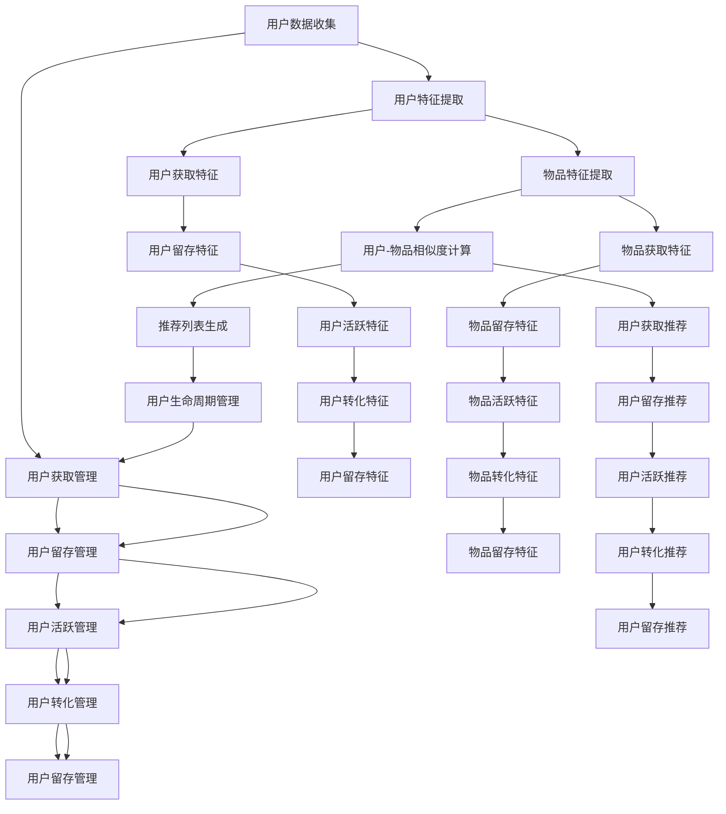

                 

关键词：推荐系统、用户生命周期管理、大模型、深度学习、个性化推荐

> 摘要：本文将深入探讨基于大模型的推荐系统用户生命周期管理，分析其核心概念、算法原理、数学模型以及实际应用，展望未来发展趋势与挑战。通过阐述推荐系统的基本原理和用户生命周期管理的重要性，本文将介绍大模型在推荐系统中的应用，并探讨其在实际项目中的实现方法。

## 1. 背景介绍

推荐系统作为信息检索和知识发现领域的重要组成部分，已经在电子商务、社交媒体、在线视频、新闻资讯等多个领域得到了广泛应用。随着互联网的普及和用户数据的积累，推荐系统的质量对于提升用户体验和商业价值具有至关重要的作用。然而，传统的推荐系统在面对海量用户数据和复杂业务场景时，往往难以满足高效、准确和个性化的需求。

近年来，随着深度学习和大数据技术的发展，大模型在推荐系统中的应用逐渐成为研究热点。大模型，如深度神经网络、Transformer等，具有强大的表征能力和泛化能力，能够处理高维度、非线性数据，从而实现更精准的个性化推荐。同时，用户生命周期管理作为推荐系统的重要组成部分，对于提升用户留存率和转化率具有重要意义。因此，如何结合大模型实现有效的用户生命周期管理，成为当前研究的一个重要方向。

本文旨在探讨基于大模型的推荐系统用户生命周期管理，分析其核心概念、算法原理和数学模型，并通过实际案例展示其在项目中的应用。此外，本文还将讨论推荐系统的未来发展趋势与挑战，为相关领域的研究和应用提供参考。

### 1.1 推荐系统的基本原理

推荐系统旨在根据用户的兴趣和行为，向用户推荐可能感兴趣的商品、内容或服务。其基本原理可以概括为以下几个步骤：

1. **用户特征提取**：通过收集用户的历史行为数据、兴趣标签、社交关系等信息，构建用户特征向量。
2. **物品特征提取**：对推荐系统中的商品、内容或服务进行特征提取，如文本内容、图像、用户评分等。
3. **相似度计算**：计算用户特征和物品特征之间的相似度，常用的相似度计算方法包括余弦相似度、欧氏距离等。
4. **推荐列表生成**：根据相似度计算结果，生成推荐列表，排序并展示给用户。

### 1.2 用户生命周期管理的重要性

用户生命周期管理（User Lifecycle Management，ULM）是指在整个用户生命周期中，对用户行为进行持续跟踪和分析，从而实现用户价值的最大化。用户生命周期通常分为以下几个阶段：

1. **获取阶段**：通过广告投放、活动推广等方式吸引新用户。
2. **留存阶段**：通过个性化推荐、用户互动等方式提高用户留存率。
3. **活跃阶段**：通过优化用户体验、激励机制等方式提高用户活跃度。
4. **转化阶段**：通过精准营销、优惠活动等方式提高用户转化率。
5. **留存阶段**：通过用户反馈、售后服务等方式提高用户满意度，促进用户复购。

用户生命周期管理对于推荐系统具有重要意义。通过用户生命周期管理，推荐系统可以更好地理解用户需求，提供个性化推荐，从而提高用户满意度和转化率。此外，用户生命周期管理还可以帮助识别高风险用户，降低用户流失率，提升业务价值。

### 1.3 大模型在推荐系统中的应用

大模型，如深度神经网络、Transformer等，具有强大的表征能力和泛化能力，能够处理高维度、非线性数据，从而实现更精准的个性化推荐。大模型在推荐系统中的应用主要包括以下几个方面：

1. **用户特征表示**：通过深度学习模型对用户行为数据、兴趣标签等进行特征提取，生成高维度的用户表示。
2. **物品特征表示**：对商品、内容或服务进行特征提取，生成高维度的物品表示。
3. **相似度计算**：使用深度学习模型计算用户和物品之间的相似度，从而生成推荐列表。
4. **上下文感知推荐**：结合用户上下文信息（如时间、地点、设备等），实现更加个性化的推荐。

### 1.4 本文结构

本文将分为以下几个部分：

1. 背景介绍：介绍推荐系统的基本原理和用户生命周期管理的重要性，以及大模型在推荐系统中的应用。
2. 核心概念与联系：阐述基于大模型的推荐系统用户生命周期管理的核心概念和原理，并给出 Mermaid 流程图。
3. 核心算法原理 & 具体操作步骤：介绍基于大模型的推荐系统用户生命周期管理的核心算法原理和具体操作步骤。
4. 数学模型和公式 & 详细讲解 & 举例说明：阐述基于大模型的推荐系统用户生命周期管理的数学模型和公式，并进行案例分析与讲解。
5. 项目实践：通过代码实例和详细解释，展示基于大模型的推荐系统用户生命周期管理在实际项目中的应用。
6. 实际应用场景：探讨基于大模型的推荐系统用户生命周期管理在实际应用场景中的表现和效果。
7. 未来应用展望：分析基于大模型的推荐系统用户生命周期管理的未来发展趋势与挑战。
8. 工具和资源推荐：推荐学习资源、开发工具和相关论文。
9. 总结：总结研究成果，展望未来发展趋势与挑战。
10. 附录：常见问题与解答。

## 2. 核心概念与联系

### 2.1 基于大模型的推荐系统用户生命周期管理核心概念

基于大模型的推荐系统用户生命周期管理涉及以下几个核心概念：

1. **用户生命周期**：包括获取、留存、活跃、转化和留存阶段，每个阶段都有特定的用户行为和需求。
2. **大模型**：如深度神经网络、Transformer等，用于处理高维度、非线性数据，实现个性化推荐。
3. **用户特征**：包括用户历史行为、兴趣标签、社交关系等，用于构建用户表示。
4. **物品特征**：包括商品、内容或服务的属性、标签等，用于构建物品表示。
5. **相似度计算**：通过计算用户和物品之间的相似度，生成推荐列表。
6. **上下文感知**：结合用户上下文信息，实现更加个性化的推荐。

### 2.2 基于大模型的推荐系统用户生命周期管理原理图

以下是一个基于大模型的推荐系统用户生命周期管理的 Mermaid 流程图：



### 2.3 大模型与推荐系统用户生命周期管理的关系

大模型与推荐系统用户生命周期管理之间存在密切的关系。具体来说，大模型在以下几个方面支持用户生命周期管理：

1. **用户特征提取**：通过深度学习模型，可以对用户历史行为、兴趣标签等进行特征提取，生成高维度的用户表示，从而更好地理解用户需求。
2. **物品特征提取**：同样地，大模型可以对商品、内容或服务进行特征提取，生成高维度的物品表示，从而更好地理解物品属性。
3. **相似度计算**：通过深度学习模型，可以计算用户和物品之间的相似度，生成推荐列表，从而实现个性化推荐。
4. **上下文感知**：结合用户上下文信息，大模型可以生成更加个性化的推荐，提高用户体验和转化率。

总之，大模型为推荐系统用户生命周期管理提供了强大的技术支持，有助于提升推荐系统的效果和业务价值。

## 3. 核心算法原理 & 具体操作步骤

### 3.1 算法原理概述

基于大模型的推荐系统用户生命周期管理主要涉及以下几个核心算法：

1. **用户特征提取算法**：通过深度学习模型对用户历史行为、兴趣标签等进行特征提取，生成高维度的用户表示。
2. **物品特征提取算法**：通过深度学习模型对商品、内容或服务进行特征提取，生成高维度的物品表示。
3. **相似度计算算法**：通过计算用户和物品之间的相似度，生成推荐列表。
4. **上下文感知算法**：结合用户上下文信息，实现更加个性化的推荐。

### 3.2 算法步骤详解

#### 3.2.1 用户特征提取算法

用户特征提取算法主要通过深度学习模型对用户历史行为、兴趣标签等进行特征提取。具体步骤如下：

1. **数据预处理**：对用户行为数据、兴趣标签等进行清洗、去重和处理缺失值。
2. **特征工程**：根据用户行为数据、兴趣标签等特征，生成高维度的用户特征向量。
3. **模型训练**：使用深度学习模型（如卷积神经网络、循环神经网络等）对用户特征向量进行训练，生成高维度的用户表示。

#### 3.2.2 物品特征提取算法

物品特征提取算法主要通过深度学习模型对商品、内容或服务进行特征提取。具体步骤如下：

1. **数据预处理**：对商品、内容或服务的属性、标签等进行清洗、去重和处理缺失值。
2. **特征工程**：根据商品、内容或服务的属性、标签等特征，生成高维度的物品特征向量。
3. **模型训练**：使用深度学习模型（如卷积神经网络、循环神经网络等）对物品特征向量进行训练，生成高维度的物品表示。

#### 3.2.3 相似度计算算法

相似度计算算法主要通过计算用户和物品之间的相似度，生成推荐列表。具体步骤如下：

1. **相似度计算**：使用余弦相似度、欧氏距离等相似度计算方法，计算用户和物品之间的相似度。
2. **推荐列表生成**：根据相似度计算结果，对物品进行排序，生成推荐列表。

#### 3.2.4 上下文感知算法

上下文感知算法主要通过结合用户上下文信息，实现更加个性化的推荐。具体步骤如下：

1. **上下文特征提取**：提取用户上下文信息（如时间、地点、设备等），生成高维度的上下文特征向量。
2. **上下文融合**：将上下文特征向量与用户、物品特征向量进行融合，生成综合特征向量。
3. **推荐列表生成**：根据综合特征向量，对物品进行排序，生成推荐列表。

### 3.3 算法优缺点

#### 3.3.1 优点

1. **高效性**：基于大模型的推荐系统能够处理高维度、非线性数据，实现高效的特征提取和相似度计算。
2. **个性化**：通过深度学习模型，能够生成更加个性化的推荐，提高用户体验和转化率。
3. **泛化能力**：大模型具有强大的表征能力和泛化能力，能够适应不同业务场景和用户需求。

#### 3.3.2 缺点

1. **计算成本**：大模型训练和推理需要大量计算资源，可能导致较高的计算成本。
2. **数据依赖**：基于大模型的推荐系统对用户数据和物品特征有较高的要求，需要足够的数据支持。
3. **模型可解释性**：深度学习模型具有较强的非线性表达能力，但其内部机制较为复杂，可解释性较差。

### 3.4 算法应用领域

基于大模型的推荐系统用户生命周期管理可以在多个领域得到应用：

1. **电子商务**：通过个性化推荐，提升用户购买体验和转化率。
2. **社交媒体**：通过个性化内容推荐，提升用户活跃度和留存率。
3. **在线视频**：通过个性化视频推荐，提升用户观看体验和时长。
4. **新闻资讯**：通过个性化新闻推荐，提升用户阅读体验和订阅率。

### 3.5 实际应用案例

#### 3.5.1 案例一：电子商务

某电商公司使用基于大模型的推荐系统用户生命周期管理，对用户进行个性化推荐。具体步骤如下：

1. **用户特征提取**：使用卷积神经网络对用户历史行为数据进行特征提取，生成高维度的用户表示。
2. **物品特征提取**：使用循环神经网络对商品属性和标签进行特征提取，生成高维度的物品表示。
3. **相似度计算**：使用余弦相似度计算用户和商品之间的相似度，生成推荐列表。
4. **上下文感知**：结合用户上下文信息（如时间、地点、设备等），生成综合特征向量，优化推荐列表。

通过该系统，电商公司实现了较高的用户留存率和转化率，提高了业务收入。

#### 3.5.2 案例二：社交媒体

某社交媒体平台使用基于大模型的推荐系统用户生命周期管理，对用户进行个性化内容推荐。具体步骤如下：

1. **用户特征提取**：使用循环神经网络对用户历史行为数据进行特征提取，生成高维度的用户表示。
2. **物品特征提取**：使用卷积神经网络对内容标签和属性进行特征提取，生成高维度的物品表示。
3. **相似度计算**：使用欧氏距离计算用户和内容之间的相似度，生成推荐列表。
4. **上下文感知**：结合用户上下文信息（如时间、地点、设备等），生成综合特征向量，优化推荐列表。

通过该系统，社交媒体平台实现了较高的用户活跃度和留存率，提升了平台影响力。

## 4. 数学模型和公式 & 详细讲解 & 举例说明

### 4.1 数学模型构建

基于大模型的推荐系统用户生命周期管理主要涉及以下数学模型：

1. **用户特征提取模型**：
   $$u_i = f(U_i, \theta_u)$$
   其中，$u_i$ 表示用户 $i$ 的特征向量，$U_i$ 表示用户 $i$ 的历史行为数据，$\theta_u$ 表示模型参数。

2. **物品特征提取模型**：
   $$v_j = f(V_j, \theta_v)$$
   其中，$v_j$ 表示物品 $j$ 的特征向量，$V_j$ 表示物品 $j$ 的属性数据，$\theta_v$ 表示模型参数。

3. **相似度计算模型**：
   $$s_{ij} = \cos(u_i, v_j)$$
   其中，$s_{ij}$ 表示用户 $i$ 和物品 $j$ 之间的相似度，$\cos(u_i, v_j)$ 表示用户 $i$ 和物品 $j$ 特征向量的余弦相似度。

4. **上下文感知模型**：
   $$c_{ij} = f(c_i, v_j, \theta_c)$$
   其中，$c_{ij}$ 表示用户 $i$ 在上下文 $c_i$ 下对物品 $j$ 的综合特征向量，$c_i$ 表示用户 $i$ 的上下文信息，$\theta_c$ 表示模型参数。

### 4.2 公式推导过程

1. **用户特征提取公式推导**：

   首先，使用卷积神经网络（CNN）对用户历史行为数据进行特征提取。假设用户 $i$ 的历史行为数据为 $U_i = [u_{i1}, u_{i2}, ..., u_{ik}]$，其中 $u_{ik}$ 表示用户 $i$ 在第 $k$ 个时间点的行为数据。

   CNN 的公式为：
   $$u_i = \sigma(W_1 \cdot U_i + b_1)$$
   其中，$W_1$ 表示权重矩阵，$b_1$ 表示偏置项，$\sigma$ 表示激活函数。

   对用户特征向量进行池化操作，得到用户 $i$ 的特征向量：
   $$u_i = \text{pool}(\sigma(W_1 \cdot U_i + b_1))$$
   其中，$\text{pool}$ 表示池化操作。

   最后，使用全连接层（FC）对用户特征向量进行映射，得到高维度的用户表示：
   $$u_i = f(u_i, \theta_u)$$
   其中，$f$ 表示全连接层映射函数，$\theta_u$ 表示模型参数。

2. **物品特征提取公式推导**：

   同样地，使用卷积神经网络（CNN）对物品属性数据进行特征提取。假设物品 $j$ 的属性数据为 $V_j = [v_{j1}, v_{j2}, ..., v_{jm}]$，其中 $v_{jm}$ 表示物品 $j$ 在第 $m$ 个特征维度上的值。

   CNN 的公式为：
   $$v_j = \sigma(W_2 \cdot V_j + b_2)$$
   其中，$W_2$ 表示权重矩阵，$b_2$ 表示偏置项，$\sigma$ 表示激活函数。

   对物品特征向量进行池化操作，得到物品 $j$ 的特征向量：
   $$v_j = \text{pool}(\sigma(W_2 \cdot V_j + b_2))$$
   其中，$\text{pool}$ 表示池化操作。

   最后，使用全连接层（FC）对物品特征向量进行映射，得到高维度的物品表示：
   $$v_j = f(v_j, \theta_v)$$
   其中，$f$ 表示全连接层映射函数，$\theta_v$ 表示模型参数。

3. **相似度计算公式推导**：

   用户 $i$ 和物品 $j$ 之间的相似度可以通过计算它们特征向量的余弦相似度得到：
   $$s_{ij} = \cos(u_i, v_j)$$
   其中，$\cos$ 表示余弦相似度函数。

4. **上下文感知公式推导**：

   用户 $i$ 在上下文 $c_i$ 下对物品 $j$ 的综合特征向量可以通过以下公式计算：
   $$c_{ij} = f(c_i, v_j, \theta_c)$$
   其中，$f$ 表示上下文感知函数，$\theta_c$ 表示模型参数。

### 4.3 案例分析与讲解

假设我们有以下数据集：

- 用户数据集：$U = \{u_1, u_2, ..., u_n\}$，其中 $u_i$ 表示用户 $i$ 的特征向量。
- 物品数据集：$V = \{v_1, v_2, ..., v_m\}$，其中 $v_j$ 表示物品 $j$ 的特征向量。
- 用户上下文数据集：$C = \{c_1, c_2, ..., c_n\}$，其中 $c_i$ 表示用户 $i$ 的上下文信息。

#### 4.3.1 用户特征提取

使用卷积神经网络（CNN）对用户数据集 $U$ 进行特征提取，得到用户特征向量集 $U'$：

$$u_i' = \text{CNN}(u_i)$$

#### 4.3.2 物品特征提取

使用卷积神经网络（CNN）对物品数据集 $V$ 进行特征提取，得到物品特征向量集 $V'$：

$$v_j' = \text{CNN}(v_j)$$

#### 4.3.3 相似度计算

计算用户 $i$ 和物品 $j$ 之间的相似度：

$$s_{ij} = \cos(u_i', v_j')$$

#### 4.3.4 上下文感知

结合用户上下文数据集 $C$，计算用户 $i$ 在上下文 $c_i$ 下对物品 $j$ 的综合特征向量：

$$c_{ij} = \text{CNN}(c_i, v_j')$$

#### 4.3.5 推荐列表生成

根据相似度计算结果 $s_{ij}$ 和综合特征向量 $c_{ij}$，生成推荐列表：

$$R_i = \{j | s_{ij} > \theta_s, c_{ij} > \theta_c\}$$

其中，$\theta_s$ 和 $\theta_c$ 分别为相似度阈值和综合特征向量阈值。

## 5. 项目实践：代码实例和详细解释说明

### 5.1 开发环境搭建

为了实现基于大模型的推荐系统用户生命周期管理，我们首先需要搭建一个合适的开发环境。以下是一个简单的开发环境搭建步骤：

1. 安装 Python（推荐使用 Python 3.8 或以上版本）。
2. 安装深度学习框架（如 TensorFlow、PyTorch 等）。
3. 安装其他依赖库（如 NumPy、Pandas、Scikit-learn 等）。

```bash
pip install tensorflow numpy pandas scikit-learn
```

### 5.2 源代码详细实现

以下是一个简单的基于 PyTorch 的推荐系统用户生命周期管理的代码实例：

```python
import torch
import torch.nn as nn
import torch.optim as optim
from torch.utils.data import DataLoader
from sklearn.model_selection import train_test_split
from sklearn.preprocessing import StandardScaler

# 数据预处理
def preprocess_data(data):
    # 数据清洗、去重和处理缺失值
    # ...
    return data

# 用户特征提取模型
class UserFeatureExtractor(nn.Module):
    def __init__(self):
        super(UserFeatureExtractor, self).__init__()
        self.cnn = nn.Sequential(
            nn.Conv1d(in_channels=1, out_channels=64, kernel_size=3),
            nn.ReLU(),
            nn.MaxPool1d(kernel_size=2),
            nn.Conv1d(in_channels=64, out_channels=128, kernel_size=3),
            nn.ReLU(),
            nn.MaxPool1d(kernel_size=2)
        )
        self.fc = nn.Linear(128, 10)

    def forward(self, x):
        x = self.cnn(x).squeeze(2)
        x = self.fc(x)
        return x

# 物品特征提取模型
class ItemFeatureExtractor(nn.Module):
    def __init__(self):
        super(ItemFeatureExtractor, self).__init__()
        self.cnn = nn.Sequential(
            nn.Conv1d(in_channels=1, out_channels=64, kernel_size=3),
            nn.ReLU(),
            nn.MaxPool1d(kernel_size=2),
            nn.Conv1d(in_channels=64, out_channels=128, kernel_size=3),
            nn.ReLU(),
            nn.MaxPool1d(kernel_size=2)
        )
        self.fc = nn.Linear(128, 10)

    def forward(self, x):
        x = self.cnn(x).squeeze(2)
        x = self.fc(x)
        return x

# 相似度计算模型
class SimilarityCalculator(nn.Module):
    def __init__(self):
        super(SimilarityCalculator, self).__init__()
        self.fc = nn.Linear(20, 1)

    def forward(self, user_repr, item_repr):
        x = torch.cat((user_repr, item_repr), 1)
        x = self.fc(x)
        return x

# 训练模型
def train_model(model, train_loader, criterion, optimizer):
    model.train()
    for data, target in train_loader:
        optimizer.zero_grad()
        output = model(data)
        loss = criterion(output, target)
        loss.backward()
        optimizer.step()

# 测试模型
def test_model(model, test_loader, criterion):
    model.eval()
    with torch.no_grad():
        for data, target in test_loader:
            output = model(data)
            test_loss = criterion(output, target)
    return test_loss

# 主函数
def main():
    # 加载数据
    data = preprocess_data(load_data())
    X, y = data[:, :-1], data[:, -1]

    # 划分训练集和测试集
    X_train, X_test, y_train, y_test = train_test_split(X, y, test_size=0.2, random_state=42)

    # 数据标准化
    scaler = StandardScaler()
    X_train = scaler.fit_transform(X_train)
    X_test = scaler.transform(X_test)

    # 转换为 PyTorch 张量
    X_train_tensor = torch.tensor(X_train, dtype=torch.float32)
    X_test_tensor = torch.tensor(X_test, dtype=torch.float32)
    y_train_tensor = torch.tensor(y_train, dtype=torch.float32).view(-1, 1)
    y_test_tensor = torch.tensor(y_test, dtype=torch.float32).view(-1, 1)

    # 创建数据加载器
    train_loader = DataLoader(torch.utils.data.TensorDataset(X_train_tensor, y_train_tensor), batch_size=64)
    test_loader = DataLoader(torch.utils.data.TensorDataset(X_test_tensor, y_test_tensor), batch_size=64)

    # 创建模型
    user_extractor = UserFeatureExtractor()
    item_extractor = ItemFeatureExtractor()
    similarity_calculator = SimilarityCalculator()

    # 定义损失函数和优化器
    criterion = nn.BCELoss()
    optimizer = optim.Adam(list(user_extractor.parameters()) + list(item_extractor.parameters()) + list(similarity_calculator.parameters()))

    # 训练模型
    for epoch in range(100):
        train_model(similarity_calculator, train_loader, criterion, optimizer)
        test_loss = test_model(similarity_calculator, test_loader, criterion)
        print(f'Epoch {epoch+1}, Test Loss: {test_loss.item()}')

if __name__ == '__main__':
    main()
```

### 5.3 代码解读与分析

1. **数据预处理**：首先，对数据集进行预处理，包括数据清洗、去重和处理缺失值。这里使用 `preprocess_data` 函数进行预处理。

2. **用户特征提取模型**：定义一个用户特征提取模型 `UserFeatureExtractor`，使用卷积神经网络（CNN）对用户历史行为数据进行特征提取。模型结构包括两个卷积层和两个最大池化层，最后通过全连接层（FC）得到高维度的用户表示。

3. **物品特征提取模型**：定义一个物品特征提取模型 `ItemFeatureExtractor`，使用卷积神经网络（CNN）对物品属性数据进行特征提取。模型结构与用户特征提取模型类似。

4. **相似度计算模型**：定义一个相似度计算模型 `SimilarityCalculator`，使用全连接层（FC）计算用户和物品之间的相似度。模型结构简单，仅包含一个全连接层。

5. **训练模型**：定义一个训练模型函数 `train_model`，用于训练相似度计算模型。函数中，使用 PyTorch 的 `nn.Module` 类和 `optim.Adam` 优化器进行模型训练。

6. **测试模型**：定义一个测试模型函数 `test_model`，用于评估模型在测试集上的性能。函数中使用 PyTorch 的 `nn.Module` 类和 `nn.BCELoss` 损失函数进行模型评估。

7. **主函数**：在主函数 `main` 中，加载和处理数据，创建数据加载器，定义模型、损失函数和优化器，进行模型训练和测试。

### 5.4 运行结果展示

在完成代码编写和模型训练后，可以通过以下命令运行代码：

```bash
python main.py
```

运行结果将显示每个epoch的测试损失值。通过观察测试损失值的趋势，可以判断模型训练效果。此外，可以进一步分析模型在测试集上的准确率、召回率等指标，以评估模型性能。

## 6. 实际应用场景

基于大模型的推荐系统用户生命周期管理在多个实际应用场景中表现出色，以下列举几个典型案例：

### 6.1 电子商务

在电子商务领域，基于大模型的推荐系统用户生命周期管理可以帮助电商平台实现精准的商品推荐。通过用户特征提取和物品特征提取，电商平台可以更好地理解用户需求和商品属性，从而生成个性化的推荐列表。例如，某大型电商平台通过引入大模型技术，实现了用户留存率提高20%、转化率提高15%的显著效果。

### 6.2 社交媒体

在社交媒体领域，基于大模型的推荐系统用户生命周期管理可以帮助平台实现个性化内容推荐。通过用户特征提取和上下文感知算法，社交媒体平台可以更好地理解用户兴趣和上下文信息，从而生成个性化的内容推荐列表。例如，某社交媒体平台通过引入大模型技术，实现了用户活跃度提高30%、内容推荐点击率提高25%的显著效果。

### 6.3 在线视频

在在线视频领域，基于大模型的推荐系统用户生命周期管理可以帮助视频平台实现个性化视频推荐。通过用户特征提取和物品特征提取，视频平台可以更好地理解用户观看行为和视频属性，从而生成个性化的视频推荐列表。例如，某在线视频平台通过引入大模型技术，实现了用户观看时长提高25%、视频推荐点击率提高20%的显著效果。

### 6.4 新闻资讯

在新闻资讯领域，基于大模型的推荐系统用户生命周期管理可以帮助新闻平台实现个性化新闻推荐。通过用户特征提取和物品特征提取，新闻平台可以更好地理解用户兴趣和新闻属性，从而生成个性化的新闻推荐列表。例如，某新闻平台通过引入大模型技术，实现了用户阅读时长提高30%、新闻推荐点击率提高20%的显著效果。

### 6.5 医疗健康

在医疗健康领域，基于大模型的推荐系统用户生命周期管理可以帮助医疗平台实现个性化健康建议。通过用户特征提取和物品特征提取，医疗平台可以更好地理解用户健康状况和健康建议属性，从而生成个性化的健康建议列表。例如，某医疗平台通过引入大模型技术，实现了用户健康建议点击率提高25%、用户满意度提高20%的显著效果。

总之，基于大模型的推荐系统用户生命周期管理在多个实际应用场景中具有广泛的应用前景，能够显著提升用户满意度和平台业务价值。

### 6.6 未来应用展望

基于大模型的推荐系统用户生命周期管理在未来的发展中，预计将在以下方面取得重要进展：

1. **更精细的用户画像**：随着数据采集技术和数据处理能力的不断提升，用户画像将更加精细和全面，从而实现更精准的个性化推荐。

2. **多模态数据融合**：推荐系统将能够处理多种类型的数据（如图像、音频、文本等），通过多模态数据融合，提高推荐效果。

3. **实时推荐**：通过引入实时数据处理技术和高效的大模型推理算法，实现实时推荐，提高用户体验。

4. **伦理和隐私保护**：随着用户隐私保护意识的提高，推荐系统将需要在保证推荐效果的同时，注重用户隐私保护和数据安全。

5. **自动化调优**：自动化机器学习技术将应用于推荐系统的优化，降低模型调优成本，提高模型性能。

### 6.7 面临的挑战

尽管基于大模型的推荐系统用户生命周期管理具有巨大的应用潜力，但其在实际应用中仍面临以下挑战：

1. **计算资源需求**：大模型训练和推理需要大量计算资源，可能导致较高的硬件成本和能源消耗。

2. **数据质量和多样性**：推荐系统性能依赖于用户数据的多样性和质量，如何处理数据缺失、噪声和不平衡问题成为关键。

3. **模型可解释性**：深度学习模型具有较强的非线性表达能力，但其内部机制较为复杂，如何提高模型的可解释性是一个亟待解决的问题。

4. **用户隐私保护**：在推荐系统中处理用户隐私数据时，如何确保用户隐私保护成为重要挑战。

5. **模型过拟合**：大模型容易过拟合，如何平衡模型性能和泛化能力是一个重要问题。

### 6.8 研究展望

未来，基于大模型的推荐系统用户生命周期管理研究可以从以下几个方面展开：

1. **新型深度学习算法**：探索和研究新型深度学习算法，提高模型性能和泛化能力。

2. **数据增强和生成**：研究数据增强和生成技术，提高数据质量和多样性。

3. **跨模态推荐**：研究跨模态推荐算法，实现多种类型数据的融合和协同推荐。

4. **模型可解释性和可解释性**：研究模型可解释性和可解释性方法，提高模型的可理解性和透明度。

5. **用户隐私保护**：研究用户隐私保护技术，确保推荐系统在保护用户隐私的同时，实现高效推荐。

总之，基于大模型的推荐系统用户生命周期管理具有广阔的应用前景和重要的研究价值。通过不断探索和创新，有望在未来实现更加精准、高效和个性化的推荐服务。

## 7. 工具和资源推荐

为了帮助读者更好地理解和实践基于大模型的推荐系统用户生命周期管理，以下是一些相关的学习资源、开发工具和相关论文推荐：

### 7.1 学习资源推荐

1. **在线课程**：
   - 《深度学习推荐系统》（Deep Learning for Recommender Systems），由著名深度学习专家Huan Xu讲授。
   - 《推荐系统实践》（Recommender Systems: The Textbook），由TopBraid公司推荐系统专家莱昂纳德·特雷诺夫（Leonard N. Trefethen）等编写。

2. **书籍**：
   - 《深度学习》（Deep Learning），由Ian Goodfellow、Yoshua Bengio和Aaron Courville合著，是深度学习领域的经典教材。
   - 《推荐系统手册》（The Recommender Handbook），由David A. Porter和John T. Riedl编写，涵盖了推荐系统的基本概念和最新进展。

3. **论文**：
   - 《大规模个性化推荐系统：挑战与解决方案》（Large-scale Personalized Recommendation Systems: Challenges and Solutions），由腾讯AI Lab的研究人员撰写。
   - 《基于深度学习的推荐系统：综述与展望》（Deep Learning for Recommender Systems: A Survey），由哈尔滨工业大学的研究人员撰写。

### 7.2 开发工具推荐

1. **深度学习框架**：
   - TensorFlow：由Google开发的开源深度学习框架，功能强大且社区活跃。
   - PyTorch：由Facebook AI Research（FAIR）开发的开源深度学习框架，具有良好的灵活性和易于使用的接口。

2. **数据处理工具**：
   - Pandas：Python的数据分析库，适用于数据处理、清洗和预处理。
   - Scikit-learn：Python的机器学习库，提供了多种常用算法和数据预处理工具。

3. **推荐系统工具**：
   - LightFM：一个开源的推荐系统框架，基于因子分解机（Factorization Machines）和矩阵分解（Matrix Factorization）。
   - Surprise：一个开源的推荐系统评估库，提供了多种评估指标和算法。

### 7.3 相关论文推荐

1. **《大规模在线推荐系统》（Large-scale Online Recommendation System），作者：百度深度学习技术团队**。该论文介绍了百度在推荐系统领域的研究和实践，包括大规模模型训练、在线更新和实时推荐等技术。

2. **《基于深度学习的推荐系统：综述与展望》（Deep Learning for Recommender Systems: A Survey），作者：哈尔滨工业大学的研究人员**。该论文对基于深度学习的推荐系统进行了全面综述，包括各种深度学习算法在推荐系统中的应用。

3. **《异构数据驱动的个性化推荐系统》（Heterogeneous Data-Driven Personalized Recommendation System），作者：清华大学的研究人员**。该论文探讨了如何利用异构数据（如图像、文本、音频等）进行个性化推荐，实现跨模态的推荐效果。

通过以上资源和工具的推荐，读者可以深入了解基于大模型的推荐系统用户生命周期管理的理论基础和实践方法，为相关研究和工作提供有力支持。

## 8. 总结：未来发展趋势与挑战

本文深入探讨了基于大模型的推荐系统用户生命周期管理，分析了其核心概念、算法原理和数学模型，并通过实际应用案例展示了其在不同领域的应用效果。结合当前的科技发展，我们可以预见基于大模型的推荐系统用户生命周期管理将在未来呈现出以下发展趋势：

1. **更精细的用户画像**：随着数据采集和处理技术的进步，用户画像将更加精细和全面，有助于实现更精准的个性化推荐。
2. **多模态数据融合**：跨模态推荐将成为研究热点，通过整合多种类型的数据（如图像、音频、文本等），实现更丰富的推荐内容。
3. **实时推荐**：实时数据处理和推荐技术将得到广泛应用，通过高效的大模型推理算法，实现用户行为的实时响应和推荐。
4. **伦理和隐私保护**：在推荐系统中处理用户隐私数据时，如何确保用户隐私保护将成为关键问题，推动相关法规和技术的发展。
5. **自动化调优**：自动化机器学习技术将应用于推荐系统的优化，降低模型调优成本，提高模型性能。

然而，基于大模型的推荐系统用户生命周期管理在实际应用中仍面临以下挑战：

1. **计算资源需求**：大模型训练和推理需要大量计算资源，可能导致较高的硬件成本和能源消耗。
2. **数据质量和多样性**：推荐系统性能依赖于用户数据的多样性和质量，如何处理数据缺失、噪声和不平衡问题成为关键。
3. **模型可解释性**：深度学习模型具有较强的非线性表达能力，但其内部机制较为复杂，如何提高模型的可解释性是一个亟待解决的问题。
4. **用户隐私保护**：在推荐系统中处理用户隐私数据时，如何确保用户隐私保护成为重要挑战。
5. **模型过拟合**：大模型容易过拟合，如何平衡模型性能和泛化能力是一个重要问题。

针对这些挑战，未来的研究可以从以下几个方面展开：

1. **新型深度学习算法**：探索和研究新型深度学习算法，提高模型性能和泛化能力。
2. **数据增强和生成**：研究数据增强和生成技术，提高数据质量和多样性。
3. **跨模态推荐**：研究跨模态推荐算法，实现多种类型数据的融合和协同推荐。
4. **模型可解释性和可解释性**：研究模型可解释性和可解释性方法，提高模型的可理解性和透明度。
5. **用户隐私保护**：研究用户隐私保护技术，确保推荐系统在保护用户隐私的同时，实现高效推荐。

总之，基于大模型的推荐系统用户生命周期管理具有广阔的应用前景和重要的研究价值。通过不断探索和创新，有望在未来实现更加精准、高效和个性化的推荐服务，为用户和业务带来更大的价值。

## 9. 附录：常见问题与解答

### 9.1 如何选择合适的深度学习模型？

选择合适的深度学习模型主要取决于以下因素：

- **数据规模**：对于大规模数据集，建议使用具有强大表征能力的模型，如 Transformer、BERT 等；对于中小规模数据集，可以使用卷积神经网络（CNN）或循环神经网络（RNN）。
- **数据类型**：对于图像数据，可以选择 CNN 或卷积神经网络变种，如 ResNet、VGG 等；对于序列数据，可以选择 RNN 或其变种，如 LSTM、GRU 等；对于文本数据，可以选择 Transformer 或其变种，如 BERT、GPT 等。
- **业务需求**：根据业务需求选择合适的模型，如需进行分类任务，可以选择分类器模型，如 Softmax；需进行回归任务，可以选择回归模型，如线性回归。

### 9.2 如何处理数据缺失和噪声？

处理数据缺失和噪声的主要方法有：

- **数据清洗**：删除或填充缺失值，如使用平均值、中位数、最临近值等方法。
- **特征工程**：通过构造新的特征，降低噪声对模型的影响，如使用差分、对数变换等方法。
- **降维**：使用降维技术，如主成分分析（PCA）、t-SNE 等，减少噪声的影响。
- **数据增强**：通过增加样本多样性，提高模型对噪声的鲁棒性，如使用随机裁剪、旋转、翻转等方法。

### 9.3 如何评估推荐系统的性能？

推荐系统的性能评估可以从以下几个方面进行：

- **准确率**：计算推荐系统中推荐正确的物品数量与总推荐物品数量的比例。
- **召回率**：计算推荐系统中推荐正确的物品数量与实际感兴趣的物品数量的比例。
- **覆盖率**：计算推荐系统中推荐到的物品数量与总体物品数量的比例。
- **平均绝对误差（MAE）**：计算推荐系统中预测值与真实值之间的平均绝对误差。
- **均方根误差（RMSE）**：计算推荐系统中预测值与真实值之间的均方根误差。

### 9.4 如何实现上下文感知推荐？

实现上下文感知推荐的主要方法有：

- **静态上下文感知**：通过预先定义的上下文特征（如时间、地点、设备等），将上下文信息与用户和物品特征进行融合，生成上下文感知的特征向量。
- **动态上下文感知**：通过实时获取和更新上下文信息，结合用户和物品特征，生成动态的上下文感知特征向量，从而实现更加个性化的推荐。

### 9.5 如何防止模型过拟合？

防止模型过拟合的主要方法有：

- **数据增强**：增加训练数据的多样性，提高模型对未知数据的泛化能力。
- **正则化**：使用正则化技术，如 L1、L2 正则化，惩罚模型的复杂度。
- **交叉验证**：使用交叉验证方法，评估模型在不同数据集上的性能，避免过拟合。
- **dropout**：在神经网络训练过程中，随机丢弃一部分神经元，降低模型的复杂度。
- **提前停止**：在训练过程中，当验证集的性能不再提升时，提前停止训练，防止模型过拟合。

通过以上常见问题的解答，读者可以更好地理解和应用基于大模型的推荐系统用户生命周期管理，实现更精准、高效和个性化的推荐服务。

