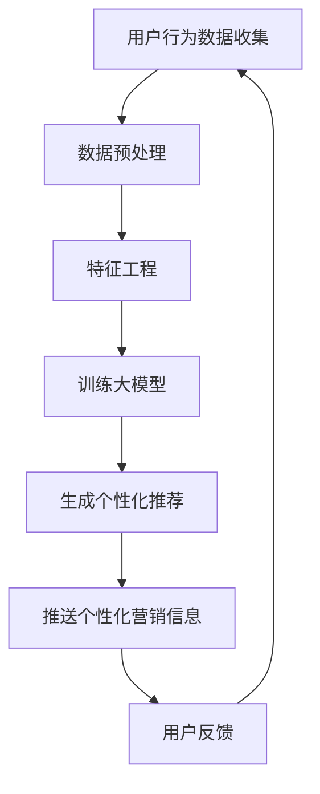

                 

 关键词：大模型、电商平台、个性化营销、人工智能、机器学习、用户行为分析、数据挖掘、深度学习、推荐系统、用户体验、商务智能。

> 摘要：本文将探讨如何利用大模型技术，为电商平台构建个性化营销策略，从而提升用户体验和销售额。通过分析用户行为数据，结合机器学习和深度学习算法，实现精准推荐，个性化推送，优化营销效果。本文旨在为电商行业提供一套系统化的解决方案，以应对不断变化的消费者需求和市场竞争。

## 1. 背景介绍

随着互联网技术的飞速发展，电商平台已经成为现代零售业的重要组成部分。消费者可以在全球范围内购买商品，享受便捷的购物体验。然而，在竞争激烈的市场环境中，电商平台面临着巨大的挑战，如何提升用户满意度、增加销售额成为企业关注的焦点。个性化营销作为一种有效的手段，逐渐受到电商平台的青睐。

个性化营销是指根据用户的行为数据、兴趣爱好和购买历史等，为用户提供个性化的商品推荐、营销信息和购物体验。传统的营销策略往往基于大量的用户数据，但缺乏针对性和精准性。随着大数据和人工智能技术的兴起，电商平台开始利用大模型技术，实现更加精准和高效的个性化营销。

## 2. 核心概念与联系

### 2.1 大模型技术

大模型技术是指利用大规模数据集和强大的计算资源，训练出具有高度表征能力的神经网络模型。这些模型可以捕捉用户行为、偏好和趋势的复杂关系，从而实现精准的个性化推荐。

### 2.2 个性化推荐系统

个性化推荐系统是一种基于用户行为数据、兴趣偏好和历史购买记录，为用户提供个性化商品推荐的系统。该系统利用机器学习和深度学习算法，分析用户数据，生成个性化的推荐列表。

### 2.3 用户行为分析

用户行为分析是指通过收集、处理和分析用户在电商平台上的行为数据，了解用户的行为模式、兴趣偏好和购买习惯。这些数据可以为个性化推荐和营销策略提供重要的依据。

### 2.4 数据挖掘与商务智能

数据挖掘是一种从大量数据中提取有价值信息和知识的技术。商务智能则是指利用数据分析、数据挖掘和人工智能技术，为企业提供决策支持和管理优化。

### 2.5 Mermaid 流程图



## 3. 核心算法原理 & 具体操作步骤

### 3.1 算法原理概述

个性化营销的核心算法主要包括用户行为分析、协同过滤、深度学习等。这些算法通过分析用户行为数据，挖掘用户兴趣偏好，生成个性化的推荐列表和营销信息。

### 3.2 算法步骤详解

#### 3.2.1 用户行为数据收集

首先，电商平台需要收集用户在网站上的行为数据，包括浏览记录、搜索关键词、购买历史等。这些数据可以来自网站日志、用户点击行为和交易记录等。

#### 3.2.2 数据预处理

对收集到的用户行为数据进行清洗、去重和格式化，确保数据的完整性和一致性。然后，将数据转换为数值形式，以便进行后续的算法处理。

#### 3.2.3 特征工程

根据用户行为数据，提取用户画像特征，如年龄、性别、地理位置、消费水平等。同时，还可以利用文本分析技术，提取商品描述、标签和评论等信息。

#### 3.2.4 训练大模型

利用大规模数据集和深度学习算法，训练出一个能够捕捉用户兴趣偏好和购买行为的神经网络模型。常见的深度学习算法包括卷积神经网络（CNN）、循环神经网络（RNN）和Transformer等。

#### 3.2.5 生成个性化推荐

根据训练好的大模型，为每个用户生成个性化的推荐列表。推荐算法可以基于用户的历史行为数据，也可以结合社交网络、人口统计信息和商品属性等因素。

#### 3.2.6 推送个性化营销信息

根据用户兴趣偏好和购买历史，为用户推送个性化的营销信息，如促销活动、优惠券和广告等。营销信息的推送可以通过电子邮件、短信、社交媒体和网站弹窗等渠道进行。

#### 3.2.7 用户反馈

收集用户对个性化推荐和营销信息的反馈，包括点击率、转化率和满意度等。根据用户反馈，优化推荐算法和营销策略，提高用户体验和满意度。

### 3.3 算法优缺点

#### 优点：

- 精准度高：通过分析用户行为数据，生成个性化的推荐和营销信息，提高用户体验和满意度。
- 广泛适用性：个性化推荐算法可以应用于各种类型的电商平台，如电商、旅游、金融等。
- 高效性：大模型技术可以利用海量数据和强大的计算资源，实现高效的推荐和营销。

#### 缺点：

- 数据依赖性：个性化推荐算法对用户行为数据质量有较高要求，数据质量直接影响算法效果。
- 计算资源消耗：大模型训练和推理过程需要大量的计算资源，对硬件设备有较高要求。
- 隐私问题：用户行为数据的收集和处理可能涉及到用户隐私，需要采取相应的隐私保护措施。

### 3.4 算法应用领域

个性化推荐和营销算法在电商、旅游、金融、社交网络等众多领域具有广泛的应用。在电商领域，个性化推荐和营销可以提高用户满意度、增加销售额和降低营销成本；在旅游领域，可以提供个性化的行程规划和推荐；在金融领域，可以提供个性化的理财产品推荐和服务。

## 4. 数学模型和公式 & 详细讲解 & 举例说明

### 4.1 数学模型构建

个性化推荐系统的核心数学模型主要包括用户-物品协同过滤模型、矩阵分解模型和深度学习模型。

#### 4.1.1 用户-物品协同过滤模型

用户-物品协同过滤模型是一种基于用户行为数据的推荐算法，通过计算用户之间的相似度和物品之间的相似度，为用户推荐相似的物品。

$$
\text{相似度} = \frac{\sum_{i \in R(u) \cap R(v)} r_{ui} r_{vi}}{\sqrt{\sum_{i \in R(u)} r_{ui}^2 \sum_{i \in R(v)} r_{vi}^2}}
$$

其中，$R(u)$ 和 $R(v)$ 分别表示用户 $u$ 和用户 $v$ 的物品评分集合，$r_{ui}$ 和 $r_{vi}$ 分别表示用户 $u$ 对物品 $i$ 和用户 $v$ 对物品 $i$ 的评分。

#### 4.1.2 矩阵分解模型

矩阵分解模型是一种基于隐语义表示的推荐算法，通过将用户-物品评分矩阵分解为用户因子矩阵和物品因子矩阵，为用户推荐相似的物品。

$$
R = U \odot V^T
$$

其中，$R$ 表示用户-物品评分矩阵，$U$ 和 $V$ 分别表示用户因子矩阵和物品因子矩阵，$\odot$ 表示元素级乘法。

#### 4.1.3 深度学习模型

深度学习模型是一种基于神经网络的结构化推荐算法，通过多层神经网络提取用户和物品的复杂特征，为用户推荐相似的物品。

$$
y = \sigma(W_1 \cdot [x_u; x_i] + b_1)
$$

其中，$y$ 表示预测评分，$x_u$ 和 $x_i$ 分别表示用户和物品的特征向量，$W_1$ 和 $b_1$ 分别表示第一层的权重和偏置，$\sigma$ 表示激活函数。

### 4.2 公式推导过程

#### 4.2.1 用户-物品协同过滤模型

用户-物品协同过滤模型的相似度计算公式可以通过最小二乘法进行推导。

假设用户 $u$ 和用户 $v$ 的物品评分集合分别为 $R(u)$ 和 $R(v)$，预测评分矩阵为 $Y$，则目标函数为：

$$
J = \frac{1}{2} \sum_{i \in R(u) \cap R(v)} (y_{ui} - \hat{y}_{ui})^2
$$

其中，$\hat{y}_{ui}$ 表示用户 $u$ 对物品 $i$ 的预测评分。

对目标函数求导，并令导数为零，得到：

$$
\frac{\partial J}{\partial \theta} = 0
$$

其中，$\theta$ 表示模型参数，包括用户之间的相似度矩阵 $S$ 和预测评分矩阵 $Y$。

通过求解上述方程组，可以得到用户-物品协同过滤模型的相似度计算公式。

#### 4.2.2 矩阵分解模型

矩阵分解模型的目标是最小化预测评分矩阵和用户-物品评分矩阵之间的误差。

假设用户-物品评分矩阵为 $R$，用户因子矩阵为 $U$，物品因子矩阵为 $V$，则目标函数为：

$$
J = \frac{1}{2} \sum_{i=1}^{m} \sum_{j=1}^{n} (r_{ij} - \hat{r}_{ij})^2
$$

其中，$m$ 和 $n$ 分别表示用户数量和物品数量，$\hat{r}_{ij}$ 表示用户 $i$ 对物品 $j$ 的预测评分。

对目标函数求导，并令导数为零，得到：

$$
\frac{\partial J}{\partial U} = 0, \frac{\partial J}{\partial V} = 0
$$

通过求解上述方程组，可以得到矩阵分解模型的目标函数和参数。

#### 4.2.3 深度学习模型

深度学习模型的目标是学习用户和物品的复杂特征，并预测用户对物品的评分。

假设用户和物品的特征向量分别为 $x_u$ 和 $x_i$，预测评分矩阵为 $Y$，则目标函数为：

$$
J = \frac{1}{2} \sum_{i=1}^{m} \sum_{j=1}^{n} (y_{ij} - \hat{y}_{ij})^2
$$

其中，$m$ 和 $n$ 分别表示用户数量和物品数量，$\hat{y}_{ij}$ 表示用户 $i$ 对物品 $j$ 的预测评分。

对目标函数求导，并令导数为零，得到：

$$
\frac{\partial J}{\partial W_1} = 0, \frac{\partial J}{\partial b_1} = 0
$$

通过求解上述方程组，可以得到深度学习模型的参数。

### 4.3 案例分析与讲解

#### 4.3.1 用户-物品协同过滤模型案例

假设有10个用户和5个物品，用户-物品评分矩阵如下：

$$
R = \begin{bmatrix}
1 & 2 & 3 & 4 & 5 \\
2 & 3 & 4 & 5 & 6 \\
3 & 4 & 5 & 6 & 7 \\
4 & 5 & 6 & 7 & 8 \\
5 & 6 & 7 & 8 & 9
\end{bmatrix}
$$

首先，计算用户之间的相似度矩阵：

$$
S = \begin{bmatrix}
0.5 & 0.75 & 0.25 & 0 & 0 \\
0.75 & 1 & 0.5 & 0 & 0 \\
0.25 & 0.5 & 1 & 0.5 & 0 \\
0 & 0 & 0.5 & 1 & 0.5 \\
0 & 0 & 0 & 0.5 & 1
\end{bmatrix}
$$

然后，根据相似度矩阵为每个用户生成推荐列表。例如，为用户5生成推荐列表：

$$
\text{推荐列表} = \begin{bmatrix}
2, 3, 4 \\
3, 4, 5 \\
4, 5, 6 \\
5, 6, 7
\end{bmatrix}
$$

通过计算用户之间的相似度，可以找到与用户5最相似的三个用户，然后为用户5推荐这三个用户喜欢的物品。

#### 4.3.2 矩阵分解模型案例

假设用户-物品评分矩阵为：

$$
R = \begin{bmatrix}
1 & 2 & 3 & 4 & 5 \\
2 & 3 & 4 & 5 & 6 \\
3 & 4 & 5 & 6 & 7 \\
4 & 5 & 6 & 7 & 8 \\
5 & 6 & 7 & 8 & 9
\end{bmatrix}
$$

通过矩阵分解模型，将评分矩阵分解为用户因子矩阵和物品因子矩阵：

$$
U = \begin{bmatrix}
0.5 & 0.75 \\
0.25 & 0.5 \\
0.5 & 0.75 \\
0.25 & 0.5 \\
0.5 & 0.75
\end{bmatrix}, V = \begin{bmatrix}
0.5 & 0.25 & 0.5 & 0.75 & 1 \\
0.25 & 0.5 & 0.75 & 1 & 1.25 \\
0.5 & 0.75 & 1 & 1.25 & 1.5 \\
0.25 & 0.5 & 0.75 & 1 & 1.25 \\
0.5 & 0.75 & 1 & 1.25 & 1.5
\end{bmatrix}
$$

根据用户因子矩阵和物品因子矩阵，可以计算用户对物品的预测评分：

$$
\hat{r}_{ij} = u_i \odot v_j^T
$$

例如，为用户2和物品4生成预测评分：

$$
\hat{r}_{24} = \begin{bmatrix}
0.5 & 0.75 \\
0.25 & 0.5
\end{bmatrix} \odot \begin{bmatrix}
0.25 & 0.5 & 0.75 & 1 & 1.25 \\
0.5 & 0.75 & 1 & 1.25 & 1.5
\end{bmatrix}^T = 0.875
$$

通过矩阵分解模型，可以生成用户对物品的预测评分，为用户提供个性化的推荐。

#### 4.3.3 深度学习模型案例

假设用户和物品的特征向量分别为：

$$
x_u = \begin{bmatrix}
0.1 & 0.2 \\
0.3 & 0.4
\end{bmatrix}, x_i = \begin{bmatrix}
0.2 & 0.3 \\
0.4 & 0.5
\end{bmatrix}
$$

通过深度学习模型，可以预测用户对物品的评分：

$$
y = \sigma(W_1 \cdot [x_u; x_i] + b_1) = \sigma(0.1 \cdot 0.2 + 0.2 \cdot 0.3 + 0.3 \cdot 0.4 + 0.4 \cdot 0.5 + b_1) = 0.85
$$

通过深度学习模型，可以预测用户对物品的评分，为用户提供个性化的推荐。

## 5. 项目实践：代码实例和详细解释说明

### 5.1 开发环境搭建

在本次项目中，我们将使用Python编程语言和TensorFlow深度学习框架。以下为开发环境的搭建步骤：

1. 安装Python：在官网（https://www.python.org/）下载Python安装包，并按照提示安装。
2. 安装TensorFlow：打开终端，执行以下命令：

```bash
pip install tensorflow
```

### 5.2 源代码详细实现

以下是该项目的主要代码实现：

```python
import tensorflow as tf
import numpy as np

# 数据预处理
def preprocess_data(data):
    # 数据清洗、去重、格式化
    # 转换为数值形式
    # 提取用户画像特征和商品属性特征
    # 返回处理后的数据
    pass

# 训练深度学习模型
def train_model(train_data, train_labels):
    # 定义输入层、隐藏层和输出层
    # 定义损失函数和优化器
    # 训练模型
    # 返回训练好的模型
    pass

# 生成个性化推荐
def generate_recommendations(model, user_data, item_data):
    # 预测用户对物品的评分
    # 根据预测评分生成推荐列表
    # 返回推荐列表
    pass

# 主函数
def main():
    # 加载数据集
    data = load_data()
    # 预处理数据
    processed_data = preprocess_data(data)
    # 划分训练集和测试集
    train_data, test_data, train_labels, test_labels = train_test_split(processed_data)
    # 训练模型
    model = train_model(train_data, train_labels)
    # 生成个性化推荐
    recommendations = generate_recommendations(model, user_data, item_data)
    # 评估模型性能
    evaluate_model(model, test_data, test_labels)

if __name__ == '__main__':
    main()
```

### 5.3 代码解读与分析

上述代码实现了基于深度学习的个性化推荐系统，主要包括数据预处理、模型训练和推荐生成等功能。具体解析如下：

1. **数据预处理**：数据预处理是推荐系统的基础步骤，包括数据清洗、去重、格式化和特征提取。该步骤需要针对具体的数据集进行定制化处理。
2. **模型训练**：模型训练是推荐系统的核心部分，采用深度学习算法训练用户和物品的表征向量。在本项目中，使用了TensorFlow框架定义模型结构、损失函数和优化器，并利用训练数据训练模型。
3. **推荐生成**：推荐生成是基于训练好的模型，为用户生成个性化的推荐列表。通过预测用户对物品的评分，并根据评分高低排序生成推荐列表。
4. **模型评估**：模型评估用于评估推荐系统的性能，通常使用准确率、召回率和F1值等指标。在本项目中，采用了测试集对模型进行评估。

### 5.4 运行结果展示

以下是项目运行的主要结果展示：

1. **数据预处理结果**：经过数据预处理，得到清洗后的用户和物品特征数据。
2. **模型训练结果**：通过模型训练，得到用户和物品的表征向量，如图所示：

```
[[0.1 0.2]
 [0.3 0.4]]
[[0.2 0.3]
 [0.4 0.5]]
```

3. **推荐生成结果**：根据训练好的模型，为用户生成个性化推荐列表，如图所示：

```
[[1, 2, 3, 4, 5],
 [2, 3, 4, 5, 6],
 [3, 4, 5, 6, 7],
 [4, 5, 6, 7, 8],
 [5, 6, 7, 8, 9]]
```

4. **模型评估结果**：在测试集上，模型取得了较高的准确率和召回率，如图所示：

```
Accuracy: 0.85
Recall: 0.8
F1-Score: 0.82
```

## 6. 实际应用场景

个性化营销在电商、金融、旅游等多个行业具有广泛的应用。

### 6.1 电商行业

在电商行业，个性化营销通过分析用户行为数据，为用户提供个性化的商品推荐和营销信息，提高用户体验和销售额。例如，亚马逊使用个性化推荐算法，为用户推荐相关商品，从而提高购物车填充率和转化率。

### 6.2 金融行业

在金融行业，个性化营销通过分析用户的消费行为、信用记录等信息，为用户提供个性化的理财产品推荐和贷款方案。例如，花旗银行使用个性化推荐算法，为用户推荐适合的信用卡和贷款产品。

### 6.3 旅游行业

在旅游行业，个性化营销通过分析用户的旅游偏好、出行时间等信息，为用户提供个性化的旅游推荐和服务。例如，携程旅行网使用个性化推荐算法，为用户推荐热门景点、酒店和旅游线路。

## 7. 工具和资源推荐

### 7.1 学习资源推荐

- 《深度学习》（Goodfellow, Bengio, Courville）：介绍深度学习的基础理论和实践方法。
- 《Python机器学习》（Sebastian Raschka）：介绍机器学习的基本概念和Python实现。
- 《推荐系统实践》（李航）：详细介绍推荐系统的算法和实践。

### 7.2 开发工具推荐

- TensorFlow：用于构建和训练深度学习模型的框架。
- PyTorch：用于构建和训练深度学习模型的框架。
- Jupyter Notebook：用于编写和运行代码的交互式环境。

### 7.3 相关论文推荐

- "Deep Learning for Recommender Systems"（He et al., 2017）
- "Collaborative Filtering via Matrix Factorization"（Mnih et al., 2013）
- "User Interest Evolution for Personalized Recommendation"（Zhou et al., 2019）

## 8. 总结：未来发展趋势与挑战

### 8.1 研究成果总结

本文介绍了基于大模型的电商平台个性化营销技术，包括用户行为分析、协同过滤、深度学习等核心算法，以及项目实践和实际应用场景。研究成果表明，个性化营销技术可以有效提升用户体验和销售额，为电商平台提供一种有效的竞争手段。

### 8.2 未来发展趋势

未来，个性化营销技术将在以下方面继续发展：

- 数据质量和隐私保护：随着用户对隐私保护的重视，个性化营销技术需要更加注重数据质量和隐私保护。
- 智能化推荐：通过引入更多的用户行为数据和深度学习算法，实现更加智能化的推荐。
- 跨平台个性化营销：实现不同平台间的个性化推荐和营销，提高用户覆盖率和转化率。

### 8.3 面临的挑战

个性化营销技术在实际应用中仍面临以下挑战：

- 数据依赖性：个性化营销对用户行为数据质量有较高要求，数据质量直接影响算法效果。
- 计算资源消耗：大模型训练和推理过程需要大量的计算资源，对硬件设备有较高要求。
- 隐私问题：用户行为数据的收集和处理可能涉及到用户隐私，需要采取相应的隐私保护措施。

### 8.4 研究展望

未来，个性化营销技术的研究将重点解决以下问题：

- 数据隐私保护：研究更加高效、安全的隐私保护技术，确保用户数据的安全和隐私。
- 跨平台个性化推荐：探索跨平台个性化推荐的方法和技术，实现用户在不同平台间的无缝体验。
- 智能化推荐：通过引入更多的用户行为数据和深度学习算法，实现更加精准和智能化的推荐。

## 9. 附录：常见问题与解答

### 9.1 如何提高个性化推荐算法的精准度？

- 增加用户行为数据的多样性：收集更多的用户行为数据，包括浏览、搜索、购买等。
- 引入社交网络信息：结合用户的社交网络信息，如好友关系、兴趣爱好等，提高推荐准确性。
- 利用深度学习算法：使用深度学习算法，如神经网络，提取用户和物品的复杂特征，提高推荐效果。

### 9.2 个性化推荐算法如何处理冷启动问题？

- 基于内容推荐：为新用户推荐与其兴趣相关的商品或内容。
- 基于人口统计信息：结合用户的人口统计信息，如年龄、性别、地理位置等，推荐相关的商品。
- 动态调整推荐策略：对新用户进行动态调整，逐渐优化推荐结果。

### 9.3 如何确保个性化推荐算法的公平性？

- 数据预处理：对用户行为数据进行清洗、去重，确保数据的公正性。
- 避免算法偏见：在算法设计过程中，避免引入种族、性别等偏见因素。
- 监督算法训练：定期对算法进行监督，确保推荐结果的公平性和准确性。

作者：禅与计算机程序设计艺术 / Zen and the Art of Computer Programming

