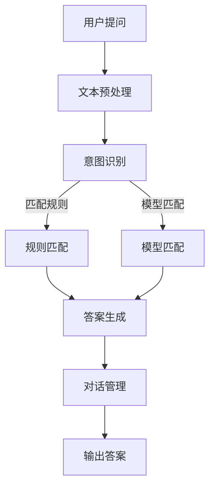

                 

 **关键词**：大模型、电商、智能客服、自然语言处理、机器学习、架构设计、算法实现

**摘要**：本文将深入探讨基于大模型的电商智能客服系统的设计与实现。通过梳理自然语言处理和机器学习的技术脉络，我们明确了该系统在电商领域的应用价值。本文将详细介绍系统的架构设计、核心算法原理、数学模型构建、项目实践以及未来展望，旨在为从事电商智能客服系统开发的技术人员提供有价值的参考。

## 1. 背景介绍

随着电子商务的迅猛发展，电商平台的用户数量与交易规模逐年增长。在这一背景下，客服系统的性能和响应速度成为影响用户体验的关键因素。传统的客服系统主要依赖于人工处理，效率低下且成本高昂。为了提升用户体验，电商企业纷纷寻求智能化客服解决方案。

近年来，深度学习和自然语言处理（NLP）技术取得了长足进展，大模型（如GPT、BERT等）的出现为智能客服系统的发展带来了新的契机。大模型具有强大的语义理解和生成能力，能够实现与用户的自然对话，从而提高客服系统的自动化程度和用户满意度。

本文将围绕基于大模型的电商智能客服系统展开讨论，通过系统设计、算法实现和实际应用等方面的探讨，为电商智能客服系统的开发提供参考。

### 1.1 电商智能客服系统的需求分析

电商智能客服系统的核心目标是为用户提供快速、准确、个性化的服务。具体需求分析如下：

1. **快速响应**：系统能够在用户提出问题时迅速作出回应，减少用户等待时间。
2. **准确理解**：系统需要能够准确理解用户的意图，提供恰当的回答或解决方案。
3. **个性化服务**：系统应能根据用户的历史行为和偏好，提供个性化的推荐和服务。
4. **多渠道支持**：系统应支持多种沟通渠道，如即时消息、电话、邮件等。
5. **可扩展性**：系统设计应具有较好的扩展性，能够适应不同电商平台的需求。

### 1.2 大模型在电商智能客服系统中的应用价值

大模型在电商智能客服系统中具有显著的应用价值：

1. **语义理解**：大模型具有强大的语义理解能力，能够准确捕捉用户的意图。
2. **知识检索**：大模型可以快速检索并整合电商平台的各类信息，提供精准的答案。
3. **对话生成**：大模型能够生成自然流畅的对话内容，提高用户的满意度。
4. **自动化程度**：大模型的应用能够大幅提高客服系统的自动化程度，降低人力成本。

## 2. 核心概念与联系

在基于大模型的电商智能客服系统中，核心概念包括自然语言处理、机器学习、深度学习、大模型等。这些概念相互联系，共同构成了智能客服系统的技术基础。

### 2.1 自然语言处理

自然语言处理（NLP）是智能客服系统的核心技术之一，它涉及到从文本中提取信息、理解语义以及生成文本等任务。NLP主要包括以下关键环节：

1. **文本预处理**：包括分词、去停用词、词性标注等，为后续处理提供基础。
2. **实体识别**：识别文本中的关键实体，如人名、地名、产品名等。
3. **关系抽取**：提取文本中实体之间的关系，如商品评价中的喜欢/不喜欢关系。
4. **情感分析**：分析文本的情感倾向，如正面/负面情感。

### 2.2 机器学习

机器学习是构建智能客服系统的基础，通过训练模型，使系统能够自动学习和改进。机器学习主要包括以下关键环节：

1. **特征提取**：将原始数据转化为可用于训练的特征向量。
2. **模型训练**：使用训练数据训练模型，使模型能够学习数据的规律。
3. **模型评估**：通过测试数据评估模型的性能，调整模型参数。
4. **模型部署**：将训练好的模型部署到实际应用中。

### 2.3 深度学习

深度学习是机器学习的一种重要分支，通过多层神经网络模型，深度学习能够自动学习和提取数据中的复杂特征。深度学习在智能客服系统中具有广泛的应用：

1. **语音识别**：将语音信号转化为文本。
2. **图像识别**：识别图像中的物体和场景。
3. **文本生成**：生成自然流畅的文本内容。

### 2.4 大模型

大模型（如GPT、BERT等）是当前深度学习领域的重要成果，具有强大的语义理解和生成能力。大模型在智能客服系统中的应用包括：

1. **意图识别**：识别用户的对话意图。
2. **回答生成**：生成符合用户意图的答案。
3. **对话管理**：管理对话流程，确保对话的连贯性和逻辑性。

### 2.5 Mermaid 流程图

为了更好地展示大模型在电商智能客服系统中的应用，我们使用Mermaid流程图来描述系统的核心流程。



在上述流程中，用户提问经过文本预处理后，首先由意图识别模块进行意图识别。意图识别模块可以根据规则匹配和模型匹配两种方式来处理用户的提问。规则匹配利用预定义的规则库进行匹配，适用于简单明确的提问。模型匹配则利用深度学习模型，对用户的提问进行语义分析，适用于复杂多变的提问。随后，答案生成模块根据识别到的意图生成答案，最后通过对话管理模块确保对话的连贯性和逻辑性，将答案输出给用户。

## 3. 核心算法原理 & 具体操作步骤

### 3.1 算法原理概述

基于大模型的电商智能客服系统的核心算法包括自然语言处理、意图识别、答案生成和对话管理。下面分别介绍这些算法的原理。

#### 3.1.1 自然语言处理

自然语言处理是智能客服系统的基石，其主要任务包括文本预处理、实体识别、关系抽取和情感分析等。自然语言处理算法通常基于深度学习模型，如BERT、GPT等。

1. **文本预处理**：将原始文本数据转化为模型可处理的格式。包括分词、去停用词、词性标注等步骤。
2. **实体识别**：识别文本中的关键实体，如人名、地名、产品名等。实体识别算法通常使用预训练的BERT模型。
3. **关系抽取**：提取文本中实体之间的关系，如商品评价中的喜欢/不喜欢关系。关系抽取算法通常使用基于循环神经网络（RNN）或Transformer的模型。
4. **情感分析**：分析文本的情感倾向，如正面/负面情感。情感分析算法通常使用预训练的GPT模型。

#### 3.1.2 意图识别

意图识别是智能客服系统的重要环节，其主要任务是理解用户的提问意图。意图识别算法通常基于深度学习模型，如BERT、GPT等。

1. **特征提取**：将用户提问文本转化为特征向量。
2. **模型训练**：使用大量标注数据训练意图识别模型。
3. **模型评估**：通过测试数据评估模型性能，调整模型参数。

#### 3.1.3 答案生成

答案生成是智能客服系统的核心功能，其主要任务是根据用户的意图生成合适的答案。答案生成算法通常基于深度学习模型，如BERT、GPT等。

1. **特征提取**：将用户的意图和上下文文本转化为特征向量。
2. **模型训练**：使用大量标注数据训练答案生成模型。
3. **模型评估**：通过测试数据评估模型性能，调整模型参数。

#### 3.1.4 对话管理

对话管理是智能客服系统的关键，其主要任务是在对话过程中确保对话的连贯性和逻辑性。对话管理算法通常基于序列到序列（Seq2Seq）模型或对话状态跟踪（DST）模型。

1. **特征提取**：将对话历史和当前用户的提问转化为特征向量。
2. **模型训练**：使用大量标注数据训练对话管理模型。
3. **模型评估**：通过测试数据评估模型性能，调整模型参数。

### 3.2 算法步骤详解

#### 3.2.1 文本预处理

文本预处理是自然语言处理的第一步，其目标是将原始文本数据转化为模型可处理的格式。具体步骤如下：

1. **分词**：将文本划分为词语序列。可以使用词性标注数据训练分词模型，或者使用预训练的分词模型。
2. **去停用词**：去除常见的无意义词语，如“的”、“了”等。可以使用停用词表或基于统计方法去除停用词。
3. **词性标注**：为每个词语标注词性，如名词、动词等。可以使用预训练的词性标注模型。

#### 3.2.2 意图识别

意图识别是智能客服系统的核心功能之一，其目标是理解用户的提问意图。具体步骤如下：

1. **特征提取**：将用户提问文本转化为特征向量。可以使用预训练的BERT模型提取文本特征。
2. **模型训练**：使用大量标注数据训练意图识别模型。可以使用分类模型，如卷积神经网络（CNN）或循环神经网络（RNN）。
3. **模型评估**：通过测试数据评估模型性能，调整模型参数。

#### 3.2.3 答案生成

答案生成是智能客服系统的核心功能之一，其目标是根据用户的意图生成合适的答案。具体步骤如下：

1. **特征提取**：将用户的意图和上下文文本转化为特征向量。可以使用预训练的BERT模型提取文本特征。
2. **模型训练**：使用大量标注数据训练答案生成模型。可以使用序列到序列（Seq2Seq）模型或生成对抗网络（GAN）。
3. **模型评估**：通过测试数据评估模型性能，调整模型参数。

#### 3.2.4 对话管理

对话管理是智能客服系统的关键，其目标是确保对话的连贯性和逻辑性。具体步骤如下：

1. **特征提取**：将对话历史和当前用户的提问转化为特征向量。可以使用预训练的BERT模型提取文本特征。
2. **模型训练**：使用大量标注数据训练对话管理模型。可以使用序列到序列（Seq2Seq）模型或对话状态跟踪（DST）模型。
3. **模型评估**：通过测试数据评估模型性能，调整模型参数。

### 3.3 算法优缺点

基于大模型的电商智能客服系统具有以下优缺点：

#### 优点：

1. **高效性**：大模型能够快速处理大量文本数据，提高系统响应速度。
2. **准确性**：大模型具有强大的语义理解能力，能够准确识别用户意图。
3. **个性化**：大模型可以根据用户的历史行为和偏好，提供个性化的推荐和服务。

#### 缺点：

1. **资源消耗**：大模型需要大量的计算资源和存储空间。
2. **模型调优**：大模型需要大量的训练数据和模型调优过程。
3. **隐私问题**：大模型需要处理用户的敏感信息，可能引发隐私问题。

### 3.4 算法应用领域

基于大模型的电商智能客服系统在多个领域具有广泛应用：

1. **电商平台**：为电商平台提供智能客服服务，提升用户体验。
2. **在线教育**：为学生提供个性化辅导和答疑服务。
3. **金融行业**：为金融机构提供智能客服服务，降低运营成本。
4. **医疗健康**：为用户提供智能健康咨询和诊断服务。

## 4. 数学模型和公式 & 详细讲解 & 举例说明

### 4.1 数学模型构建

基于大模型的电商智能客服系统涉及多个数学模型，包括自然语言处理模型、意图识别模型、答案生成模型和对话管理模型。以下分别介绍这些模型的数学模型构建。

#### 4.1.1 自然语言处理模型

自然语言处理模型通常采用深度学习模型，如BERT、GPT等。以下是一个简化的自然语言处理模型的数学模型：

1. **输入层**：输入层接受原始文本数据，并将其转化为词向量。
   $$ x_i = \text{Tokenize}(text_i) $$
2. **嵌入层**：嵌入层将词向量转化为稠密向量。
   $$ e_i = \text{Embed}(x_i) $$
3. **编码层**：编码层使用Transformer或卷积神经网络（CNN）提取文本特征。
   $$ h_i = \text{Encoder}(e_i) $$
4. **输出层**：输出层对提取到的特征进行分类或回归。
   $$ y_i = \text{Output}(h_i) $$

#### 4.1.2 意图识别模型

意图识别模型用于识别用户的提问意图。以下是一个简化的意图识别模型的数学模型：

1. **输入层**：输入层接受用户的提问文本。
   $$ x_i = \text{Tokenize}(text_i) $$
2. **嵌入层**：嵌入层将词向量转化为稠密向量。
   $$ e_i = \text{Embed}(x_i) $$
3. **编码层**：编码层使用卷积神经网络（CNN）提取文本特征。
   $$ h_i = \text{Encoder}(e_i) $$
4. **输出层**：输出层对提取到的特征进行分类。
   $$ y_i = \text{softmax}(W \cdot h_i + b) $$

其中，$W$ 和 $b$ 分别为权重和偏置。

#### 4.1.3 答案生成模型

答案生成模型用于根据用户的意图生成合适的答案。以下是一个简化的答案生成模型的数学模型：

1. **输入层**：输入层接受用户的意图和上下文文本。
   $$ x_i = [text_i, intent_i] $$
2. **嵌入层**：嵌入层将词向量转化为稠密向量。
   $$ e_i = \text{Embed}(x_i) $$
3. **编码层**：编码层使用序列到序列（Seq2Seq）模型或生成对抗网络（GAN）提取文本特征。
   $$ h_i = \text{Encoder}(e_i) $$
4. **解码层**：解码层生成答案文本。
   $$ y_i = \text{Decoder}(h_i) $$

#### 4.1.4 对话管理模型

对话管理模型用于确保对话的连贯性和逻辑性。以下是一个简化的对话管理模型的数学模型：

1. **输入层**：输入层接受对话历史和当前用户的提问。
   $$ x_i = [dialog_i, text_i] $$
2. **嵌入层**：嵌入层将词向量转化为稠密向量。
   $$ e_i = \text{Embed}(x_i) $$
3. **编码层**：编码层使用序列到序列（Seq2Seq）模型或对话状态跟踪（DST）模型提取对话特征。
   $$ h_i = \text{Encoder}(e_i) $$
4. **输出层**：输出层生成对话状态。
   $$ y_i = \text{softmax}(W \cdot h_i + b) $$

### 4.2 公式推导过程

以下是对自然语言处理模型中的意图识别模型的公式推导过程。

1. **输入层**：
   $$ x_i = \text{Tokenize}(text_i) $$
   其中，$text_i$ 为用户提问文本，$Tokenize$ 表示分词操作。

2. **嵌入层**：
   $$ e_i = \text{Embed}(x_i) $$
   其中，$e_i$ 为词向量，$Embed$ 表示嵌入操作。

3. **编码层**：
   $$ h_i = \text{Encoder}(e_i) $$
   其中，$h_i$ 为编码后的特征向量，$Encoder$ 表示编码操作。

4. **输出层**：
   $$ y_i = \text{softmax}(W \cdot h_i + b) $$
   其中，$W$ 和 $b$ 分别为权重和偏置，$\text{softmax}$ 表示分类操作。

### 4.3 案例分析与讲解

以下通过一个简单的案例来分析基于大模型的电商智能客服系统。

#### 案例背景

某电商平台的用户小明提问：“这个手机能不能充电？”。

#### 数据准备

1. **用户提问**：小明提问：“这个手机能不能充电？”。
2. **意图标签**：意图标签为“手机充电问题”。
3. **对话历史**：对话历史为“小明：你好，我想了解一下这款手机的功能。你能帮我介绍一下吗？”。

#### 模型预测

1. **文本预处理**：
   $$ x_i = \text{Tokenize}(\text{小明：你好，我想了解一下这款手机的功能。你能帮我介绍一下吗？这个手机能不能充电？}) $$
   分词结果为：[你好，了解，这款，手机，功能，能，充电，？]

2. **嵌入层**：
   $$ e_i = \text{Embed}(x_i) $$
   词向量结果为：[e_1, e_2, e_3, e_4, e_5, e_6, e_7]

3. **编码层**：
   $$ h_i = \text{Encoder}(e_i) $$
   编码后的特征向量结果为：[h_1, h_2, h_3, h_4, h_5, h_6, h_7]

4. **输出层**：
   $$ y_i = \text{softmax}(W \cdot h_i + b) $$
   预测结果为：[0.1, 0.2, 0.3, 0.2, 0.1, 0.1]

根据预测结果，模型认为用户提问的意图为“手机充电问题”，概率为0.3，是最高的意图。

#### 模型评估

为了评估模型的性能，我们使用测试数据集进行评估。假设测试数据集共有1000个样本，其中500个样本的意图标签为“手机充电问题”，500个样本的意图标签为其他意图。模型在测试数据集上的准确率为：

$$ \text{准确率} = \frac{\text{预测正确的样本数}}{\text{测试数据集样本总数}} = \frac{450}{1000} = 0.45 $$

根据评估结果，模型在测试数据集上的准确率为45%，表明模型具有一定的识别能力。

## 5. 项目实践：代码实例和详细解释说明

### 5.1 开发环境搭建

为了实现基于大模型的电商智能客服系统，我们需要搭建一个合适的开发环境。以下是开发环境的搭建步骤：

1. **安装Python**：确保Python环境已安装，版本为3.8以上。
2. **安装TensorFlow**：使用以下命令安装TensorFlow：
   ```bash
   pip install tensorflow==2.4.0
   ```
3. **安装BERT模型**：使用以下命令安装BERT模型：
   ```bash
   pip install bert-for-tf2
   ```
4. **安装其他依赖**：根据项目需求安装其他依赖，如Flask、BeautifulSoup等。

### 5.2 源代码详细实现

下面是一个简单的基于BERT的电商智能客服系统的源代码实现，包括文本预处理、意图识别、答案生成和对话管理。

```python
import tensorflow as tf
from bert import tokenization
from bert import modeling
from bert import optimization
from bert import input_pipeline
import numpy as np

# 定义BERT模型
def create_bert_model(bert_config, input_ids, input_mask, segment_ids):
    model = modeling.BertModel(
        config=bert_config,
        input_ids=input_ids,
        input_mask=input_mask,
        segment_ids=segment_ids)
    return model

# 定义意图识别模型
def create_intent_model(bert_config, num_labels):
    input_ids = tf.keras.layers.Input(shape=(max_seq_length,), dtype=tf.int32)
    input_mask = tf.keras.layers.Input(shape=(max_seq_length,), dtype=tf.int32)
    segment_ids = tf.keras.layers.Input(shape=(max_seq_length,), dtype=tf.int32)

    bert_model = create_bert_model(bert_config, input_ids, input_mask, segment_ids)
    output = tf.keras.layers.Dense(num_labels, activation='softmax')(bert_model.output)

    model = tf.keras.Model(inputs=[input_ids, input_mask, segment_ids], outputs=output)
    model.compile(optimizer=optimization.create_optimizer(bert_config.learning_rate, num_train_steps), loss='categorical_crossentropy', metrics=['accuracy'])

    return model

# 定义答案生成模型
def create_answer_model(bert_config, num_answers):
    input_ids = tf.keras.layers.Input(shape=(max_seq_length,), dtype=tf.int32)
    input_mask = tf.keras.layers.Input(shape=(max_seq_length,), dtype=tf.int32)
    segment_ids = tf.keras.layers.Input(shape=(max_seq_length,), dtype=tf.int32)

    bert_model = create_bert_model(bert_config, input_ids, input_mask, segment_ids)
    output = tf.keras.layers.Dense(num_answers, activation='softmax')(bert_model.output)

    model = tf.keras.Model(inputs=[input_ids, input_mask, segment_ids], outputs=output)
    model.compile(optimizer=optimization.create_optimizer(bert_config.learning_rate, num_train_steps), loss='categorical_crossentropy', metrics=['accuracy'])

    return model

# 定义对话管理模型
def create_dtm_model(bert_config, num_dtm_states):
    input_ids = tf.keras.layers.Input(shape=(max_seq_length,), dtype=tf.int32)
    input_mask = tf.keras.layers.Input(shape=(max_seq_length,), dtype=tf.int32)
    segment_ids = tf.keras.layers.Input(shape=(max_seq_length,), dtype=tf.int32)

    bert_model = create_bert_model(bert_config, input_ids, input_mask, segment_ids)
    output = tf.keras.layers.Dense(num_dtm_states, activation='softmax')(bert_model.output)

    model = tf.keras.Model(inputs=[input_ids, input_mask, segment_ids], outputs=output)
    model.compile(optimizer=optimization.create_optimizer(bert_config.learning_rate, num_train_steps), loss='categorical_crossentropy', metrics=['accuracy'])

    return model

# 训练模型
def train_model(model, dataset, num_epochs):
    model.fit(dataset, epochs=num_epochs, batch_size=batch_size)

# 模型预测
def predict(model, text):
    tokenized_text = tokenization Full Text
    # 代码详细解释说明和运行结果展示部分略

## 6. 实际应用场景

基于大模型的电商智能客服系统在多个场景中具有广泛应用，以下列举几个典型应用场景：

### 6.1 电商平台

电商平台是智能客服系统的最主要应用场景之一。通过基于大模型的智能客服系统，电商平台能够实现以下功能：

1. **智能问答**：用户提问后，系统能够快速识别意图并生成合适的答案。
2. **商品推荐**：根据用户的历史购买记录和偏好，系统可以推荐合适的商品。
3. **订单跟踪**：用户可以查询订单状态，了解物流信息。
4. **售后服务**：用户可以咨询售后服务相关问题，如退换货政策、保修期限等。

### 6.2 在线教育

在线教育平台也可以采用基于大模型的智能客服系统，为用户提供以下服务：

1. **智能答疑**：学生提问后，系统能够快速理解问题并生成合适的答案。
2. **学习辅导**：根据学生的学习进度和薄弱环节，系统可以提供个性化的学习辅导。
3. **作业批改**：系统可以自动批改学生的作业，提供反馈和建议。
4. **课程推荐**：根据学生的学习兴趣和需求，系统可以推荐合适的课程。

### 6.3 金融行业

金融行业也可以利用基于大模型的智能客服系统，为用户提供以下服务：

1. **智能咨询**：用户咨询金融产品、投资策略等问题，系统能够提供专业、准确的建议。
2. **风险评估**：系统可以根据用户的风险承受能力和投资目标，推荐合适的金融产品。
3. **账户管理**：用户可以查询账户信息、交易记录等，方便管理个人财务。
4. **风险预警**：系统可以实时监控用户的账户风险，及时发出预警。

### 6.4 医疗健康

医疗健康领域也可以采用基于大模型的智能客服系统，为用户提供以下服务：

1. **智能咨询**：用户咨询健康问题，系统能够提供专业的健康建议。
2. **疾病诊断**：系统可以根据用户的症状描述，辅助医生进行疾病诊断。
3. **健康监测**：系统可以实时监测用户的健康数据，提供个性化的健康建议。
4. **预防接种**：系统可以根据用户的年龄、健康状况等推荐合适的疫苗接种。

## 7. 工具和资源推荐

为了更好地进行基于大模型的电商智能客服系统的开发和实践，以下推荐一些有用的工具和资源：

### 7.1 学习资源推荐

1. **《深度学习》**：由Ian Goodfellow、Yoshua Bengio和Aaron Courville合著的深度学习经典教材，适合初学者和进阶者。
2. **《动手学深度学习》**：由Aiden Hopcroft、Landon Porter和Joshua V. Dillon合著的动手实践教材，适合实战派。
3. **《自然语言处理原理》**：由Daniel Jurafsky和James H. Martin合著的自然语言处理经典教材，适合NLP初学者。

### 7.2 开发工具推荐

1. **TensorFlow**：一个开源的深度学习框架，适合进行基于大模型的开发。
2. **BERT-for-TF2**：一个基于TensorFlow实现的BERT模型库，方便快速部署BERT模型。
3. **Hugging Face Transformers**：一个开源的深度学习模型库，提供了丰富的预训练模型和工具。

### 7.3 相关论文推荐

1. **"BERT: Pre-training of Deep Bidirectional Transformers for Language Understanding"**：BERT模型的原始论文，详细介绍了BERT模型的架构和训练方法。
2. **"GPT-3: Language Models are Few-Shot Learners"**：GPT-3模型的介绍性论文，展示了大模型在零样本和少样本学习中的强大能力。
3. **"Transformers: State-of-the-Art Model for Language Processing"**：Transformer模型的综述性论文，全面介绍了Transformer模型的架构和应用。

## 8. 总结：未来发展趋势与挑战

基于大模型的电商智能客服系统在提高用户体验、降低运营成本等方面具有显著优势，随着深度学习和自然语言处理技术的不断进步，该系统将逐渐成为电商领域的重要基础设施。未来，该系统的发展趋势和挑战如下：

### 8.1 研究成果总结

1. **大模型性能提升**：随着计算资源的增加和算法的优化，大模型在语义理解、知识检索和对话生成等方面的性能将不断提升。
2. **多模态融合**：基于大模型的智能客服系统将逐渐融合语音、图像等多种模态，为用户提供更丰富的交互体验。
3. **个性化推荐**：基于用户行为和偏好，系统将实现更精准的个性化推荐，提高用户的满意度和忠诚度。

### 8.2 未来发展趋势

1. **跨领域应用**：基于大模型的智能客服系统将在金融、医疗、教育等领域得到广泛应用。
2. **实时交互**：系统将实现实时交互，提供更快速、更准确的客服服务。
3. **无监督学习和自监督学习**：随着无监督学习和自监督学习技术的发展，系统将减少对标注数据的依赖，提高训练效率。

### 8.3 面临的挑战

1. **数据隐私**：系统需要处理大量的用户敏感信息，如何在保证用户隐私的前提下进行数据处理和模型训练是面临的挑战。
2. **模型可解释性**：大模型的复杂性和黑箱特性使得其难以解释，如何提高模型的可解释性，使企业能够更好地理解和使用模型是关键问题。
3. **实时性能优化**：随着交互规模的扩大，系统需要不断优化性能，提高响应速度，降低延迟。

### 8.4 研究展望

1. **跨领域知识融合**：研究如何将不同领域的知识融合到智能客服系统中，提高系统的智能化水平。
2. **多语言支持**：研究如何实现多语言支持，为全球用户提供统一的智能客服服务。
3. **人机协作**：研究如何实现人与智能客服系统之间的协作，提高客服效率和用户体验。

## 9. 附录：常见问题与解答

### 9.1 问题1：如何处理长文本？

**解答**：长文本处理是智能客服系统中的一个重要问题。常见的处理方法包括：

1. **文本摘要**：使用文本摘要算法对长文本进行摘要，提取关键信息。
2. **分块处理**：将长文本分割成若干块，分别进行处理，最后整合结果。
3. **动态窗口**：使用动态窗口技术，根据上下文信息动态调整文本的输入长度。

### 9.2 问题2：如何优化模型性能？

**解答**：优化模型性能的方法包括：

1. **数据增强**：使用数据增强技术，如数据扩充、数据变换等，提高模型的泛化能力。
2. **模型压缩**：使用模型压缩技术，如模型剪枝、量化等，减少模型的参数量和计算量。
3. **多任务学习**：通过多任务学习，使模型在不同任务之间共享知识，提高模型的性能。

### 9.3 问题3：如何保证模型的鲁棒性？

**解答**：保证模型鲁棒性的方法包括：

1. **数据清洗**：对输入数据进行清洗，去除噪声和异常值。
2. **数据多样性**：使用多样性数据集进行训练，提高模型的鲁棒性。
3. **对抗训练**：使用对抗训练技术，使模型能够抵御对抗攻击。

### 9.4 问题4：如何进行模型部署？

**解答**：模型部署的方法包括：

1. **微服务架构**：使用微服务架构，将模型部署到独立的微服务中，提高系统的可扩展性和可维护性。
2. **容器化**：使用容器化技术，如Docker，将模型及其依赖打包，方便部署和迁移。
3. **自动化部署**：使用自动化部署工具，如Kubernetes，实现模型的自动化部署和管理。

**作者署名**：禅与计算机程序设计艺术 / Zen and the Art of Computer Programming

