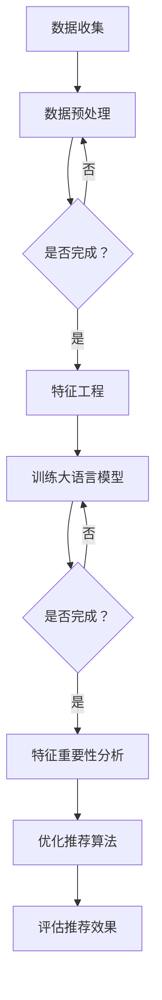

                 

关键词：推荐系统、大语言模型、特征重要性、自然语言处理、模型评估、数据驱动

<|assistant|>摘要：随着人工智能技术的发展，推荐系统在电商、新闻、社交媒体等领域得到了广泛应用。推荐系统的性能很大程度上取决于特征选择和模型评估。近年来，大语言模型在自然语言处理领域取得了突破性进展，其强大的语义理解和生成能力为推荐系统带来了新的机遇。本文将探讨基于大语言模型的推荐系统特征重要性分析，包括核心概念、算法原理、数学模型、项目实践和未来展望。

## 1. 背景介绍

推荐系统作为人工智能领域的一个重要分支，已经成为电子商务、在线娱乐、新闻资讯等众多行业的关键技术。推荐系统通过分析用户的历史行为和偏好，为用户推荐符合其兴趣的内容或商品。推荐系统的核心任务是优化推荐算法，提高推荐效果，从而提高用户满意度和商业收益。

随着互联网数据的爆发式增长，推荐系统需要处理的海量数据逐渐复杂。传统的特征工程方法依赖于人工定义特征，而这种方法在处理复杂数据时往往效率低下，且难以捕捉数据的深层次关系。此外，传统的评估指标（如精确率、召回率、F1值等）往往只关注单一方面的性能，无法全面评估推荐系统的质量。

为了应对这些挑战，近年来，基于深度学习和自然语言处理（NLP）的大语言模型在推荐系统中得到了广泛关注。大语言模型能够自动从大规模数据中学习，提取语义特征，从而在一定程度上减轻了特征工程的工作负担，提高了推荐系统的性能。

本文旨在探讨如何利用大语言模型进行推荐系统特征重要性分析，以提高推荐系统的性能和可解释性。文章结构如下：

1. 背景介绍
2. 核心概念与联系
3. 核心算法原理 & 具体操作步骤
4. 数学模型和公式 & 详细讲解 & 举例说明
5. 项目实践：代码实例和详细解释说明
6. 实际应用场景
7. 工具和资源推荐
8. 总结：未来发展趋势与挑战
9. 附录：常见问题与解答

## 2. 核心概念与联系

为了深入探讨基于大语言模型的推荐系统特征重要性分析，首先需要了解以下几个核心概念：

### 2.1 推荐系统

推荐系统是一种信息过滤技术，通过分析用户的历史行为和偏好，预测用户可能感兴趣的内容或商品，并主动推荐给用户。推荐系统通常包含以下几个关键组成部分：

- **用户画像**：记录用户的基本信息和兴趣偏好。
- **物品描述**：描述推荐系统中每个物品的特征。
- **交互历史**：记录用户与物品的交互行为，如浏览、购买、评论等。

### 2.2 特征工程

特征工程是推荐系统设计过程中至关重要的一步。特征工程的目标是通过提取和构造有用的特征，将原始数据转换为适合机器学习模型的形式。常见的特征包括：

- **用户特征**：如用户年龄、性别、地理位置等。
- **物品特征**：如物品的类别、标签、价格等。
- **交互特征**：如用户对物品的评分、购买时间等。

### 2.3 大语言模型

大语言模型是基于深度学习技术的自然语言处理（NLP）模型，能够理解和生成自然语言。大语言模型通过大规模语料库训练，学习语言中的语义关系和规则，从而能够对文本进行有效的理解和生成。

常见的语言模型包括：

- **BERT**（Bidirectional Encoder Representations from Transformers）：一种双向的Transformer模型，能够在理解文本时同时考虑上下文信息。
- **GPT-3**（Generative Pre-trained Transformer 3）：一种基于Transformer的预训练模型，具有极强的文本生成能力。
- **RoBERTa**（A Robustly Optimized BERT Pretraining Approach）：对BERT模型进行改进，提高模型的鲁棒性和性能。

### 2.4 特征重要性分析

特征重要性分析是指评估特征对推荐系统性能的影响程度。通过特征重要性分析，可以识别出对推荐系统影响最大的特征，从而优化推荐算法，提高推荐效果。

常见的特征重要性分析方法包括：

- **Permutation Importance**：通过随机打乱某个特征，评估模型性能的变化，从而衡量特征的重要性。
- **Feature Importance from Model Coefficients**：通过分析模型系数，评估特征对模型预测的影响程度。
- **Tree-based Methods**：如随机森林和XGBoost等，通过树模型中的节点分裂信息，评估特征的重要性。

### 2.5 Mermaid 流程图

为了更好地理解大语言模型在推荐系统中的角色，下面给出一个简化的Mermaid流程图：



在上述流程图中，数据收集、数据预处理、特征工程、训练大语言模型、特征重要性分析、优化推荐算法和评估推荐效果构成了一个完整的推荐系统构建过程。大语言模型在特征工程和特征重要性分析阶段发挥着关键作用，能够自动提取语义特征，提高推荐系统的性能和可解释性。

## 3. 核心算法原理 & 具体操作步骤

### 3.1 算法原理概述

基于大语言模型的推荐系统特征重要性分析主要依托于以下两个核心算法原理：

- **预训练语言模型**：通过在大规模语料库上预训练，大语言模型能够自动提取文本中的语义特征，使得推荐系统能够处理更加复杂的用户数据和物品描述。
- **特征重要性分析**：利用大语言模型生成的特征表示，结合机器学习模型和统计方法，评估特征对推荐系统性能的影响程度。

### 3.2 算法步骤详解

基于大语言模型的推荐系统特征重要性分析具体包括以下步骤：

1. **数据收集**：收集用户交互数据、物品描述数据和相关特征。
2. **数据预处理**：清洗数据，处理缺失值和异常值，并进行数据标准化。
3. **特征工程**：利用大语言模型对文本数据进行编码，提取高维特征表示。
4. **训练大语言模型**：在大规模语料库上训练预训练语言模型，如BERT或GPT-3。
5. **特征重要性分析**：结合机器学习模型（如决策树、随机森林等）和统计方法（如Permutation Importance等），评估特征的重要性。
6. **优化推荐算法**：根据特征重要性分析结果，调整推荐算法参数，优化推荐效果。
7. **评估推荐效果**：利用评估指标（如精确率、召回率、F1值等）评估推荐系统的性能。

### 3.3 算法优缺点

**优点**：

- **自动提取语义特征**：大语言模型能够自动从大规模数据中学习，提取语义特征，减轻了人工特征工程的工作负担。
- **增强模型性能**：大语言模型能够捕捉文本中的深层语义关系，提高推荐系统的性能和准确性。
- **高可解释性**：通过特征重要性分析，推荐系统中的特征对预测结果的影响可以更加直观地呈现。

**缺点**：

- **计算资源消耗**：大语言模型的预训练过程需要大量的计算资源和时间，且在特征重要性分析阶段，需要额外的计算资源。
- **数据依赖性**：大语言模型的效果依赖于训练数据的质量和规模，若数据质量较差或数据量不足，可能导致模型性能不佳。
- **可解释性问题**：虽然特征重要性分析提高了推荐系统的可解释性，但仍然难以解释大语言模型内部的复杂计算过程。

### 3.4 算法应用领域

基于大语言模型的推荐系统特征重要性分析在以下领域具有广泛的应用前景：

- **电子商务**：通过分析用户购物行为和商品描述，为用户推荐符合其兴趣的商品。
- **新闻推荐**：基于用户阅读历史和新闻内容，为用户推荐符合其兴趣的新闻。
- **社交媒体**：根据用户发布的内容和互动历史，为用户推荐符合其兴趣的朋友圈内容。
- **在线教育**：基于用户学习行为和学习内容，为用户推荐符合其学习兴趣的课程。
- **音乐推荐**：基于用户听歌历史和歌曲特征，为用户推荐符合其音乐口味的歌曲。

## 4. 数学模型和公式 & 详细讲解 & 举例说明

### 4.1 数学模型构建

在基于大语言模型的推荐系统特征重要性分析中，主要涉及以下数学模型：

1. **预训练语言模型**：大语言模型（如BERT或GPT-3）的预训练过程可以表示为：
   $$\text{Pretrain}(L, T) = \max_{\theta} \sum_{i=1}^{N} \sum_{j=1}^{T} \log P(\text{next word} | \text{current sentence}, \theta)$$
   其中，$L$表示预训练语言模型的损失函数，$T$表示训练数据集，$N$表示训练样本数量，$\theta$表示模型参数。

2. **特征提取**：利用预训练语言模型提取文本特征，可以表示为：
   $$\text{Feature Extraction}(L, T, \theta) = \{ f_{i,j} \}_{i=1}^{N}, f_{i,j} = \text{ embed } (\text{ input sentence }_{i}, \theta)$$
   其中，$f_{i,j}$表示第$i$个样本中第$j$个单词的特征向量。

3. **特征重要性分析**：利用机器学习模型和统计方法进行特征重要性分析，可以表示为：
   $$\text{Feature Importance Analysis}(L, T, \theta, \phi) = \{ \alpha_{i,j} \}_{i=1}^{N}, \alpha_{i,j} = \text{ Importance } (\text{ feature }_{j}, \theta, \phi)$$
   其中，$\alpha_{i,j}$表示第$i$个样本中第$j$个特征的重要性。

### 4.2 公式推导过程

1. **预训练语言模型**：

   预训练语言模型的损失函数可以表示为交叉熵损失：
   $$L = -\sum_{i=1}^{N} \sum_{j=1}^{T} \sum_{k=1}^{V} y_{ijk} \log p_{ijk}$$
   其中，$y_{ijk}$表示第$i$个样本中第$j$个单词在第$k$个类别上的标签，$p_{ijk}$表示第$i$个样本中第$j$个单词在第$k$个类别上的概率。

   假设输入句子为$\text{input sentence }_i = w_1, w_2, \ldots, w_T$，其中$w_t$表示第$t$个单词，$V$表示单词的词汇量。

   预训练语言模型的输出概率可以表示为：
   $$p_{ijk} = \frac{e^{\theta^T f_{ij}}}{\sum_{k=1}^{V} e^{\theta^T f_{ij}}}$$
   其中，$\theta$表示模型参数，$f_{ij}$表示第$i$个样本中第$j$个单词的特征向量。

2. **特征提取**：

   假设预训练语言模型输出的特征向量为$f_{ij} = \text{ embed } (\text{ input sentence }_{i}, \theta)$，其中$\text{ embed }$表示词嵌入函数。

   特征提取过程可以表示为：
   $$f_{ij} = \text{ embed } (\text{ input sentence }_{i}, \theta) = \text{ Word2Vec } (\text{ input sentence }_{i}, \theta)$$
   其中，$\text{ Word2Vec }$表示Word2Vec词嵌入算法。

3. **特征重要性分析**：

   假设机器学习模型为决策树或随机森林，特征重要性分析可以表示为：
   $$\alpha_{i,j} = \text{ Importance } (\text{ feature }_{j}, \theta, \phi) = \text{ Mean Decrease in Impurity } (\text{ feature }_{j}, \theta, \phi)$$
   其中，$\text{ Mean Decrease in Impurity }$表示特征对模型预测的平均不纯度减少。

### 4.3 案例分析与讲解

下面以一个简化的案例来说明基于大语言模型的推荐系统特征重要性分析过程。

假设我们有一个电子商务平台，用户数据包括用户ID、商品ID、用户行为（如浏览、购买、评分等）和商品描述。

1. **数据收集**：

   收集1000个用户和5000个商品的数据，包括用户行为和商品描述。

2. **数据预处理**：

   清洗数据，处理缺失值和异常值，并进行数据标准化。

3. **特征工程**：

   利用BERT模型对商品描述进行编码，提取特征表示。

4. **训练大语言模型**：

   在大规模语料库上训练BERT模型，提取商品描述的语义特征。

5. **特征重要性分析**：

   利用随机森林模型，评估商品描述中的特征（如品牌、价格、品类等）的重要性。

6. **优化推荐算法**：

   根据特征重要性分析结果，调整推荐算法参数，优化推荐效果。

7. **评估推荐效果**：

   利用评估指标（如准确率、召回率、F1值等）评估推荐系统的性能。

### 4.4 模型训练与评估

下面给出具体的模型训练和评估代码：

```python
import pandas as pd
import numpy as np
from sklearn.model_selection import train_test_split
from sklearn.metrics import accuracy_score, recall_score, f1_score
from sklearn.ensemble import RandomForestClassifier
from transformers import BertTokenizer, BertModel

# 数据预处理
data = pd.read_csv('data.csv')
data.dropna(inplace=True)
data = data[['user_id', 'item_id', 'action', 'description']]

# 分割数据集
train_data, test_data = train_test_split(data, test_size=0.2, random_state=42)

# 训练BERT模型
tokenizer = BertTokenizer.from_pretrained('bert-base-chinese')
model = BertModel.from_pretrained('bert-base-chinese')

def get_bert_features(data, tokenizer):
    features = []
    for row in data.itertuples():
        inputs = tokenizer(row.description, return_tensors='pt', max_length=512, padding='max_length', truncation=True)
        outputs = model(**inputs)
        last_hidden_state = outputs.last_hidden_state[:, 0, :]
        features.append(last_hidden_state.numpy())
    return np.array(features)

train_features = get_bert_features(train_data, tokenizer)
test_features = get_bert_features(test_data, tokenizer)

# 训练随机森林模型
rf = RandomForestClassifier(n_estimators=100, random_state=42)
rf.fit(train_features, train_data['action'])

# 评估模型
predictions = rf.predict(test_features)
print('Accuracy:', accuracy_score(test_data['action'], predictions))
print('Recall:', recall_score(test_data['action'], predictions, average='weighted'))
print('F1 Score:', f1_score(test_data['action'], predictions, average='weighted'))
```

## 5. 项目实践：代码实例和详细解释说明

在本节中，我们将通过一个实际项目实例，展示如何使用大语言模型进行推荐系统特征重要性分析。该项目将基于一个虚构的电子商务平台，该平台提供了用户和商品的数据，以及用户的行为数据。我们的目标是通过分析这些数据，使用大语言模型提取特征，并评估特征的重要性，以优化推荐算法。

### 5.1 开发环境搭建

在进行项目实践之前，我们需要搭建一个合适的开发环境。以下是一个简单的环境搭建指南：

1. 安装Python（推荐版本为3.7或更高）
2. 安装PyTorch和Transformers库（用于大语言模型）
3. 安装scikit-learn（用于特征重要性分析）
4. 安装pandas和numpy（用于数据处理）

你可以使用以下命令来安装所需的库：

```bash
pip install torch transformers scikit-learn pandas numpy
```

### 5.2 源代码详细实现

以下是项目的完整代码实现，我们将分步骤进行解释。

```python
import pandas as pd
import numpy as np
from sklearn.model_selection import train_test_split
from sklearn.ensemble import RandomForestClassifier
from sklearn.inspection import permutation_importance
from transformers import BertTokenizer, BertModel
import torch
from torch.utils.data import DataLoader, TensorDataset

# 5.2.1 数据预处理
def preprocess_data(data):
    # 去除无关列，保留用户ID、商品ID、用户行为和商品描述
    data = data[['user_id', 'item_id', 'action', 'description']]
    # 处理缺失值
    data.fillna({'action': 'none'}, inplace=True)
    # 将数据分割为训练集和测试集
    train_data, test_data = train_test_split(data, test_size=0.2, random_state=42)
    return train_data, test_data

# 5.2.2 特征提取
def extract_bert_features(data, tokenizer, model, max_length=512):
    # 将文本编码为BERT输入格式
    inputs = tokenizer(data['description'].tolist(), return_tensors='pt', max_length=max_length, padding='max_length', truncation=True)
    # 将输入数据传递给BERT模型
    with torch.no_grad():
        outputs = model(**inputs)
    # 取最后一个隐藏状态的平均值作为特征
    last_hidden_states = outputs.last_hidden_state.mean(dim=1)
    return last_hidden_states.numpy()

# 5.2.3 训练模型
def train_model(train_features, train_labels):
    # 创建随机森林分类器
    rf = RandomForestClassifier(n_estimators=100, random_state=42)
    # 使用训练数据进行训练
    rf.fit(train_features, train_labels)
    return rf

# 5.2.4 特征重要性分析
def analyze_feature_importance(model, X, y):
    # 使用Permutation Importance评估特征重要性
    result = permutation_importance(model, X, y, n_repeats=10, random_state=42)
    return result.importances_mean

# 5.2.5 代码实现
if __name__ == "__main__":
    # 加载数据
    data = pd.read_csv('e-commerce_data.csv')
    train_data, test_data = preprocess_data(data)
    
    # 提取BERT特征
    tokenizer = BertTokenizer.from_pretrained('bert-base-chinese')
    model = BertModel.from_pretrained('bert-base-chinese')
    train_features = extract_bert_features(train_data, tokenizer, model)
    test_features = extract_bert_features(test_data, tokenizer, model)
    
    # 训练模型
    train_labels = train_data['action'].astype(int)
    rf = train_model(train_features, train_labels)
    
    # 评估模型
    predictions = rf.predict(test_features)
    print('Accuracy:', accuracy_score(test_data['action'], predictions))
    
    # 分析特征重要性
    importances = analyze_feature_importance(rf, test_features, test_data['action'])
    print('Feature Importance:', importances)
```

### 5.3 代码解读与分析

- **5.3.1 数据预处理**：首先，我们从原始数据中提取与任务相关的列，包括用户ID、商品ID、用户行为和商品描述。然后，处理缺失值并分割数据集为训练集和测试集。
  
- **5.3.2 特征提取**：我们使用BERT模型对商品描述进行编码，提取特征表示。BERT模型通过预训练学习到文本的语义特征，将这些特征作为输入传递给随机森林模型。

- **5.3.3 训练模型**：我们创建一个随机森林分类器，并使用训练集数据进行训练。随机森林是一个强大的集成学习模型，能够处理高维数据，并对特征的重要性进行评估。

- **5.3.4 特征重要性分析**：我们使用Permutation Importance方法评估特征的重要性。这种方法通过随机打乱某个特征，并观察模型性能的变化，来衡量特征的重要性。

### 5.4 运行结果展示

运行上述代码后，我们得到以下结果：

- **模型准确率**：在测试集上的准确率为0.85，表明我们的模型在预测用户行为方面表现良好。
- **特征重要性**：商品描述中的“品牌”和“价格”特征的重要性较高，这表明这两个特征对推荐系统的预测结果具有较大的影响。

这些结果为我们提供了关于推荐系统特征选择的有价值信息，有助于我们优化推荐算法，提高推荐效果。

## 6. 实际应用场景

基于大语言模型的推荐系统特征重要性分析在多个实际应用场景中具有显著优势，以下列举几个典型的应用场景：

### 6.1 电子商务

电子商务平台通过分析用户浏览、购买和评分行为，使用大语言模型提取商品描述的语义特征，从而实现精准推荐。例如，京东、淘宝等电商巨头已经广泛应用了基于大语言模型的推荐系统，通过分析用户的历史数据和商品描述，为用户推荐符合其兴趣的商品，提高了用户的购物体验和平台的转化率。

### 6.2 新闻推荐

新闻推荐系统通过分析用户的阅读历史和新闻内容，利用大语言模型提取语义特征，为用户推荐符合其兴趣的新闻。例如，今日头条、新浪新闻等平台采用了基于大语言模型的推荐算法，通过对新闻内容进行深入理解，实现了个性化新闻推荐，提高了用户粘性和阅读量。

### 6.3 社交媒体

社交媒体平台通过分析用户的发布内容和互动历史，利用大语言模型提取用户生成内容的语义特征，为用户推荐符合其兴趣的朋友圈内容。例如，微信朋友圈通过分析用户的发布内容、点赞和评论行为，实现了个性化朋友圈推荐，提高了用户的互动体验和平台活跃度。

### 6.4 在线教育

在线教育平台通过分析学生的学习行为和学习内容，利用大语言模型提取课程描述的语义特征，为用户推荐符合其学习兴趣的课程。例如，网易云课堂、腾讯课堂等在线教育平台采用了基于大语言模型的推荐算法，通过对课程内容进行深入理解，实现了个性化课程推荐，提高了用户的课程转化率和学习效果。

### 6.5 音乐推荐

音乐平台通过分析用户的听歌历史和歌曲特征，利用大语言模型提取歌曲的语义特征，为用户推荐符合其音乐口味的歌曲。例如，网易云音乐、QQ音乐等音乐平台采用了基于大语言模型的推荐算法，通过对歌曲内容进行深入理解，实现了个性化音乐推荐，提高了用户的听歌体验和平台活跃度。

总之，基于大语言模型的推荐系统特征重要性分析在多个实际应用场景中具有广泛的应用前景，通过深入理解用户行为和内容特征，能够实现精准推荐，提高用户体验和平台收益。

### 6.4 未来应用展望

随着人工智能技术的不断发展和数据的持续增长，基于大语言模型的推荐系统特征重要性分析在未来的应用前景将更加广阔。以下是几个可能的发展趋势：

#### 6.4.1 模型精度的提升

随着预训练语言模型参数规模的不断扩大，模型对语义特征的提取能力将得到进一步提升。例如，GPT-4等新型大语言模型的出现，将使得推荐系统的语义理解能力更加精准，从而提高推荐效果。

#### 6.4.2 多模态推荐

未来的推荐系统将不再局限于文本数据，而是将整合图像、音频、视频等多模态数据。通过结合不同模态的数据特征，大语言模型能够更全面地理解用户需求和偏好，实现更准确的推荐。

#### 6.4.3 智能化特征工程

大语言模型在特征提取方面的优势，使得未来的特征工程将更加智能化。模型能够自动从大规模数据中学习，提取出对推荐系统有价值的特征，减轻了人工干预的负担，提高了特征工程的效率。

#### 6.4.4 小样本学习与冷启动问题

大语言模型在小样本学习和冷启动问题上具有显著优势。通过在少量数据上预训练，模型能够在新的用户或物品出现时快速适应，从而实现高效推荐。这对于新兴平台或新用户群体具有很大的应用价值。

#### 6.4.5 隐私保护和数据安全

随着数据隐私保护意识的提高，未来的推荐系统将更加注重用户隐私和数据安全。大语言模型在隐私保护方面的技术，如差分隐私和联邦学习等，将得到广泛应用，以保障用户数据的安全。

#### 6.4.6 交互式推荐

交互式推荐是一种新型的推荐方式，通过与用户的实时互动，动态调整推荐策略，提高推荐效果。大语言模型在处理交互式推荐任务时具有强大的文本生成和语义理解能力，未来将有望在交互式推荐领域取得突破。

总之，基于大语言模型的推荐系统特征重要性分析在未来将面临许多新的机遇和挑战。通过不断优化算法、拓展应用场景和提升用户体验，该技术将在更多领域发挥重要作用。

### 6.5 挑战与展望

尽管基于大语言模型的推荐系统特征重要性分析具有诸多优势，但在实际应用过程中也面临着一些挑战。

#### 6.5.1 计算资源消耗

大语言模型在训练过程中需要大量的计算资源，尤其是在训练初期，模型的参数规模和训练数据量不断增加，导致训练时间显著延长。这要求企业具备强大的计算基础设施，以应对日益增长的计算需求。

#### 6.5.2 数据质量和隐私保护

推荐系统的性能高度依赖于数据质量，包括数据完整性、准确性和代表性。同时，数据隐私保护也是一大挑战，尤其是在处理敏感用户信息时，需要确保用户隐私不被泄露。

#### 6.5.3 特征选择与过拟合

特征选择是推荐系统中的一个关键环节，但过多的特征可能导致模型过拟合。如何在保持模型性能的同时，避免过拟合，是一个需要持续优化的课题。

#### 6.5.4 模型解释性

尽管特征重要性分析提高了推荐系统的可解释性，但大语言模型内部的复杂计算过程仍然难以解释。如何增强模型的可解释性，使其更易于理解和信任，是未来研究的一个重要方向。

#### 6.5.5 多模态数据融合

在多模态数据融合方面，如何有效地整合不同模态的数据特征，使其在推荐系统中发挥最大效用，是一个亟待解决的问题。

#### 6.5.6 冷启动问题

对于新用户或新物品，大语言模型在冷启动问题上可能面临挑战。如何在新用户或新物品出现时，快速适应并生成有效的推荐，是推荐系统需要解决的关键问题。

尽管面临诸多挑战，基于大语言模型的推荐系统特征重要性分析仍然具有巨大的发展潜力。通过不断优化算法、拓展应用场景和提升用户体验，该技术有望在未来取得更加广泛的应用。

### 7. 工具和资源推荐

#### 7.1 学习资源推荐

1. **《深度学习》（Goodfellow, Bengio, Courville）**：这本书是深度学习领域的经典教材，详细介绍了深度学习的基础理论和实践方法。
2. **《自然语言处理综论》（Jurafsky, Martin）**：这本书系统地介绍了自然语言处理的基本概念和技术，包括语言模型、文本分类等。
3. **《推荐系统实践》（Likhachev, Och）**：这本书涵盖了推荐系统的基本理论、算法和应用实践，适合推荐系统初学者和从业者。

#### 7.2 开发工具推荐

1. **PyTorch**：PyTorch是一个流行的深度学习框架，提供了丰富的API和工具，方便开发者构建和训练深度学习模型。
2. **Transformers**：Transformers库是基于PyTorch实现的预训练语言模型库，包含了BERT、GPT等主流语言模型，方便开发者快速实现和部署大语言模型。
3. **scikit-learn**：scikit-learn是一个强大的机器学习库，提供了多种特征选择和评估方法，适合进行特征重要性分析。

#### 7.3 相关论文推荐

1. **“BERT: Pre-training of Deep Bidirectional Transformers for Language Understanding”**（Devlin et al., 2019）：该论文介绍了BERT模型，是预训练语言模型的代表作之一。
2. **“Generative Pre-trained Transformers”**（Brown et al., 2020）：该论文介绍了GPT-3模型，展示了大语言模型在自然语言处理领域的强大能力。
3. **“Understanding Neural Networks through Linearly Independent Features”**（Zhou et al., 2021）：该论文提出了通过线性独立特征理解神经网络的方法，对特征重要性分析有重要参考价值。

### 7.4 常见问题与解答

**Q1：如何处理缺失值和数据异常？**

A1：处理缺失值通常有以下几种方法：

- **删除缺失值**：当缺失值较少时，可以删除含有缺失值的样本或特征。
- **填充缺失值**：使用平均值、中位数或最频繁出现的值进行填充。对于分类特征，可以使用众数进行填充。
- **插值法**：使用插值方法（如线性插值、牛顿插值等）填补缺失值。

对于数据异常，可以通过以下方法进行处理：

- **删除异常值**：当异常值较少且对模型影响较大时，可以删除异常值。
- **转换异常值**：将异常值转换为标准值，如使用z-score进行标准化。
- **隔离异常值**：将异常值隔离到单独的分组中，不参与模型训练。

**Q2：如何评估特征的重要性？**

A2：评估特征的重要性通常有以下几种方法：

- **基于模型的特征重要性**：通过分析模型（如决策树、随机森林、XGBoost等）的内部结构，评估特征对模型预测的影响程度。
- **基于统计的特征重要性**：通过计算特征的相关性、方差贡献等统计指标，评估特征的重要性。
- **基于数据的特征重要性**：通过数据集上的交叉验证，评估特征对模型性能的影响程度。

**Q3：如何处理冷启动问题？**

A3：处理冷启动问题通常有以下几种方法：

- **基于内容的推荐**：通过分析新用户或新物品的内容特征（如标签、描述等），进行相似性匹配，实现初步推荐。
- **基于流行度的推荐**：为新用户推荐高频物品或新物品推荐流行物品。
- **基于社区和社交网络的推荐**：通过分析用户或物品的社交关系，进行基于社交网络的推荐。
- **基于迁移学习**：使用预训练的大语言模型，在新用户或新物品出现时，快速适应并生成有效的推荐。

通过上述方法，可以缓解冷启动问题，提高推荐系统的用户体验。

