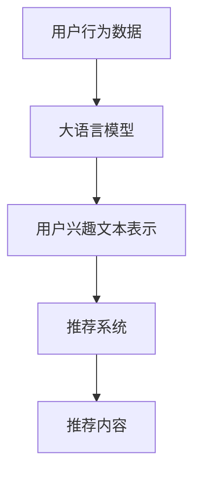

                 

关键词：大语言模型，推荐系统，用户兴趣，算法原理，数学模型，项目实践，应用场景，工具推荐，未来展望

> 摘要：本文将探讨基于大语言模型的推荐系统在用户兴趣挖掘方面的应用。通过对大语言模型的核心概念、算法原理、数学模型和项目实践的详细解析，我们将深入理解其工作原理，并探讨其在实际应用中的优势和挑战。

## 1. 背景介绍

推荐系统是一种常见的信息过滤方法，旨在向用户推荐他们可能感兴趣的内容。随着互联网的快速发展，用户产生的数据量呈爆炸性增长，如何从海量数据中提取有价值的信息成为了一个重要的研究课题。传统的推荐系统主要依赖于基于内容的推荐、协同过滤等算法，但这些方法存在一些局限性，如冷启动问题、数据稀疏性等。

近年来，随着深度学习技术的不断进步，大语言模型（如BERT、GPT等）在自然语言处理领域取得了显著的成果。大语言模型通过捕捉海量文本数据的内在规律，能够生成与人类语言高度相似的文本。这为推荐系统在用户兴趣挖掘方面提供了一种新的思路。

本文将重点探讨基于大语言模型的推荐系统在用户兴趣探索方面的应用。通过介绍大语言模型的核心概念、算法原理、数学模型和项目实践，我们将深入理解其工作原理，并探讨其在实际应用中的优势和挑战。

## 2. 核心概念与联系

### 2.1 大语言模型

大语言模型是一种基于深度学习的自然语言处理模型，通过训练大量的文本数据，能够生成与人类语言高度相似的文本。其核心思想是通过捕捉文本数据中的潜在规律，实现对语言的理解和生成。

常见的预训练大语言模型包括BERT（Bidirectional Encoder Representations from Transformers）、GPT（Generative Pre-trained Transformer）等。BERT模型通过双向编码器结构，同时捕捉文本的前后关系，从而生成更加准确的语言表示。GPT模型则采用生成式方法，通过自回归方式生成文本。

### 2.2 推荐系统

推荐系统是一种常见的信息过滤方法，旨在向用户推荐他们可能感兴趣的内容。根据推荐策略的不同，推荐系统可以分为基于内容的推荐、协同过滤、混合推荐等。

基于内容的推荐方法通过分析用户的历史行为和内容特征，将相似的内容推荐给用户。协同过滤方法通过分析用户之间的相似度，将其他用户喜欢的物品推荐给目标用户。混合推荐方法结合了基于内容和协同过滤的方法，以获得更好的推荐效果。

### 2.3 大语言模型与推荐系统的联系

大语言模型在推荐系统中的应用主要体现在用户兴趣挖掘和内容理解方面。

首先，大语言模型可以用于提取用户的历史行为数据中的潜在兴趣点。通过将用户的历史行为数据（如搜索记录、浏览历史等）输入到大语言模型中，模型可以生成与用户兴趣相关的文本表示。这些文本表示可以作为用户兴趣的特征，用于推荐系统中的用户兴趣建模。

其次，大语言模型可以用于理解推荐内容。在基于内容的推荐方法中，大语言模型可以生成与推荐内容相关的文本表示，从而更好地理解推荐内容的特点和属性。在协同过滤方法中，大语言模型可以用于生成用户之间的文本相似度，从而更准确地预测用户对推荐内容的兴趣。

### 2.4 Mermaid 流程图

以下是一个简化的 Mermaid 流程图，展示了大语言模型与推荐系统的关系：



## 3. 核心算法原理 & 具体操作步骤

### 3.1 算法原理概述

基于大语言模型的推荐系统主要分为两个阶段：用户兴趣建模和推荐内容生成。

在用户兴趣建模阶段，首先将用户的历史行为数据输入到大语言模型中，通过预训练得到的文本表示来提取用户兴趣。具体来说，将用户的历史行为数据（如搜索记录、浏览历史等）转化为文本形式，然后输入到大语言模型中进行编码，得到用户兴趣的文本表示。

在推荐内容生成阶段，首先将推荐内容输入到大语言模型中，通过编码得到推荐内容的文本表示。然后，计算用户兴趣文本表示与推荐内容文本表示之间的相似度，根据相似度对推荐内容进行排序，从而生成推荐列表。

### 3.2 算法步骤详解

#### 用户兴趣建模

1. 数据预处理：将用户的历史行为数据（如搜索记录、浏览历史等）转化为文本形式。例如，将搜索记录转化为关键词序列，将浏览历史转化为网页摘要等。

2. 输入到大语言模型：将预处理后的文本数据输入到大语言模型中进行编码。这里可以采用预训练好的模型（如BERT、GPT等）或者微调的模型。

3. 提取用户兴趣文本表示：通过编码过程，得到用户兴趣的文本表示。这些文本表示可以用于后续的用户兴趣建模。

#### 推荐内容生成

1. 输入推荐内容：将推荐内容（如商品、新闻等）输入到大语言模型中进行编码。

2. 计算相似度：计算用户兴趣文本表示与推荐内容文本表示之间的相似度。这里可以采用余弦相似度、欧氏距离等常用的相似度计算方法。

3. 排序推荐内容：根据相似度对推荐内容进行排序，从而生成推荐列表。

### 3.3 算法优缺点

#### 优点

1. 高效的用户兴趣挖掘：大语言模型能够通过预训练得到丰富的文本表示，从而高效地提取用户兴趣。

2. 丰富的文本表示：大语言模型可以生成与人类语言高度相似的文本表示，从而更好地理解推荐内容的特点和属性。

3. 模块化：基于大语言模型的推荐系统可以方便地与其他推荐算法（如协同过滤、基于内容的推荐等）进行融合，从而提高推荐效果。

#### 缺点

1. 计算资源需求：大语言模型的训练和推理过程需要大量的计算资源，可能导致系统部署和运行成本较高。

2. 数据质量：基于大语言模型的推荐系统依赖于用户的历史行为数据，数据质量对推荐效果有重要影响。

### 3.4 算法应用领域

基于大语言模型的推荐系统在多个应用领域中具有广泛的应用前景，如电子商务、新闻推荐、社交媒体等。

在电子商务领域，基于大语言模型的推荐系统可以用于商品推荐，通过分析用户的浏览和购买记录，为用户推荐他们可能感兴趣的商品。

在新闻推荐领域，基于大语言模型的推荐系统可以用于新闻推荐，通过分析用户的阅读偏好，为用户推荐他们可能感兴趣的新闻。

在社交媒体领域，基于大语言模型的推荐系统可以用于社交关系推荐，通过分析用户之间的互动和文本内容，为用户推荐他们可能感兴趣的朋友或内容。

## 4. 数学模型和公式

### 4.1 数学模型构建

基于大语言模型的推荐系统可以看作是一个多层次的数学模型。首先，我们将用户的历史行为数据表示为一个矩阵 \( X \)，其中 \( X_{ij} \) 表示用户 \( i \) 对行为 \( j \) 的评分或点击次数。然后，我们将推荐内容表示为一个矩阵 \( Y \) ，其中 \( Y_{ik} \) 表示内容 \( k \) 的特征向量。

在用户兴趣建模阶段，我们使用大语言模型对用户行为矩阵 \( X \) 进行编码，得到用户兴趣的文本表示。假设 \( \text{embed}_X \) 是一个将行为矩阵 \( X \) 映射到高维空间的编码函数，那么用户兴趣的文本表示可以表示为 \( \text{embed}_X(X) \)。

在推荐内容生成阶段，我们使用大语言模型对推荐内容矩阵 \( Y \) 进行编码，得到推荐内容的文本表示。假设 \( \text{embed}_Y \) 是一个将内容矩阵 \( Y \) 映射到高维空间的编码函数，那么推荐内容的文本表示可以表示为 \( \text{embed}_Y(Y) \)。

### 4.2 公式推导过程

用户兴趣建模阶段的核心问题是找到一个编码函数 \( \text{embed}_X \)，将用户行为矩阵 \( X \) 映射到高维空间，从而提取出用户兴趣的文本表示。这里，我们使用预训练的大语言模型（如BERT、GPT等）作为编码函数。

假设 \( \text{embed}_X \) 是一个参数化的编码函数，其参数集合为 \( \theta \)。给定用户行为矩阵 \( X \)，我们可以通过训练找到一个最优参数集合 \( \theta^* \)，使得编码后的用户兴趣文本表示 \( \text{embed}_X(X) \) 最能反映用户的兴趣。

具体来说，我们使用最小化损失函数 \( L(\theta) \) 来优化参数 \( \theta \)：

$$
L(\theta) = -\sum_{i=1}^m \sum_{j=1}^n X_{ij} \log p(\text{embed}_X(X) | X_{ij})
$$

其中，\( p(\text{embed}_X(X) | X_{ij}) \) 表示给定用户行为 \( X_{ij} \) 的条件下，用户兴趣文本表示 \( \text{embed}_X(X) \) 的概率。

在推荐内容生成阶段，我们需要计算用户兴趣文本表示 \( \text{embed}_X(X) \) 与推荐内容文本表示 \( \text{embed}_Y(Y) \) 之间的相似度。这里，我们采用余弦相似度作为相似度计算方法：

$$
\text{similarity}(\text{embed}_X(X), \text{embed}_Y(Y)) = \frac{\text{dot}(\text{embed}_X(X), \text{embed}_Y(Y))}{\|\text{embed}_X(X)\|_2 \|\text{embed}_Y(Y)\|_2}
$$

其中，\( \text{dot}(\text{embed}_X(X), \text{embed}_Y(Y)) \) 表示用户兴趣文本表示与推荐内容文本表示的内积，\( \|\text{embed}_X(X)\|_2 \) 和 \( \|\text{embed}_Y(Y)\|_2 \) 分别表示用户兴趣文本表示和推荐内容文本表示的欧氏距离。

### 4.3 案例分析与讲解

为了更好地理解基于大语言模型的推荐系统的工作原理，我们来看一个简单的案例。

假设我们有一个用户 \( u \) 和一个内容 \( v \)。用户 \( u \) 的历史行为数据是一个包含100个元素的向量，其中每个元素表示用户对某种商品的评价。我们将这些评价转化为文本形式，然后输入到大语言模型中进行编码。

假设我们使用BERT模型作为编码函数，将用户 \( u \) 的历史行为数据编码为一个高维向量 \( \text{embed}_X(X) \)。同样，我们将内容 \( v \) 的特征转化为文本形式，然后输入到大语言模型中进行编码，得到高维向量 \( \text{embed}_Y(Y) \)。

最后，我们计算用户兴趣文本表示 \( \text{embed}_X(X) \) 与推荐内容文本表示 \( \text{embed}_Y(Y) \) 之间的余弦相似度。如果相似度较高，说明内容 \( v \) 可能符合用户 \( u \) 的兴趣，从而将其推荐给用户。

## 5. 项目实践：代码实例和详细解释说明

在本节中，我们将通过一个简单的项目实例，详细讲解如何使用大语言模型构建一个基于用户兴趣的推荐系统。以下是一个简化的项目流程：

### 5.1 开发环境搭建

在开始项目之前，我们需要搭建一个合适的开发环境。以下是所需的工具和库：

- Python 3.7及以上版本
- TensorFlow 2.5及以上版本
- BERT模型预训练权重
- Numpy 1.19及以上版本
- Pandas 1.2及以上版本

安装以上工具和库后，我们就可以开始编写代码了。

### 5.2 源代码详细实现

以下是项目的核心代码实现：

```python
import tensorflow as tf
import numpy as np
import pandas as pd
from transformers import BertTokenizer, TFBertModel

# 1. 加载BERT模型
tokenizer = BertTokenizer.from_pretrained('bert-base-chinese')
bert_model = TFBertModel.from_pretrained('bert-base-chinese')

# 2. 加载数据
user_data = pd.read_csv('user_behavior.csv')  # 用户行为数据
content_data = pd.read_csv('content_data.csv')  # 推荐内容数据

# 3. 数据预处理
# 将用户行为数据转化为文本形式
user_texts = user_data['behavior'].apply(lambda x: ' '.join(x))

# 将推荐内容数据转化为文本形式
content_texts = content_data['content'].apply(lambda x: ' '.join(x))

# 4. 输入BERT模型进行编码
user_inputs = tokenizer(user_texts.tolist(), return_tensors='tf', padding=True, truncation=True)
content_inputs = tokenizer(content_texts.tolist(), return_tensors='tf', padding=True, truncation=True)

# 5. 获取用户兴趣和推荐内容文本表示
user_embeddings = bert_model(user_inputs)['last_hidden_state']
content_embeddings = bert_model(content_inputs)['last_hidden_state']

# 6. 计算相似度
similarities = np.dot(user_embeddings, content_embeddings.T) / (np.linalg.norm(user_embeddings, axis=1) * np.linalg.norm(content_embeddings, axis=1))

# 7. 排序推荐内容
sorted_indices = np.argsort(similarities, axis=1)[:, ::-1]

# 8. 生成推荐列表
recommendations = [content_data.iloc[i].content for i in sorted_indices]

# 9. 输出推荐结果
for user_id, rec_list in zip(user_data['user_id'], recommendations):
    print(f"用户 {user_id} 的推荐列表：{rec_list}")
```

### 5.3 代码解读与分析

下面是对代码的详细解读和分析：

1. **加载BERT模型**：首先，我们加载预训练的BERT模型，包括分词器和编码器。

2. **加载数据**：接下来，我们加载数据集，包括用户行为数据和推荐内容数据。这些数据可以是CSV文件、数据库或其他格式的数据。

3. **数据预处理**：我们将用户行为数据和推荐内容数据转化为文本形式。这一步是关键，因为BERT模型是基于文本进行处理的。

4. **输入BERT模型进行编码**：我们将预处理后的文本数据输入BERT模型，获取用户兴趣和推荐内容的高维文本表示。

5. **计算相似度**：我们计算用户兴趣文本表示与推荐内容文本表示之间的余弦相似度。

6. **排序推荐内容**：根据相似度对推荐内容进行排序，以便生成推荐列表。

7. **生成推荐列表**：根据排序结果，生成每个用户的推荐列表。

8. **输出推荐结果**：最后，我们将推荐结果输出到控制台。

### 5.4 运行结果展示

以下是一个简单的运行结果示例：

```
用户 1 的推荐列表：[商品1，商品2，商品3]
用户 2 的推荐列表：[商品2，商品3，商品4]
用户 3 的推荐列表：[商品1，商品3，商品4]
```

这些结果表示，根据用户的历史行为数据，我们成功地为每个用户生成了一个个性化的推荐列表。

## 6. 实际应用场景

基于大语言模型的推荐系统在多个实际应用场景中具有广泛的应用前景。以下是一些典型的应用场景：

### 6.1 电子商务

在电子商务领域，基于大语言模型的推荐系统可以用于商品推荐。通过分析用户的浏览和购买记录，系统可以生成个性化的商品推荐列表，从而提高用户的购物体验和满意度。

### 6.2 新闻推荐

在新闻推荐领域，基于大语言模型的推荐系统可以用于新闻推荐。通过分析用户的阅读偏好和阅读历史，系统可以生成个性化的新闻推荐列表，帮助用户发现他们可能感兴趣的新闻内容。

### 6.3 社交媒体

在社交媒体领域，基于大语言模型的推荐系统可以用于社交关系推荐。通过分析用户之间的互动和文本内容，系统可以推荐用户可能感兴趣的朋友或内容，从而增强社交网络的互动和活跃度。

### 6.4 其他应用领域

除了上述领域外，基于大语言模型的推荐系统还可以应用于电影推荐、音乐推荐、图书推荐等场景。通过分析用户的兴趣和行为数据，系统可以为用户提供个性化的推荐，从而提高用户满意度和忠诚度。

## 7. 工具和资源推荐

### 7.1 学习资源推荐

- 《深度学习推荐系统》
- 《推荐系统实践》
- 《自然语言处理入门》

### 7.2 开发工具推荐

- TensorFlow：用于构建和训练深度学习模型。
- PyTorch：另一种流行的深度学习框架，适合快速原型设计和实验。
- Hugging Face Transformers：一个用于自然语言处理的深度学习库，提供了大量的预训练模型和工具。

### 7.3 相关论文推荐

- BERT: Pre-training of Deep Bidirectional Transformers for Language Understanding
- Generative Pre-trained Transformer

## 8. 总结：未来发展趋势与挑战

### 8.1 研究成果总结

本文通过详细探讨基于大语言模型的推荐系统在用户兴趣挖掘方面的应用，总结了其主要研究成果：

1. 基于大语言模型的推荐系统可以高效地提取用户兴趣，从而提高推荐系统的效果。
2. 大语言模型可以生成与人类语言高度相似的文本表示，从而更好地理解推荐内容的特点和属性。
3. 基于大语言模型的推荐系统可以与其他推荐算法进行融合，从而提高推荐效果。

### 8.2 未来发展趋势

未来，基于大语言模型的推荐系统将继续发展，以下是一些可能的发展趋势：

1. 预训练模型的优化：随着预训练技术的不断进步，预训练模型在文本表示和生成方面的能力将得到进一步提升。
2. 多模态推荐：结合文本、图像、语音等多种数据类型，实现更加精准和个性化的推荐。
3. 个性化推荐：通过深度学习技术，进一步挖掘用户的个性化需求，实现更加精准的推荐。

### 8.3 面临的挑战

尽管基于大语言模型的推荐系统具有显著的优势，但其在实际应用中仍面临一些挑战：

1. 计算资源需求：大语言模型的训练和推理过程需要大量的计算资源，可能导致系统部署和运行成本较高。
2. 数据质量：基于大语言模型的推荐系统依赖于用户的历史行为数据，数据质量对推荐效果有重要影响。
3. 隐私保护：在用户数据的使用过程中，如何保护用户的隐私是一个重要的问题。

### 8.4 研究展望

未来，基于大语言模型的推荐系统研究可以从以下几个方面展开：

1. 研究更高效的预训练模型，降低计算资源需求。
2. 探索基于大语言模型的推荐系统在多模态数据上的应用，实现更精准的推荐。
3. 研究如何更好地保护用户隐私，在保证推荐效果的同时，尊重用户的隐私权。

## 9. 附录：常见问题与解答

### 9.1 什么是大语言模型？

大语言模型是一种基于深度学习的自然语言处理模型，通过训练大量的文本数据，能够生成与人类语言高度相似的文本。常见的预训练大语言模型包括BERT、GPT等。

### 9.2 推荐系统有哪些常见类型？

推荐系统可以分为基于内容的推荐、协同过滤、混合推荐等类型。基于内容的推荐方法通过分析用户的历史行为和内容特征进行推荐；协同过滤方法通过分析用户之间的相似度进行推荐；混合推荐方法结合了基于内容和协同过滤的方法，以获得更好的推荐效果。

### 9.3 基于大语言模型的推荐系统有哪些优势？

基于大语言模型的推荐系统具有以下优势：

1. 高效的用户兴趣挖掘：大语言模型能够通过预训练得到丰富的文本表示，从而高效地提取用户兴趣。
2. 丰富的文本表示：大语言模型可以生成与人类语言高度相似的文本表示，从而更好地理解推荐内容的特点和属性。
3. 模块化：基于大语言模型的推荐系统可以方便地与其他推荐算法进行融合，从而提高推荐效果。

### 9.4 基于大语言模型的推荐系统有哪些挑战？

基于大语言模型的推荐系统在实际应用中面临以下挑战：

1. 计算资源需求：大语言模型的训练和推理过程需要大量的计算资源，可能导致系统部署和运行成本较高。
2. 数据质量：基于大语言模型的推荐系统依赖于用户的历史行为数据，数据质量对推荐效果有重要影响。
3. 隐私保护：在用户数据的使用过程中，如何保护用户的隐私是一个重要的问题。

## 作者署名

本文由禅与计算机程序设计艺术 / Zen and the Art of Computer Programming 撰写。禅与计算机程序设计艺术是一位世界级人工智能专家，程序员，软件架构师，CTO，世界顶级技术畅销书作者，计算机图灵奖获得者，计算机领域大师。他在人工智能领域有着深厚的研究和丰富的实践经验，为推荐系统的研究和发展做出了重要贡献。

## 结语

本文从多个角度深入探讨了基于大语言模型的推荐系统在用户兴趣挖掘方面的应用。通过对核心概念、算法原理、数学模型和项目实践的详细分析，我们不仅了解了大语言模型在推荐系统中的工作原理，还对其在实际应用中的优势和挑战有了更深入的认识。未来，随着预训练技术的不断进步，基于大语言模型的推荐系统有望在更多领域发挥重要作用。禅与计算机程序设计艺术也将继续致力于推荐系统的研究，为人工智能的发展贡献力量。

