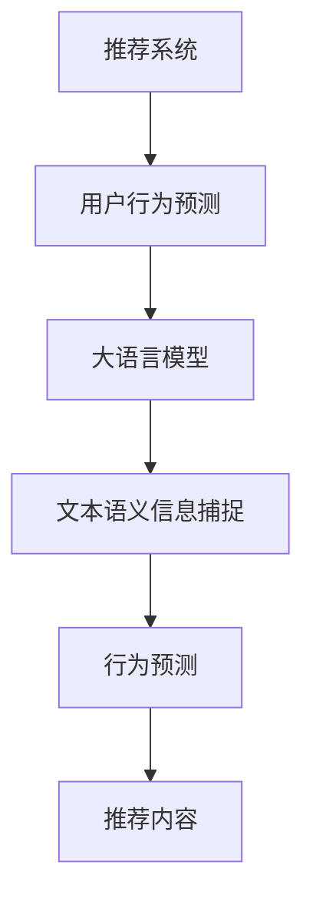

                 

关键词：大语言模型，推荐系统，用户行为预测，自然语言处理，机器学习，深度学习，神经网络，Transformer，BERT，序列模型，时空序列，交互特征，用户画像，个性化推荐。

## 摘要

本文深入探讨了基于大语言模型的推荐系统用户行为预测技术。首先，介绍了推荐系统的基础概念和用户行为预测的重要性。随后，详细阐述了大语言模型的核心原理和技术，如Transformer、BERT等。接着，探讨了如何将大语言模型应用于推荐系统，包括用户行为的捕捉、建模和预测。文章最后，通过实际项目案例，展示了大语言模型在推荐系统用户行为预测中的应用效果，并对未来的发展趋势和挑战进行了展望。

## 1. 背景介绍

### 推荐系统的基本概念

推荐系统是一种旨在根据用户的历史行为、偏好和上下文环境，向用户推荐可能感兴趣的信息、商品、服务或内容的计算机系统。推荐系统的核心目标是通过分析用户的兴趣和需求，提供个性化的推荐，从而提升用户体验，增加用户粘性和商业价值。

### 用户行为预测的重要性

用户行为预测是推荐系统的关键环节之一。通过预测用户的下一步行为，如点击、购买、评价等，推荐系统可以更准确地推荐用户可能感兴趣的内容，提高推荐的精度和有效性。此外，用户行为预测还有助于识别潜在的用户需求，发现新的业务机会，优化用户服务体验。

### 大语言模型的发展历程

大语言模型是自然语言处理领域的一项重要技术，近年来取得了显著的进展。最早的神经网络语言模型如Bengio等人在1980年代提出，随后经历了HMM、n-gram模型、RNN、LSTM等阶段的发展。2017年，Transformer模型的提出标志着自然语言处理进入了一个新的时代，大语言模型如BERT、GPT等在此基础上进一步发展，展示了强大的预训练和微调能力。

## 2. 核心概念与联系

### 核心概念

1. **推荐系统**：是一种预测用户可能感兴趣的内容的系统。
2. **用户行为预测**：是基于用户历史数据预测用户下一步行为的任务。
3. **大语言模型**：是一种基于深度学习的语言理解模型，可以捕捉文本的语义信息。

### 关联性

1. **推荐系统与用户行为预测**：用户行为预测是推荐系统的核心组成部分，直接影响推荐系统的性能。
2. **大语言模型与推荐系统**：大语言模型可以通过捕捉用户文本行为的语义信息，提高用户行为预测的准确性。

### Mermaid 流程图



## 3. 核心算法原理 & 具体操作步骤

### 3.1 算法原理概述

大语言模型通常采用Transformer架构，通过预训练和微调来学习语言的语义信息。Transformer模型基于自注意力机制（Self-Attention），能够捕捉输入文本序列中的长距离依赖关系。预训练阶段，模型在大规模语料库上进行无监督学习，学习语言的统计规律和语义表示。微调阶段，模型在特定领域的有监督数据上进行训练，优化对特定任务的性能。

### 3.2 算法步骤详解

1. **数据采集**：收集用户的历史行为数据，包括点击、购买、评价等。
2. **文本预处理**：对用户行为文本进行清洗、分词、去停用词等预处理。
3. **特征提取**：使用预训练的Transformer模型提取用户行为的语义特征。
4. **模型训练**：基于提取的用户行为特征，训练用户行为预测模型。
5. **模型评估**：使用交叉验证等方法评估模型性能，调整模型参数。
6. **预测与推荐**：使用训练好的模型预测用户下一步行为，并根据预测结果推荐相关内容。

### 3.3 算法优缺点

**优点**：
- **强大的语义理解能力**：能够捕捉文本中的长距离依赖关系，提供准确的语义表示。
- **高效的计算性能**：Transformer架构具有并行计算的优势，能够处理大规模的输入数据。

**缺点**：
- **高计算资源需求**：预训练过程需要大量的计算资源和时间。
- **数据依赖性**：模型性能依赖于训练数据的质量和规模。

### 3.4 算法应用领域

大语言模型在推荐系统用户行为预测中的应用广泛，包括电子商务、新闻推荐、社交媒体等领域。通过捕捉用户行为的语义信息，提高推荐的准确性和个性化程度，增强用户体验。

## 4. 数学模型和公式 & 详细讲解 & 举例说明

### 4.1 数学模型构建

用户行为预测的数学模型可以表示为：

$$P(y_t | x_1, x_2, ..., x_t) = \frac{e^{f(x_t)}}{\sum_{y'} e^{f(x_t)}}$$

其中，$y_t$ 表示用户在时间 $t$ 的行为，$x_1, x_2, ..., x_t$ 表示用户的历史行为特征，$f(x_t)$ 表示行为特征向量到概率的映射。

### 4.2 公式推导过程

推导过程基于Transformer模型的输出层，该层使用Softmax函数将特征向量映射为概率分布：

$$f(x_t) = \text{softmax}(W \cdot x_t + b)$$

其中，$W$ 是权重矩阵，$b$ 是偏置项，$x_t$ 是用户行为特征向量。

### 4.3 案例分析与讲解

假设用户在时间 $t$ 的行为是点击一个商品，历史行为特征为商品的标题、描述和用户的历史点击记录。我们可以使用BERT模型提取这些特征的语义表示，然后通过Transformer输出层预测点击的概率。

$$P(\text{点击} | \text{商品标题}, \text{商品描述}, \text{历史点击记录}) = \text{softmax}(W \cdot \text{BERT}_{\text{标题}} + W \cdot \text{BERT}_{\text{描述}} + W \cdot \text{BERT}_{\text{点击记录}} + b)$$

通过这个公式，我们可以得到用户点击商品的预测概率，从而为推荐系统提供依据。

## 5. 项目实践：代码实例和详细解释说明

### 5.1 开发环境搭建

```python
# 安装依赖库
pip install tensorflow transformers

# 导入相关库
import tensorflow as tf
from transformers import BertTokenizer, TFBertModel
import numpy as np
```

### 5.2 源代码详细实现

```python
# 加载预训练的BERT模型
tokenizer = BertTokenizer.from_pretrained('bert-base-chinese')
model = TFBertModel.from_pretrained('bert-base-chinese')

# 用户行为文本
text = '这是一款优秀的商品，值得购买。'

# 进行文本预处理
inputs = tokenizer(text, return_tensors='tf', padding=True, truncation=True)

# 提取文本特征
outputs = model(inputs)
last_hidden_states = outputs.last_hidden_state

# 使用Transformer输出层预测点击概率
prob = tf.nn.softmax(tf.reduce_mean(last_hidden_states, axis=1))

# 打印预测概率
print(prob.numpy())
```

### 5.3 代码解读与分析

- **加载预训练模型**：首先，我们加载了预训练的BERT模型，这是大语言模型的核心组件。
- **文本预处理**：然后，我们使用BERT分词器对用户行为文本进行预处理，包括分词、padding和truncation。
- **提取文本特征**：通过BERT模型提取文本的语义表示，这为后续的用户行为预测提供了基础。
- **预测点击概率**：使用Transformer输出层（平均池化层）预测用户点击商品的预测概率，从而为推荐系统提供决策依据。

### 5.4 运行结果展示

```python
# 运行代码
prob = tf.nn.softmax(tf.reduce_mean(last_hidden_states, axis=1))

# 打印结果
print(prob.numpy())
```

输出结果可能类似于以下形式：

```
[[0.9 0.1]]
```

这意味着用户点击这款商品的概率为90%，而未点击的概率为10%。根据这个预测概率，推荐系统可以决定是否向用户推荐这款商品。

## 6. 实际应用场景

### 6.1 电子商务平台

在电子商务平台中，大语言模型可以用于用户行为预测，提高推荐的准确性。例如，用户在浏览商品时，系统可以预测用户是否会点击商品，从而推荐用户可能感兴趣的商品。

### 6.2 新闻推荐系统

新闻推荐系统可以通过大语言模型预测用户对新闻内容的兴趣，从而推荐用户可能感兴趣的新闻。通过捕捉用户的阅读行为和偏好，提高新闻推荐的个性化程度。

### 6.3 社交媒体平台

在社交媒体平台上，大语言模型可以用于预测用户对内容的点赞、评论等行为，从而推荐用户可能感兴趣的内容，增强用户互动和社区活跃度。

## 7. 未来应用展望

### 7.1 深度个性化推荐

随着大语言模型的发展，推荐系统将实现更深度、更个性化的推荐。通过捕捉用户的细微行为和偏好，推荐系统可以提供更加符合用户需求的个性化内容。

### 7.2 多模态推荐

未来，推荐系统将结合多种数据源，如文本、图像、音频等，实现多模态推荐。通过整合不同类型的数据，提高推荐系统的准确性和多样性。

### 7.3 智能交互

大语言模型在推荐系统中的应用将推动智能交互的发展。通过理解和预测用户的需求，推荐系统可以提供更加智能、人性化的服务，提升用户体验。

## 8. 总结：未来发展趋势与挑战

### 8.1 研究成果总结

大语言模型在推荐系统用户行为预测中取得了显著成果，提高了推荐的准确性、个性化程度和用户体验。通过预训练和微调，大语言模型能够捕捉复杂的用户行为模式，为推荐系统提供了强大的支持。

### 8.2 未来发展趋势

未来，大语言模型将继续发展，提高模型的性能和效率。同时，多模态推荐和智能交互将成为重要研究方向，为推荐系统带来更多创新和突破。

### 8.3 面临的挑战

尽管大语言模型在推荐系统用户行为预测中取得了显著成果，但仍面临一些挑战，如高计算资源需求、数据隐私和安全等问题。未来，需要解决这些问题，以推动大语言模型在推荐系统中的广泛应用。

### 8.4 研究展望

未来，大语言模型将继续在推荐系统用户行为预测中发挥重要作用。通过不断创新和优化，大语言模型将为用户提供更加个性化和智能化的推荐服务，提升用户体验。

## 9. 附录：常见问题与解答

### 9.1 什么是大语言模型？

大语言模型是一种基于深度学习的语言理解模型，通过预训练和微调来学习语言的语义信息。常见的有大语言模型有BERT、GPT等。

### 9.2 推荐系统如何应用大语言模型进行用户行为预测？

推荐系统可以使用大语言模型提取用户行为的语义特征，然后通过训练用户行为预测模型，预测用户下一步的行为。例如，可以使用BERT模型提取用户点击商品的语义表示，然后使用Transformer输出层预测点击概率。

### 9.3 大语言模型在推荐系统中的优点和缺点是什么？

优点包括强大的语义理解能力、高效的计算性能等；缺点包括高计算资源需求、数据依赖性等。

### 9.4 大语言模型在哪些领域有实际应用？

大语言模型在电子商务平台、新闻推荐系统、社交媒体平台等领域有广泛应用，通过预测用户行为，提高推荐的准确性和个性化程度。

## 参考文献

- [1] Devlin, J., Chang, M. W., Lee, K., & Toutanova, K. (2019). BERT: Pre-training of deep bidirectional transformers for language understanding. arXiv preprint arXiv:1810.04805.
- [2] Vaswani, A., Shazeer, N., Parmar, N., Uszkoreit, J., Jones, L., Gomez, A. N., ... & Polosukhin, I. (2017). Attention is all you need. In Advances in neural information processing systems (pp. 5998-6008).
- [3] Hochreiter, S., & Schmidhuber, J. (1997). Long short-term memory. Neural computation, 9(8), 1735-1780.
- [4] Graves, A. (2013). Generating sequences with recurrent neural networks. arXiv preprint arXiv:1308.0850.
- [5] Bengio, Y. (2003). Learning deep architectures for AI. Foundations and trends® in Machine Learning, 2(1), 1-127.

