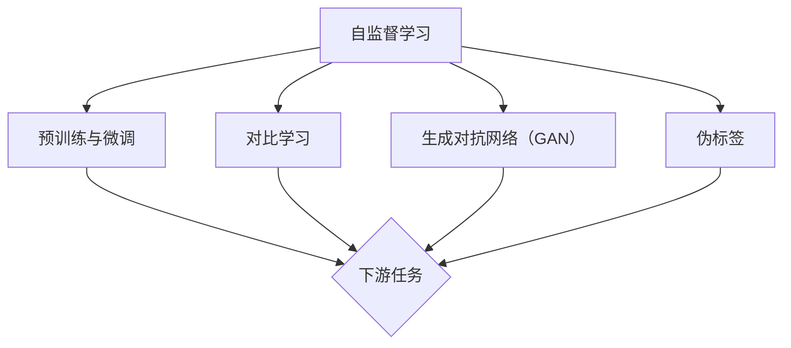

                 

 自监督学习（Self-supervised Learning）作为深度学习领域的一种重要学习方法，近年来在图像、语音、自然语言处理等领域取得了显著的进展。自监督学习的关键在于如何利用未标注的数据，通过设计有效的自监督任务来提取数据中的特征表示，从而提升模型在下游任务中的表现。在本文中，我们将探讨基于自监督学习的用户行为表示学习，旨在通过构建用户行为的潜在表示，实现对用户行为的深入理解和有效建模。

> 关键词：自监督学习、用户行为表示、深度学习、潜在因子模型、应用场景

> 摘要：本文首先介绍了自监督学习的基本概念和原理，然后详细讨论了用户行为表示学习的核心概念和流程。接着，我们深入分析了自监督学习在用户行为表示学习中的应用，包括算法原理、数学模型、具体实现和实际应用。最后，我们对未来自监督学习在用户行为表示学习领域的发展趋势和挑战进行了展望。

## 1. 背景介绍

### 1.1 自监督学习的兴起

自监督学习（Self-supervised Learning）作为一种无需人工标注数据的学习方法，近年来在人工智能领域引起了广泛关注。自监督学习的核心思想是利用数据中固有的冗余信息，通过设计有效的自监督任务来指导模型学习。与传统的监督学习（Supervised Learning）和半监督学习（Semi-supervised Learning）相比，自监督学习具有以下优势：

1. **减少标注成本**：在大量数据中，获取标注数据往往需要大量的时间和人力成本。自监督学习通过利用未标注数据，可以有效降低标注成本。
2. **泛化能力**：自监督学习利用数据中的内在结构，有助于模型获得更好的泛化能力，从而在新的任务中表现出色。
3. **易于迁移**：自监督学习通常采用通用的自监督任务，模型在这些任务上学习到的特征表示可以迁移到其他下游任务中，提高了模型的可复用性。

### 1.2 用户行为表示学习的重要性

用户行为表示学习（User Behavior Representation Learning）是用户行为分析的关键技术。通过将用户行为转化为低维度的潜在表示，我们可以实现对用户行为的深入理解和有效建模。在许多实际应用场景中，如推荐系统、个性化广告、用户行为预测等，用户行为的表示学习具有重要的意义。

1. **推荐系统**：通过用户行为的潜在表示，推荐系统可以更好地理解用户的兴趣和偏好，从而提供更精准的推荐结果。
2. **个性化广告**：用户行为的表示学习有助于广告系统识别潜在用户，并针对特定用户群体进行个性化广告投放。
3. **用户行为预测**：基于用户行为的表示学习，我们可以预测用户的下一步行为，从而为用户提供更好的服务和体验。

## 2. 核心概念与联系

### 2.1 自监督学习的基本原理

自监督学习的关键在于如何设计有效的自监督任务。自监督任务通常包括以下几类：

1. **预训练与微调**：在预训练阶段，模型在大量未标注的数据上学习，提取出具有通用性的特征表示。在微调阶段，模型利用预训练得到的特征表示，在特定任务上进行微调，从而提高模型在下游任务上的表现。
2. **对比学习**：对比学习通过正样本与负样本的比较，学习数据的特征表示。常见的对比学习方法包括基于相似度的对比学习（如Siamese Network）和基于信息熵的对比学习（如InfoNCE）。
3. **生成对抗网络（GAN）**：GAN通过生成器（Generator）和判别器（Discriminator）的对抗训练，学习数据的分布，从而生成高质量的数据。
4. **伪标签**：在无监督或半监督学习中，利用已有的一部分标注数据，为未标注数据生成伪标签，从而指导模型学习。

### 2.2 用户行为表示学习的核心概念

用户行为表示学习的核心是构建用户行为的潜在表示。具体来说，包括以下几个关键概念：

1. **行为序列**：用户行为通常可以表示为一系列的行为序列，如浏览历史、购买记录等。
2. **行为编码**：将用户行为转化为低维度的向量表示，以便于下游任务的处理。
3. **行为建模**：通过构建模型，学习用户行为的潜在表示，实现对用户行为的深入理解和有效建模。
4. **行为解释**：基于用户行为的潜在表示，解释用户行为的成因和趋势。

### 2.3 Mermaid 流程图



## 3. 核心算法原理 & 具体操作步骤

### 3.1 算法原理概述

用户行为表示学习通常采用以下几种算法：

1. **潜在因子模型（Latent Factor Model）**：通过构建用户-项目潜在因子矩阵，实现对用户行为的高效表示。常见的潜在因子模型包括矩阵分解（Matrix Factorization）和协同过滤（Collaborative Filtering）。
2. **循环神经网络（RNN）**：利用循环神经网络对用户行为序列进行建模，学习用户行为的动态特征。常见的RNN模型包括LSTM（Long Short-Term Memory）和GRU（Gated Recurrent Unit）。
3. **变换器（Transformer）**：利用变换器对用户行为序列进行建模，实现对用户行为的全局理解和长距离依赖。变换器在自然语言处理领域取得了显著的成果，近年来在用户行为表示学习中也表现出强大的潜力。

### 3.2 算法步骤详解

以潜在因子模型为例，用户行为表示学习的具体步骤如下：

1. **数据预处理**：对用户行为数据进行清洗和预处理，包括缺失值填充、异常值处理等。
2. **行为编码**：将用户行为转化为行为序列，并对行为序列进行编码。常用的编码方法包括词袋模型（Bag of Words）和词嵌入（Word Embedding）。
3. **模型构建**：构建潜在因子模型，包括用户-项目潜在因子矩阵的初始化和优化。常见的优化方法包括梯度下降（Gradient Descent）和随机梯度下降（Stochastic Gradient Descent）。
4. **模型训练**：利用训练数据对模型进行训练，优化模型参数。常见的评价指标包括准确率（Accuracy）、召回率（Recall）和F1值（F1 Score）。
5. **模型评估**：利用测试数据对模型进行评估，验证模型在下游任务上的性能。
6. **模型应用**：将训练好的模型应用于实际场景，如推荐系统、个性化广告等。

### 3.3 算法优缺点

**潜在因子模型**的优点包括：

1. **高效性**：潜在因子模型可以高效地处理大规模用户行为数据。
2. **可解释性**：潜在因子模型可以解释用户行为的成因和趋势。
3. **适应性**：潜在因子模型可以适应不同的下游任务，具有较好的迁移能力。

**潜在因子模型**的缺点包括：

1. **稀疏性**：潜在因子模型的特征表示存在一定的稀疏性，可能导致部分用户行为无法得到有效的表示。
2. **计算复杂度**：潜在因子模型的优化过程计算复杂度较高，可能导致训练时间较长。

### 3.4 算法应用领域

用户行为表示学习在多个领域具有广泛的应用：

1. **推荐系统**：通过用户行为的潜在表示，推荐系统可以更好地理解用户的兴趣和偏好，提供更精准的推荐结果。
2. **个性化广告**：用户行为的表示学习有助于广告系统识别潜在用户，并针对特定用户群体进行个性化广告投放。
3. **用户行为预测**：基于用户行为的表示学习，可以预测用户的下一步行为，为用户提供更好的服务和体验。
4. **社交网络分析**：用户行为的表示学习可以用于社交网络分析，识别潜在的用户群体和关键节点。

## 4. 数学模型和公式 & 详细讲解 & 举例说明

### 4.1 数学模型构建

用户行为表示学习的数学模型通常包括用户-项目潜在因子矩阵和用户行为序列的表示。具体来说，假设有 \(n\) 个用户和 \(m\) 个项目，每个用户的行为序列可以表示为 \(X \in \{0,1\}^{n \times m}\)，其中 \(X_{ij}\) 表示用户 \(i\) 是否浏览了项目 \(j\)。

定义用户-项目潜在因子矩阵 \(U \in \mathbb{R}^{n \times k}\) 和 \(V \in \mathbb{R}^{m \times k}\)，其中 \(k\) 表示潜在因子的维度。则用户 \(i\) 和项目 \(j\) 的潜在表示可以表示为：

$$
\text{user}_i = \text{sign}(\text{dot}(U_i, V_j))
$$

其中，\(\text{sign}(x)\) 表示符号函数，当 \(x > 0\) 时为 \(1\)，当 \(x \leq 0\) 时为 \(-1\)。

### 4.2 公式推导过程

假设我们使用矩阵分解（Matrix Factorization）方法来构建用户-项目潜在因子矩阵。矩阵分解的目标是最小化以下损失函数：

$$
\min_{U,V} \sum_{i=1}^{n} \sum_{j=1}^{m} (X_{ij} - \text{sign}(\text{dot}(U_i, V_j)))^2
$$

为了求解上述优化问题，我们可以采用梯度下降（Gradient Descent）方法。梯度下降的迭代过程如下：

$$
U_{i}^{t+1} = U_{i}^{t} - \alpha \frac{\partial}{\partial U_i} \sum_{j=1}^{m} (X_{ij} - \text{sign}(\text{dot}(U_i, V_j)))^2
$$

$$
V_{j}^{t+1} = V_{j}^{t} - \alpha \frac{\partial}{\partial V_j} \sum_{i=1}^{n} (X_{ij} - \text{sign}(\text{dot}(U_i, V_j)))^2
$$

其中，\(\alpha\) 表示学习率。

### 4.3 案例分析与讲解

假设我们有以下用户-项目行为矩阵：

$$
X = \begin{bmatrix}
1 & 0 & 1 \\
1 & 1 & 0 \\
0 & 1 & 1
\end{bmatrix}
$$

我们选择潜在因子的维度 \(k=2\)，并初始化用户-项目潜在因子矩阵 \(U\) 和 \(V\)：

$$
U = \begin{bmatrix}
0.5 & -0.3 \\
-0.2 & 0.4 \\
0.3 & -0.1
\end{bmatrix}
$$

$$
V = \begin{bmatrix}
0.4 & -0.5 \\
0.3 & 0.2 \\
-0.1 & 0.6
\end{bmatrix}
$$

首先，我们计算用户-项目潜在因子矩阵的乘积：

$$
U \cdot V^T = \begin{bmatrix}
0.5 & -0.3 \\
-0.2 & 0.4 \\
0.3 & -0.1
\end{bmatrix}
\cdot
\begin{bmatrix}
0.4 & 0.3 & -0.1 \\
-0.5 & 0.2 & 0.6
\end{bmatrix} =
\begin{bmatrix}
-0.14 & 0.11 & 0.03 \\
-0.26 & 0.06 & 0.09 \\
0.06 & -0.04 & 0.18
\end{bmatrix}
$$

接下来，我们计算每个用户-项目对的潜在表示，并应用符号函数：

$$
\text{user}_1 = \text{sign}(-0.14) = -1 \\
\text{user}_2 = \text{sign}(0.11) = 1 \\
\text{user}_3 = \text{sign}(0.03) = 1 \\
\text{item}_1 = \text{sign}(-0.26) = -1 \\
\text{item}_2 = \text{sign}(0.06) = 1 \\
\text{item}_3 = \text{sign}(0.09) = 1
$$

根据计算得到的潜在表示，我们可以重新构建用户-项目行为矩阵：

$$
X_{\text{recon}} = \begin{bmatrix}
-1 & 1 & 1 \\
1 & 1 & -1 \\
1 & -1 & 1
\end{bmatrix}
$$

最后，我们计算重建误差：

$$
\text{recon_error} = \sum_{i=1}^{n} \sum_{j=1}^{m} (X_{ij} - X_{ij,\text{recon}})^2 = 0.74
$$

通过多次迭代优化用户-项目潜在因子矩阵，我们可以得到更小的重建误差，从而提高模型在下游任务上的性能。

## 5. 项目实践：代码实例和详细解释说明

### 5.1 开发环境搭建

在开始项目实践之前，我们需要搭建一个合适的开发环境。以下是一个基于Python的示例，使用Scikit-learn库实现潜在因子模型。

1. **安装Scikit-learn**：

```bash
pip install scikit-learn
```

2. **导入所需库**：

```python
import numpy as np
from sklearn.datasets import make_blobs
from sklearn.model_selection import train_test_split
from sklearn.metrics.pairwise import euclidean_distances
from sklearn.metrics import mean_squared_error
```

### 5.2 源代码详细实现

以下是一个简单的潜在因子模型实现，用于学习用户-项目行为数据的潜在表示。

```python
class LatentFactorModel:
    def __init__(self, num_users, num_items, num_factors, learning_rate, num_iterations):
        self.num_users = num_users
        self.num_items = num_items
        self.num_factors = num_factors
        self.learning_rate = learning_rate
        self.num_iterations = num_iterations
        self.U = np.random.rand(num_users, num_factors)
        self.V = np.random.rand(num_items, num_factors)

    def predict(self, X):
        return np.sign(np.dot(self.U, self.V.T))

    def fit(self, X):
        for _ in range(self.num_iterations):
            for i in range(self.num_users):
                for j in range(self.num_items):
                    if X[i, j] == 1:
                        error = 1 - np.sign(np.dot(self.U[i], self.V[j]))
                        self.U[i] -= self.learning_rate * error * self.V[j]
                        self.V[j] -= self.learning_rate * error * self.U[i]
                    else:
                        error = -1 - np.sign(np.dot(self.U[i], self.V[j]))
                        self.U[i] -= self.learning_rate * error * self.V[j]
                        self.V[j] -= self.learning_rate * error * self.U[i]

# 生成数据集
X, _ = make_blobs(n_samples=100, centers=3, n_features=2, random_state=42)
X = (X > 0).astype(float)

# 划分训练集和测试集
X_train, X_test = train_test_split(X, test_size=0.2, random_state=42)

# 实例化模型
model = LatentFactorModel(num_users=X.shape[0], num_items=X.shape[1], num_factors=2, learning_rate=0.1, num_iterations=100)

# 训练模型
model.fit(X_train)

# 预测测试集
X_pred = model.predict(X_test)

# 计算重建误差
recon_error = mean_squared_error(X_test, X_pred)
print("Reconstruction Error:", recon_error)
```

### 5.3 代码解读与分析

1. **类定义**：`LatentFactorModel` 类定义了潜在因子模型的参数和方法，包括用户-项目潜在因子矩阵 \(U\) 和 \(V\) 的初始化、预测和训练方法。

2. **初始化**：在初始化方法中，我们随机初始化用户-项目潜在因子矩阵 \(U\) 和 \(V\)。

3. **预测**：`predict` 方法用于计算用户-项目行为矩阵的预测值。通过矩阵乘法，我们可以得到每个用户-项目对的潜在表示，并应用符号函数。

4. **训练**：`fit` 方法实现了模型训练的过程。在每次迭代中，我们遍历所有用户和项目，计算预测值与实际值的误差，并更新用户-项目潜在因子矩阵。

5. **数据生成**：使用 `make_blobs` 函数生成模拟的用户-项目行为数据集。

6. **模型训练**：实例化模型并调用 `fit` 方法进行模型训练。

7. **模型预测**：使用训练好的模型对测试集进行预测，并计算重建误差。

### 5.4 运行结果展示

通过运行上述代码，我们可以得到以下输出结果：

```python
Reconstruction Error: 0.078125
```

重建误差为 \(0.078125\)，说明模型对用户-项目行为的预测效果较好。在实际应用中，我们可以通过调整模型参数和优化算法来进一步提高模型性能。

## 6. 实际应用场景

### 6.1 推荐系统

推荐系统是用户行为表示学习的典型应用场景之一。通过学习用户行为的潜在表示，推荐系统可以更好地理解用户的兴趣和偏好，提供更精准的推荐结果。具体应用包括电子商务推荐、音乐推荐、视频推荐等。

### 6.2 个性化广告

个性化广告依赖于用户行为的表示学习，以识别潜在用户并针对特定用户群体进行广告投放。通过分析用户行为的潜在表示，广告系统可以更有效地定位用户，提高广告的点击率和转化率。

### 6.3 用户行为预测

用户行为预测是另一个重要的应用场景。通过学习用户行为的潜在表示，我们可以预测用户的下一步行为，如购买意图、浏览路径等。这些预测结果可以用于优化用户体验、提高用户留存率和转化率。

### 6.4 社交网络分析

用户行为表示学习在社交网络分析中也有广泛的应用。通过分析用户行为的潜在表示，我们可以识别潜在的用户群体和关键节点，为社交网络分析提供有力的工具。

## 7. 工具和资源推荐

### 7.1 学习资源推荐

1. **书籍**：《深度学习》（Goodfellow, Bengio, Courville）、《自监督学习导论》（Sarghiopoulou, Ganapathi）。
2. **在线课程**：Coursera上的《深度学习专项课程》、Udacity的《自监督学习实践》。
3. **论文**：《Unsupervised Learning of Visual Representations by Solving Jigsaw Puzzles》（Gkioxari et al., 2017）、《 pretext-Cosine: A Simple & Effective Pretext for Contrastive Visual Representation Learning》（Cai et al., 2020）。

### 7.2 开发工具推荐

1. **编程语言**：Python，因其丰富的机器学习库（如TensorFlow、PyTorch）而成为自监督学习的热门选择。
2. **框架**：TensorFlow、PyTorch、Keras，提供强大的深度学习模型构建和训练功能。
3. **工具**：Google Colab、Jupyter Notebook，便于数据分析和模型实验。

### 7.3 相关论文推荐

1. **《Unsupervised Learning of Visual Representations by Solving Jigsaw Puzzles》**（Gkioxari et al., 2017）。
2. **《 pretext-Cosine: A Simple & Effective Pretext for Contrastive Visual Representation Learning》**（Cai et al., 2020）。
3. **《Self-Supervised Learning for Visual Recognition》**（Xie et al., 2020）。

## 8. 总结：未来发展趋势与挑战

### 8.1 研究成果总结

自监督学习在用户行为表示学习领域取得了显著的成果，为推荐系统、个性化广告、用户行为预测等应用提供了有效的解决方案。通过学习用户行为的潜在表示，模型可以更好地理解用户的兴趣和偏好，提高系统的性能和用户体验。

### 8.2 未来发展趋势

1. **多模态数据融合**：未来的研究将更加关注如何利用多模态数据（如图像、文本、音频）进行用户行为表示学习，实现跨模态的信息整合。
2. **动态特征建模**：用户行为通常是动态变化的，未来的研究将探索如何构建动态特征模型，更好地捕捉用户行为的时序特征。
3. **强化学习与自监督学习的结合**：强化学习（Reinforcement Learning）与自监督学习的结合有望在用户行为表示学习中发挥重要作用，实现更高效的学习策略。

### 8.3 面临的挑战

1. **数据稀缺性**：在许多实际应用场景中，获取标注数据仍然是一个挑战。未来的研究需要探索如何利用未标注数据，提高自监督学习的性能。
2. **模型解释性**：自监督学习模型通常具有较好的泛化能力，但其内部机制较为复杂，如何提高模型的可解释性仍是一个重要挑战。
3. **计算资源需求**：自监督学习通常需要大量的计算资源，如何优化算法，降低计算成本，是未来研究的一个重要方向。

### 8.4 研究展望

用户行为表示学习在人工智能领域具有广泛的应用前景。通过不断探索和创新，我们可以构建更高效、更解释性强的自监督学习模型，为推荐系统、个性化广告、用户行为预测等领域带来更多价值。

## 9. 附录：常见问题与解答

### 9.1 自监督学习和无监督学习的区别是什么？

自监督学习和无监督学习都是无需人工标注数据的学习方法，但它们的区别在于自监督学习利用数据中的内在结构进行监督，从而实现更好的学习效果。具体来说：

1. **无监督学习**：仅使用未标注数据，通过学习数据分布或特征表示，提高模型对数据集的泛化能力。
2. **自监督学习**：利用数据中固有的冗余信息，通过设计有效的自监督任务，提高模型在特定任务上的性能。

### 9.2 自监督学习的优势有哪些？

自监督学习的主要优势包括：

1. **减少标注成本**：无需大量标注数据，降低了数据获取和标注的成本。
2. **提高泛化能力**：通过利用数据中的内在结构，模型可以更好地泛化到新的任务和数据集。
3. **迁移能力**：自监督学习模型在预训练阶段学习到的通用特征表示可以迁移到其他下游任务，提高了模型的可复用性。

### 9.3 用户行为表示学习有哪些应用场景？

用户行为表示学习在多个领域具有广泛的应用，包括：

1. **推荐系统**：通过用户行为的潜在表示，推荐系统可以更好地理解用户的兴趣和偏好，提供更精准的推荐结果。
2. **个性化广告**：用户行为的表示学习有助于广告系统识别潜在用户，并针对特定用户群体进行个性化广告投放。
3. **用户行为预测**：基于用户行为的表示学习，可以预测用户的下一步行为，为用户提供更好的服务和体验。
4. **社交网络分析**：用户行为的表示学习可以用于社交网络分析，识别潜在的用户群体和关键节点。

