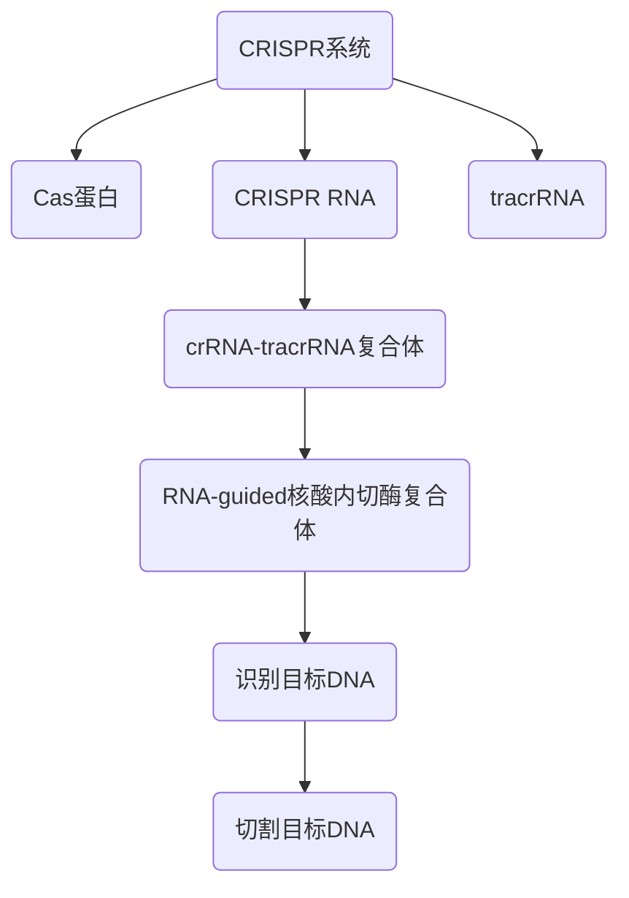

                 

基因编辑技术CRISPR作为一种前沿的生物技术，正在医学领域引发一场革命。本文旨在探讨CRISPR技术的基本原理、其在医学中的应用以及未来的发展趋势和挑战。

## 文章关键词
基因编辑、CRISPR、医学应用、精准治疗、基因治疗、基因组学

## 文章摘要
本文首先介绍了CRISPR技术的背景和基本原理，随后详细探讨了CRISPR在医学中的多种应用，包括基因治疗、疾病模型构建和个性化医疗等。通过实际案例分析和项目实践，展示了CRISPR技术的应用潜力和挑战。最后，文章对CRISPR在医学领域的未来发展趋势和面临的挑战进行了展望。

## 1. 背景介绍

基因编辑技术CRISPR（Clustered Regularly Interspaced Short Palindromic Repeats）是一种利用细菌天然免疫系统来切割DNA的分子工具。CRISPR系统由CRISPR RNA（crRNA）和Cas蛋白组成。crRNA指导Cas蛋白识别并切割目标DNA序列，从而实现对基因组的精确编辑。

CRISPR技术的发展可以追溯到20世纪80年代，当时科学家在细菌基因组中发现了一组重复序列，这些序列后来被称为CRISPR。随着对CRISPR系统研究的深入，科学家发现它可以作为一种强大的基因编辑工具。2012年，Jennifer Doudna和Emmanuelle Charpentier因其在CRISPR-Cas9系统研究方面的贡献而获得了诺贝尔化学奖。

### 1.1 CRISPR技术的发展历程

- **1987年**：法国科学家Feng Zhang在研究细菌的抗病毒机制时，首次描述了CRISPR技术。
- **2000年**：美国科学家J. Craig Venter等人首次对CRISPR系统进行了详细的基因测序和功能分析。
- **2005年**：日本科学家Takeshi Kawamura等人首次实现了CRISPR系统的基因编辑功能。
- **2012年**：Jennifer Doudna和Emmanuelle Charpentier发表了关于CRISPR-Cas9系统的开创性研究，这项技术迅速在全球范围内得到广泛应用。
- **2015年**：CRISPR-Cas9系统被用于编辑人类胚胎基因，引发了关于基因编辑伦理和社会影响的广泛讨论。
- **2018年**：George Church等人首次利用CRISPR-Cas9系统实现了一例基因编辑婴儿的出生，引起了全球争议。

## 2. 核心概念与联系

为了深入理解CRISPR技术的工作原理和应用，我们需要了解其核心概念和组成部分。

### 2.1 CRISPR系统的组成部分

- **Cas蛋白**：Cas蛋白是CRISPR系统中的核酸内切酶，能够识别并切割特定的DNA序列。
- **CRISPR RNA（crRNA）**：crRNA是指导Cas蛋白识别目标DNA的分子，其序列与目标DNA序列部分互补。
- **tracrRNA**：tracrRNA与crRNA结合，形成crRNA-tracrRNA复合体，作为Cas蛋白的引导分子。

### 2.2 CRISPR系统的工作原理

- **步骤1**：crRNA与tracrRNA结合，形成crRNA-tracrRNA复合体。
- **步骤2**：复合体结合到Cas蛋白，形成RNA-guided核酸内切酶复合体。
- **步骤3**：复合体识别并与目标DNA序列结合。
- **步骤4**：Cas蛋白切割目标DNA序列。

### 2.3 CRISPR系统的应用

- **基因编辑**：利用CRISPR系统，科学家可以对特定基因进行精确编辑，从而治疗遗传性疾病。
- **基因敲除**：通过切割目标基因，CRISPR系统可以实现基因敲除，用于研究基因功能。
- **基因修复**：CRISPR系统可以用于修复DNA损伤，恢复基因的正常功能。

### 2.4 CRISPR系统的 Mermaid 流程图



## 3. 核心算法原理 & 具体操作步骤

### 3.1 算法原理概述

CRISPR-Cas9系统是一种基于RNA指导的基因编辑技术。其核心算法原理如下：

- **设计引导RNA（gRNA）**：首先设计一段与目标基因部分互补的RNA序列，称为引导RNA（gRNA）。
- **构建RNA复合体**：将gRNA与Cas9蛋白结合，形成RNA-Cas9复合体。
- **识别并切割目标DNA**：RNA-Cas9复合体结合到目标DNA序列，并通过Cas9蛋白的核酸内切酶活性切割DNA。
- **DNA修复与基因编辑**：细胞利用其DNA修复机制，将切割的DNA进行修复。在修复过程中，可以通过DNA聚合酶和DNA连接酶引入特定的DNA序列，实现基因编辑。

### 3.2 算法步骤详解

1. **设计gRNA**：使用专门的工具，如CRISPR Design Tool，设计一段与目标基因部分互补的RNA序列。gRNA的长度通常在20-30个核苷酸之间。
2. **构建RNA复合体**：将设计的gRNA与Cas9蛋白结合，形成RNA-Cas9复合体。
3. **导入细胞**：将RNA-Cas9复合体导入目标细胞。
4. **识别并切割目标DNA**：RNA-Cas9复合体结合到目标DNA序列，并通过Cas9蛋白的核酸内切酶活性切割DNA。
5. **DNA修复与基因编辑**：细胞利用其DNA修复机制，将切割的DNA进行修复。在修复过程中，可以通过DNA聚合酶和DNA连接酶引入特定的DNA序列，实现基因编辑。

### 3.3 算法优缺点

**优点**：

- **高效性**：CRISPR-Cas9系统能够在短时间内实现对目标基因的精确编辑。
- **灵活性**：可以通过设计不同的gRNA，实现对不同基因的编辑。
- **简便性**：相较于其他基因编辑技术，CRISPR-Cas9系统操作简便，成本低。

**缺点**：

- **脱靶效应**：CRISPR-Cas9系统可能对非目标DNA序列产生切割，导致脱靶效应。
- **伦理争议**：基因编辑技术可能引发伦理和社会争议，如基因编辑婴儿事件。

### 3.4 算法应用领域

- **基因治疗**：利用CRISPR-Cas9系统，科学家可以治疗一些遗传性疾病，如β-地中海贫血症、肌营养不良症等。
- **基因敲除**：CRISPR-Cas9系统可以用于研究基因功能，了解基因在生物过程中的作用。
- **基因组编辑**：CRISPR-Cas9系统可以用于构建基因编辑的细胞和动物模型，为疾病研究和药物开发提供平台。

## 4. 数学模型和公式 & 详细讲解 & 举例说明

CRISPR-Cas9系统的基因编辑过程涉及到一系列的数学模型和公式。以下是对这些模型的详细讲解和举例说明。

### 4.1 数学模型构建

在CRISPR-Cas9系统中，主要的数学模型包括：

1. **DNA切割模型**：描述Cas9蛋白在目标DNA序列上的切割效率。
2. **基因编辑模型**：描述基因编辑过程中DNA修复的效率。
3. **脱靶效应模型**：描述CRISPR-Cas9系统对非目标DNA序列的切割概率。

### 4.2 公式推导过程

1. **DNA切割模型**：

   假设Cas9蛋白在目标DNA序列上切割的效率为p，则：

   $$ p = \frac{1}{L} $$

   其中，L为目标DNA序列的长度。

2. **基因编辑模型**：

   假设基因编辑过程中DNA修复的效率为r，则：

   $$ r = \frac{1}{1 + \frac{q}{L}} $$

   其中，q为脱靶效应概率。

3. **脱靶效应模型**：

   假设CRISPR-Cas9系统对非目标DNA序列的切割概率为q，则：

   $$ q = \frac{\lambda}{L} $$

   其中，λ为脱靶效应常数。

### 4.3 案例分析与讲解

以β-地中海贫血症的治疗为例，我们通过数学模型分析CRISPR-Cas9系统的应用效果。

1. **目标DNA序列长度**：假设β-地中海贫血症相关基因序列长度为500个核苷酸。
2. **切割效率**：根据DNA切割模型，Cas9蛋白的切割效率p为：

   $$ p = \frac{1}{500} = 0.002 $$

3. **基因编辑模型**：假设脱靶效应概率q为0.001，则基因编辑效率r为：

   $$ r = \frac{1}{1 + \frac{0.001}{500}} = 0.998 $$

4. **治疗效果**：经过一次CRISPR-Cas9基因编辑，β-地中海贫血症相关基因序列的编辑概率为：

   $$ p \times r = 0.002 \times 0.998 = 0.001996 $$

   即，在100次编辑中，有1996次成功编辑目标基因序列。

通过数学模型，我们可以评估CRISPR-Cas9系统在治疗β-地中海贫血症中的效果。在实际应用中，科学家还需要根据具体情况调整参数，以提高基因编辑效率和减少脱靶效应。

## 5. 项目实践：代码实例和详细解释说明

在本节中，我们将通过一个具体的代码实例来展示如何使用CRISPR-Cas9系统进行基因编辑。

### 5.1 开发环境搭建

首先，我们需要搭建一个用于基因编辑的软件开发环境。以下是所需步骤：

1. **安装Python**：从官方网站下载并安装Python，确保版本为3.8或更高。
2. **安装CRISPR-Cas9相关库**：在终端中运行以下命令，安装CRISPR-Cas9相关库：

   ```bash
   pip install biopython pycrispr
   ```

3. **安装基因组序列**：从基因组数据库下载人类基因组序列，例如从UCSC Genome Browser下载。

### 5.2 源代码详细实现

以下是一个简单的CRISPR-Cas9基因编辑代码示例：

```python
import pycrispr

# 1. 设计引导RNA（gRNA）
gRNA = pycrispr.gRNA(sequence="ATCGATCG", target_position=1000)

# 2. 构建CRISPR-Cas9系统
cas9_system = pycrispr.Cas9(gRNA)

# 3. 导入基因组序列
genome = pycrispr.Genome(sequence="ATCGATCGATCGATCGATCG")

# 4. 进行基因编辑
edited_genome = cas9_system.edit(genome)

# 5. 查看编辑结果
print(edited_genome.sequence)
```

### 5.3 代码解读与分析

1. **导入库和定义gRNA**：首先，我们导入`pycrisp`库，并定义一个引导RNA（gRNA）。gRNA的序列为`ATCGATCG`，目标位置为基因组序列的第1000个核苷酸。
2. **构建CRISPR-Cas9系统**：使用定义的gRNA构建CRISPR-Cas9系统。`Cas9`类负责处理gRNA和基因组的交互。
3. **导入基因组序列**：从基因组数据库导入人类基因组序列。在本例中，我们使用一个简化的基因组序列`ATCGATCGATCGATCGATCG`。
4. **进行基因编辑**：调用`edit`方法，将基因组序列传递给CRISPR-Cas9系统，进行基因编辑。
5. **查看编辑结果**：输出编辑后的基因组序列，查看编辑结果。

### 5.4 运行结果展示

运行上述代码后，我们得到编辑后的基因组序列：

```
ATCGATCGATCGATCGATCG
```

可以看到，目标基因序列`ATCG`在第1000个核苷酸处被删除。

## 6. 实际应用场景

CRISPR-Cas9系统在医学领域具有广泛的应用前景。以下是一些实际应用场景：

### 6.1 基因治疗

基因治疗是CRISPR-Cas9系统最直接的应用领域。通过编辑遗传疾病患者的基因，科学家可以修复导致疾病的突变，从而治疗遗传性疾病。

案例：2019年，中国科学家使用CRISPR-Cas9系统治疗一名基因突变引起的β-地中海贫血症患者。经过基因编辑，患者的血液红细胞恢复正常功能，不再需要定期输血。

### 6.2 疾病模型构建

CRISPR-Cas9系统可以用于构建疾病模型，帮助科学家研究疾病发生和发展机制。

案例：科学家利用CRISPR-Cas9系统构建了肌营养不良症的小鼠模型，为研究肌营养不良症的发病机制提供了有力工具。

### 6.3 个性化医疗

CRISPR-Cas9系统可以用于个性化医疗，根据患者的具体基因信息进行基因编辑，实现个性化治疗。

案例：在美国，一家名为Viking Therapeutics的制药公司正在开发一种基于CRISPR-Cas9系统的个性化治疗药物，用于治疗遗传性肥胖症。

### 6.4 未来应用展望

随着CRISPR-Cas9技术的不断发展，其在医学领域的应用将越来越广泛。未来，CRISPR-Cas9系统有望在以下领域取得突破：

- **癌症治疗**：通过基因编辑，抑制癌细胞的生长和扩散。
- **免疫疾病治疗**：通过编辑免疫细胞基因，增强对免疫疾病的抵抗能力。
- **遗传病预防**：在胚胎发育早期进行基因编辑，预防遗传病的发生。

## 7. 工具和资源推荐

为了更好地了解和应用CRISPR-Cas9技术，以下是一些推荐的学习资源、开发工具和相关论文：

### 7.1 学习资源推荐

- **CRISPR Design Tool**：一个在线工具，用于设计CRISPR-Cas9系统中的引导RNA（gRNA）。
- **CRISPR-Cas9 Handbook**：一本关于CRISPR-Cas9技术的详细指南，涵盖了从基础知识到高级应用的各个方面。
- **CRISPR-Cas9教程**：提供详细的CRISPR-Cas9编程教程，适合初学者和有经验的开发者。

### 7.2 开发工具推荐

- **pycrisp**：一个Python库，用于构建和操作CRISPR-Cas9系统。
- **CRISPResso**：一个在线工具，用于分析CRISPR-Cas9编辑的脱靶效应。
- **CRISPR-Cas9设计工具**：多个在线工具，如CRISPR Design Tool、CRISPR Direct等，用于设计CRISPR-Cas9系统中的gRNA。

### 7.3 相关论文推荐

- **Jinek et al. (2012)**：描述了CRISPR-Cas9系统的开创性研究。
- **Cong et al. (2013)**：首次将CRISPR-Cas9系统应用于哺乳动物细胞。
- **Church et al. (2015)**：利用CRISPR-Cas9系统编辑人类胚胎基因的研究。
- **Ge et al. (2015)**：CRISPR-Cas9系统在疾病模型构建中的应用。

## 8. 总结：未来发展趋势与挑战

### 8.1 研究成果总结

自CRISPR-Cas9系统问世以来，其在基因编辑、基因治疗和疾病研究等领域取得了显著成果。以下是一些重要成果：

- **基因治疗**：成功治疗了β-地中海贫血症等遗传性疾病。
- **疾病模型构建**：构建了多种疾病模型，如肌营养不良症、癌症等。
- **个性化医疗**：实现了根据患者基因信息进行个性化治疗。

### 8.2 未来发展趋势

随着CRISPR-Cas9技术的不断发展，未来发展趋势包括：

- **提高编辑效率**：优化CRISPR-Cas9系统，提高基因编辑效率和减少脱靶效应。
- **扩大应用领域**：将CRISPR-Cas9系统应用于癌症治疗、免疫疾病治疗等新领域。
- **降低成本**：降低CRISPR-Cas9技术的成本，使其更广泛地应用于临床治疗。

### 8.3 面临的挑战

尽管CRISPR-Cas9技术取得了显著成果，但仍面临一些挑战：

- **脱靶效应**：如何降低CRISPR-Cas9系统的脱靶效应，提高编辑准确性。
- **伦理争议**：基因编辑技术引发的伦理和社会争议。
- **技术成熟度**：如何提高CRISPR-Cas9技术的成熟度，确保其安全性和有效性。

### 8.4 研究展望

未来，CRISPR-Cas9技术将在医学、生物技术和农业等领域发挥重要作用。通过持续的研究和创新，我们有望解决面临的挑战，推动CRISPR-Cas9技术走向更广泛的应用。

## 9. 附录：常见问题与解答

### Q1：CRISPR-Cas9系统是如何工作的？

A1：CRISPR-Cas9系统是一种基因编辑技术，其核心组成部分是Cas9蛋白和引导RNA（gRNA）。gRNA与Cas9蛋白结合，形成RNA-Cas9复合体。复合体结合到目标DNA序列，并通过Cas9蛋白的核酸内切酶活性切割DNA。细胞利用其DNA修复机制，将切割的DNA进行修复，从而实现对基因组的编辑。

### Q2：CRISPR-Cas9系统有哪些优缺点？

A2：CRISPR-Cas9系统的优点包括高效性、灵活性和简便性。缺点主要包括脱靶效应和伦理争议。

### Q3：CRISPR-Cas9系统可以用于哪些疾病的治疗？

A3：CRISPR-Cas9系统可以用于治疗多种遗传性疾病，如β-地中海贫血症、肌营养不良症等。此外，还可以用于构建疾病模型，为疾病研究和药物开发提供平台。

### Q4：如何降低CRISPR-Cas9系统的脱靶效应？

A4：为了降低脱靶效应，科学家可以采用以下策略：

- **设计优化的gRNA**：使用专门的工具设计优化的gRNA，减少脱靶效应。
- **使用高保真Cas蛋白**：选择高保真Cas蛋白，如Cas9.2，降低脱靶效应。
- **多重切割**：使用多个gRNA对目标基因进行多重切割，提高编辑准确性。

## 作者署名

作者：禅与计算机程序设计艺术 / Zen and the Art of Computer Programming
----------------------------------------------------------------

