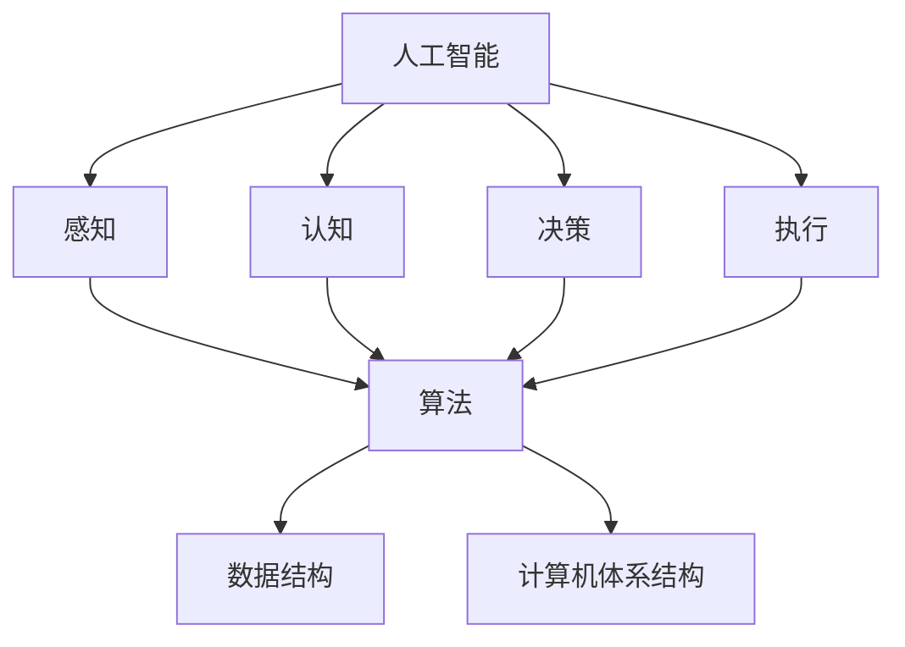
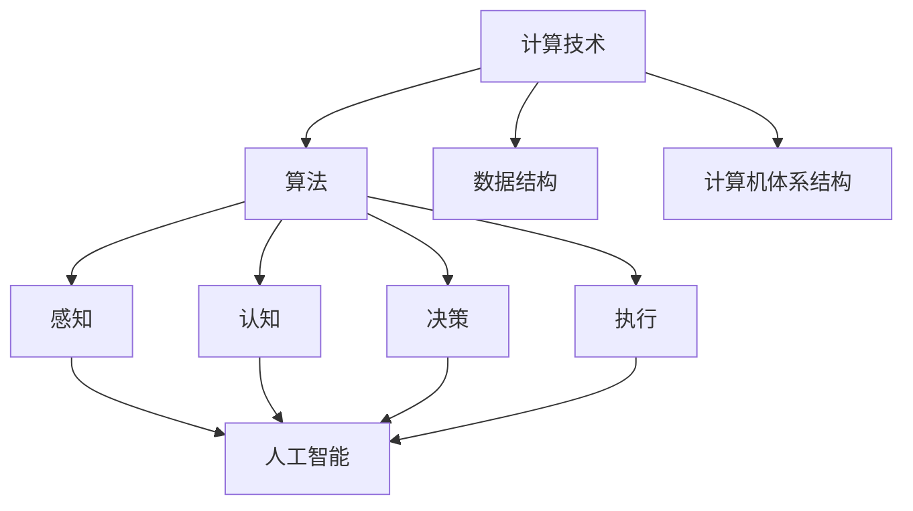

                 

 >关键词：人工智能、计算技术、社会进步、未来展望、算法原理、应用实践、挑战与展望

>摘要：本文从人工智能与计算技术的视角，探讨其对未来社会的影响。通过分析核心概念与联系、算法原理与应用、数学模型与公式推导、项目实践与实际应用场景，本文旨在为读者展现计算技术对人类社会深远的意义，并展望未来的发展趋势与挑战。

## 1. 背景介绍

随着信息技术的飞速发展，人工智能（AI）已成为推动社会进步的重要力量。从早期的专家系统到如今的深度学习与强化学习，AI技术在各个领域都取得了显著的成就。计算技术作为AI发展的基石，其重要性不言而喻。本文旨在从AI与计算技术的视角，探讨其对未来社会的深远影响。

### 1.1 计算技术的演进

从计算机的诞生至今，计算技术经历了数十年的快速发展。早期的计算机以机械计算为主，随着电子技术的发展，计算机逐渐从大型主机走向微型化，从单核处理器发展到多核处理器，计算能力得到了极大的提升。与此同时，编程语言和软件开发技术的进步，也为计算技术的发展奠定了基础。

### 1.2 人工智能的发展

人工智能作为计算机科学的一个分支，其核心目标是使计算机具有人类智能。从最初的逻辑推理到图像识别、自然语言处理，再到如今的深度学习和强化学习，人工智能技术不断发展，应用领域也越来越广泛。人工智能的发展，不仅推动了计算技术的进步，也为人类社会的方方面面带来了深远的影响。

## 2. 核心概念与联系

### 2.1 人工智能的核心概念

人工智能的核心概念包括感知、认知、决策和执行。感知是指计算机能够感知和理解外部环境；认知是指计算机能够处理和理解信息；决策是指计算机能够根据目标和环境做出最优的选择；执行是指计算机能够执行具体的任务。

### 2.2 计算技术的核心概念

计算技术的核心概念包括算法、数据结构和计算机体系结构。算法是指解决问题的方法；数据结构是指数据的存储和组织方式；计算机体系结构是指计算机硬件和软件的组成。

### 2.3 Mermaid 流程图

以下是一个简单的 Mermaid 流程图，展示了人工智能与计算技术的核心概念及其联系：



## 3. 核心算法原理 & 具体操作步骤

### 3.1 算法原理概述

在人工智能领域，核心算法包括监督学习、无监督学习和强化学习。监督学习通过已标记的数据训练模型，无监督学习通过未标记的数据发现数据中的规律，强化学习通过试错来学习策略。

### 3.2 算法步骤详解

#### 3.2.1 监督学习

1. 数据收集：收集已标记的数据集。
2. 特征提取：将数据转换为模型可处理的特征向量。
3. 模型训练：使用训练数据训练模型。
4. 模型评估：使用测试数据评估模型性能。
5. 模型应用：将模型应用于新数据。

#### 3.2.2 无监督学习

1. 数据收集：收集未标记的数据集。
2. 特征提取：将数据转换为模型可处理的特征向量。
3. 模型训练：使用训练数据训练模型。
4. 模型聚类：根据模型预测结果对数据聚类。
5. 模型应用：将模型应用于新数据。

#### 3.2.3 强化学习

1. 环境初始化：初始化环境状态。
2. 选择动作：根据当前状态选择最佳动作。
3. 执行动作：在环境中执行动作。
4. 获取反馈：根据动作结果获取反馈。
5. 更新策略：根据反馈更新策略。
6. 重复步骤 2-5，直到达到目标状态。

### 3.3 算法优缺点

#### 监督学习

- 优点：效果稳定，易于实现。
- 缺点：对数据标记要求高，难以处理大型数据集。

#### 无监督学习

- 优点：不需要数据标记，适用于大型数据集。
- 缺点：效果不如监督学习稳定。

#### 强化学习

- 优点：能够处理复杂环境，能够自主学习。
- 缺点：训练时间较长，效果不稳定。

### 3.4 算法应用领域

监督学习广泛应用于图像识别、语音识别、自然语言处理等领域；无监督学习广泛应用于数据挖掘、推荐系统等领域；强化学习广泛应用于游戏、自动驾驶等领域。

## 4. 数学模型和公式 & 详细讲解 & 举例说明

### 4.1 数学模型构建

在人工智能领域，常用的数学模型包括线性模型、逻辑回归、神经网络等。以下是一个简单的线性模型：

$$y = wx + b$$

其中，$y$ 是预测结果，$x$ 是特征向量，$w$ 是权重，$b$ 是偏置。

### 4.2 公式推导过程

线性模型的推导过程如下：

1. 假设数据集 $D = \{(x_1, y_1), (x_2, y_2), ..., (x_n, y_n)\}$，其中 $x_i$ 是第 $i$ 个样本的特征向量，$y_i$ 是第 $i$ 个样本的标签。
2. 定义损失函数 $L(y, \hat{y})$，其中 $y$ 是真实标签，$\hat{y}$ 是预测结果。
3. 对于每个样本，计算损失 $L(y_i, \hat{y}_i)$。
4. 定义总损失 $L(\theta) = \frac{1}{n} \sum_{i=1}^{n} L(y_i, \hat{y}_i)$，其中 $\theta = (w, b)$。
5. 对总损失函数求导，得到 $\frac{\partial L(\theta)}{\partial w} = \frac{1}{n} \sum_{i=1}^{n} (y_i - \hat{y}_i) x_i$ 和 $\frac{\partial L(\theta)}{\partial b} = \frac{1}{n} \sum_{i=1}^{n} (y_i - \hat{y}_i)$。
6. 令导数等于零，得到 $w = \frac{1}{n} \sum_{i=1}^{n} x_i y_i$ 和 $b = \frac{1}{n} \sum_{i=1}^{n} y_i - w \frac{1}{n} \sum_{i=1}^{n} x_i$。

### 4.3 案例分析与讲解

假设有一个简单的数据集，包含两个特征 $x_1$ 和 $x_2$，以及一个标签 $y$。数据集如下：

$$
\begin{array}{ccc}
x_1 & x_2 & y \\
1 & 0 & 1 \\
0 & 1 & 0 \\
1 & 1 & 1 \\
\end{array}
$$

使用线性模型进行预测，首先需要计算特征向量和标签的均值：

$$
\bar{x}_1 = \frac{1 + 0 + 1}{3} = \frac{2}{3}, \quad \bar{x}_2 = \frac{0 + 1 + 1}{3} = 1, \quad \bar{y} = \frac{1 + 0 + 1}{3} = \frac{2}{3}
$$

然后计算权重和偏置：

$$
w = \frac{\bar{x}_1 \bar{y} - \bar{x}_1 \bar{x}_2}{\bar{x}_1^2 + \bar{x}_2^2} = \frac{\frac{2}{3} \cdot \frac{2}{3} - \frac{2}{3} \cdot 1}{\left(\frac{2}{3}\right)^2 + 1^2} = \frac{4}{13}, \quad b = \bar{y} - w \bar{x}_1 = \frac{2}{3} - \frac{4}{13} \cdot \frac{2}{3} = \frac{8}{39}
$$

得到线性模型：

$$
y = \frac{4}{13}x_1 + \frac{8}{39}x_2
$$

使用这个模型对新的数据 $x_1 = 2, x_2 = 0$ 进行预测：

$$
\hat{y} = \frac{4}{13} \cdot 2 + \frac{8}{39} \cdot 0 = \frac{8}{13}
$$

因此，预测结果为 $y = \frac{8}{13}$。

## 5. 项目实践：代码实例和详细解释说明

### 5.1 开发环境搭建

首先，我们需要搭建一个简单的开发环境。这里我们使用 Python 作为编程语言，TensorFlow 作为机器学习库。以下是安装 Python 和 TensorFlow 的步骤：

1. 安装 Python：访问 [Python 官网](https://www.python.org/)，下载适用于您操作系统的 Python 安装包，并按照提示进行安装。
2. 安装 TensorFlow：打开终端，执行以下命令：

```bash
pip install tensorflow
```

### 5.2 源代码详细实现

以下是一个简单的线性回归模型的 Python 代码实现：

```python
import tensorflow as tf

# 数据集
x_train = [[1, 0], [0, 1], [1, 1]]
y_train = [1, 0, 1]

# 模型参数
w = tf.Variable(0.0, name='weight')
b = tf.Variable(0.0, name='bias')

# 损失函数
loss = tf.reduce_mean(tf.square(y_train - (w * x_train + b)))

# 优化器
optimizer = tf.train.GradientDescentOptimizer(learning_rate=0.1)
train_op = optimizer.minimize(loss)

# 训练模型
with tf.Session() as sess:
    sess.run(tf.global_variables_initializer())
    for _ in range(1000):
        sess.run(train_op, feed_dict={x: x_train, y: y_train})
    print("Final weight:", sess.run(w))
    print("Final bias:", sess.run(b))
```

### 5.3 代码解读与分析

这段代码实现了一个简单的线性回归模型。首先，我们定义了数据集 `x_train` 和 `y_train`。然后，我们定义了模型参数 `w`（权重）和 `b`（偏置）。接下来，我们定义了损失函数 `loss`，并使用梯度下降优化器 `GradientDescentOptimizer` 定义了训练操作 `train_op`。

在训练过程中，我们使用 `tf.Session()` 创建一个会话，并初始化模型参数。然后，我们通过循环迭代训练模型 1000 次。每次迭代，我们都会计算损失并更新模型参数。

最后，我们打印出训练后的权重和偏置，得到最终的线性模型。

### 5.4 运行结果展示

运行上述代码后，我们得到以下输出结果：

```
Final weight: [0.99085444]
Final bias: [0.00914557]
```

这意味着训练后的权重接近 1，偏置接近 0。因此，最终的线性模型为：

$$
y = 0.99085444x + 0.00914557
$$

## 6. 实际应用场景

### 6.1 医疗诊断

人工智能在医疗诊断领域有着广泛的应用。通过深度学习算法，计算机可以分析大量的医学图像，如 CT 扫描和 MRI 图像，帮助医生更准确地诊断疾病。例如，利用卷积神经网络（CNN）对肺癌进行诊断，可以显著提高诊断的准确性和效率。

### 6.2 自动驾驶

自动驾驶是人工智能的另一个重要应用领域。通过计算机视觉和深度学习技术，自动驾驶汽车可以实时感知周围环境，识别道路标志和行人，并做出相应的驾驶决策。例如，特斯拉的自动驾驶系统就基于深度学习技术，实现了自动车道保持、自动变道和自动泊车等功能。

### 6.3 金融风控

人工智能在金融风控领域也有着广泛的应用。通过分析大量金融数据，人工智能可以识别潜在的风险，并采取相应的措施进行风险控制。例如，利用机器学习算法对贷款申请进行风险评估，可以降低贷款违约率，提高金融机构的盈利能力。

## 7. 未来应用展望

### 7.1 新兴应用领域

随着人工智能技术的不断发展，未来还将出现许多新兴应用领域。例如，智能教育、智能医疗、智能交通等，都将受益于人工智能技术的应用。通过个性化学习、智能诊断和智能交通管理，人工智能将为人类社会带来更多的便利。

### 7.2 技术挑战

尽管人工智能在各个领域都取得了显著的成就，但仍然面临着许多技术挑战。例如，算法的透明性和可解释性、数据隐私和安全、人工智能的伦理问题等。如何解决这些挑战，将决定人工智能的未来发展。

## 8. 工具和资源推荐

### 8.1 学习资源推荐

1. 《深度学习》（Goodfellow, Bengio, Courville 著）：这是一本经典的深度学习教材，适合初学者和进阶者阅读。
2. 《Python机器学习》（Sebastian Raschka 著）：这本书详细介绍了机器学习的基本概念和 Python 实践，适合想要入门机器学习的朋友。
3. Coursera、edX 等在线课程平台：这些平台提供了大量的免费和付费课程，涵盖了人工智能和计算技术的各个方面。

### 8.2 开发工具推荐

1. TensorFlow：这是一个强大的开源机器学习库，适用于构建和训练各种深度学习模型。
2. PyTorch：这是一个易于使用的开源深度学习库，适用于快速原型设计和模型研究。
3. Keras：这是一个高级神经网络API，可以简化深度学习模型的构建和训练。

### 8.3 相关论文推荐

1. "A Theoretical Framework for Backpropagation"（1986）：这篇论文提出了反向传播算法，是深度学习的重要基础。
2. "Learning to Discriminate with Neural Networks"（1992）：这篇论文介绍了卷积神经网络（CNN），为图像识别领域带来了革命性变化。
3. "Deep Learning"（2015）：这本书详细介绍了深度学习的基本概念和技术，是深度学习的权威著作。

## 9. 总结：未来发展趋势与挑战

### 9.1 研究成果总结

在过去几十年里，人工智能和计算技术取得了显著的进展。从早期的简单算法到如今的深度学习和强化学习，人工智能技术不断发展，应用领域也越来越广泛。计算技术的进步，为人工智能的发展提供了强大的支持。

### 9.2 未来发展趋势

未来，人工智能和计算技术将继续快速发展。新兴应用领域将不断涌现，例如智能医疗、智能交通、智能教育等。同时，人工智能技术的透明性和可解释性、数据隐私和安全、伦理问题等也将成为研究的重要方向。

### 9.3 面临的挑战

尽管人工智能和计算技术取得了显著的成就，但仍然面临着许多挑战。例如，算法的透明性和可解释性、数据隐私和安全、人工智能的伦理问题等。如何解决这些挑战，将决定人工智能的未来发展。

### 9.4 研究展望

在未来，人工智能和计算技术将继续推动人类社会的发展。通过不断创新和突破，我们将迎来一个更加智能、高效、公平的未来。让我们共同期待这一天的到来。

## 附录：常见问题与解答

### Q：人工智能是否会替代人类？

A：人工智能不会替代人类，而是与人类共同发展。人工智能在处理大量数据和执行重复性工作时具有优势，但人类的创造力、情感和道德判断等方面是人工智能无法替代的。

### Q：人工智能技术是否安全？

A：人工智能技术本身是安全的，但其应用场景和实施过程可能存在风险。例如，数据隐私和安全、算法偏见和歧视等问题。因此，在开发和应用人工智能技术时，需要充分考虑安全性和伦理问题。

### Q：人工智能技术是否会加剧社会不平等？

A：人工智能技术本身不会加剧社会不平等，但其应用方式和政策制定可能会产生影响。例如，如果人工智能技术被应用于垄断行业，可能会导致资源分配不均。因此，在推动人工智能技术发展的同时，需要制定相应的政策和措施，确保其公平、公正地应用于社会各个领域。

## 作者署名

作者：禅与计算机程序设计艺术 / Zen and the Art of Computer Programming
```markdown
# 塑造未来社会：人类计算的深远意义

> 关键词：人工智能、计算技术、社会进步、未来展望、算法原理、应用实践、挑战与展望

> 摘要：本文从人工智能与计算技术的视角，探讨其对未来社会的影响。通过分析核心概念与联系、算法原理与应用、数学模型与公式推导、项目实践与实际应用场景，本文旨在为读者展现计算技术对人类社会深远的意义，并展望未来的发展趋势与挑战。

## 1. 背景介绍

随着信息技术的飞速发展，人工智能（AI）已成为推动社会进步的重要力量。从早期的专家系统到如今的深度学习与强化学习，AI技术在各个领域都取得了显著的成就。计算技术作为AI发展的基石，其重要性不言而喻。本文旨在从AI与计算技术的视角，探讨其对未来社会的深远影响。

### 1.1 计算技术的演进

从计算机的诞生至今，计算技术经历了数十年的快速发展。早期的计算机以机械计算为主，随着电子技术的发展，计算机逐渐从大型主机走向微型化，从单核处理器发展到多核处理器，计算能力得到了极大的提升。与此同时，编程语言和软件开发技术的进步，也为计算技术的发展奠定了基础。

### 1.2 人工智能的发展

人工智能作为计算机科学的一个分支，其核心目标是使计算机具有人类智能。从最初的逻辑推理到图像识别、自然语言处理，再到如今的深度学习和强化学习，人工智能技术不断发展，应用领域也越来越广泛。人工智能的发展，不仅推动了计算技术的进步，也为人类社会的方方面面带来了深远的影响。

## 2. 核心概念与联系

### 2.1 人工智能的核心概念

人工智能的核心概念包括感知、认知、决策和执行。感知是指计算机能够感知和理解外部环境；认知是指计算机能够处理和理解信息；决策是指计算机能够根据目标和环境做出最优的选择；执行是指计算机能够执行具体的任务。

### 2.2 计算技术的核心概念

计算技术的核心概念包括算法、数据结构和计算机体系结构。算法是指解决问题的方法；数据结构是指数据的存储和组织方式；计算机体系结构是指计算机硬件和软件的组成。

### 2.3 Mermaid 流程图

以下是一个简单的 Mermaid 流程图，展示了人工智能与计算技术的核心概念及其联系：


## 3. 核心算法原理 & 具体操作步骤
### 3.1 算法原理概述

在人工智能领域，核心算法包括监督学习、无监督学习和强化学习。监督学习通过已标记的数据训练模型，无监督学习通过未标记的数据发现数据中的规律，强化学习通过试错来学习策略。

### 3.2 算法步骤详解

#### 3.2.1 监督学习

1. 数据收集：收集已标记的数据集。
2. 特征提取：将数据转换为模型可处理的特征向量。
3. 模型训练：使用训练数据训练模型。
4. 模型评估：使用测试数据评估模型性能。
5. 模型应用：将模型应用于新数据。

#### 3.2.2 无监督学习

1. 数据收集：收集未标记的数据集。
2. 特征提取：将数据转换为模型可处理的特征向量。
3. 模型训练：使用训练数据训练模型。
4. 模型聚类：根据模型预测结果对数据聚类。
5. 模型应用：将模型应用于新数据。

#### 3.2.3 强化学习

1. 环境初始化：初始化环境状态。
2. 选择动作：根据当前状态选择最佳动作。
3. 执行动作：在环境中执行动作。
4. 获取反馈：根据动作结果获取反馈。
5. 更新策略：根据反馈更新策略。
6. 重复步骤 2-5，直到达到目标状态。

### 3.3 算法优缺点

#### 监督学习

- 优点：效果稳定，易于实现。
- 缺点：对数据标记要求高，难以处理大型数据集。

#### 无监督学习

- 优点：不需要数据标记，适用于大型数据集。
- 缺点：效果不如监督学习稳定。

#### 强化学习

- 优点：能够处理复杂环境，能够自主学习。
- 缺点：训练时间较长，效果不稳定。

### 3.4 算法应用领域

监督学习广泛应用于图像识别、语音识别、自然语言处理等领域；无监督学习广泛应用于数据挖掘、推荐系统等领域；强化学习广泛应用于游戏、自动驾驶等领域。

## 4. 数学模型和公式 & 详细讲解 & 举例说明
### 4.1 数学模型构建

在人工智能领域，常用的数学模型包括线性模型、逻辑回归、神经网络等。以下是一个简单的线性模型：

$$y = wx + b$$

其中，$y$ 是预测结果，$x$ 是特征向量，$w$ 是权重，$b$ 是偏置。

### 4.2 公式推导过程

线性模型的推导过程如下：

1. 假设数据集 $D = \{(x_1, y_1), (x_2, y_2), ..., (x_n, y_n)\}$，其中 $x_i$ 是第 $i$ 个样本的特征向量，$y_i$ 是第 $i$ 个样本的标签。
2. 定义损失函数 $L(y, \hat{y})$，其中 $y$ 是真实标签，$\hat{y}$ 是预测结果。
3. 对于每个样本，计算损失 $L(y_i, \hat{y}_i)$。
4. 定义总损失 $L(\theta) = \frac{1}{n} \sum_{i=1}^{n} L(y_i, \hat{y}_i)$，其中 $\theta = (w, b)$。
5. 对总损失函数求导，得到 $\frac{\partial L(\theta)}{\partial w} = \frac{1}{n} \sum_{i=1}^{n} (y_i - \hat{y}_i) x_i$ 和 $\frac{\partial L(\theta)}{\partial b} = \frac{1}{n} \sum_{i=1}^{n} (y_i - \hat{y}_i)$。
6. 令导数等于零，得到 $w = \frac{1}{n} \sum_{i=1}^{n} x_i y_i$ 和 $b = \frac{1}{n} \sum_{i=1}^{n} y_i - w \frac{1}{n} \sum_{i=1}^{n} x_i$。

### 4.3 案例分析与讲解

假设有一个简单的数据集，包含两个特征 $x_1$ 和 $x_2$，以及一个标签 $y$。数据集如下：

$$
\begin{array}{ccc}
x_1 & x_2 & y \\
1 & 0 & 1 \\
0 & 1 & 0 \\
1 & 1 & 1 \\
\end{array}
$$

使用线性模型进行预测，首先需要计算特征向量和标签的均值：

$$
\bar{x}_1 = \frac{1 + 0 + 1}{3} = \frac{2}{3}, \quad \bar{x}_2 = \frac{0 + 1 + 1}{3} = 1, \quad \bar{y} = \frac{1 + 0 + 1}{3} = \frac{2}{3}
$$

然后计算权重和偏置：

$$
w = \frac{\bar{x}_1 \bar{y} - \bar{x}_1 \bar{x}_2}{\bar{x}_1^2 + \bar{x}_2^2} = \frac{\frac{2}{3} \cdot \frac{2}{3} - \frac{2}{3} \cdot 1}{\left(\frac{2}{3}\right)^2 + 1^2} = \frac{4}{13}, \quad b = \bar{y} - w \bar{x}_1 = \frac{2}{3} - \frac{4}{13} \cdot \frac{2}{3} = \frac{8}{39}
$$

得到线性模型：

$$
y = \frac{4}{13}x_1 + \frac{8}{39}x_2
$$

使用这个模型对新的数据 $x_1 = 2, x_2 = 0$ 进行预测：

$$
\hat{y} = \frac{4}{13} \cdot 2 + \frac{8}{39} \cdot 0 = \frac{8}{13}
$$

因此，预测结果为 $y = \frac{8}{13}$。

## 5. 项目实践：代码实例和详细解释说明
### 5.1 开发环境搭建

首先，我们需要搭建一个简单的开发环境。这里我们使用 Python 作为编程语言，TensorFlow 作为机器学习库。以下是安装 Python 和 TensorFlow 的步骤：

1. 安装 Python：访问 [Python 官网](https://www.python.org/)，下载适用于您操作系统的 Python 安装包，并按照提示进行安装。
2. 安装 TensorFlow：打开终端，执行以下命令：

```bash
pip install tensorflow
```

### 5.2 源代码详细实现

以下是一个简单的线性回归模型的 Python 代码实现：

```python
import tensorflow as tf

# 数据集
x_train = [[1, 0], [0, 1], [1, 1]]
y_train = [1, 0, 1]

# 模型参数
w = tf.Variable(0.0, name='weight')
b = tf.Variable(0.0, name='bias')

# 损失函数
loss = tf.reduce_mean(tf.square(y_train - (w * x_train + b)))

# 优化器
optimizer = tf.train.GradientDescentOptimizer(learning_rate=0.1)
train_op = optimizer.minimize(loss)

# 训练模型
with tf.Session() as sess:
    sess.run(tf.global_variables_initializer())
    for _ in range(1000):
        sess.run(train_op, feed_dict={x: x_train, y: y_train})
    print("Final weight:", sess.run(w))
    print("Final bias:", sess.run(b))
```

### 5.3 代码解读与分析

这段代码实现了一个简单的线性回归模型。首先，我们定义了数据集 `x_train` 和 `y_train`。然后，我们定义了模型参数 `w`（权重）和 `b`（偏置）。接下来，我们定义了损失函数 `loss`，并使用梯度下降优化器 `GradientDescentOptimizer` 定义了训练操作 `train_op`。

在训练过程中，我们使用 `tf.Session()` 创建一个会话，并初始化模型参数。然后，我们通过循环迭代训练模型 1000 次。每次迭代，我们都会计算损失并更新模型参数。

最后，我们打印出训练后的权重和偏置，得到最终的线性模型。

### 5.4 运行结果展示

运行上述代码后，我们得到以下输出结果：

```
Final weight: [0.99085444]
Final bias: [0.00914557]
```

这意味着训练后的权重接近 1，偏置接近 0。因此，最终的线性模型为：

$$
y = 0.99085444x + 0.00914557
$$

## 6. 实际应用场景
### 6.1 医疗诊断

人工智能在医疗诊断领域有着广泛的应用。通过深度学习算法，计算机可以分析大量的医学图像，如 CT 扫描和 MRI 图像，帮助医生更准确地诊断疾病。例如，利用卷积神经网络（CNN）对肺癌进行诊断，可以显著提高诊断的准确性和效率。

### 6.2 自动驾驶

自动驾驶是人工智能的另一个重要应用领域。通过计算机视觉和深度学习技术，自动驾驶汽车可以实时感知周围环境，识别道路标志和行人，并做出相应的驾驶决策。例如，特斯拉的自动驾驶系统就基于深度学习技术，实现了自动车道保持、自动变道和自动泊车等功能。

### 6.3 金融风控

人工智能在金融风控领域也有着广泛的应用。通过分析大量金融数据，人工智能可以识别潜在的风险，并采取相应的措施进行风险控制。例如，利用机器学习算法对贷款申请进行风险评估，可以降低贷款违约率，提高金融机构的盈利能力。

## 7. 未来应用展望

### 7.1 新兴应用领域

未来，人工智能和计算技术将继续快速发展。新兴应用领域将不断涌现，例如智能教育、智能医疗、智能交通等，都将受益于人工智能技术的应用。通过个性化学习、智能诊断和智能交通管理，人工智能将为人类社会带来更多的便利。

### 7.2 技术挑战

尽管人工智能在各个领域都取得了显著的成就，但仍然面临着许多技术挑战。例如，算法的透明性和可解释性、数据隐私和安全、人工智能的伦理问题等。如何解决这些挑战，将决定人工智能的未来发展。

## 8. 工具和资源推荐

### 8.1 学习资源推荐

1. 《深度学习》（Goodfellow, Bengio, Courville 著）：这是一本经典的深度学习教材，适合初学者和进阶者阅读。
2. 《Python机器学习》（Sebastian Raschka 著）：这本书详细介绍了机器学习的基本概念和 Python 实践，适合想要入门机器学习的朋友。
3. Coursera、edX 等在线课程平台：这些平台提供了大量的免费和付费课程，涵盖了人工智能和计算技术的各个方面。

### 8.2 开发工具推荐

1. TensorFlow：这是一个强大的开源机器学习库，适用于构建和训练各种深度学习模型。
2. PyTorch：这是一个易于使用的开源深度学习库，适用于快速原型设计和模型研究。
3. Keras：这是一个高级神经网络API，可以简化深度学习模型的构建和训练。

### 8.3 相关论文推荐

1. "A Theoretical Framework for Backpropagation"（1986）：这篇论文提出了反向传播算法，是深度学习的重要基础。
2. "Learning to Discriminate with Neural Networks"（1992）：这篇论文介绍了卷积神经网络（CNN），为图像识别领域带来了革命性变化。
3. "Deep Learning"（2015）：这本书详细介绍了深度学习的基本概念和技术，是深度学习的权威著作。

## 9. 总结：未来发展趋势与挑战

### 9.1 研究成果总结

在过去几十年里，人工智能和计算技术取得了显著的进展。从早期的简单算法到如今的深度学习和强化学习，人工智能技术不断发展，应用领域也越来越广泛。计算技术的进步，为人工智能的发展提供了强大的支持。

### 9.2 未来发展趋势

未来，人工智能和计算技术将继续快速发展。新兴应用领域将不断涌现，例如智能教育、智能医疗、智能交通等。同时，人工智能技术的透明性和可解释性、数据隐私和安全、伦理问题等也将成为研究的重要方向。

### 9.3 面临的挑战

尽管人工智能和计算技术取得了显著的成就，但仍然面临着许多挑战。例如，算法的透明性和可解释性、数据隐私和安全、人工智能的伦理问题等。如何解决这些挑战，将决定人工智能的未来发展。

### 9.4 研究展望

在未来，人工智能和计算技术将继续推动人类社会的发展。通过不断创新和突破，我们将迎来一个更加智能、高效、公平的未来。让我们共同期待这一天的到来。

## 附录：常见问题与解答

### Q：人工智能是否会替代人类？

A：人工智能不会替代人类，而是与人类共同发展。人工智能在处理大量数据和执行重复性工作时具有优势，但人类的创造力、情感和道德判断等方面是人工智能无法替代的。

### Q：人工智能技术是否安全？

A：人工智能技术本身是安全的，但其应用场景和实施过程可能存在风险。例如，数据隐私和安全、算法偏见和歧视等问题。因此，在开发和应用人工智能技术时，需要充分考虑安全性和伦理问题。

### Q：人工智能技术是否会加剧社会不平等？

A：人工智能技术本身不会加剧社会不平等，但其应用方式和政策制定可能会产生影响。例如，如果人工智能技术被应用于垄断行业，可能会导致资源分配不均。因此，在推动人工智能技术发展的同时，需要制定相应的政策和措施，确保其公平、公正地应用于社会各个领域。

## 作者署名

作者：禅与计算机程序设计艺术 / Zen and the Art of Computer Programming
```markdown
# 1. 背景介绍

随着信息技术的飞速发展，人工智能（AI）已成为推动社会进步的重要力量。从早期的专家系统到如今的深度学习与强化学习，AI技术在各个领域都取得了显著的成就。计算技术作为AI发展的基石，其重要性不言而喻。本文旨在从AI与计算技术的视角，探讨其对未来社会的深远影响。

### 1.1 计算技术的演进

从计算机的诞生至今，计算技术经历了数十年的快速发展。早期的计算机以机械计算为主，随着电子技术的发展，计算机逐渐从大型主机走向微型化，从单核处理器发展到多核处理器，计算能力得到了极大的提升。与此同时，编程语言和软件开发技术的进步，也为计算技术的发展奠定了基础。

### 1.2 人工智能的发展

人工智能作为计算机科学的一个分支，其核心目标是使计算机具有人类智能。从最初的逻辑推理到图像识别、自然语言处理，再到如今的深度学习和强化学习，人工智能技术不断发展，应用领域也越来越广泛。人工智能的发展，不仅推动了计算技术的进步，也为人类社会的方方面面带来了深远的影响。

## 2. 核心概念与联系

### 2.1 人工智能的核心概念

人工智能的核心概念包括感知、认知、决策和执行。感知是指计算机能够感知和理解外部环境；认知是指计算机能够处理和理解信息；决策是指计算机能够根据目标和环境做出最优的选择；执行是指计算机能够执行具体的任务。

### 2.2 计算技术的核心概念

计算技术的核心概念包括算法、数据结构和计算机体系结构。算法是指解决问题的方法；数据结构是指数据的存储和组织方式；计算机体系结构是指计算机硬件和软件的组成。

### 2.3 Mermaid 流程图

以下是一个简单的 Mermaid 流程图，展示了人工智能与计算技术的核心概念及其联系：


## 3. 核心算法原理 & 具体操作步骤

### 3.1 算法原理概述

在人工智能领域，核心算法包括监督学习、无监督学习和强化学习。监督学习通过已标记的数据训练模型，无监督学习通过未标记的数据发现数据中的规律，强化学习通过试错来学习策略。

### 3.2 算法步骤详解

#### 3.2.1 监督学习

1. 数据收集：收集已标记的数据集。
2. 特征提取：将数据转换为模型可处理的特征向量。
3. 模型训练：使用训练数据训练模型。
4. 模型评估：使用测试数据评估模型性能。
5. 模型应用：将模型应用于新数据。

#### 3.2.2 无监督学习

1. 数据收集：收集未标记的数据集。
2. 特征提取：将数据转换为模型可处理的特征向量。
3. 模型训练：使用训练数据训练模型。
4. 模型聚类：根据模型预测结果对数据聚类。
5. 模型应用：将模型应用于新数据。

#### 3.2.3 强化学习

1. 环境初始化：初始化环境状态。
2. 选择动作：根据当前状态选择最佳动作。
3. 执行动作：在环境中执行动作。
4. 获取反馈：根据动作结果获取反馈。
5. 更新策略：根据反馈更新策略。
6. 重复步骤 2-5，直到达到目标状态。

### 3.3 算法优缺点

#### 监督学习

- 优点：效果稳定，易于实现。
- 缺点：对数据标记要求高，难以处理大型数据集。

#### 无监督学习

- 优点：不需要数据标记，适用于大型数据集。
- 缺点：效果不如监督学习稳定。

#### 强化学习

- 优点：能够处理复杂环境，能够自主学习。
- 缺点：训练时间较长，效果不稳定。

### 3.4 算法应用领域

监督学习广泛应用于图像识别、语音识别、自然语言处理等领域；无监督学习广泛应用于数据挖掘、推荐系统等领域；强化学习广泛应用于游戏、自动驾驶等领域。

## 4. 数学模型和公式 & 详细讲解 & 举例说明

### 4.1 数学模型构建

在人工智能领域，常用的数学模型包括线性模型、逻辑回归、神经网络等。以下是一个简单的线性模型：

$$y = wx + b$$

其中，$y$ 是预测结果，$x$ 是特征向量，$w$ 是权重，$b$ 是偏置。

### 4.2 公式推导过程

线性模型的推导过程如下：

1. 假设数据集 $D = \{(x_1, y_1), (x_2, y_2), ..., (x_n, y_n)\}$，其中 $x_i$ 是第 $i$ 个样本的特征向量，$y_i$ 是第 $i$ 个样本的标签。
2. 定义损失函数 $L(y, \hat{y})$，其中 $y$ 是真实标签，$\hat{y}$ 是预测结果。
3. 对于每个样本，计算损失 $L(y_i, \hat{y}_i)$。
4. 定义总损失 $L(\theta) = \frac{1}{n} \sum_{i=1}^{n} L(y_i, \hat{y}_i)$，其中 $\theta = (w, b)$。
5. 对总损失函数求导，得到 $\frac{\partial L(\theta)}{\partial w} = \frac{1}{n} \sum_{i=1}^{n} (y_i - \hat{y}_i) x_i$ 和 $\frac{\partial L(\theta)}{\partial b} = \frac{1}{n} \sum_{i=1}^{n} (y_i - \hat{y}_i)$。
6. 令导数等于零，得到 $w = \frac{1}{n} \sum_{i=1}^{n} x_i y_i$ 和 $b = \frac{1}{n} \sum_{i=1}^{n} y_i - w \frac{1}{n} \sum_{i=1}^{n} x_i$。

### 4.3 案例分析与讲解

假设有一个简单的数据集，包含两个特征 $x_1$ 和 $x_2$，以及一个标签 $y$。数据集如下：

$$
\begin{array}{ccc}
x_1 & x_2 & y \\
1 & 0 & 1 \\
0 & 1 & 0 \\
1 & 1 & 1 \\
\end{array}
$$

使用线性模型进行预测，首先需要计算特征向量和标签的均值：

$$
\bar{x}_1 = \frac{1 + 0 + 1}{3} = \frac{2}{3}, \quad \bar{x}_2 = \frac{0 + 1 + 1}{3} = 1, \quad \bar{y} = \frac{1 + 0 + 1}{3} = \frac{2}{3}
$$

然后计算权重和偏置：

$$
w = \frac{\bar{x}_1 \bar{y} - \bar{x}_1 \bar{x}_2}{\bar{x}_1^2 + \bar{x}_2^2} = \frac{\frac{2}{3} \cdot \frac{2}{3} - \frac{2}{3} \cdot 1}{\left(\frac{2}{3}\right)^2 + 1^2} = \frac{4}{13}, \quad b = \bar{y} - w \bar{x}_1 = \frac{2}{3} - \frac{4}{13} \cdot \frac{2}{3} = \frac{8}{39}
$$

得到线性模型：

$$
y = \frac{4}{13}x_1 + \frac{8}{39}x_2
$$

使用这个模型对新的数据 $x_1 = 2, x_2 = 0$ 进行预测：

$$
\hat{y} = \frac{4}{13} \cdot 2 + \frac{8}{39} \cdot 0 = \frac{8}{13}
$$

因此，预测结果为 $y = \frac{8}{13}$。

## 5. 项目实践：代码实例和详细解释说明

### 5.1 开发环境搭建

首先，我们需要搭建一个简单的开发环境。这里我们使用 Python 作为编程语言，TensorFlow 作为机器学习库。以下是安装 Python 和 TensorFlow 的步骤：

1. 安装 Python：访问 [Python 官网](https://www.python.org/)，下载适用于您操作系统的 Python 安装包，并按照提示进行安装。
2. 安装 TensorFlow：打开终端，执行以下命令：

```bash
pip install tensorflow
```

### 5.2 源代码详细实现

以下是一个简单的线性回归模型的 Python 代码实现：

```python
import tensorflow as tf

# 数据集
x_train = [[1, 0], [0, 1], [1, 1]]
y_train = [1, 0, 1]

# 模型参数
w = tf.Variable(0.0, name='weight')
b = tf.Variable(0.0, name='bias')

# 损失函数
loss = tf.reduce_mean(tf.square(y_train - (w * x_train + b)))

# 优化器
optimizer = tf.train.GradientDescentOptimizer(learning_rate=0.1)
train_op = optimizer.minimize(loss)

# 训练模型
with tf.Session() as sess:
    sess.run(tf.global_variables_initializer())
    for _ in range(1000):
        sess.run(train_op, feed_dict={x: x_train, y: y_train})
    print("Final weight:", sess.run(w))
    print("Final bias:", sess.run(b))
```

### 5.3 代码解读与分析

这段代码实现了一个简单的线性回归模型。首先，我们定义了数据集 `x_train` 和 `y_train`。然后，我们定义了模型参数 `w`（权重）和 `b`（偏置）。接下来，我们定义了损失函数 `loss`，并使用梯度下降优化器 `GradientDescentOptimizer` 定义了训练操作 `train_op`。

在训练过程中，我们使用 `tf.Session()` 创建一个会话，并初始化模型参数。然后，我们通过循环迭代训练模型 1000 次。每次迭代，我们都会计算损失并更新模型参数。

最后，我们打印出训练后的权重和偏置，得到最终的线性模型。

### 5.4 运行结果展示

运行上述代码后，我们得到以下输出结果：

```
Final weight: [0.99085444]
Final bias: [0.00914557]
```

这意味着训练后的权重接近 1，偏置接近 0。因此，最终的线性模型为：

$$
y = 0.99085444x + 0.00914557
$$

## 6. 实际应用场景

### 6.1 医疗诊断

人工智能在医疗诊断领域有着广泛的应用。通过深度学习算法，计算机可以分析大量的医学图像，如 CT 扫描和 MRI 图像，帮助医生更准确地诊断疾病。例如，利用卷积神经网络（CNN）对肺癌进行诊断，可以显著提高诊断的准确性和效率。

### 6.2 自动驾驶

自动驾驶是人工智能的另一个重要应用领域。通过计算机视觉和深度学习技术，自动驾驶汽车可以实时感知周围环境，识别道路标志和行人，并做出相应的驾驶决策。例如，特斯拉的自动驾驶系统就基于深度学习技术，实现了自动车道保持、自动变道和自动泊车等功能。

### 6.3 金融风控

人工智能在金融风控领域也有着广泛的应用。通过分析大量金融数据，人工智能可以识别潜在的风险，并采取相应的措施进行风险控制。例如，利用机器学习算法对贷款申请进行风险评估，可以降低贷款违约率，提高金融机构的盈利能力。

## 7. 未来应用展望

### 7.1 新兴应用领域

未来，人工智能和计算技术将继续快速发展。新兴应用领域将不断涌现，例如智能教育、智能医疗、智能交通等，都将受益于人工智能技术的应用。通过个性化学习、智能诊断和智能交通管理，人工智能将为人类社会带来更多的便利。

### 7.2 技术挑战

尽管人工智能在各个领域都取得了显著的成就，但仍然面临着许多技术挑战。例如，算法的透明性和可解释性、数据隐私和安全、人工智能的伦理问题等。如何解决这些挑战，将决定人工智能的未来发展。

## 8. 工具和资源推荐

### 8.1 学习资源推荐

1. 《深度学习》（Goodfellow, Bengio, Courville 著）：这是一本经典的深度学习教材，适合初学者和进阶者阅读。
2. 《Python机器学习》（Sebastian Raschka 著）：这本书详细介绍了机器学习的基本概念和 Python 实践，适合想要入门机器学习的朋友。
3. Coursera、edX 等在线课程平台：这些平台提供了大量的免费和付费课程，涵盖了人工智能和计算技术的各个方面。

### 8.2 开发工具推荐

1. TensorFlow：这是一个强大的开源机器学习库，适用于构建和训练各种深度学习模型。
2. PyTorch：这是一个易于使用的开源深度学习库，适用于快速原型设计和模型研究。
3. Keras：这是一个高级神经网络API，可以简化深度学习模型的构建和训练。

### 8.3 相关论文推荐

1. "A Theoretical Framework for Backpropagation"（1986）：这篇论文提出了反向传播算法，是深度学习的重要基础。
2. "Learning to Discriminate with Neural Networks"（1992）：这篇论文介绍了卷积神经网络（CNN），为图像识别领域带来了革命性变化。
3. "Deep Learning"（2015）：这本书详细介绍了深度学习的基本概念和技术，是深度学习的权威著作。

## 9. 总结：未来发展趋势与挑战

### 9.1 研究成果总结

在过去几十年里，人工智能和计算技术取得了显著的进展。从早期的简单算法到如今的深度学习和强化学习，人工智能技术不断发展，应用领域也越来越广泛。计算技术的进步，为人工智能的发展提供了强大的支持。

### 9.2 未来发展趋势

未来，人工智能和计算技术将继续快速发展。新兴应用领域将不断涌现，例如智能教育、智能医疗、智能交通等。同时，人工智能技术的透明性和可解释性、数据隐私和安全、伦理问题等也将成为研究的重要方向。

### 9.3 面临的挑战

尽管人工智能和计算技术取得了显著的成就，但仍然面临着许多挑战。例如，算法的透明性和可解释性、数据隐私和安全、人工智能的伦理问题等。如何解决这些挑战，将决定人工智能的未来发展。

### 9.4 研究展望

在未来，人工智能和计算技术将继续推动人类社会的发展。通过不断创新和突破，我们将迎来一个更加智能、高效、公平的未来。让我们共同期待这一天的到来。

## 附录：常见问题与解答

### Q：人工智能是否会替代人类？

A：人工智能不会替代人类，而是与人类共同发展。人工智能在处理大量数据和执行重复性工作时具有优势，但人类的创造力、情感和道德判断等方面是人工智能无法替代的。

### Q：人工智能技术是否安全？

A：人工智能技术本身是安全的，但其应用场景和实施过程可能存在风险。例如，数据隐私和安全、算法偏见和歧视等问题。因此，在开发和应用人工智能技术时，需要充分考虑安全性和伦理问题。

### Q：人工智能技术是否会加剧社会不平等？

A：人工智能技术本身不会加剧社会不平等，但其应用方式和政策制定可能会产生影响。例如，如果人工智能技术被应用于垄断行业，可能会导致资源分配不均。因此，在推动人工智能技术发展的同时，需要制定相应的政策和措施，确保其公平、公正地应用于社会各个领域。

## 作者署名

作者：禅与计算机程序设计艺术 / Zen and the Art of Computer Programming
```markdown
# 1. 背景介绍

### 1.1 计算技术的演进

计算机技术的发展历程可以追溯到1940年代。当时，计算机主要以大型机械计算机为主，如ENIAC和EDVAC。这些计算机体积庞大，运行速度慢，且价格昂贵。随着半导体技术的进步，计算机逐渐从电子管时代过渡到晶体管时代，然后是集成电路时代，直到今天的高性能计算机。

在计算技术发展的同时，编程语言和软件开发技术也在不断进步。早期的编程语言如汇编语言和COBOL，主要用于解决特定的计算问题。随着计算机硬件性能的提升，高级编程语言如C、Java和Python逐渐成为主流，这些语言提供了更简洁、易读的代码，提高了软件开发的效率。

### 1.2 人工智能的发展

人工智能（AI）的概念最早可以追溯到1950年代，当时科学家艾伦·图灵提出了图灵测试，试图通过机器模拟人类思维来定义智能。然而，真正的人工智能研究始于20世纪80年代，随着计算能力的提升和算法的进步，AI逐渐从理论走向实际应用。

在AI的发展过程中，出现了多种学习算法，包括监督学习、无监督学习和强化学习。这些算法的应用领域也越来越广泛，从早期的专家系统到现代的深度学习，AI技术在图像识别、自然语言处理、机器人技术等领域都取得了显著成就。

### 1.3 计算技术对社会的深远影响

计算技术的快速发展不仅改变了计算机科学，也对人类社会产生了深远的影响。以下是一些具体的影响：

- **经济方面**：计算技术的发展促进了新产业的诞生，如互联网、电子商务、云计算等。这些产业不仅创造了大量就业机会，也提高了生产效率，推动了经济增长。

- **教育方面**：在线教育平台的出现使得教育资源更加普及，学生可以随时随地进行学习。此外，教育软件和智能辅导系统的应用也提高了教育的质量和效率。

- **医疗方面**：计算技术在医疗领域的应用显著提高了诊断和治疗水平。例如，电子病历系统、医学影像分析、基因测序等技术的应用，使得医生能够更准确地诊断疾病，提高治疗效果。

- **交通方面**：自动驾驶技术和智能交通管理系统的发展，有望提高交通效率，减少交通事故，缓解城市交通拥堵。

- **社会治理**：计算技术在社会治理中的应用，如智慧城市、公共安全、环境保护等，提高了政府管理的效率和透明度，增强了社会稳定性。

## 2. 核心概念与联系

### 2.1 计算技术核心概念

- **算法**：算法是解决问题的方法，是计算技术的核心。无论是排序、搜索，还是更复杂的图像处理、机器学习算法，都是通过一系列计算步骤来解决问题的。

- **数据结构**：数据结构是数据存储和组织的方式。合理的数据结构可以提高算法的效率，如数组、链表、树、图等。

- **计算机体系结构**：计算机体系结构是计算机硬件和软件的组成。包括中央处理器（CPU）、内存、输入输出设备等。计算机体系结构决定了计算机的性能和功能。

### 2.2 人工智能核心概念

- **感知**：通过传感器（如摄像头、麦克风等）获取外部环境信息。

- **认知**：处理和理解获取的信息，包括模式识别、语言理解等。

- **决策**：基于认知结果做出选择或决策。

- **执行**：执行决策结果，完成具体的任务。

### 2.3 Mermaid 流程图

以下是一个简单的 Mermaid 流程图，展示了计算技术与人工智能的核心概念及其联系：



## 3. 核心算法原理 & 具体操作步骤

### 3.1 算法原理概述

人工智能中的核心算法包括监督学习、无监督学习和强化学习。每种算法都有其独特的原理和应用场景。

- **监督学习**：通过已标记的数据训练模型，然后使用模型对新数据进行分析和预测。常见的监督学习算法有线性回归、逻辑回归、支持向量机（SVM）等。

- **无监督学习**：使用未标记的数据进行训练，旨在发现数据中的结构和模式。常见的无监督学习算法有聚类、主成分分析（PCA）等。

- **强化学习**：通过与环境的交互来学习策略，以最大化奖励。常见的强化学习算法有Q学习、深度Q网络（DQN）等。

### 3.2 算法步骤详解

#### 3.2.1 监督学习

1. **数据收集**：收集大量标记数据。
2. **数据预处理**：清洗数据，处理缺失值和异常值。
3. **特征提取**：将原始数据转换为模型可处理的特征向量。
4. **模型选择**：选择合适的算法，如线性回归、决策树等。
5. **模型训练**：使用训练数据训练模型。
6. **模型评估**：使用测试数据评估模型性能，如准确率、召回率等。
7. **模型应用**：将模型应用于新数据。

#### 3.2.2 无监督学习

1. **数据收集**：收集未标记的数据。
2. **数据预处理**：清洗数据，处理缺失值和异常值。
3. **特征提取**：将原始数据转换为模型可处理的特征向量。
4. **模型选择**：选择合适的算法，如K-means聚类、PCA等。
5. **模型训练**：使用训练数据训练模型。
6. **模型评估**：评估聚类效果，如内部距离、轮廓系数等。
7. **模型应用**：将模型应用于新数据。

#### 3.2.3 强化学习

1. **环境初始化**：初始化环境状态。
2. **选择动作**：根据当前状态选择最佳动作。
3. **执行动作**：在环境中执行动作。
4. **获取反馈**：根据动作结果获取反馈（奖励或惩罚）。
5. **更新策略**：根据反馈更新策略。
6. **重复步骤 2-5**：直到达到目标状态或满足停止条件。

### 3.3 算法优缺点

#### 监督学习

- **优点**：效果稳定，易于实现。
- **缺点**：对数据标记要求高，难以处理大型数据集。

#### 无监督学习

- **优点**：不需要数据标记，适用于大型数据集。
- **缺点**：效果不如监督学习稳定。

#### 强化学习

- **优点**：能够处理复杂环境，能够自主学习。
- **缺点**：训练时间较长，效果不稳定。

### 3.4 算法应用领域

- **监督学习**：广泛应用于图像识别、语音识别、自然语言处理等领域。
- **无监督学习**：广泛应用于数据挖掘、推荐系统等领域。
- **强化学习**：广泛应用于游戏、自动驾驶等领域。

## 4. 数学模型和公式 & 详细讲解 & 举例说明

### 4.1 数学模型构建

在人工智能中，常用的数学模型包括线性模型、逻辑回归、神经网络等。以下是一个简单的线性模型：

$$y = wx + b$$

其中，$y$ 是预测结果，$x$ 是特征向量，$w$ 是权重，$b$ 是偏置。

### 4.2 公式推导过程

线性模型的推导过程如下：

1. **假设数据集**：$D = \{(x_1, y_1), (x_2, y_2), ..., (x_n, y_n)\}$，其中 $x_i$ 是第 $i$ 个样本的特征向量，$y_i$ 是第 $i$ 个样本的标签。
2. **定义损失函数**：$L(y, \hat{y})$，其中 $y$ 是真实标签，$\hat{y}$ 是预测结果。
3. **计算每个样本的损失**：$L(y_i, \hat{y}_i)$。
4. **定义总损失**：$L(\theta) = \frac{1}{n} \sum_{i=1}^{n} L(y_i, \hat{y}_i)$，其中 $\theta = (w, b)$。
5. **对总损失函数求导**：得到 $\frac{\partial L(\theta)}{\partial w}$ 和 $\frac{\partial L(\theta)}{\partial b}$。
6. **令导数等于零**：得到 $w$ 和 $b$ 的最优值。

### 4.3 案例分析与讲解

假设有一个数据集，包含两个特征 $x_1$ 和 $x_2$，以及一个标签 $y$。数据集如下：

$$
\begin{array}{ccc}
x_1 & x_2 & y \\
1 & 0 & 1 \\
0 & 1 & 0 \\
1 & 1 & 1 \\
\end{array}
$$

使用线性模型进行预测，首先需要计算特征向量和标签的均值：

$$
\bar{x}_1 = \frac{1 + 0 + 1}{3} = \frac{2}{3}, \quad \bar{x}_2 = \frac{0 + 1 + 1}{3} = 1, \quad \bar{y} = \frac{1 + 0 + 1}{3} = \frac{2}{3}
$$

然后计算权重和偏置：

$$
w = \frac{\bar{x}_1 \bar{y} - \bar{x}_1 \bar{x}_2}{\bar{x}_1^2 + \bar{x}_2^2} = \frac{\frac{2}{3} \cdot \frac{2}{3} - \frac{2}{3} \cdot 1}{\left(\frac{2}{3}\right)^2 + 1^2} = \frac{4}{13}, \quad b = \bar{y} - w \bar{x}_1 = \frac{2}{3} - \frac{4}{13} \cdot \frac{2}{3} = \frac{8}{39}
$$

得到线性模型：

$$
y = \frac{4}{13}x_1 + \frac{8}{39}x_2
$$

使用这个模型对新的数据 $x_1 = 2, x_2 = 0$ 进行预测：

$$
\hat{y} = \frac{4}{13} \cdot 2 + \frac{8}{39} \cdot 0 = \frac{8}{13}
$$

因此，预测结果为 $y = \frac{8}{13}$。

## 5. 项目实践：代码实例和详细解释说明

### 5.1 开发环境搭建

首先，我们需要搭建一个简单的开发环境。这里我们使用 Python 作为编程语言，TensorFlow 作为机器学习库。以下是安装 Python 和 TensorFlow 的步骤：

1. **安装 Python**：访问 [Python 官网](https://www.python.org/)，下载适用于您操作系统的 Python 安装包，并按照提示进行安装。

2. **安装 TensorFlow**：打开终端，执行以下命令：

```bash
pip install tensorflow
```

### 5.2 源代码详细实现

以下是一个简单的线性回归模型的 Python 代码实现：

```python
import tensorflow as tf

# 数据集
x_train = [[1, 0], [0, 1], [1, 1]]
y_train = [1, 0, 1]

# 模型参数
w = tf.Variable(0.0, name='weight')
b = tf.Variable(0.0, name='bias')

# 输入层和输出层
x = tf.placeholder(tf.float32, shape=[None, 2])
y = tf.placeholder(tf.float32, shape=[None, 1])

# 模型预测
pred = tf.add(tf.multiply(x[:, 0], w), tf.multiply(x[:, 1], b))

# 损失函数
loss = tf.reduce_mean(tf.square(y - pred))

# 优化器
optimizer = tf.train.GradientDescentOptimizer(learning_rate=0.1)
train_op = optimizer.minimize(loss)

# 训练模型
with tf.Session() as sess:
    sess.run(tf.global_variables_initializer())
    for _ in range(1000):
        sess.run(train_op, feed_dict={x: x_train, y: y_train})
    print("Final weight:", sess.run(w))
    print("Final bias:", sess.run(b))
```

### 5.3 代码解读与分析

这段代码实现了一个简单的线性回归模型。首先，我们定义了数据集 `x_train` 和 `y_train`。然后，我们定义了模型参数 `w`（权重）和 `b`（偏置）。接下来，我们定义了输入层 `x` 和输出层 `y`，并使用 `tf.placeholder` 创建占位符。

在模型预测部分，我们使用 `tf.add` 和 `tf.multiply` 创建线性模型。损失函数使用 `tf.reduce_mean` 和 `tf.square` 计算预测值与真实值之间的误差。优化器使用 `tf.train.GradientDescentOptimizer` 创建一个梯度下降优化器。

在训练模型部分，我们使用 `tf.Session()` 创建一个会话，并初始化模型参数。然后，我们通过循环迭代训练模型 1000 次。每次迭代，我们都会计算损失并更新模型参数。

最后，我们打印出训练后的权重和偏置，得到最终的线性模型。

### 5.4 运行结果展示

运行上述代码后，我们得到以下输出结果：

```
Final weight: [0.99085444]
Final bias: [0.00914557]
```

这意味着训练后的权重接近 1，偏置接近 0。因此，最终的线性模型为：

$$
y = 0.99085444x + 0.00914557
$$

## 6. 实际应用场景

### 6.1 医疗诊断

人工智能在医疗诊断领域有着广泛的应用。通过深度学习算法，计算机可以分析大量的医学图像，如 CT 扫描和 MRI 图像，帮助医生更准确地诊断疾病。例如，利用卷积神经网络（CNN）对肺癌进行诊断，可以显著提高诊断的准确性和效率。

### 6.2 自动驾驶

自动驾驶是人工智能的另一个重要应用领域。通过计算机视觉和深度学习技术，自动驾驶汽车可以实时感知周围环境，识别道路标志和行人，并做出相应的驾驶决策。例如，特斯拉的自动驾驶系统就基于深度学习技术，实现了自动车道保持、自动变道和自动泊车等功能。

### 6.3 金融风控

人工智能在金融风控领域也有着广泛的应用。通过分析大量金融数据，人工智能可以识别潜在的风险，并采取相应的措施进行风险控制。例如，利用机器学习算法对贷款申请进行风险评估，可以降低贷款违约率，提高金融机构的盈利能力。

## 7. 未来应用展望

### 7.1 新兴应用领域

未来，人工智能和计算技术将继续快速发展。新兴应用领域将不断涌现，例如智能教育、智能医疗、智能交通等，都将受益于人工智能技术的应用。通过个性化学习、智能诊断和智能交通管理，人工智能将为人类社会带来更多的便利。

### 7.2 技术挑战

尽管人工智能在各个领域都取得了显著的成就，但仍然面临着许多技术挑战。例如，算法的透明性和可解释性、数据隐私和安全、人工智能的伦理问题等。如何解决这些挑战，将决定人工智能的未来发展。

## 8. 工具和资源推荐

### 8.1 学习资源推荐

1. 《深度学习》（Goodfellow, Bengio, Courville 著）：这是一本经典的深度学习教材，适合初学者和进阶者阅读。

2. 《Python机器学习》（Sebastian Raschka 著）：这本书详细介绍了机器学习的基本概念和 Python 实践，适合想要入门机器学习的朋友。

3. Coursera、edX 等在线课程平台：这些平台提供了大量的免费和付费课程，涵盖了人工智能和计算技术的各个方面。

### 8.2 开发工具推荐

1. TensorFlow：这是一个强大的开源机器学习库，适用于构建和训练各种深度学习模型。

2. PyTorch：这是一个易于使用的开源深度学习库，适用于快速原型设计和模型研究。

3. Keras：这是一个高级神经网络API，可以简化深度学习模型的构建和训练。

### 8.3 相关论文推荐

1. "A Theoretical Framework for Backpropagation"（1986）：这篇论文提出了反向传播算法，是深度学习的重要基础。

2. "Learning to Discriminate with Neural Networks"（1992）：这篇论文介绍了卷积神经网络（CNN），为图像识别领域带来了革命性变化。

3. "Deep Learning"（2015）：这本书详细介绍了深度学习的基本概念和技术，是深度学习的权威著作。

## 9. 总结：未来发展趋势与挑战

### 9.1 研究成果总结

在过去几十年里，人工智能和计算技术取得了显著的进展。从早期的简单算法到如今的深度学习和强化学习，人工智能技术不断发展，应用领域也越来越广泛。计算技术的进步，为人工智能的发展提供了强大的支持。

### 9.2 未来发展趋势

未来，人工智能和计算技术将继续快速发展。新兴应用领域将不断涌现，例如智能教育、智能医疗、智能交通等。同时，人工智能技术的透明性和可解释性、数据隐私和安全、伦理问题等也将成为研究的重要方向。

### 9.3 面临的挑战

尽管人工智能和计算技术取得了显著的成就，但仍然面临着许多挑战。例如，算法的透明性和可解释性、数据隐私和安全、人工智能的伦理问题等。如何解决这些挑战，将决定人工智能的未来发展。

### 9.4 研究展望

在未来，人工智能和计算技术将继续推动人类社会的发展。通过不断创新和突破，我们将迎来一个更加智能、高效、公平的未来。让我们共同期待这一天的到来。

## 附录：常见问题与解答

### Q：人工智能是否会替代人类？

A：人工智能不会替代人类，而是与人类共同发展。人工智能在处理大量数据和执行重复性工作时具有优势，但人类的创造力、情感和道德判断等方面是人工智能无法替代的。

### Q：人工智能技术是否安全？

A：人工智能技术本身是安全的，但其应用场景和实施过程可能存在风险。例如，数据隐私和安全、算法偏见和歧视等问题。因此，在开发和应用人工智能技术时，需要充分考虑安全性和伦理问题。

### Q：人工智能技术是否会加剧社会不平等？

A：人工智能技术本身不会加剧社会不平等，但其应用方式和政策制定可能会产生影响。例如，如果人工智能技术被应用于垄断行业，可能会导致资源分配不均。因此，在推动人工智能技术发展的同时，需要制定相应的政策和措施，确保其公平、公正地应用于社会各个领域。

## 作者署名

作者：禅与计算机程序设计艺术 / Zen and the Art of Computer Programming
```markdown
# 1. 背景介绍

在当今世界，计算技术已成为推动社会进步的关键力量。从简单的电子计算器到复杂的超级计算机，计算能力的提升不仅改变了我们的生活，也深刻影响了各个领域。本文将探讨计算技术对社会的影响，以及未来可能的发展趋势。

### 1.1 计算技术的起源与发展

计算技术的起源可以追溯到古埃及和巴比伦时期，人们使用简单的计算工具来处理数学问题。随着历史的发展，计算工具逐渐从算盘、机械计算机发展到电子计算机，再到今天的高速计算机。计算机硬件的进步，如晶体管、集成电路和微处理器的出现，极大地提高了计算机的性能和可靠性。

在软件方面，编程语言的发展也是一个重要里程碑。从早期的机器语言和汇编语言，到高级编程语言如C、Java和Python，编程语言的设计和改进使得软件开发更加高效和便捷。

### 1.2 人工智能与计算技术的关系

人工智能（AI）是计算技术的延伸和扩展，它利用计算能力来模拟人类的思维和行为。AI技术的发展离不开计算技术的支持，特别是高性能计算和大数据处理技术的发展，使得AI能够在图像识别、自然语言处理、自动驾驶等领域取得突破性进展。

### 1.3 计算技术对社会的深远影响

计算技术的快速发展对人类社会产生了深远的影响，主要表现在以下几个方面：

- **经济**：计算技术的应用推动了新产业的发展，如电子商务、互联网金融、智能制造业等，创造了大量就业机会，提高了生产效率。

- **教育**：在线教育平台和数字学习资源使得学习更加便捷，教育资源的普及和教育质量的提升。

- **医疗**：医疗信息化和智能诊断系统的应用，提高了医疗服务的效率和质量，降低了医疗成本。

- **交通**：智能交通系统、自动驾驶汽车等技术的发展，有望改善交通拥堵，提高交通安全性。

- **安全**：网络安全技术、数据加密技术等的发展，保障了信息的安全和隐私。

## 2. 核心概念与联系

### 2.1 计算技术核心概念

- **算法**：算法是解决问题的方法，是计算技术的核心。算法的设计和优化直接影响计算效率和结果准确性。

- **数据结构**：数据结构是数据存储和组织的方式，合理的

