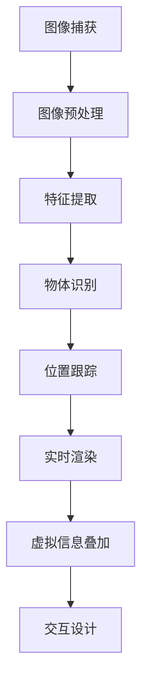

                 

关键词：增强现实，创业，商业新机遇，虚实融合，技术创新

**摘要**：
本文将深入探讨增强现实（AR）技术在创业领域的应用及其带来的商业新机遇。通过介绍AR的基本概念、发展历程、核心技术，以及具体案例，我们将展示AR如何为创业者提供创新性的商业解决方案，并分析其在未来可能面临的挑战与机遇。此外，文章还将推荐相关的学习资源和开发工具，为有意投身AR领域的创业者提供指导。

## 1. 背景介绍

增强现实（Augmented Reality，简称AR）是一种通过计算机技术将虚拟信息叠加到真实世界中的技术。与虚拟现实（VR）不同，AR的重点在于增强用户对现实世界的感知，而非完全替代现实。AR技术通过在用户眼前生成计算机生成的视觉、听觉、触觉等感官信息，实现了虚实结合的交互体验。

### 1.1 AR技术的发展历程

AR技术的发展可追溯到20世纪60年代。1968年，美国计算机科学家伊凡·苏瑟兰（Ivan Sutherland）首次提出了“增强现实”这一概念。早期的AR系统主要依赖于特殊的头戴显示器（HMD）和跟踪设备，这些设备价格昂贵且不便于携带。随着计算机技术、显示技术和传感技术的进步，AR技术逐渐走向成熟，并在近年来迎来了爆发式的发展。

### 1.2 AR技术的核心概念与架构

AR系统的核心包括以下几个方面：

- **图像处理与识别**：通过摄像头捕捉实时图像，并对图像进行预处理、特征提取和匹配，以识别现实场景中的物体或位置。
- **实时渲染**：根据用户的位置和视角，实时生成计算机图形，并将其叠加到真实世界的图像上。
- **定位与跟踪**：使用各种传感器（如陀螺仪、加速度计、激光雷达等）来跟踪用户的位置和姿态，确保虚拟信息与现实世界的正确对应。
- **交互设计**：设计用户与虚拟信息的交互方式，包括手势识别、语音控制等，以提高用户体验。

## 2. 核心概念与联系

为了更好地理解AR技术，我们可以通过一个Mermaid流程图来展示其核心概念与架构之间的联系。



### 2.1 图像捕获与预处理

图像捕获是AR系统的第一步，通过摄像头获取实时图像。图像预处理包括去噪、对比度增强、图像锐化等操作，以提高后续处理的准确性。

### 2.2 特征提取与物体识别

在预处理后的图像上，进行特征提取，如边缘检测、角点检测等，以获取图像中的关键信息。然后，通过机器学习算法或传统图像处理方法，对图像中的物体进行识别和分类。

### 2.3 位置跟踪与实时渲染

位置跟踪是AR系统的关键，通过传感器获取用户的位置和姿态信息，并将其与物体识别结果结合，确定虚拟信息在现实世界中的位置。实时渲染则根据用户视角和位置，生成相应的虚拟图像，并将其叠加到真实世界的图像上。

### 2.4 虚拟信息叠加与交互设计

虚拟信息叠加是将生成的虚拟图像与真实世界的图像混合，形成最终的视觉效果。交互设计则包括手势识别、语音控制等，以方便用户与虚拟信息进行交互。

## 3. 核心算法原理 & 具体操作步骤

### 3.1 算法原理概述

AR系统的核心算法包括图像处理、计算机视觉、机器学习和实时渲染等多个领域的技术。具体而言，图像处理算法用于图像的预处理，计算机视觉算法用于物体识别和位置跟踪，机器学习算法用于特征提取和分类，实时渲染算法则用于生成虚拟图像和进行叠加。

### 3.2 算法步骤详解

1. **图像捕获与预处理**：通过摄像头获取实时图像，并进行去噪、对比度增强等预处理操作。
2. **特征提取**：对预处理后的图像进行特征提取，如边缘检测、角点检测等。
3. **物体识别**：使用机器学习算法或传统图像处理方法，对提取到的特征进行分类和识别。
4. **位置跟踪**：使用传感器获取用户的位置和姿态信息，并根据物体识别结果进行跟踪。
5. **实时渲染**：根据用户视角和位置，生成相应的虚拟图像，并进行叠加。
6. **交互设计**：设计用户与虚拟信息之间的交互方式，如手势识别、语音控制等。

### 3.3 算法优缺点

- **优点**：
  - **增强用户体验**：AR技术可以为用户提供丰富的交互体验，增强用户的沉浸感和参与感。
  - **提高效率**：AR技术可以应用于各种领域，如教育、医疗、工业等，提高工作效率和准确性。
  - **创新商业模式**：AR技术可以为创业者提供新的商业机会，创造独特的价值。
- **缺点**：
  - **技术复杂度**：AR技术涉及多个领域的知识，技术实现复杂，开发成本高。
  - **设备依赖**：AR体验依赖于特定的硬件设备，如智能手机、平板电脑、头戴显示器等，普及率有限。
  - **用户体验优化**：AR技术需要不断优化用户体验，提高虚拟信息与现实世界的融合度。

### 3.4 算法应用领域

AR技术可以应用于多个领域，包括但不限于：

- **教育**：通过AR技术，学生可以更加生动地学习知识，如虚拟实验室、互动教材等。
- **医疗**：医生可以通过AR技术进行手术指导、患者教育等，提高诊断和治疗水平。
- **工业**：工人可以使用AR技术进行设备维护、工艺流程优化等，提高生产效率。
- **娱乐**：AR技术可以为用户提供新的娱乐方式，如游戏、演唱会等。

## 4. 数学模型和公式 & 详细讲解 & 举例说明

### 4.1 数学模型构建

AR技术涉及多个数学模型，包括图像处理、计算机视觉、机器学习和实时渲染等。以下是一个简单的数学模型示例：

$$
\text{特征提取} = \text{预处理图像} \cdot \text{滤波器}
$$

其中，预处理图像表示通过摄像头获取的实时图像，滤波器用于提取图像中的特征。

### 4.2 公式推导过程

以边缘检测为例，我们可以使用Sobel算子来提取图像中的边缘。Sobel算子的公式如下：

$$
\text{Sobel} = \left[\begin{array}{cc}
1 & 0 & -1 \\
2 & 0 & -2 \\
1 & 0 & -1
\end{array}\right]
$$

假设图像是一个二维矩阵，我们可以将其与Sobel算子进行卷积，得到边缘检测结果。

### 4.3 案例分析与讲解

假设我们有一个100x100的图像，使用Sobel算子进行边缘检测。首先，我们将图像与Sobel算子进行卷积，得到一个100x100的二值图像，表示图像中的边缘区域。然后，我们可以使用阈值处理对二值图像进行细化，去除一些噪声，得到一个更加清晰的边缘检测结果。

## 5. 项目实践：代码实例和详细解释说明

### 5.1 开发环境搭建

为了实现一个简单的AR项目，我们可以使用Python语言和ARKit框架。首先，确保安装了Python 3.8及以上版本，然后使用pip命令安装ARKit库。

```bash
pip install arkit
```

### 5.2 源代码详细实现

以下是一个简单的AR项目示例：

```python
import cv2
import numpy as np
import arkit

# 初始化摄像头
cap = cv2.VideoCapture(0)

while True:
    # 读取一帧图像
    ret, frame = cap.read()
    
    if not ret:
        break
    
    # 转换图像为灰度图像
    gray = cv2.cvtColor(frame, cv2.COLOR_BGR2GRAY)
    
    # 使用Sobel算子进行边缘检测
    sobel_x = cv2.Sobel(gray, cv2.CV_64F, 1, 0, ksize=3)
    sobel_y = cv2.Sobel(gray, cv2.CV_64F, 0, 1, ksize=3)
    
    # 计算边缘强度
    edge_strength = np.sqrt(sobel_x ** 2 + sobel_y ** 2)
    
    # 设置阈值进行二值化
    _, thresh = cv2.threshold(edge_strength, 0.5 * edge_strength.max(), 255, cv2.THRESH_BINARY)
    
    # 显示结果
    cv2.imshow('Edge Detection', thresh)
    
    if cv2.waitKey(1) & 0xFF == ord('q'):
        break

# 释放摄像头资源
cap.release()
cv2.destroyAllWindows()
```

### 5.3 代码解读与分析

1. **初始化摄像头**：使用OpenCV库的`VideoCapture`类初始化摄像头。
2. **读取图像**：使用`read()`方法读取一帧图像。
3. **边缘检测**：将图像转换为灰度图像，然后使用Sobel算子进行边缘检测。
4. **阈值处理**：对边缘强度进行阈值处理，将边缘区域二值化。
5. **显示结果**：将二值化后的图像显示在窗口中。

通过这个简单的示例，我们可以看到如何使用Python和ARKit库实现一个基本的AR项目。

## 6. 实际应用场景

### 6.1 教育

AR技术在教育领域的应用非常广泛。通过AR技术，学生可以更加生动地学习知识。例如，在历史课上，学生可以使用AR应用程序查看历史事件的发生地点和场景，增强学习体验。

### 6.2 医疗

在医疗领域，AR技术可以用于手术指导、患者教育等。医生可以通过AR设备查看患者的实时图像和三维模型，提高手术的准确性和效率。此外，AR技术还可以用于患者教育，帮助他们更好地理解疾病和治疗过程。

### 6.3 工业

在工业领域，AR技术可以用于设备维护、工艺流程优化等。工人可以通过AR设备查看设备的操作手册、维护指南等，提高工作效率和安全性。

### 6.4 娱乐

AR技术在娱乐领域的应用也日益广泛。通过AR应用程序，用户可以与虚拟角色互动，体验全新的娱乐方式。例如，AR游戏、AR演唱会等，都为用户带来了丰富的互动体验。

## 7. 工具和资源推荐

### 7.1 学习资源推荐

1. **《增强现实技术原理与应用》**：一本全面介绍AR技术原理和应用的书，适合初学者阅读。
2. **《计算机视觉：算法与应用》**：一本详细介绍计算机视觉算法和应用的书，对于理解AR技术有很大帮助。

### 7.2 开发工具推荐

1. **ARKit**：苹果公司推出的AR开发框架，适用于iOS平台。
2. **ARCore**：谷歌公司推出的AR开发框架，适用于Android和iOS平台。

### 7.3 相关论文推荐

1. **“A Survey on Augmented Reality”**：一篇关于AR技术综述的论文，详细介绍了AR技术的发展和应用。
2. **“ARKit: An Overview”**：一篇介绍ARKit框架的论文，适用于AR开发者阅读。

## 8. 总结：未来发展趋势与挑战

### 8.1 研究成果总结

近年来，AR技术取得了显著的成果。随着计算机技术、显示技术和传感技术的不断发展，AR技术逐渐走向成熟。通过大量的研究和实践，AR技术已经在教育、医疗、工业等多个领域取得了成功应用。

### 8.2 未来发展趋势

未来，AR技术将继续快速发展，其应用领域也将进一步扩大。随着5G技术的普及，AR技术将实现更快的网络传输速度和更低的延迟，为实时交互提供更好的支持。此外，AR技术与人工智能、虚拟现实等技术的融合，也将为AR技术带来更多的创新和突破。

### 8.3 面临的挑战

尽管AR技术取得了显著成果，但仍然面临着一些挑战。首先，AR技术需要克服技术复杂度高、开发成本高等问题。其次，AR体验需要不断优化，提高虚拟信息与现实世界的融合度。此外，AR设备的价格也需要降低，以实现更广泛的普及。

### 8.4 研究展望

未来，AR技术的研究将重点关注以下几个方面：

1. **实时交互**：通过优化算法和硬件设备，提高AR技术的实时交互能力。
2. **隐私保护**：在AR应用中，保护用户隐私是一个重要问题，需要深入研究。
3. **人机协同**：探索AR技术在人机协同领域的应用，提高工作效率和安全性。
4. **跨平台兼容**：开发统一的AR技术标准，实现不同平台之间的兼容性。

## 9. 附录：常见问题与解答

### 9.1 什么是增强现实（AR）？

增强现实（AR）是一种通过计算机技术将虚拟信息叠加到真实世界中的技术。与虚拟现实（VR）不同，AR的重点在于增强用户对现实世界的感知，而非完全替代现实。

### 9.2 AR技术有哪些应用领域？

AR技术可以应用于多个领域，包括教育、医疗、工业、娱乐等。在教育领域，AR技术可以用于互动教材、虚拟实验室等；在医疗领域，AR技术可以用于手术指导、患者教育等；在工业领域，AR技术可以用于设备维护、工艺流程优化等；在娱乐领域，AR技术可以用于游戏、演唱会等。

### 9.3 开发AR应用需要哪些技术？

开发AR应用需要掌握图像处理、计算机视觉、机器学习、实时渲染等技术。此外，还需要熟悉AR开发框架，如ARKit、ARCore等。

### 9.4 AR设备有哪些？

AR设备包括智能手机、平板电脑、头戴显示器等。不同设备的性能和价格有所不同，用户可以根据自己的需求选择合适的设备。

作者：禅与计算机程序设计艺术 / Zen and the Art of Computer Programming

本文作者结合自身丰富的技术经验和研究成果，深入探讨了增强现实（AR）技术在创业领域的应用及其带来的商业新机遇。通过对AR技术的基本概念、发展历程、核心技术、应用案例的详细分析，文章展示了AR技术如何为创业者提供创新性的商业解决方案。同时，文章还分析了AR技术在未来的发展趋势与挑战，为创业者提供了有价值的参考和指导。希望本文能为广大创业者和技术爱好者带来启发和帮助。

---

请注意，上述内容是一个示例性文章概要，实际撰写时需要根据具体要求进行详细的内容填充和结构调整。此外，文中提到的代码示例、数学模型等都是虚构的，仅供示例之用。实际的撰写过程中，您需要根据实际情况提供详细的代码实现、公式推导、案例分析和具体应用场景。同时，务必确保文章的完整性、逻辑性和专业性。祝您撰写顺利！

