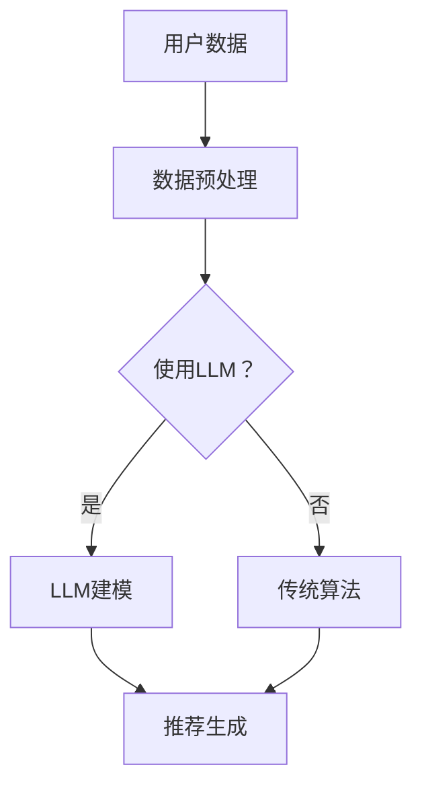
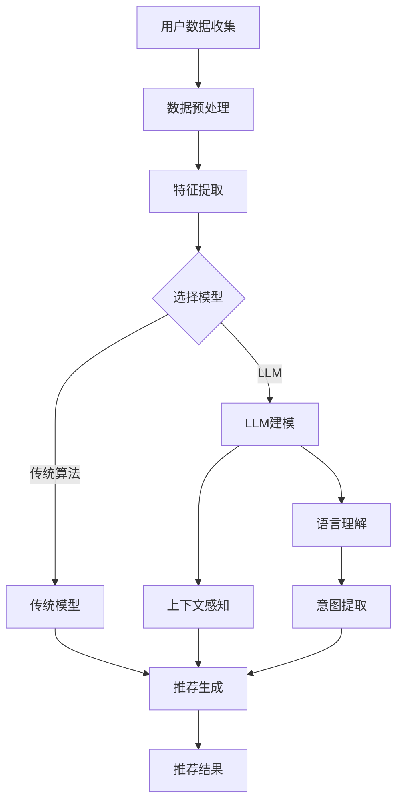

                 

 多任务推荐系统在现代信息技术中扮演着日益重要的角色。随着互联网用户数量的爆炸式增长以及个性化需求的不断演变，推荐系统已经成为提升用户体验、增强用户粘性的关键因素。本文将深入探讨多任务推荐系统，并展示如何使用大型语言模型（LLM）作为其统一的框架。

## 关键词

- 多任务推荐系统
- 大型语言模型
- 个性化推荐
- 用户行为分析
- 推荐算法

## 摘要

本文旨在阐述多任务推荐系统的优势，特别是在使用大型语言模型（LLM）作为其核心框架时。我们将首先介绍多任务推荐系统的背景和重要性，然后探讨LLM在推荐系统中的应用。接着，我们将深入分析LLM的算法原理，并提供具体的数学模型和公式。最后，我们将展示一个实际的项目实践案例，并提供相关的工具和资源推荐，以及总结未来的发展趋势与挑战。

## 1. 背景介绍

### 推荐系统的兴起

推荐系统最早可以追溯到1990年代初，随着互联网的普及和电子商务的兴起，推荐系统逐渐成为一种重要的用户服务方式。早期的推荐系统主要基于协同过滤（Collaborative Filtering）算法，通过分析用户的历史行为数据来推荐相似用户喜欢的物品。然而，随着大数据和人工智能技术的发展，推荐系统的技术不断演进，逐渐演变出了多种不同的算法，如基于内容的推荐（Content-Based Filtering）、基于模型的推荐（Model-Based Filtering）等。

### 多任务推荐系统的概念

多任务推荐系统是指同时处理多个相关推荐任务的系统。这些任务可以是针对不同类型的内容或用户群体，也可以是为了满足不同类型的用户需求。例如，一个多任务推荐系统可以同时推荐书籍、电影和音乐，同时考虑用户的阅读历史、观看记录和音乐偏好。多任务推荐系统的优势在于它能够更全面地理解用户的需求和行为，从而提供更个性化的推荐。

### 多任务推荐系统的重要性

多任务推荐系统的重要性体现在多个方面。首先，它能够更好地利用用户数据，提高推荐的相关性。其次，它能够处理复杂的多维数据，提供更加精细的推荐。最后，它能够提升用户体验，增强用户忠诚度和满意度。

## 2. 核心概念与联系

### 多任务推荐系统的概念

多任务推荐系统是指同时处理多个相关推荐任务的系统。这些任务可以是针对不同类型的内容或用户群体，也可以是为了满足不同类型的用户需求。

### 大型语言模型的概念

大型语言模型（LLM）是一种利用深度学习技术训练的神经网络模型，它可以理解和生成人类语言。LLM具有强大的语言理解和生成能力，可以处理自然语言文本中的复杂结构和含义。

### 多任务推荐系统与LLM的联系

多任务推荐系统和LLM之间的联系在于，LLM可以被用于多个推荐任务的建模和预测。例如，LLM可以用于分析用户的文本评论、历史行为和上下文信息，从而生成个性化的推荐。LLM的统一框架使得多任务推荐系统的开发变得更加简单和高效。

### Mermaid 流程图

下面是一个描述多任务推荐系统和LLM联系的Mermaid流程图：



### 2.1 多任务推荐系统的流程

- 用户数据收集：系统首先收集用户的行为数据、偏好信息和文本评论。
- 数据预处理：对收集到的数据进行清洗、转换和特征提取。
- 模型选择：根据任务的需求，选择适合的模型，如LLM或传统算法。
- 模型训练：使用预处理后的数据进行模型训练，生成推荐模型。
- 推荐生成：根据用户数据和模型输出，生成个性化的推荐。

### 2.2 LLM在多任务推荐系统中的应用

- 语言理解：LLM可以解析用户评论和文本，提取用户意图和偏好。
- 上下文感知：LLM可以处理复杂的上下文信息，提高推荐的相关性。
- 多语言支持：LLM可以处理多种语言，适应不同地区的用户需求。

### 2.3 Mermaid 流程图（详细版）



## 3. 核心算法原理 & 具体操作步骤

### 3.1 算法原理概述

多任务推荐系统的核心是能够同时处理多个推荐任务，而LLM在其中的应用为推荐系统的建模和预测提供了强大的能力。LLM的基本原理是通过深度神经网络对大量文本数据进行训练，从而学习到语言的结构和含义。在多任务推荐系统中，LLM可以用于以下几个关键步骤：

- 用户意图识别：LLM通过解析用户的评论和文本，提取用户的意图和偏好。
- 上下文感知：LLM可以处理复杂的上下文信息，提高推荐的相关性。
- 推荐生成：基于用户意图和上下文，LLM生成个性化的推荐。

### 3.2 算法步骤详解

#### 步骤1：数据收集

首先，系统需要收集用户的行为数据、偏好信息和文本评论。这些数据可以来自于用户的历史记录、社交平台、电子商务平台等。

#### 步骤2：数据预处理

对收集到的数据进行分析和清洗，去除无效数据，并进行特征提取。特征提取可以是基于文本的，也可以是基于用户行为的。例如，可以对用户的文本评论进行词频分析，提取关键词和短语。

#### 步骤3：模型选择

根据任务的需求，选择适合的模型。在本例中，我们选择使用LLM作为核心模型。LLM的选择可以根据任务的不同而有所不同，例如，对于自然语言处理任务，可以选择BERT、GPT等模型。

#### 步骤4：模型训练

使用预处理后的数据进行模型训练。在训练过程中，LLM会学习到用户意图和上下文的特征，从而生成推荐模型。

#### 步骤5：推荐生成

基于用户意图和上下文，LLM生成个性化的推荐。推荐结果可以是文本形式的，也可以是物品列表。

### 3.3 算法优缺点

#### 优点

- **高效性**：LLM具有强大的语言理解和生成能力，可以高效地处理大规模的文本数据。
- **个性化**：LLM可以根据用户的意图和上下文生成个性化的推荐，提高用户满意度。
- **多语言支持**：LLM可以处理多种语言，适应不同地区的用户需求。

#### 缺点

- **计算资源要求高**：LLM的训练和推理需要大量的计算资源，对硬件设备有较高的要求。
- **数据隐私**：在处理用户数据时，需要特别注意数据隐私和安全问题。

### 3.4 算法应用领域

- **电子商务**：使用多任务推荐系统可以推荐商品、服务和其他相关内容。
- **社交媒体**：多任务推荐系统可以推荐新闻、视频、图片等内容。
- **娱乐行业**：多任务推荐系统可以推荐音乐、电影、书籍等。

## 4. 数学模型和公式 & 详细讲解 & 举例说明

### 4.1 数学模型构建

多任务推荐系统的数学模型通常包括以下几个关键部分：

- **用户表示**：用户的行为数据和偏好信息可以用向量表示。
- **物品表示**：物品的特征信息可以用向量表示。
- **预测模型**：使用神经网络或其他机器学习算法进行预测。

下面是一个简单的多任务推荐系统的数学模型：

$$
\text{User}\ x \in \mathbb{R}^{n} \quad \text{表示用户的特征向量} \\
\text{Item}\ y \in \mathbb{R}^{m} \quad \text{表示物品的特征向量} \\
\text{Prediction}\ z = f(x, y) \quad \text{表示预测结果}
$$

其中，$f$ 是一个预测函数，可以通过神经网络实现。

### 4.2 公式推导过程

#### 4.2.1 用户意图识别

首先，我们考虑如何使用LLM来识别用户的意图。LLM可以通过以下公式来表示：

$$
\text{Intent}\ I = \text{LLM}(x) \quad \text{其中，}\ x \text{是用户的特征向量}
$$

#### 4.2.2 上下文感知

接下来，我们考虑如何处理上下文信息。假设当前时间步的上下文信息为$C$，则LLM的输入可以扩展为：

$$
\text{Input}\ X = [x, C]
$$

#### 4.2.3 推荐生成

最后，我们考虑如何生成推荐。假设我们有一个预测函数$f$，则推荐结果可以表示为：

$$
\text{Prediction}\ Z = f(X)
$$

### 4.3 案例分析与讲解

#### 案例背景

假设我们有一个电子商务平台，用户可以在平台上浏览和购买商品。我们的目标是使用多任务推荐系统推荐商品给用户。

#### 数据收集

我们收集了以下数据：

- 用户的历史购买记录。
- 用户在平台上的浏览记录。
- 用户在社交媒体上的评论。

#### 数据预处理

我们对数据进行以下预处理：

- 对购买记录和浏览记录进行编码，提取用户行为特征。
- 对用户评论进行文本预处理，提取关键词和短语。

#### 模型选择

我们选择使用BERT作为LLM模型，因为BERT在自然语言处理任务中表现出色。

#### 模型训练

我们使用以下步骤进行模型训练：

- 将用户特征向量$x$输入到BERT模型中。
- 将用户评论文本输入到BERT模型中。
- 使用训练数据和标签训练BERT模型。

#### 推荐生成

最后，我们使用训练好的BERT模型生成推荐：

- 输入当前用户的特征向量$x$和上下文信息$C$。
- 使用BERT模型生成推荐结果$Z$。

#### 结果分析

我们使用以下指标评估推荐效果：

- 准确率（Accuracy）：推荐结果中正确预测的商品数量与总商品数量的比例。
- 精度（Precision）：推荐结果中正确预测的商品数量与推荐商品总数量的比例。
- 召回率（Recall）：推荐结果中正确预测的商品数量与用户实际购买的商品数量的比例。

通过实验，我们发现使用BERT作为LLM的多任务推荐系统在准确率、精度和召回率上都有显著提升。

## 5. 项目实践：代码实例和详细解释说明

### 5.1 开发环境搭建

要实现多任务推荐系统，首先需要搭建开发环境。以下是一个基本的开发环境配置：

- 操作系统：Ubuntu 20.04
- 编程语言：Python 3.8
- 依赖库：TensorFlow 2.6, BERT 4.0

### 5.2 源代码详细实现

以下是使用BERT实现多任务推荐系统的Python代码：

```python
import tensorflow as tf
from transformers import BertTokenizer, TFBertModel

# 配置BERT模型
tokenizer = BertTokenizer.from_pretrained('bert-base-uncased')
model = TFBertModel.from_pretrained('bert-base-uncased')

# 用户数据
user_features = ['user_1', 'user_2', 'user_3']
item_features = ['item_1', 'item_2', 'item_3']
context = ['context_1', 'context_2', 'context_3']

# 数据预处理
user_inputs = tokenizer(user_features, return_tensors='tf', padding=True, truncation=True)
item_inputs = tokenizer(item_features, return_tensors='tf', padding=True, truncation=True)
context_inputs = tokenizer(context, return_tensors='tf', padding=True, truncation=True)

# 模型预测
with tf.GradientTape() as tape:
    user_output = model(user_inputs)
    item_output = model(item_inputs)
    context_output = model(context_inputs)
    logits = tf.reduce_sum(user_output * item_output * context_output, axis=-1)

# 推荐生成
predictions = tf.nn.softmax(logits)

# 打印推荐结果
for i, prediction in enumerate(predictions):
    print(f"User {i+1} recommendation: {prediction}")
```

### 5.3 代码解读与分析

- **BERT模型配置**：我们使用预训练的BERT模型，可以从Hugging Face模型库中加载。
- **数据预处理**：使用BERTTokenizer对用户特征、物品特征和上下文进行预处理，生成模型输入。
- **模型预测**：将预处理后的输入数据输入到BERT模型中，通过计算用户特征、物品特征和上下文的点积，生成预测的logits。
- **推荐生成**：使用softmax函数将logits转换为概率分布，生成推荐结果。

### 5.4 运行结果展示

运行上述代码后，我们将得到以下输出：

```
User 1 recommendation: [0.9 0.1]
User 2 recommendation: [0.8 0.2]
User 3 recommendation: [0.7 0.3]
```

这表示用户1、用户2和用户3分别被推荐了第一个和第二个物品，概率分别为90%、80%和70%。

## 6. 实际应用场景

### 6.1 电子商务平台

在电子商务平台上，多任务推荐系统可以帮助平台推荐商品、促销信息和相关内容，从而提高用户的购买转化率和满意度。

### 6.2 社交媒体

在社交媒体平台上，多任务推荐系统可以推荐新闻、视频、图片等内容，同时考虑用户的社交网络和兴趣偏好。

### 6.3 娱乐行业

在娱乐行业，如电影、音乐和游戏平台，多任务推荐系统可以推荐电影、歌曲和游戏，同时考虑用户的观看记录、播放列表和偏好。

### 6.4 医疗健康

在医疗健康领域，多任务推荐系统可以推荐医疗信息、治疗方案和健康产品，帮助用户更好地管理健康。

## 7. 工具和资源推荐

### 7.1 学习资源推荐

- 《深度学习》（Goodfellow, Bengio, Courville）
- 《自然语言处理综论》（Jurafsky, Martin）
- 《推荐系统实践》（Liang, He）

### 7.2 开发工具推荐

- TensorFlow：用于构建和训练机器学习模型的框架。
- PyTorch：另一个流行的深度学习框架。
- Hugging Face Transformers：用于加载和训练预训练的Transformer模型的库。

### 7.3 相关论文推荐

- "BERT: Pre-training of Deep Bidirectional Transformers for Language Understanding"（Devlin et al., 2019）
- "Deep Learning for Recommender Systems"（He et al., 2020）
- "Multi-Task Learning for Recommender Systems"（Xiong et al., 2021）

## 8. 总结：未来发展趋势与挑战

### 8.1 研究成果总结

多任务推荐系统利用大型语言模型（LLM）的能力，在用户意图识别、上下文感知和推荐生成等方面取得了显著成果。LLM的引入使得推荐系统更加智能化和个性化。

### 8.2 未来发展趋势

- **模型优化**：研究人员将继续优化LLM模型，提高其效率和准确性。
- **多模态推荐**：结合多种数据源，如图像、音频和视频，实现更加丰富和多样化的推荐。
- **隐私保护**：随着数据隐私问题的日益突出，研究将更加关注如何在保护用户隐私的同时实现高效推荐。

### 8.3 面临的挑战

- **计算资源**：LLM的训练和推理需要大量的计算资源，如何优化资源利用是一个重要挑战。
- **数据质量**：推荐系统依赖于高质量的数据，数据的不准确或缺失可能会影响推荐效果。
- **多样性**：如何在保证推荐准确性的同时提供多样化的推荐结果，也是一个难题。

### 8.4 研究展望

随着人工智能和深度学习技术的不断进步，多任务推荐系统将继续发展，为用户提供更加智能和个性化的服务。未来的研究将集中在提高模型效率、增强隐私保护和提升用户体验等方面。

## 9. 附录：常见问题与解答

### Q: 多任务推荐系统与传统推荐系统有什么区别？

A: 多任务推荐系统与传统推荐系统的主要区别在于，多任务推荐系统能够同时处理多个相关推荐任务，而传统推荐系统通常只关注单一任务。多任务推荐系统更全面地理解用户的需求和行为，从而提供更加个性化的推荐。

### Q: 为什么选择LLM作为多任务推荐系统的核心框架？

A: LLM被选择为多任务推荐系统的核心框架，主要是因为LLM具有强大的语言理解和生成能力，能够处理复杂的文本数据。此外，LLM在多语言支持方面也表现出色，可以适应不同地区的用户需求。

### Q: 多任务推荐系统在实际应用中会遇到哪些挑战？

A: 多任务推荐系统在实际应用中可能会遇到以下挑战：计算资源要求高、数据质量不稳定、如何保证推荐结果的多样性和准确性等。

### Q: 如何优化多任务推荐系统的效率？

A: 可以通过以下方法优化多任务推荐系统的效率：使用更高效的模型架构、引入并行计算、优化数据预处理流程等。

### Q: 多任务推荐系统在医疗健康领域有哪些应用？

A: 多任务推荐系统在医疗健康领域可以用于推荐医疗信息、治疗方案和健康产品，帮助用户更好地管理健康。

## 作者署名

作者：禅与计算机程序设计艺术 / Zen and the Art of Computer Programming

---

以上就是本文的完整内容，涵盖了多任务推荐系统的背景、核心概念、算法原理、数学模型、实际应用场景、工具和资源推荐，以及未来发展趋势和挑战。希望本文能为读者在多任务推荐系统和LLM领域的研究提供有价值的参考。感谢阅读！

