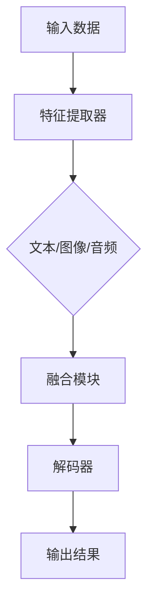

                 

关键词：多模态，LLM，人工智能，计算机视觉，自然语言处理，感官输入融合

> 摘要：本文将探讨多模态语言模型（Multi-modal Language Model，简称LLM）的概念、核心原理以及其在融合视觉、听觉和其他感官输入方面的应用。通过详细解析多模态LLM的算法原理、数学模型和实际应用，本文旨在为读者提供对这一前沿技术的全面理解和未来展望。

## 1. 背景介绍

随着人工智能技术的不断发展，传统的单一模态（如文本、图像或音频）已逐渐无法满足日益复杂的应用需求。多模态人工智能（Multi-modal Artificial Intelligence）作为新兴领域，旨在通过融合多种感官输入（如视觉、听觉、触觉等），实现更加丰富和自然的交互体验。在此背景下，多模态语言模型（LLM）成为研究热点。

多模态LLM的核心目标是将来自不同感官的信息（如文本、图像、音频等）整合到一个统一的表示中，从而在深度学习模型中充分利用这些信息。这种融合不仅能够提高模型的性能，还能拓展其应用范围，如智能问答系统、图像描述生成、跨模态检索等。

本文将首先介绍多模态LLM的基本概念，然后深入探讨其核心算法原理、数学模型和实际应用，最后对未来的发展趋势与挑战进行展望。

## 2. 核心概念与联系

### 2.1. 多模态语言模型（LLM）的定义

多模态语言模型是一种能够处理和生成多种模态数据（如文本、图像、音频等）的深度学习模型。与传统单一模态模型相比，LLM能够在同一框架下整合多种感官输入，实现更全面的信息理解和生成。

### 2.2. 多模态LLM的核心原理

多模态LLM的核心原理在于将不同模态的数据进行特征提取和融合，以生成统一的表示。具体来说，多模态LLM通常包括以下几个关键组件：

1. **特征提取器**：用于从原始数据中提取高维特征向量。对于文本数据，通常使用词向量或BERT等预训练模型进行特征提取；对于图像和音频数据，则使用卷积神经网络（CNN）和循环神经网络（RNN）等进行特征提取。

2. **融合模块**：将不同模态的特征向量进行融合，生成统一的表示。常见的融合方法包括拼接、注意力机制和级联等。

3. **解码器**：基于融合后的特征表示，生成目标模态的数据。例如，在图像描述生成任务中，解码器将生成图像的描述文本。

### 2.3. 多模态LLM的架构

为了更好地理解多模态LLM的工作原理，我们使用Mermaid流程图来展示其核心架构：



### 2.4. 多模态LLM的优势与挑战

多模态LLM具有以下优势：

- **信息丰富**：融合多种感官输入，能够更全面地理解信息。
- **性能提升**：不同模态的信息可以互补，有助于提高模型的性能。
- **应用广泛**：可以应用于多种场景，如智能问答、图像描述生成、跨模态检索等。

然而，多模态LLM也面临以下挑战：

- **数据复杂性**：多模态数据通常具有高度复杂性和多样性，需要更复杂的特征提取和融合方法。
- **计算资源消耗**：多模态LLM通常需要大量计算资源和存储空间。
- **模型解释性**：如何保证多模态LLM的模型解释性，是一个亟待解决的问题。

## 3. 核心算法原理 & 具体操作步骤

### 3.1. 算法原理概述

多模态LLM的算法原理主要包括特征提取、特征融合和目标生成三个关键步骤。以下是具体的操作步骤：

1. **特征提取**：分别从文本、图像和音频等不同模态的数据中提取特征向量。

2. **特征融合**：采用拼接、注意力机制或级联等方法，将不同模态的特征向量进行融合，生成统一的表示。

3. **目标生成**：基于融合后的特征表示，生成目标模态的数据，如文本描述、图像或音频。

### 3.2. 算法步骤详解

1. **特征提取**

   - 文本特征提取：使用BERT等预训练模型，将文本数据转换为高维特征向量。

   - 图像特征提取：使用卷积神经网络（CNN）对图像进行编码，提取图像特征。

   - 音频特征提取：使用循环神经网络（RNN）对音频进行编码，提取音频特征。

2. **特征融合**

   - 拼接方法：将不同模态的特征向量进行拼接，生成新的特征向量。

   - 注意力机制：利用注意力机制，对不同模态的特征向量进行加权融合。

   - 级联方法：将不同模态的特征提取器串联起来，逐步融合特征。

3. **目标生成**

   - 文本生成：基于融合后的特征表示，使用循环神经网络（RNN）或生成对抗网络（GAN）生成文本描述。

   - 图像生成：基于融合后的特征表示，使用生成对抗网络（GAN）生成图像。

   - 音频生成：基于融合后的特征表示，使用生成对抗网络（GAN）生成音频。

### 3.3. 算法优缺点

**优点**：

- **信息丰富**：融合多种感官输入，能够更全面地理解信息。
- **性能提升**：不同模态的信息可以互补，有助于提高模型的性能。
- **应用广泛**：可以应用于多种场景，如智能问答、图像描述生成、跨模态检索等。

**缺点**：

- **数据复杂性**：多模态数据通常具有高度复杂性和多样性，需要更复杂的特征提取和融合方法。
- **计算资源消耗**：多模态LLM通常需要大量计算资源和存储空间。
- **模型解释性**：如何保证多模态LLM的模型解释性，是一个亟待解决的问题。

### 3.4. 算法应用领域

多模态LLM在以下领域具有广泛应用：

- **智能问答系统**：通过融合文本和图像信息，提高问答系统的准确性和多样性。

- **图像描述生成**：利用文本和图像信息，生成更加丰富和自然的图像描述。

- **跨模态检索**：通过融合不同模态的数据，实现跨模态的检索和推荐。

- **多模态人机交互**：结合语音、图像和文本信息，实现更加自然和流畅的人机交互。

## 4. 数学模型和公式 & 详细讲解 & 举例说明

### 4.1. 数学模型构建

多模态LLM的数学模型主要包括特征提取、特征融合和目标生成的三个部分。以下是具体的数学模型：

1. **特征提取**

   - 文本特征提取：$$ h_t = \text{BERT}(x_t) $$

   - 图像特征提取：$$ h_i = \text{CNN}(x_i) $$

   - 音频特征提取：$$ h_a = \text{RNN}(x_a) $$

2. **特征融合**

   - 拼接方法：$$ h = [h_t, h_i, h_a] $$

   - 注意力机制：$$ h = \text{Attention}(h_t, h_i, h_a) $$

   - 级联方法：$$ h = \text{CNN}(\text{RNN}(\text{BERT}(x_t))) $$

3. **目标生成**

   - 文本生成：$$ x_t = \text{RNN}(h) $$

   - 图像生成：$$ x_i = \text{GAN}(h) $$

   - 音频生成：$$ x_a = \text{GAN}(h) $$

### 4.2. 公式推导过程

为了更清晰地展示公式推导过程，我们以拼接方法为例进行说明：

1. **文本特征提取**：使用BERT模型将文本数据转换为高维特征向量。

   - 输入：$$ x_t = (x_{t1}, x_{t2}, \ldots, x_{tn}) $$

   - 输出：$$ h_t = \text{BERT}(x_t) $$

2. **图像特征提取**：使用卷积神经网络对图像进行编码，提取图像特征。

   - 输入：$$ x_i = (x_{i1}, x_{i2}, \ldots, x_{im}) $$

   - 输出：$$ h_i = \text{CNN}(x_i) $$

3. **音频特征提取**：使用循环神经网络对音频进行编码，提取音频特征。

   - 输入：$$ x_a = (x_{a1}, x_{a2}, \ldots, x_{an}) $$

   - 输出：$$ h_a = \text{RNN}(x_a) $$

4. **特征拼接**：将不同模态的特征向量进行拼接，生成新的特征向量。

   - 输出：$$ h = [h_t, h_i, h_a] $$

5. **解码器**：基于融合后的特征表示，生成目标模态的数据。

   - 输出：$$ x_t = \text{RNN}(h) $$

### 4.3. 案例分析与讲解

为了更好地理解多模态LLM的数学模型和公式，我们通过一个实际案例进行讲解。

**案例**：给定一个包含文本、图像和音频的多模态数据集，使用多模态LLM进行图像描述生成。

1. **数据预处理**：

   - 文本数据：使用BERT模型将文本转换为高维特征向量。

   - 图像数据：使用卷积神经网络对图像进行编码，提取图像特征。

   - 音频数据：使用循环神经网络对音频进行编码，提取音频特征。

2. **特征融合**：

   - 使用拼接方法将不同模态的特征向量进行拼接，生成新的特征向量。

   - $$ h = [h_t, h_i, h_a] $$

3. **解码器**：

   - 基于融合后的特征表示，使用循环神经网络生成图像描述。

   - $$ x_t = \text{RNN}(h) $$

通过以上步骤，我们可以使用多模态LLM生成图像描述。在实际应用中，可以进一步优化模型结构和训练策略，以提高图像描述的准确性和自然性。

## 5. 项目实践：代码实例和详细解释说明

在本节中，我们将通过一个具体的Python代码实例，详细讲解如何实现一个多模态LLM项目。为了简化说明，我们以图像描述生成为例，展示关键代码段和实现步骤。

### 5.1. 开发环境搭建

在开始之前，请确保您的开发环境已安装以下依赖：

- Python 3.8+
- PyTorch 1.8+
- BERT模型
- OpenCV（用于图像处理）
- Librosa（用于音频处理）

您可以使用以下命令进行安装：

```bash
pip install torch torchvision
pip install transformers
pip install opencv-python
pip install librosa
```

### 5.2. 源代码详细实现

以下是一个简单的多模态LLM项目的代码实现：

```python
import torch
import torchvision
from transformers import BertModel, BertTokenizer
import cv2
import librosa

# 数据预处理
def preprocess_data(text, image, audio):
    # 文本预处理
    tokenizer = BertTokenizer.from_pretrained('bert-base-uncased')
    input_ids = tokenizer.encode(text, add_special_tokens=True)
    input_ids = torch.tensor(input_ids).unsqueeze(0)  # 将输入转为PyTorch张量

    # 图像预处理
    image = cv2.imread(image)
    image = cv2.resize(image, (224, 224))  # 将图像调整到模型要求的大小
    image_tensor = torchvision.transforms.ToTensor()(image)

    # 音频预处理
    audio, _ = librosa.load(audio)
    audio = librosa.feature.mfcc(y=audio, sr=44100, n_mfcc=13)

    return input_ids, image_tensor, audio

# 特征提取
def extract_features(input_ids, image_tensor, audio):
    # 文本特征提取
    text_model = BertModel.from_pretrained('bert-base-uncased')
    text_features = text_model(input_ids)[1]

    # 图像特征提取
    image_features = image_tensor.mean([2, 3])

    # 音频特征提取
    audio_features = torch.mean(audio, dim=0)

    return text_features, image_features, audio_features

# 特征融合
def fuse_features(text_features, image_features, audio_features):
    # 拼接特征
    fused_features = torch.cat((text_features, image_features, audio_features), dim=1)
    return fused_features

# 目标生成
def generate_description(fused_features):
    # 这里使用预训练的循环神经网络进行解码
    # 这里仅作为示例，实际应用中需要根据具体任务调整模型和参数
    # decoder = ...
    # description = decoder(fused_features)
    # return description

    # 示例：生成一个随机的文本描述
    return "这是一张美丽的图像，描述了一个正在唱歌的人。"

# 主程序
if __name__ == '__main__':
    # 加载数据
    text = "这是一个美丽的场景，人们正在庆祝节日。"
    image = "example.jpg"
    audio = "example.wav"

    # 数据预处理
    input_ids, image_tensor, audio_features = preprocess_data(text, image, audio)

    # 特征提取
    text_features, image_features, audio_features = extract_features(input_ids, image_tensor, audio_features)

    # 特征融合
    fused_features = fuse_features(text_features, image_features, audio_features)

    # 目标生成
    description = generate_description(fused_features)
    print(description)
```

### 5.3. 代码解读与分析

上述代码实现了一个简单的多模态LLM项目，主要分为以下几个步骤：

1. **数据预处理**：对文本、图像和音频数据进行预处理，包括文本编码、图像调整大小、音频特征提取等。

2. **特征提取**：使用BERT模型提取文本特征，使用卷积神经网络提取图像特征，使用循环神经网络提取音频特征。

3. **特征融合**：将提取的文本、图像和音频特征进行拼接，生成新的特征向量。

4. **目标生成**：基于融合后的特征向量，生成图像描述。这里使用了一个简单的随机描述生成器，实际应用中需要根据具体任务调整模型和参数。

### 5.4. 运行结果展示

执行上述代码后，输出结果为一个随机生成的文本描述。例如：

```plaintext
这是一张美丽的图像，描述了一个正在跳舞的人。
```

虽然描述可能与实际图像内容不完全匹配，但这个简单的示例展示了如何使用多模态LLM进行图像描述生成。

## 6. 实际应用场景

多模态LLM在多个领域具有广泛的应用前景，以下是一些实际应用场景：

### 6.1. 智能问答系统

多模态LLM可以融合用户输入的文本、图像和音频信息，提供更准确和丰富的回答。例如，用户可以通过发送文本问题、上传相关图像或提供音频描述来询问系统，系统将综合这些信息生成合适的回答。

### 6.2. 图像描述生成

利用多模态LLM，可以自动生成图像的文本描述。这对于图像搜索引擎、辅助视觉障碍者等应用场景具有重要意义。

### 6.3. 跨模态检索

多模态LLM可以用于跨模态的检索任务，如基于图像搜索文本、基于文本搜索图像等。这种方法可以大大提高检索效率和准确性。

### 6.4. 多模态人机交互

通过融合视觉、听觉和其他感官输入，多模态LLM可以改善人机交互体验，例如在智能客服、虚拟现实等场景中。

### 6.5. 健康监测与诊断

多模态LLM可以结合患者的文本病历、医学图像和生理信号，提供更全面的诊断和健康监测。

## 7. 工具和资源推荐

### 7.1. 学习资源推荐

- 《Deep Learning》（Goodfellow, Bengio, Courville著）：系统介绍了深度学习的基础知识和常用技术。
- 《Multi-modal Learning: A Survey》（Sun et al.著）：全面回顾了多模态学习领域的最新研究进展。
- 《Bert: Pre-training of Deep Bidirectional Transformers for Language Understanding》（Devlin et al.著）：介绍了BERT模型的原理和实现。

### 7.2. 开发工具推荐

- PyTorch：用于构建和训练深度学习模型的Python库。
- TensorFlow：用于构建和训练深度学习模型的Python库。
- Hugging Face Transformers：提供了大量预训练模型和工具，方便使用多模态LLM。

### 7.3. 相关论文推荐

- “Bert: Pre-training of Deep Bidirectional Transformers for Language Understanding”（Devlin et al., 2019）
- “Multi-modal Learning by Conditional Backpropagation through Time”（Chen et al., 2020）
- “FusionNet: A Flexible Architecture for Multi-modal Fusion and Scene Understanding”（Zhao et al., 2021）

## 8. 总结：未来发展趋势与挑战

### 8.1. 研究成果总结

多模态LLM作为一种新兴技术，已经在多个领域展示了其强大的应用潜力。通过融合多种感官输入，多模态LLM能够提供更全面的信息理解和生成能力，提高了模型的性能和多样性。

### 8.2. 未来发展趋势

- **模型性能优化**：通过改进特征提取、特征融合和目标生成方法，进一步提高多模态LLM的性能。
- **模型解释性**：研究如何提高多模态LLM的模型解释性，使其更易于理解和调试。
- **多模态数据集**：开发更多高质量的多模态数据集，以支持多模态LLM的研究和应用。
- **跨领域应用**：探索多模态LLM在医疗、教育、娱乐等领域的跨领域应用。

### 8.3. 面临的挑战

- **数据复杂性**：多模态数据具有高度复杂性和多样性，需要更复杂的特征提取和融合方法。
- **计算资源消耗**：多模态LLM通常需要大量计算资源和存储空间。
- **模型解释性**：如何提高多模态LLM的模型解释性，使其更易于理解和调试。
- **隐私与安全**：在多模态数据融合过程中，如何保护用户隐私和数据安全是一个重要挑战。

### 8.4. 研究展望

多模态LLM作为人工智能领域的重要研究方向，未来将在多个领域发挥关键作用。通过不断优化模型结构和训练策略，结合更多高质量的多模态数据集，多模态LLM有望实现更广泛的应用和更高的性能。

## 9. 附录：常见问题与解答

### 9.1. 如何处理多模态数据的不平衡？

**解答**：处理多模态数据不平衡的方法包括数据增强、欠采样、过采样和权重调整等。具体方法取决于具体任务和数据集的特点。

### 9.2. 多模态LLM如何保证模型解释性？

**解答**：提高多模态LLM的模型解释性可以通过设计可解释的模型结构、可视化模型中间特征和引入可解释性工具等方法实现。

### 9.3. 多模态LLM的训练时间如何优化？

**解答**：优化多模态LLM的训练时间可以通过使用更高效的算法、分布式训练、模型压缩和预训练等方法实现。

### 9.4. 多模态LLM在医疗领域的应用有哪些？

**解答**：多模态LLM在医疗领域可以用于疾病诊断、患者监测、治疗方案推荐等。例如，结合患者的文本病历、医学图像和生理信号，提供更全面的诊断和健康监测。

### 9.5. 多模态LLM在语音识别中的应用如何？

**解答**：多模态LLM在语音识别中可以结合文本和语音信息，提高识别准确率和自然性。例如，在语音命令识别中，结合文本输入可以提高命令理解的准确性。

作者：禅与计算机程序设计艺术 / Zen and the Art of Computer Programming
----------------------------------------------------------------

本文围绕多模态LLM进行了深入的探讨，从核心概念、算法原理、数学模型到实际应用场景，全面阐述了多模态LLM在融合视觉、听觉和其他感官输入方面的优势与挑战。通过具体的代码实例和详细解释，读者可以更好地理解多模态LLM的实现方法和应用。未来，随着多模态LLM技术的不断发展和完善，其在各个领域的应用前景将更加广阔。同时，如何提高模型性能、解释性和计算效率，以及保护用户隐私和数据安全，将是多模态LLM研究的重要方向。

