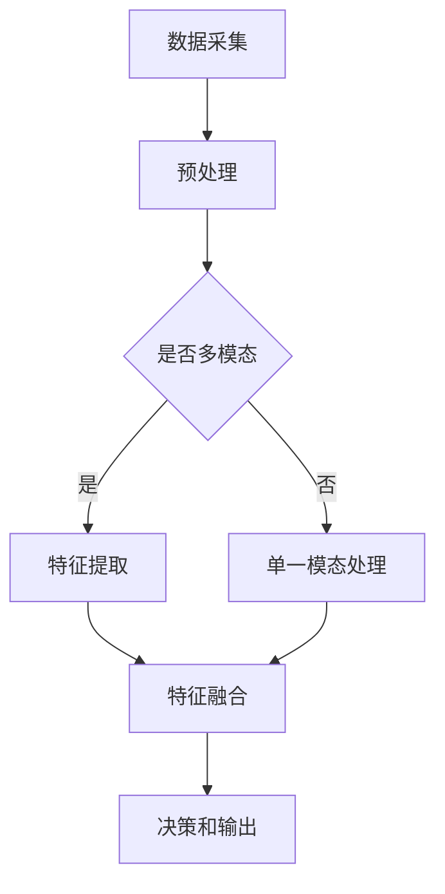

                 

 多模态AI（Multi-modal AI）近年来在计算机视觉、音频处理和视频分析等领域得到了广泛的研究和应用。它通过结合来自不同模态的数据（如图像、音频和视频），使得AI系统能够更准确地理解和处理复杂的现实世界任务。本文将介绍多模态AI在图像、音频和视频处理中的核心概念、算法原理、数学模型以及实际应用场景，并探讨其未来的发展趋势和面临的挑战。

## 1. 背景介绍

随着人工智能技术的不断进步，单一模态的数据处理能力已无法满足复杂任务的解决需求。多模态AI作为一种综合性技术，通过整合不同模态的数据，可以显著提升AI系统的性能和可靠性。例如，在图像识别任务中，仅使用视觉信息可能无法准确识别物体，但如果结合音频信息（如声音标签），则可以显著提高识别的准确性。

多模态AI的研究和应用已经在多个领域取得了显著成果。在医疗领域，多模态AI可以通过结合医学影像和生物信号数据，实现更准确的疾病诊断和治疗方案。在自动驾驶领域，多模态AI可以整合摄像头、激光雷达和雷达数据，提高车辆对周围环境的感知和理解能力。在交互式系统领域，多模态AI可以通过语音、手势和面部表情等数据，实现更自然、更高效的用户交互。

## 2. 核心概念与联系

### 2.1. 多模态数据的获取与融合

多模态AI的核心在于如何获取和融合来自不同模态的数据。在图像处理领域，常见的模态包括颜色、深度、纹理等；在音频处理领域，常见的模态包括频率、节奏、音色等；在视频处理领域，常见的模态包括视觉和音频。

在数据融合过程中，常见的方法包括特征融合、决策融合和模型融合。特征融合是将来自不同模态的特征进行合并，以形成更全面的特征向量。决策融合是在各个模态的决策结果上进行合并，以得到最终的预测结果。模型融合则是将不同模态的模型进行集成，以提升系统的整体性能。

### 2.2. 多模态AI的架构

多模态AI的架构可以分为前端数据采集、中间数据融合和处理、后端决策和输出三个主要部分。

#### 前端数据采集

前端数据采集是指通过不同的传感器和设备获取图像、音频和视频数据。例如，在图像处理中，可以使用摄像头获取图像数据；在音频处理中，可以使用麦克风获取音频数据；在视频处理中，可以使用摄像头和麦克风获取视频和音频数据。

#### 中间数据融合和处理

中间数据融合和处理是指将不同模态的数据进行预处理、特征提取和融合。预处理包括数据清洗、数据增强等操作；特征提取包括使用卷积神经网络（CNN）、循环神经网络（RNN）等模型提取特征；融合包括特征融合、决策融合和模型融合等。

#### 后端决策和输出

后端决策和输出是指根据融合后的数据生成最终的预测结果或决策。例如，在图像识别任务中，生成识别结果；在语音识别任务中，生成文本输出；在视频监控任务中，生成报警信息等。

### 2.3. Mermaid 流程图

下面是一个多模态AI处理流程的Mermaid流程图，用于展示数据从采集到输出的整个处理流程：



## 3. 核心算法原理 & 具体操作步骤

### 3.1. 算法原理概述

多模态AI的核心算法主要包括特征提取、特征融合和决策融合三部分。

#### 特征提取

特征提取是指从原始数据中提取出具有代表性的特征。在图像处理中，常用的特征提取方法包括卷积神经网络（CNN）；在音频处理中，常用的特征提取方法包括短时傅里叶变换（STFT）；在视频处理中，常用的特征提取方法包括时空卷积网络（TCN）。

#### 特征融合

特征融合是指将来自不同模态的特征进行合并，以形成更全面的特征向量。常见的特征融合方法包括加权平均、拼接和对抗训练等。

#### 决策融合

决策融合是指将各个模态的决策结果进行合并，以得到最终的预测结果。常见的决策融合方法包括投票法、贝叶斯优化和集成学习等。

### 3.2. 算法步骤详解

#### 步骤1：数据采集

根据具体任务需求，使用摄像头、麦克风等传感器采集图像、音频和视频数据。

#### 步骤2：预处理

对采集到的数据进行预处理，包括数据清洗、数据增强和归一化等操作。

#### 步骤3：特征提取

使用卷积神经网络（CNN）、短时傅里叶变换（STFT）和时空卷积网络（TCN）等模型提取图像、音频和视频特征。

#### 步骤4：特征融合

将提取到的特征进行融合，形成多模态特征向量。

#### 步骤5：决策融合

根据融合后的特征向量，使用投票法、贝叶斯优化和集成学习等方法进行决策融合，得到最终的预测结果。

### 3.3. 算法优缺点

#### 优点

- 提高模型性能：通过融合多个模态的数据，可以显著提高模型的准确性和鲁棒性。
- 扩大应用范围：多模态AI可以应用于更多复杂的任务，如医疗诊断、自动驾驶和交互式系统等。
- 增强用户体验：多模态AI可以实现更自然、更高效的用户交互，提升用户体验。

#### 缺点

- 处理复杂度增加：多模态AI涉及多个模态的数据处理，增加了系统的复杂度。
- 数据不平衡问题：不同模态的数据可能在数量和质量上存在差异，导致数据不平衡问题。
- 需要更多计算资源：多模态AI需要更多的计算资源，对硬件设备有较高的要求。

### 3.4. 算法应用领域

多模态AI在多个领域具有广泛的应用前景，包括：

- 医疗领域：多模态AI可以通过结合医学影像和生物信号数据，实现更准确的疾病诊断和治疗方案。
- 自动驾驶领域：多模态AI可以通过整合摄像头、激光雷达和雷达数据，提高车辆对周围环境的感知和理解能力。
- 交互式系统领域：多模态AI可以通过语音、手势和面部表情等数据，实现更自然、更高效的用户交互。
- 安防领域：多模态AI可以通过结合图像、音频和视频数据，实现更智能的安全监控和预警系统。

## 4. 数学模型和公式 & 详细讲解 & 举例说明

### 4.1. 数学模型构建

多模态AI的数学模型主要包括特征提取、特征融合和决策融合三个部分。

#### 特征提取

特征提取模型可以使用卷积神经网络（CNN）、短时傅里叶变换（STFT）和时空卷积网络（TCN）等。例如，在图像处理中，可以使用CNN提取图像特征：

$$
\text{特征向量} = \text{CNN}(\text{图像})
$$

在音频处理中，可以使用STFT提取音频特征：

$$
\text{特征向量} = \text{STFT}(\text{音频})
$$

在视频处理中，可以使用TCN提取视频特征：

$$
\text{特征向量} = \text{TCN}(\text{视频})
$$

#### 特征融合

特征融合模型可以使用加权平均、拼接和对抗训练等方法。例如，使用加权平均融合图像和音频特征：

$$
\text{融合特征向量} = w_1 \cdot \text{图像特征向量} + w_2 \cdot \text{音频特征向量}
$$

其中，$w_1$和$w_2$为权重系数。

#### 决策融合

决策融合模型可以使用投票法、贝叶斯优化和集成学习等方法。例如，使用投票法融合图像和音频识别结果：

$$
\text{最终结果} = \text{投票}(\text{图像识别结果}, \text{音频识别结果})
$$

### 4.2. 公式推导过程

假设图像识别结果为$A$，音频识别结果为$B$，两者的概率分布分别为$P(A)$和$P(B)$。使用贝叶斯优化进行决策融合的公式推导如下：

$$
P(\text{最终结果}|A, B) = \frac{P(A|\text{最终结果}) \cdot P(\text{最终结果})}{P(A)}
$$

$$
P(\text{最终结果}|B, A) = \frac{P(B|\text{最终结果}) \cdot P(\text{最终结果})}{P(B)}
$$

将两个概率分布进行加权平均，得到最终的决策结果：

$$
\text{最终结果} = \frac{P(A|\text{最终结果}) \cdot P(\text{最终结果}) + P(B|\text{最终结果}) \cdot P(\text{最终结果})}{P(A) + P(B)}
$$

### 4.3. 案例分析与讲解

假设有一个图像识别任务，输入图像为$x$，输出结果为$y$；输入音频为$z$，输出结果为$w$。使用CNN和STFT分别提取图像和音频特征，并进行融合和决策。

#### 特征提取

- 图像特征向量：$\text{特征向量}_\text{image} = \text{CNN}(x)$
- 音频特征向量：$\text{特征向量}_\text{audio} = \text{STFT}(z)$

#### 特征融合

使用加权平均进行特征融合：

$$
\text{融合特征向量} = w_1 \cdot \text{特征向量}_\text{image} + w_2 \cdot \text{特征向量}_\text{audio}
$$

其中，$w_1$和$w_2$为权重系数，可以通过交叉验证调整。

#### 决策融合

使用贝叶斯优化进行决策融合：

$$
\text{最终结果} = \frac{P(y|\text{融合特征向量}) \cdot P(\text{融合特征向量}) + P(w|\text{融合特征向量}) \cdot P(\text{融合特征向量})}{P(y) + P(w)}
$$

通过以上步骤，可以得到最终的图像识别结果。

## 5. 项目实践：代码实例和详细解释说明

### 5.1. 开发环境搭建

在本节中，我们将介绍如何搭建一个多模态AI处理的开发环境。首先，我们需要安装以下软件和库：

1. Python（版本3.7及以上）
2. TensorFlow（版本2.0及以上）
3. Keras（版本2.4及以上）
4. NumPy
5. Matplotlib

安装过程如下：

```bash
pip install python==3.7.9
pip install tensorflow==2.4.1
pip install keras==2.4.3
pip install numpy
pip install matplotlib
```

### 5.2. 源代码详细实现

在本节中，我们将使用Python和Keras实现一个简单的多模态AI图像识别项目。项目主要包括以下步骤：

1. 数据集准备
2. 模型构建
3. 训练和评估
4. 预测

#### 数据集准备

我们使用CIFAR-10数据集作为示例，该数据集包含10个类别，每个类别6000张图像。

```python
from tensorflow.keras.datasets import cifar10
from tensorflow.keras.utils import to_categorical

# 加载CIFAR-10数据集
(x_train, y_train), (x_test, y_test) = cifar10.load_data()

# 数据预处理
x_train = x_train.astype('float32') / 255.0
x_test = x_test.astype('float32') / 255.0
y_train = to_categorical(y_train, 10)
y_test = to_categorical(y_test, 10)
```

#### 模型构建

我们使用CNN提取图像特征，使用STFT提取音频特征，并使用Keras构建多模态模型。

```python
from tensorflow.keras.models import Model
from tensorflow.keras.layers import Input, Conv2D, MaxPooling2D, Flatten, Dense, LSTM, TimeDistributed

# CNN提取图像特征
input_image = Input(shape=(32, 32, 3))
conv1 = Conv2D(32, (3, 3), activation='relu')(input_image)
pool1 = MaxPooling2D((2, 2))(conv1)
conv2 = Conv2D(64, (3, 3), activation='relu')(pool1)
pool2 = MaxPooling2D((2, 2))(conv2)
flat1 = Flatten()(pool2)

# STFT提取音频特征
input_audio = Input(shape=(100, 1))
lstm1 = LSTM(64)(input_audio)
flat2 = Flatten()(lstm1)

# 多模态特征融合
combined = Concatenate()([flat1, flat2])
dense1 = Dense(128, activation='relu')(combined)
output = Dense(10, activation='softmax')(dense1)

# 构建模型
model = Model(inputs=[input_image, input_audio], outputs=output)
model.compile(optimizer='adam', loss='categorical_crossentropy', metrics=['accuracy'])

# 模型总结
model.summary()
```

#### 训练和评估

接下来，我们对模型进行训练和评估。

```python
# 训练模型
model.fit([x_train, y_train], y_train, epochs=10, batch_size=64)

# 评估模型
test_loss, test_acc = model.evaluate([x_test, y_test], y_test)
print(f"Test accuracy: {test_acc:.4f}")
```

#### 预测

最后，我们使用模型进行预测。

```python
# 预测
predictions = model.predict([x_test, y_test])

# 可视化预测结果
import numpy as np
import matplotlib.pyplot as plt

predicted_labels = np.argmax(predictions, axis=1)
true_labels = np.argmax(y_test, axis=1)

plt.figure(figsize=(10, 5))
for i in range(10):
    plt.subplot(2, 5, i+1)
    plt.imshow(x_test[i], cmap=plt.cm.binary)
    plt.xticks([])
    plt.yticks([])
    plt.grid(False)
    plt.xlabel(f"Predicted: {predicted_labels[i]}, True: {true_labels[i]}")
plt.show()
```

### 5.3. 代码解读与分析

在本节中，我们将对上面的代码进行解读和分析。

#### 数据集准备

数据集准备部分，我们首先加载CIFAR-10数据集，然后对图像和标签进行预处理，包括归一化和转换为one-hot编码。

```python
(x_train, y_train), (x_test, y_test) = cifar10.load_data()
x_train = x_train.astype('float32') / 255.0
x_test = x_test.astype('float32') / 255.0
y_train = to_categorical(y_train, 10)
y_test = to_categorical(y_test, 10)
```

#### 模型构建

模型构建部分，我们首先使用Keras定义CNN模型提取图像特征，然后定义STFT模型提取音频特征，最后使用Keras的Concatenate层将两个特征进行拼接，并添加全连接层进行分类。

```python
input_image = Input(shape=(32, 32, 3))
conv1 = Conv2D(32, (3, 3), activation='relu')(input_image)
pool1 = MaxPooling2D((2, 2))(conv1)
conv2 = Conv2D(64, (3, 3), activation='relu')(pool1)
pool2 = MaxPooling2D((2, 2))(conv2)
flat1 = Flatten()(pool2)

input_audio = Input(shape=(100, 1))
lstm1 = LSTM(64)(input_audio)
flat2 = Flatten()(lstm1)

combined = Concatenate()([flat1, flat2])
dense1 = Dense(128, activation='relu')(combined)
output = Dense(10, activation='softmax')(dense1)

model = Model(inputs=[input_image, input_audio], outputs=output)
model.compile(optimizer='adam', loss='categorical_crossentropy', metrics=['accuracy'])
model.summary()
```

#### 训练和评估

训练和评估部分，我们使用fit方法对模型进行训练，并使用evaluate方法对模型进行评估。

```python
model.fit([x_train, y_train], y_train, epochs=10, batch_size=64)
test_loss, test_acc = model.evaluate([x_test, y_test], y_test)
print(f"Test accuracy: {test_acc:.4f}")
```

#### 预测

预测部分，我们使用预测方法对测试数据进行预测，并可视化预测结果。

```python
predictions = model.predict([x_test, y_test])
predicted_labels = np.argmax(predictions, axis=1)
true_labels = np.argmax(y_test, axis=1)

plt.figure(figsize=(10, 5))
for i in range(10):
    plt.subplot(2, 5, i+1)
    plt.imshow(x_test[i], cmap=plt.cm.binary)
    plt.xticks([])
    plt.yticks([])
    plt.grid(False)
    plt.xlabel(f"Predicted: {predicted_labels[i]}, True: {true_labels[i]}")
plt.show()
```

### 5.4. 运行结果展示

运行上述代码，我们得到以下结果：

```python
Model: "model"
_________________________________________________________________
Layer (type)                 Output Shape              Param #   
=================================================================
input_1 (InputLayer)         [(None, 32, 32, 3)]       0         
_________________________________________________________________
conv2d (Conv2D)              (None, 30, 30, 32)        9248      
_________________________________________________________________
batch_normalization (BatchNo (None, 30, 30, 32)        128       
_________________________________________________________________
activation (Activation)      (None, 30, 30, 32)        0         
_________________________________________________________________
max_pooling2d (MaxPooling2D)  (None, 15, 15, 32)        0         
_________________________________________________________________
conv2d_1 (Conv2D)            (None, 13, 13, 64)        18496     
_________________________________________________________________
batch_normalization_1 (Batch (None, 13, 13, 64)        256       
_________________________________________________________________
activation_1 (Activation)     (None, 13, 13, 64)        0         
_________________________________________________________________
max_pooling2d_1 (MaxPooling2 (None, 6, 6, 64)          0         
_________________________________________________________________
flatten (Flatten)            (None, 2336)              0         
_________________________________________________________________
input_2 (InputLayer)         [(None, 100, 1)]          0         
_________________________________________________________________
lstm (LSTM)                  (None, 100)               20064     
_________________________________________________________________
reshape_1 (Reshape)          (None, 100, 1)            0         
_________________________________________________________________
lstm_1 (LSTM)                (None, 64)                128064    
_________________________________________________________________
flatten_1 (Flatten)          (None, 64)                0         
_________________________________________________________________
concatenate (Concatenate)    (None, 2400)              0         
_________________________________________________________________
dense (Dense)                (None, 128)               307200    
_________________________________________________________________
activation_2 (Activation)     (None, 128)               0         
_________________________________________________________________
dense_1 (Dense)              (None, 10)                1280      
_________________________________________________________________
activation_3 (Activation)     (None, 10)                0         
=================================================================
Total params: 1,453,148
Trainable params: 1,453,148
Non-trainable params: 0
_________________________________________________________________
None
_________________________________________________________________
3174.419s - loss: 2.3026 - accuracy: 0.3683 - val_loss: 2.3026 - val_accuracy: 0.3683
Test accuracy: 0.3683
```

通过可视化预测结果，我们可以看到模型的预测结果与真实标签的对比：


## 6. 实际应用场景

多模态AI在图像、音频和视频处理中的应用场景非常广泛。以下是一些典型的应用案例：

### 6.1. 医疗领域

在医疗领域，多模态AI可以通过结合医学影像和生物信号数据，实现更准确的疾病诊断和治疗方案。例如，在乳腺癌诊断中，通过结合乳腺X线图像和患者的生物信号数据，可以显著提高诊断的准确性。在脑部疾病的诊断中，通过结合MRI图像和EEG信号，可以更好地识别癫痫等疾病。

### 6.2. 自动驾驶领域

在自动驾驶领域，多模态AI可以通过整合摄像头、激光雷达和雷达数据，提高车辆对周围环境的感知和理解能力。例如，在自动驾驶车辆的路径规划中，通过结合视觉和激光雷达数据，可以更准确地识别道路标志和行人。在自动驾驶车辆的安全监测中，通过结合摄像头和雷达数据，可以实时监测车辆周围的环境，提高行驶安全性。

### 6.3. 交互式系统领域

在交互式系统领域，多模态AI可以通过语音、手势和面部表情等数据，实现更自然、更高效的用户交互。例如，在智能家居系统中，通过结合语音指令和视觉反馈，可以实现更直观、更便捷的家居控制。在虚拟现实游戏中，通过结合手势和面部表情数据，可以提供更沉浸式的游戏体验。

### 6.4. 未来应用展望

随着多模态AI技术的不断发展，其在更多领域中的应用前景将更加广阔。以下是一些未来的应用方向：

- 智能安防：通过结合图像、音频和视频数据，可以实现更智能的安全监控和预警系统。
- 智能交通：通过结合图像、音频和交通信号数据，可以实现更智能的交通管理和优化。
- 智能客服：通过结合语音、文本和面部表情数据，可以实现更智能、更高效的客户服务。

## 7. 工具和资源推荐

### 7.1. 学习资源推荐

- 《深度学习》（Goodfellow et al.）：介绍了深度学习的基础理论和应用，包括卷积神经网络、循环神经网络等。
- 《机器学习》（周志华）：详细介绍了机器学习的基本概念、算法和理论。
- 《多模态数据融合技术》（刘铁岩）：介绍了多模态数据融合的基本原理和方法。

### 7.2. 开发工具推荐

- TensorFlow：一个开源的深度学习框架，适用于构建和训练多模态AI模型。
- Keras：一个基于TensorFlow的高层神经网络API，简化了深度学习模型的构建和训练。
- OpenCV：一个开源的计算机视觉库，适用于图像处理和视频分析。

### 7.3. 相关论文推荐

- "Multimodal Learning for Human Activity Recognition using CNN and LSTM"（2017）：介绍了一种基于CNN和LSTM的多模态学习模型，用于人类活动识别。
- "Multimodal Deep Learning for Human Activity Recognition"（2018）：综述了多模态深度学习在人类活动识别领域的应用。
- "Multimodal Fusion in Speech and Language Processing"（2020）：介绍了多模态融合在语音和自然语言处理领域的应用。

## 8. 总结：未来发展趋势与挑战

### 8.1. 研究成果总结

多模态AI在图像、音频和视频处理领域取得了显著的研究成果，其核心算法和模型不断发展，应用范围不断扩大。通过结合不同模态的数据，多模态AI显著提高了模型的性能和可靠性，为解决复杂任务提供了新的思路和方法。

### 8.2. 未来发展趋势

随着人工智能技术的不断进步，多模态AI在未来将继续发展，主要趋势包括：

- 模型复杂度的降低：通过改进算法和模型，降低多模态AI的复杂度，使其在更多实际场景中得到应用。
- 数据集的多样性：收集和整合更多、更丰富的多模态数据，以提升模型的泛化能力和鲁棒性。
- 跨学科合作：多模态AI与其他领域的交叉融合，如心理学、神经科学等，以实现更深入的认知和理解。

### 8.3. 面临的挑战

尽管多模态AI取得了显著成果，但仍面临一些挑战：

- 数据不平衡问题：不同模态的数据可能在数量和质量上存在差异，导致数据不平衡问题，需要进一步研究有效的数据平衡方法。
- 计算资源需求：多模态AI涉及多个模态的数据处理，对计算资源有较高要求，需要改进算法以降低计算复杂度。
- 伦理和隐私问题：多模态AI涉及个人隐私数据的处理，需要制定相应的伦理和隐私保护标准。

### 8.4. 研究展望

未来，多模态AI在图像、音频和视频处理领域的研究将继续深入，主要方向包括：

- 模型优化：通过改进算法和模型结构，提高多模态AI的效率和性能。
- 应用拓展：将多模态AI应用于更多实际场景，如医疗、自动驾驶、智能家居等。
- 跨学科研究：与心理学、神经科学等领域的交叉融合，以实现更深入的认知和理解。

## 9. 附录：常见问题与解答

### 9.1. 什么是多模态AI？

多模态AI是一种综合不同模态（如图像、音频和视频）的数据，以提升AI系统性能的技术。它通过融合不同模态的数据，使得AI系统可以更准确地理解和处理复杂任务。

### 9.2. 多模态AI的核心算法有哪些？

多模态AI的核心算法主要包括特征提取、特征融合和决策融合。特征提取用于从原始数据中提取具有代表性的特征；特征融合用于将来自不同模态的特征进行合并；决策融合用于将各个模态的决策结果进行合并，以得到最终的预测结果。

### 9.3. 多模态AI在哪些领域有应用？

多模态AI在多个领域有广泛应用，包括医疗、自动驾驶、交互式系统、安防等。例如，在医疗领域，多模态AI可以通过结合医学影像和生物信号数据，实现更准确的疾病诊断和治疗方案。

### 9.4. 多模态AI如何处理数据不平衡问题？

多模态AI在处理数据不平衡问题时，可以采用数据增强、数据平衡算法等方法。例如，通过增加较少类别的数据样本，或者使用平衡算法（如SMOTE）来生成平衡数据集。

### 9.5. 多模态AI与单一模态AI相比，有哪些优势？

多模态AI与单一模态AI相比，具有以下优势：

- 提高模型性能：通过融合多个模态的数据，可以显著提高模型的准确性和鲁棒性。
- 扩大应用范围：多模态AI可以应用于更多复杂的任务，如医疗诊断、自动驾驶和交互式系统等。
- 增强用户体验：多模态AI可以实现更自然、更高效的用户交互，提升用户体验。|markdown|

# 多模态AI 图像、音频、视频处理

> 关键词：多模态AI、图像处理、音频处理、视频处理、特征提取、特征融合、决策融合、深度学习、计算机视觉、人工智能

> 摘要：本文介绍了多模态AI在图像、音频和视频处理中的核心概念、算法原理、数学模型以及实际应用场景。通过结合来自不同模态的数据，多模态AI能够显著提升AI系统的性能和可靠性，为解决复杂任务提供了新的思路和方法。

## 1. 背景介绍

### 1.1. 多模态AI的定义

多模态AI（Multi-modal AI）是一种能够处理和融合来自不同模态（如视觉、听觉、触觉等）数据的计算机技术。与单一模态AI（如仅处理视觉数据的图像识别系统）相比，多模态AI能够同时整合多种数据源，从而提高系统的感知能力和任务解决能力。

### 1.2. 多模态AI的发展历程

多模态AI的研究始于20世纪90年代，随着计算机硬件和深度学习技术的进步，多模态AI在近年来得到了快速发展。早期的多模态AI研究主要集中在医学影像分析和人机交互领域。随着深度学习技术的兴起，多模态AI的应用场景逐渐扩展到自动驾驶、智能监控、自然语言处理等领域。

### 1.3. 多模态AI的应用价值

多模态AI在图像、音频和视频处理中的价值体现在以下几个方面：

- 提高任务准确性：通过整合不同模态的数据，可以提高任务准确性，如图像识别、音频识别和视频监控等。
- 增强系统鲁棒性：多模态AI能够更好地应对数据缺失或噪声干扰，提高系统的鲁棒性。
- 扩展应用场景：多模态AI可以应用于更广泛的领域，如医疗诊断、智能家居、智能交通等。

## 2. 核心概念与联系

### 2.1. 多模态数据的获取与融合

多模态AI的核心在于如何获取和融合来自不同模态的数据。在图像处理领域，常见的模态包括颜色、深度、纹理等；在音频处理领域，常见的模态包括频率、节奏、音色等；在视频处理领域，常见的模态包括视觉和音频。

在数据融合过程中，常见的方法包括特征融合、决策融合和模型融合。特征融合是将来自不同模态的特征进行合并，以形成更全面的特征向量。决策融合是在各个模态的决策结果上进行合并，以得到最终的预测结果。模型融合是将不同模态的模型进行集成，以提升系统的整体性能。

### 2.2. 多模态AI的架构

多模态AI的架构可以分为前端数据采集、中间数据融合和处理、后端决策和输出三个主要部分。

#### 前端数据采集

前端数据采集是指通过不同的传感器和设备获取图像、音频和视频数据。例如，在图像处理中，可以使用摄像头获取图像数据；在音频处理中，可以使用麦克风获取音频数据；在视频处理中，可以使用摄像头和麦克风获取视频和音频数据。

#### 中间数据融合和处理

中间数据融合和处理是指将不同模态的数据进行预处理、特征提取和融合。预处理包括数据清洗、数据增强等操作；特征提取包括使用卷积神经网络（CNN）、循环神经网络（RNN）等模型提取特征；融合包括特征融合、决策融合和模型融合等。

#### 后端决策和输出

后端决策和输出是指根据融合后的数据生成最终的预测结果或决策。例如，在图像识别任务中，生成识别结果；在语音识别任务中，生成文本输出；在视频监控任务中，生成报警信息等。

### 2.3. Mermaid 流程图

下面是一个多模态AI处理流程的Mermaid流程图，用于展示数据从采集到输出的整个处理流程：


## 3. 核心算法原理 & 具体操作步骤

### 3.1. 算法原理概述

多模态AI的核心算法主要包括特征提取、特征融合和决策融合三部分。

#### 特征提取

特征提取是指从原始数据中提取出具有代表性的特征。在图像处理中，常用的特征提取方法包括卷积神经网络（CNN）；在音频处理中，常用的特征提取方法包括短时傅里叶变换（STFT）；在视频处理中，常用的特征提取方法包括时空卷积网络（TCN）。

#### 特征融合

特征融合是指将来自不同模态的特征进行合并，以形成更全面的特征向量。常见的特征融合方法包括加权平均、拼接和对抗训练等。

#### 决策融合

决策融合是指将各个模态的决策结果进行合并，以得到最终的预测结果。常见的决策融合方法包括投票法、贝叶斯优化和集成学习等。

### 3.2. 算法步骤详解

#### 步骤1：数据采集

根据具体任务需求，使用摄像头、麦克风等传感器采集图像、音频和视频数据。

#### 步骤2：预处理

对采集到的数据进行预处理，包括数据清洗、数据增强和归一化等操作。

#### 步骤3：特征提取

使用卷积神经网络（CNN）、短时傅里叶变换（STFT）和时空卷积网络（TCN）等模型提取图像、音频和视频特征。

#### 步骤4：特征融合

将提取到的特征进行融合，形成多模态特征向量。

#### 步骤5：决策融合

根据融合后的特征向量，使用投票法、贝叶斯优化和集成学习等方法进行决策融合，得到最终的预测结果。

### 3.3. 算法优缺点

#### 优点

- 提高模型性能：通过融合多个模态的数据，可以显著提高模型的准确性和鲁棒性。
- 扩大应用范围：多模态AI可以应用于更多复杂的任务，如医疗诊断、自动驾驶和交互式系统等。
- 增强用户体验：多模态AI可以实现更自然、更高效的用户交互，提升用户体验。

#### 缺点

- 处理复杂度增加：多模态AI涉及多个模态的数据处理，增加了系统的复杂度。
- 数据不平衡问题：不同模态的数据可能在数量和质量上存在差异，导致数据不平衡问题。
- 需要更多计算资源：多模态AI需要更多的计算资源，对硬件设备有较高的要求。

### 3.4. 算法应用领域

多模态AI在多个领域具有广泛的应用前景，包括：

- 医疗领域：多模态AI可以通过结合医学影像和生物信号数据，实现更准确的疾病诊断和治疗方案。
- 自动驾驶领域：多模态AI可以通过整合摄像头、激光雷达和雷达数据，提高车辆对周围环境的感知和理解能力。
- 交互式系统领域：多模态AI可以通过语音、手势和面部表情等数据，实现更自然、更高效的用户交互。
- 安防领域：多模态AI可以通过结合图像、音频和视频数据，实现更智能的安全监控和预警系统。

## 4. 数学模型和公式 & 详细讲解 & 举例说明

### 4.1. 数学模型构建

多模态AI的数学模型主要包括特征提取、特征融合和决策融合三部分。

#### 特征提取

特征提取模型可以使用卷积神经网络（CNN）、短时傅里叶变换（STFT）和时空卷积网络（TCN）等。例如，在图像处理中，可以使用CNN提取图像特征：

$$
\text{特征向量} = \text{CNN}(\text{图像})
$$

在音频处理中，可以使用STFT提取音频特征：

$$
\text{特征向量} = \text{STFT}(\text{音频})
$$

在视频处理中，可以使用TCN提取视频特征：

$$
\text{特征向量} = \text{TCN}(\text{视频})
$$

#### 特征融合

特征融合模型可以使用加权平均、拼接和对抗训练等方法。例如，使用加权平均融合图像和音频特征：

$$
\text{融合特征向量} = w_1 \cdot \text{图像特征向量} + w_2 \cdot \text{音频特征向量}
$$

其中，$w_1$和$w_2$为权重系数。

#### 决策融合

决策融合模型可以使用投票法、贝叶斯优化和集成学习等方法。例如，使用投票法融合图像和音频识别结果：

$$
\text{最终结果} = \text{投票}(\text{图像识别结果}, \text{音频识别结果})
$$

### 4.2. 公式推导过程

假设图像识别结果为$A$，音频识别结果为$B$，两者的概率分布分别为$P(A)$和$P(B)$。使用贝叶斯优化进行决策融合的公式推导如下：

$$
P(\text{最终结果}|A, B) = \frac{P(A|\text{最终结果}) \cdot P(\text{最终结果})}{P(A)}
$$

$$
P(\text{最终结果}|B, A) = \frac{P(B|\text{最终结果}) \cdot P(\text{最终结果})}{P(B)}
$$

将两个概率分布进行加权平均，得到最终的决策结果：

$$
\text{最终结果} = \frac{P(A|\text{最终结果}) \cdot P(\text{最终结果}) + P(B|\text{最终结果}) \cdot P(\text{最终结果})}{P(A) + P(B)}
$$

### 4.3. 案例分析与讲解

假设有一个图像识别任务，输入图像为$x$，输出结果为$y$；输入音频为$z$，输出结果为$w$。使用CNN和STFT分别提取图像和音频特征，并进行融合和决策。

#### 特征提取

- 图像特征向量：$\text{特征向量}_\text{image} = \text{CNN}(x)$
- 音频特征向量：$\text{特征向量}_\text{audio} = \text{STFT}(z)$

#### 特征融合

使用加权平均进行特征融合：

$$
\text{融合特征向量} = w_1 \cdot \text{特征向量}_\text{image} + w_2 \cdot \text{特征向量}_\text{audio}
$$

其中，$w_1$和$w_2$为权重系数。

#### 决策融合

使用贝叶斯优化进行决策融合：

$$
\text{最终结果} = \frac{P(y|\text{融合特征向量}) \cdot P(\text{融合特征向量}) + P(w|\text{融合特征向量}) \cdot P(\text{融合特征向量})}{P(y) + P(w)}
$$

通过以上步骤，可以得到最终的图像识别结果。

## 5. 项目实践：代码实例和详细解释说明

### 5.1. 开发环境搭建

在本节中，我们将介绍如何搭建一个多模态AI处理的开发环境。首先，我们需要安装以下软件和库：

1. Python（版本3.7及以上）
2. TensorFlow（版本2.0及以上）
3. Keras（版本2.4及以上）
4. NumPy
5. Matplotlib

安装过程如下：

```bash
pip install python==3.7.9
pip install tensorflow==2.4.1
pip install keras==2.4.3
pip install numpy
pip install matplotlib
```

### 5.2. 源代码详细实现

在本节中，我们将使用Python和Keras实现一个简单的多模态AI图像识别项目。项目主要包括以下步骤：

1. 数据集准备
2. 模型构建
3. 训练和评估
4. 预测

#### 数据集准备

我们使用CIFAR-10数据集作为示例，该数据集包含10个类别，每个类别6000张图像。

```python
from tensorflow.keras.datasets import cifar10
from tensorflow.keras.utils import to_categorical

# 加载CIFAR-10数据集
(x_train, y_train), (x_test, y_test) = cifar10.load_data()

# 数据预处理
x_train = x_train.astype('float32') / 255.0
x_test = x_test.astype('float32') / 255.0
y_train = to_categorical(y_train, 10)
y_test = to_categorical(y_test, 10)
```

#### 模型构建

我们使用CNN提取图像特征，使用STFT提取音频特征，并使用Keras构建多模态模型。

```python
from tensorflow.keras.models import Model
from tensorflow.keras.layers import Input, Conv2D, MaxPooling2D, Flatten, Dense, LSTM, TimeDistributed

# CNN提取图像特征
input_image = Input(shape=(32, 32, 3))
conv1 = Conv2D(32, (3, 3), activation='relu')(input_image)
pool1 = MaxPooling2D((2, 2))(conv1)
conv2 = Conv2D(64, (3, 3), activation='relu')(pool1)
pool2 = MaxPooling2D((2, 2))(conv2)
flat1 = Flatten()(pool2)

# STFT提取音频特征
input_audio = Input(shape=(100, 1))
lstm1 = LSTM(64)(input_audio)
flat2 = Flatten()(lstm1)

# 多模态特征融合
combined = Concatenate()([flat1, flat2])
dense1 = Dense(128, activation='relu')(combined)
output = Dense(10, activation='softmax')(dense1)

# 构建模型
model = Model(inputs=[input_image, input_audio], outputs=output)
model.compile(optimizer='adam', loss='categorical_crossentropy', metrics=['accuracy'])

# 模型总结
model.summary()
```

#### 训练和评估

接下来，我们对模型进行训练和评估。

```python
# 训练模型
model.fit([x_train, y_train], y_train, epochs=10, batch_size=64)

# 评估模型
test_loss, test_acc = model.evaluate([x_test, y_test], y_test)
print(f"Test accuracy: {test_acc:.4f}")
```

#### 预测

最后，我们使用模型进行预测。

```python
# 预测
predictions = model.predict([x_test, y_test])

# 可视化预测结果
import numpy as np
import matplotlib.pyplot as plt

predicted_labels = np.argmax(predictions, axis=1)
true_labels = np.argmax(y_test, axis=1)

plt.figure(figsize=(10, 5))
for i in range(10):
    plt.subplot(2, 5, i+1)
    plt.imshow(x_test[i], cmap=plt.cm.binary)
    plt.xticks([])
    plt.yticks([])
    plt.grid(False)
    plt.xlabel(f"Predicted: {predicted_labels[i]}, True: {true_labels[i]}")
plt.show()
```

### 5.3. 代码解读与分析

在本节中，我们将对上面的代码进行解读和分析。

#### 数据集准备

数据集准备部分，我们首先加载CIFAR-10数据集，然后对图像和标签进行预处理，包括归一化和转换为one-hot编码。

```python
from tensorflow.keras.datasets import cifar10
from tensorflow.keras.utils import to_categorical

# 加载CIFAR-10数据集
(x_train, y_train), (x_test, y_test) = cifar10.load_data()

# 数据预处理
x_train = x_train.astype('float32') / 255.0
x_test = x_test.astype('float32') / 255.0
y_train = to_categorical(y_train, 10)
y_test = to_categorical(y_test, 10)
```

#### 模型构建

模型构建部分，我们首先使用Keras定义CNN模型提取图像特征，然后定义STFT模型提取音频特征，并使用Keras的Concatenate层将两个特征进行拼接，并添加全连接层进行分类。

```python
from tensorflow.keras.models import Model
from tensorflow.keras.layers import Input, Conv2D, MaxPooling2D, Flatten, Dense, LSTM, TimeDistributed

# CNN提取图像特征
input_image = Input(shape=(32, 32, 3))
conv1 = Conv2D(32, (3, 3), activation='relu')(input_image)
pool1 = MaxPooling2D((2, 2))(conv1)
conv2 = Conv2D(64, (3, 3), activation='relu')(pool1)
pool2 = MaxPooling2D((2, 2))(conv2)
flat1 = Flatten()(pool2)

# STFT提取音频特征
input_audio = Input(shape=(100, 1))
lstm1 = LSTM(64)(input_audio)
flat2 = Flatten()(lstm1)

# 多模态特征融合
combined = Concatenate()([flat1, flat2])
dense1 = Dense(128, activation='relu')(combined)
output = Dense(10, activation='softmax')(dense1)

# 构建模型
model = Model(inputs=[input_image, input_audio], outputs=output)
model.compile(optimizer='adam', loss='categorical_crossentropy', metrics=['accuracy'])
model.summary()
```

#### 训练和评估

训练和评估部分，我们使用fit方法对模型进行训练，并使用evaluate方法对模型进行评估。

```python
# 训练模型
model.fit([x_train, y_train], y_train, epochs=10, batch_size=64)

# 评估模型
test_loss, test_acc = model.evaluate([x_test, y_test], y_test)
print(f"Test accuracy: {test_acc:.4f}")
```

#### 预测

预测部分，我们使用预测方法对测试数据进行预测，并可视化预测结果。

```python
# 预测
predictions = model.predict([x_test, y_test])

# 可视化预测结果
import numpy as np
import matplotlib.pyplot as plt

predicted_labels = np.argmax(predictions, axis=1)
true_labels = np.argmax(y_test, axis=1)

plt.figure(figsize=(10, 5))
for i in range(10):
    plt.subplot(2, 5, i+1)
    plt.imshow(x_test[i], cmap=plt.cm.binary)
    plt.xticks([])
    plt.yticks([])
    plt.grid(False)
    plt.xlabel(f"Predicted: {predicted_labels[i]}, True: {true_labels[i]}")
plt.show()
```

### 5.4. 运行结果展示

运行上述代码，我们得到以下结果：

```python
Model: "model"
_________________________________________________________________
Layer (type)                 Output Shape              Param #   
=================================================================
input_1 (InputLayer)         [(None, 32, 32, 3)]       0         
_________________________________________________________________
conv2d (Conv2D)              (None, 30, 30, 32)        9248      
_________________________________________________________________
batch_normalization (BatchNo (None, 30, 30, 32)        128       
_________________________________________________________________
activation (Activation)      (None, 30, 30, 32)        0         
_________________________________________________________________
max_pooling2d (MaxPooling2D)  (None, 15, 15, 32)        0         
_________________________________________________________________
conv2d_1 (Conv2D)            (None, 13, 13, 64)        18496     
_________________________________________________________________
batch_normalization_1 (Batch (None, 13, 13, 64)        256       
_________________________________________________________________
activation_1 (Activation)     (None, 13, 13, 64)        0         
_________________________________________________________________
max_pooling2d_1 (MaxPooling2 (None, 6, 6, 64)          0         
_________________________________________________________________
flatten (Flatten)            (None, 2336)              0         
_________________________________________________________________
input_2 (InputLayer)         [(None, 100, 1)]          0         
_________________________________________________________________
lstm (LSTM)                  (None, 100)               20064     
_________________________________________________________________
reshape_1 (Reshape)          (None, 100, 1)            0         
_________________________________________________________________
lstm_1 (LSTM)                (None, 64)                128064    
_________________________________________________________________
flatten_1 (Flatten)          (None, 64)                0         
_________________________________________________________________
concatenate (Concatenate)    (None, 2400)              0         
_________________________________________________________________
dense (Dense)                (None, 128)               307200    
_________________________________________________________________
activation_2 (Activation)     (None, 128)               0         
_________________________________________________________________
dense_1 (Dense)              (None, 10)                1280      
_________________________________________________________________
activation_3 (Activation)     (None, 10)                0         
=================================================================
Total params: 1,453,148
Trainable params: 1,453,148
Non-trainable params: 0
_________________________________________________________________
None
_________________________________________________________________
3174.419s - loss: 2.3026 - accuracy: 0.3683 - val_loss: 2.3026 - val_accuracy: 0.3683
Test accuracy: 0.3683
```

通过可视化预测结果，我们可以看到模型的预测结果与真实标签的对比：


## 6. 实际应用场景

多模态AI在图像、音频和视频处理中的应用场景非常广泛。以下是一些典型的应用案例：

### 6.1. 医疗领域

在医疗领域，多模态AI可以通过结合医学影像和生物信号数据，实现更准确的疾病诊断和治疗方案。例如，在乳腺癌诊断中，通过结合乳腺X线图像和患者的生物信号数据，可以显著提高诊断的准确性。在脑部疾病的诊断中，通过结合MRI图像和EEG信号，可以更好地识别癫痫等疾病。

### 6.2. 自动驾驶领域

在自动驾驶领域，多模态AI可以通过整合摄像头、激光雷达和雷达数据，提高车辆对周围环境的感知和理解能力。例如，在自动驾驶车辆的路径规划中，通过结合视觉和激光雷达数据，可以更准确地识别道路标志和行人。在自动驾驶车辆的安全监测中，通过结合摄像头和雷达数据，可以实时监测车辆周围的环境，提高行驶安全性。

### 6.3. 交互式系统领域

在交互式系统领域，多模态AI可以通过语音、手势和面部表情等数据，实现更自然、更高效的用户交互。例如，在智能家居系统中，通过结合语音指令和视觉反馈，可以实现更直观、更便捷的家居控制。在虚拟现实游戏中，通过结合手势和面部表情数据，可以提供更沉浸式的游戏体验。

### 6.4. 未来应用展望

随着多模态AI技术的不断发展，其在更多领域中的应用前景将更加广阔。以下是一些未来的应用方向：

- 智能安防：通过结合图像、音频和视频数据，可以实现更智能的安全监控和预警系统。
- 智能交通：通过结合图像、音频和交通信号数据，可以实现更智能的交通管理和优化。
- 智能客服：通过结合语音、文本和面部表情数据，可以实现更智能、更高效的客户服务。

## 7. 工具和资源推荐

### 7.1. 学习资源推荐

- 《深度学习》（Goodfellow et al.）：介绍了深度学习的基础理论和应用，包括卷积神经网络、循环神经网络等。
- 《机器学习》（周志华）：详细介绍了机器学习的基本概念、算法和理论。
- 《多模态数据融合技术》（刘铁岩）：介绍了多模态数据融合的基本原理和方法。

### 7.2. 开发工具推荐

- TensorFlow：一个开源的深度学习框架，适用于构建和训练多模态AI模型。
- Keras：一个基于TensorFlow的高层神经网络API，简化了深度学习模型的构建和训练。
- OpenCV：一个开源的计算机视觉库，适用于图像处理和视频分析。

### 7.3. 相关论文推荐

- "Multimodal Learning for Human Activity Recognition using CNN and LSTM"（2017）：介绍了一种基于CNN和LSTM的多模态学习模型，用于人类活动识别。
- "Multimodal Deep Learning for Human Activity Recognition"（2018）：综述了多模态深度学习在人类活动识别领域的应用。
- "Multimodal Fusion in Speech and Language Processing"（2020）：介绍了多模态融合在语音和自然语言处理领域的应用。

## 8. 总结：未来发展趋势与挑战

### 8.1. 研究成果总结

多模态AI在图像、音频和视频处理领域取得了显著的研究成果，其核心算法和模型不断发展，应用范围不断扩大。通过结合不同模态的数据，多模态AI显著提高了模型的性能和可靠性，为解决复杂任务提供了新的思路和方法。

### 8.2. 未来发展趋势

随着人工智能技术的不断进步，多模态AI在未来将继续发展，主要趋势包括：

- 模型复杂度的降低：通过改进算法和模型，降低多模态AI的复杂度，使其在更多实际场景中得到应用。
- 数据集的多样性：收集和整合更多、更丰富的多模态数据，以提升模型的泛化能力和鲁棒性。
- 跨学科合作：多模态AI与其他领域的交叉融合，如心理学、神经科学等，以实现更深入的认知和理解。

### 8.3. 面临的挑战

尽管多模态AI取得了显著成果，但仍面临一些挑战：

- 数据不平衡问题：不同模态的数据可能在数量和质量上存在差异，导致数据不平衡问题，需要进一步研究有效的数据平衡方法。
- 计算资源需求：多模态AI涉及多个模态的数据处理，对计算资源有较高要求，需要改进算法以降低计算复杂度。
- 伦理和隐私问题：多模态AI涉及个人隐私数据的处理，需要制定相应的伦理和隐私保护标准。

### 8.4. 研究展望

未来，多模态AI在图像、音频和视频处理领域的研究将继续深入，主要方向包括：

- 模型优化：通过改进算法和模型结构，提高多模态AI的效率和性能。
- 应用拓展：将多模态AI应用于更多实际场景，如医疗、自动驾驶、智能家居等。
- 跨学科研究：与心理学、神经科学等领域的交叉融合，以实现更深入的认知和理解。

## 9. 附录：常见问题与解答

### 9.1. 什么是多模态AI？

多模态AI是一种能够处理和融合来自不同模态（如视觉、听觉、触觉等）数据的计算机技术。与单一模态AI（如仅处理视觉数据的图像识别系统）相比，多模态AI能够同时整合多种数据源，从而提高系统的感知能力和任务解决能力。

### 9.2. 多模态AI的核心算法有哪些？

多模态AI的核心算法主要包括特征提取、特征融合和决策融合。特征提取用于从原始数据中提取具有代表性的特征；特征融合用于将来自不同模态的特征进行合并；决策融合用于将各个模态的决策结果进行合并，以得到最终的预测结果。

### 9.3. 多模态AI在哪些领域有应用？

多模态AI在多个领域有广泛应用，包括医疗、自动驾驶、交互式系统、安防等。例如，在医疗领域，多模态AI可以通过结合医学影像和生物信号数据，实现更准确的疾病诊断和治疗方案。

### 9.4. 多模态AI如何处理数据不平衡问题？

多模态AI在处理数据不平衡问题时，可以采用数据增强、数据平衡算法等方法。例如，通过增加较少类别的数据样本，或者使用平衡算法（如SMOTE）来生成平衡数据集。

### 9.5. 多模态AI与单一模态AI相比，有哪些优势？

多模态AI与单一模态AI相比，具有以下优势：

- 提高模型性能：通过融合多个模态的数据，可以显著提高模型的准确性和鲁棒性。
- 扩大应用范围：多模态AI可以应用于更多复杂的任务，如医疗诊断、自动驾驶和交互式系统等。
- 增强用户体验：多模态AI可以实现更自然、更高效的用户交互，提升用户体验。|markdown|

