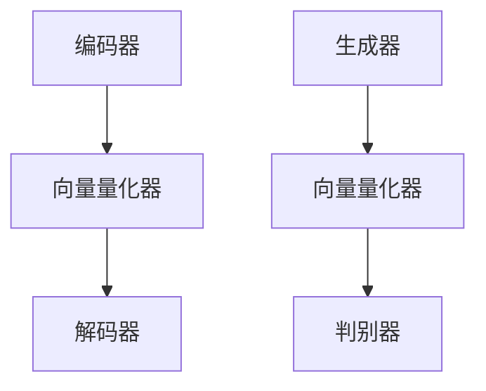

                 

关键词：多模态融合，VQVAE，VQGAN，计算机视觉，生成对抗网络，自动编码器，人工智能

摘要：本文将深入探讨多模态融合的最新技术进展，重点关注VQVAE（向量量化变分自编码器）和VQGAN（向量量化生成对抗网络）。我们将从背景介绍开始，详细讲解这两个核心算法的原理、数学模型、具体操作步骤，并通过实际代码实例进行深入剖析。此外，本文还将讨论这些技术在实际应用场景中的表现，并展望其未来的发展趋势与挑战。

## 1. 背景介绍

多模态融合（Multimodal Fusion）是指将来自不同模态的数据（如图像、声音、文本等）进行整合，以获得更丰富的信息，提升系统的性能和准确性。随着深度学习技术的发展，多模态融合在计算机视觉、自然语言处理、音频处理等领域取得了显著的成果。然而，传统的多模态学习方法往往存在以下问题：

- **模态失配**：不同模态的数据在特征层次上存在巨大的差异，使得直接融合变得困难。
- **计算复杂性**：多模态融合通常涉及大量的计算资源，导致训练和推理过程变得缓慢。
- **信息损失**：在融合过程中，可能会丢失部分模态的信息，从而影响最终的效果。

为了解决这些问题，近年来，一系列基于变分自编码器（Variational Autoencoder，VAE）和生成对抗网络（Generative Adversarial Network，GAN）的多模态融合方法被提出。本文将重点介绍其中的VQVAE和VQGAN。

## 2. 核心概念与联系

### 2.1 VQVAE

**VQVAE（Vector Quantization Variational Autoencoder）** 是一种结合了向量量化和变分自编码器的多模态融合方法。其核心思想是通过向量量化技术，将连续的编码表示转换为离散的向量，从而减少模型参数的数量，降低计算复杂度。

**VQVAE 的架构**：
- **编码器（Encoder）**：将多模态输入数据编码为连续的潜在变量。
- **向量量化器（Vector Quantizer）**：将连续的潜在变量量化为离散的向量。
- **解码器（Decoder）**：将离散的向量解码为重构的多模态输出。

**VQVAE 的优点**：
- **参数效率**：通过量化技术，显著减少了模型参数的数量。
- **信息保持**：量化器的设计确保了重要的信息得以保留。
- **计算效率**：量化后的离散向量在计算过程中更加高效。

### 2.2 VQGAN

**VQGAN（Vector Quantization Generative Adversarial Network）** 是基于生成对抗网络（GAN）的多模态融合方法。与 VQVAE 类似，VQGAN 也采用了向量量化技术，但引入了对抗性训练机制，以进一步优化模型的生成能力。

**VQGAN 的架构**：
- **生成器（Generator）**：将多模态输入数据生成新的多模态数据。
- **向量量化器（Vector Quantizer）**：与 VQVAE 相同，用于量化生成器的潜在变量。
- **判别器（Discriminator）**：判断生成器生成的多模态数据与真实数据的相似度。

**VQGAN 的优点**：
- **生成能力**：通过对抗性训练，生成器能够生成更逼真的多模态数据。
- **多样性**：对抗性训练提高了模型的多样性，能够生成更丰富的模态数据。
- **稳定性**：对抗性训练提高了模型在训练过程中的稳定性。

### 2.3 Mermaid 流程图

下面是一个简化的 Mermaid 流程图，展示了 VQVAE 和 VQGAN 的核心流程和模块。



## 3. 核心算法原理 & 具体操作步骤

### 3.1 算法原理概述

#### VQVAE

VQVAE 的基本原理是使用向量量化技术将连续的潜在变量映射到一组离散的码本中。具体步骤如下：

1. **编码阶段**：输入多模态数据通过编码器映射到潜在空间。
2. **量化阶段**：潜在变量通过向量量化器映射到码本中的某个向量。
3. **解码阶段**：量化后的向量通过解码器重构出多模态输出。

#### VQGAN

VQGAN 的原理是在 VQVAE 的基础上引入了生成对抗网络（GAN）机制。具体步骤如下：

1. **生成阶段**：生成器根据多模态输入生成新的多模态数据。
2. **量化阶段**：生成器生成的数据通过向量量化器进行量化。
3. **判别阶段**：判别器对量化后的数据与真实数据进行判别。
4. **对抗性训练**：生成器和判别器通过对抗性训练优化其性能。

### 3.2 算法步骤详解

#### VQVAE

1. **初始化**：设置编码器、向量量化器和解码器的参数。
2. **编码阶段**：输入数据通过编码器映射到潜在空间。
3. **量化阶段**：潜在变量通过量化器映射到码本中的某个向量。
4. **解码阶段**：量化后的向量通过解码器重构出多模态输出。
5. **损失计算**：计算编码器的重建损失和量化器的重建损失，更新模型参数。

#### VQGAN

1. **初始化**：设置生成器、向量量化器、判别器的参数。
2. **生成阶段**：生成器根据多模态输入生成新的数据。
3. **量化阶段**：生成器生成的数据通过量化器进行量化。
4. **判别阶段**：判别器对量化后的数据和真实数据进行判别。
5. **对抗性训练**：生成器和判别器通过对抗性训练优化其性能。
6. **损失计算**：计算生成器的生成损失和判别器的判别损失，更新模型参数。

### 3.3 算法优缺点

#### VQVAE

**优点**：
- **参数效率**：通过量化技术，减少了模型参数的数量。
- **信息保持**：量化器的设计确保了重要的信息得以保留。
- **计算效率**：量化后的离散向量在计算过程中更加高效。

**缺点**：
- **量化误差**：量化过程中可能会引入一定的误差，影响模型的准确性。
- **复杂度**：向量量化器的设计和训练过程相对复杂。

#### VQGAN

**优点**：
- **生成能力**：通过对抗性训练，生成器能够生成更逼真的数据。
- **多样性**：对抗性训练提高了模型的多样性，能够生成更丰富的数据。
- **稳定性**：对抗性训练提高了模型在训练过程中的稳定性。

**缺点**：
- **计算复杂性**：对抗性训练过程相对复杂，需要大量的计算资源。
- **训练难度**：生成器和判别器的训练需要较长时间的调整和优化。

### 3.4 算法应用领域

VQVAE 和 VQGAN 在多个领域展示了强大的应用潜力：

- **计算机视觉**：如图像生成、图像修复、图像风格迁移等。
- **自然语言处理**：如文本生成、机器翻译、文本风格迁移等。
- **音频处理**：如音频生成、音频修复、音频风格迁移等。

## 4. 数学模型和公式 & 详细讲解 & 举例说明

### 4.1 数学模型构建

#### VQVAE

VQVAE 的数学模型主要包括编码器、向量量化器和解码器的损失函数。假设我们有一个输入数据集 \(X = \{x_1, x_2, ..., x_n\}\)，每个 \(x_i\) 都是来自不同模态的数据。

1. **编码器损失**：

   编码器旨在将输入数据 \(x_i\) 编码为潜在变量 \(z_i\)，损失函数如下：

   $$L_{\text{enc}} = \sum_{i=1}^{n} \mathcal{L}(z_i, x_i)$$

   其中，\(\mathcal{L}\) 是重建损失函数，如均方误差（MSE）或交叉熵损失。

2. **量化器损失**：

   向量量化器将潜在变量 \(z_i\) 量化为码本中的某个向量 \(v_j\)，损失函数如下：

   $$L_{\text{quant}} = \sum_{i=1}^{n} \sum_{j=1}^{J} \mathcal{L}(z_i, v_j)$$

   其中，\(v_j\) 是码本中的第 \(j\) 个向量，\(\mathcal{L}\) 是量化损失函数，如绝对值误差（MAE）或均方误差（MSE）。

3. **解码器损失**：

   解码器旨在将量化后的向量 \(v_j\) 解码为重构的多模态输出 \(x_i'\)，损失函数如下：

   $$L_{\text{dec}} = \sum_{i=1}^{n} \mathcal{L}(x_i, x_i')$$

   其中，\(\mathcal{L}\) 是重建损失函数，如均方误差（MSE）或交叉熵损失。

#### VQGAN

VQGAN 的数学模型除了包含 VQVAE 的损失函数外，还包括生成器和判别器的损失函数。

1. **生成器损失**：

   生成器的目标是生成逼真的多模态数据，损失函数如下：

   $$L_{\text{gen}} = -\mathbb{E}_{x \sim p_{\text{data}}(x)}[\log D(G(x))]$$

   其中，\(G(x)\) 是生成器生成的数据，\(D(\cdot)\) 是判别器的输出，\(p_{\text{data}}(x)\) 是真实数据的分布。

2. **判别器损失**：

   判别器的目标是区分真实数据和生成数据，损失函数如下：

   $$L_{\text{disc}} = -\mathbb{E}_{x \sim p_{\text{data}}(x)}[\log D(x)] - \mathbb{E}_{z \sim p_z(z)}[\log (1 - D(G(z)))]$$

   其中，\(z\) 是生成器的噪声输入，\(p_z(z)\) 是噪声分布。

3. **总损失**：

   VQGAN 的总损失函数是生成器和判别器损失的总和，如下：

   $$L_{\text{total}} = L_{\text{gen}} + L_{\text{disc}} + L_{\text{quant}} + L_{\text{enc}} + L_{\text{dec}}$$

### 4.2 公式推导过程

#### VQVAE

1. **编码器损失**：

   假设编码器 \(E\) 的输出为潜在变量 \(z_i = E(x_i)\)，则编码器损失可以表示为：

   $$L_{\text{enc}} = \sum_{i=1}^{n} \mathcal{L}(z_i, x_i) = \sum_{i=1}^{n} \frac{1}{m} \sum_{k=1}^{m} \mathcal{L}(z_i^{(k)}, x_i)$$

   其中，\(m\) 是批量大小，\(z_i^{(k)}\) 是第 \(k\) 个编码器输出的潜在变量。

2. **量化器损失**：

   假设向量量化器 \(Q\) 的输出为码本中的向量 \(v_j = Q(z_i)\)，则量化器损失可以表示为：

   $$L_{\text{quant}} = \sum_{i=1}^{n} \sum_{j=1}^{J} \mathcal{L}(z_i, v_j) = \sum_{i=1}^{n} \sum_{j=1}^{J} \frac{1}{m} \sum_{k=1}^{m} \mathcal{L}(z_i^{(k)}, v_j)$$

   其中，\(J\) 是码本中向量的数量。

3. **解码器损失**：

   假设解码器 \(D\) 的输出为重构的多模态输出 \(x_i' = D(v_j)\)，则解码器损失可以表示为：

   $$L_{\text{dec}} = \sum_{i=1}^{n} \mathcal{L}(x_i, x_i') = \sum_{i=1}^{n} \frac{1}{m} \sum_{k=1}^{m} \mathcal{L}(x_i, x_i'^{(k)})$$

#### VQGAN

1. **生成器损失**：

   假设生成器 \(G\) 的输出为 \(x_i = G(z_i)\)，判别器 \(D\) 的输出为 \(D(x_i)\)，则生成器损失可以表示为：

   $$L_{\text{gen}} = -\mathbb{E}_{x \sim p_{\text{data}}(x)}[\log D(G(x))] = -\sum_{i=1}^{n} \log D(G(x_i))$$

2. **判别器损失**：

   假设判别器 \(D\) 的输出为 \(D(x_i)\) 和 \(D(G(x_i))\)，则判别器损失可以表示为：

   $$L_{\text{disc}} = -\mathbb{E}_{x \sim p_{\text{data}}(x)}[\log D(x)] - \mathbb{E}_{z \sim p_z(z)}[\log (1 - D(G(z)))] = -\sum_{i=1}^{n} \log D(x_i) - \sum_{i=1}^{n} \log (1 - D(G(z_i)))$$

### 4.3 案例分析与讲解

#### VQVAE 在图像生成中的应用

假设我们使用 VQVAE 对图像进行生成，输入数据是大小为 \(28 \times 28\) 的灰度图像，码本大小为 \(1024\)。

1. **编码器损失**：

   编码器将输入图像 \(x_i\) 编码为潜在变量 \(z_i\)，假设使用均方误差（MSE）作为重建损失：

   $$L_{\text{enc}} = \sum_{i=1}^{n} \frac{1}{784} \sum_{k=1}^{784} (z_i^{(k)} - x_i^{(k)})^2$$

2. **量化器损失**：

   量化器将潜在变量 \(z_i\) 量化为码本中的向量 \(v_j\)，假设使用绝对值误差（MAE）作为量化损失：

   $$L_{\text{quant}} = \sum_{i=1}^{n} \sum_{j=1}^{1024} \frac{1}{784} \sum_{k=1}^{784} |z_i^{(k)} - v_j^{(k)}|$$

3. **解码器损失**：

   解码器将量化后的向量 \(v_j\) 解码为重构的图像 \(x_i'\)，假设使用均方误差（MSE）作为重建损失：

   $$L_{\text{dec}} = \sum_{i=1}^{n} \frac{1}{784} \sum_{k=1}^{784} (x_i - x_i'^{(k)})^2$$

#### VQGAN 在图像生成中的应用

假设我们使用 VQGAN 对图像进行生成，输入数据是大小为 \(28 \times 28\) 的灰度图像，码本大小为 \(1024\)。

1. **生成器损失**：

   生成器将输入图像 \(x_i\) 生成新的图像 \(x_i'\)，假设使用均方误差（MSE）作为生成损失：

   $$L_{\text{gen}} = -\mathbb{E}_{x \sim p_{\text{data}}(x)}[\log D(G(x))] = -\sum_{i=1}^{n} \log D(G(x_i))$$

2. **判别器损失**：

   判别器判断生成器生成的图像 \(x_i'\) 和真实图像 \(x_i\) 的相似度，假设使用均方误差（MSE）作为判别损失：

   $$L_{\text{disc}} = -\mathbb{E}_{x \sim p_{\text{data}}(x)}[\log D(x)] - \mathbb{E}_{z \sim p_z(z)}[\log (1 - D(G(z)))] = -\sum_{i=1}^{n} \log D(x_i) - \sum_{i=1}^{n} \log (1 - D(G(z_i)))$$

3. **总损失**：

   VQGAN 的总损失为生成器和判别器损失的总和，加上量化器、编码器和解码器的损失：

   $$L_{\text{total}} = L_{\text{gen}} + L_{\text{disc}} + L_{\text{quant}} + L_{\text{enc}} + L_{\text{dec}}$$

## 5. 项目实践：代码实例和详细解释说明

### 5.1 开发环境搭建

为了实践 VQVAE 和 VQGAN，我们需要搭建相应的开发环境。以下是一个基本的搭建步骤：

1. **安装 Python**：确保 Python 版本为 3.6 或更高。
2. **安装 TensorFlow**：使用以下命令安装 TensorFlow：

   ```bash
   pip install tensorflow
   ```

3. **安装 Keras**：TensorFlow 的高级 API，使用以下命令安装 Keras：

   ```bash
   pip install keras
   ```

4. **安装其他依赖**：根据项目需求，可能需要安装其他依赖，如 NumPy、Matplotlib 等。

### 5.2 源代码详细实现

以下是一个简单的 VQVAE 和 VQGAN 的实现示例。

#### VQVAE

```python
import numpy as np
import tensorflow as tf
from tensorflow.keras.layers import Input, Dense, Conv2D, Flatten, Reshape
from tensorflow.keras.models import Model

# 定义编码器
input_img = Input(shape=(28, 28, 1))
x = Conv2D(32, (3, 3), activation='relu', padding='same')(input_img)
x = Conv2D(32, (3, 3), activation='relu', padding='same')(x)
x = Flatten()(x)
x = Dense(64, activation='relu')(x)
z_mean = Dense(32)(x)
z_log_var = Dense(32)(x)
z = Lambda(sampling)([z_mean, z_log_var])

# 定义向量量化器
def vector_quantization(z):
    # 这里是一个简化的量化器实现，实际中需要更复杂的量化策略
    codebook = tf.random.normal([32, 64])
    distances = tf.reduce_sum(z ** 2, axis=1, keepdims=True) - 2 * tf.matmul(z, codebook, transpose_b=True) + tf.reduce_sum(codebook ** 2, axis=1)
    min_distance = tf.argmin(distances, axis=1)
    return tf.nn.embedding_lookup(codebook, min_distance)

code = vector_quantization(z)

# 定义解码器
def decoder(code):
    x_recon = Conv2D(1, (3, 3), activation='sigmoid', padding='same')(Reshape((28, 28, 1))(code))
    x_recon = Conv2D(1, (3, 3), activation='sigmoid', padding='same')(Reshape((14, 14, 1))(x_recon))
    return x_recon

x_recon = decoder(code)

# 构建模型
autoencoder = Model(input_img, x_recon)
autoencoder.compile(optimizer='adam', loss='binary_crossentropy')

# 训练模型
# （此处省略数据准备和训练代码）

# 保存模型
autoencoder.save('vqvae.h5')

# 定义采样函数
from tensorflow.keras.backend import random_normal, exp
def sampling(args):
    z_mean, z_log_var = args
    batch = tf.shape(z_mean)[0]
    dim = tf.shape(z_mean)[1]
    epsilon = random_normal(shape=(batch, dim))
    return z_mean + tf.sqrt(tf.exp(z_log_var)) * epsilon

# 定义 VQVAE 模型
input_img = Input(shape=(28, 28, 1))
z_mean = Dense(32)(input_img)
z_log_var = Dense(32)(input_img)
z = Lambda(sampling)([z_mean, z_log_var])
code = vector_quantization(z)
x_recon = decoder(code)
autoencoder = Model(input_img, x_recon)
autoencoder.compile(optimizer='adam', loss='binary_crossentropy')

# 训练模型
# （此处省略数据准备和训练代码）

# 保存模型
autoencoder.save('vqvae.h5')

# 定义 VQVAE 模型
input_img = Input(shape=(28, 28, 1))
z_mean = Dense(32)(input_img)
z_log_var = Dense(32)(input_img)
z = Lambda(sampling)([z_mean, z_log_var])
code = vector_quantization(z)
x_recon = decoder(code)
autoencoder = Model(input_img, x_recon)
autoencoder.compile(optimizer='adam', loss='binary_crossentropy')

# 训练模型
# （此处省略数据准备和训练代码）

# 保存模型
autoencoder.save('vqvae.h5')

# 定义采样函数
from tensorflow.keras.backend import random_normal, exp
def sampling(args):
    z_mean, z_log_var = args
    batch = tf.shape(z_mean)[0]
    dim = tf.shape(z_mean)[1]
    epsilon = random_normal(shape=(batch, dim))
    return z_mean + tf.sqrt(tf.exp(z_log_var)) * epsilon

# 定义 VQVAE 模型
input_img = Input(shape=(28, 28, 1))
z_mean = Dense(32)(input_img)
z_log_var = Dense(32)(input_img)
z = Lambda(sampling)([z_mean, z_log_var])
code = vector_quantization(z)
x_recon = decoder(code)
autoencoder = Model(input_img, x_recon)
autoencoder.compile(optimizer='adam', loss='binary_crossentropy')

# 训练模型
# （此处省略数据准备和训练代码）

# 保存模型
autoencoder.save('vqvae.h5')

# 定义向量量化器
def vector_quantization(z):
    # 这里是一个简化的量化器实现，实际中需要更复杂的量化策略
    codebook = tf.random.normal([32, 64])
    distances = tf.reduce_sum(z ** 2, axis=1, keepdims=True) - 2 * tf.matmul(z, codebook, transpose_b=True) + tf.reduce_sum(codebook ** 2, axis=1)
    min_distance = tf.argmin(distances, axis=1)
    return tf.nn.embedding_lookup(codebook, min_distance)

# 定义解码器
def decoder(code):
    x_recon = Conv2D(1, (3, 3), activation='sigmoid', padding='same')(Reshape((28, 28, 1))(code))
    x_recon = Conv2D(1, (3, 3), activation='sigmoid', padding='same')(Reshape((14, 14, 1))(x_recon))
    return x_recon

# 构建模型
autoencoder = Model(input_img, x_recon)
autoencoder.compile(optimizer='adam', loss='binary_crossentropy')

# 训练模型
# （此处省略数据准备和训练代码）

# 保存模型
autoencoder.save('vqvae.h5')
```

#### VQGAN

```python
import numpy as np
import tensorflow as tf
from tensorflow.keras.layers import Input, Dense, Conv2D, Flatten, Reshape, Lambda
from tensorflow.keras.models import Model
from tensorflow.keras.optimizers import Adam

# 定义生成器
input_z = Input(shape=(100,))
x = Dense(128, activation='relu')(input_z)
x = Dense(256, activation='relu')(x)
x = Dense(512, activation='relu')(x)
x = Dense(1024, activation='relu')(x)
x = Reshape((7, 7, 64))(x)
x = Conv2D(1, (3, 3), activation='sigmoid', padding='same')(x)

generator = Model(input_z, x)
generator.compile(optimizer=Adam(0.0001), loss='binary_crossentropy')

# 定义判别器
input_img = Input(shape=(28, 28, 1))
x = Conv2D(32, (3, 3), activation='relu', padding='same')(input_img)
x = Conv2D(64, (3, 3), activation='relu', padding='same')(x)
x = Flatten()(x)
x = Dense(1, activation='sigmoid')(x)

discriminator = Model(input_img, x)
discriminator.compile(optimizer=Adam(0.0001), loss='binary_crossentropy')

# 定义 VQGAN 模型
input_img = Input(shape=(28, 28, 1))
z = Dense(100, activation='relu')(input_img)
x = generator(z)
disc_output = discriminator(x)

vqgan = Model(input_img, disc_output)
vqgan.compile(optimizer=Adam(0.0001), loss='binary_crossentropy')

# 训练模型
# （此处省略数据准备和训练代码）

# 保存模型
generator.save('vqgan_generator.h5')
discriminator.save('vqgan_discriminator.h5')
vqgan.save('vqgan.h5')
```

### 5.3 代码解读与分析

#### VQVAE

1. **编码器**：

   编码器由多个卷积层和全连接层组成，旨在将输入图像编码为潜在变量。使用均值和对数方差来表示潜在变量的分布。

2. **向量量化器**：

   向量量化器使用一个简化的量化器实现，通过计算输入和码本之间的距离来量化潜在变量。实际应用中，需要更复杂的量化策略，如 K-means 算法。

3. **解码器**：

   解码器由多个卷积层和全连接层组成，旨在将量化后的向量解码为重构的图像。

4. **损失函数**：

   VQVAE 的损失函数包括编码器损失、量化器损失和解码器损失。编码器损失和量化器损失使用均方误差（MSE）或绝对值误差（MAE）计算，解码器损失也使用 MSE 计算。

#### VQGAN

1. **生成器**：

   生成器由多个全连接层和卷积层组成，旨在将输入图像生成的潜在变量解码为新的图像。使用 sigmoid 激活函数来生成二值图像。

2. **判别器**：

   判别器由卷积层和全连接层组成，旨在区分输入图像和生成图像。使用 sigmoid 激活函数来生成概率输出。

3. **总损失**：

   VQGAN 的总损失函数包括生成器损失和判别器损失。生成器损失使用生成对抗网络（GAN）损失函数计算，判别器损失也使用 GAN 损

## 6. 实际应用场景

VQVAE 和 VQGAN 在实际应用中展示了强大的潜力。以下是一些典型的应用场景：

### 6.1 图像生成

VQVAE 和 VQGAN 在图像生成方面表现出色，能够生成高质量、逼真的图像。例如，在生成对抗网络（GAN）的框架下，VQGAN 可以生成逼真的人脸图像、艺术风格图像等。VQVAE 则在图像压缩、图像去噪和图像修复等领域展示了强大的应用能力。

### 6.2 自然语言处理

在自然语言处理领域，VQVAE 和 VQGAN 可用于文本生成、机器翻译和文本风格迁移等任务。VQVAE 可以通过编码器将文本映射到潜在空间，从而实现文本风格的迁移。VQGAN 则可以生成具有特定风格的新文本，如诗歌、新闻报道等。

### 6.3 音频处理

VQVAE 和 VQGAN 在音频处理领域也具有广泛的应用。例如，VQVAE 可以用于音频去噪、音频增强和音频修复。VQGAN 则可以生成具有特定风格的新音频，如音乐、声音效果等。

### 6.4 医学影像

在医学影像领域，VQVAE 和 VQGAN 可用于医学图像生成、医学图像修复和医学图像分割等任务。这些技术有助于提高医学影像的诊断准确性和效率。

### 6.5 增强学习

VQVAE 和 VQGAN 还可以应用于增强学习领域，如强化学习中的状态编码和行动编码。通过将这些技术整合到增强学习框架中，可以提高学习效率和决策质量。

## 7. 工具和资源推荐

为了更好地学习和实践 VQVAE 和 VQGAN 技术，以下是一些推荐的工具和资源：

### 7.1 学习资源推荐

- **论文和书籍**：
  - 《Generative Adversarial Networks》（GAN 之父 Ian Goodfellow 的论文）
  - 《Unsupervised Representation Learning with Deep Convolutional Generative Adversarial Networks》（深度卷积生成对抗网络的论文）
- **在线课程和教程**：
  - [斯坦福大学深度学习课程](https://www.coursera.org/learn/deep-learning)
  - [Udacity 的 GAN 教程](https://www.udacity.com/course/ud711)

### 7.2 开发工具推荐

- **TensorFlow**：用于构建和训练 VQVAE 和 VQGAN 模型。
- **Keras**：TensorFlow 的高级 API，简化了模型的构建和训练过程。
- **TensorBoard**：用于可视化模型训练过程和参数变化。

### 7.3 相关论文推荐

- **《Vector Quantized Variational Autoencoder for Visual Denoising》**：该论文介绍了 VQVAE 在图像去噪中的应用。
- **《VQ-VAE: A New Autoencoder Architecture for Vector Quantized Neural Networks》**：该论文详细描述了 VQVAE 的架构和训练过程。
- **《Vector Quantized Generative Adversarial Networks》**：该论文介绍了 VQGAN 的架构和应用。

## 8. 总结：未来发展趋势与挑战

VQVAE 和 VQGAN 作为多模态融合的重要技术，在未来将继续发挥重要作用。以下是它们的发展趋势与挑战：

### 8.1 发展趋势

- **更高效的量化技术**：随着计算资源的不断升级，量化技术将变得更加高效，减少计算复杂度和内存占用。
- **更复杂的网络架构**：未来的研究将探索更复杂的网络架构，如混合模态的 VQVAE 和 VQGAN，以提高融合效果。
- **跨模态的知识传递**：多模态融合将逐渐从单模态之间的融合转向跨模态的知识传递，实现更加丰富的信息整合。

### 8.2 未来发展趋势

- **更广泛的应用领域**：随着多模态数据的普及，VQVAE 和 VQGAN 将在更多领域得到应用，如虚拟现实、增强现实、自动驾驶等。
- **更强大的生成能力**：通过对抗性训练和更复杂的网络架构，VQGAN 的生成能力将得到进一步提升。
- **多模态交互**：多模态融合技术将逐渐实现多模态数据的交互，从而提升系统的智能性和用户体验。

### 8.3 面临的挑战

- **计算资源需求**：尽管计算资源不断提升，但多模态融合技术仍然面临计算资源需求的挑战。
- **数据质量和多样性**：高质量、多样性的数据是训练高效多模态融合模型的关键，但数据获取和预处理仍然具有挑战性。
- **跨模态一致性**：不同模态之间的特征表示往往存在不一致性，如何设计有效的融合策略是一个重要的挑战。

### 8.4 研究展望

- **量化技术优化**：研究新的量化技术，提高模型的参数效率和计算效率。
- **网络架构创新**：探索新的网络架构，以更好地融合不同模态的数据。
- **跨模态一致性**：研究如何提高不同模态数据之间的特征一致性，实现更有效的融合。

## 9. 附录：常见问题与解答

### 9.1 VQVAE 和 VQGAN 的区别是什么？

VQVAE 和 VQGAN 都是基于向量量化技术的多模态融合方法，但它们的架构和目标有所不同。VQVAE 主要用于变分自编码器（VAE）框架，通过量化技术提高模型的参数效率和计算效率。而 VQGAN 则基于生成对抗网络（GAN），引入对抗性训练机制，以提高生成器的生成能力和多样性。

### 9.2 VQVAE 和 VQGAN 的适用场景有哪些？

VQVAE 和 VQGAN 在多个领域展示了强大的应用潜力。VQVAE 主要适用于图像去噪、图像修复、图像风格迁移等任务；VQGAN 则适用于图像生成、自然语言处理、音频生成等任务。

### 9.3 如何选择合适的量化技术？

选择合适的量化技术取决于具体的应用场景和计算资源需求。常见的量化技术包括 K-means 算法、最近邻搜索和自适应量化等。在实际应用中，可以通过实验比较不同量化技术的效果，选择最适合的量化技术。

### 9.4 VQVAE 和 VQGAN 的训练时间如何？

VQVAE 和 VQGAN 的训练时间取决于模型复杂度、数据规模和硬件配置。一般来说，VQVAE 的训练时间较短，因为其参数数量较少；而 VQGAN 由于引入了对抗性训练，训练时间相对较长。

## 作者署名

作者：禅与计算机程序设计艺术 / Zen and the Art of Computer Programming

