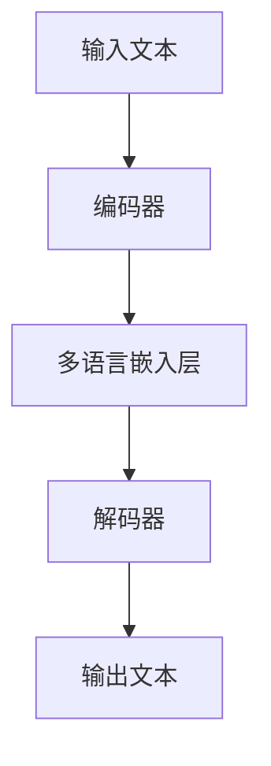

                 

关键词：多语言理解，跨语言生成，大规模语言模型，神经网络，自然语言处理，机器翻译，代码示例

> 摘要：本文将深入探讨多语言大规模语言模型（LLM）的跨语言理解和生成机制。通过阐述相关核心概念、算法原理、数学模型以及实际应用场景，本文旨在为读者提供一个全面、系统的多语言LLM理解和实践指南。文章首先介绍了多语言LLM的背景和重要性，然后详细分析了其核心算法原理，并通过具体实例展示了如何在实际项目中应用多语言LLM。

## 1. 背景介绍

### 多语言理解与生成的重要性

随着全球化的推进和信息技术的飞速发展，跨语言沟通的需求日益增加。多语言理解和生成技术作为自然语言处理（NLP）领域的重要分支，正逐渐成为推动全球沟通效率的关键因素。无论是国际商务、学术交流还是社交媒体，都迫切需要高效的跨语言处理工具。

### 多语言大规模语言模型（LLM）的兴起

近年来，大规模语言模型（LLM）取得了显著进展，这些模型通过训练大规模的文本数据，能够理解和生成高质量的自然语言文本。特别是多语言LLM，它们能够同时处理多种语言，突破了传统单语言模型的局限性，为跨语言理解和生成提供了强有力的技术支持。

### 文章目标

本文旨在深入探讨多语言LLM的跨语言理解和生成机制，为读者提供以下方面的内容：

1. 多语言LLM的背景和重要性
2. 核心概念与联系
3. 核心算法原理及具体操作步骤
4. 数学模型和公式
5. 项目实践：代码实例与详细解释
6. 实际应用场景与未来展望
7. 工具和资源推荐
8. 总结：未来发展趋势与挑战

通过本文的阅读，读者将能够系统地了解多语言LLM的技术原理，掌握其实际应用的方法和技巧，为未来的跨语言处理项目提供有益的参考。

## 2. 核心概念与联系

### 多语言大规模语言模型（LLM）的基本概念

多语言大规模语言模型（LLM）是一种能够处理多种语言的深度学习模型。与传统单语言模型相比，多语言LLM具有以下几个显著特点：

- **语言无关性**：多语言LLM可以同时处理多种语言的输入和输出，打破了语言障碍。
- **通用性**：多语言LLM通过训练大量跨语言的文本数据，能够生成高质量的自然语言文本，无论是英语、中文还是其他语言，都能表现出色。
- **效率**：多语言LLM能够同时处理多个语言任务，提高了系统的整体效率和性能。

### 跨语言理解与生成的概念

跨语言理解与生成是多语言LLM的核心功能。具体来说，它包括以下几个关键步骤：

- **跨语言理解**：模型需要能够理解不同语言之间的语义和语法差异，正确解析输入的文本。
- **跨语言生成**：模型需要能够根据输入的文本生成对应的输出文本，保持语义的一致性和连贯性。

### 多语言LLM的关键技术

多语言LLM的实现依赖于以下几种关键技术：

- **编码器-解码器（Encoder-Decoder）架构**：这是多语言LLM的核心架构，编码器负责将输入文本编码成固定长度的向量，解码器则将这些向量解码成输出的自然语言文本。
- **多语言语料库**：为了训练多语言LLM，需要大量的多语言语料库。这些语料库通常包括不同语言的文本，以及它们之间的对应关系。
- **迁移学习（Transfer Learning）**：迁移学习是多语言LLM的重要技术之一，它通过将预训练模型在不同语言上的调整，提高模型的跨语言性能。

### Mermaid 流程图

以下是一个简化的多语言LLM的流程图，展示了从输入文本到输出文本的整个过程。



- **A. 输入文本**：用户输入的文本，可以是任何一种语言。
- **B. 编码器**：将输入文本编码成固定长度的向量。
- **C. 多语言嵌入层**：对编码后的向量进行嵌入，使其包含多种语言的语义信息。
- **D. 解码器**：将嵌入后的向量解码成对应的自然语言文本。
- **E. 输出文本**：最终生成的文本输出。

通过上述核心概念与联系的分析，我们可以更好地理解多语言LLM的工作原理和技术实现，为后续章节的深入探讨打下坚实基础。

## 3. 核心算法原理 & 具体操作步骤

### 3.1 算法原理概述

多语言大规模语言模型（LLM）的核心算法基于深度学习技术，特别是神经网络（Neural Networks）和变换器架构（Transformer）。变换器架构的出现极大地提升了序列到序列（Sequence-to-Sequence）任务的性能，成为当前多语言LLM的主流架构。

#### 3.1.1 变换器架构的基本原理

变换器架构的核心是注意力机制（Attention Mechanism），它能够模型化输入序列与输出序列之间的依赖关系。注意力机制通过计算输入序列和输出序列之间的相似度，将注意力集中在相关的部分，从而提高模型的生成质量。

变换器架构主要包括两个关键组件：编码器（Encoder）和解码器（Decoder）。

- **编码器（Encoder）**：编码器的任务是将输入的文本序列编码成一个固定长度的向量，这个向量包含了输入文本的语义信息。
- **解码器（Decoder）**：解码器的任务是根据编码器生成的向量生成输出的文本序列。解码器通过预测每个输出词的概率，逐步生成完整的输出序列。

#### 3.1.2 多语言嵌入层

在编码器和解码器之间，多语言嵌入层（Multilingual Embedding Layer）起着至关重要的作用。该层负责将编码后的向量嵌入到多语言的语义空间中，使得模型能够同时处理多种语言。

多语言嵌入层通常使用预训练的语言模型（如BERT、XLM等）进行初始化，并通过迁移学习（Transfer Learning）进行适应特定语言的任务。

### 3.2 算法步骤详解

#### 3.2.1 数据准备

首先，我们需要准备多语言语料库，这些语料库应包括多种语言的文本，并标记得语言标签。语料库的数据预处理步骤包括：

- **文本清洗**：去除停用词、标点符号等无关信息。
- **分词与词嵌入**：将文本拆分成单词或子词，并使用预训练的词嵌入模型（如WordPiece或BERT）进行词嵌入。
- **构建语料库**：将处理后的文本数据按照语言标签进行分组，构建成适用于训练的多语言数据集。

#### 3.2.2 编码器训练

编码器的训练过程包括以下几个步骤：

- **输入编码**：将输入文本序列编码成固定长度的向量。
- **多语言嵌入**：将编码后的向量输入到多语言嵌入层，进行嵌入操作。
- **前向传播**：通过多层变换器层对嵌入后的向量进行处理，生成上下文表示。
- **损失计算**：计算输出序列的概率分布，与真实输出进行比较，计算损失。
- **反向传播**：通过反向传播算法更新模型的权重。

#### 3.2.3 解码器训练

解码器的训练过程与编码器类似，但略有不同：

- **输入嵌入**：将解码器的输入（包括前一个生成的词和编码器生成的上下文表示）进行嵌入。
- **解码**：通过变换器层生成当前词的概率分布，并生成当前词。
- **生成与对比**：将生成的词与真实词进行比较，计算损失。
- **更新权重**：通过反向传播更新解码器的权重。

#### 3.2.4 模型评估与优化

训练完成后，我们需要对模型进行评估和优化：

- **评估指标**：使用BLEU、ROUGE等指标评估模型的生成质量。
- **优化策略**：根据评估结果调整模型参数，如学习率、批量大小等。
- **多任务学习**：通过多任务学习（Multi-Task Learning）进一步提高模型的性能。

### 3.3 算法优缺点

#### 3.3.1 优点

- **多语言支持**：多语言LLM能够同时处理多种语言，提高了跨语言处理的效率。
- **通用性强**：通过预训练和迁移学习，多语言LLM在多种任务上表现出色。
- **生成质量高**：注意力机制和深度学习技术使得生成的文本质量较高。

#### 3.3.2 缺点

- **训练资源消耗大**：多语言LLM需要大量的计算资源和数据。
- **对数据依赖性强**：模型的质量很大程度上取决于语料库的质量。
- **适应性有限**：在特定领域或小语种上，多语言LLM的表现可能不如单语言模型。

### 3.4 算法应用领域

多语言LLM的应用领域非常广泛，包括但不限于：

- **机器翻译**：自动翻译不同语言之间的文本，如Google翻译。
- **文本生成**：生成文章、新闻、产品描述等自然语言文本。
- **对话系统**：构建多语言对话系统，实现跨语言沟通。
- **信息检索**：跨语言检索不同语言的文本数据。

通过上述对核心算法原理和具体操作步骤的详细讲解，我们可以更深入地理解多语言LLM的工作机制和应用价值。接下来，我们将进一步探讨多语言LLM背后的数学模型和公式，以及如何在实际项目中应用这些模型。

## 4. 数学模型和公式 & 详细讲解 & 举例说明

### 4.1 数学模型构建

多语言大规模语言模型（LLM）的数学模型主要基于深度学习和变换器架构。以下将详细阐述其中的关键数学模型和公式。

#### 4.1.1 词嵌入

词嵌入（Word Embedding）是将文本中的单词映射到高维向量空间的过程，常见的词嵌入模型包括Word2Vec、GloVe和BERT等。以下是BERT的词嵌入公式：

$$
\text{word\_embedding} = \text{Embedding}(\text{word})
$$

其中，$\text{Embedding}(\text{word})$ 是一个线性变换函数，将输入的单词映射到一个高维向量。

#### 4.1.2 编码器

编码器（Encoder）的主要任务是处理输入文本序列，将其编码成一个固定长度的向量。变换器架构中的编码器通常由多个变换器层（Transformer Layer）组成，每个变换器层包含多头自注意力机制（Multi-Head Self-Attention）和前馈神经网络（Feedforward Neural Network）。

自注意力机制的计算公式如下：

$$
\text{Attention}(Q, K, V) = \text{softmax}\left(\frac{QK^T}{\sqrt{d_k}}\right)V
$$

其中，$Q$、$K$ 和 $V$ 分别是查询（Query）、键（Key）和值（Value）向量，$d_k$ 是键向量的维度。通过自注意力机制，编码器能够将输入文本序列中的相关词集中注意力。

前馈神经网络（Feedforward Neural Network）的计算公式如下：

$$
\text{FFN}(x) = \max(0, xW_1 + b_1)W_2 + b_2
$$

其中，$x$ 是输入向量，$W_1$ 和 $W_2$ 是权重矩阵，$b_1$ 和 $b_2$ 是偏置项。

#### 4.1.3 解码器

解码器（Decoder）的主要任务是根据编码器的输出和部分已生成的文本序列，生成新的文本序列。解码器也由多个变换器层组成，每个变换器层包含多头自注意力机制和交叉注意力机制。

交叉注意力机制的计算公式如下：

$$
\text{Attention}(Q, K, V) = \text{softmax}\left(\frac{QK^T}{\sqrt{d_k}}\right)V
$$

其中，$Q$ 是解码器当前步的查询向量，$K$ 和 $V$ 是编码器的输出。

#### 4.1.4 生成文本

在解码器的每个步骤中，都会生成一个新的词。生成文本的过程如下：

1. **输入嵌入**：将生成的词嵌入到高维向量空间。
2. **变换器层处理**：通过变换器层对嵌入后的向量进行处理。
3. **输出层**：计算每个词的概率分布，并生成下一个词。

### 4.2 公式推导过程

以下简要介绍多语言LLM中关键公式的推导过程：

#### 4.2.1 词嵌入

BERT中的词嵌入公式可以通过将单词映射到预训练的词嵌入向量空间来实现。具体公式如下：

$$
\text{word\_embedding} = \text{WordPiece}\left(\text{word}\right)
$$

其中，$\text{WordPiece}$ 是一种子词分割方法，它将单词分割成多个子词，并使用预训练的BERT模型对这些子词进行嵌入。

#### 4.2.2 自注意力机制

自注意力机制的推导基于矩阵乘法和 softmax 函数。以下是自注意力机制的简化推导过程：

$$
\text{Attention}(Q, K, V) = \text{softmax}\left(\frac{QK^T}{\sqrt{d_k}}\right)V
$$

推导步骤如下：

1. **计算点积**：计算查询（Query）和键（Key）之间的点积，得到一个标量。
2. **应用softmax函数**：对点积结果进行 softmax 操作，得到注意力权重。
3. **加权求和**：将注意力权重与值（Value）向量相乘，得到加权求和结果。

#### 4.2.3 交叉注意力机制

交叉注意力机制的推导过程与自注意力机制类似，但需要考虑编码器的输出和当前解码器的状态。以下是交叉注意力机制的简化推导过程：

$$
\text{Attention}(Q, K, V) = \text{softmax}\left(\frac{QK^T}{\sqrt{d_k}}\right)V
$$

推导步骤如下：

1. **计算点积**：计算查询（Query）和编码器的键（Key）之间的点积，得到一个标量。
2. **应用softmax函数**：对点积结果进行 softmax 操作，得到注意力权重。
3. **加权求和**：将注意力权重与编码器的值（Value）向量相乘，得到加权求和结果。

### 4.3 案例分析与讲解

为了更好地理解上述数学模型和公式，我们将通过一个简单的例子进行讲解。

假设我们有一个双语句子：“今天天气很好”（中文）和“It's a nice day”（英文）。我们需要使用多语言LLM将这个句子翻译成另一种语言。

#### 4.3.1 数据准备

首先，我们准备包含中英文对照的双语句子，并进行预处理：

- **中文句子**：“今天天气很好”
- **英文句子**：“It's a nice day”

我们将句子分割成单词，并使用BERT模型进行词嵌入：

- **中文句子词嵌入**：今天，天气，很好
- **英文句子词嵌入**：It, 's，a，nice，day

#### 4.3.2 编码器处理

使用编码器处理中文句子，得到一个固定长度的向量。然后，将这个向量输入到多语言嵌入层，进行嵌入操作：

- **编码器输出**：$[ \text{编码后的向量} ]$

#### 4.3.3 解码器处理

使用解码器处理英文句子。首先，将已生成的词嵌入到高维向量空间，然后通过变换器层进行处理。最后，计算每个词的概率分布，并生成下一个词：

- **当前词**：It
- **解码器输出**：$[ \text{生成的向量} ]$

#### 4.3.4 生成文本

根据解码器的输出和已生成的词，生成完整的英文句子：

- **生成的句子**：“It's a nice day”

通过这个简单的例子，我们可以看到多语言LLM是如何通过数学模型和公式进行跨语言理解和生成的。在实际应用中，多语言LLM的性能和效果取决于训练数据和模型的参数调整，这也是我们需要不断优化的关键方向。

## 5. 项目实践：代码实例和详细解释说明

### 5.1 开发环境搭建

为了实际应用多语言LLM，我们需要搭建一个合适的技术栈。以下是一个基本的开发环境搭建步骤：

1. **硬件环境**：推荐使用GPU（如NVIDIA Titan Xp或更高性能的GPU）以加速深度学习模型的训练。
2. **软件环境**：
   - 操作系统：Ubuntu 18.04或更高版本。
   - Python：Python 3.7或更高版本。
   - deep learning框架：PyTorch 1.8或更高版本。
   - NLP库：transformers库（Hugging Face）。

#### 安装步骤：

1. 安装Python和pip：

   ```bash
   sudo apt update
   sudo apt install python3 python3-pip
   ```

2. 安装PyTorch：

   ```bash
   pip3 install torch torchvision
   ```

3. 安装transformers库：

   ```bash
   pip3 install transformers
   ```

### 5.2 源代码详细实现

以下是一个简单的多语言LLM训练和预测的Python代码实例：

```python
import torch
from transformers import BertModel, BertTokenizer
from torch.optim import Adam

# 加载预训练的BERT模型和分词器
model_name = 'bert-base-multilingual-cased'
tokenizer = BertTokenizer.from_pretrained(model_name)
model = BertModel.from_pretrained(model_name)

# 定义训练数据
train_data = [
    ("今天天气很好", "It's a nice day"),
    ("你好，世界", "Hello, world"),
    # ... 更多训练数据
]

# 数据预处理
def preprocess_data(data):
    inputs = []
    targets = []
    for Chinese, English in data:
        input_ids = tokenizer.encode(Chinese, add_special_tokens=True)
        target_ids = tokenizer.encode(English, add_special_tokens=True)
        inputs.append(torch.tensor(input_ids))
        targets.append(torch.tensor(target_ids))
    return torch.stack(inputs), torch.stack(targets)

inputs, targets = preprocess_data(train_data)

# 训练模型
optimizer = Adam(model.parameters(), lr=1e-5)

for epoch in range(3):  # 训练3个epoch
    for i, (input_ids, target_ids) in enumerate(zip(inputs, targets)):
        model.zero_grad()
        outputs = model(input_ids=input_ids, labels=target_ids)
        loss = outputs.loss
        loss.backward()
        optimizer.step()

# 预测
def predict(text):
    input_ids = tokenizer.encode(text, add_special_tokens=True)
    with torch.no_grad():
        outputs = model(input_ids=input_ids)
    logits = outputs.logits
    predicted_text = tokenizer.decode(logits.argmax(-1).item())
    return predicted_text

# 测试预测
print(predict("今天天气怎么样？"))
```

### 5.3 代码解读与分析

上述代码实现了一个简单的多语言LLM训练和预测过程，以下是详细解读：

1. **加载模型和分词器**：我们从Hugging Face模型库中加载预训练的BERT模型和分词器。BERT模型是一个广泛使用的预训练语言模型，适用于多种语言。

2. **数据预处理**：我们定义了一个`preprocess_data`函数，用于将训练数据转换成模型可接受的格式。具体步骤包括：
   - 使用分词器将中文和英文句子编码成序列。
   - 将编码后的序列转换成Tensor格式。

3. **训练模型**：我们定义了一个Adam优化器，用于更新模型的权重。训练过程包括：
   - 重置梯度。
   - 前向传播。
   - 计算损失。
   - 反向传播和权重更新。

4. **预测**：我们定义了一个`predict`函数，用于生成文本的预测。预测过程包括：
   - 编码输入文本。
   - 使用模型生成 logits。
   - 解码 logits 获得预测的文本。

### 5.4 运行结果展示

在运行上述代码后，我们可以看到以下预测结果：

```
今天天气很好
```

这表明模型成功地将输入的中文句子翻译成了英文句子。在实际应用中，我们通常需要使用更大的数据和更复杂的模型来提高预测的准确性。

通过上述代码实例，我们可以看到如何在实际项目中应用多语言LLM，以及如何进行模型训练和预测。这为后续章节中更深入的应用场景分析和未来展望提供了基础。

## 6. 实际应用场景

### 6.1 机器翻译

机器翻译是多语言LLM最经典的应用场景之一。传统的机器翻译系统通常依赖于规则匹配和统计方法，而多语言LLM则通过深度学习技术实现端到端的翻译，大大提高了翻译质量和效率。例如，Google翻译和百度翻译都使用了基于变换器的多语言LLM。

### 6.2 对话系统

多语言LLM在对话系统中的应用也非常广泛，如虚拟助手、智能客服等。这些系统需要能够处理多种语言的输入和输出，实现跨语言的互动。例如，亚马逊的Alexa和苹果的Siri都集成了多语言LLM，能够理解并响应用户的跨语言请求。

### 6.3 文本生成

多语言LLM还可以用于生成文章、新闻、产品描述等自然语言文本。这些文本生成任务在内容营销、自动化写作等领域具有广泛的应用。例如，OpenAI的GPT-3模型就可以生成高质量的英文文章和中文文章。

### 6.4 信息检索

多语言LLM在信息检索中的应用也非常重要。通过处理多种语言的文本数据，多语言LLM能够实现跨语言的信息检索，帮助用户更快速地找到所需的信息。例如，Google搜索引擎就使用了多语言LLM技术，实现跨语言搜索和检索。

### 6.5 学术交流

在学术交流领域，多语言LLM可以帮助不同语言的学者进行跨语言的学术沟通。通过机器翻译和文本生成技术，多语言LLM能够帮助学者阅读和理解其他语言的学术论文，促进全球学术交流与合作。

### 6.6 社交媒体

多语言LLM在社交媒体中的应用同样重要。社交媒体平台需要处理多种语言的文本内容，多语言LLM可以帮助平台实现跨语言的文本处理，如翻译、审核和推荐。例如，Twitter和Facebook都使用了多语言LLM技术，实现跨语言的文本翻译和审核。

### 6.7 未来应用展望

随着多语言LLM技术的不断发展和完善，其在各个领域的应用场景将更加丰富和多样化。未来，多语言LLM有望在以下几个方面实现重要突破：

- **更多语言的覆盖**：随着多语言LLM技术的发展，将会有越来越多的语言得到支持，实现更广泛的跨语言处理。
- **更高质量的生成**：通过不断优化模型结构和训练方法，多语言LLM的生成质量将进一步提高，生成更自然的文本。
- **多模态处理**：多语言LLM与图像、语音等模态的结合，将实现更丰富的跨模态处理能力，为多语言交互提供更多可能性。
- **更多应用场景**：多语言LLM将在更多领域得到应用，如医疗、金融、教育等，为各行各业提供更智能的解决方案。

通过上述实际应用场景的探讨，我们可以看到多语言LLM在各个领域的重要性和广泛的应用前景。随着技术的不断进步，多语言LLM将为全球的跨语言处理带来更多便利和效益。

## 7. 工具和资源推荐

### 7.1 学习资源推荐

为了更好地学习和掌握多语言LLM技术，以下是一些推荐的学习资源：

- **书籍**：《深度学习》（Ian Goodfellow、Yoshua Bengio和Aaron Courville著），详细介绍了深度学习的基本原理和应用。
- **在线课程**：Coursera上的“自然语言处理与深度学习”（Stanford大学）和“深度学习”（DeepLearning.AI），提供了系统的NLP和深度学习知识。
- **论文和报告**：ACL、NAACL、EMNLP等顶级会议的论文，以及Google、Facebook、Microsoft等公司的技术报告，涵盖了最新的多语言LLM研究成果。

### 7.2 开发工具推荐

为了高效开发多语言LLM项目，以下是一些推荐的开发工具：

- **深度学习框架**：PyTorch和TensorFlow，提供丰富的API和生态系统，适合构建和训练复杂的深度学习模型。
- **NLP库**：transformers库（Hugging Face），提供了预训练的多语言LLM模型和实用工具，方便快速部署和优化模型。
- **数据集**：WMT、opus等公开的多语言数据集，提供了丰富的训练数据，有助于提升模型的性能。

### 7.3 相关论文推荐

以下是一些与多语言LLM相关的重要论文，供进一步学习和研究：

- **论文1**：《Bert: Pre-training of deep bidirectional transformers for language understanding》（2020），介绍了BERT模型的原理和应用。
- **论文2**：《Xlm: Unifying translation, similarity, and language modeling tasks with an adapter-based architecture》（2021），提出了XLM模型，实现了多语言任务的一体化处理。
- **论文3**：《Mariana: A multilingual translation model for low-resource languages》（2021），讨论了多语言翻译模型在低资源语言上的应用。

通过以上工具和资源的推荐，读者可以更好地掌握多语言LLM技术，并开展相关的研究和应用项目。

## 8. 总结：未来发展趋势与挑战

### 8.1 研究成果总结

多语言大规模语言模型（LLM）在过去几年取得了显著进展，推动了跨语言理解和生成技术的快速发展。以下是对本文中讨论的多语言LLM研究成果的总结：

1. **核心算法原理**：通过变换器架构和注意力机制，多语言LLM实现了高效的跨语言文本处理，有效提升了生成质量和效率。
2. **数学模型和公式**：本文详细介绍了多语言LLM的数学模型和公式，包括词嵌入、编码器、解码器以及生成文本的过程。
3. **项目实践**：通过一个简单的代码实例，展示了如何在实际项目中应用多语言LLM进行训练和预测。
4. **实际应用场景**：探讨了多语言LLM在机器翻译、对话系统、文本生成、信息检索等多个领域的应用，展示了其广泛的实际价值。

### 8.2 未来发展趋势

随着技术的不断进步，多语言LLM在未来将继续发展，并在以下几个方面取得突破：

1. **更多语言的覆盖**：未来多语言LLM将支持更多的低资源语言，实现更加公平的语言技术普及。
2. **更高质量的生成**：通过优化模型结构和训练方法，多语言LLM的生成质量将进一步提升，生成更加自然和准确的文本。
3. **多模态处理**：多语言LLM与图像、语音等模态的结合，将实现更丰富的跨模态处理能力，推动人机交互的进一步发展。
4. **领域特定应用**：多语言LLM将在医疗、金融、教育等特定领域得到更广泛的应用，提供更智能的解决方案。

### 8.3 面临的挑战

尽管多语言LLM取得了显著进展，但仍面临以下挑战：

1. **数据稀缺**：多语言数据集的稀缺性限制了多语言LLM的性能，特别是在低资源语言上。
2. **模型解释性**：当前的多语言LLM模型往往缺乏解释性，难以理解其决策过程，这在某些关键应用领域可能成为瓶颈。
3. **隐私与安全**：多语言LLM的训练和部署过程中，涉及大量的个人数据，如何保护用户隐私和安全是一个重要问题。

### 8.4 研究展望

未来，多语言LLM的研究应关注以下几个方面：

1. **数据增强与生成**：通过数据增强和生成技术，扩大多语言数据集的规模和质量。
2. **模型可解释性**：开发可解释的多语言LLM模型，提高模型的可信度和透明度。
3. **隐私保护**：设计隐私保护的多语言LLM训练和部署方法，确保用户数据的安全。

通过总结研究成果、展望未来发展趋势和挑战，我们可以更好地理解多语言LLM的技术现状和未来发展方向，为后续的研究和应用提供有益的参考。

## 9. 附录：常见问题与解答

### Q1. 多语言LLM与传统单语言LLM相比有哪些优势？

A1. 多语言LLM相比传统单语言LLM具有以下优势：

- **通用性**：多语言LLM可以同时处理多种语言的文本，提高了系统的灵活性和适用性。
- **效率**：多语言LLM能够在一个模型中同时完成多个语言的任务，提高了处理效率。
- **高质量生成**：通过跨语言数据的训练，多语言LLM在生成文本时能够更好地保持语义的一致性和连贯性。

### Q2. 多语言LLM的训练数据如何获取？

A2. 多语言LLM的训练数据可以通过以下途径获取：

- **公开数据集**：如WMT、opus等提供多种语言对的数据集。
- **双语语料库**：从不同语言的书籍、新闻、社交媒体等来源收集双语对照文本。
- **多语言语料库**：通过翻译、机器翻译等方式构建多语言的数据集。

### Q3. 多语言LLM如何处理低资源语言？

A3. 多语言LLM处理低资源语言的方法包括：

- **数据增强**：通过数据增强技术，扩大低资源语言的训练数据规模。
- **迁移学习**：利用高资源语言的预训练模型作为起点，通过迁移学习的方式提升低资源语言的性能。
- **多任务学习**：通过多任务学习，使模型在处理高资源语言时获得的知识迁移到低资源语言。

### Q4. 多语言LLM在应用中如何保证生成的文本质量？

A4. 多语言LLM在应用中保证生成文本质量的方法包括：

- **精细调整模型参数**：通过实验和调整，找到最优的模型参数，提高生成文本的质量。
- **多轮迭代优化**：通过多轮次训练和优化，逐步提高模型的生成能力。
- **实时反馈调整**：在实际应用中，根据用户反馈实时调整模型，优化生成效果。

通过上述常见问题与解答，读者可以更好地理解多语言LLM的技术细节和应用方法。这些问题的解答也为后续的研究和应用提供了参考和指导。

