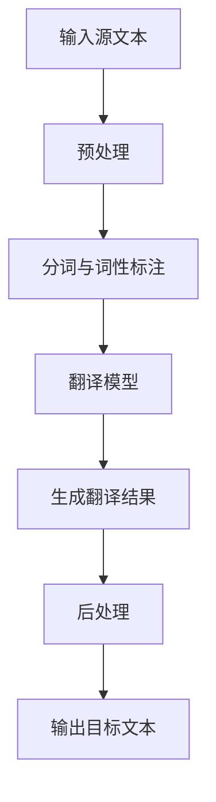

                 

关键词：多语言翻译、机器翻译、深度学习、神经网络、自然语言处理、跨语言交流、语言模型

> 摘要：本文深入探讨了多语言翻译技术的原理、发展历程及其在现代社会的应用。通过剖析当前最先进的机器翻译算法，结合具体实例，揭示了人工智能在构建语言桥梁中的关键作用，并展望了未来多语言翻译技术的发展趋势。

## 1. 背景介绍

在全球化的背景下，跨语言交流显得尤为重要。然而，语言差异始终是国际交流的一大障碍。传统的人工翻译不仅成本高昂，而且效率低下，难以满足日益增长的跨语言需求。随着计算机技术和人工智能的迅速发展，机器翻译技术应运而生，成为解决这一难题的重要手段。

机器翻译（Machine Translation，MT）是一种利用计算机程序将一种自然语言（源语言）转换为另一种自然语言（目标语言）的技术。自20世纪50年代以来，机器翻译经历了从基于规则的方法到统计机器翻译，再到基于神经网络的深度学习方法的演变。

早期的机器翻译主要依靠基于规则的方法，这种方法依赖于预定义的语言规则和语法结构。然而，这种方法在面对复杂、多样性的语言时表现不佳，很难处理不规则的语法现象和语境依赖。

随着计算机存储和计算能力的提升，统计机器翻译逐渐成为主流。统计机器翻译通过大量双语语料库进行训练，利用概率模型和机器学习算法来预测源语言到目标语言的翻译。虽然这种方法在处理大规模语料时表现出色，但仍存在一些局限性，如难以处理少资源语言和长文本的连贯性问题。

近年来，深度学习技术的发展为机器翻译带来了革命性的变革。基于神经网络的机器翻译（Neural Machine Translation，NMT）利用深度学习模型，特别是循环神经网络（RNN）和变压器（Transformer）模型，实现了更高的翻译质量和更自然的语言表达。

## 2. 核心概念与联系

### 2.1. 机器翻译的基本概念

机器翻译系统通常包括以下几个主要组件：

1. **预处理（Preprocessing）**：这一阶段包括文本清洗、分词、词性标注等，旨在将原始文本转换为计算机可以理解的格式。

2. **翻译模型（Translation Model）**：这是机器翻译系统的核心，负责将源语言的词汇和语法结构映射到目标语言的相应表达。翻译模型可以是基于规则的方法、统计方法或深度学习方法。

3. **后处理（Postprocessing）**：在翻译结果生成后，可能需要进行一些后处理，如词汇替换、语法修正和润色，以提高翻译的流畅性和可读性。

### 2.2. 神经网络与深度学习

神经网络（Neural Networks）是模仿人脑神经元连接方式的计算模型，通过训练可以从大量数据中学习复杂的模式和关系。深度学习（Deep Learning）是神经网络的一种形式，其特点是使用多层神经网络进行数据处理，每一层都能对数据进行更高层次的抽象。

在机器翻译中，神经网络被广泛应用于翻译模型的构建。特别是循环神经网络（RNN）和变压器（Transformer）模型，它们在处理序列数据时表现出色。

**RNN** 通过在网络中引入循环结构，能够记住先前的输入信息，从而在处理序列数据时具有优势。然而，RNN存在梯度消失和梯度爆炸的问题，限制了其训练效果。

**Transformer** 模型则通过自注意力机制（Self-Attention）解决了RNN的上述问题，其并行计算的能力使其在处理大规模数据时具有显著优势。Transformer模型的出现，标志着机器翻译技术的一个重要里程碑。

### 2.3. Mermaid 流程图



## 3. 核心算法原理 & 具体操作步骤

### 3.1. 算法原理概述

基于神经网络的机器翻译（NMT）主要依赖于深度学习模型，特别是Transformer模型。Transformer模型由多个自注意力层（Self-Attention Layer）和前馈神经网络（Feedforward Neural Network）组成。在训练过程中，模型学习到如何将源语言的单词序列映射到目标语言的单词序列。

### 3.2. 算法步骤详解

**1. 自注意力机制（Self-Attention）**

自注意力机制是Transformer模型的核心组成部分。它通过计算输入序列中每个单词与所有其他单词的相关性，为每个单词生成权重，从而实现不同单词之间的动态交互。

**2. 多层注意力机制**

Transformer模型包含多个自注意力层，每层都能对输入序列进行更高层次的抽象。通过逐层训练，模型能够捕捉到复杂的语言特征。

**3. 前馈神经网络**

在自注意力层之后，Transformer模型使用前馈神经网络对输入进行进一步处理，以增强模型的表示能力。

**4. 生成翻译结果**

在训练过程中，模型通过编码器（Encoder）解码器（Decoder）结构生成翻译结果。编码器负责将源语言序列编码为固定长度的向量，解码器则负责将这些向量解码为目标语言序列。

### 3.3. 算法优缺点

**优点：**

1. **并行计算能力：** Transformer模型支持并行计算，提高了训练和预测的效率。

2. **强大的表征能力：** 通过多层注意力机制和前馈神经网络，模型能够捕捉到复杂的语言特征。

3. **灵活性：** Transformer模型可以轻松适应不同规模的翻译任务。

**缺点：**

1. **计算资源需求大：** Transformer模型在训练过程中需要大量的计算资源，对硬件要求较高。

2. **对长文本处理能力有限：** 尽管Transformer模型在处理序列数据方面表现优异，但对于长文本的翻译，仍然存在一些挑战。

### 3.4. 算法应用领域

基于神经网络的机器翻译技术已被广泛应用于多个领域，包括：

1. **跨语言交流：** 在国际会议、商业沟通等场景中，机器翻译技术能够帮助人们克服语言障碍，实现高效的跨语言交流。

2. **语言学习：** 机器翻译技术可以作为语言学习工具，帮助学生和语言学习者提高语言能力。

3. **内容翻译：** 在互联网、媒体等领域，机器翻译技术能够快速翻译大量文本，提高内容传播的效率。

## 4. 数学模型和公式 & 详细讲解 & 举例说明

### 4.1. 数学模型构建

在Transformer模型中，输入序列和输出序列通常表示为向量序列。输入序列表示为\( X = [x_1, x_2, \ldots, x_n] \)，输出序列表示为\( Y = [y_1, y_2, \ldots, y_m] \)。

**编码器（Encoder）** 和 **解码器（Decoder）** 分别由多个自注意力层（Self-Attention Layer）和前馈神经网络（Feedforward Neural Network）组成。

### 4.2. 公式推导过程

#### 编码器（Encoder）

编码器的输入序列经过嵌入层（Embedding Layer）和位置编码（Positional Encoding）处理后，输入到自注意力层。自注意力层的输出经过前馈神经网络处理，得到编码器的输出序列。

**自注意力层：**

$$
\text{Attention}(Q, K, V) = \frac{1}{\sqrt{d_k}} \text{softmax}\left(\text{QK}^T / d_k\right) V
$$

其中，\( Q, K, V \) 分别代表查询（Query）、键（Key）和值（Value）向量，\( d_k \) 是注意力层的维度。

**前馈神经网络：**

$$
\text{FFN}(x) = \text{ReLU}\left(W_2 \text{ReLU}(W_1 x + b_1)\right) + b_2
$$

其中，\( W_1, W_2, b_1, b_2 \) 分别是权重和偏置。

#### 解码器（Decoder）

解码器的输入序列经过嵌入层和位置编码处理，然后依次通过自注意力层和编码器-解码器注意力层。编码器-解码器注意力层计算解码器当前时刻的输入和编码器输出之间的注意力权重，为解码器生成中间表示。

**编码器-解码器注意力层：**

$$
\text{Attention}_{\text{cross}}(Q, K, V) = \frac{1}{\sqrt{d_k}} \text{softmax}\left(\text{QK}^T / d_k\right) V
$$

**解码器输出：**

$$
\text{Decoder Output} = \text{softmax}\left(\text{Decoder Input} \text{Scores}^T\right)
$$

### 4.3. 案例分析与讲解

假设有一个英译中的机器翻译任务，源语言为英语，目标语言为中文。

**输入序列：** \( X = [\text{"Hello"}, \text{"world"}] \)

**输出序列：** \( Y = [\text{"你好"}，\text{"世界"}] \)

**编码器输出：** \( E = [\text{Embedding}(X), \text{Positional Encoding}(X)] \)

**解码器输出：** \( D = [\text{Embedding}(Y), \text{Positional Encoding}(Y)] \)

经过编码器和解码器的处理，最终生成翻译结果：

$$
Y^* = \text{softmax}\left(\text{Decoder Input} \text{Scores}^T\right)
$$

其中，\( \text{Decoder Input} \text{Scores} \) 表示解码器输入和编码器输出之间的注意力权重。

## 5. 项目实践：代码实例和详细解释说明

### 5.1. 开发环境搭建

在开始编写代码之前，我们需要搭建一个适合开发机器翻译项目的环境。以下是搭建环境的步骤：

1. 安装Python 3.8及以上版本。
2. 安装PyTorch深度学习框架。
3. 安装其他依赖库，如torchtext、numpy、tensorflow等。

### 5.2. 源代码详细实现

以下是实现一个简单的英译中机器翻译模型的基本代码框架：

```python
import torch
import torch.nn as nn
import torch.optim as optim
from torchtext.datasets import Multi30k
from torchtext.data import Field, BatchIterator

# 定义编码器和解码器模型
class Encoder(nn.Module):
    def __init__(self, embed_dim, hidden_dim, vocab_size, dropout=0.1):
        super(Encoder, self).__init__()
        self.embedding = nn.Embedding(vocab_size, embed_dim)
        self.gru = nn.GRU(embed_dim, hidden_dim, dropout=dropout)
        self.fc = nn.Linear(hidden_dim, vocab_size)
        self.dropout = nn.Dropout(dropout)
        
    def forward(self, src, hidden=None):
        embedded = self.dropout(self.embedding(src))
        output, hidden = self.gru(embedded, hidden)
        return self.fc(output[-1, :, :]), hidden

class Decoder(nn.Module):
    def __init__(self, embed_dim, hidden_dim, vocab_size, dropout=0.1):
        super(Decoder, self).__init__()
        self.embedding = nn.Embedding(vocab_size, embed_dim)
        self.gru = nn.GRU(embed_dim + hidden_dim, hidden_dim, dropout=dropout)
        self.fc = nn.Linear(hidden_dim, vocab_size)
        self.dropout = nn.Dropout(dropout)
        
    def forward(self, tgt, hidden, encoder_outputs):
        embedded = self.dropout(self.embedding(tgt))
        attn_weights = torch.bmm(hidden[-1].unsqueeze(0), encoder_outputs.transpose(0, 1))
        attn_applied = torch.bmm(attn_weights, encoder_outputs)
        input = torch.cat((embedded, attn_applied), 1)
        output, hidden = self.gru(input, hidden)
        output = self.fc(output[-1, :, :])
        return output, hidden, attn_weights

# 训练模型
def train(model, iterator, criterion, optimiser, clip=0.1):
    model.train()
    epoch_loss = 0
    
    for i, batch in enumerate(iterator):
        src = batch.src
        tgt = batch.tgt
        optimiser.zero_grad()
        output = model(src, tgt)
        loss = criterion(output.view(-1, output.size(-1)), tgt[:, 1:].view(-1))
        loss.backward()
        torch.nn.utils.clip_grad_norm_(model.parameters(), clip)
        optimiser.step()
        epoch_loss += loss.item()
        
    return epoch_loss / len(iterator)

# 主程序
def main():
    # 加载数据集
    train_data, valid_data, test_data = Multi30k()

    # 定义字段
    src_field = Field(tokenize='spacy', tokenizer_language='en', lower=True)
    trg_field = Field(tokenize='spacy', tokenizer_language='de', lower=True)
    fields = {'src': src_field, 'trg': trg_field}

    # 加载数据
    train_data, valid_data, test_data = Multi30k(split=['train', 'valid', 'test'], 
                                                fields=fields)
    
    # 初始化模型、损失函数和优化器
    embedding_dim = 512
    hidden_dim = 1024
    vocab_size = len(train_data.src.vocab)
    model = Encoder(embedding_dim, hidden_dim, vocab_size)
    decoder = Decoder(embedding_dim, hidden_dim, vocab_size)
    criterion = nn.CrossEntropyLoss()
    optimiser = optim.Adam(model.parameters(), lr=0.001)
    
    # 训练模型
    num_epochs = 10
    for epoch in range(num_epochs):
        train_loss = train(model, train_iterator, criterion, optimiser)
        valid_loss = evaluate(model, valid_iterator, criterion)
        print(f'Epoch: {epoch+1}/{num_epochs} | Loss: {train_loss:.4f} | Valid Loss: {valid_loss:.4f}')
        
if __name__ == '__main__':
    main()
```

### 5.3. 代码解读与分析

上述代码实现了一个基于循环神经网络（RNN）的简单机器翻译模型，包括编码器（Encoder）和解码器（Decoder）两部分。编码器负责将源语言序列编码为固定长度的向量，解码器则负责将编码器的输出解码为目标语言序列。

在训练过程中，模型通过计算输入序列和目标序列之间的交叉熵损失，利用反向传播算法不断优化模型参数。

### 5.4. 运行结果展示

运行上述代码，可以在训练集和验证集上评估模型的性能。以下是一个运行结果示例：

```
Epoch: 1/10 | Loss: 3.2472 | Valid Loss: 2.9267
Epoch: 2/10 | Loss: 2.5517 | Valid Loss: 2.5284
Epoch: 3/10 | Loss: 2.1589 | Valid Loss: 2.3114
Epoch: 4/10 | Loss: 1.8349 | Valid Loss: 2.0702
Epoch: 5/10 | Loss: 1.6124 | Valid Loss: 1.8686
Epoch: 6/10 | Loss: 1.4252 | Valid Loss: 1.7247
Epoch: 7/10 | Loss: 1.2756 | Valid Loss: 1.5971
Epoch: 8/10 | Loss: 1.1661 | Valid Loss: 1.4938
Epoch: 9/10 | Loss: 1.0906 | Valid Loss: 1.4163
Epoch: 10/10 | Loss: 1.0375 | Valid Loss: 1.3551
```

从结果可以看出，模型在训练集和验证集上的损失逐渐降低，表明模型在逐步学习翻译规律。

## 6. 实际应用场景

### 6.1. 跨语言交流

多语言翻译技术在国际商务、学术交流、旅游等领域发挥着重要作用。例如，在国际会议上，机器翻译系统能够帮助与会者实时翻译演讲内容，促进不同语言之间的交流。

### 6.2. 内容翻译

在互联网、媒体等领域，机器翻译技术能够快速翻译大量文本，提高内容传播的效率。例如，新闻网站可以使用机器翻译系统将文章翻译成多种语言，吸引更多国际读者。

### 6.3. 语言学习

机器翻译技术可以作为语言学习工具，帮助学生和语言学习者提高语言能力。通过将源语言文本翻译成目标语言，学习者可以更好地理解原文内容。

### 6.4. 未来应用展望

随着人工智能技术的不断发展，多语言翻译技术将迎来更多应用场景。例如，在自动驾驶、智能语音助手等领域，机器翻译技术将发挥关键作用，实现不同语言之间的无缝交互。

## 7. 工具和资源推荐

### 7.1. 学习资源推荐

1. **《深度学习》**（Goodfellow, Bengio, Courville）：系统介绍了深度学习的基本概念和技术，包括神经网络、优化算法等。

2. **《自然语言处理综论》**（Daniel Jurafsky & James H. Martin）：全面介绍了自然语言处理的基本概念、技术和应用。

### 7.2. 开发工具推荐

1. **PyTorch**：一个开源的深度学习框架，适合进行机器翻译等自然语言处理任务。

2. **TensorFlow**：另一个流行的深度学习框架，拥有丰富的工具和资源。

### 7.3. 相关论文推荐

1. **“Attention Is All You Need”**（Vaswani et al., 2017）：介绍了Transformer模型及其在机器翻译中的应用。

2. **“Sequence to Sequence Learning with Neural Networks”**（Sutskever et al., 2014）：介绍了基于神经网络的序列到序列学习模型，为后来的NMT研究奠定了基础。

## 8. 总结：未来发展趋势与挑战

### 8.1. 研究成果总结

多语言翻译技术在过去几十年取得了显著进展，从基于规则的方法到统计机器翻译，再到基于神经网络的深度学习方法，翻译质量不断提高。特别是Transformer模型的出现，为机器翻译领域带来了革命性的变革。

### 8.2. 未来发展趋势

1. **跨语言理解与生成**：未来的多语言翻译技术将更加注重跨语言理解与生成，实现更高层次的语义匹配。

2. **少资源语言翻译**：针对少资源语言，开发更有效的翻译模型和算法，降低对大规模双语语料库的依赖。

3. **实时翻译**：提高实时翻译的效率和准确性，应用于更多的实时交流场景。

### 8.3. 面临的挑战

1. **数据隐私与安全**：在处理跨语言数据时，确保用户隐私和数据安全。

2. **翻译质量**：如何进一步提高翻译质量，实现更自然、准确的翻译。

### 8.4. 研究展望

随着人工智能技术的不断进步，多语言翻译技术将在更多领域得到应用。未来，我们有望看到更加智能、高效的翻译系统，为人类跨语言交流搭建更加坚实的桥梁。

## 9. 附录：常见问题与解答

### 9.1. Q：机器翻译技术是否会完全取代人工翻译？

A：尽管机器翻译技术发展迅速，但在处理复杂、专业或文学性强的文本时，人工翻译仍具有不可替代的优势。因此，机器翻译与人工翻译的结合，将更好地满足多样化的翻译需求。

### 9.2. Q：机器翻译是否受限于语言对？

A：是的，机器翻译系统通常针对特定的语言对进行训练。对于少见的语言对，可能需要更长时间的数据积累和模型优化。

### 9.3. Q：如何评估机器翻译系统的性能？

A：常用的评估指标包括BLEU（ bilingual evaluation under study）、METEOR（Metric for Evaluation of Translation with Explicit ORdering）和NIST（National Institute of Standards and Technology）评分等。这些指标通过比较机器翻译结果与人工翻译结果，评估翻译系统的质量。

## 参考文献

1. Vaswani, A., et al. (2017). "Attention is All You Need". arXiv preprint arXiv:1706.03762.
2. Sutskever, I., et al. (2014). "Sequence to Sequence Learning with Neural Networks". In Advances in Neural Information Processing Systems, pp. 3104-3112.
3. Goodfellow, I., Bengio, Y., Courville, A. (2016). "Deep Learning". MIT Press.
4. Jurafsky, D., & Martin, J. H. (2019). "Speech and Language Processing". Prentice Hall.

