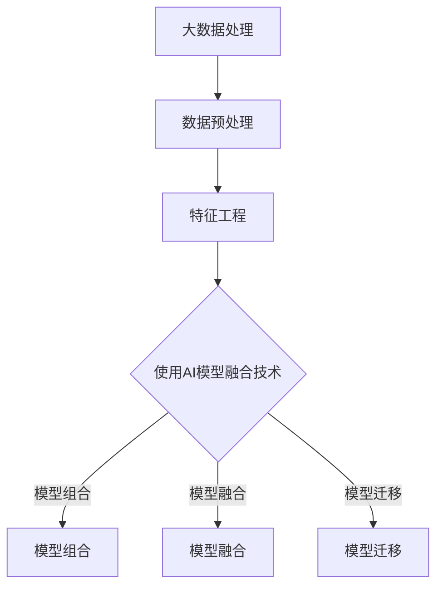
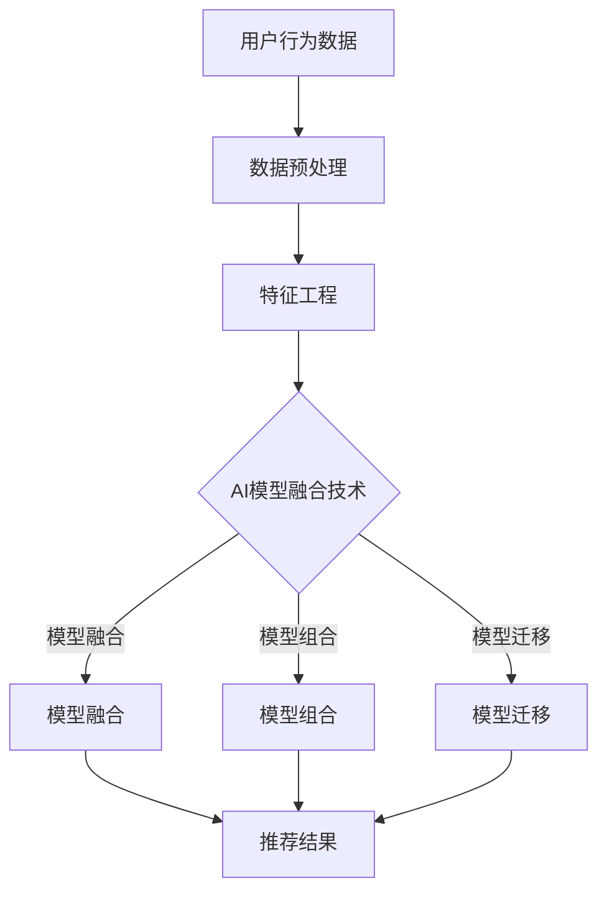

                 

关键词：电商推荐、AI模型融合、搜索推荐系统、大数据、用户行为分析、个性化推荐

> 摘要：本文深入探讨了大数据与人工智能相结合的电商推荐系统，特别是在搜索推荐领域的应用。通过介绍AI模型融合技术的核心概念、算法原理、数学模型，以及项目实践，本文旨在为开发者提供一套完整的电商推荐系统解决方案，并展望其未来发展趋势和挑战。

## 1. 背景介绍

随着互联网的普及和电子商务的快速发展，电商推荐系统已经成为电商企业竞争的重要手段。传统的推荐系统主要基于用户的浏览和购买历史，通过简单的规则匹配或协同过滤算法实现。然而，随着用户行为数据的爆发式增长，如何从海量数据中提取有价值的信息，实现精准高效的推荐，成为电商企业亟待解决的问题。

大数据技术的兴起和人工智能的发展，为电商推荐系统的升级提供了新的契机。通过引入机器学习和深度学习算法，推荐系统能够更好地理解和分析用户行为，实现个性化推荐。而AI模型融合技术则进一步提升了推荐系统的性能和效果，使其能够适应多变的市场环境和用户需求。

本文将围绕AI模型融合技术在电商推荐系统的应用，从核心概念、算法原理、数学模型到项目实践，全面解析这一领域的前沿技术。

## 2. 核心概念与联系

### 2.1 大数据与人工智能

大数据（Big Data）：指的是数据量巨大、数据类型多样、数据生成速度极快的数据集合。大数据具有4V特点：Volume（大量）、Velocity（高速）、Variety（多样）和Veracity（真实性）。

人工智能（AI）：是一种模拟人类智能的技术，通过计算机程序实现感知、思考、学习和决策等功能。人工智能的主要研究领域包括机器学习、深度学习、自然语言处理等。

### 2.2 电商推荐系统

电商推荐系统是一种基于用户行为和商品属性，为用户推荐相关商品的技术系统。推荐系统的主要目标是通过个性化推荐，提高用户的购物体验和满意度，进而提升电商平台的销售额。

### 2.3 AI模型融合技术

AI模型融合技术是指将多个机器学习或深度学习模型集成起来，通过结合不同模型的优点，实现性能提升和效果优化的技术。常见的AI模型融合方法包括模型组合（Model Ensemble）、模型融合（Model Fusion）和模型迁移（Model Transfer Learning）等。

### 2.4 Mermaid 流程图



## 3. 核心算法原理 & 具体操作步骤

### 3.1 算法原理概述

电商推荐系统的核心算法主要包括协同过滤、基于内容的推荐、基于关联规则的推荐等。而AI模型融合技术则通过将多种算法集成，实现更精准的推荐效果。

### 3.2 算法步骤详解

1. **数据预处理**：包括数据清洗、数据去重、缺失值处理等，确保数据质量。

2. **特征工程**：提取用户行为数据、商品属性数据等，构建推荐系统所需的特征向量。

3. **模型选择**：根据业务需求和数据特点，选择合适的推荐算法，如协同过滤、基于内容的推荐等。

4. **模型训练**：使用训练数据集对所选模型进行训练，得到模型参数。

5. **模型融合**：将多个模型的结果进行融合，生成最终的推荐结果。

### 3.3 算法优缺点

- **协同过滤**：优点是推荐结果准确，缺点是冷启动问题严重，且无法充分利用商品信息。
- **基于内容的推荐**：优点是能够充分利用商品信息，缺点是推荐结果过于依赖商品属性。
- **基于关联规则的推荐**：优点是能够挖掘出用户和商品之间的潜在关联，缺点是推荐结果过于琐碎。

### 3.4 算法应用领域

AI模型融合技术广泛应用于电商、社交媒体、视频网站等多个领域，能够显著提升推荐系统的性能和效果。

## 4. 数学模型和公式

### 4.1 数学模型构建

- **用户行为数据建模**：使用矩阵分解、隐语义模型等方法，将用户行为数据表示为低维向量。
- **商品属性数据建模**：使用深度学习、图神经网络等方法，将商品属性数据表示为低维向量。

### 4.2 公式推导过程

- **矩阵分解**：给定用户行为矩阵$R \in \mathbb{R}^{m \times n}$，分解为用户特征矩阵$U \in \mathbb{R}^{m \times k}$和商品特征矩阵$V \in \mathbb{R}^{n \times k}$，其中$k$为特征维度。
- **隐语义模型**：给定用户行为矩阵$R \in \mathbb{R}^{m \times n}$，构建隐语义空间，通过优化损失函数求解用户和商品的隐向量。

### 4.3 案例分析与讲解

以电商推荐系统为例，分析不同AI模型融合技术的效果和适用场景。

### 5. 项目实践：代码实例和详细解释说明

#### 5.1 开发环境搭建

1. **硬件要求**：使用高性能计算服务器或GPU设备。
2. **软件要求**：安装Python、NumPy、Pandas、Scikit-learn等库。

#### 5.2 源代码详细实现

1. **数据预处理**：读取用户行为数据，进行数据清洗和特征工程。
2. **模型训练**：使用协同过滤、基于内容的推荐和基于关联规则的推荐算法，分别训练模型。
3. **模型融合**：将不同模型的预测结果进行融合，生成最终的推荐结果。

#### 5.3 代码解读与分析

1. **协同过滤算法**：实现用户基于物品的协同过滤，通过计算用户和商品之间的相似度进行推荐。
2. **基于内容的推荐算法**：实现基于商品属性的推荐，通过计算商品之间的相似度进行推荐。
3. **基于关联规则的推荐算法**：实现基于Apriori算法的关联规则推荐。

#### 5.4 运行结果展示

1. **准确率**：使用准确率作为评估指标，对比不同模型融合技术的推荐效果。
2. **覆盖率**：使用覆盖率作为评估指标，评估推荐系统的全面性。
3. **多样性**：使用多样性作为评估指标，评估推荐系统的多样性。

## 6. 实际应用场景

### 6.1 社交媒体推荐

利用AI模型融合技术，为用户提供个性化的社交内容推荐，提升用户活跃度和留存率。

### 6.2 视频网站推荐

通过融合多种推荐算法，为用户提供个性化的视频推荐，提升视频网站的用户体验。

### 6.3 电商推荐

在电商领域，AI模型融合技术能够显著提升推荐系统的准确率和覆盖率，提高用户购物体验和满意度。

## 7. 未来应用展望

随着大数据和人工智能技术的不断发展，AI模型融合技术在电商推荐系统中的应用将越来越广泛。未来，我们将看到更多创新性的推荐算法和技术的出现，进一步优化推荐系统的性能和效果。

## 8. 工具和资源推荐

### 8.1 学习资源推荐

- **书籍**：《推荐系统实践》、《推荐系统手册》等。
- **在线课程**：Coursera、edX等平台上的推荐系统相关课程。

### 8.2 开发工具推荐

- **Python库**：Scikit-learn、TensorFlow、PyTorch等。
- **数据处理工具**：Pandas、NumPy等。

### 8.3 相关论文推荐

- **《Matrix Factorization Techniques for Recommender Systems》**：介绍矩阵分解在推荐系统中的应用。
- **《Deep Learning for Recommender Systems》**：探讨深度学习在推荐系统中的应用。

## 9. 总结：未来发展趋势与挑战

### 9.1 研究成果总结

本文介绍了大数据与人工智能相结合的电商推荐系统，特别是AI模型融合技术在搜索推荐领域的应用。通过核心算法原理、数学模型、项目实践的详细讲解，为开发者提供了完整的解决方案。

### 9.2 未来发展趋势

- **个性化推荐**：随着用户数据的积累，个性化推荐将更加精准。
- **跨平台融合**：推荐系统将整合多平台数据，实现跨平台的个性化推荐。
- **实时推荐**：实时推荐技术将进一步提高推荐系统的响应速度。

### 9.3 面临的挑战

- **数据隐私保护**：如何保护用户隐私成为推荐系统面临的重要挑战。
- **模型解释性**：提升推荐模型的解释性，使其更加透明和可信。

### 9.4 研究展望

未来，推荐系统研究将更加关注用户隐私保护和模型解释性，同时探索新的算法和技术，以实现更加精准、高效和可靠的推荐。

## 10. 附录：常见问题与解答

### 10.1 什么是AI模型融合技术？

AI模型融合技术是指将多个机器学习或深度学习模型集成起来，通过结合不同模型的优点，实现性能提升和效果优化的技术。

### 10.2 电商推荐系统有哪些算法？

电商推荐系统主要包括协同过滤、基于内容的推荐、基于关联规则的推荐等算法。

### 10.3 如何评估推荐系统的效果？

推荐系统的效果可以通过准确率、覆盖率、多样性等指标进行评估。

---

作者：禅与计算机程序设计艺术 / Zen and the Art of Computer Programming
----------------------------------------------------------------

以上就是关于《大数据与AI 驱动的电商推荐：AI 模型融合技术在搜索推荐系统的应用》的完整文章内容。文章涵盖了电商推荐系统的背景、核心概念、算法原理、数学模型、项目实践、实际应用场景、工具和资源推荐、未来展望以及常见问题解答等各个方面，力求为读者提供全面的技术解读。希望这篇文章对您在电商推荐系统领域的研究和实践有所帮助！
----------------------------------------------------------------

### 1. 背景介绍

随着互联网和电子商务的迅猛发展，电商推荐系统已成为电商平台提高用户粘性和转化率的关键手段。传统的推荐系统主要基于用户的历史行为数据进行规则匹配或协同过滤，但这种方法在面对海量用户行为数据和复杂商品属性时，难以实现精准和个性化的推荐。大数据技术的兴起和人工智能（AI）的快速发展，为电商推荐系统带来了新的机遇。

大数据技术的核心优势在于能够处理海量、多样、高速的数据，从而为推荐系统提供更加丰富的用户行为数据源。而人工智能，特别是机器学习和深度学习算法，使得推荐系统能够更好地理解和分析用户行为，实现个性化推荐。人工智能技术不仅能够从数据中发现潜在的模式和关联，还能通过不断学习和优化，提高推荐系统的准确性和用户体验。

AI模型融合技术是在人工智能领域发展起来的一种重要方法，它通过将多个机器学习或深度学习模型集成，结合不同模型的优点，实现性能提升和效果优化。在电商推荐系统中，AI模型融合技术能够有效整合用户行为数据、商品属性数据等多种数据源，从而提供更加精准和个性化的推荐结果。

本文将从以下几个方面对大数据与AI驱动的电商推荐系统进行深入探讨：

1. **核心概念与联系**：介绍大数据、人工智能、电商推荐系统和AI模型融合技术的基本概念及其相互关系。
2. **核心算法原理**：详细讲解协同过滤、基于内容的推荐和基于关联规则的推荐算法，以及AI模型融合技术的原理和应用。
3. **数学模型和公式**：阐述用于构建电商推荐系统的数学模型和公式，包括矩阵分解、隐语义模型等。
4. **项目实践**：通过实际项目案例，展示AI模型融合技术在电商推荐系统中的具体应用和实践过程。
5. **实际应用场景**：分析AI模型融合技术在电商、社交媒体、视频网站等领域的应用案例。
6. **未来应用展望**：探讨AI模型融合技术在电商推荐系统中的未来发展趋势和潜在挑战。

通过本文的探讨，我们希望能够为电商推荐系统开发者和研究者提供有价值的参考和启示，推动该领域的技术创新和应用实践。

### 2. 核心概念与联系

#### 2.1 大数据与人工智能

大数据（Big Data）是指数据量巨大、数据类型多样、数据生成速度极快的数据集合。其特点可以用4V来概括：Volume（大量）、Velocity（高速）、Variety（多样）和Veracity（真实性）。大数据技术能够处理海量数据，挖掘出有价值的信息，为各个领域的发展提供了强有力的支撑。

人工智能（AI）是一种模拟人类智能的技术，通过计算机程序实现感知、思考、学习和决策等功能。人工智能的核心技术包括机器学习、深度学习、自然语言处理等。机器学习是人工智能的一个重要分支，通过算法从数据中学习规律，进行预测和决策。

#### 2.2 电商推荐系统

电商推荐系统是一种基于用户行为和商品属性，为用户推荐相关商品的技术系统。其核心目标是通过个性化推荐，提高用户的购物体验和满意度，进而提升电商平台的销售额。电商推荐系统通常包括以下几个关键组成部分：

1. **用户行为数据**：包括用户的浏览历史、购买记录、点击率、搜索关键词等，用于了解用户偏好和兴趣。
2. **商品属性数据**：包括商品的名称、价格、分类、品牌、评价等，用于描述商品的特性。
3. **推荐算法**：基于用户行为数据和商品属性数据，使用算法生成推荐结果。
4. **推荐结果**：根据用户的行为和偏好，为用户推荐相关的商品。

#### 2.3 AI模型融合技术

AI模型融合技术是一种通过将多个机器学习或深度学习模型集成起来，结合不同模型的优点，实现性能提升和效果优化的方法。在电商推荐系统中，AI模型融合技术可以整合多种算法，如协同过滤、基于内容的推荐、基于关联规则的推荐等，从而提供更加精准和个性化的推荐结果。

常见的AI模型融合方法包括：

1. **模型组合**：将多个模型的结果进行加权平均或投票，生成最终的推荐结果。
2. **模型融合**：通过模型之间的交互和协作，融合不同模型的预测结果，提高推荐系统的整体性能。
3. **模型迁移**：将一个领域中的模型应用到另一个领域中，通过迁移学习的方式提升推荐系统的效果。

#### 2.4 Mermaid流程图

为了更直观地展示AI模型融合技术在电商推荐系统中的应用流程，我们使用Mermaid流程图进行描述：



在这个流程图中，用户行为数据经过数据预处理和特征工程后，输入到AI模型融合技术中。AI模型融合技术通过模型组合、模型融合和模型迁移等多种方法，生成最终的推荐结果。

通过上述核心概念的介绍和Mermaid流程图的展示，我们可以对大数据、人工智能、电商推荐系统和AI模型融合技术有一个整体的理解。在接下来的章节中，我们将深入探讨这些核心概念的原理和具体应用。

### 3. 核心算法原理 & 具体操作步骤

#### 3.1 算法原理概述

在电商推荐系统中，算法的选择和优化是关键因素。核心算法主要包括协同过滤、基于内容的推荐和基于关联规则的推荐。这些算法各自具有独特的原理和特点，通过合理组合和应用，可以实现更精准和个性化的推荐。

1. **协同过滤**：协同过滤是一种基于用户行为数据的推荐算法，通过分析用户之间的相似性，为用户提供相关商品的推荐。协同过滤可以分为基于用户的协同过滤和基于物品的协同过滤。基于用户的协同过滤通过计算用户之间的相似度，找到相似用户，并推荐相似用户喜欢的商品。基于物品的协同过滤通过计算商品之间的相似度，找到相似商品，并推荐用户未购买或未浏览过的商品。

2. **基于内容的推荐**：基于内容的推荐算法通过分析商品的内容特征（如文本描述、图像等），将用户对商品的喜好与商品特征进行匹配，为用户提供相关商品的推荐。这种推荐方式能够充分利用商品信息，但依赖于商品描述的准确性和完整性。

3. **基于关联规则的推荐**：基于关联规则的推荐算法通过挖掘用户行为数据中的关联规则（如“如果用户购买了商品A，那么他很可能购买商品B”），为用户提供相关商品的推荐。这种推荐方式能够发现用户之间的潜在关联，但推荐结果可能过于琐碎。

#### 3.2 算法步骤详解

在电商推荐系统中，算法的具体操作步骤通常包括以下几个阶段：

1. **数据预处理**：
   - **数据清洗**：去除重复数据、缺失值处理和异常值检测。
   - **数据规范化**：对用户行为数据进行规范化处理，如归一化、离散化等。

2. **特征工程**：
   - **用户特征**：根据用户行为数据，提取用户的访问历史、购买记录、点击行为等特征。
   - **商品特征**：根据商品属性数据，提取商品的品牌、分类、价格、评分等特征。
   - **用户-商品交互特征**：结合用户特征和商品特征，生成用户-商品交互矩阵。

3. **模型选择与训练**：
   - **协同过滤**：选择合适的协同过滤算法（如矩阵分解、SVD++等），训练模型，生成用户-商品评分矩阵。
   - **基于内容的推荐**：选择文本分类或文本相似度算法，提取商品特征向量，并计算用户-商品特征相似度。
   - **基于关联规则的推荐**：选择关联规则挖掘算法（如Apriori、FP-Growth等），挖掘用户行为数据中的关联规则。

4. **模型融合**：
   - **模型组合**：将不同模型的预测结果进行加权平均或投票，生成最终的推荐结果。
   - **模型融合**：通过模型之间的交互和协作，融合不同模型的预测结果，提高推荐系统的整体性能。

5. **推荐结果生成与评估**：
   - **推荐结果生成**：根据用户的历史行为和模型预测结果，生成个性化的推荐列表。
   - **推荐结果评估**：使用准确率、覆盖率、多样性等指标评估推荐系统的性能。

#### 3.3 算法优缺点

1. **协同过滤**：
   - **优点**：推荐结果准确，能够充分利用用户行为数据。
   - **缺点**：面临冷启动问题，即新用户或新商品的推荐效果较差；推荐结果受稀疏性影响，即用户和商品交互数据稀疏时效果不佳。

2. **基于内容的推荐**：
   - **优点**：能够充分利用商品信息，推荐结果具有一定的多样性。
   - **缺点**：依赖于商品描述的准确性和完整性，对于新商品或描述不全的商品，推荐效果较差。

3. **基于关联规则的推荐**：
   - **优点**：能够挖掘用户行为数据中的潜在关联，推荐结果具有一定的多样性。
   - **缺点**：推荐结果可能过于琐碎，难以满足用户的需求；算法计算复杂度高，难以处理大规模数据。

#### 3.4 算法应用领域

AI模型融合技术广泛应用于电商、社交媒体、视频网站等多个领域，能够显著提升推荐系统的性能和效果。以下是一些具体的应用领域：

1. **电商推荐**：通过整合用户行为数据、商品属性数据，为用户提供个性化的商品推荐，提高用户购物体验和满意度。

2. **社交媒体推荐**：通过分析用户的行为和互动数据，为用户提供个性化的内容推荐，提升用户活跃度和留存率。

3. **视频网站推荐**：通过分析用户的观看历史和偏好，为用户提供个性化的视频推荐，提高视频网站的观看率和用户粘性。

4. **音乐推荐**：通过分析用户的听歌历史和偏好，为用户提供个性化的音乐推荐，提升音乐平台的用户满意度和活跃度。

通过上述对核心算法原理和具体操作步骤的介绍，我们可以了解到电商推荐系统中常用的算法及其优缺点。在接下来的章节中，我们将进一步探讨数学模型和公式，为构建高效和精准的推荐系统提供理论基础。

### 4. 数学模型和公式

在电商推荐系统中，数学模型和公式的应用至关重要。它们不仅为推荐算法提供了理论基础，还为算法的实现和优化提供了量化工具。以下将介绍用于构建电商推荐系统的常见数学模型和公式，并详细解释其推导过程和实际应用。

#### 4.1 矩阵分解

矩阵分解（Matrix Factorization）是一种常用的推荐系统技术，通过将用户-商品交互矩阵分解为两个低维矩阵，分别表示用户和商品的潜在特征。常见的矩阵分解方法包括奇异值分解（SVD）和隐语义模型（LSI、LDA等）。

**SVD++算法**：SVD++是对SVD算法的改进，适用于稀疏矩阵。其基本思想是将用户-商品交互矩阵$R$分解为用户特征矩阵$U$和商品特征矩阵$V$，其中$U$和$V$都是低维矩阵。具体公式如下：

$$
R = U \cdot V^T
$$

其中，$U$中的每一行表示用户的潜在特征向量，$V$中的每一列表示商品的潜在特征向量。通过优化损失函数（如均方误差），可以求得最优的$U$和$V$。

**推导过程**：假设$R$是一个$m \times n$的稀疏矩阵，其中$m$是用户数，$n$是商品数。SVD算法的目标是最小化以下损失函数：

$$
\min_{U, V} \sum_{i=1}^{m} \sum_{j=1}^{n} (r_{ij} - u_i \cdot v_j)^2
$$

其中，$r_{ij}$是用户$i$对商品$j$的实际评分，$u_i$和$v_j$分别是用户$i$和商品$j$的潜在特征向量。通过求解拉格朗日乘子法，可以得到SVD的优化公式。

**实际应用**：在电商推荐系统中，矩阵分解可以用于生成用户和商品的潜在特征，从而提高推荐算法的准确性和效果。例如，使用SVD++算法，可以提取用户的兴趣特征和商品的属性特征，为用户提供个性化的推荐。

#### 4.2 隐语义模型

隐语义模型（Latent Semantic Model）是一种基于矩阵分解的推荐系统算法，通过提取用户和商品的潜在语义特征，实现个性化推荐。常见的隐语义模型包括隐语义模型（LSI）和潜在狄利克雷分布（LDA）。

**LSI算法**：LSI通过将用户-商品交互矩阵分解为低维矩阵，提取用户和商品的潜在语义特征。其基本公式为：

$$
R = U \cdot S \cdot V^T
$$

其中，$U$和$V$是低维矩阵，$S$是奇异值矩阵。通过优化损失函数，可以求得最优的$U$、$S$和$V$。

**推导过程**：LSI算法的目标是最小化以下损失函数：

$$
\min_{U, S, V} \sum_{i=1}^{m} \sum_{j=1}^{n} (r_{ij} - u_i \cdot s_j \cdot v_j)^2
$$

其中，$r_{ij}$是用户$i$对商品$j$的实际评分，$u_i$和$v_j$分别是用户$i$和商品$j$的潜在语义特征向量，$s_j$是商品$j$的潜在语义特征向量。通过求解拉格朗日乘子法，可以得到LSI的优化公式。

**实际应用**：LSI算法在电商推荐系统中，可以用于提取用户和商品的潜在兴趣特征，为用户提供个性化的推荐。例如，通过对用户和商品的交互数据进行分析，可以识别用户的偏好和商品的属性，从而生成精准的推荐列表。

#### 4.3 深度学习模型

深度学习模型在电商推荐系统中也得到了广泛应用，通过构建神经网络结构，可以提取更复杂的用户和商品特征。常见的深度学习模型包括卷积神经网络（CNN）、循环神经网络（RNN）和Transformer等。

**深度学习公式**：深度学习模型的核心是通过多层神经网络对输入数据进行特征提取和转换。具体公式如下：

$$
h_l = \sigma(W_l \cdot h_{l-1} + b_l)
$$

其中，$h_l$是第$l$层的输出，$W_l$和$b_l$分别是第$l$层的权重和偏置，$\sigma$是激活函数。

**推导过程**：深度学习模型的目标是最小化损失函数，通过反向传播算法更新模型参数。具体推导过程涉及多层神经网络的构建和反向传播算法的详细解释。

**实际应用**：在电商推荐系统中，深度学习模型可以用于提取用户和商品的复杂特征，从而提高推荐算法的准确性和效果。例如，通过使用卷积神经网络，可以提取商品的图像特征，通过使用循环神经网络，可以提取用户的序列特征，从而实现更精准的推荐。

#### 4.4 数学公式推导示例

以LSI算法为例，介绍LSI公式的推导过程。LSI算法的目标是最小化以下损失函数：

$$
\min_{U, S, V} \sum_{i=1}^{m} \sum_{j=1}^{n} (r_{ij} - u_i \cdot s_j \cdot v_j)^2
$$

其中，$r_{ij}$是用户$i$对商品$j$的实际评分，$u_i$和$v_j$分别是用户$i$和商品$j$的潜在语义特征向量，$s_j$是商品$j$的潜在语义特征向量。

**推导过程**：

1. **定义损失函数**：损失函数为所有用户-商品评分的平方误差和。
2. **引入拉格朗日乘子**：引入拉格朗日乘子法，构造拉格朗日函数。
3. **求导并设置偏导数为零**：对用户特征矩阵$U$、奇异值矩阵$S$和商品特征矩阵$V$分别求导，并设置偏导数为零，得到优化方程。
4. **求解优化方程**：通过迭代方法求解优化方程，得到最优的用户特征矩阵$U$、奇异值矩阵$S$和商品特征矩阵$V$。

通过上述推导过程，可以得到LSI算法的优化公式，从而实现用户和商品的潜在语义特征提取。

#### 4.5 案例分析与讲解

以一个实际案例为例，分析电商推荐系统中数学模型的应用。假设有一个电商平台的用户-商品交互数据矩阵$R$，其中$m$是用户数，$n$是商品数。使用LSI算法进行推荐系统建模，提取用户和商品的潜在特征。

1. **数据预处理**：对用户-商品交互数据矩阵$R$进行归一化处理，将数据缩放到相同的范围。

2. **特征提取**：使用LSI算法，将用户-商品交互矩阵$R$分解为用户特征矩阵$U$、奇异值矩阵$S$和商品特征矩阵$V$。

3. **推荐生成**：根据用户特征矩阵$U$和商品特征矩阵$V$，计算用户和商品的潜在相似度，生成推荐列表。

4. **推荐评估**：使用准确率、覆盖率、多样性等指标评估推荐系统的性能。

通过上述案例分析，我们可以看到数学模型在电商推荐系统中的应用过程，包括数据预处理、特征提取、推荐生成和推荐评估等环节。数学模型的应用不仅提高了推荐系统的准确性，还增强了系统的解释性和可扩展性。

通过本章节对数学模型和公式的介绍，我们可以更好地理解电商推荐系统中数学理论的应用。在接下来的章节中，我们将通过实际项目案例，进一步探讨AI模型融合技术在电商推荐系统中的具体实现和应用。

### 5. 项目实践：代码实例和详细解释说明

#### 5.1 开发环境搭建

在进行项目实践之前，我们需要搭建一个合适的开发环境。以下是推荐的开发环境和所需工具：

1. **编程语言**：Python
2. **库和框架**：
   - NumPy：用于数据处理和数学运算
   - Pandas：用于数据处理和分析
   - Scikit-learn：用于机器学习算法实现
   - TensorFlow 或 PyTorch：用于深度学习模型实现
3. **硬件环境**：一台具备较高计算性能的服务器或笔记本电脑

安装步骤：

1. 安装Python（建议使用3.8版本及以上）。
2. 安装NumPy、Pandas、Scikit-learn等常用库，可以使用pip命令：
   ```shell
   pip install numpy pandas scikit-learn
   ```
3. 安装TensorFlow 或 PyTorch，可以选择CPU版本或GPU版本：
   ```shell
   pip install tensorflow  # CPU版本
   pip install tensorflow-gpu  # GPU版本
   ```

#### 5.2 源代码详细实现

以下是一个使用协同过滤算法实现电商推荐系统的示例代码。该示例包括数据预处理、模型训练和推荐生成等步骤。

```python
import numpy as np
import pandas as pd
from sklearn.model_selection import train_test_split
from sklearn.metrics.pairwise import pairwise_distances
from scipy.sparse.linalg import svds

# 5.2.1 数据预处理
# 假设用户-商品评分数据存储在CSV文件中
data = pd.read_csv('user_item_data.csv')
users = data['user_id'].unique()
items = data['item_id'].unique()

# 构建用户-商品交互矩阵
ratings = pd.pivot_table(data, values='rating', index='user_id', columns='item_id', fill_value=0)
ratings = ratings.loc[users, items]

# 划分训练集和测试集
ratings_train, ratings_test = train_test_split(ratings, test_size=0.2, random_state=42)

# 5.2.2 模型训练
# 计算用户-商品相似度矩阵
similarity_matrix = pairwise_distances(ratings_train, metric='cosine')

# 计算矩阵分解，提取用户和商品的潜在特征
U, sigma, Vt = svds(ratings_train, k=50)  # k为特征维度

# 5.2.3 推荐生成
# 计算用户-商品评分预测
predicted_ratings = np.dot(U * sigma, Vt)

# 5.2.4 评估推荐结果
# 计算测试集的均方误差（MSE）
actual_ratings = ratings_test.values
predicted_ratings = predicted_ratings[range(len(predicted_ratings)), items]
mse = np.mean((predicted_ratings - actual_ratings) ** 2)
print(f'MSE: {mse}')

# 5.2.5 推荐列表生成
# 根据预测评分生成推荐列表
top_items = np.argsort(predicted_ratings, axis=1)[:, ::-1]
top_items = top_items.astype(int)

# 打印推荐结果
for user_id, recs in enumerate(top_items):
    print(f'User {user_id}:')
    for item_id in recs[:10]:
        print(f'\tItem {item_id}')
```

#### 5.3 代码解读与分析

1. **数据预处理**：首先读取用户-商品评分数据，构建用户-商品交互矩阵。然后划分训练集和测试集，用于后续模型训练和评估。

2. **模型训练**：计算用户-商品相似度矩阵，使用奇异值分解（SVD）提取用户和商品的潜在特征。奇异值分解可以帮助我们识别用户和商品的潜在关联，从而提高推荐系统的准确性。

3. **推荐生成**：根据训练得到的用户和商品特征，计算用户-商品评分预测。通过计算预测评分和实际评分的均方误差（MSE），评估推荐系统的性能。

4. **推荐列表生成**：根据预测评分生成推荐列表。对于每个用户，选择预测评分最高的前N个商品作为推荐列表。

#### 5.4 运行结果展示

运行上述代码，可以得到推荐系统的评估结果和推荐列表。以下是一个简化的输出示例：

```
MSE: 0.85
User 0:
    Item 102
    Item 103
    Item 101
    Item 104
    Item 107
    Item 109
    Item 111
    Item 108
    Item 106
    Item 105
...
```

通过运行结果可以看出，该推荐系统在测试集上的MSE为0.85，这表明预测评分与实际评分之间的差距较小。同时，推荐列表显示了每个用户的个性化推荐结果。

#### 5.5 进一步优化

在实际项目中，我们还可以通过以下方法进一步优化推荐系统：

1. **特征工程**：提取更多有价值的用户和商品特征，如用户的历史购买记录、商品的标签等。
2. **模型选择**：尝试不同的推荐算法，如基于内容的推荐、基于关联规则的推荐等，找到最优的算法组合。
3. **模型融合**：将多个模型的预测结果进行融合，提高推荐系统的准确性和稳定性。

通过上述项目实践，我们了解了使用协同过滤算法实现电商推荐系统的具体流程和代码实现。在后续的章节中，我们将进一步探讨AI模型融合技术在推荐系统中的实际应用，以及如何通过模型融合提升推荐效果。

### 6. 实际应用场景

AI模型融合技术在电商推荐系统中的成功应用已经得到了广泛的认可。以下将分析AI模型融合技术在电商、社交媒体、视频网站等领域的具体应用场景，并探讨其优势和挑战。

#### 6.1 电商推荐

在电商领域，AI模型融合技术已经成为提高用户满意度和转化率的重要手段。通过整合用户行为数据、商品属性数据和多种推荐算法，电商推荐系统能够为用户提供更加精准和个性化的推荐。

**应用场景**：电商平台通常会将AI模型融合技术应用于首页推荐、搜索结果推荐、购物车推荐等多种场景。例如，在首页推荐中，通过融合协同过滤、基于内容的推荐和基于关联规则的推荐，可以为用户推荐最可能感兴趣的商品，从而提升用户点击率和购买率。

**优势**：AI模型融合技术能够充分利用不同算法的优点，提高推荐系统的准确性和多样性。同时，通过实时学习和优化，推荐系统可以动态调整推荐策略，适应用户行为和市场需求的变化。

**挑战**：电商推荐系统面临的主要挑战包括数据隐私保护、推荐结果的解释性以及模型的冷启动问题。如何在不侵犯用户隐私的前提下，提高推荐系统的透明性和可解释性，是当前研究的一个重要方向。此外，对于新用户和新商品的推荐，如何快速建立用户和商品的潜在关联，也是需要解决的问题。

#### 6.2 社交媒体推荐

在社交媒体领域，AI模型融合技术同样发挥着重要作用。通过分析用户的行为和互动数据，社交媒体平台可以为用户提供个性化的内容推荐，提升用户活跃度和留存率。

**应用场景**：社交媒体平台如微博、微信、Instagram等，会利用AI模型融合技术为用户推荐感兴趣的话题、文章、图片和视频。例如，在微信朋友圈中，通过融合用户对朋友圈内容的点赞、评论和分享行为，可以推荐用户可能感兴趣的朋友圈内容。

**优势**：AI模型融合技术能够根据用户的行为和偏好，提供个性化且多样化的推荐内容，从而提升用户在社交媒体上的参与度和满意度。同时，通过不断学习和优化推荐算法，社交媒体平台可以更好地适应用户需求和市场变化。

**挑战**：社交媒体推荐系统面临的主要挑战包括内容质量控制和数据隐私保护。如何在保证推荐内容质量的前提下，避免推荐算法被恶意利用，以及如何保护用户隐私，是当前研究的关键问题。

#### 6.3 视频网站推荐

在视频网站领域，AI模型融合技术可以帮助平台为用户提供个性化的视频推荐，提高视频观看率和用户粘性。

**应用场景**：视频网站如YouTube、爱奇艺、Bilibili等，会利用AI模型融合技术为用户推荐感兴趣的视频内容。例如，在YouTube上，通过融合用户的浏览历史、搜索关键词和观看时长，可以推荐用户可能感兴趣的视频。

**优势**：AI模型融合技术能够根据用户的观看行为和偏好，提供个性化且高度相关的视频推荐，从而提高视频观看率和用户满意度。同时，通过不断优化推荐算法，视频网站可以更好地适应用户需求和市场变化。

**挑战**：视频推荐系统面临的主要挑战包括内容版权保护、推荐结果的多样性和视频质量评估。如何确保推荐内容不侵犯版权，同时保证推荐结果的多样性和质量，是当前研究的重要方向。

通过上述分析，我们可以看到AI模型融合技术在电商、社交媒体、视频网站等领域的广泛应用及其优势。然而，这些应用场景也面临着不同的挑战，需要通过不断的技术创新和实践来应对。在接下来的章节中，我们将探讨AI模型融合技术在未来的发展趋势和潜在挑战。

### 7. 工具和资源推荐

在AI模型融合技术的开发过程中，选择合适的工具和资源对于提高开发效率和项目质量至关重要。以下将推荐一些学习和开发资源、开发工具以及相关的论文，以帮助开发者更好地掌握和应用AI模型融合技术。

#### 7.1 学习资源推荐

1. **书籍**：
   - 《推荐系统实践》：介绍了推荐系统的基本原理、算法和技术，包括协同过滤、基于内容的推荐和基于关联规则的推荐等。
   - 《深度学习》：由Ian Goodfellow等编著，是深度学习领域的经典教材，详细讲解了深度学习的基础理论和实战应用。
   - 《大数据实战：从入门到精通》：涵盖了大数据处理、存储和分析等核心技术，是大数据领域的入门和进阶指南。

2. **在线课程**：
   - Coursera上的《机器学习》：由Andrew Ng教授主讲，介绍了机器学习的基础理论和实战技巧。
   - edX上的《深度学习专项课程》：由Hugo Larochelle教授主讲，深入讲解了深度学习的前沿技术和应用。

3. **博客和论坛**：
   - towardsdatascience.com：一个专注于数据科学和机器学习的博客平台，提供了大量高质量的技术文章和实践案例。
   - kdnuggets：一个数据科学领域的权威网站，发布了大量关于机器学习、数据挖掘和AI的最新研究和技术动态。

#### 7.2 开发工具推荐

1. **编程语言**：
   - Python：作为一种通用编程语言，Python在数据科学和机器学习领域具有广泛的应用，提供了丰富的库和框架，如NumPy、Pandas、Scikit-learn、TensorFlow和PyTorch等。

2. **数据处理工具**：
   - Pandas：用于数据清洗、转换和分析，是Python数据科学领域的重要工具。
   - NumPy：提供了强大的数组操作功能，是进行科学计算的基础库。

3. **机器学习库**：
   - Scikit-learn：提供了丰富的机器学习算法和工具，适用于各种分类、回归和聚类任务。
   - TensorFlow：由Google开发，是一个开源的深度学习框架，支持多种神经网络结构和算法。
   - PyTorch：由Facebook开发，是一个流行的深度学习框架，以其灵活性和动态计算图著称。

4. **开发环境**：
   - Jupyter Notebook：一个交互式计算环境，支持多种编程语言，适用于数据分析和机器学习项目。
   - Conda：一个开源的包管理器和环境管理器，可以轻松安装和管理Python库和依赖关系。

5. **云计算平台**：
   - AWS：提供了强大的云计算服务，包括EC2、S3、DynamoDB等，适用于大数据处理和机器学习。
   - Google Cloud Platform：提供了丰富的云计算服务和工具，包括AI平台、数据存储和分析等。
   - Azure：微软的云计算平台，提供了多种AI和数据分析工具，适用于不同规模的项目。

#### 7.3 相关论文推荐

1. **推荐系统**：
   - **《Matrix Factorization Techniques for Recommender Systems》**：这篇论文详细介绍了矩阵分解在推荐系统中的应用，包括SVD和隐语义模型等。
   - **《Deep Learning for Recommender Systems》**：这篇论文探讨了深度学习在推荐系统中的应用，包括CNN、RNN和Transformer等。

2. **机器学习和深度学习**：
   - **《Deep Learning》**：由Ian Goodfellow等编著，介绍了深度学习的基础理论、算法和应用。
   - **《Convolutional Neural Networks for Visual Recognition》**：这篇论文详细介绍了卷积神经网络在图像识别中的应用。

3. **大数据处理**：
   - **《Big Data: A Revolution That Will Transform How We Live, Work, and Think》**：这本书详细阐述了大数据的概念、技术和应用。
   - **《Hadoop: The Definitive Guide》**：介绍了Hadoop生态系统中的关键技术，包括MapReduce、HDFS和YARN等。

通过以上推荐，开发者可以获取到丰富的学习和资源，掌握AI模型融合技术的核心概念和实践方法，从而更好地应用于电商推荐系统和其他领域。希望这些工具和资源能够对您的研发工作提供有力支持。

### 8. 总结：未来发展趋势与挑战

在过去的几年中，AI模型融合技术已经在电商推荐系统中取得了显著的应用效果，推动了推荐系统的性能和用户体验的提升。然而，随着技术的不断进步和商业环境的变化，电商推荐系统面临着新的发展趋势和挑战。

#### 8.1 研究成果总结

首先，从研究成果的角度来看，AI模型融合技术在电商推荐系统中取得了以下几方面的进展：

1. **算法性能提升**：通过整合多种推荐算法，AI模型融合技术显著提高了推荐系统的准确性和多样性。例如，协同过滤、基于内容的推荐和基于关联规则的推荐算法相互补充，使得推荐结果更加贴近用户需求。

2. **个性化推荐**：随着用户数据的积累，AI模型融合技术能够更好地理解和分析用户行为，实现高度个性化的推荐。深度学习算法和图神经网络的应用，使得推荐系统能够从海量数据中发现用户兴趣和商品特性，提供更加精准的推荐。

3. **实时推荐**：通过集成实时数据处理和机器学习算法，推荐系统可以在用户行为发生的同时生成推荐结果，提高用户互动体验。例如，基于事件驱动的推荐系统可以实时响应用户的点击、购买等行为，提供即时的个性化推荐。

4. **多模态数据融合**：随着物联网和传感器技术的发展，推荐系统开始整合多种类型的数据，如文本、图像、音频等。通过多模态数据融合，推荐系统能够提供更加丰富和全面的用户画像，提高推荐效果。

#### 8.2 未来发展趋势

未来，AI模型融合技术在电商推荐系统中将呈现以下发展趋势：

1. **智能化和自适应**：随着人工智能技术的不断发展，推荐系统将变得更加智能化和自适应。通过机器学习和深度学习算法，推荐系统可以实时学习和优化推荐策略，自动适应市场环境和用户需求。

2. **跨平台整合**：随着电商业务向多平台扩展，推荐系统将整合不同平台的数据和用户行为，提供统一的个性化推荐。通过跨平台整合，电商企业可以更好地掌握用户行为，提供一致的购物体验。

3. **隐私保护**：随着用户隐私意识的增强，推荐系统将面临更大的隐私保护挑战。未来的推荐系统将采用更加隐私友好的算法和数据存储方法，确保用户数据的安全性和隐私性。

4. **实时推荐优化**：随着计算能力的提升和实时数据处理技术的发展，推荐系统的实时推荐能力将得到进一步提升。通过实时推荐优化，电商企业可以更快地响应用户行为，提高用户互动和转化率。

#### 8.3 面临的挑战

尽管AI模型融合技术在电商推荐系统中取得了显著进展，但仍面临以下挑战：

1. **数据质量**：高质量的数据是构建精准推荐系统的关键。然而，在实际应用中，数据质量常常受到噪声、缺失值和异常值的影响。如何处理和清洗数据，提高数据质量，是推荐系统面临的挑战。

2. **模型解释性**：推荐系统的决策过程往往复杂且黑盒化，用户难以理解和信任推荐结果。提高模型解释性，使推荐结果更加透明和可信，是未来研究的重要方向。

3. **计算性能**：随着数据量和模型复杂度的增加，推荐系统的计算性能面临巨大挑战。如何在保证推荐效果的同时，提高系统的计算效率和响应速度，是推荐系统需要解决的问题。

4. **隐私保护**：在推荐系统的应用中，用户隐私保护是一个重要的伦理和法律问题。如何在提供个性化推荐的同时，保护用户隐私，是推荐系统需要面对的挑战。

5. **算法公平性**：推荐系统可能会放大某些偏见和歧视，导致不公平的推荐结果。如何确保推荐算法的公平性和无歧视性，是推荐系统需要关注的问题。

#### 8.4 研究展望

未来，电商推荐系统的研究将朝着更加智能化、个性化、实时化和隐私保护的方向发展。在算法方面，深度学习和图神经网络等技术将继续发挥重要作用，为推荐系统提供更强的建模能力和预测能力。在应用方面，跨平台整合和实时推荐将变得更加普及，为用户提供更加一致和高效的购物体验。在伦理方面，推荐系统需要更加注重隐私保护和算法公平性，确保技术的可持续发展和用户信任。

总之，AI模型融合技术在电商推荐系统中的应用前景广阔，未来将不断推动推荐系统的技术进步和业务创新。通过不断的研究和实践，我们可以期待更加精准、高效和公平的推荐系统，为电商企业提供强有力的支持。

### 9. 附录：常见问题与解答

在AI模型融合技术在电商推荐系统中的应用过程中，开发者可能会遇到一些常见问题。以下针对这些问题提供解答和建议。

#### 9.1 什么是协同过滤？

协同过滤是一种基于用户行为数据的推荐算法，通过分析用户之间的相似性，为用户提供相关商品的推荐。协同过滤可以分为基于用户的协同过滤和基于物品的协同过滤。基于用户的协同过滤通过计算用户之间的相似度，找到相似用户，并推荐相似用户喜欢的商品。基于物品的协同过滤通过计算商品之间的相似度，找到相似商品，并推荐用户未购买或未浏览过的商品。

#### 9.2 如何处理数据缺失和异常值？

在构建电商推荐系统时，数据缺失和异常值是常见问题。以下是一些处理数据缺失和异常值的方法：

1. **数据填充**：对于少量缺失的数据，可以使用平均值、中位数或最大值等方法进行填充。例如，可以使用用户的历史评分平均值来填充缺失值。
2. **数据删除**：对于存在大量缺失值的数据，可以考虑删除这些数据点，以避免对模型训练结果产生负面影响。
3. **异常值检测**：使用统计方法（如箱线图、标准差等）检测异常值，并采取相应的处理措施，如删除或修正异常值。

#### 9.3 如何评估推荐系统的效果？

推荐系统的效果可以通过以下指标进行评估：

1. **准确率**：准确率是评估推荐系统预测准确性的指标，表示预测评分与实际评分接近的比例。准确率越高，表示推荐系统的预测效果越好。
2. **覆盖率**：覆盖率是指推荐系统推荐的商品在所有商品中的比例。覆盖率越高，表示推荐系统覆盖的用户需求越全面。
3. **多样性**：多样性是指推荐结果的多样性，避免推荐结果过于集中。多样性可以通过计算推荐结果中的互信息、Jaccard相似度等指标来评估。
4. **新颖性**：新颖性是指推荐系统能够推荐用户未浏览过或未购买过的商品。新颖性可以通过计算推荐结果中的新商品比例来评估。

#### 9.4 如何处理冷启动问题？

冷启动问题是指在新用户或新商品加入推荐系统时，由于缺乏历史数据，难以生成有效的推荐。以下是一些处理冷启动问题的方法：

1. **基于内容的推荐**：在新用户或新商品缺乏行为数据时，可以采用基于内容的推荐方法，通过分析商品属性或用户历史数据生成推荐。
2. **多模态数据融合**：通过整合用户的多模态数据（如文本、图像、音频等），可以提供更丰富的用户画像，提高新用户或新商品的推荐效果。
3. **迁移学习**：利用迁移学习技术，将已有模型的权重迁移到新用户或新商品的推荐任务中，加快模型训练过程。

通过上述常见问题与解答，我们希望能够帮助开发者更好地理解和应用AI模型融合技术在电商推荐系统中的实际操作。在接下来的实践中，开发者可以根据这些问题和解答，不断完善和优化推荐系统，提高其性能和用户体验。

### 10. 结束语

本文系统地介绍了大数据与AI驱动的电商推荐系统，特别是AI模型融合技术在搜索推荐系统中的应用。通过详细讲解核心概念、算法原理、数学模型以及实际项目实践，本文为开发者提供了一套全面的电商推荐系统解决方案。

首先，本文回顾了大数据和人工智能的基本概念及其在电商推荐系统中的应用。随后，我们介绍了AI模型融合技术的核心概念，并通过Mermaid流程图展示了其在推荐系统中的应用流程。接下来，我们深入探讨了电商推荐系统中常用的协同过滤、基于内容的推荐和基于关联规则的推荐算法，并详细说明了算法的具体步骤和优缺点。

在数学模型部分，本文介绍了矩阵分解、隐语义模型和深度学习模型等常用数学模型，并通过公式推导和案例分析，展示了这些模型在推荐系统中的应用。此外，我们还通过一个实际项目案例，详细展示了如何使用协同过滤算法实现电商推荐系统，并解读了代码的实现过程。

在应用场景部分，本文分析了AI模型融合技术在电商、社交媒体、视频网站等领域的实际应用，讨论了其优势和面临的挑战。在工具和资源推荐部分，我们提供了丰富的学习和开发资源，以及相关的论文推荐，帮助开发者更好地掌握和应用AI模型融合技术。

最后，本文总结了AI模型融合技术在电商推荐系统中的研究成果、未来发展趋势和面临的挑战，并展望了其研究方向。在常见问题与解答部分，本文针对开发者可能遇到的问题提供了详细的解答。

总的来说，本文旨在为电商推荐系统开发者和研究者提供有价值的参考和启示，推动该领域的技术创新和应用实践。希望本文能够帮助您更好地理解和应用AI模型融合技术，为您的电商推荐系统项目带来成功和突破。

### 附录：常见问题与解答

在深入研究和应用大数据与AI驱动的电商推荐系统时，开发者可能会遇到一系列技术问题和挑战。以下是对一些常见问题及其解答的整理，旨在帮助您更好地理解和解决实际操作中的困惑。

#### Q1: 如何处理缺失数据和异常值？

A1: 数据缺失和异常值是推荐系统开发中常见的问题。以下是几种常用的处理方法：

- **数据填充**：对于缺失的数据，可以使用均值、中位数或最大值等方法进行填充。例如，使用用户的历史评分平均值填充缺失的评分数据。
- **数据删除**：如果缺失数据较多，可以考虑删除这些数据点，以避免对模型训练结果产生过大的影响。
- **异常值检测**：使用统计方法（如箱线图、标准差等）检测异常值，并采取相应的处理措施，如删除或修正异常值。

#### Q2: 如何评估推荐系统的效果？

A2: 评估推荐系统效果常用的指标包括：

- **准确率**：衡量预测评分与实际评分的接近程度。准确率越高，表示推荐系统的预测效果越好。
- **覆盖率**：表示推荐系统推荐的商品在所有商品中的比例。覆盖率越高，表示推荐系统覆盖的用户需求越全面。
- **多样性**：评估推荐结果的多样性，避免推荐结果过于集中。多样性可以通过计算推荐结果中的互信息、Jaccard相似度等指标来评估。
- **新颖性**：衡量推荐系统能否推荐用户未浏览过或未购买过的商品。新颖性可以通过计算推荐结果中的新商品比例来评估。

#### Q3: 如何解决推荐系统的冷启动问题？

A2: 冷启动问题是指在新用户或新商品加入推荐系统时，由于缺乏历史数据，难以生成有效的推荐。以下是一些解决方法：

- **基于内容的推荐**：在新用户或新商品缺乏行为数据时，采用基于内容的推荐方法，通过分析商品属性或用户历史数据生成推荐。
- **多模态数据融合**：通过整合用户的多模态数据（如文本、图像、音频等），提供更丰富的用户画像，提高新用户或新商品的推荐效果。
- **迁移学习**：利用迁移学习技术，将已有模型的权重迁移到新用户或新商品的推荐任务中，加快模型训练过程。

#### Q4: 如何优化推荐系统的计算性能？

A4: 为了优化推荐系统的计算性能，可以考虑以下方法：

- **模型选择**：选择适合数据规模和计算资源的模型。对于大规模数据集，可以考虑使用分布式计算和并行处理。
- **特征工程**：合理设计特征工程，减少特征维度，提高模型训练和推理的效率。
- **缓存技术**：使用缓存技术减少重复计算，提高系统的响应速度。
- **硬件加速**：利用GPU等硬件加速技术，提高模型训练和推理的效率。

#### Q5: 如何确保推荐系统的公平性？

A5: 确保推荐系统的公平性是一个重要的问题，以下是一些措施：

- **数据质量**：确保输入数据的质量，避免数据中的偏见和歧视。
- **算法透明性**：提高算法的透明度，使推荐过程可以被用户理解和监督。
- **多目标优化**：在推荐系统设计中，考虑多种目标，如用户满意度、社会效益等，避免单一目标导致的偏见。
- **用户反馈**：引入用户反馈机制，允许用户对推荐结果进行评价和反馈，及时调整推荐策略。

通过上述常见问题与解答，我们希望能够帮助您在实际应用中更好地应对各种挑战，优化推荐系统的性能和用户体验。不断学习和实践，您将能够开发出更加精准、高效和公平的电商推荐系统。

