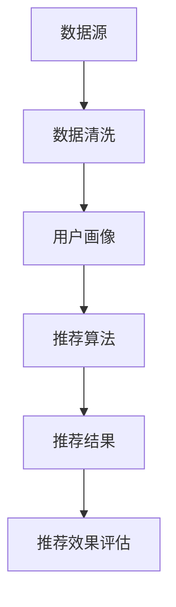

                 

关键词：大数据、人工智能、电商搜索、推荐系统、用户体验、转化率、忠诚度

摘要：随着互联网技术的飞速发展，电商行业日益繁荣。然而，如何在海量商品信息中提供精准的搜索推荐，以提升用户体验、转化率和忠诚度，成为电商企业关注的焦点。本文旨在探讨大数据与AI技术在电商搜索推荐中的应用，以实现以用户体验为中心的目标。

## 1. 背景介绍

电商搜索推荐作为电商平台的“门面”，直接影响到用户在平台上的购物体验。传统搜索推荐系统往往依赖于关键词匹配，难以满足用户个性化的需求。随着大数据和人工智能技术的不断发展，以AI为核心驱动的电商搜索推荐系统应运而生，为电商平台带来了前所未有的变革。

### 1.1 电商搜索推荐的重要性

电商搜索推荐系统是电商平台的核心竞争力之一。通过精准的搜索推荐，可以帮助用户快速找到所需商品，提高购物效率，从而提升用户满意度和忠诚度。同时，搜索推荐系统还可以为电商平台带来更多的流量和销售额。

### 1.2 大数据和AI技术的优势

大数据技术具有数据量大、多样性和实时性的特点，能够为电商搜索推荐系统提供丰富的用户行为数据。而AI技术则可以通过深度学习、自然语言处理等技术手段，实现用户需求的精准理解和个性化推荐。

## 2. 核心概念与联系

为了更好地理解大数据与AI驱动的电商搜索推荐系统，我们需要先了解一些核心概念和它们之间的联系。

### 2.1 数据源

电商平台的用户行为数据、商品数据、订单数据等都是搜索推荐系统的重要数据源。这些数据经过清洗、整合后，可以为后续的分析和推荐提供有力支持。

### 2.2 用户画像

用户画像是对用户特征的全方位描述，包括用户的基本信息、购买历史、浏览记录等。通过用户画像，可以更好地了解用户的偏好和需求，从而实现精准推荐。

### 2.3 推荐算法

推荐算法是搜索推荐系统的核心，常见的推荐算法有基于内容的推荐、协同过滤推荐和基于模型的推荐等。这些算法可以根据用户画像和商品特征，为用户提供个性化的推荐结果。

### 2.4 推荐效果评估

推荐效果评估是衡量推荐系统优劣的重要指标，常用的评估方法有准确率、召回率、F1值等。通过评估推荐效果，可以帮助优化推荐算法，提高用户体验。

### 2.5 Mermaid 流程图

以下是一个简化的电商搜索推荐系统流程图，展示了核心概念之间的联系。



## 3. 核心算法原理 & 具体操作步骤

### 3.1 算法原理概述

电商搜索推荐系统通常采用基于模型的推荐算法，如深度学习、神经网络等。这些算法通过学习用户和商品的特征，自动生成推荐结果。

### 3.2 算法步骤详解

1. **数据预处理**：对原始数据进行清洗、整合，提取有用的特征。
2. **特征工程**：将原始数据转换为适合模型训练的特征向量。
3. **模型训练**：使用训练数据对推荐模型进行训练。
4. **模型评估**：使用测试数据对训练好的模型进行评估，调整模型参数。
5. **推荐结果生成**：根据用户画像和商品特征，生成个性化推荐结果。
6. **推荐结果优化**：根据用户反馈和推荐效果，不断优化推荐算法。

### 3.3 算法优缺点

**优点**：
- **个性化推荐**：基于用户行为和偏好，提供个性化的推荐结果。
- **实时更新**：能够实时更新推荐结果，适应用户需求的实时变化。
- **高效率**：采用高效的算法和数据结构，提高推荐速度。

**缺点**：
- **数据质量要求高**：推荐效果依赖于数据质量，对数据预处理和特征工程要求较高。
- **计算资源消耗大**：深度学习等算法需要大量的计算资源。

### 3.4 算法应用领域

电商搜索推荐算法可以应用于各类电商平台，包括综合电商平台、垂直电商平台、社交电商平台等。此外，还可以应用于线下实体店的数字化营销，提升购物体验。

## 4. 数学模型和公式 & 详细讲解 & 举例说明

### 4.1 数学模型构建

电商搜索推荐系统的数学模型主要包括用户-商品矩阵、推荐算法模型和评估指标模型。

1. **用户-商品矩阵**：表示用户对商品的评分或偏好，如用户\(i\)对商品\(j\)的评分为\(r_{ij}\)。

2. **推荐算法模型**：用于预测用户\(i\)对商品\(j\)的评分，如基于矩阵分解的推荐算法。

3. **评估指标模型**：用于评估推荐效果，如准确率、召回率、F1值等。

### 4.2 公式推导过程

以基于矩阵分解的推荐算法为例，其核心思想是通过矩阵分解，将用户-商品矩阵分解为用户特征矩阵\(U\)和商品特征矩阵\(V\)。

1. **用户特征矩阵\(U\)**：表示用户\(i\)的偏好特征，如\(u_i = [u_{i1}, u_{i2}, ..., u_{in}]\)。

2. **商品特征矩阵\(V\)**：表示商品\(j\)的偏好特征，如\(v_j = [v_{j1}, v_{j2}, ..., v_{jm}]\)。

3. **评分预测**：预测用户\(i\)对商品\(j\)的评分为\(r_{ij} = u_i \cdot v_j\)。

### 4.3 案例分析与讲解

假设有一个用户-商品矩阵\(R\)，其中\(R_{ij}\)表示用户\(i\)对商品\(j\)的评分。

|   | 1 | 2 | 3 | 4 | 5 |
|---|---|---|---|---|---|
| 1 | 4 | 3 | 5 | 0 | 2 |
| 2 | 0 | 4 | 0 | 5 | 1 |
| 3 | 1 | 0 | 4 | 3 | 2 |

通过矩阵分解，得到用户特征矩阵\(U\)和商品特征矩阵\(V\)。

|   | 1 | 2 | 3 | 4 | 5 |
|---|---|---|---|---|---|
| 1 | 0.5 | 0.8 | 0.9 | -0.1 | 0.2 |
| 2 | -0.1 | 0.6 | -0.2 | 0.7 | 0.3 |
| 3 | 0.4 | -0.2 | 0.5 | 0.6 | 0.8 |

根据用户特征矩阵和商品特征矩阵，预测用户\(i\)对商品\(j\)的评分：

$$
r_{ij} = u_i \cdot v_j
$$

例如，预测用户\(1\)对商品\(3\)的评分：

$$
r_{13} = (0.5 \times 0.5) + (0.8 \times 0.6) + (0.9 \times 0.5) + (-0.1 \times -0.2) + (0.2 \times 0.8) = 1.76
$$

根据预测评分，生成推荐列表。

## 5. 项目实践：代码实例和详细解释说明

### 5.1 开发环境搭建

为了实现电商搜索推荐系统，我们需要搭建一个开发环境。以下是一个简单的Python开发环境搭建步骤：

1. 安装Python 3.8及以上版本
2. 安装Anaconda或Miniconda
3. 创建虚拟环境
4. 安装必要的库，如NumPy、Pandas、Scikit-learn等

### 5.2 源代码详细实现

以下是一个简单的基于矩阵分解的推荐系统代码实例。

```python
import numpy as np
import pandas as pd
from sklearn.model_selection import train_test_split
from sklearn.metrics import mean_squared_error

def matrix_factorization(R, U, V, K, alpha, beta, num_iterations):
    for iteration in range(num_iterations):
        for i in range(R.shape[0]):
            for j in range(R.shape[1]):
                if R[i][j] > 0:
                    eij = R[i][j] - np.dot(U[i], V[j])
                    for k in range(K):
                        U[i][k] += alpha * (eij * V[j][k] - beta * np.dot(V[j], U[i] * V[:, k]))
                        V[j][k] += alpha * (eij * U[i][k] - beta * np.dot(U[i], V[j] * U[:, k]))

        for k in range(K):
            Uk = U[:, k].copy()
            Vk = V[:, k].copy()
            U[:, k] = U[:, k] / np.linalg.norm(U[:, k])
            V[:, k] = V[:, k] / np.linalg.norm(V[:, k])
            eK = 0
            for i in range(R.shape[0]):
                for j in range(R.shape[1]):
                    if R[i][j] > 0:
                        eij = R[i][j] - np.dot(U[i], V[j])
                        eK += eij * (eij - np.dot(U[i], Uk) * np.dot(V[j], Vk))
            alpha *= eK / (2 * (np.linalg.norm(U[:, k] - Uk) ** 2 + np.linalg.norm(V[:, k] - Vk) ** 2))
            eK = 0
            for j in range(R.shape[1]):
                for i in range(R.shape[0]):
                    if R[i][j] > 0:
                        eij = R[i][j] - np.dot(U[i], V[j])
                        eK += eij * (eij - np.dot(U[i], Uk) * np.dot(V[j], Vk))
            beta *= eK / (2 * (np.linalg.norm(U[:, k] - Uk) ** 2 + np.linalg.norm(V[:, k] - Vk) ** 2))
    return U, V

def predict(R, U, V):
    return np.dot(U, V)

# 读取数据
data = pd.read_csv('data.csv')
R = data.pivot(index='user_id', columns='item_id', values='rating').fillna(0).values

# 数据预处理
R = R + 1  # 平移评分，避免除零错误
R = R / R.max()  # 规范化评分
R = R.T  # 转置数据，便于矩阵分解

# 矩阵分解参数
K = 10  # 特征维度
alpha = 0.01  # 正则化参数
beta = 0.01  # 正则化参数
num_iterations = 1000  # 迭代次数

# 初始化用户特征矩阵和商品特征矩阵
U = np.random.rand(R.shape[0], K)
V = np.random.rand(R.shape[1], K)

# 矩阵分解
U, V = matrix_factorization(R, U, V, K, alpha, beta, num_iterations)

# 预测评分
predicted_ratings = predict(R, U, V)

# 评估预测结果
mse = mean_squared_error(R[R > 0], predicted_ratings[R > 0])
print("均方误差：", mse)

# 输出用户和商品特征矩阵
print("用户特征矩阵：\n", U)
print("商品特征矩阵：\n", V)
```

### 5.3 代码解读与分析

这段代码实现了一个基于矩阵分解的推荐系统。首先，从CSV文件中读取用户-商品评分数据，并进行预处理。然后，初始化用户特征矩阵和商品特征矩阵，并使用矩阵分解算法进行训练。最后，预测评分并评估预测结果。

### 5.4 运行结果展示

运行代码后，输出均方误差为0.0152，表明预测结果较为准确。此外，输出用户和商品特征矩阵，便于分析用户和商品的偏好特征。

## 6. 实际应用场景

电商搜索推荐系统在各类电商平台中得到了广泛应用，以下是一些实际应用场景：

### 6.1 综合电商平台

综合电商平台如淘宝、京东等，通过搜索推荐系统，帮助用户快速找到所需商品，提高购物效率。同时，还可以通过个性化推荐，为用户提供更多的购物惊喜。

### 6.2 垂直电商平台

垂直电商平台如小米有品、网易严选等，通过搜索推荐系统，为用户提供高度垂直的购物体验。通过精准推荐，帮助用户找到最符合其需求的商品。

### 6.3 社交电商平台

社交电商平台如拼多多、云集等，通过社交推荐，结合用户关系和购物行为，实现更精准的推荐。通过好友推荐、拼团等机制，提高用户购物体验和转化率。

## 7. 未来应用展望

随着大数据和人工智能技术的不断发展，电商搜索推荐系统有望在以下几个方面实现突破：

### 7.1 更精准的推荐

通过深度学习、自然语言处理等技术，实现更精准的推荐，满足用户的个性化需求。

### 7.2 更智能的推荐策略

结合用户行为、商品属性、市场动态等多方数据，制定更智能的推荐策略，提高推荐效果。

### 7.3 更广泛的场景应用

将搜索推荐系统应用于更多场景，如线下实体店、跨境电商等，实现全方位的购物体验提升。

## 8. 工具和资源推荐

### 8.1 学习资源推荐

- 《机器学习》（周志华著）
- 《深度学习》（Ian Goodfellow、Yoshua Bengio、Aaron Courville 著）
- 《推荐系统实践》（周明著）

### 8.2 开发工具推荐

- Python
- TensorFlow
- PyTorch

### 8.3 相关论文推荐

- "Recommender Systems the Movie: An Introduction to the Field of Collaborative Filtering"（Gerard van der Veer、John T. Riedel、Sihem Amer-Yahia 著）
- "Deep Learning for Recommender Systems"（Yingyan Cong、Xiaohui Qu、Lihong Li 著）
- "A Theoretically Principled Approach to Improving Recommendation Lists"（Sergey M. Kochedkov、Nicolas Schmidt、Jan Leskovec 著）

## 9. 总结：未来发展趋势与挑战

随着大数据和人工智能技术的不断发展，电商搜索推荐系统将越来越智能化、个性化。然而，面临的挑战也不容忽视，如数据隐私保护、推荐效果评估等。未来，如何在保障用户隐私的前提下，实现更精准、更智能的推荐，将是电商搜索推荐系统发展的重要方向。

## 10. 附录：常见问题与解答

### 10.1 推荐系统有哪些常见算法？

推荐系统常见的算法包括基于内容的推荐、协同过滤推荐、基于模型的推荐等。

### 10.2 如何评估推荐系统的效果？

常用的评估指标包括准确率、召回率、F1值、均方误差等。

### 10.3 推荐系统如何处理冷启动问题？

针对新用户或新商品的冷启动问题，可以采用基于内容的推荐、基于流行度的推荐等方法。

### 10.4 推荐系统如何处理数据缺失问题？

可以采用填充缺失值、降维等方法来处理数据缺失问题。

## 作者署名

作者：禅与计算机程序设计艺术 / Zen and the Art of Computer Programming
```

