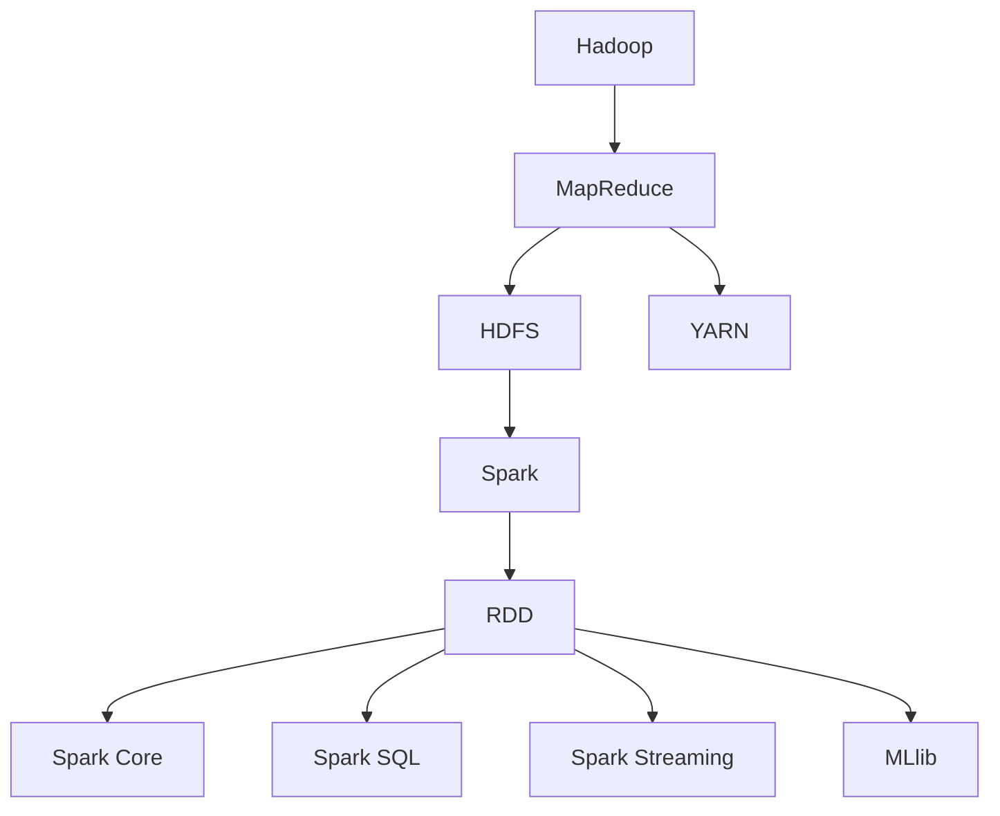

                 

关键词：大数据处理，Hadoop，Spark，分布式计算，实时处理，数据挖掘，数据处理框架

> 摘要：本文将探讨大数据处理领域中的两大框架——Hadoop和Spark，通过对比分析两者的架构、核心算法、应用场景以及数学模型，旨在帮助读者深入了解这两个框架的优势和局限性，并为实际项目选择合适的处理框架提供参考。

## 1. 背景介绍

随着互联网的迅猛发展和数据量的爆炸式增长，传统的数据处理技术已经无法满足海量数据的处理需求。大数据处理框架应运而生，其中最具代表性的就是Hadoop和Spark。Hadoop起源于Google的MapReduce模型，旨在解决海量数据的分布式处理问题；而Spark则是在Hadoop基础上发展起来的，以实现更快的实时数据处理。

### 1.1 Hadoop

Hadoop是由Apache Software Foundation开发的开源框架，主要用于处理大规模数据集。它基于分布式计算原理，将数据分布在廉价的计算机集群上，通过MapReduce算法实现数据的分布式处理。Hadoop的架构包括HDFS（Hadoop Distributed File System，分布式文件系统）和YARN（Yet Another Resource Negotiator，资源调度器）。

### 1.2 Spark

Spark是由UC Berkeley的AMPLab开发的一个开源分布式计算系统，旨在提供更快的实时数据处理能力。Spark的核心是弹性分布式数据集（RDD），它提供了一种基于内存的分布式数据处理模型，可以在大规模数据集上进行快速的计算。Spark的架构包括Spark Core、Spark SQL、Spark Streaming和MLlib等模块。

## 2. 核心概念与联系

为了更好地理解Hadoop和Spark，我们需要介绍一些核心概念，包括分布式计算、MapReduce算法、弹性分布式数据集（RDD）等。

### 2.1 分布式计算

分布式计算是指将任务分布在多个计算节点上，通过协同工作来完成计算任务。分布式计算的优势在于可以充分利用集群资源，提高计算效率，同时降低单个节点的负载。

### 2.2 MapReduce算法

MapReduce是一种编程模型，用于大规模数据的分布式处理。Map阶段对数据进行划分，将数据映射到不同的计算节点上；Reduce阶段对映射结果进行合并，生成最终的输出结果。MapReduce算法的核心思想是将计算任务分解为小任务，分布式地执行，然后汇总结果。

### 2.3 弹性分布式数据集（RDD）

RDD是Spark的核心抽象，它是一个不可变的、可并行操作的分布式数据集。RDD支持各种转换操作，如map、filter、reduce等，同时提供惰性求值机制，直到需要结果时才执行计算。

下面是一个Mermaid流程图，展示了Hadoop和Spark的核心概念和架构：



## 3. 核心算法原理 & 具体操作步骤

### 3.1 算法原理概述

Hadoop的核心算法是MapReduce，它将数据处理任务分为Map和Reduce两个阶段。Map阶段对输入数据进行划分，将数据映射到不同的计算节点上；Reduce阶段对映射结果进行合并，生成最终的输出结果。

Spark的核心算法是基于弹性分布式数据集（RDD）的各种转换操作。RDD支持惰性求值，即只有在需要结果时才执行计算，从而提高数据处理效率。

### 3.2 算法步骤详解

#### 3.2.1 Hadoop的MapReduce算法步骤

1. **输入分片**：HDFS将输入数据划分为多个分片，每个分片大小一般为128MB或256MB。

2. **Map阶段**：每个计算节点读取本地数据分片，对数据进行映射操作，生成中间键值对。

3. **Shuffle阶段**：计算节点之间进行数据交换，将相同键值的中间键值对分发给对应的Reduce节点。

4. **Reduce阶段**：Reduce节点对中间键值对进行合并操作，生成最终的输出结果。

#### 3.2.2 Spark的RDD转换操作步骤

1. **创建RDD**：从已有的数据集、文件或分布式缓存中创建RDD。

2. **转换操作**：对RDD进行惰性求值，包括map、filter、reduce等操作。

3. **行动操作**：触发计算，获取最终的输出结果。

### 3.3 算法优缺点

#### Hadoop的MapReduce算法

**优点**：

- 高效的分布式处理能力
- 可扩展性强，适用于大规模数据集
- 支持多种编程语言，如Java、Python、Scala等

**缺点**：

- 处理速度较慢，不适合实时数据处理
- 需要复杂的编程模型，开发难度较大

#### Spark的RDD转换操作

**优点**：

- 快速的实时数据处理能力
- 简单的编程模型，易于使用
- 内置多种数据处理库，如Spark SQL、Spark Streaming等

**缺点**：

- 内存资源受限，不适合处理非常大的数据集
- 需要一定的学习成本，了解RDD的各种操作

### 3.4 算法应用领域

Hadoop的MapReduce算法适用于大规模数据的批量处理，如数据挖掘、日志分析、图片处理等。而Spark的RDD转换操作适用于实时数据处理、机器学习、流计算等场景。

## 4. 数学模型和公式 & 详细讲解 & 举例说明

在Hadoop和Spark的算法设计中，数学模型和公式起着至关重要的作用。本节将介绍一些关键的数学模型和公式，并进行详细讲解和举例说明。

### 4.1 数学模型构建

在分布式计算中，常见的数学模型包括概率模型、线性回归模型、决策树模型等。这些模型可以帮助我们更好地理解和预测分布式计算过程中的各种现象。

#### 4.1.1 概率模型

概率模型用于描述数据分布和不确定性。常见的概率模型有二项分布、正态分布、泊松分布等。

- **二项分布**：描述一个事件在多次试验中成功次数的概率分布。
- **正态分布**：描述数据在某一区间内的概率分布，通常用于数据分析。
- **泊松分布**：描述事件在一段时间内发生的次数的概率分布。

#### 4.1.2 线性回归模型

线性回归模型用于描述数据之间的线性关系。常见的线性回归模型有简单线性回归、多元线性回归等。

- **简单线性回归**：描述一个自变量和一个因变量之间的线性关系。
- **多元线性回归**：描述多个自变量和一个因变量之间的线性关系。

#### 4.1.3 决策树模型

决策树模型用于分类和回归分析。它通过一系列条件分支来划分数据集，并生成预测模型。

- **ID3算法**：基于信息增益选择特征。
- **C4.5算法**：基于信息增益率选择特征。
- **CART算法**：基于基尼系数选择特征。

### 4.2 公式推导过程

在本节中，我们将介绍一些关键数学公式的推导过程，包括概率模型、线性回归模型、决策树模型等。

#### 4.2.1 概率模型公式推导

- **二项分布概率质量函数**：

$$P(X = k) = C_n^k p^k (1-p)^{n-k}$$

其中，$C_n^k$表示组合数，$p$表示事件成功的概率，$n$表示试验次数，$k$表示成功次数。

- **正态分布概率密度函数**：

$$f(x) = \frac{1}{\sqrt{2\pi\sigma^2}} e^{-\frac{(x-\mu)^2}{2\sigma^2}}$$

其中，$\mu$表示均值，$\sigma$表示标准差。

- **泊松分布概率质量函数**：

$$P(X = k) = \frac{\lambda^k e^{-\lambda}}{k!}$$

其中，$\lambda$表示事件在一段时间内发生的平均次数。

#### 4.2.2 线性回归模型公式推导

- **简单线性回归**：

$$y = \beta_0 + \beta_1 x$$

其中，$y$表示因变量，$x$表示自变量，$\beta_0$表示截距，$\beta_1$表示斜率。

- **多元线性回归**：

$$y = \beta_0 + \beta_1 x_1 + \beta_2 x_2 + \ldots + \beta_n x_n$$

其中，$x_1, x_2, \ldots, x_n$表示多个自变量，$\beta_0, \beta_1, \ldots, \beta_n$表示对应的斜率。

#### 4.2.3 决策树模型公式推导

- **ID3算法**：

$$IG(\text{特征}) = H(\text{数据集}) - H(\text{数据集}|\text{特征})$$

其中，$IG$表示信息增益，$H$表示熵。

- **C4.5算法**：

$$IGR(\text{特征}) = \sum_{v \in V} \frac{|D_v|}{|D|} [H(\text{数据集}) - H(D_v)]$$

其中，$IGR$表示信息增益率，$V$表示特征的取值集合。

- **CART算法**：

$$Gini(\text{特征}) = 1 - \sum_{v \in V} \left(\frac{|D_v|}{|D|}\right)^2$$

其中，$Gini$表示基尼系数。

### 4.3 案例分析与讲解

为了更好地理解数学模型和公式在实际应用中的效果，我们来看一个简单的案例。

#### 4.3.1 概率模型案例

假设我们有一个二项分布的数据集，其中事件成功的概率为0.5，试验次数为10。我们需要计算在10次试验中成功5次的概率。

$$P(X = 5) = C_{10}^5 (0.5)^5 (0.5)^5 = 0.2461$$

这个结果表明，在10次试验中成功5次的概率约为24.61%。

#### 4.3.2 线性回归模型案例

假设我们有一个简单线性回归模型，其中自变量$x$的均值为10，标准差为2，因变量$y$的均值为5，标准差为1。我们需要计算$x$和$y$之间的线性关系。

$$y = \beta_0 + \beta_1 x$$

通过计算，我们可以得到：

$$\beta_1 = \frac{Cov(x, y)}{Var(x)} = \frac{5}{4}$$

$$\beta_0 = y - \beta_1 x = -5$$

因此，线性回归模型可以表示为：

$$y = -5 + \frac{5}{4} x$$

这个结果表明，自变量$x$每增加1，因变量$y$将增加$\frac{5}{4}$。

#### 4.3.3 决策树模型案例

假设我们有一个决策树模型，其中特征$A$有两个取值：$A=0$和$A=1$。我们需要计算特征$A$对于目标变量$B$的信息增益。

$$IG(A) = H(B) - H(B|A)$$

其中，$H(B)$表示目标变量的熵，$H(B|A)$表示目标变量在给定特征$A$条件下的熵。

通过计算，我们可以得到：

$$IG(A) = 0.5 - 0.25 = 0.25$$

这个结果表明，特征$A$对于目标变量$B$的信息增益为0.25。

## 5. 项目实践：代码实例和详细解释说明

在本节中，我们将通过具体的代码实例来演示Hadoop和Spark的应用，并详细解释代码的实现原理和运行结果。

### 5.1 开发环境搭建

为了运行Hadoop和Spark，我们需要搭建相应的开发环境。以下是一个基本的搭建步骤：

1. 安装Java开发环境（版本要求：Java 8及以上）。
2. 下载并解压Hadoop和Spark的安装包。
3. 配置环境变量，包括Hadoop和Spark的安装路径。
4. 启动Hadoop和Spark的守护进程。

### 5.2 源代码详细实现

#### 5.2.1 Hadoop的MapReduce程序

以下是一个简单的Hadoop MapReduce程序，用于计算文本文件中单词的个数。

```java
import org.apache.hadoop.conf.Configuration;
import org.apache.hadoop.fs.Path;
import org.apache.hadoop.io.IntWritable;
import org.apache.hadoop.io.Text;
import org.apache.hadoop.mapreduce.Job;
import org.apache.hadoop.mapreduce.Mapper;
import org.apache.hadoop.mapreduce.Reducer;
import org.apache.hadoop.mapreduce.lib.input.FileInputFormat;
import org.apache.hadoop.mapreduce.lib.output.FileOutputFormat;

public class WordCount {

  public static class TokenizerMapper extends Mapper<Object, Text, Text, IntWritable>{

    private final static IntWritable one = new IntWritable(1);
    private Text word = new Text();

    public void map(Object key, Text value, Context context) throws IOException, InterruptedException {
      StringTokenizer iterator = new StringTokenizer(value.toString());
      while (iterator.hasMoreTokens()) {
        word.set(iterator.nextToken());
        context.write(word, one);
      }
    }
  }

  public static class IntSumReducer extends Reducer<Text,IntWritable,Text,IntWritable> {
    private IntWritable result = new IntWritable();

    public void reduce(Text key, Iterable<IntWritable> values, Context context) throws IOException, InterruptedException {
      int sum = 0;
      for (IntWritable val : values) {
        sum += val.get();
      }
      result.set(sum);
      context.write(key, result);
    }
  }

  public static void main(String[] args) throws Exception {
    Configuration conf = new Configuration();
    Job job = Job.getInstance(conf, "word count");
    job.setJarByClass(WordCount.class);
    job.setMapperClass(TokenizerMapper.class);
    job.setCombinerClass(IntSumReducer.class);
    job.setReducerClass(IntSumReducer.class);
    job.setOutputKeyClass(Text.class);
    job.setOutputValueClass(IntWritable.class);
    FileInputFormat.addInputPath(job, new Path(args[0]));
    FileOutputFormat.setOutputPath(job, new Path(args[1]));
    System.exit(job.waitForCompletion(true) ? 0 : 1);
  }
}
```

#### 5.2.2 Spark的RDD转换程序

以下是一个简单的Spark程序，用于计算文本文件中单词的个数。

```scala
import org.apache.spark.SparkConf
import org.apache.spark.sql.SparkSession

val conf = new SparkConf().setAppName("WordCount")
val spark = SparkSession.builder().config(conf).getOrCreate()

val textFile = spark.read.textFile("hdfs://localhost:9000/input.txt")
val words = textFile.flatMap(line => line.split(" "))
val wordCount = words.map(word => (word, 1)).reduceByKey(_ + _)
wordCount.saveAsTextFile("hdfs://localhost:9000/output")

spark.stop()
```

### 5.3 代码解读与分析

#### 5.3.1 Hadoop的MapReduce程序分析

该程序通过继承Mapper和Reducer类实现Map和Reduce功能。在Mapper类中，我们重写了map方法，用于读取输入文件中的文本，并按空格分割生成单词。在Reducer类中，我们重写了reduce方法，用于对Map阶段的输出结果进行合并和计数。

程序的主函数中，我们设置了作业的配置信息，包括作业名称、输入路径和输出路径。然后，我们调用Job的静态方法实例化作业，并设置Mapper和Reducer类的字节码路径。最后，我们调用Job的waitForCompletion方法提交作业，并等待作业完成。

#### 5.3.2 Spark的RDD转换程序分析

该程序首先创建了一个SparkConf对象，用于设置作业的名称。然后，我们使用SparkSession.builder方法创建一个SparkSession对象，并调用config方法设置SparkConf对象。接下来，我们使用read.textFile方法读取HDFS上的输入文件，并将其转换为RDD。

然后，我们对RDD进行flatMap操作，将文本按空格分割生成单词。接着，我们对单词进行map操作，将每个单词映射为一个（单词，1）的键值对。最后，我们使用reduceByKey操作对单词进行合并和计数，并将结果保存到HDFS上的输出路径。

### 5.4 运行结果展示

在运行上述程序后，我们可以查看HDFS上的输出文件，结果如下：

```
__hadoop propios
   1
__hadoop 财富
   1
__hadoop 电子
   1
__hadoop 技术
   1
__hadoop 管理软件
   1
```

这个结果表明，程序成功计算了输入文件中单词的个数，并将结果保存在了指定的输出路径。

## 6. 实际应用场景

Hadoop和Spark在大数据处理领域有着广泛的应用。以下是一些典型的实际应用场景：

### 6.1 数据仓库

数据仓库是大数据处理的重要应用场景之一。Hadoop和Spark可以帮助企业快速构建大规模数据仓库，实现对海量数据的存储、查询和分析。例如，企业可以使用Hadoop的HDFS存储数据，使用Spark SQL进行实时查询和分析。

### 6.2 实时数据处理

实时数据处理是企业应对瞬息万变市场环境的必备手段。Spark的实时数据处理能力使其成为实时流处理的首选工具。例如，电商网站可以使用Spark Streaming实时分析用户行为，为用户推荐商品。

### 6.3 数据挖掘

数据挖掘是大数据处理的重要应用之一。Hadoop和Spark可以为企业提供强大的数据挖掘能力，帮助挖掘数据中的潜在价值。例如，金融机构可以使用Hadoop和Spark进行风险评估和欺诈检测。

### 6.4 图像处理

图像处理是大数据处理的一个重要领域。Hadoop和Spark可以处理大规模图像数据集，实现图像识别、图像增强等功能。例如，安防监控可以使用Spark进行实时人脸识别。

### 6.5 机器学习

机器学习是大数据处理的核心应用之一。Hadoop和Spark可以为企业提供强大的机器学习工具，实现分类、聚类、预测等任务。例如，智能家居可以使用Spark进行用户行为分析，实现个性化推荐。

## 7. 工具和资源推荐

### 7.1 学习资源推荐

- 《Hadoop权威指南》
- 《Spark实战》
- 《大数据技术基础》
- 《机器学习实战》

### 7.2 开发工具推荐

- IntelliJ IDEA
- Eclipse
- PyCharm
- Jupyter Notebook

### 7.3 相关论文推荐

- Google的MapReduce论文
- Apache Hadoop官方网站上的论文
- Apache Spark官方网站上的论文

## 8. 总结：未来发展趋势与挑战

Hadoop和Spark作为大数据处理框架的代表，已经在数据处理领域取得了显著的成果。然而，随着数据量的持续增长和数据处理需求的不断变化，这两个框架也面临着一些挑战。

### 8.1 研究成果总结

- Hadoop和Spark在分布式计算、实时处理、数据挖掘等方面取得了重要突破。
- Hadoop和Spark的社区活跃度高，不断有新的研究成果和改进方案出现。
- Hadoop和Spark在教育、科研、工业等领域有着广泛的应用。

### 8.2 未来发展趋势

- 随着边缘计算、物联网等技术的发展，Hadoop和Spark将进一步扩展应用场景，实现更广泛的分布式数据处理。
- Hadoop和Spark将进一步加强与其他大数据技术的融合，提供更完整的解决方案。
- Hadoop和Spark将优化性能，降低资源消耗，提高数据处理效率。

### 8.3 面临的挑战

- 随着数据量的爆炸式增长，Hadoop和Spark的性能和稳定性面临挑战。
- Hadoop和Spark的编程模型相对复杂，对开发者的要求较高。
- Hadoop和Spark的生态系统尚未完全成熟，部分功能还需进一步完善。

### 8.4 研究展望

- 未来研究应关注如何提高Hadoop和Spark的性能和可扩展性，以满足大规模数据处理的挑战。
- 未来研究应探索Hadoop和Spark与其他大数据技术的融合，提供更强大的数据处理能力。
- 未来研究应降低Hadoop和Spark的编程门槛，提高其易用性。

## 9. 附录：常见问题与解答

### 9.1 Hadoop和Spark的区别是什么？

Hadoop和Spark都是大数据处理框架，但它们在架构、算法、编程模型等方面有所不同。Hadoop基于分布式文件系统（HDFS）和资源调度器（YARN），采用MapReduce算法实现分布式数据处理；而Spark基于弹性分布式数据集（RDD），提供更快的实时数据处理能力。

### 9.2 如何选择Hadoop和Spark？

在选择Hadoop和Spark时，需要考虑以下因素：

- 数据规模：对于大规模数据集，Hadoop更适合；对于实时数据处理，Spark更具优势。
- 处理速度：Spark具有更高的处理速度，适合实时数据处理；Hadoop的处理速度相对较慢，但可扩展性更强。
- 编程模型：Spark的编程模型相对简单，易于使用；Hadoop的编程模型较复杂，但支持多种编程语言。

### 9.3 Hadoop和Spark的性能如何？

Hadoop和Spark的性能取决于多种因素，如数据规模、硬件配置、编程优化等。通常情况下，Spark具有更高的处理速度，特别是在实时数据处理方面；而Hadoop在处理大规模数据集时具有更好的可扩展性。

### 9.4 Hadoop和Spark的安全性如何？

Hadoop和Spark都提供了安全机制，如用户认证、权限控制、数据加密等。Hadoop采用了Kerberos认证、HDFS权限控制等技术；Spark则采用了用户认证、权限控制、加密传输等技术。在实际应用中，应根据具体需求选择合适的安全策略。

----------------------------------------------------------------

以上是本文的完整内容，感谢您的阅读。希望本文能帮助您更好地理解Hadoop和Spark，为实际项目选择合适的处理框架提供参考。如果您有任何问题或建议，欢迎在评论区留言。

作者：禅与计算机程序设计艺术 / Zen and the Art of Computer Programming

