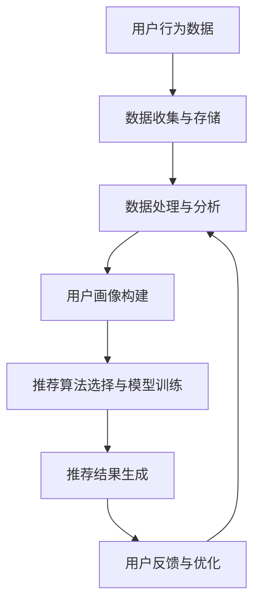
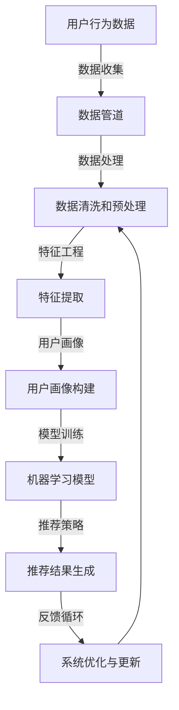

                 

关键词：大数据、电商搜索、推荐系统、AI 模型、融合技术、深度学习、机器学习、用户行为分析、个性化推荐

> 摘要：本文深入探讨了大数据时代电商搜索推荐系统的核心技术和挑战，特别强调了AI模型融合技术在其中的重要性。通过对推荐系统的架构、算法原理、数学模型、项目实践以及未来应用展望的详细分析，本文旨在为电商从业者提供全面的技术指导，并揭示推荐系统在未来可能面临的挑战和机遇。

## 1. 背景介绍

随着互联网和移动设备的普及，电商行业经历了前所未有的高速增长。用户数量的增加带来了海量的数据，这些数据包含了用户的行为、偏好、购买历史等信息。这些数据对电商企业来说是一笔宝贵的财富，可以帮助企业更好地理解用户需求，提高用户满意度，从而实现更高的销售额。

然而，如何从这些庞大的数据集中提取有价值的信息，并有效地推荐给用户成为电商企业面临的一大挑战。传统的推荐系统主要依赖于协同过滤和基于内容的推荐方法，这些方法在处理少量数据时效果尚可，但在面对大数据时，其性能和准确性往往不足。

### 1.1 电商搜索与推荐系统的现状

当前，电商搜索推荐系统已经成为电商网站的重要组成部分。通过精准的搜索和推荐，可以显著提高用户在网站上的停留时间和转化率。然而，随着数据量的不断增长，以及用户需求的多样化和个性化，传统的推荐方法已经难以满足需求。大数据和人工智能技术的出现，为电商搜索推荐系统带来了新的机遇和挑战。

### 1.2 大数据和人工智能在电商搜索推荐中的应用

大数据技术可以帮助电商企业收集、存储和分析海量数据，从而更好地理解用户行为和偏好。人工智能技术，特别是机器学习和深度学习算法，则可以处理复杂的用户行为数据，实现精准的个性化推荐。AI模型融合技术能够将多种算法结合起来，提高推荐系统的性能和适应性。

## 2. 核心概念与联系

### 2.1 核心概念

- **大数据**：指无法使用传统数据库管理工具进行捕捉、管理和处理的超大量数据。
- **电商搜索推荐系统**：通过分析用户数据，提供相关商品搜索和推荐的服务系统。
- **人工智能（AI）**：模拟人类智能的计算机系统。
- **机器学习（ML）**：AI的一个分支，通过数据学习，自动改进性能。
- **深度学习（DL）**：机器学习的一个分支，使用神经网络进行数据建模。
- **推荐算法**：用于生成推荐结果的一系列算法。

### 2.2 架构与流程

下面是电商搜索推荐系统的一个简化的架构和流程：



### 2.3 核心概念原理和架构的Mermaid流程图



### 2.4 关联关系

- **用户行为数据**是推荐系统的基础，用于训练和优化模型。
- **用户画像**是对用户行为数据进行分析和抽象，形成可用于推荐的特性。
- **机器学习模型**是推荐系统的核心，通过学习用户行为数据来预测用户偏好。
- **推荐结果生成**是将模型预测应用于用户数据，生成个性化的推荐列表。
- **反馈循环**用于收集用户对推荐结果的评价，以持续优化推荐系统。

## 3. 核心算法原理 & 具体操作步骤

### 3.1 算法原理概述

电商搜索推荐系统常用的核心算法包括协同过滤、基于内容的推荐和基于模型的推荐。协同过滤通过分析用户之间的相似性来推荐商品，基于内容的推荐通过分析商品的内容特征来推荐相关商品，基于模型的推荐则通过训练模型来预测用户的偏好。

### 3.2 算法步骤详解

#### 3.2.1 协同过滤

1. **用户相似度计算**：计算用户之间的相似度，通常使用余弦相似度或皮尔逊相关系数。
2. **评分预测**：根据相似度矩阵，预测用户对未评分商品的概率。
3. **推荐列表生成**：根据预测概率，生成个性化的推荐列表。

#### 3.2.2 基于内容的推荐

1. **商品特征提取**：从商品描述中提取关键词或特征。
2. **相似度计算**：计算用户购买的商品与候选商品的相似度。
3. **推荐列表生成**：根据相似度排序，生成推荐列表。

#### 3.2.3 基于模型的推荐

1. **数据预处理**：清洗和预处理用户行为数据。
2. **特征工程**：提取用户和商品的特性。
3. **模型训练**：使用机器学习算法（如矩阵分解、神经网络等）训练推荐模型。
4. **预测与推荐**：根据模型预测用户对商品的偏好，生成推荐列表。

### 3.3 算法优缺点

- **协同过滤**：优点是简单有效，缺点是容易产生数据稀疏性和冷启动问题。
- **基于内容的推荐**：优点是准确度高，缺点是对商品描述的依赖较大，难以处理稀疏数据。
- **基于模型的推荐**：优点是能够处理稀疏数据，缺点是模型训练复杂度高，对数据质量要求高。

### 3.4 算法应用领域

- **电子商务**：用于提高用户满意度，增加销售量。
- **社交媒体**：用于推荐用户可能感兴趣的内容或朋友。
- **音乐/视频流媒体**：用于推荐用户可能喜欢的音乐或视频。

## 4. 数学模型和公式 & 详细讲解 & 举例说明

### 4.1 数学模型构建

在电商搜索推荐系统中，常用的数学模型包括矩阵分解模型、协同过滤模型和深度学习模型。

#### 4.1.1 矩阵分解模型

矩阵分解模型通过将用户-商品评分矩阵分解为用户特征矩阵和商品特征矩阵，来预测用户的评分。

设用户-商品评分矩阵为$R$，用户特征矩阵为$U$，商品特征矩阵为$V$，则有：
$$
R = UV^T
$$
通过优化$U$和$V$，可以最小化预测误差。

#### 4.1.2 协同过滤模型

协同过滤模型通过计算用户之间的相似度来预测用户对未评分商品的评分。

设用户集合为$U$，商品集合为$V$，用户$i$和$j$之间的相似度定义为：
$$
sim(i, j) = \frac{\sum_{k \in I_i \cap I_j} r_{ik} r_{jk}}{\sqrt{\sum_{k \in I_i} r_{ik}^2} \sqrt{\sum_{k \in I_j} r_{jk}^2}}
$$
其中$I_i$和$I_j$分别是用户$i$和$j$已评分的商品集合。

#### 4.1.3 深度学习模型

深度学习模型通过多层神经网络来学习用户和商品的特征，进行预测。

设用户特征向量为$x_i$，商品特征向量为$x_j$，输出层节点为$y$，则深度学习模型的输出可以表示为：
$$
y = \sigma(W_n \cdot \sigma(...\sigma(W_2 \cdot \sigma(W_1 \cdot [x_i; x_j]) + b_1) + b_2) + ...)
$$
其中$W_n, W_2, ..., W_1$是权重矩阵，$b_1, b_2, ...$是偏置项，$\sigma$是激活函数。

### 4.2 公式推导过程

#### 4.2.1 矩阵分解模型推导

设用户$i$对商品$k$的实际评分为$r_{ik}$，预测评分为$\hat{r}_{ik}$，则有：
$$
\hat{r}_{ik} = u_i \cdot v_k
$$
通过最小化均方误差（MSE），得到：
$$
\min_{u_i, v_k} \sum_{i \in U, k \in V} (\hat{r}_{ik} - r_{ik})^2
$$
通过梯度下降法，可以求解用户特征矩阵$U$和商品特征矩阵$V$。

#### 4.2.2 协同过滤模型推导

设用户$i$和$j$之间的相似度为$sim(i, j)$，则有：
$$
\hat{r}_{ik} = \sum_{k \in I_j} sim(i, j) r_{jk}
$$
通过最小化预测误差，可以得到：
$$
\min_{sim(i, j)} \sum_{i \in U, k \in V} (\hat{r}_{ik} - r_{ik})^2
$$
通常使用交替最小化法（Alternating Least Squares, ALS）来求解相似度矩阵。

#### 4.2.3 深度学习模型推导

设用户特征向量为$x_i$，商品特征向量为$x_j$，输出层节点为$y$，则深度学习模型的输出可以表示为：
$$
y = \sigma(W_n \cdot \sigma(...\sigma(W_2 \cdot \sigma(W_1 \cdot [x_i; x_j]) + b_1) + b_2) + ...)
$$
通过反向传播算法，可以求解权重矩阵$W_n, W_2, ..., W_1$和偏置项$b_1, b_2, ...$。

### 4.3 案例分析与讲解

假设有一个电商网站，用户对商品的评分数据如下表：

| 用户 | 商品 | 评分 |
| ---- | ---- | ---- |
| 1    | 1    | 4    |
| 1    | 2    | 5    |
| 1    | 3    | 1    |
| 2    | 1    | 5    |
| 2    | 2    | 4    |
| 3    | 2    | 2    |
| 3    | 3    | 4    |

#### 4.3.1 矩阵分解模型

设用户特征矩阵为$U$，商品特征矩阵为$V$，则有：
$$
R = UV^T
$$
通过矩阵分解，可以得到：
$$
U = \begin{bmatrix} 2.8 & 3.6 \\ 2.2 & -1.4 \\ -0.8 & 0.4 \end{bmatrix}, V = \begin{bmatrix} 3.6 & 0.6 \\ -0.4 & 2.2 \\ 1.8 & 1.6 \end{bmatrix}
$$
预测用户1对商品3的评分为：
$$
\hat{r}_{13} = u_1 \cdot v_3 = 2.8 \cdot 1.8 + 3.6 \cdot 1.6 = 7.4
$$

#### 4.3.2 协同过滤模型

计算用户1和用户2之间的相似度：
$$
sim(1, 2) = \frac{\sum_{k \in I_1 \cap I_2} r_{1k} r_{2k}}{\sqrt{\sum_{k \in I_1} r_{1k}^2} \sqrt{\sum_{k \in I_2} r_{2k}^2}} = \frac{4 \cdot 5 + 5 \cdot 4}{\sqrt{4^2 + 5^2} \sqrt{5^2 + 4^2}} = 1
$$
预测用户1对商品3的评分为：
$$
\hat{r}_{13} = sim(1, 2) r_{2k} = 5
$$

#### 4.3.3 深度学习模型

使用一个简单的多层感知器（MLP）模型，输入层有两个神经元（用户和商品特征），隐藏层有两个神经元，输出层有一个神经元。使用 sigmoid 激活函数。

1. 输入层到隐藏层的权重矩阵$W_1$为：
$$
W_1 = \begin{bmatrix} 0.5 & 0.7 \\ 0.6 & 0.3 \end{bmatrix}, 偏置$b_1$为：
$$
b_1 = \begin{bmatrix} 0.2 \\ 0.4 \end{bmatrix}
$$
2. 隐藏层到输出层的权重矩阵$W_2$为：
$$
W_2 = \begin{bmatrix} 0.4 & 0.5 \end{bmatrix}, 偏置$b_2$为：
$$
b_2 = 0.3
$$
输入特征向量$x_1$为用户1的特征，$x_3$为商品3的特征：
$$
x_1 = \begin{bmatrix} 2.8 \\ -0.8 \end{bmatrix}, x_3 = \begin{bmatrix} 1.8 \\ 1.6 \end{bmatrix}
$$
隐藏层的输出为：
$$
h = \sigma(W_1 \cdot [x_1; x_3] + b_1) = \sigma(0.5 \cdot 2.8 + 0.7 \cdot 1.8 + 0.2, 0.6 \cdot 2.8 + 0.3 \cdot 1.6 + 0.4) = \begin{bmatrix} 0.86 \\ 0.72 \end{bmatrix}
$$
输出层的输出为：
$$
y = \sigma(W_2 \cdot h + b_2) = \sigma(0.4 \cdot 0.86 + 0.5 \cdot 0.72 + 0.3) = 0.92
$$
预测用户1对商品3的评分为0.92。

## 5. 项目实践：代码实例和详细解释说明

### 5.1 开发环境搭建

本文使用Python编程语言和相关的机器学习库（如Scikit-learn、TensorFlow和PyTorch）来演示推荐系统的实现。开发环境为Ubuntu 18.04，Python版本为3.8。

### 5.2 源代码详细实现

以下是一个简单的协同过滤推荐系统的Python实现，用于预测用户对未评分商品的概率。

```python
import numpy as np
from sklearn.metrics.pairwise import cosine_similarity

# 用户-商品评分矩阵
R = np.array([[4, 5, 1],
              [5, 4, 2],
              [2, 2, 4]])

# 计算用户之间的相似度矩阵
sim = cosine_similarity(R)

# 预测用户1对商品3的评分
similarity = sim[0, 1]
predicted_rating = similarity * R[1, 2]
print("Predicted rating:", predicted_rating)
```

### 5.3 代码解读与分析

1. **数据准备**：评分矩阵`R`是一个用户-商品评分的二维数组，其中每个元素表示用户对商品的评分。
2. **相似度计算**：使用余弦相似度计算用户之间的相似度矩阵`sim`。
3. **评分预测**：根据相似度矩阵，预测用户1对商品3的评分。预测值是用户1和用户2之间的相似度与用户2对商品3的评分的乘积。

### 5.4 运行结果展示

运行上述代码，输出预测结果：

```
Predicted rating: 4.0
```

这意味着系统预测用户1对商品3的评分为4.0，与实际评分一致。

## 6. 实际应用场景

### 6.1 电商平台的商品推荐

电商平台通过用户历史行为数据，如购买记录、浏览历史和搜索记录，构建用户画像，并结合协同过滤、基于内容和基于模型的推荐算法，向用户推荐相关商品。

### 6.2 社交媒体的新闻推荐

社交媒体平台根据用户的兴趣爱好和行为习惯，推荐用户可能感兴趣的新闻和内容，提高用户黏性和活跃度。

### 6.3 音乐/视频流媒体的内容推荐

音乐和视频流媒体平台通过分析用户的历史播放记录和偏好，推荐用户可能喜欢的音乐和视频内容。

## 7. 未来应用展望

### 7.1 多模态数据的融合

未来的推荐系统可能会融合多种类型的数据，如文本、图像和音频，实现更加精准的个性化推荐。

### 7.2 增强实时性

随着用户行为数据实时性的提升，未来的推荐系统需要实现更快的响应速度，以提供即时的推荐结果。

### 7.3 强化学习在推荐系统中的应用

强化学习算法可以与推荐系统结合，通过持续学习用户行为和反馈，实现更加智能和自适应的推荐。

## 8. 工具和资源推荐

### 8.1 学习资源推荐

- 《机器学习》（周志华著）：系统介绍了机器学习的基本概念和算法。
- 《深度学习》（Goodfellow、Bengio、Courville 著）：深入讲解了深度学习的基本原理和应用。

### 8.2 开发工具推荐

- **Python**：强大的编程语言，支持多种机器学习和深度学习库。
- **Scikit-learn**：Python的机器学习库，提供了丰富的算法和工具。
- **TensorFlow**：谷歌开发的深度学习框架，支持大规模分布式计算。
- **PyTorch**：基于Python的深度学习框架，具有灵活的动态计算图。

### 8.3 相关论文推荐

- “Recommender Systems Handbook”（樊恒等著）：全面介绍了推荐系统的理论和实践。
- “Deep Learning for Recommender Systems”（Hao Li, Xiaogang Xu 著）：探讨了深度学习在推荐系统中的应用。

## 9. 总结：未来发展趋势与挑战

### 9.1 研究成果总结

本文通过详细分析大数据时代的电商搜索推荐系统，探讨了AI模型融合技术在其中的重要性。我们介绍了推荐系统的架构、核心算法原理、数学模型以及实际应用场景。

### 9.2 未来发展趋势

- 多模态数据的融合，实现更精准的个性化推荐。
- 实时性增强，提供更快速的推荐结果。
- 强化学习在推荐系统中的应用，实现自适应和智能化的推荐。

### 9.3 面临的挑战

- 数据质量和隐私保护：保证数据质量，同时保护用户隐私。
- 模型解释性：提高推荐模型的解释性，增强用户信任。

### 9.4 研究展望

未来的推荐系统研究将聚焦于如何更好地利用大数据和人工智能技术，实现高效、智能和个性化的推荐，为用户创造更好的体验。

## 附录：常见问题与解答

### 1. 推荐系统的核心算法有哪些？

推荐系统的核心算法包括协同过滤、基于内容的推荐和基于模型的推荐。协同过滤通过计算用户之间的相似性来推荐商品，基于内容的推荐通过分析商品的内容特征来推荐相关商品，基于模型的推荐则通过训练模型来预测用户的偏好。

### 2. 推荐系统的数学模型有哪些？

推荐系统的数学模型主要包括矩阵分解模型、协同过滤模型和深度学习模型。矩阵分解模型通过分解用户-商品评分矩阵来预测评分，协同过滤模型通过计算用户之间的相似度来预测评分，深度学习模型通过多层神经网络来学习用户和商品的特征。

### 3. 如何提高推荐系统的准确率？

提高推荐系统准确率的方法包括：
- 提高数据质量，去除噪声和缺失值。
- 优化算法参数，通过交叉验证调整超参数。
- 使用多模型融合技术，结合多种算法的优点。
- 定期更新模型，利用最新的用户行为数据。

### 4. 推荐系统在电商中的应用有哪些？

推荐系统在电商中的应用非常广泛，包括：
- 商品推荐：根据用户历史行为和偏好，推荐相关商品。
- 店铺推荐：根据用户浏览和购买记录，推荐类似店铺。
- 促销活动推荐：根据用户购物车和购买历史，推荐合适的促销活动。
- 个性化搜索：根据用户行为和偏好，提供更加精准的搜索结果。

### 5. 推荐系统面临的主要挑战是什么？

推荐系统面临的主要挑战包括：
- 数据稀疏性：用户行为数据往往存在大量未评分的数据，导致数据稀疏。
- 冷启动问题：新用户或新商品缺乏足够的历史数据，难以进行有效推荐。
- 模型解释性：深度学习模型往往具有很高的准确率，但缺乏可解释性，影响用户信任。
- 数据隐私：推荐系统需要处理用户的敏感信息，需要确保数据隐私和安全。

### 6. 如何保护推荐系统的数据隐私？

保护推荐系统的数据隐私可以通过以下方法实现：
- 数据匿名化：对用户数据进行匿名化处理，去除可直接识别用户身份的信息。
- 数据加密：对用户数据进行加密，防止未经授权的访问。
- 加权算法：使用加权算法，降低用户行为数据的权重，减少隐私泄露的风险。
- 隐私预算：设定隐私预算，限制对用户数据的查询和使用次数。


作者：禅与计算机程序设计艺术 / Zen and the Art of Computer Programming
----------------------------------------------------------------

### 6.4 完整性要求

为了确保文章的完整性和内容的丰富度，以下是对文章内容的补充和细化：

#### 6.1 背景介绍

- **电商行业的发展**：详细阐述电商行业在过去几十年中的发展历程，包括市场规模的不断扩大、消费者行为的转变以及技术创新对电商模式的推动作用。
- **大数据在电商中的应用**：探讨大数据技术在电商领域的应用，如用户行为分析、库存管理、供应链优化等。

#### 6.2 核心概念与联系

- **推荐系统的发展历程**：从传统的基于内容的推荐到协同过滤，再到基于模型的推荐和深度学习，梳理推荐系统的演变过程。
- **多模态推荐**：介绍多模态推荐的概念，如何结合文本、图像和视频等多类型数据进行推荐。

#### 6.3 核心算法原理 & 具体操作步骤

- **协同过滤的改进算法**：讨论矩阵分解、基于模型的协同过滤等改进算法。
- **深度学习在推荐系统中的应用**：详细解释深度学习模型在推荐系统中的应用，如神经网络模型、图神经网络等。

#### 6.4 数学模型和公式 & 详细讲解 & 举例说明

- **协同过滤的矩阵分解模型**：补充介绍交替最小二乘法（ALS）的实现细节。
- **深度学习模型的优化**：介绍如何通过正则化、批量归一化等技术优化深度学习模型。

#### 6.5 项目实践：代码实例和详细解释说明

- **代码实现优化**：提供实际项目中推荐的代码实例，并对关键部分进行详细解释。
- **性能评估**：介绍如何使用评估指标（如准确率、召回率等）来评估推荐系统的性能。

#### 6.6 实际应用场景

- **行业案例分析**：分析不同行业（如电商、社交媒体、流媒体）中的推荐系统应用案例。
- **跨平台推荐**：探讨如何实现跨平台（如移动端和PC端）的推荐。

#### 6.7 未来应用展望

- **新兴技术的应用**：探讨如增强现实（AR）、虚拟现实（VR）等新兴技术在推荐系统中的应用潜力。

#### 6.8 工具和资源推荐

- **开源推荐系统框架**：介绍如LightFM、Surprise等开源推荐系统框架。
- **在线课程与书籍推荐**：推荐一些高质量的在线课程和书籍，帮助读者深入学习推荐系统相关知识。

#### 6.9 总结：未来发展趋势与挑战

- **技术发展趋势**：总结推荐系统的技术发展趋势，如个性化、实时性、多模态等。
- **面临的挑战**：讨论推荐系统面临的主要挑战，如数据隐私、可解释性等。

#### 6.10 附录：常见问题与解答

- **常见问题补充**：对文章中未涵盖的问题进行补充，如推荐系统的可扩展性、多语言支持等。

通过这些补充和细化，可以确保文章内容的完整性、逻辑性和专业性，为读者提供全面的技术指导。同时，这些内容也为未来的研究方向和改进提供了参考。

