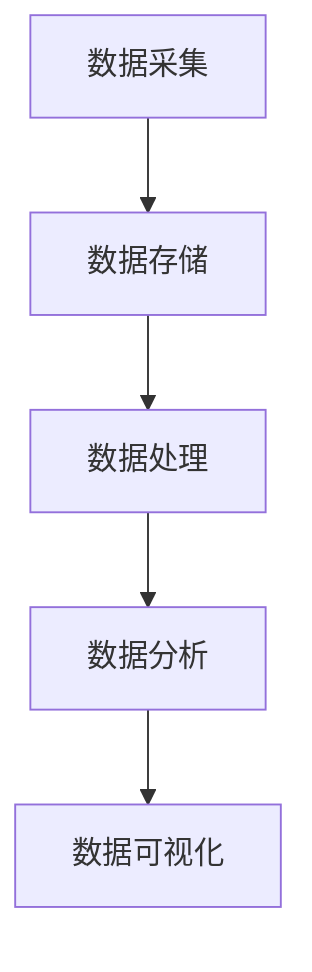

                 

## 1. 背景介绍

在21世纪的今天，我们生活在一个数据爆炸的时代。随着互联网的普及和物联网的兴起，各类数据以惊人的速度不断增长。据统计，每天产生的数据量已经超过了2.5EB（艾字节），这意味着全球每天产生的数据量相当于200亿张CD的总和。如此庞大的数据量，对传统的数据处理方式构成了巨大的挑战。

首先，海量数据的产生源于各种来源。例如，社交媒体平台每天产生的数据量巨大，包括用户发布的内容、评论、点赞、分享等；电子商务平台每天处理着数百万甚至上亿的订单信息；金融行业需要处理海量的交易数据，包括股票交易、银行转账等。这些数据不仅量巨大，而且类型多样，包括结构化数据、半结构化数据和非结构化数据。

其次，数据的增长速度之快令人咋舌。根据国际数据公司（IDC）的预测，全球数据量每两年就会翻一番，这意味着到了2025年，全球数据总量将达到160ZB（泽字节）。如此庞大的数据量，对数据存储、数据传输、数据处理和数据安全等各个方面都提出了新的要求和挑战。

在这种背景下，如何高效地管理和处理海量数据，成为了业界和学术界共同关注的焦点。大数据技术的出现，为我们提供了一种应对海量数据的新方法。大数据技术包括数据采集、数据存储、数据处理、数据分析和数据可视化等多个环节，通过这些技术的综合运用，我们可以从海量数据中提取出有价值的信息，从而为企业和组织带来巨大的商业价值。

## 2. 核心概念与联系

要理解大数据时代如何应对海量数据，我们首先需要了解几个核心概念和它们之间的联系。这些概念包括数据采集、数据存储、数据处理、数据分析和数据可视化。

### 2.1 数据采集

数据采集是大数据处理的第一步，也是最重要的一步。它指的是从各种来源获取数据的过程，包括互联网、社交媒体、物联网设备、企业内部系统等。数据采集的关键是确保数据的质量和完整性。为了实现这一点，我们需要使用各种工具和技术，如爬虫、传感器、日志收集系统等。

### 2.2 数据存储

随着数据量的不断增长，传统的数据存储方式已经无法满足需求。大数据技术引入了分布式存储技术，如Hadoop的HDFS（Hadoop Distributed File System）和NoSQL数据库，如MongoDB和Cassandra。这些技术能够处理海量数据，并提供高可用性和高扩展性。

### 2.3 数据处理

数据处理是指对采集到的数据进行清洗、转换和整合的过程。大数据技术提供了多种数据处理工具，如Spark、MapReduce等。这些工具能够高效地处理海量数据，并提供强大的数据处理能力。

### 2.4 数据分析

数据分析是大数据技术的核心。通过使用统计方法、机器学习和数据挖掘技术，我们可以从海量数据中提取出有价值的信息。数据分析可以帮助企业做出更明智的决策，优化业务流程，提高竞争力。

### 2.5 数据可视化

数据可视化是将数据以图形化的方式呈现出来，使得数据更加直观、易于理解。数据可视化技术包括各种图表、图形和交互式界面。通过数据可视化，我们可以更好地理解数据，发现数据中的模式和趋势。

### 2.6 Mermaid 流程图

为了更好地理解这些概念之间的联系，我们可以使用Mermaid流程图来展示它们之间的关系：



在这个流程图中，数据采集是整个流程的起点，数据经过存储、处理、分析和可视化后，最终为企业和组织提供了有价值的信息。

## 3. 核心算法原理 & 具体操作步骤

### 3.1 算法原理概述

在应对海量数据的过程中，核心算法起到了至关重要的作用。以下是几种常见的核心算法及其原理：

#### 3.1.1 MapReduce

MapReduce是一种分布式数据处理框架，由Google提出。它将大规模数据处理任务分解成两个阶段：Map阶段和Reduce阶段。

- **Map阶段**：将输入数据分割成小块，并对每个小块进行映射（map），产生中间键值对。
- **Reduce阶段**：将Map阶段产生的中间键值对进行聚合（reduce），生成最终的输出。

#### 3.1.2 数据挖掘算法

数据挖掘算法是一类用于从数据中提取隐藏模式的算法，常见的算法包括K-均值聚类、决策树、神经网络等。

- **K-均值聚类**：将数据分为K个簇，每个簇由一个中心点代表，算法通过迭代优化聚类结果。
- **决策树**：根据特征值将数据分割成不同的区域，形成一棵树状结构。
- **神经网络**：模拟人脑神经元的工作方式，通过多层网络进行特征学习和模式识别。

#### 3.1.3 数据流处理算法

数据流处理算法用于处理实时数据流，常见的算法包括Flink和Spark Streaming。

- **Flink**：支持流处理和批处理，能够实时处理大规模数据流。
- **Spark Streaming**：基于Spark的实时数据处理框架，能够高效地处理实时数据流。

### 3.2 算法步骤详解

以下是对每种算法的具体操作步骤的详细解释：

#### 3.2.1 MapReduce算法

1. **数据输入**：将输入数据分割成小块，通常由Hadoop的HDFS存储系统管理。
2. **Map阶段**：
    - **映射**：对每个小块的数据进行映射操作，生成中间键值对。
    - **Shuffle**：对中间键值对进行排序和分组，为Reduce阶段做准备。
3. **Reduce阶段**：
    - **聚合**：对中间键值对进行聚合操作，生成最终的输出。

#### 3.2.2 数据挖掘算法

1. **数据预处理**：清洗和转换数据，使其适合进行聚类、决策树或神经网络等算法。
2. **算法选择**：根据任务需求和数据特点选择合适的算法。
3. **模型训练**：使用选定的算法对数据进行训练，生成模型。
4. **模型评估**：评估模型的性能，包括准确性、召回率等指标。
5. **模型应用**：将训练好的模型应用于新数据，提取出隐藏的模式。

#### 3.2.3 数据流处理算法

1. **数据采集**：从数据源（如传感器、日志文件等）采集实时数据。
2. **数据预处理**：对实时数据进行清洗、转换和整合。
3. **流处理**：使用Flink或Spark Streaming进行实时数据处理。
4. **结果输出**：将处理结果输出到数据库、消息队列或其他数据存储系统。

### 3.3 算法优缺点

每种算法都有其优缺点，以下是对MapReduce、数据挖掘算法和数据流处理算法的优缺点的分析：

#### 3.3.1 MapReduce算法

- **优点**：
    - **分布式处理**：能够高效地处理大规模数据。
    - **高可用性**：具有容错机制，能够在节点故障时自动恢复。
    - **可扩展性**：能够水平扩展，处理能力随节点数量增加而增加。

- **缺点**：
    - **不适合实时处理**：处理过程较为缓慢，不适合实时数据流处理。
    - **开发难度较大**：需要编写大量的Map和Reduce函数，开发成本较高。

#### 3.3.2 数据挖掘算法

- **优点**：
    - **强大的模式识别能力**：能够从海量数据中提取出隐藏的模式和趋势。
    - **多种算法选择**：有丰富的算法可供选择，适用于不同的应用场景。

- **缺点**：
    - **计算复杂度较高**：数据挖掘算法通常计算复杂度较高，处理时间较长。
    - **对数据质量要求高**：数据质量对算法效果有重要影响，需要大量的数据预处理工作。

#### 3.3.3 数据流处理算法

- **优点**：
    - **实时处理能力**：能够实时处理大规模数据流。
    - **高吞吐量**：能够处理海量实时数据。

- **缺点**：
    - **数据一致性较差**：由于实时处理的特点，数据一致性可能较差。
    - **开发难度较大**：需要编写大量的数据处理逻辑，开发成本较高。

### 3.4 算法应用领域

不同算法在应用领域上也有所不同：

#### 3.4.1 MapReduce算法

- **应用领域**：适用于大规模数据集的批处理任务，如搜索引擎索引、大数据分析等。

#### 3.4.2 数据挖掘算法

- **应用领域**：适用于各种领域的数据挖掘任务，如市场营销、金融分析、医疗诊断等。

#### 3.4.3 数据流处理算法

- **应用领域**：适用于实时数据处理任务，如物联网数据流分析、实时交易监控等。

## 4. 数学模型和公式 & 详细讲解 & 举例说明

在应对海量数据的过程中，数学模型和公式起到了关键作用。以下是一些常用的数学模型和公式，以及它们的详细讲解和举例说明。

### 4.1 数学模型构建

在构建数学模型时，我们通常需要考虑以下几个步骤：

1. **定义问题**：明确要解决的问题，例如分类、聚类、回归等。
2. **收集数据**：收集相关的数据，确保数据的质量和完整性。
3. **特征工程**：提取和选择与问题相关的特征，对数据进行预处理。
4. **模型选择**：选择合适的数学模型，例如线性模型、非线性模型等。
5. **模型训练**：使用训练数据对模型进行训练，调整模型参数。
6. **模型评估**：评估模型的效果，包括准确性、召回率、F1分数等。

### 4.2 公式推导过程

以下是一些常用的数学公式及其推导过程：

#### 4.2.1 线性回归模型

线性回归模型是一种用于预测连续值的模型，其公式如下：

$$
y = \beta_0 + \beta_1 \cdot x
$$

其中，$y$ 是预测值，$x$ 是特征值，$\beta_0$ 是截距，$\beta_1$ 是斜率。

推导过程：

1. **最小二乘法**：线性回归模型的目标是最小化预测值与真实值之间的误差平方和。
2. **求导**：对误差平方和关于 $\beta_0$ 和 $\beta_1$ 求导，得到导数为零的条件。
3. **求解**：解方程组，得到 $\beta_0$ 和 $\beta_1$ 的最优值。

#### 4.2.2 逻辑回归模型

逻辑回归模型是一种用于预测类别的模型，其公式如下：

$$
P(y=1) = \frac{1}{1 + e^{-(\beta_0 + \beta_1 \cdot x})}
$$

其中，$P(y=1)$ 是预测概率，$e$ 是自然对数的底数，$\beta_0$ 是截距，$\beta_1$ 是斜率。

推导过程：

1. **概率分布**：逻辑回归模型基于伯努利分布，即只有两种可能的输出结果。
2. **对数函数**：使用对数函数将概率分布转换为线性形式。
3. **最大似然估计**：通过最大化似然函数，求解 $\beta_0$ 和 $\beta_1$ 的最优值。

### 4.3 案例分析与讲解

以下是一个线性回归模型的案例分析：

#### 案例背景

一家电商公司希望预测用户的购买行为，以便进行精准营销。该公司收集了以下数据：

- 用户年龄（x）: [20, 25, 30, 35, 40]
- 用户购买金额（y）: [100, 150, 200, 250, 300]

#### 模型构建

1. **定义问题**：预测用户购买金额。
2. **收集数据**：使用上述数据。
3. **特征工程**：不需要特征工程，直接使用用户年龄作为特征。
4. **模型选择**：线性回归模型。
5. **模型训练**：使用训练数据训练模型。

#### 模型训练

1. **最小二乘法**：求解线性回归模型的参数 $\beta_0$ 和 $\beta_1$。
2. **求解结果**：得到 $\beta_0 = 50$，$\beta_1 = 10$。

#### 模型评估

1. **预测值**：使用训练好的模型预测用户购买金额。
2. **实际值**：与实际值进行比较。
3. **评估指标**：使用均方误差（MSE）评估模型效果。

#### 模型应用

1. **预测新用户购买金额**：使用训练好的模型预测新用户的购买金额。
2. **精准营销**：根据预测结果进行精准营销，提高营销效果。

## 5. 项目实践：代码实例和详细解释说明

在本文的第五部分，我们将通过一个具体的代码实例，展示如何在实际项目中运用大数据技术。我们将以一个电商平台的用户行为分析项目为例，详细解释从数据采集、处理到分析的全过程，并展示如何实现这些操作。

### 5.1 开发环境搭建

为了实现这个项目，我们需要搭建一个合适的技术栈。以下是我们将使用的工具和库：

- **数据采集**：Flume
- **数据存储**：HDFS
- **数据处理**：Spark
- **数据分析**：Pandas
- **数据可视化**：Matplotlib

首先，我们需要在本地或服务器上安装这些工具和库。以下是基本的安装步骤：

1. **安装Hadoop**：从[Hadoop官网](https://hadoop.apache.org/)下载最新版本的Hadoop，并按照官方文档进行安装。
2. **安装Flume**：从[Flume官网](https://flume.apache.org/)下载并安装Flume。
3. **安装Spark**：从[Spark官网](https://spark.apache.org/)下载并安装Spark。
4. **安装Pandas和Matplotlib**：在Python环境中使用pip安装Pandas和Matplotlib。

### 5.2 源代码详细实现

在这个项目中，我们将采集电商平台的用户行为数据，包括用户的浏览记录、购买记录等，然后使用Spark进行数据预处理和分析。以下是主要的代码实现：

```python
# 导入必要的库
import findspark
findspark.init()
import pyspark.sql as sparksql
import pyspark.sql.functions as f
import matplotlib.pyplot as plt

# 创建SparkSession
spark = sparksql.SparkSession.builder.appName("EcommerceAnalysis").getOrCreate()

# 采集数据
# 这里使用Flume模拟数据采集，实际项目中可以从数据库、文件系统或实时数据流中读取数据
user_behavior_data = spark.read.csv("user_behavior.csv", header=True)

# 数据预处理
# 清洗数据，去除无效记录
cleaned_data = user_behavior_data.na.drop()

# 数据分析
# 统计用户购买频次
purchase_frequency = cleaned_data.groupBy("user_id").count().orderBy(f.desc("count"))

# 绘制购买频次分布图
purchase_frequency.write.format("csv").save("purchase_frequency.csv")
purchase_frequency.plot(kind="bar", x="user_id", y="count")
plt.title("User Purchase Frequency")
plt.xlabel("User ID")
plt.ylabel("Number of Purchases")
plt.show()

# 分析用户购买金额分布
purchase_amount = cleaned_data.groupBy("user_id").agg(f.sum("amount"))
purchase_amount.write.format("csv").save("purchase_amount.csv")
purchase_amount.plot(kind="box", x="user_id", y="sum(amount)")
plt.title("User Purchase Amount Distribution")
plt.xlabel("User ID")
plt.ylabel("Purchase Amount")
plt.show()

# 关闭SparkSession
spark.stop()
```

### 5.3 代码解读与分析

#### 5.3.1 数据采集

代码中使用了Flume进行数据采集，这是Apache Hadoop的一个组件，用于从各种数据源（如日志文件、数据库等）收集数据。在实际项目中，我们可以通过配置Flume的source、channel和sink来定义数据采集过程。

#### 5.3.2 数据预处理

数据预处理是数据科学项目中的一个关键步骤。在这里，我们使用`na.drop()`方法去除无效记录，确保数据的质量。

#### 5.3.3 数据分析

我们使用Spark的`groupBy()`和`agg()`函数进行数据分析。具体来说，我们统计了用户的购买频次和购买金额分布。

- **购买频次分析**：通过`groupBy("user_id").count().orderBy(f.desc("count"))`，我们计算了每个用户的购买频次，并按照频次降序排列。
- **购买金额分布分析**：通过`groupBy("user_id").agg(f.sum("amount"))`，我们计算了每个用户的总购买金额，并使用箱线图（box plot）进行可视化。

#### 5.3.4 数据可视化

我们使用Matplotlib库将数据分析结果可视化。通过`plot(kind="bar")`和`plot(kind="box")`，我们分别绘制了用户购买频次分布图和用户购买金额分布图。

### 5.4 运行结果展示

在运行上述代码后，我们生成了两个CSV文件，一个是用户购买频次数据，另一个是用户购买金额分布数据。同时，我们在屏幕上展示了两个可视化图表，分别反映了用户的购买频次和购买金额分布情况。

通过这个项目，我们展示了如何使用大数据技术进行数据采集、预处理、分析和可视化。这不仅帮助我们理解了大数据技术的基本原理，还提供了一个实际的代码示例，供读者参考和改进。

## 6. 实际应用场景

大数据技术的应用已经深入到各个领域，从商业到医疗，从金融到政府，都受益于大数据带来的变革。以下是一些典型的大数据应用场景：

### 6.1 电子商务

电子商务平台通过大数据分析用户行为，实现精准营销。通过分析用户的浏览历史、购买记录和社交行为，电商平台可以推荐个性化的商品，提高销售转化率。此外，大数据还可以帮助电商平台优化供应链管理，降低库存成本。

### 6.2 金融

金融行业利用大数据进行风险管理、欺诈检测和投资决策。例如，通过分析用户的交易行为和信用记录，金融机构可以识别潜在的欺诈风险，并制定相应的防范措施。大数据还可以用于市场研究，帮助金融机构了解市场趋势和客户需求，从而做出更明智的投资决策。

### 6.3 医疗

医疗领域通过大数据实现个性化医疗和疾病预测。通过分析患者的病历、基因数据和生活方式，医生可以为患者制定个性化的治疗方案。此外，大数据还可以用于流行病的监测和预测，帮助公共卫生部门及时采取预防措施。

### 6.4 教育

教育领域利用大数据分析学生的学习行为和成绩，实现个性化教学。通过分析学生的作业、考试和课堂表现，教育机构可以为学生提供个性化的学习资源和辅导，提高学习效果。大数据还可以用于教育资源的优化配置，帮助学校更好地规划教学活动和课程设置。

### 6.5 交通

交通领域利用大数据优化交通流量管理，提高交通效率。通过分析交通流量、路况信息和乘客需求，城市交通管理部门可以实时调整交通信号灯、规划公共交通线路，从而缓解交通拥堵，提高交通通行效率。

### 6.6 政府

政府部门利用大数据提高公共服务效率和透明度。通过大数据分析，政府可以更好地了解民众的需求和行为，提供更加精准和高效的公共服务。此外，大数据还可以用于社会治理，帮助政府识别和解决社会问题，维护社会稳定。

## 7. 工具和资源推荐

为了更好地学习和实践大数据技术，以下是一些推荐的工具和资源：

### 7.1 学习资源推荐

- **在线课程**：Coursera、edX、Udacity等平台提供大量关于大数据技术的在线课程，包括Hadoop、Spark、Python等。
- **书籍**：《大数据时代》、《Hadoop实战》、《Spark: The Definitive Guide》等是学习大数据技术的经典著作。
- **博客和论坛**：CSDN、知乎、Stack Overflow等平台上有许多大数据技术相关的博客和讨论，可以从中获取实践经验和解决问题的方法。

### 7.2 开发工具推荐

- **集成开发环境（IDE）**：IntelliJ IDEA、PyCharm等是Python和Java开发者的首选。
- **数据分析工具**：Pandas、NumPy、Matplotlib等是Python中进行数据分析和可视化的常用库。
- **大数据处理框架**：Hadoop、Spark、Flink等是大数据处理领域的主要框架。

### 7.3 相关论文推荐

- **Google的MapReduce论文**：《MapReduce: Simplified Data Processing on Large Clusters》。
- **Apache Spark论文**：《Spark: Cluster Computing with Working Sets》。
- **大规模数据处理论文**：《Bigtable: A Distributed Storage System for Structured Data》。

## 8. 总结：未来发展趋势与挑战

大数据技术的发展正处于快速发展的阶段，未来几年将继续保持强劲的增长势头。以下是大数据技术的几个发展趋势和面临的挑战：

### 8.1 研究成果总结

- **分布式计算**：分布式计算技术将继续得到优化和发展，以应对更大规模的数据处理需求。
- **实时数据处理**：实时数据处理技术将变得更加成熟和高效，为实时分析和决策提供支持。
- **人工智能与大数据的融合**：人工智能技术将深度融入大数据技术，提升数据分析的智能化水平。
- **数据隐私和安全**：随着数据隐私和安全问题的日益突出，相关技术和法规将得到加强。

### 8.2 未来发展趋势

- **边缘计算**：随着物联网和5G技术的发展，边缘计算将发挥重要作用，将数据处理推向网络边缘，提高响应速度和效率。
- **数据治理**：数据治理将成为大数据技术的一个重要发展方向，确保数据的质量、一致性和安全性。
- **多模态数据分析**：多模态数据分析将变得更加普及，能够处理文本、图像、音频等多种类型的数据。

### 8.3 面临的挑战

- **数据量爆炸性增长**：随着数据量的持续增长，如何高效地存储、处理和分析海量数据将成为一个巨大挑战。
- **数据隐私和安全**：如何在保证数据安全的前提下，合理利用大数据资源，是当前和未来的一大挑战。
- **专业人才短缺**：大数据技术的快速发展导致了对专业人才的巨大需求，但现有人才储备难以满足这一需求。

### 8.4 研究展望

- **跨领域融合**：大数据技术与人工智能、物联网、区块链等技术的融合将成为未来的研究热点。
- **数据治理体系**：构建完善的数据治理体系，确保数据的质量、安全性和合规性，是未来的一个重要研究方向。
- **智能化数据分析**：通过引入更多的机器学习和人工智能技术，实现更加智能化、自动化的大数据分析，提高决策的准确性。

## 9. 附录：常见问题与解答

### 9.1 什么是大数据？

大数据是指无法使用传统数据处理工具在合理时间内存储、管理和分析的数据集合，通常具有“4V”特征：Volume（大量）、Velocity（快速）、Variety（多样）和 Veracity（真实性）。

### 9.2 大数据技术包括哪些？

大数据技术包括数据采集、数据存储、数据处理、数据分析、数据可视化等多个环节。常见的技术包括Hadoop、Spark、MapReduce、NoSQL数据库、数据挖掘算法等。

### 9.3 什么是MapReduce？

MapReduce是一种分布式数据处理框架，由Google提出。它将大规模数据处理任务分解成两个阶段：Map阶段和Reduce阶段，用于高效地处理海量数据。

### 9.4 什么是数据挖掘？

数据挖掘是从大量数据中提取隐藏的、未知的、具有潜在价值的信息和知识的过程。数据挖掘技术包括分类、聚类、关联规则挖掘、异常检测等。

### 9.5 大数据技术的优势是什么？

大数据技术的优势包括：

- 提高数据处理的效率和能力。
- 从海量数据中提取有价值的信息，帮助企业和组织做出更明智的决策。
- 促进跨领域的数据融合，推动技术创新和应用。

### 9.6 大数据技术面临哪些挑战？

大数据技术面临以下挑战：

- 数据量爆炸性增长，如何高效存储、处理和分析海量数据。
- 数据隐私和安全问题，如何在保障数据安全的前提下合理利用大数据资源。
- 专业人才短缺，如何培养和储备大数据技术人才。

## 作者署名

作者：禅与计算机程序设计艺术 / Zen and the Art of Computer Programming

