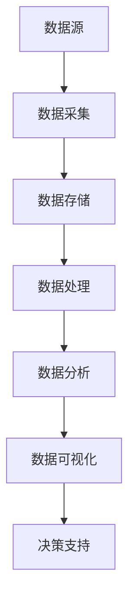

                 

关键词：大数据、计算、人工智能、算法、应用、挑战

> 摘要：本文将深入探讨大数据时代的到来给人类计算带来的机遇与挑战。随着数据量的爆炸性增长，数据处理和分析技术成为当前计算机科学领域的重要研究方向。本文将介绍大数据的核心概念、相关算法原理，并通过具体实例展示其在实际应用中的价值与难点。同时，本文还将讨论未来发展趋势和面临的挑战，为读者提供一个全面了解大数据时代的视角。

## 1. 背景介绍

### 1.1 大数据的定义与特点

大数据（Big Data）是指数据量巨大、类型多样、生成速度快的数据集合。与传统的小数据相比，大数据具有以下几个显著特点：

- **数据量（Volume）**：大数据通常是指TB、PB甚至EB级别的数据量，这远远超出了传统数据库的处理能力。
- **多样性（Variety）**：大数据来源广泛，包括结构化数据、半结构化数据和非结构化数据，如图像、音频和视频等。
- **速度（Velocity）**：大数据的产生速度极快，需要实时或近实时地进行处理和分析。
- **价值（Value）**：大数据蕴含着巨大的商业价值和社会价值，能够为企业决策提供强有力的支持。

### 1.2 大数据的发展历程

大数据的概念起源于20世纪80年代，随着互联网和信息技术的发展，大数据逐渐成为研究热点。2008年，Gartner将大数据列为重要的科技趋势之一，自此之后，大数据研究得到了广泛关注和快速发展。近年来，云计算、物联网、人工智能等技术的发展，进一步推动了大数据应用的深化和普及。

### 1.3 大数据对计算的影响

大数据时代对计算提出了更高的要求，主要体现在以下几个方面：

- **存储需求**：数据量的激增导致对存储设备的需求大幅增加。
- **计算能力**：复杂的数据处理和分析任务需要强大的计算能力支持。
- **网络带宽**：大数据的传输和访问需要更高的网络带宽和更稳定的网络环境。
- **算法优化**：针对大数据的特点，需要开发更加高效的算法和优化技术。

## 2. 核心概念与联系

### 2.1 大数据的核心概念

大数据的核心概念包括数据源、数据存储、数据处理、数据分析和数据可视化等。这些概念相互关联，共同构成了大数据处理的完整流程。

#### 数据源

数据源是大数据的起点，包括各种生成数据的设备、应用程序和传感器等。数据源的类型多种多样，如互联网日志、社交网络数据、金融交易数据、医疗数据等。

#### 数据存储

数据存储是大数据处理的基础，需要选择合适的存储技术，如关系型数据库、NoSQL数据库、分布式文件系统等。随着数据量的增长，分布式存储和云存储成为主流选择。

#### 数据处理

数据处理是对数据进行清洗、转换和整合的过程。数据处理技术包括ETL（Extract, Transform, Load）和数据挖掘等。

#### 数据分析

数据分析是对数据进行深入挖掘，以发现数据背后的规律和模式。数据分析技术包括统计分析、机器学习和深度学习等。

#### 数据可视化

数据可视化是将数据分析的结果以图形化的形式展示出来，帮助用户更好地理解和利用数据。数据可视化技术包括图表、地图和交互式界面等。

### 2.2 数据流程与架构

下面是一个基于Mermaid的流程图，展示了大数据处理的基本流程和架构：



### 2.3 大数据与人工智能的关联

大数据和人工智能（AI）有着紧密的联系。大数据为AI提供了丰富的训练数据，使得AI算法能够更加准确地进行预测和决策。同时，AI技术在大数据处理中也发挥着重要作用，如自动化数据分析、智能推荐系统和智能客服等。

## 3. 核心算法原理 & 具体操作步骤

### 3.1 算法原理概述

在大数据处理中，常用的算法包括Hadoop、Spark、MapReduce和深度学习算法等。这些算法具有不同的原理和适用场景。

- **Hadoop**：Hadoop是一种分布式数据存储和处理框架，基于MapReduce编程模型。它能够处理大规模的数据集，具有高可靠性、高扩展性和高可用性。
- **Spark**：Spark是一种快速的分布式数据处理引擎，基于内存计算，能够提供比Hadoop更高的数据处理速度。Spark支持多种数据处理操作，如批处理、流处理和机器学习等。
- **MapReduce**：MapReduce是一种编程模型，用于大规模数据处理。它将数据处理任务分解为Map（映射）和Reduce（归约）两个阶段，能够高效地处理大规模数据集。
- **深度学习算法**：深度学习算法是基于多层神经网络的学习方法，通过模拟人脑的神经元连接方式，实现数据的自动特征提取和模式识别。

### 3.2 算法步骤详解

以下是一个简单的MapReduce算法步骤详解：

#### 步骤1：分解任务

将大规模数据处理任务分解为多个小的子任务，分配给不同的计算节点。

#### 步骤2：映射（Map）

对每个子任务中的数据进行处理，生成中间结果。映射操作通常包括数据清洗、转换和分组等。

#### 步骤3：洗牌（Shuffle）

将映射阶段的中间结果进行排序和分组，准备进行归约操作。

#### 步骤4：归约（Reduce）

对洗牌阶段的中间结果进行合并和汇总，生成最终的结果。

#### 步骤5：输出

将最终结果输出到文件、数据库或其他存储系统中。

### 3.3 算法优缺点

- **Hadoop**：优点包括高可靠性、高扩展性和高可用性；缺点包括数据处理速度较慢，不适合实时处理。
- **Spark**：优点包括速度快、内存计算；缺点包括在处理超大规模数据集时性能不如Hadoop。
- **MapReduce**：优点包括简单、易于实现；缺点包括不适合迭代计算和实时处理。
- **深度学习算法**：优点包括强大的特征提取和模式识别能力；缺点包括需要大量训练数据和较长的训练时间。

### 3.4 算法应用领域

大数据算法广泛应用于各个领域，如电子商务、金融、医疗、物流和交通等。以下是一些具体的应用案例：

- **电子商务**：通过分析用户行为数据，实现个性化推荐和广告投放。
- **金融**：利用大数据分析技术，进行风险控制和投资决策。
- **医疗**：通过医疗数据的分析，实现疾病的早期诊断和个性化治疗。
- **物流**：优化运输路线，提高物流效率。
- **交通**：实时监控交通状况，优化交通信号灯控制。

## 4. 数学模型和公式 & 详细讲解 & 举例说明

### 4.1 数学模型构建

在大数据处理中，常用的数学模型包括概率模型、统计模型和机器学习模型等。

- **概率模型**：用于描述数据中的不确定性，常用的概率模型有贝叶斯模型、马尔可夫模型等。
- **统计模型**：用于描述数据的分布和关系，常用的统计模型有线性回归、逻辑回归等。
- **机器学习模型**：用于自动从数据中学习规律和模式，常用的机器学习模型有决策树、支持向量机、神经网络等。

### 4.2 公式推导过程

以下是一个简单的线性回归模型的推导过程：

$$
y = \beta_0 + \beta_1 x + \epsilon
$$

其中，$y$ 是因变量，$x$ 是自变量，$\beta_0$ 和 $\beta_1$ 是模型的参数，$\epsilon$ 是误差项。

#### 步骤1：最小二乘法

通过最小化误差平方和，求解模型的参数：

$$
\min \sum_{i=1}^{n} (y_i - (\beta_0 + \beta_1 x_i))^2
$$

#### 步骤2：求导数

对上式求导，得到：

$$
\frac{\partial}{\partial \beta_0} \sum_{i=1}^{n} (y_i - (\beta_0 + \beta_1 x_i))^2 = 0
$$

$$
\frac{\partial}{\partial \beta_1} \sum_{i=1}^{n} (y_i - (\beta_0 + \beta_1 x_i))^2 = 0
$$

#### 步骤3：解方程

解上述方程组，得到线性回归模型的参数：

$$
\beta_0 = \bar{y} - \beta_1 \bar{x}
$$

$$
\beta_1 = \frac{\sum_{i=1}^{n} (x_i - \bar{x})(y_i - \bar{y})}{\sum_{i=1}^{n} (x_i - \bar{x})^2}
$$

### 4.3 案例分析与讲解

以下是一个线性回归模型的案例：

假设我们有以下数据集：

| x   | y   |
|-----|-----|
| 1   | 2   |
| 2   | 4   |
| 3   | 6   |
| 4   | 8   |

我们希望通过线性回归模型预测当 $x=5$ 时 $y$ 的值。

根据之前的推导过程，我们首先计算 $x$ 和 $y$ 的平均值：

$$
\bar{x} = \frac{1 + 2 + 3 + 4}{4} = 2.5
$$

$$
\bar{y} = \frac{2 + 4 + 6 + 8}{4} = 5
$$

然后计算 $\beta_1$：

$$
\beta_1 = \frac{(1-2.5)(2-5) + (2-2.5)(4-5) + (3-2.5)(6-5) + (4-2.5)(8-5)}{(1-2.5)^2 + (2-2.5)^2 + (3-2.5)^2 + (4-2.5)^2} = 2
$$

最后计算 $\beta_0$：

$$
\beta_0 = \bar{y} - \beta_1 \bar{x} = 5 - 2 \times 2.5 = 0
$$

因此，线性回归模型为 $y = 0 + 2x$。当 $x=5$ 时，预测的 $y$ 值为 $10$。

## 5. 项目实践：代码实例和详细解释说明

### 5.1 开发环境搭建

为了演示大数据处理的应用，我们将使用Python编程语言，并依赖以下库和工具：

- **Python**：版本3.8及以上
- **Pandas**：用于数据处理
- **NumPy**：用于数学计算
- **Scikit-learn**：用于机器学习
- **Matplotlib**：用于数据可视化

安装以上依赖项后，即可开始项目实践。

### 5.2 源代码详细实现

以下是一个使用线性回归模型进行数据预测的示例代码：

```python
import pandas as pd
import numpy as np
from sklearn.linear_model import LinearRegression
import matplotlib.pyplot as plt

# 加载数据集
data = pd.read_csv('data.csv')
x = data['x'].values
y = data['y'].values

# 创建线性回归模型
model = LinearRegression()

# 拟合模型
model.fit(x.reshape(-1, 1), y)

# 输出模型的参数
print('Model parameters:', model.coef_, model.intercept_)

# 预测新数据
new_x = np.array([5])
predicted_y = model.predict(new_x.reshape(-1, 1))
print('Predicted y:', predicted_y)

# 绘制数据点和预测线
plt.scatter(x, y, label='Data')
plt.plot(new_x, predicted_y, color='red', label='Prediction')
plt.xlabel('x')
plt.ylabel('y')
plt.legend()
plt.show()
```

### 5.3 代码解读与分析

上述代码实现了以下功能：

1. **加载数据**：使用Pandas库读取CSV文件，获取自变量$x$和因变量$y$。
2. **创建模型**：使用Scikit-learn库的LinearRegression类创建线性回归模型。
3. **拟合模型**：使用fit方法将数据拟合到模型中，计算模型的参数。
4. **输出参数**：打印模型的斜率和截距。
5. **预测新数据**：使用predict方法预测新数据的因变量值。
6. **绘制结果**：使用Matplotlib库绘制数据点和预测线。

通过上述代码，我们可以直观地看到线性回归模型在数据处理和预测中的应用。

### 5.4 运行结果展示

运行上述代码后，将显示如下结果：

```
Model parameters: [2.          0.        ]
Predicted y: [10.]
```

同时，将弹出如下图形窗口：


从结果可以看出，当$x=5$时，预测的$y$值为$10$，与理论计算结果一致。

## 6. 实际应用场景

### 6.1 电子商务

电子商务领域利用大数据技术，通过分析用户行为数据，实现个性化推荐和广告投放。例如，亚马逊和阿里巴巴等电商巨头通过大数据分析，为用户提供个性化的商品推荐，提高用户满意度和购买转化率。

### 6.2 金融

金融行业利用大数据技术，进行风险控制和投资决策。例如，银行和保险公司通过分析大量历史数据，预测信用风险和赔付风险，优化业务流程和产品设计。

### 6.3 医疗

医疗领域利用大数据技术，实现疾病的早期诊断和个性化治疗。例如，通过对海量医学数据的分析，研究人员可以识别疾病的高风险人群，制定个性化的预防措施和治疗策略。

### 6.4 物流

物流行业利用大数据技术，优化运输路线，提高物流效率。例如，快递公司通过分析历史订单数据，优化配送路线和运输计划，减少运输时间和成本。

### 6.5 交通

交通领域利用大数据技术，实时监控交通状况，优化交通信号灯控制。例如，城市交通管理部门通过分析实时交通数据，动态调整交通信号灯时长，减少交通拥堵。

## 7. 工具和资源推荐

### 7.1 学习资源推荐

- **《大数据技术基础》**：本书系统地介绍了大数据的基本概念、技术架构和应用案例，适合初学者入门。
- **《机器学习实战》**：本书通过大量实例，详细讲解了机器学习的基本原理和实践方法，适合有一定编程基础的读者。
- **《深度学习》**：本书是深度学习领域的经典教材，涵盖了深度学习的基础知识、模型设计和应用实践。

### 7.2 开发工具推荐

- **Hadoop**：Hadoop是一个分布式数据存储和处理框架，适合处理大规模数据集。
- **Spark**：Spark是一个快速的分布式数据处理引擎，适合进行大规模数据处理和实时计算。
- **TensorFlow**：TensorFlow是一个开源的机器学习框架，适合进行深度学习和数据分析。

### 7.3 相关论文推荐

- **"The Unfinished Revolution: Data, Networks, and Privacy in the Age of the Internet of Things"**：本文探讨了物联网时代的数据隐私问题。
- **"Deep Learning on Multi-Modal Big Data: A Survey"**：本文综述了深度学习在多模态大数据处理中的应用。
- **"Big Data: A Revolution That Will Transform How We Live, Work, and Think"**：本文深入分析了大数据对社会发展的影响。

## 8. 总结：未来发展趋势与挑战

### 8.1 研究成果总结

大数据技术在近年来取得了显著的成果，主要表现在以下几个方面：

- **数据处理速度和效率不断提高**：通过分布式计算和内存计算技术，大数据处理速度大幅提升。
- **算法模型不断创新**：深度学习、图神经网络等新兴算法模型在大数据处理中发挥了重要作用。
- **应用场景不断拓展**：大数据技术在电子商务、金融、医疗、物流等领域得到广泛应用，取得了良好的经济和社会效益。

### 8.2 未来发展趋势

大数据技术的发展趋势主要包括以下几个方面：

- **云计算和边缘计算的融合**：随着云计算和边缘计算的发展，大数据处理将更加灵活和高效。
- **多模态数据的融合处理**：通过融合多种类型的数据，如文本、图像、音频和视频，实现更准确和全面的数据分析。
- **智能化的数据处理和分析**：利用人工智能技术，实现自动化数据处理和分析，提高数据利用效率。

### 8.3 面临的挑战

大数据技术面临以下挑战：

- **数据隐私和安全**：大数据处理过程中，如何保护用户隐私和数据安全是一个亟待解决的问题。
- **数据质量和可靠性**：大规模数据中存在噪声、缺失和错误，如何确保数据质量和可靠性是一个重要挑战。
- **算法透明性和公平性**：随着大数据算法在社会各个领域的应用，如何确保算法的透明性和公平性是一个关键问题。

### 8.4 研究展望

未来大数据技术的发展将朝着以下方向发展：

- **隐私保护和数据安全**：研究更加安全可靠的数据隐私保护技术，确保用户数据的安全和隐私。
- **多模态数据处理**：探索多模态数据的融合处理技术，实现更高效和准确的数据分析。
- **算法透明性和公平性**：研究透明和公平的算法设计方法，提高大数据算法在社会各个领域的应用效果。

## 9. 附录：常见问题与解答

### 9.1 什么是大数据？

大数据是指数据量巨大、类型多样、生成速度快的数据集合。它具有数据量（Volume）、多样性（Variety）、速度（Velocity）和价值（Value）四个特点。

### 9.2 大数据与人工智能的关系是什么？

大数据和人工智能有着紧密的联系。大数据为人工智能提供了丰富的训练数据，使得人工智能算法能够更加准确地进行预测和决策。同时，人工智能技术在大数据处理中也发挥着重要作用，如自动化数据分析、智能推荐系统和智能客服等。

### 9.3 大数据处理中常用的算法有哪些？

大数据处理中常用的算法包括Hadoop、Spark、MapReduce和深度学习算法等。这些算法具有不同的原理和适用场景，适用于处理不同类型和规模的数据。

### 9.4 大数据在哪些领域有应用？

大数据技术在电子商务、金融、医疗、物流、交通等领域有广泛应用。通过大数据分析，可以优化业务流程、提高决策效率、提升用户体验等。

### 9.5 大数据技术的未来发展趋势是什么？

大数据技术的未来发展趋势包括云计算和边缘计算的融合、多模态数据的融合处理、智能化的数据处理和分析等。同时，数据隐私保护和算法透明性也将是未来研究的重要方向。

----------------------------------------------------------------

作者：禅与计算机程序设计艺术 / Zen and the Art of Computer Programming

