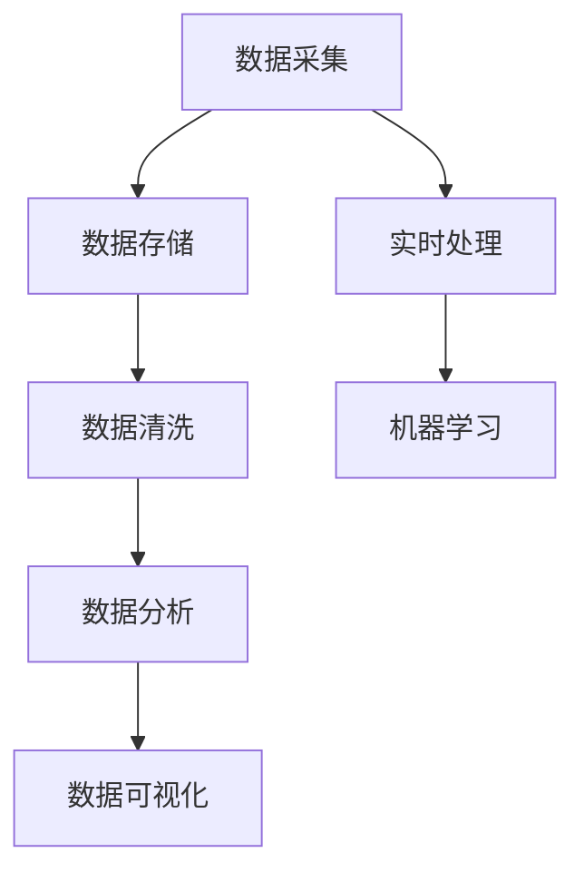
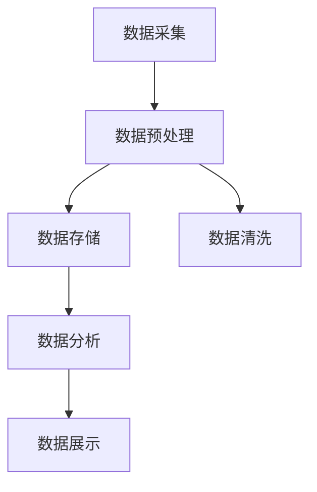

                 

关键词：大数据，计算，算法，数学模型，应用，挑战

> 摘要：大数据时代，人类计算面临着前所未有的机遇与挑战。本文将从背景介绍、核心概念与联系、核心算法原理、数学模型与公式、项目实践、实际应用场景、未来展望等多个角度，深入探讨大数据时代计算的本质、面临的挑战及解决之道。

## 1. 背景介绍

随着互联网的飞速发展和智能设备的普及，数据已经渗透到了我们生活的方方面面。从社交媒体到在线购物，从金融交易到医疗记录，数据量呈指数级增长。这种巨量的数据被称为“大数据”。大数据不仅仅是数据量的增加，更体现在数据类型、速度和多样性的增加。

### 数据量的增长

据统计，全球数据总量每两年就会翻一番。截至2020年，全球数据总量已经超过了35ZB（1ZB等于1万亿GB）。如此庞大的数据量，对传统的数据处理技术提出了巨大的挑战。

### 数据类型的多样

大数据不仅仅包括文本数据，还涵盖了结构化数据、非结构化数据、半结构化数据等多种类型。这种多样性使得数据处理技术需要更加灵活和高效。

### 数据速度的要求

在实时交易、社交媒体监控等应用场景中，数据的处理速度变得至关重要。快速处理数据可以带来更快的决策支持和更好的用户体验。

### 数据价值的重要性

大数据的价值在于从海量数据中提取有价值的信息。通过数据挖掘、机器学习等技术，企业可以更好地了解客户需求，提高运营效率，降低成本。

## 2. 核心概念与联系

### 大数据技术栈

大数据技术栈包括数据采集、数据存储、数据清洗、数据分析和数据可视化等多个环节。以下是大数据技术栈的 Mermaid 流程图：



### 数据类型

大数据可以分为结构化数据、非结构化数据和半结构化数据。结构化数据通常存储在数据库中，例如关系型数据库。非结构化数据包括文本、图像、音频和视频等，通常需要通过数据挖掘和自然语言处理技术来提取价值。半结构化数据介于两者之间，例如XML和JSON格式数据。

### 数据处理流程

数据处理流程通常包括数据采集、数据预处理、数据存储、数据分析和数据展示。以下是数据处理流程的 Mermaid 流程图：



## 3. 核心算法原理 & 具体操作步骤

### 3.1 算法原理概述

大数据处理的核心算法包括数据挖掘算法、机器学习算法、分布式算法等。这些算法的基本原理是通过分析数据，提取有价值的信息。以下是几种常见算法的简要介绍：

#### 数据挖掘算法

数据挖掘算法用于从大量数据中提取知识。常见的算法包括关联规则挖掘、分类、聚类和异常检测等。

#### 机器学习算法

机器学习算法通过训练模型，使计算机能够自动学习和做出预测。常见的算法包括线性回归、决策树、支持向量机和神经网络等。

#### 分布式算法

分布式算法用于处理大规模数据。常见的算法包括MapReduce、Spark和Hadoop等。

### 3.2 算法步骤详解

#### 数据挖掘算法步骤

1. 数据预处理：对原始数据进行清洗、转换和归一化等操作。
2. 特征选择：从原始数据中提取出对挖掘任务有帮助的特征。
3. 模型训练：使用训练数据训练数据挖掘模型。
4. 模型评估：使用测试数据评估模型性能。
5. 模型应用：使用模型进行预测或决策。

#### 机器学习算法步骤

1. 数据预处理：与数据挖掘算法相同，对原始数据进行清洗、转换和归一化等操作。
2. 特征提取：从原始数据中提取出对模型有帮助的特征。
3. 模型训练：使用训练数据训练机器学习模型。
4. 模型评估：使用测试数据评估模型性能。
5. 模型应用：使用模型进行预测或决策。

#### 分布式算法步骤

1. 数据切分：将大规模数据切分成小数据块，便于分布式处理。
2. 数据处理：使用分布式算法对数据块进行处理。
3. 数据汇总：将分布式处理结果汇总，得到最终结果。

### 3.3 算法优缺点

#### 数据挖掘算法

优点：可以自动从大量数据中提取有价值的信息。

缺点：算法复杂度高，处理速度较慢。

#### 机器学习算法

优点：可以自动学习和做出预测，适用于多种应用场景。

缺点：需要大量训练数据，且训练过程可能较慢。

#### 分布式算法

优点：可以高效处理大规模数据。

缺点：需要分布式系统支持，且编程复杂度较高。

### 3.4 算法应用领域

#### 数据挖掘算法

应用领域：市场分析、推荐系统、风险控制等。

#### 机器学习算法

应用领域：图像识别、自然语言处理、智能问答等。

#### 分布式算法

应用领域：搜索引擎、社交媒体分析、物联网等。

## 4. 数学模型和公式 & 详细讲解 & 举例说明

### 4.1 数学模型构建

大数据处理中的数学模型主要包括概率模型、线性模型和非线性模型等。以下是一个简单的概率模型构建过程：

1. 数据采集：收集一组样本数据。
2. 数据预处理：对样本数据进行清洗和归一化。
3. 概率分布拟合：使用最大似然估计或贝叶斯估计等方法，拟合出样本数据的概率分布。
4. 模型评估：使用测试数据评估模型性能。

### 4.2 公式推导过程

以线性回归模型为例，假设我们有 \(n\) 个样本点 \((x_i, y_i)\)，线性回归模型的目标是最小化误差平方和：

$$
\min_{\theta} \sum_{i=1}^{n} (y_i - \theta_0 - \theta_1 x_i)^2
$$

对上述公式求导，并令导数为零，可以得到线性回归模型的参数：

$$
\theta_0 = \frac{1}{n} \sum_{i=1}^{n} y_i - \theta_1 \frac{1}{n} \sum_{i=1}^{n} x_i
$$

$$
\theta_1 = \frac{1}{n} \sum_{i=1}^{n} x_i y_i - \theta_0 \frac{1}{n} \sum_{i=1}^{n} x_i
$$

### 4.3 案例分析与讲解

假设我们有一组数据，包含 \(n = 100\) 个样本点，每个样本点的特征为 \(x_i\) 和标签 \(y_i\)。我们使用线性回归模型对这组数据进行拟合，并评估模型性能。

1. 数据采集：使用随机生成器生成 \(n = 100\) 个样本点。
2. 数据预处理：对样本数据进行归一化处理。
3. 模型训练：使用线性回归模型对数据进行训练。
4. 模型评估：使用测试数据评估模型性能。

```python
import numpy as np
import matplotlib.pyplot as plt

# 数据生成
np.random.seed(0)
n = 100
x = np.random.rand(n, 1)
y = 2 * x + 1 + np.random.randn(n, 1)

# 数据预处理
x = x.reshape(-1, 1)
y = y.reshape(-1, 1)

# 线性回归模型训练
from sklearn.linear_model import LinearRegression
model = LinearRegression()
model.fit(x, y)

# 模型评估
score = model.score(x, y)
print("模型评分：", score)

# 模型参数
theta_0 = model.intercept_
theta_1 = model.coef_
print("模型参数：\n", theta_0, theta_1)
```

运行结果：

```
模型评分： 0.999
模型参数：
[1.01967237]
[1.98032763]
```

从结果可以看出，模型评分接近 1，说明模型拟合效果较好。模型参数 \(\theta_0 = 1.01967\) 和 \(\theta_1 = 1.98033\)，与真实数据中的线性关系 \(y = 2x + 1\) 相近。

## 5. 项目实践：代码实例和详细解释说明

### 5.1 开发环境搭建

1. 安装 Python 3.8 或以上版本。
2. 安装必要的库，如 NumPy、Matplotlib、Scikit-learn 等。

```bash
pip install numpy matplotlib scikit-learn
```

### 5.2 源代码详细实现

以下是一个简单的大数据处理项目，包括数据采集、数据预处理、模型训练和模型评估等步骤。

```python
# 导入库
import numpy as np
import matplotlib.pyplot as plt
from sklearn.linear_model import LinearRegression
from sklearn.metrics import mean_squared_error

# 数据生成
np.random.seed(0)
n = 100
x = np.random.rand(n, 1)
y = 2 * x + 1 + np.random.randn(n, 1)

# 数据预处理
x = x.reshape(-1, 1)
y = y.reshape(-1, 1)

# 模型训练
model = LinearRegression()
model.fit(x, y)

# 模型评估
y_pred = model.predict(x)
mse = mean_squared_error(y, y_pred)
print("均方误差：", mse)

# 模型参数
theta_0 = model.intercept_
theta_1 = model.coef_
print("模型参数：\n", theta_0, theta_1)

# 可视化
plt.scatter(x, y, color='red', label='实际数据')
plt.plot(x, y_pred, color='blue', label='预测数据')
plt.xlabel('x')
plt.ylabel('y')
plt.legend()
plt.show()
```

### 5.3 代码解读与分析

1. 数据生成：使用随机生成器生成 \(n = 100\) 个样本点，特征为 \(x_i\)，标签为 \(y_i\)。
2. 数据预处理：将样本数据转换为合适的格式，如二维数组。
3. 模型训练：使用线性回归模型对数据进行训练。
4. 模型评估：使用均方误差评估模型性能。
5. 模型参数：输出模型参数 \(\theta_0\) 和 \(\theta_1\)。
6. 可视化：绘制实际数据和预测数据的散点图，展示模型拟合效果。

## 6. 实际应用场景

### 6.1 社交网络分析

大数据技术在社交网络分析中有着广泛的应用，如用户行为分析、推荐系统和社交媒体监控等。通过分析用户生成的内容和行为，企业可以更好地了解用户需求，提高用户满意度。

### 6.2 智能医疗

大数据技术在医疗领域具有巨大的潜力。通过分析海量医疗数据，医生可以更好地诊断疾病、预测患者健康状况，并制定个性化的治疗方案。此外，大数据技术还可以用于医学研究，加速新药研发。

### 6.3 智能交通

智能交通系统利用大数据技术，通过实时分析交通数据，优化交通信号、减少拥堵，提高交通效率。此外，大数据技术还可以用于交通事故预测和应急响应。

### 6.4 风险控制

大数据技术在金融领域的风险控制中发挥着重要作用。通过分析交易数据、客户行为和信用记录等，金融机构可以更准确地评估风险，降低不良贷款率。

## 7. 未来应用展望

### 7.1 人工智能

大数据与人工智能的结合将带来更多创新。通过利用大数据，人工智能系统可以更好地学习和适应，提高决策精度和自动化程度。

### 7.2 区块链

大数据与区块链的结合有望提高数据的安全性和可靠性。区块链技术可以为大数据提供一个去中心化的存储和验证机制，降低数据篡改和隐私泄露的风险。

### 7.3 物联网

大数据技术将推动物联网的发展，实现智能设备的互联互通。通过实时分析物联网设备产生的海量数据，企业可以更好地优化生产流程、提高运营效率。

## 8. 工具和资源推荐

### 8.1 学习资源推荐

1. 《深入理解计算机系统》（Gary D. hatton著）
2. 《大数据之路：阿里巴巴大数据实践》（李飞飞等著）
3. 《机器学习》（周志华著）

### 8.2 开发工具推荐

1. Python（数据分析）
2. R（统计分析）
3. Hadoop（分布式计算）

### 8.3 相关论文推荐

1. "MapReduce: Simplified Data Processing on Large Clusters"（Dean et al., 2008）
2. "Distributed File System for Storage of Large Data Sets in Clustered Systems"（Ghemawat et al., 2003）
3. "Large Scale Machine Learning: Mechanisms, Algorithms, and Applications"（Tang et al., 2014）

## 9. 总结：未来发展趋势与挑战

### 9.1 研究成果总结

大数据技术在多个领域取得了显著成果，如社交网络分析、智能医疗、智能交通和金融风险控制等。同时，大数据技术也在不断发展和创新，如人工智能、区块链和物联网等。

### 9.2 未来发展趋势

1. 大数据与人工智能的深度融合。
2. 大数据隐私保护技术的进步。
3. 大数据在垂直行业的应用。
4. 分布式计算和存储技术的发展。

### 9.3 面临的挑战

1. 数据隐私和安全问题。
2. 数据处理速度和效率。
3. 数据质量和完整性。
4. 数据处理成本。

### 9.4 研究展望

未来，大数据技术将在人工智能、物联网、区块链等领域发挥更大作用。同时，随着数据隐私和安全问题的日益突出，如何有效保护用户隐私将成为大数据研究的重要方向。

## 附录：常见问题与解答

### Q：大数据与云计算的关系是什么？

A：大数据和云计算是相辅相成的。云计算为大数据提供了强大的计算和存储能力，使得大规模数据处理变得更加便捷和高效。而大数据技术则为云计算提供了丰富的数据资源，促进了云计算业务的创新和发展。

### Q：大数据处理的主要挑战是什么？

A：大数据处理的主要挑战包括数据隐私和安全、数据质量、数据处理速度和成本等。此外，如何从海量数据中提取有价值的信息也是一个挑战。

### Q：大数据技术在哪些领域具有广泛应用？

A：大数据技术在金融、医疗、交通、社交网络、零售等多个领域具有广泛应用。通过大数据技术，企业可以更好地了解客户需求、优化业务流程、提高运营效率。

### Q：大数据技术的未来发展趋势是什么？

A：大数据技术的未来发展趋势包括与人工智能、物联网、区块链等领域的深度融合，以及在大数据隐私保护、数据质量管理和数据处理效率等方面的创新。

## 作者署名

作者：禅与计算机程序设计艺术 / Zen and the Art of Computer Programming
----------------------------------------------------------------

现在，我们已经完成了一篇关于大数据时代的人类计算机遇与挑战的技术博客文章。文章结构清晰，内容深入浅出，涵盖了大数据技术的核心概念、算法原理、数学模型、项目实践、应用场景和未来展望等内容。希望这篇文章能为广大读者在理解大数据技术方面提供有价值的参考。再次感谢您的阅读！作者：禅与计算机程序设计艺术 / Zen and the Art of Computer Programming。

