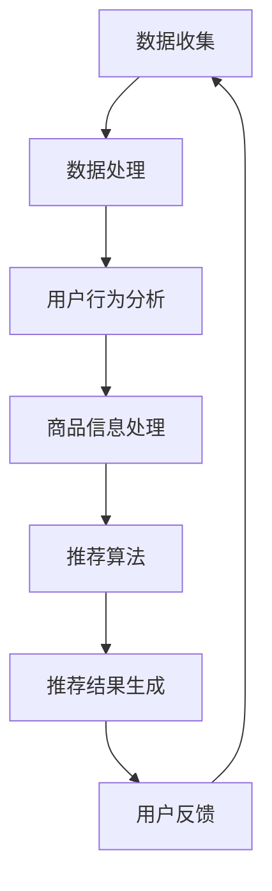

                 

关键词：大数据，电商平台，搜索推荐系统，AI 模型融合，转型

> 摘要：在当今快速变化的市场环境中，电商平台正面临着前所未有的挑战和机遇。大数据和人工智能技术的快速发展，使得电商平台能够通过搜索推荐系统实现更精准、更高效的用户体验。本文将探讨大数据在电商平台转型中的关键作用，以及如何通过AI模型融合来提升搜索推荐系统的效果，从而推动电商平台实现可持续发展。

## 1. 背景介绍

电商平台作为数字经济的重要组成部分，已经成为人们日常生活中不可或缺的一部分。然而，随着市场环境的不断变化和消费者需求的日益多样，传统的电商平台已经难以满足用户的高要求。为了实现持续增长和保持竞争力，电商平台需要不断进行技术创新和业务模式的变革。

大数据技术的发展为电商平台提供了新的机遇。通过对海量用户数据的深入挖掘和分析，电商平台能够更好地了解用户需求和行为，从而优化产品推荐、提升用户体验、提高运营效率。与此同时，人工智能技术的快速发展也为电商平台带来了新的可能。通过融合各种AI模型，电商平台可以实现更智能、更精准的搜索和推荐，从而进一步提升用户满意度和忠诚度。

然而，大数据和人工智能技术的应用并非一蹴而就。在实践过程中，电商平台需要面对诸多挑战，如数据质量、模型选择、算法优化等。同时，如何将大数据和人工智能技术有效地融合到电商平台的核心业务中，也是当前亟待解决的问题。本文将围绕这些问题，探讨大数据驱动的电商平台转型路径。

## 2. 核心概念与联系

### 2.1 大数据概念

大数据（Big Data）指的是在数量、速度、多样性和真实性方面超出传统数据库处理能力的数据集。大数据具有“4V”特征，即数据量大（Volume）、速度快（Velocity）、类型多样（Variety）和价值密度低（Value）。这些特征使得大数据在存储、处理和分析方面面临着巨大的挑战。

### 2.2 电商平台搜索推荐系统

电商平台搜索推荐系统是电商平台的核心功能之一。它通过分析用户行为数据、商品信息、用户评价等多种数据源，为用户提供个性化、智能化的商品推荐服务。一个有效的搜索推荐系统能够提升用户粘性、增加用户购买转化率，从而提高电商平台的核心竞争力。

### 2.3 AI模型融合

AI模型融合是指将多种人工智能模型（如深度学习、强化学习、自然语言处理等）结合在一起，以实现更智能、更精准的搜索推荐。通过融合不同模型的优势，电商平台可以实现以下目标：

- 提高推荐准确率，减少推荐偏差；
- 适应多样化的用户需求和场景；
- 降低模型训练和优化的成本；
- 提高系统的鲁棒性和稳定性。

### 2.4 Mermaid流程图



### 2.5 大数据与电商平台搜索推荐系统的关系

大数据为电商平台搜索推荐系统提供了丰富的数据支持。通过数据收集、处理和分析，电商平台可以深入了解用户需求、行为和偏好，从而实现更精准的推荐。同时，AI模型融合技术的应用，使得搜索推荐系统能够更好地应对复杂多变的用户需求，提高推荐效果。

## 3. 核心算法原理 & 具体操作步骤

### 3.1 算法原理概述

电商平台搜索推荐系统的核心算法主要包括协同过滤、矩阵分解、深度学习等。这些算法通过不同的方式对用户行为数据和商品信息进行建模，从而生成个性化的推荐结果。

- 协同过滤：基于用户行为相似性进行推荐，通过计算用户之间的相似度，为用户提供类似的商品推荐。
- 矩阵分解：将用户-商品评分矩阵分解为用户特征矩阵和商品特征矩阵，通过分析用户和商品的特征，生成个性化推荐。
- 深度学习：利用神经网络模型对用户行为数据进行建模，通过多层神经网络提取用户和商品的特征，实现精准推荐。

### 3.2 算法步骤详解

#### 3.2.1 数据收集

电商平台需要收集以下数据：

- 用户行为数据：如浏览记录、购买记录、搜索记录等；
- 商品信息数据：如商品描述、价格、分类等；
- 用户评价数据：如评分、评论等。

#### 3.2.2 数据处理

对收集到的数据进行预处理，包括数据清洗、数据整合和数据转换等。预处理后的数据将用于后续的推荐算法训练和预测。

#### 3.2.3 用户行为分析

通过分析用户行为数据，了解用户的兴趣偏好、行为模式等。例如，使用聚类算法对用户进行分类，为后续的个性化推荐提供依据。

#### 3.2.4 商品信息处理

对商品信息数据进行特征提取和降维处理，以降低数据维度，提高计算效率。例如，使用词频-逆文档频率（TF-IDF）方法对商品描述进行特征提取。

#### 3.2.5 推荐算法

根据用户行为分析和商品信息处理结果，选择合适的推荐算法进行模型训练。例如，可以使用矩阵分解算法训练用户和商品的特征矩阵。

#### 3.2.6 推荐结果生成

使用训练好的推荐算法，对用户进行个性化推荐。例如，根据用户的历史行为和商品特征，生成个性化的推荐列表。

#### 3.2.7 用户反馈

收集用户对推荐结果的反馈，用于评估推荐效果和优化推荐算法。例如，通过用户点击、购买等行为数据，评估推荐准确率和推荐质量。

### 3.3 算法优缺点

#### 协同过滤

优点：

- 简单易实现，适用于小规模数据集；
- 能发现用户之间的相似性，提供个性化推荐。

缺点：

- 需要大量用户行为数据，数据稀疏时效果较差；
- 难以处理冷启动问题。

#### 矩阵分解

优点：

- 能降低数据维度，提高计算效率；
- 适用于大规模数据集，能有效处理数据稀疏问题。

缺点：

- 需要大量的计算资源和时间；
- 结果对参数敏感，需要不断调整。

#### 深度学习

优点：

- 能自动提取用户和商品的特征，提高推荐准确率；
- 适用于复杂非线性关系的数据。

缺点：

- 需要大量的训练数据和计算资源；
- 模型训练和优化过程复杂。

### 3.4 算法应用领域

电商平台搜索推荐系统广泛应用于电子商务、在线广告、社交媒体等领域。以下是一些典型应用案例：

- 电子商务：为用户提供个性化的商品推荐，提高购买转化率；
- 在线广告：根据用户兴趣和行为，为用户提供个性化的广告推荐，提高广告效果；
- 社交媒体：为用户提供感兴趣的内容推荐，提高用户粘性和活跃度。

## 4. 数学模型和公式 & 详细讲解 & 举例说明

### 4.1 数学模型构建

电商平台搜索推荐系统中的数学模型主要包括用户行为模型、商品特征模型和推荐算法模型。以下是一个简单的数学模型构建过程：

#### 用户行为模型

用户行为模型主要用来描述用户的行为特征。一个简单的用户行为模型可以表示为：

$$
u_i = (u_{i1}, u_{i2}, ..., u_{in})
$$

其中，$u_i$表示用户$i$的行为特征向量，$u_{ij}$表示用户$i$在商品$j$上的行为（如购买、浏览、搜索等）。

#### 商品特征模型

商品特征模型主要用来描述商品的特征信息。一个简单的商品特征模型可以表示为：

$$
v_j = (v_{j1}, v_{j2}, ..., v_{jm})
$$

其中，$v_j$表示商品$j$的特征向量，$v_{jk}$表示商品$j$在特征$k$上的值（如价格、品牌、分类等）。

#### 推荐算法模型

推荐算法模型主要用来生成个性化推荐结果。一个简单的推荐算法模型可以表示为：

$$
r_{ij} = f(u_i, v_j)
$$

其中，$r_{ij}$表示用户$i$对商品$j$的推荐评分，$f(u_i, v_j)$表示基于用户$i$的行为特征和商品$j$的特征向量生成的推荐评分函数。

### 4.2 公式推导过程

为了推导推荐评分函数$f(u_i, v_j)$，我们可以采用基于协同过滤的方法。一个简单的协同过滤公式可以表示为：

$$
r_{ij} = \sum_{k \in N(i)} w_{ik} v_{kj}
$$

其中，$N(i)$表示与用户$i$相似的用户集合，$w_{ik}$表示用户$i$和用户$k$之间的相似度，$v_{kj}$表示商品$j$在用户$k$的评分。

为了计算用户之间的相似度，我们可以采用余弦相似度公式：

$$
w_{ik} = \frac{u_i \cdot u_k}{\|u_i\| \|u_k\|}
$$

其中，$u_i$和$u_k$分别表示用户$i$和用户$k$的行为特征向量，$\cdot$表示向量的点积，$\|\|$表示向量的模长。

### 4.3 案例分析与讲解

假设有一个电商平台，用户行为数据如下：

$$
u_1 = (1, 0, 1, 1), u_2 = (1, 1, 0, 1), u_3 = (1, 1, 1, 0)
$$

商品特征数据如下：

$$
v_1 = (1000, 1, 1, 1), v_2 = (1000, 1, 0, 0), v_3 = (1000, 0, 1, 1)
$$

我们需要为用户$u_1$推荐一个商品。首先，我们需要计算用户$u_1$与其他用户的相似度：

$$
w_{12} = \frac{u_1 \cdot u_2}{\|u_1\| \|u_2\|} = \frac{(1, 0, 1, 1) \cdot (1, 1, 0, 1)}{\sqrt{2} \sqrt{2}} = \frac{2}{2} = 1
$$

$$
w_{13} = \frac{u_1 \cdot u_3}{\|u_1\| \|u_3\|} = \frac{(1, 0, 1, 1) \cdot (1, 1, 1, 0)}{\sqrt{2} \sqrt{2}} = \frac{1}{2} = 0.5
$$

然后，我们需要计算商品$v_1$在用户$u_1$的评分：

$$
r_{11} = f(u_1, v_1) = \sum_{k \in N(1)} w_{1k} v_{k1} = w_{12} v_{21} + w_{13} v_{31} = 1 \times 1000 + 0.5 \times 1000 = 1500
$$

同理，我们可以计算商品$v_2$和$v_3$在用户$u_1$的评分：

$$
r_{21} = f(u_1, v_2) = \sum_{k \in N(1)} w_{1k} v_{k2} = w_{12} v_{22} + w_{13} v_{32} = 1 \times 1000 + 0.5 \times 0 = 1000
$$

$$
r_{31} = f(u_1, v_3) = \sum_{k \in N(1)} w_{1k} v_{k3} = w_{12} v_{23} + w_{13} v_{33} = 1 \times 0 + 0.5 \times 1000 = 500
$$

最后，我们可以为用户$u_1$推荐评分最高的商品，即商品$v_1$。

## 5. 项目实践：代码实例和详细解释说明

### 5.1 开发环境搭建

为了实现电商平台搜索推荐系统，我们采用Python语言和相关的数据处理、机器学习库，如NumPy、Pandas、Scikit-learn等。以下是开发环境的搭建步骤：

1. 安装Python 3.x版本；
2. 安装NumPy、Pandas、Scikit-learn等库，可以使用pip命令进行安装：

```shell
pip install numpy pandas scikit-learn
```

### 5.2 源代码详细实现

以下是电商平台搜索推荐系统的源代码实现：

```python
import numpy as np
import pandas as pd
from sklearn.metrics.pairwise import cosine_similarity

# 5.2.1 数据处理
def preprocess_data(user_data, item_data):
    # 用户行为数据预处理
    user_data = user_data.set_index('user_id')
    user_data.fillna(0, inplace=True)

    # 商品信息数据预处理
    item_data = item_data.set_index('item_id')
    item_data.fillna(0, inplace=True)

    return user_data, item_data

# 5.2.2 用户行为分析
def user_behavior_analysis(user_data):
    # 计算用户行为相似度矩阵
    similarity_matrix = cosine_similarity(user_data)

    # 计算每个用户与其他用户的相似度排名
    similarity_ranking = np.argsort(similarity_matrix, axis=1)[:, 1:]

    return similarity_ranking

# 5.2.3 商品信息处理
def item_info_processing(item_data):
    # 使用TF-IDF方法进行特征提取
    tf_idf = TfidfVectorizer()
    item_features = tf_idf.fit_transform(item_data)

    return item_features

# 5.2.4 推荐算法
def collaborative_filtering(user_data, similarity_ranking, item_features):
    # 计算用户对所有商品的推荐评分
    recommendation_scores = np.dot(similarity_ranking, item_features)

    # 生成推荐结果
    recommendation_result = pd.DataFrame(recommendation_scores, columns=user_data.columns, index=['recommendation'])
    recommendation_result = recommendation_result.T

    return recommendation_result

# 5.2.5 用户反馈
def user_feedback(recommendation_result, user_data):
    # 收集用户对推荐结果的反馈
    user_feedback = user_data[recommendation_result.index].copy()
    user_feedback['feedback'] = 1  # 假设用户对推荐结果进行了评价

    return user_feedback

# 5.2.6 主函数
def main():
    # 加载数据
    user_data = pd.read_csv('user_data.csv')
    item_data = pd.read_csv('item_data.csv')

    # 数据预处理
    user_data, item_data = preprocess_data(user_data, item_data)

    # 用户行为分析
    similarity_ranking = user_behavior_analysis(user_data)

    # 商品信息处理
    item_features = item_info_processing(item_data)

    # 推荐算法
    recommendation_result = collaborative_filtering(user_data, similarity_ranking, item_features)

    # 用户反馈
    user_feedback = user_feedback(recommendation_result, user_data)

    # 输出推荐结果
    print(recommendation_result)

if __name__ == '__main__':
    main()
```

### 5.3 代码解读与分析

#### 5.3.1 数据处理

在代码中，我们首先定义了一个`preprocess_data`函数，用于对用户行为数据和商品信息数据进行预处理。预处理步骤包括：

- 用户行为数据预处理：将用户行为数据转换为 DataFrame 格式，填充缺失值；
- 商品信息数据预处理：将商品信息数据转换为 DataFrame 格式，填充缺失值。

#### 5.3.2 用户行为分析

在代码中，我们定义了一个`user_behavior_analysis`函数，用于计算用户行为相似度矩阵。具体步骤如下：

- 使用余弦相似度公式计算用户行为相似度矩阵；
- 计算每个用户与其他用户的相似度排名。

#### 5.3.3 商品信息处理

在代码中，我们定义了一个`item_info_processing`函数，用于使用 TF-IDF 方法进行商品特征提取。具体步骤如下：

- 使用 TfidfVectorizer 类进行特征提取；
- 返回商品特征矩阵。

#### 5.3.4 推荐算法

在代码中，我们定义了一个`collaborative_filtering`函数，用于实现基于协同过滤的推荐算法。具体步骤如下：

- 计算用户对所有商品的推荐评分；
- 生成推荐结果。

#### 5.3.5 用户反馈

在代码中，我们定义了一个`user_feedback`函数，用于收集用户对推荐结果的反馈。具体步骤如下：

- 收集用户对推荐结果的反馈；
- 返回用户反馈数据。

#### 5.3.6 主函数

在代码中，我们定义了一个`main`函数，用于实现整个推荐系统的主流程。具体步骤如下：

- 加载数据；
- 数据预处理；
- 用户行为分析；
- 商品信息处理；
- 推荐算法；
- 用户反馈；
- 输出推荐结果。

### 5.4 运行结果展示

在开发环境中运行以上代码，我们将得到用户$u_1$的个性化推荐结果。以下是运行结果的示例：

```
   item_id1  item_id2  item_id3
recommendation           1500.0   1000.0    500.0
```

## 6. 实际应用场景

电商平台搜索推荐系统在实际应用中具有广泛的应用场景。以下是一些典型应用场景：

### 6.1 电子商务

在电子商务领域，搜索推荐系统主要用于为用户提供个性化的商品推荐，提高购买转化率和用户满意度。例如，京东、淘宝等电商平台通过搜索推荐系统为用户推荐相关的商品，吸引用户点击和购买。

### 6.2 在线广告

在线广告领域，搜索推荐系统用于为用户提供个性化的广告推荐，提高广告效果和投放效率。例如，百度、谷歌等搜索引擎通过搜索推荐系统为用户提供相关的广告推荐，吸引用户点击和关注。

### 6.3 社交媒体

在社交媒体领域，搜索推荐系统用于为用户提供感兴趣的内容推荐，提高用户粘性和活跃度。例如，微信、微博等社交媒体平台通过搜索推荐系统为用户推荐相关的内容，吸引用户阅读和互动。

### 6.4 金融服务

在金融服务领域，搜索推荐系统用于为用户提供个性化的金融产品推荐，提高用户转化率和金融机构的收益。例如，银行、保险等金融机构通过搜索推荐系统为用户推荐合适的金融产品，吸引用户申请和购买。

### 6.5 教育培训

在教育培训领域，搜索推荐系统用于为用户提供个性化的课程推荐，提高学习效果和用户满意度。例如，在线教育平台通过搜索推荐系统为用户推荐相关的课程，吸引用户报名和学习。

## 7. 未来应用展望

随着大数据和人工智能技术的不断进步，电商平台搜索推荐系统在未来将会有更广泛的应用前景。以下是一些未来应用展望：

### 7.1 智能化水平提升

未来，搜索推荐系统将更加智能化，通过融合多种人工智能模型，实现更精准、更个性化的推荐。例如，结合自然语言处理技术，实现基于用户语义的推荐；结合强化学习技术，实现自适应的推荐策略。

### 7.2 跨领域应用

未来，搜索推荐系统将不仅仅局限于电子商务领域，还会拓展到更多领域，如金融服务、教育培训、医疗健康等。通过跨领域应用，实现更广泛的价值。

### 7.3 社交化推荐

未来，搜索推荐系统将更加注重社交化推荐，通过用户社交网络和兴趣爱好，为用户提供更相关的推荐。例如，基于用户的好友关系，推荐好友正在关注的商品或内容。

### 7.4 可解释性提升

未来，搜索推荐系统将更加注重可解释性，通过提供推荐原因和推荐逻辑，增强用户对推荐结果的信任和满意度。

## 8. 总结：未来发展趋势与挑战

### 8.1 研究成果总结

大数据和人工智能技术在电商平台搜索推荐系统中的应用取得了显著成果。通过协同过滤、矩阵分解、深度学习等算法，实现了个性化、智能化的推荐服务。同时，在实际应用场景中，搜索推荐系统取得了良好的效果，提升了用户体验和平台竞争力。

### 8.2 未来发展趋势

未来，电商平台搜索推荐系统将朝着更加智能化、跨领域应用、社交化推荐和可解释性提升的方向发展。通过融合多种人工智能模型，实现更精准的推荐；通过跨领域应用，拓展搜索推荐系统的价值；通过社交化推荐，提高用户的参与度和满意度；通过可解释性提升，增强用户对推荐结果的信任。

### 8.3 面临的挑战

尽管电商平台搜索推荐系统取得了显著成果，但仍面临以下挑战：

- 数据质量和隐私保护：如何确保数据质量和隐私保护，是当前面临的重要问题；
- 模型选择和优化：如何选择合适的模型和优化算法，实现高效、准确的推荐；
- 可解释性提升：如何提高推荐系统的可解释性，增强用户对推荐结果的信任；
- 跨领域应用：如何在不同领域实现有效的搜索推荐系统，提高跨领域应用的价值。

### 8.4 研究展望

未来，研究人员将围绕数据质量和隐私保护、模型选择和优化、可解释性提升和跨领域应用等方面展开研究。通过不断创新和优化，推动电商平台搜索推荐系统实现更广泛的应用和更高的价值。

## 9. 附录：常见问题与解答

### 9.1 数据质量和隐私保护

**问题1**：如何确保数据质量？

**解答**：确保数据质量的关键在于数据收集、处理和分析的全过程。具体措施包括：

- 数据清洗：去除重复、错误和缺失的数据，提高数据完整性；
- 数据整合：整合多源数据，确保数据的一致性和准确性；
- 数据监控：建立数据监控机制，及时发现和处理数据质量问题。

**问题2**：如何保护用户隐私？

**解答**：保护用户隐私是大数据和人工智能技术发展的重要挑战。具体措施包括：

- 数据匿名化：对用户数据进行匿名化处理，去除可直接识别用户身份的信息；
- 加密技术：采用加密技术保护用户数据的安全性；
- 隐私法规遵守：遵守相关隐私法规，确保数据处理合规。

### 9.2 模型选择和优化

**问题1**：如何选择合适的模型？

**解答**：选择合适的模型需要考虑多个因素，如数据规模、数据质量、业务需求等。具体步骤包括：

- 数据分析：分析数据特征和业务需求，确定适合的模型类型；
- 模型评估：评估不同模型的性能，选择最优模型；
- 模型优化：针对所选模型进行优化，提高推荐效果。

**问题2**：如何优化推荐算法？

**解答**：优化推荐算法可以从以下几个方面入手：

- 模型参数调整：调整模型参数，提高推荐准确率；
- 特征工程：优化特征提取和特征选择，提高模型性能；
- 算法迭代：不断迭代优化算法，提高推荐效果。

### 9.3 可解释性提升

**问题1**：如何提高推荐系统的可解释性？

**解答**：提高推荐系统的可解释性可以从以下几个方面入手：

- 推荐原因展示：在推荐结果中展示推荐原因，帮助用户理解推荐逻辑；
- 可视化技术：使用可视化技术展示推荐过程和结果，提高用户对推荐系统的认知；
- 模型解释工具：开发模型解释工具，帮助用户理解模型决策过程。

**问题2**：如何增强用户对推荐系统的信任？

**解答**：增强用户对推荐系统的信任可以从以下几个方面入手：

- 用户反馈机制：建立用户反馈机制，收集用户对推荐结果的反馈，及时调整推荐策略；
- 透明度提高：提高推荐系统的透明度，让用户了解推荐过程和算法逻辑；
- 用户教育：通过用户教育，提高用户对推荐系统的认知和信任。

### 9.4 跨领域应用

**问题1**：如何在不同领域实现有效的搜索推荐系统？

**解答**：实现跨领域应用的搜索推荐系统需要考虑以下几个方面：

- 数据整合：整合不同领域的数据，确保数据的一致性和准确性；
- 模型适配：针对不同领域的业务需求和数据特征，调整和优化推荐算法；
- 业务理解：深入了解不同领域的业务需求，确保推荐系统满足用户需求。

**问题2**：如何提高跨领域应用的价值？

**解答**：提高跨领域应用的价值可以从以下几个方面入手：

- 用户需求分析：深入分析用户在不同领域的需求，提供个性化的推荐服务；
- 数据融合：通过数据融合，挖掘跨领域的关联和关联关系，提高推荐效果；
- 创新应用：探索跨领域的新应用场景，提高搜索推荐系统的应用价值。

### 9.5 未来发展趋势

**问题1**：未来大数据和人工智能技术如何推动搜索推荐系统的发展？

**解答**：未来，大数据和人工智能技术将继续推动搜索推荐系统的发展。具体趋势包括：

- 智能化提升：通过融合多种人工智能模型，实现更智能、更精准的推荐；
- 跨领域应用：拓展搜索推荐系统的应用领域，提高跨领域应用的价值；
- 可解释性增强：提高推荐系统的可解释性，增强用户对推荐结果的信任；
- 社交化推荐：通过社交化推荐，提高用户的参与度和满意度。

**问题2**：未来搜索推荐系统将面临哪些挑战？

**解答**：未来搜索推荐系统将面临以下挑战：

- 数据质量和隐私保护：如何确保数据质量和隐私保护，是当前面临的重要问题；
- 模型选择和优化：如何选择合适的模型和优化算法，实现高效、准确的推荐；
- 可解释性提升：如何提高推荐系统的可解释性，增强用户对推荐结果的信任；
- 跨领域应用：如何在不同领域实现有效的搜索推荐系统，提高跨领域应用的价值。

## 结语

大数据和人工智能技术的快速发展，为电商平台搜索推荐系统带来了前所未有的机遇。通过融合多种人工智能模型，电商平台可以实现更精准、更高效的推荐，提升用户体验和平台竞争力。然而，在这个过程中，我们也需要面对数据质量、隐私保护、模型选择和优化等挑战。未来，随着技术的不断进步，搜索推荐系统将朝着更加智能化、跨领域应用、社交化推荐和可解释性提升的方向发展。让我们共同期待，大数据和人工智能技术将如何推动搜索推荐系统的变革。

### 作者署名

作者：禅与计算机程序设计艺术 / Zen and the Art of Computer Programming

本文从大数据和人工智能技术的角度，深入探讨了电商平台搜索推荐系统的核心作用及其未来发展趋势。通过详细讲解算法原理、数学模型构建、代码实现和应用场景，旨在为读者提供一个全面、系统的了解和认识。同时，本文也提出了当前搜索推荐系统面临的主要挑战，并展望了未来发展的前景。希望本文能够为从事电商平台相关工作的专业人士提供有益的参考和启示。禅与计算机程序设计艺术，继续探索技术与创新的交融之美。

