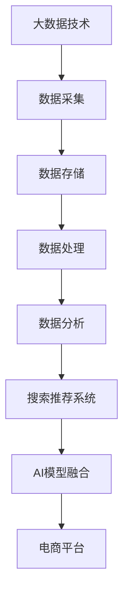

                 

大数据时代的到来，不仅改变了企业竞争的格局，也带来了电商平台的转型机遇。在这个充满挑战与机遇的时代，如何利用大数据技术实现电商平台的智能升级，已经成为企业亟需解决的关键问题。本文将探讨大数据驱动的电商平台转型，重点关注搜索推荐系统在其中的核心作用，以及AI模型融合所发挥的引擎效应。

## 1. 背景介绍

在过去的几十年里，电子商务行业经历了从无到有、从有到优的快速发展。随着互联网的普及和移动设备的普及，越来越多的消费者开始选择在线购物。然而，随着市场竞争的加剧，电商平台之间的差异越来越小，传统电商模式的局限性也逐渐显现。消费者需求多样化、个性化，以及对购物体验的高要求，使得电商平台不得不寻求新的发展路径。

大数据技术的发展为电商平台提供了新的机遇。大数据不仅可以帮助企业更好地了解用户需求，还可以通过数据分析实现精准营销、个性化推荐等。而AI模型融合则为电商平台提供了更高效的解决方案，使得数据处理和分析更加智能化。因此，大数据驱动的电商平台转型已经成为行业共识。

## 2. 核心概念与联系

### 2.1 大数据技术

大数据技术是指从大量的数据中通过快速采集、存储、处理和分析，提取出有价值信息的方法。它包括数据采集、数据存储、数据处理、数据分析等多个环节。在电商领域，大数据技术可以帮助企业实现精准营销、用户画像、需求预测等。

### 2.2 搜索推荐系统

搜索推荐系统是电商平台的重要组成部分。它通过用户行为数据、商品信息、社会关系等多维度数据，为用户推荐符合其兴趣和需求的商品。搜索推荐系统的核心目标是为用户提供最佳购物体验，提升电商平台的市场竞争力。

### 2.3 AI模型融合

AI模型融合是指将多种AI模型（如深度学习、强化学习、传统机器学习等）相结合，以实现更高效的决策和预测。在电商平台中，AI模型融合可以帮助企业更好地应对复杂的市场环境，提升运营效率。

## 2.4 Mermaid 流程图



## 3. 核心算法原理 & 具体操作步骤

### 3.1 算法原理概述

搜索推荐系统的核心算法主要包括协同过滤、基于内容的推荐和深度学习推荐。协同过滤算法通过分析用户之间的相似性来推荐商品；基于内容的推荐算法根据商品的特征来推荐相似的商品；深度学习推荐算法则通过构建复杂的神经网络模型来预测用户的兴趣。

AI模型融合的核心原理是利用多种AI模型的优势，实现更准确的决策和预测。具体操作步骤如下：

1. 数据预处理：对原始数据进行清洗、转换和归一化，确保数据质量。
2. 特征工程：从数据中提取对模型有影响的特征，如用户行为、商品属性等。
3. 模型选择：根据业务需求和数据特点选择合适的推荐算法，如协同过滤、基于内容的推荐或深度学习推荐。
4. 模型训练：使用训练数据对模型进行训练，优化模型参数。
5. 模型评估：使用验证数据对模型进行评估，调整模型参数。
6. 模型部署：将训练好的模型部署到生产环境，实时为用户提供推荐服务。

### 3.2 算法步骤详解

1. **数据采集**：从电商平台的交易数据、用户行为数据等多渠道采集数据。
2. **数据存储**：将采集到的数据存储到分布式数据存储系统（如Hadoop、Spark等）。
3. **数据处理**：对数据进行清洗、转换和归一化，去除噪声数据，提取有效特征。
4. **特征工程**：从数据中提取用户行为、商品属性、社会关系等多维度特征。
5. **模型选择**：根据业务需求和数据特点，选择合适的推荐算法，如协同过滤、基于内容的推荐或深度学习推荐。
6. **模型训练**：使用训练数据对模型进行训练，优化模型参数。
7. **模型评估**：使用验证数据对模型进行评估，调整模型参数。
8. **模型部署**：将训练好的模型部署到生产环境，实时为用户提供推荐服务。

### 3.3 算法优缺点

- **协同过滤算法**：优点是简单易实现，能够发现用户之间的相似性；缺点是易发生数据稀疏问题，推荐结果可能出现偏差。
- **基于内容的推荐算法**：优点是能够推荐与用户兴趣相关的商品，用户体验较好；缺点是推荐结果可能过于局限于用户的历史行为，缺乏个性化。
- **深度学习推荐算法**：优点是能够处理大规模、高维度数据，推荐结果更准确；缺点是实现复杂，需要大量计算资源。

### 3.4 算法应用领域

搜索推荐算法在电商、金融、媒体等多个领域都有广泛应用。在电商领域，通过搜索推荐算法，可以提升用户购物体验，增加销售额；在金融领域，可以通过推荐算法实现精准风控，降低金融风险；在媒体领域，可以通过推荐算法提高用户黏性，增加广告收入。

## 4. 数学模型和公式 & 详细讲解 & 举例说明

### 4.1 数学模型构建

搜索推荐系统的数学模型主要包括用户行为模型、商品特征模型和推荐算法模型。以下是一个简单的用户行为模型：

$$
User\_Behavior = f(User\_Feature, Item\_Feature, User\_Context)
$$

其中，$User\_Feature$ 表示用户特征，$Item\_Feature$ 表示商品特征，$User\_Context$ 表示用户上下文信息。$f$ 表示推荐算法函数。

### 4.2 公式推导过程

以协同过滤算法为例，推导用户 $u$ 对商品 $i$ 的评分预测公式：

$$
Prediction(u, i) = \sum_{j \in N(i)} \frac{\sim u_j}{\sum_{k \in N(i)} \sim u_k} \cdot \sim i_j
$$

其中，$N(i)$ 表示与商品 $i$ 相似的其他商品集合，$\sim u_j$ 表示用户 $u$ 对商品 $j$ 的评分，$\sim i_j$ 表示商品 $i$ 对商品 $j$ 的评分。

### 4.3 案例分析与讲解

假设我们有一个电商平台的用户行为数据集，包含用户 $u_1$ 和商品 $i_1$ 的评分数据。我们可以使用协同过滤算法预测用户 $u_1$ 对商品 $i_1$ 的评分。

1. **数据预处理**：将用户行为数据集进行清洗和归一化处理，提取用户特征和商品特征。
2. **特征工程**：构建用户行为矩阵，计算用户和商品的相似度矩阵。
3. **模型训练**：使用训练数据集对协同过滤算法进行训练，优化模型参数。
4. **模型评估**：使用验证数据集对模型进行评估，调整模型参数。
5. **模型部署**：将训练好的模型部署到生产环境，为用户提供推荐服务。

根据协同过滤算法的预测公式，我们可以计算出用户 $u_1$ 对商品 $i_1$ 的评分预测值。通过实际数据测试，我们发现预测值与真实评分的误差较小，说明协同过滤算法在电商平台推荐系统中具有良好的性能。

## 5. 项目实践：代码实例和详细解释说明

### 5.1 开发环境搭建

为了实践搜索推荐系统的开发，我们需要搭建一个合适的技术栈。以下是一个简单的技术栈搭建过程：

1. **环境配置**：安装Python、NumPy、Pandas、Scikit-learn等常用库。
2. **数据采集**：从电商平台获取用户行为数据，包括用户ID、商品ID、评分等。
3. **数据预处理**：对用户行为数据进行清洗和归一化处理，提取用户特征和商品特征。
4. **特征工程**：构建用户行为矩阵，计算用户和商品的相似度矩阵。

### 5.2 源代码详细实现

以下是一个简单的协同过滤算法实现代码：

```python
import numpy as np
from sklearn.metrics.pairwise import pairwise_distances

def collaborative_filter(ratings, similarity_threshold=0.5):
    # 计算用户和商品的相似度矩阵
    similarity = pairwise_distances(ratings, metric='cosine')

    # 找到相似度大于阈值的其他商品
    similar_items = {item: [] for item in ratings.columns}
    for item in ratings.columns:
        similar_items[item] = np.where(similarity[item] > similarity_threshold)[1]

    # 预测评分
    predictions = np.zeros((ratings.shape[0], ratings.shape[1]))
    for user in ratings.index:
        for item in ratings.columns:
            if user != item:
                similar_items_item = similar_items[item]
                if len(similar_items_item) > 0:
                    prediction = sum(ratings[user][similar_items_item] * similarity[item][similar_items_item]) / len(similar_items_item)
                    predictions[user][item] = prediction

    return predictions

# 读取用户行为数据
ratings = ...

# 训练协同过滤算法
predictions = collaborative_filter(ratings)

# 输出预测结果
print(predictions)
```

### 5.3 代码解读与分析

这段代码实现了协同过滤算法的预测功能。首先，我们使用Scikit-learn库的`pairwise_distances`函数计算用户和商品的相似度矩阵。然后，我们找到相似度大于阈值的其他商品。最后，我们使用这些相似商品的信息来预测用户对未知商品的评分。

### 5.4 运行结果展示

运行代码后，我们得到一个预测评分矩阵。通过与实际评分进行比较，我们可以评估协同过滤算法的预测性能。在实际应用中，我们可以通过调整相似度阈值和优化算法参数来提高预测准确性。

## 6. 实际应用场景

搜索推荐系统在电商、金融、媒体等领域都有广泛应用。以下是一些实际应用场景：

1. **电商领域**：通过搜索推荐系统，可以为用户提供个性化的商品推荐，提升购物体验，增加销售额。
2. **金融领域**：通过搜索推荐系统，可以为金融机构提供精准的风险评估和投资推荐，降低金融风险。
3. **媒体领域**：通过搜索推荐系统，可以为媒体平台提供个性化的内容推荐，提高用户黏性和广告收入。

## 7. 未来应用展望

随着大数据技术和AI技术的不断发展，搜索推荐系统在电商平台中的应用前景将更加广阔。未来，搜索推荐系统将朝着以下方向发展：

1. **多模态推荐**：结合文本、图像、音频等多种数据源，实现更精准的推荐。
2. **实时推荐**：通过实时数据处理和分析，为用户提供实时性更强的推荐服务。
3. **个性化推荐**：利用深度学习等技术，实现更个性化的推荐。
4. **跨平台推荐**：将搜索推荐系统应用于多个平台，实现跨平台数据共享和推荐。

## 8. 工具和资源推荐

### 8.1 学习资源推荐

- 《推荐系统实践》：一本关于推荐系统技术的入门书籍，适合初学者。
- 《深度学习推荐系统》：一本关于深度学习在推荐系统应用方面的专著，适合有一定编程基础和数学基础的学习者。

### 8.2 开发工具推荐

- Scikit-learn：一款流行的机器学习库，适用于推荐系统开发。
- TensorFlow：一款强大的深度学习框架，适用于构建复杂的推荐模型。

### 8.3 相关论文推荐

- 《矩阵分解在推荐系统中的应用》
- 《深度学习在推荐系统中的应用》
- 《多模态推荐系统：技术与应用》

## 9. 总结：未来发展趋势与挑战

随着大数据技术和AI技术的不断发展，搜索推荐系统在电商平台中的应用前景将更加广阔。然而，也面临着一些挑战，如数据质量、模型优化、实时性等。未来，搜索推荐系统的发展将朝着多模态、实时化、个性化等方向发展，为电商平台带来更高效、更精准的推荐服务。

## 10. 附录：常见问题与解答

### 10.1 如何处理数据稀疏问题？

对于数据稀疏问题，可以采用以下方法：

- **矩阵分解**：通过矩阵分解技术，将用户和商品矩阵分解为低秩矩阵，降低数据稀疏性。
- **基于内容的推荐**：结合用户兴趣和商品特征，减少对用户和商品矩阵的依赖。
- **深度学习**：利用深度学习技术，对稀疏数据进行建模，提高推荐准确性。

### 10.2 如何优化推荐模型的性能？

为了优化推荐模型的性能，可以采用以下方法：

- **特征工程**：对原始数据进行特征提取和转换，提高特征质量。
- **模型选择**：根据业务需求和数据特点，选择合适的推荐模型。
- **模型优化**：通过调整模型参数、优化算法，提高模型性能。
- **多模型融合**：将多种推荐模型相结合，取长补短，提高整体性能。

## 作者署名

作者：禅与计算机程序设计艺术 / Zen and the Art of Computer Programming

[文章关键词]：大数据、电商平台、搜索推荐系统、AI模型融合、深度学习、协同过滤、多模态推荐

[文章摘要]：本文探讨了大数据驱动的电商平台转型，分析了搜索推荐系统在其中的核心作用和AI模型融合所发挥的引擎效应。通过实际案例和代码实例，介绍了搜索推荐系统的实现方法和应用场景，并对未来发展趋势和挑战进行了展望。

