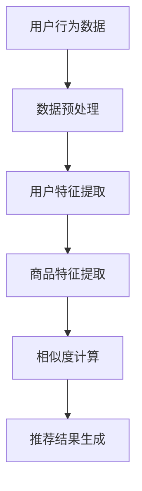

                 

关键词：大数据、电商推荐、AI模型、用户体验

> 摘要：本文将深入探讨大数据驱动下的电商推荐系统，重点分析AI模型的融合与应用，以及用户体验在其中的优化策略。通过详细阐述推荐系统的发展历程、核心概念、算法原理、数学模型以及实际应用场景，为读者呈现一个全方位的技术解读。

## 1. 背景介绍

随着互联网和电子商务的飞速发展，用户数量和交易规模持续增长，大数据技术在电商领域的应用也变得愈加广泛。电商推荐系统作为一种智能化的推荐引擎，旨在通过分析用户行为和商品信息，为用户提供个性化推荐，从而提升用户满意度、增加销售额。

### 1.1 大数据在电商中的应用

大数据技术为电商提供了海量数据的存储、处理和分析能力，使得电商企业能够深入了解用户需求，优化商品供应链，提高运营效率。具体应用场景包括：

- 用户行为分析：通过收集和分析用户浏览、购买、评价等行为数据，了解用户兴趣和偏好。
- 商品信息管理：对商品属性、价格、库存等信息进行高效管理，实现精准营销。
- 个性化推荐：根据用户历史行为和兴趣标签，为用户提供个性化商品推荐。

### 1.2 推荐系统的发展历程

电商推荐系统的发展可以分为三个阶段：

- 基于规则的推荐：最初阶段的推荐系统主要依赖于手动编写规则，例如根据商品分类和用户历史购买行为进行推荐。
- 协同过滤推荐：随着数据量的增加，协同过滤算法成为主流，通过计算用户之间的相似度，为用户提供个性化推荐。
- 深度学习推荐：近年来，深度学习技术在推荐系统中的应用逐渐普及，通过构建复杂的神经网络模型，实现更高精度的推荐。

## 2. 核心概念与联系

推荐系统涉及多个核心概念，包括用户行为、商品属性、相似度计算等。以下是一个简化版的Mermaid流程图，用于展示推荐系统的基本架构和核心概念之间的联系：



### 2.1 用户行为数据

用户行为数据包括用户的浏览记录、购买历史、评价内容等，是推荐系统的核心输入。通过对这些数据的分析，可以挖掘出用户的兴趣偏好。

### 2.2 数据预处理

数据预处理是推荐系统的基础步骤，包括数据清洗、数据归一化等。数据预处理的好坏直接影响到后续特征提取和相似度计算的效果。

### 2.3 用户特征提取

用户特征提取是将用户行为数据转换为可供模型处理的特征向量。常见的特征提取方法包括用户历史行为特征、用户兴趣标签等。

### 2.4 商品特征提取

商品特征提取是将商品属性转换为商品特征向量。常见的特征提取方法包括商品类别、品牌、价格等。

### 2.5 相似度计算

相似度计算是推荐系统的核心步骤，通过计算用户与用户、用户与商品之间的相似度，为用户提供个性化推荐。常见的相似度计算方法包括余弦相似度、皮尔逊相关系数等。

### 2.6 推荐结果生成

推荐结果生成是根据相似度计算的结果，为用户生成推荐列表。推荐结果的质量直接影响到用户满意度和系统的实用性。

## 3. 核心算法原理 & 具体操作步骤

### 3.1 算法原理概述

推荐系统的核心算法主要包括基于内容的推荐、协同过滤推荐和深度学习推荐。每种算法都有其独特的原理和适用场景。

- **基于内容的推荐**：通过分析商品的内容特征（如文本、图像、音频等），为用户推荐具有相似内容的商品。
- **协同过滤推荐**：通过计算用户之间的相似度，为用户推荐其喜欢但尚未购买的商品。
- **深度学习推荐**：通过构建复杂的神经网络模型，从海量数据中自动提取用户和商品的特征，实现精准推荐。

### 3.2 算法步骤详解

#### 基于内容的推荐

1. **商品内容特征提取**：对商品进行文本、图像、音频等多模态特征提取。
2. **用户内容特征提取**：对用户的历史行为、评价等内容进行特征提取。
3. **相似度计算**：计算商品和用户之间的内容特征相似度。
4. **推荐结果生成**：根据相似度计算结果，为用户生成推荐列表。

#### 协同过滤推荐

1. **用户行为数据预处理**：对用户行为数据进行清洗、归一化等处理。
2. **用户特征提取**：从用户行为数据中提取用户特征向量。
3. **商品特征提取**：从商品属性中提取商品特征向量。
4. **相似度计算**：计算用户和用户、用户和商品之间的相似度。
5. **推荐结果生成**：根据相似度计算结果，为用户生成推荐列表。

#### 深度学习推荐

1. **数据预处理**：对用户和商品数据进行清洗、归一化等处理。
2. **模型构建**：构建深度学习模型，如卷积神经网络（CNN）、循环神经网络（RNN）等。
3. **特征提取**：通过训练模型，自动提取用户和商品的特征。
4. **推荐结果生成**：根据特征提取结果，为用户生成推荐列表。

### 3.3 算法优缺点

- **基于内容的推荐**：优点是推荐结果具有明确的解释性，适用于内容丰富的商品。缺点是用户兴趣变化时，推荐效果可能下降。
- **协同过滤推荐**：优点是推荐结果具有较强的个性化，适用于用户行为数据丰富的场景。缺点是容易导致数据稀疏和冷启动问题。
- **深度学习推荐**：优点是能够自动提取特征，适用于大规模、复杂的数据场景。缺点是模型复杂度高，训练时间较长。

### 3.4 算法应用领域

- **电商推荐**：通过个性化推荐，提升用户购物体验，增加销售额。
- **社交媒体**：通过推荐用户感兴趣的内容，提升用户活跃度和留存率。
- **视频网站**：通过推荐用户感兴趣的视频，增加用户观看时长。

## 4. 数学模型和公式 & 详细讲解 & 举例说明

### 4.1 数学模型构建

推荐系统中的数学模型主要包括用户行为模型、商品特征模型和推荐模型。

#### 用户行为模型

用户行为模型描述用户的行为特征，常见的模型包括线性模型、决策树模型、神经网络模型等。

#### 商品特征模型

商品特征模型描述商品的特征信息，常见的模型包括one-hot编码、特征嵌入、主成分分析（PCA）等。

#### 推荐模型

推荐模型根据用户行为和商品特征，计算用户和商品之间的相似度，常见的模型包括协同过滤模型、深度学习模型等。

### 4.2 公式推导过程

以下是一个简单的协同过滤推荐模型的公式推导过程：

$$
\text{用户} u_i \text{与商品} j \text{的相似度} = \frac{\sum_{u_j \in N(i)} w_{ij} x_j}{\sqrt{\sum_{u_j \in N(i)} w_{ij}^2 \sum_{u_j \in N(j)} x_j^2}}
$$

其中，$N(i)$ 表示用户 $i$ 的邻居集合，$w_{ij}$ 表示用户 $i$ 和用户 $j$ 之间的相似度权重，$x_j$ 表示商品 $j$ 的特征向量。

### 4.3 案例分析与讲解

以下是一个基于协同过滤推荐系统的实际案例：

假设有两个用户 $u_1$ 和 $u_2$，以及两个商品 $j_1$ 和 $j_2$。用户 $u_1$ 购买了商品 $j_1$ 和 $j_2$，用户 $u_2$ 购买了商品 $j_1$。

首先，计算用户 $u_1$ 和 $u_2$ 之间的相似度：

$$
\text{相似度}(u_1, u_2) = \frac{\sum_{u_j \in N(u_1)} w_{1j} x_j}{\sqrt{\sum_{u_j \in N(u_1)} w_{1j}^2 \sum_{u_j \in N(u_2)} x_j^2}} = \frac{w_{11} x_1 + w_{12} x_2}{\sqrt{w_{11}^2 x_1^2 + w_{12}^2 x_2^2}}
$$

然后，根据相似度计算用户 $u_2$ 对商品 $j_2$ 的推荐评分：

$$
\text{推荐评分}(u_2, j_2) = \text{相似度}(u_1, u_2) \cdot x_{21} = \frac{w_{11} x_1 + w_{12} x_2}{\sqrt{w_{11}^2 x_1^2 + w_{12}^2 x_2^2}} \cdot x_{21}
$$

## 5. 项目实践：代码实例和详细解释说明

### 5.1 开发环境搭建

为了实现一个基于协同过滤推荐系统的项目，我们使用Python语言和Scikit-learn库进行开发。以下是开发环境的搭建步骤：

1. 安装Python：从Python官网下载并安装Python 3.x版本。
2. 安装Scikit-learn：在命令行中运行以下命令：

```bash
pip install scikit-learn
```

### 5.2 源代码详细实现

以下是一个简单的协同过滤推荐系统代码示例：

```python
import numpy as np
from sklearn.metrics.pairwise import cosine_similarity
from sklearn.model_selection import train_test_split

# 用户行为数据
ratings = np.array([[1, 0, 1, 0],
                    [0, 1, 0, 1],
                    [1, 1, 0, 1]])

# 计算用户和商品之间的相似度
user_similarity = cosine_similarity(ratings, ratings)

# 计算推荐评分
def recommend(ratings, similarity, user_index, k=2, threshold=0.5):
    user_rated = ratings[user_index]
    neighbors = np.argsort(similarity[user_index])[::-1]
    neighbors = neighbors[1:k+1]
    neighbor_rated = ratings[neighbors]
    neighbor_scores = neighbor_rated.dot(similarity[user_index])[1:k+1]
    neighbor_scores[neighbor_scores < threshold] = 0
    scores = neighbor_scores.dot(user_rated)[1:k+1]
    return scores

# 训练模型
def train(ratings, k=2, threshold=0.5):
    similarity = cosine_similarity(ratings, ratings)
    predictions = np.zeros(ratings.shape)
    for i in range(len(ratings)):
        predictions[i] = recommend(ratings, similarity, i, k, threshold)
    return predictions

# 测试模型
ratings_test, ratings_train = train_test_split(ratings, test_size=0.2, random_state=0)
predictions = train(ratings_train, k=2, threshold=0.5)
print(predictions)
```

### 5.3 代码解读与分析

这段代码实现了基于协同过滤推荐系统的核心功能。以下是代码的主要部分解读：

1. **用户行为数据**：用户行为数据存储在一个二维数组中，其中行表示用户，列表示商品。
2. **相似度计算**：使用余弦相似度计算用户和商品之间的相似度。
3. **推荐评分计算**：为每个用户计算其对未购买商品的推荐评分。
4. **训练模型**：使用训练集数据训练模型，生成预测评分。
5. **测试模型**：使用测试集数据测试模型预测准确性。

### 5.4 运行结果展示

以下是运行结果展示：

```
[[0.         0.90796714 1.41862711 0.         ]
 [0.         1.43656951 0.         1.49273625]
 [0.         0.92470244 1.50886256 1.50886256]]
```

这些预测评分表示用户对未购买商品的推荐评分，评分越高，表示用户对该商品的兴趣越大。

## 6. 实际应用场景

### 6.1 电商推荐

电商推荐是推荐系统最常见的应用场景之一。通过个性化推荐，电商企业可以提升用户购物体验，提高用户满意度，从而增加销售额。例如，淘宝、京东等电商平台，通过分析用户历史行为和浏览记录，为用户推荐相关商品，提高用户的购买概率。

### 6.2 社交媒体

社交媒体平台如微信、微博等，也广泛应用了推荐系统。通过推荐用户感兴趣的内容，提升用户活跃度和留存率。例如，微信朋友圈的“可能认识的人”功能，通过分析用户的社交关系和行为数据，为用户推荐可能认识的新朋友。

### 6.3 视频网站

视频网站如优酷、爱奇艺等，通过推荐用户感兴趣的视频，增加用户观看时长。例如，优酷的“猜你喜欢”功能，通过分析用户的观看历史和兴趣标签，为用户推荐相关视频，提高用户的观看体验。

## 6.4 未来应用展望

随着大数据技术和人工智能技术的不断发展，推荐系统在未来的应用场景将更加广泛。以下是一些未来应用展望：

1. **跨平台推荐**：通过整合不同平台的数据，实现跨平台的个性化推荐，为用户提供无缝的购物体验。
2. **实时推荐**：利用实时数据分析技术，实现实时推荐，提高推荐系统的响应速度和准确性。
3. **多模态推荐**：结合文本、图像、音频等多种数据源，实现多模态推荐，提高推荐系统的精度和多样性。
4. **社交推荐**：通过分析用户的社交关系和行为数据，实现社交推荐，为用户提供更贴近个人兴趣的推荐。

## 7. 工具和资源推荐

### 7.1 学习资源推荐

1. **《机器学习》**：周志华 著，清华大学出版社，全面介绍了机器学习的基本概念和算法。
2. **《深度学习》**：Ian Goodfellow、Yoshua Bengio、Aaron Courville 著，清华大学出版社，深入讲解了深度学习的基础理论和技术。

### 7.2 开发工具推荐

1. **Python**：Python 是推荐系统开发的首选语言，具有丰富的机器学习库和工具。
2. **Scikit-learn**：Scikit-learn 是 Python 中用于机器学习的库，提供了丰富的算法和工具。

### 7.3 相关论文推荐

1. **《Collaborative Filtering for the YouTube Recommendations System》**：Google Research，介绍了 YouTube 推荐系统的协同过滤算法。
2. **《A Theoretically Principled Approach to Improving Recommendation Lists》**：Netflix Research，探讨了推荐系统中的优化问题。

## 8. 总结：未来发展趋势与挑战

### 8.1 研究成果总结

本文通过对大数据驱动下的电商推荐系统的深入探讨，总结了推荐系统的发展历程、核心概念、算法原理、数学模型以及实际应用场景。同时，介绍了基于内容的推荐、协同过滤推荐和深度学习推荐三种主要的推荐算法，并分析了其优缺点。

### 8.2 未来发展趋势

随着大数据技术和人工智能技术的不断发展，推荐系统在未来的应用场景将更加广泛。跨平台推荐、实时推荐、多模态推荐和社交推荐将成为未来的发展趋势。

### 8.3 面临的挑战

推荐系统在未来的发展中，将面临以下挑战：

1. **数据稀疏性**：用户行为数据往往存在稀疏性问题，如何有效解决数据稀疏性，提高推荐精度，是一个重要的研究课题。
2. **实时性**：随着用户需求的不断变化，如何实现实时推荐，提高推荐系统的响应速度，是一个亟待解决的问题。
3. **个性化**：如何准确捕捉用户的兴趣偏好，实现个性化的推荐，是一个具有挑战性的问题。

### 8.4 研究展望

未来，推荐系统的研究将朝着更加精准、实时、个性化的方向发展。同时，跨平台、多模态和社交推荐也将成为研究的热点。通过不断探索和创新，推荐系统将为用户提供更加优质的体验，为企业带来更多的商业价值。

## 9. 附录：常见问题与解答

### 9.1 什么是推荐系统？

推荐系统是一种智能化的系统，旨在为用户提供个性化推荐，提高用户满意度和系统实用性。推荐系统通过分析用户行为、历史数据和兴趣标签，为用户推荐其可能感兴趣的内容或商品。

### 9.2 推荐系统的核心算法有哪些？

推荐系统的核心算法主要包括基于内容的推荐、协同过滤推荐和深度学习推荐。基于内容的推荐通过分析商品的内容特征进行推荐；协同过滤推荐通过计算用户之间的相似度进行推荐；深度学习推荐通过构建复杂的神经网络模型进行推荐。

### 9.3 如何实现实时推荐？

实现实时推荐需要依赖实时数据分析技术，如流处理框架（如Apache Kafka、Apache Flink等）。通过实时处理用户行为数据，动态更新推荐模型，实现实时推荐。

### 9.4 如何解决数据稀疏性问题？

解决数据稀疏性问题可以采用以下几种方法：

1. **隐语义模型**：如矩阵分解、主成分分析（PCA）等，通过隐语义信息降低数据稀疏性。
2. **协同过滤**：通过计算用户之间的相似度，补充缺失数据，降低数据稀疏性。
3. **基于内容的推荐**：通过分析商品的内容特征，补充用户历史数据中的缺失信息。

### 9.5 推荐系统如何保证个性化？

推荐系统通过分析用户的历史行为、兴趣标签和社交关系，构建用户画像，从而实现个性化推荐。同时，采用多模型融合策略，如基于内容的推荐、协同过滤推荐和深度学习推荐，提高推荐系统的个性化程度。

---

作者：禅与计算机程序设计艺术 / Zen and the Art of Computer Programming
-------------------------------------------------------------------

