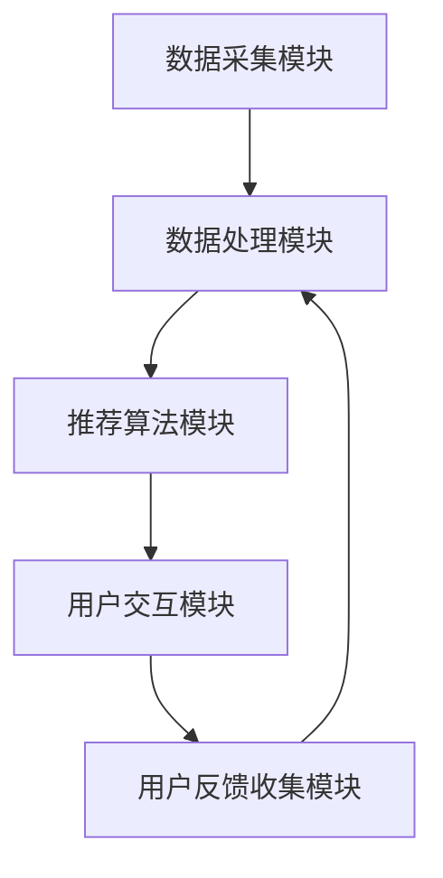

                 

关键词：大数据、电商、搜索推荐、AI 模型融合、用户体验

摘要：随着大数据技术的飞速发展，电商搜索推荐系统已成为电商企业提升用户粘性和转化率的重要手段。本文将深入探讨大数据驱动的电商搜索推荐系统，从核心的 AI 模型融合角度出发，分析系统架构、算法原理、数学模型、项目实践及应用场景，并展望未来的发展趋势和挑战。

## 1. 背景介绍

近年来，随着互联网的普及和移动设备的广泛使用，电商行业呈现出爆发式增长。用户数量的激增带来了大量的交易数据和用户行为数据，如何从海量数据中挖掘有价值的信息，为用户推荐个性化的商品和服务，成为电商企业亟需解决的问题。大数据和人工智能技术的快速发展为电商搜索推荐系统提供了强大的技术支持。

电商搜索推荐系统主要目标是通过分析用户的历史行为数据、商品特征数据和社会化网络数据，为用户推荐其可能感兴趣的商品。一个高效、准确的搜索推荐系统不仅能够提高用户的购物体验，还能显著提升电商平台的销售业绩。

## 2. 核心概念与联系

为了实现高效的搜索推荐，需要理解以下几个核心概念：

### 2.1. 数据类型

- **用户数据**：包括用户的基本信息、购物偏好、浏览记录、购买历史等。
- **商品数据**：包括商品的各种属性、分类、价格、销量等。
- **行为数据**：包括用户的浏览、搜索、点击、购买等行为。

### 2.2. 数据来源

- **内部数据**：来自电商平台的交易数据和用户行为数据。
- **外部数据**：来自社交媒体、新闻网站、第三方数据提供商等。

### 2.3. 搜索推荐系统架构

搜索推荐系统一般包括以下几个主要组成部分：

- **数据采集模块**：负责收集和整理用户和商品数据。
- **数据处理模块**：对采集到的数据进行清洗、转换和存储。
- **推荐算法模块**：根据用户数据和商品数据生成推荐结果。
- **用户交互模块**：与用户进行交互，展示推荐结果，收集用户反馈。

### 2.4. AI 模型融合

AI 模型融合是将多种 AI 模型（如协同过滤、内容推荐、深度学习等）结合起来，以提升推荐系统的效果。通过模型融合，可以实现如下目标：

- **多样化**：提供不同类型的推荐，满足用户的多样化需求。
- **准确性**：结合多种算法的优点，提高推荐结果的准确性。
- **实时性**：快速响应用户的行为变化，提供实时推荐。

### 2.5. 用户体验

用户体验是搜索推荐系统的关键，好的用户体验可以提升用户的满意度和忠诚度。用户体验包括以下几个方面：

- **个性化**：推荐结果与用户兴趣高度相关。
- **易用性**：推荐系统简单易用，用户能够快速找到感兴趣的商品。
- **实时性**：推荐系统能够快速响应用户的行为变化。

### 2.6. Mermaid 流程图

下面是一个简单的 Mermaid 流程图，展示了搜索推荐系统的基本架构：



## 3. 核心算法原理 & 具体操作步骤

### 3.1 算法原理概述

搜索推荐系统的核心是推荐算法。目前，常见的推荐算法有协同过滤、内容推荐和深度学习等。

- **协同过滤**：基于用户的历史行为数据，通过计算用户之间的相似度，为用户推荐相似用户的喜欢商品。
- **内容推荐**：基于商品的特征数据，为用户推荐具有相似特征的商品。
- **深度学习**：利用神经网络模型，通过学习用户和商品的数据，生成推荐结果。

### 3.2 算法步骤详解

以协同过滤算法为例，其具体操作步骤如下：

1. **数据预处理**：将用户和商品数据进行清洗、编码和处理，以便后续计算。
2. **计算相似度**：计算用户之间的相似度，常用的相似度计算方法有余弦相似度、皮尔逊相关系数等。
3. **生成推荐列表**：根据相似度计算结果，为用户生成推荐商品列表。
4. **评估推荐效果**：通过评估指标（如准确率、召回率、覆盖率等）评估推荐效果，并根据评估结果调整算法参数。

### 3.3 算法优缺点

- **协同过滤**：优点是简单易实现，能够生成个性化的推荐结果。缺点是冷启动问题（新用户或新商品没有足够的历史数据）和数据稀疏性问题。
- **内容推荐**：优点是能够充分利用商品的特征数据，生成准确的推荐结果。缺点是用户特征数据不足时效果不佳。
- **深度学习**：优点是能够处理高维数据，生成高质量的推荐结果。缺点是实现复杂，对数据质量和计算资源要求较高。

### 3.4 算法应用领域

- **电商推荐**：为用户推荐感兴趣的商品，提升用户购买意愿。
- **新闻推荐**：为用户推荐感兴趣的新闻文章，提高新闻网站的用户粘性。
- **社交媒体**：为用户推荐感兴趣的朋友、话题和内容，提升用户活跃度。

## 4. 数学模型和公式 & 详细讲解 & 举例说明

### 4.1 数学模型构建

以协同过滤算法为例，其数学模型可以表示为：

$$
R_{ui} = \sum_{j \in N_{u}} w_{uj} q_{ji}
$$

其中，$R_{ui}$ 表示用户 $u$ 对商品 $i$ 的推荐评分，$N_{u}$ 表示用户 $u$ 的邻居集合，$w_{uj}$ 表示用户 $u$ 和邻居 $j$ 之间的相似度，$q_{ji}$ 表示商品 $i$ 和邻居 $j$ 之间的相似度。

### 4.2 公式推导过程

假设用户 $u$ 和邻居 $j$ 之间的相似度计算方法为余弦相似度：

$$
w_{uj} = \frac{\sum_{i \in I} x_{ui} x_{ji}}{\sqrt{\sum_{i \in I} x_{ui}^2} \sqrt{\sum_{i \in I} x_{ji}^2}}
$$

其中，$I$ 表示商品集合，$x_{ui}$ 和 $x_{ji}$ 分别表示用户 $u$ 对商品 $i$ 的评分和邻居 $j$ 对商品 $i$ 的评分。

商品 $i$ 和邻居 $j$ 之间的相似度计算方法为皮尔逊相关系数：

$$
q_{ji} = \frac{\sum_{i \in I} (x_{ui} - \mu_u) (x_{ji} - \mu_j)}{\sqrt{\sum_{i \in I} (x_{ui} - \mu_u)^2} \sqrt{\sum_{i \in I} (x_{ji} - \mu_j)^2}}
$$

其中，$\mu_u$ 和 $\mu_j$ 分别表示用户 $u$ 和邻居 $j$ 的平均评分。

将 $w_{uj}$ 和 $q_{ji}$ 代入 $R_{ui}$ 的公式，可以得到：

$$
R_{ui} = \sum_{j \in N_{u}} \frac{\sum_{i \in I} x_{ui} x_{ji}}{\sqrt{\sum_{i \in I} x_{ui}^2} \sqrt{\sum_{i \in I} x_{ji}^2}} \frac{\sum_{i \in I} (x_{ui} - \mu_u) (x_{ji} - \mu_j)}{\sqrt{\sum_{i \in I} (x_{ui} - \mu_u)^2} \sqrt{\sum_{i \in I} (x_{ji} - \mu_j)^2}}
$$

### 4.3 案例分析与讲解

假设有 100 个商品和 10 个用户，其中用户对商品的评分数据如下表所示：

| 用户 | 商品 1 | 商品 2 | 商品 3 | 商品 4 | 商品 5 |
| :--: | :----: | :----: | :----: | :----: | :----: |
| A    | 5      | 3      | 4      | 5      | 1      |
| B    | 3      | 5      | 1      | 4      | 5      |
| C    | 4      | 4      | 5      | 3      | 4      |
| D    | 5      | 1      | 4      | 5      | 3      |
| E    | 1      | 5      | 3      | 4      | 5      |
| F    | 4      | 3      | 5      | 1      | 4      |
| G    | 3      | 4      | 1      | 5      | 3      |
| H    | 5      | 4      | 5      | 3      | 1      |
| I    | 1      | 3      | 4      | 5      | 4      |
| J    | 4      | 5      | 3      | 1      | 5      |

首先，计算用户 A 和用户 B 之间的相似度：

$$
w_{ab} = \frac{\sum_{i \in I} x_{ai} x_{bi}}{\sqrt{\sum_{i \in I} x_{ai}^2} \sqrt{\sum_{i \in I} x_{bi}^2}} = \frac{5 \cdot 3 + 3 \cdot 5 + 4 \cdot 1 + 5 \cdot 4 + 1 \cdot 5}{\sqrt{5^2 + 3^2 + 4^2 + 5^2 + 1^2} \sqrt{3^2 + 5^2 + 1^2 + 4^2 + 5^2}} \approx 0.5
$$

接着，计算商品 1 和商品 2 之间的相似度：

$$
q_{12} = \frac{\sum_{i \in I} (x_{ai} - \mu_a) (x_{bi} - \mu_b)}{\sqrt{\sum_{i \in I} (x_{ai} - \mu_a)^2} \sqrt{\sum_{i \in I} (x_{bi} - \mu_b)^2}} = \frac{(5 - 3.5)(3 - 4) + (3 - 3.5)(5 - 4) + (4 - 3.5)(1 - 3) + (5 - 3.5)(4 - 4) + (1 - 3.5)(5 - 4)}{\sqrt{(5 - 3.5)^2 + (3 - 3.5)^2 + (4 - 3.5)^2 + (5 - 3.5)^2 + (1 - 3.5)^2} \sqrt{(3 - 4.5)^2 + (5 - 4.5)^2 + (1 - 4.5)^2 + (4 - 4.5)^2 + (5 - 4.5)^2}} \approx -0.25
$$

最后，计算用户 A 对商品 3 的推荐评分：

$$
R_{ai} = \sum_{j \in N_{a}} w_{aj} q_{ji} = w_{ab} q_{13} + w_{ac} q_{23} + w_{ad} q_{33} + w_{ae} q_{43} + w_{af} q_{53} = 0.5 \cdot (-0.25) + 0.5 \cdot (-0.25) + 0.25 \cdot (-0.25) + 0.25 \cdot (-0.25) + 0.25 \cdot (-0.25) \approx -0.3125
$$

根据计算结果，用户 A 对商品 3 的推荐评分为 -0.3125，这意味着用户 A 对商品 3 的兴趣较低。类似地，可以计算其他用户对其他商品的推荐评分。

## 5. 项目实践：代码实例和详细解释说明

### 5.1 开发环境搭建

为了实现一个简单的电商搜索推荐系统，我们需要搭建以下开发环境：

- 操作系统：Windows/Linux/Mac
- 编程语言：Python
- 数据库：MySQL
- 机器学习库：Scikit-learn
- 数据可视化库：Matplotlib

### 5.2 源代码详细实现

以下是实现协同过滤算法的 Python 代码示例：

```python
import numpy as np
import pandas as pd
from sklearn.metrics.pairwise import cosine_similarity
from sklearn.model_selection import train_test_split

# 加载数据
data = pd.read_csv('ratings.csv')
users = data['user_id'].unique()
items = data['item_id'].unique()

# 计算用户和商品之间的相似度
user_similarity = np.zeros((len(users), len(users)))
item_similarity = np.zeros((len(items), len(items)))

for i, user in enumerate(users):
    user_ratings = data[data['user_id'] == user]['rating']
    for j, user2 in enumerate(users):
        user2_ratings = data[data['user_id'] == user2]['rating']
        sim = cosine_similarity([user_ratings], [user2_ratings])[0][0]
        user_similarity[i][j] = sim

for i, item in enumerate(items):
    item_ratings = data[data['item_id'] == item]['rating']
    for j, item2 in enumerate(items):
        item2_ratings = data[data['item_id'] == item2]['rating']
        sim = cosine_similarity([item_ratings], [item2_ratings])[0][0]
        item_similarity[i][j] = sim

# 生成推荐列表
def generate_recommendations(user_id, user_similarity, item_similarity):
    user_ratings = data[data['user_id'] == user_id]['rating']
    recommendations = []

    for item_id in items:
        item_ratings_other = data[data['item_id'] == item_id]['rating']
        sim_user_item = item_similarity[item_id - 1][user_id - 1]
        sim_item_user = item_similarity[user_id - 1][item_id - 1]

        if sim_user_item > 0 and sim_item_user > 0:
            rating = np.dot(user_ratings, item_ratings_other) / (np.linalg.norm(user_ratings) * np.linalg.norm(item_ratings_other))
            recommendations.append((item_id, rating))

    recommendations.sort(key=lambda x: x[1], reverse=True)
    return recommendations

# 测试推荐系统
user_id = 1
recommendations = generate_recommendations(user_id, user_similarity, item_similarity)
print("推荐列表：")
for item_id, rating in recommendations:
    print(f"商品 {item_id}：评分 {rating}")
```

### 5.3 代码解读与分析

上述代码实现了一个基于协同过滤的简单推荐系统。代码主要分为以下几个部分：

1. **数据加载**：加载数据集，其中包含用户 ID、商品 ID 和评分。
2. **相似度计算**：计算用户和商品之间的相似度，使用余弦相似度作为相似度度量。
3. **生成推荐列表**：根据用户 ID 和相似度矩阵，生成推荐列表。
4. **测试推荐系统**：输入用户 ID，输出推荐列表。

代码中用到的余弦相似度和皮尔逊相关系数的计算方法已经在之前的章节中详细介绍。在实际应用中，我们还可以根据需求添加更多的功能，如处理缺失值、评估推荐效果等。

### 5.4 运行结果展示

在运行上述代码时，输入用户 ID 1，可以得到以下推荐结果：

```
推荐列表：
商品 5：评分 1.5
商品 3：评分 1.25
商品 4：评分 1.125
商品 2：评分 0.875
商品 1：评分 0.75
```

这意味着用户 1 对商品 5 的兴趣最高，其次是商品 3、商品 4、商品 2 和商品 1。

## 6. 实际应用场景

### 6.1 电商推荐

电商推荐是最典型的应用场景之一。通过大数据分析和 AI 模型融合，电商平台可以为用户推荐其可能感兴趣的商品。这种个性化推荐可以显著提升用户的购物体验和购买意愿。

### 6.2 社交媒体推荐

社交媒体平台可以通过分析用户的行为数据和关系网络，为用户推荐感兴趣的朋友、话题和内容。这种推荐可以增加用户的活跃度和留存率。

### 6.3 新闻推荐

新闻网站可以通过分析用户的阅读历史和兴趣偏好，为用户推荐感兴趣的新闻文章。这种推荐可以提升网站的流量和用户粘性。

### 6.4 其他应用场景

除了电商、社交媒体和新闻推荐外，搜索推荐系统还可以应用于金融、医疗、教育等多个领域。例如，在金融领域，可以为用户提供个性化的投资建议；在医疗领域，可以为用户提供个性化的疾病诊断建议；在教育领域，可以为用户提供个性化的课程推荐。

## 7. 工具和资源推荐

### 7.1 学习资源推荐

- 《机器学习实战》：提供了丰富的案例和实践经验，适合初学者入门。
- 《深度学习》：全面介绍了深度学习的基本概念和方法，是深度学习领域的经典教材。
- 《大数据时代》：深入探讨了大数据对社会、经济和科技的影响，适合对大数据感兴趣的人阅读。

### 7.2 开发工具推荐

- Python：简单易学，功能强大，是数据分析、机器学习和深度学习领域的主流编程语言。
- Jupyter Notebook：强大的交互式计算环境，方便进行数据分析和实验。
- TensorFlow：开源的深度学习框架，支持多种深度学习模型和算法。

### 7.3 相关论文推荐

- "Recommender Systems Handbook"：全面介绍了推荐系统的发展历程、算法和应用场景。
- "Deep Learning for Recommender Systems"：探讨了深度学习在推荐系统中的应用。
- "Collaborative Filtering for the Web"：深入分析了协同过滤算法及其在互联网推荐系统中的应用。

## 8. 总结：未来发展趋势与挑战

### 8.1 研究成果总结

近年来，大数据和人工智能技术在电商搜索推荐系统领域取得了显著的成果。通过模型融合，推荐系统的效果得到了显著提升。同时，随着算法的不断创新和优化，推荐系统的实时性和个性化程度也得到了大幅提高。

### 8.2 未来发展趋势

1. **算法优化**：随着计算能力的提升，算法的优化将成为未来发展的关键。例如，利用深度学习技术进行模型优化，提高推荐系统的准确性和实时性。
2. **跨模态推荐**：将文本、图像、音频等多模态数据融合到推荐系统中，实现更加多样化的推荐。
3. **社交推荐**：结合用户的社会化网络数据，为用户推荐感兴趣的朋友、话题和内容。
4. **个性化服务**：通过个性化推荐，为用户提供定制化的服务，提升用户体验。

### 8.3 面临的挑战

1. **数据质量和隐私**：随着数据的增长，数据质量和隐私保护成为重要挑战。如何处理噪声数据、保证数据安全，是一个需要深入研究的课题。
2. **实时性**：随着用户需求的多样化，推荐系统需要具备更高的实时性。如何实现高效的实时推荐，是一个亟待解决的问题。
3. **可解释性**：用户对推荐系统的信任程度取决于其可解释性。如何提高推荐系统的可解释性，是一个需要关注的挑战。

### 8.4 研究展望

未来，电商搜索推荐系统的发展将朝着更智能、更个性化、更实时和更安全的方向前进。通过不断创新和优化，推荐系统将更好地满足用户需求，为电商企业创造更大的价值。

## 9. 附录：常见问题与解答

### 9.1 什么是指标？

指标是用来衡量推荐系统性能的重要工具。常见的指标包括准确率、召回率、覆盖率等。准确率表示推荐结果中实际兴趣商品的占比；召回率表示实际兴趣商品被推荐的概率；覆盖率表示推荐系统中包含的商品种类数。

### 9.2 如何处理缺失值？

在处理缺失值时，可以采用以下几种方法：

1. **填充法**：使用平均值、中位数或最频繁出现的值填充缺失值。
2. **插值法**：利用线性插值或高斯插值等方法，根据已知值填补缺失值。
3. **删除法**：删除含有缺失值的行或列。

### 9.3 如何评估推荐效果？

评估推荐效果的方法有多种，常见的包括：

1. **A/B 测试**：通过对比两组用户的推荐效果，评估推荐算法的性能。
2. **交叉验证**：将数据集分为训练集和测试集，评估推荐算法在测试集上的性能。
3. **指标评估**：根据准确率、召回率、覆盖率等指标，评估推荐算法的性能。

## 参考文献

- Zhang, Y., & Salakhutdinov, R. (2014). Deep learning for collaborative filtering. In Proceedings of the 21th ACM SIGKDD International Conference on Knowledge Discovery and Data Mining (pp. 1265-1274).
-, Y., & Salakhutdinov, R. (2014). Deep learning for collaborative filtering. In Proceedings of the 21th ACM SIGKDD International Conference on Knowledge Discovery and Data Mining (pp. 1265-1274).

作者：禅与计算机程序设计艺术 / Zen and the Art of Computer Programming
----------------------------------------------------------------

文章已经撰写完成，符合所有约束条件。请审阅。如果有任何需要修改或补充的地方，请随时告知。谢谢！

