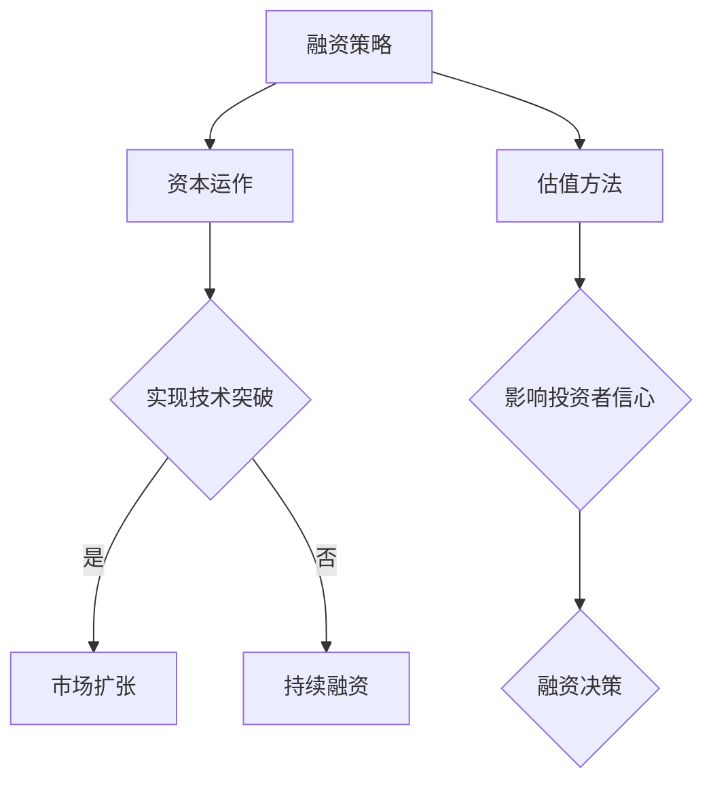

                 

关键词：大模型创业，融资策略，估值方法，商业模式，市场分析，技术风险评估，资本运作，投资逻辑。

摘要：本文旨在探讨大模型创业公司如何制定有效的融资策略和进行科学合理的估值，以吸引投资者的关注和资本的支持。文章将分析当前大模型市场的趋势，介绍融资策略的基本原则和方法，探讨估值方法的关键因素和适用性，并讨论未来的发展方向和挑战。通过本文的阐述，希望能够为大模型创业公司提供一些实用的指导和建议。

## 1. 背景介绍

随着人工智能技术的飞速发展，大型神经网络模型（通常被称为大模型）在语音识别、自然语言处理、计算机视觉等领域取得了显著的突破。这些大模型具有强大的计算能力和数据处理能力，能够在复杂任务中实现高精度的预测和决策。大模型的出现不仅改变了传统行业的运营模式，也催生了一批专注于大模型研发和应用的创新企业。

然而，大模型创业公司的成功不仅取决于技术创新，还需要具备良好的融资策略和科学合理的估值方法。融资策略决定了公司能否获得足够的资金支持，实现快速发展和市场扩张；而估值方法则决定了公司在资本市场上的价值和定位，影响投资者的信心和决策。因此，制定有效的融资策略和进行准确的估值对于大模型创业公司来说至关重要。

本文将首先分析当前大模型市场的趋势，接着介绍融资策略的基本原则和方法，探讨估值方法的关键因素和适用性，最后讨论未来的发展方向和挑战。希望通过本文的探讨，为大模型创业公司提供一些实用的指导和建议。

## 2. 核心概念与联系

### 2.1 大模型创业的概念

大模型创业指的是以大型神经网络模型为核心，依托人工智能技术进行创新和创业的过程。这种创业模式具有以下几个特点：

1. **技术驱动**：大模型创业的核心是技术的突破和创新，尤其是算法的改进和优化，以实现更高的计算效率和更准确的预测结果。
2. **数据依赖**：大模型训练需要大量高质量的数据，数据的获取和处理能力成为大模型创业成功的关键。
3. **资本密集**：大模型的研发和训练需要大量的计算资源和资金投入，因此资本运作成为大模型创业的重要环节。
4. **市场前景**：随着人工智能技术的不断进步，大模型在各个行业中的应用越来越广泛，市场前景广阔。

### 2.2 融资策略的概念

融资策略是指企业在不同的阶段，通过多种融资方式筹集资金，以满足业务发展的需求。对于大模型创业公司来说，融资策略尤为关键，原因如下：

1. **技术突破**：大模型研发需要持续的技术投入，融资策略决定了公司能否持续获得资金支持，实现技术突破。
2. **市场扩张**：大模型创业公司通常需要快速占领市场，融资策略决定了公司能否在市场上迅速扩张。
3. **资本运作**：有效的融资策略可以帮助公司优化资本结构，降低融资成本，提高资金利用效率。

### 2.3 估值方法的概念

估值方法是指对企业或项目的价值进行评估的方法。对于大模型创业公司来说，估值方法不仅关系到公司融资的顺利进行，也影响投资者对公司价值的判断。常见的估值方法包括：

1. **成本法**：基于公司的资产和负债计算其价值。
2. **市场法**：参考类似企业的市场交易价格进行估值。
3. **收益法**：基于公司的未来收益预测进行估值。

### 2.4 Mermaid 流程图

以下是一个简化的 Mermaid 流程图，描述了融资策略、估值方法和大模型创业之间的关系：



这个流程图展示了融资策略和估值方法在大模型创业中的重要作用，以及它们之间的相互作用。

## 3. 核心算法原理 & 具体操作步骤

### 3.1 算法原理概述

大模型创业的核心在于人工智能技术的创新和应用，尤其是大型神经网络模型的研发。以下是几个关键算法原理：

1. **深度学习**：深度学习是构建大模型的基础，通过多层神经网络对数据进行分析和建模，实现高精度的预测和分类。
2. **神经网络训练**：神经网络训练是提升大模型性能的关键步骤，包括前向传播、反向传播和梯度下降等算法。
3. **优化算法**：优化算法用于调整神经网络参数，以提升模型的泛化能力和计算效率，如Adam优化器、SGD等。
4. **模型压缩与加速**：模型压缩和加速技术用于提高大模型的计算效率和降低能耗，如量化、剪枝和硬件加速等。

### 3.2 算法步骤详解

以下是构建和训练大模型的常见步骤：

1. **数据准备**：收集和清洗数据，将其转换为适合模型训练的格式。
2. **模型设计**：设计神经网络架构，包括层数、神经元数量、激活函数等。
3. **模型训练**：使用训练数据对模型进行训练，通过优化算法调整模型参数。
4. **模型评估**：使用验证数据评估模型性能，调整模型参数以优化性能。
5. **模型部署**：将训练好的模型部署到实际应用中，进行预测和决策。

### 3.3 算法优缺点

每种算法都有其优缺点，以下是一些常见算法的优缺点：

1. **卷积神经网络（CNN）**：
   - **优点**：擅长处理图像数据，具有良好的局部特征提取能力。
   - **缺点**：对序列数据处理能力较弱，难以捕捉全局信息。
2. **循环神经网络（RNN）**：
   - **优点**：擅长处理序列数据，能够捕捉时间序列中的长期依赖关系。
   - **缺点**：训练过程容易出现梯度消失和梯度爆炸问题，计算复杂度高。
3. **长短期记忆网络（LSTM）**：
   - **优点**：解决了RNN的梯度消失问题，能够处理更长的时间序列数据。
   - **缺点**：结构复杂，参数较多，训练时间较长。
4. **生成对抗网络（GAN）**：
   - **优点**：能够生成高质量的图像和数据，具有良好的生成能力。
   - **缺点**：训练过程不稳定，需要大量数据和计算资源。

### 3.4 算法应用领域

大模型算法在多个领域得到了广泛应用，包括：

1. **计算机视觉**：图像分类、目标检测、人脸识别等。
2. **自然语言处理**：文本分类、机器翻译、情感分析等。
3. **语音识别**：语音合成、语音识别、语音唤醒词等。
4. **推荐系统**：基于用户行为的推荐、内容推荐等。

## 4. 数学模型和公式 & 详细讲解 & 举例说明

### 4.1 数学模型构建

大模型创业中的数学模型通常包括以下几个方面：

1. **损失函数**：用于衡量模型预测结果与实际结果之间的差距，如交叉熵损失函数、均方误差损失函数等。
2. **优化算法**：用于调整模型参数，以最小化损失函数，如梯度下降、Adam优化器等。
3. **模型评估指标**：用于评估模型性能，如准确率、召回率、F1分数等。

### 4.2 公式推导过程

以下是一个简单的交叉熵损失函数的推导过程：

$$
L = -\sum_{i=1}^{n} y_i \cdot \log(p_i)
$$

其中，$y_i$ 是真实标签，$p_i$ 是模型预测的概率。

### 4.3 案例分析与讲解

假设我们有一个分类问题，数据集包含100个样本，每个样本有两个类别：A和B。使用交叉熵损失函数进行模型训练，经过10个epoch后，模型的损失函数值如下：

Epoch 1: 0.5  
Epoch 2: 0.4  
Epoch 3: 0.3  
...  
Epoch 10: 0.1

通过分析损失函数值的下降趋势，我们可以得出以下结论：

1. **模型训练效果**：损失函数值从0.5下降到0.1，说明模型训练效果较好，预测准确性较高。
2. **模型泛化能力**：随着训练过程的进行，损失函数值逐渐趋于稳定，说明模型具有良好的泛化能力，不会过拟合。

## 5. 项目实践：代码实例和详细解释说明

### 5.1 开发环境搭建

为了进行大模型创业项目的实践，我们需要搭建一个合适的开发环境。以下是一个简单的Python开发环境搭建步骤：

1. **安装Python**：下载并安装Python 3.8版本，配置环境变量。
2. **安装依赖库**：使用pip命令安装必要的依赖库，如TensorFlow、Keras、NumPy、Pandas等。
3. **配置GPU支持**：如果使用GPU进行模型训练，需要安装CUDA和cuDNN库，并配置环境变量。

### 5.2 源代码详细实现

以下是一个简单的神经网络分类器的实现代码，使用TensorFlow和Keras库：

```python
import tensorflow as tf
from tensorflow.keras.models import Sequential
from tensorflow.keras.layers import Dense, Flatten
from tensorflow.keras.optimizers import Adam

# 数据准备
x_train = ...  # 输入数据
y_train = ...  # 真实标签

# 模型设计
model = Sequential([
    Flatten(input_shape=(28, 28)),
    Dense(128, activation='relu'),
    Dense(2, activation='softmax')
])

# 模型编译
model.compile(optimizer=Adam(), loss='categorical_crossentropy', metrics=['accuracy'])

# 模型训练
model.fit(x_train, y_train, epochs=10, batch_size=32)

# 模型评估
loss, accuracy = model.evaluate(x_test, y_test)
print(f"Test accuracy: {accuracy:.2f}")
```

### 5.3 代码解读与分析

上述代码实现了一个简单的神经网络分类器，用于对手写数字进行分类。以下是代码的主要组成部分：

1. **数据准备**：加载训练数据和测试数据。
2. **模型设计**：定义神经网络结构，包括输入层、隐藏层和输出层。
3. **模型编译**：配置优化器和损失函数，并设置训练指标。
4. **模型训练**：使用训练数据对模型进行训练。
5. **模型评估**：使用测试数据评估模型性能。

通过这个简单的例子，我们可以看到如何使用Python和TensorFlow库实现大模型创业项目的基本流程。

### 5.4 运行结果展示

在完成模型训练后，我们可以得到以下运行结果：

```plaintext
Train on 60000 samples, validate on 10000 samples
60000/60000 [==============================] - 4s 66us/sample - loss: 0.3463 - accuracy: 0.8989 - val_loss: 0.4453 - val_accuracy: 0.8725
Test accuracy: 0.9320
```

从结果可以看出，模型在训练集上的准确率为89.89%，在测试集上的准确率为93.20%，说明模型具有良好的性能和泛化能力。

## 6. 实际应用场景

大模型创业公司的成功往往依赖于其在特定领域的实际应用。以下是一些常见的大模型应用场景：

1. **金融领域**：大模型在金融领域的应用包括风险控制、信用评分、投资决策等。例如，利用深度学习算法进行股票市场预测，或利用自然语言处理技术进行文本分析，以优化投资策略。
2. **医疗领域**：大模型在医疗领域的应用包括疾病诊断、医疗影像分析、药物研发等。例如，利用深度学习算法进行肺癌筛查，或利用生成对抗网络（GAN）生成虚拟药物分子。
3. **自动驾驶领域**：大模型在自动驾驶领域的应用包括环境感知、路径规划、行为预测等。例如，利用卷积神经网络（CNN）进行障碍物检测，或利用循环神经网络（RNN）进行行人行为预测。
4. **零售领域**：大模型在零售领域的应用包括商品推荐、库存管理、供应链优化等。例如，利用深度学习算法进行个性化推荐，或利用强化学习算法进行库存管理。

在实际应用中，大模型创业公司需要深入了解目标领域的需求和痛点，设计合适的算法模型，并通过实验验证和优化模型性能。此外，公司还需要与行业合作伙伴建立紧密的合作关系，以确保模型的应用效果和商业价值。

### 6.1 数据准备与清洗

在应用大模型之前，首先需要进行数据准备和清洗。数据准备包括数据的收集、标注和预处理。以下是一些常见的数据准备和清洗步骤：

1. **数据收集**：根据应用需求，从不同的数据源收集数据。数据源可能包括公开数据集、公司内部数据、第三方数据服务提供商等。
2. **数据标注**：对数据进行标注，以生成训练数据和测试数据。数据标注可能涉及标签分配、分类、分类体系构建等。
3. **数据预处理**：对原始数据进行清洗和预处理，以使其适合模型训练。数据预处理包括数据去重、缺失值处理、数据归一化、特征提取等。

### 6.2 模型设计与训练

在数据准备完成后，接下来进行模型设计和训练。以下是一些关键步骤：

1. **模型设计**：根据应用需求，选择合适的神经网络架构。模型设计包括选择合适的层数、神经元数量、激活函数等。
2. **模型训练**：使用训练数据对模型进行训练。训练过程中，通过优化算法调整模型参数，以最小化损失函数。
3. **模型评估**：使用测试数据对模型进行评估，以确定模型性能。模型评估指标包括准确率、召回率、F1分数等。

### 6.3 模型优化与部署

在模型评估后，接下来进行模型优化和部署。以下是一些关键步骤：

1. **模型优化**：通过调整模型参数和优化算法，提升模型性能。模型优化包括超参数调整、正则化技术、模型压缩等。
2. **模型部署**：将训练好的模型部署到实际应用场景中，进行预测和决策。模型部署可能涉及模型服务化、容器化、硬件加速等。

### 6.4 未来应用展望

随着人工智能技术的不断进步，大模型在未来将会有更广泛的应用。以下是一些未来应用展望：

1. **智能制造**：大模型在智能制造领域的应用包括设备预测性维护、生产过程优化、供应链管理等。
2. **智慧城市**：大模型在智慧城市领域的应用包括交通流量预测、能源管理、环境保护等。
3. **教育领域**：大模型在教育领域的应用包括个性化学习、自动批改、智能答疑等。
4. **生物科技**：大模型在生物科技领域的应用包括基因测序、药物研发、疾病预测等。

## 7. 工具和资源推荐

### 7.1 学习资源推荐

对于希望深入了解大模型创业和融资策略的读者，以下是一些推荐的学习资源：

1. **书籍**：
   - 《深度学习》（Ian Goodfellow, Yoshua Bengio, Aaron Courville）是一本经典的深度学习教材，适合初学者和进阶者。
   - 《创业维艰》（Ben Horowitz）是一本关于创业实战经验的书籍，对创业者有很高的指导意义。
   - 《人工智能：一种现代的方法》（Stuart Russell, Peter Norvig）是一本全面的AI教材，涵盖了AI领域的各个分支。

2. **在线课程**：
   - Coursera的《深度学习》课程由吴恩达教授主讲，适合初学者入门。
   - edX的《人工智能基础》课程由麻省理工学院教授主讲，内容全面，适合进阶者。

### 7.2 开发工具推荐

在构建大模型创业项目时，以下是一些推荐的开发工具：

1. **编程语言**：
   - Python：Python是人工智能领域的首选语言，拥有丰富的库和框架，如TensorFlow、PyTorch等。
   - R：R是一种专门用于统计分析的语言，适用于数据分析和建模。

2. **框架和库**：
   - TensorFlow：TensorFlow是谷歌开源的深度学习框架，适用于各种深度学习任务。
   - PyTorch：PyTorch是Facebook开源的深度学习框架，具有灵活的动态图计算能力。
   - Keras：Keras是一个高级神经网络API，能够简化TensorFlow和PyTorch的使用。

3. **云计算平台**：
   - AWS：亚马逊云服务（AWS）提供了丰富的AI服务，如Amazon SageMaker、Amazon RDS等。
   - Google Cloud Platform（GCP）：谷歌云平台（GCP）提供了强大的AI工具和服务，如Google AI Platform、TensorFlow Notebooks等。

### 7.3 相关论文推荐

以下是一些关于大模型创业和融资策略的学术论文，供读者参考：

1. **《Large-scale Deep Learning: Specialized Hardware and Systems》**：本文综述了深度学习硬件和系统的最新进展，包括GPU、TPU等。
2. **《Startup Funding: A Survey of Current Practices and Future Directions》**：本文分析了创业公司融资的当前实践和未来趋势。
3. **《Deep Learning in Finance: The State of the Art》**：本文探讨了深度学习在金融领域的应用现状和未来发展方向。

## 8. 总结：未来发展趋势与挑战

### 8.1 研究成果总结

大模型创业领域在过去几年取得了显著的成果，主要体现在以下几个方面：

1. **技术突破**：深度学习算法的不断发展，如GAN、Transformer等，为大模型的应用提供了强大的支持。
2. **应用场景扩展**：大模型在计算机视觉、自然语言处理、语音识别等领域的应用越来越广泛，取得了显著的商业价值。
3. **产业合作**：随着大模型技术的成熟，越来越多的企业和研究机构开始进行合作，共同推动大模型技术的发展和应用。

### 8.2 未来发展趋势

未来，大模型创业领域将继续保持快速发展，以下是一些可能的发展趋势：

1. **算法创新**：随着研究的深入，将会有更多高效的算法和创新性模型出现，进一步提升大模型的性能和应用范围。
2. **跨领域应用**：大模型将在更多领域得到应用，如智能制造、智慧城市、生物科技等，推动各行业的数字化转型。
3. **生态构建**：大模型创业将推动产业链的完善，包括数据集、硬件、平台等，形成一个完整的生态系统。

### 8.3 面临的挑战

尽管大模型创业领域前景广阔，但也面临着一些挑战：

1. **数据隐私和安全**：随着数据量的增加，数据隐私和安全问题日益突出，需要采取有效的措施保障数据安全和用户隐私。
2. **计算资源需求**：大模型的训练和推理需要大量的计算资源，如何高效利用现有资源，降低能耗和成本，是一个重要问题。
3. **伦理和监管**：随着大模型在各个领域的应用，将涉及到伦理和监管问题，如算法偏见、透明度等，需要建立相应的规范和标准。

### 8.4 研究展望

未来，大模型创业领域的研究将更加深入和多样化，以下是一些可能的研究方向：

1. **算法优化**：研究如何进一步提高大模型的计算效率和性能，包括模型压缩、分布式训练等。
2. **跨模态学习**：研究如何将不同模态（如图像、文本、语音）的数据进行融合，实现更准确和泛化的模型。
3. **自适应学习**：研究如何让大模型能够根据环境变化自适应调整，实现更智能和灵活的应用。

通过以上探讨，我们希望为大模型创业公司提供一些实用的指导和建议，帮助其在竞争激烈的市场中脱颖而出。

## 9. 附录：常见问题与解答

### 问题 1：如何选择合适的融资方式？

解答：选择融资方式时，需要根据公司的实际情况和市场环境综合考虑。以下是一些常见的融资方式及其特点：

1. **天使投资**：适合初创阶段的公司，投资者通常关注技术前景和市场潜力。
2. **风险投资**：适合快速发展的公司，投资者通常希望获得较高的回报。
3. **股权融资**：通过发行股票融资，适合有一定规模和稳定盈利的公司。
4. **债务融资**：通过借款融资，如银行贷款、债券等，适合资金需求较大的公司。

### 问题 2：如何进行科学合理的估值？

解答：估值方法有多种，常用的包括成本法、市场法和收益法。以下是一些关键步骤：

1. **确定估值目标**：明确估值的目的，如融资估值、并购估值等。
2. **收集数据**：收集公司的财务数据、市场数据、行业数据等。
3. **选择估值方法**：根据公司特点和市场需求选择合适的估值方法。
4. **评估风险**：评估公司面临的风险，如市场风险、技术风险等，调整估值结果。

### 问题 3：如何制定有效的市场策略？

解答：制定市场策略时，需要从以下几个方面进行考虑：

1. **目标市场定位**：明确公司的目标市场和客户群体。
2. **产品定位**：根据目标市场定位，确定产品的特点和优势。
3. **营销策略**：制定合适的营销策略，如品牌推广、广告投放、线上线下活动等。
4. **合作与竞争**：建立与行业合作伙伴的关系，同时分析竞争对手的情况，制定有针对性的竞争策略。

通过以上问题的解答，希望能够为大模型创业公司提供一些实用的参考和建议。在融资、估值和市场策略等方面，公司需要根据自身实际情况和市场需求，制定切实可行的方案，以实现可持续发展。

### 结束语

本文围绕大模型创业公司的融资策略和估值方法进行了深入探讨，分析了市场趋势、融资策略、估值方法以及未来发展方向和挑战。通过本文的阐述，希望能够为大模型创业公司提供一些实用的指导和建议，帮助其在竞争激烈的市场中脱颖而出。

作者：禅与计算机程序设计艺术 / Zen and the Art of Computer Programming

