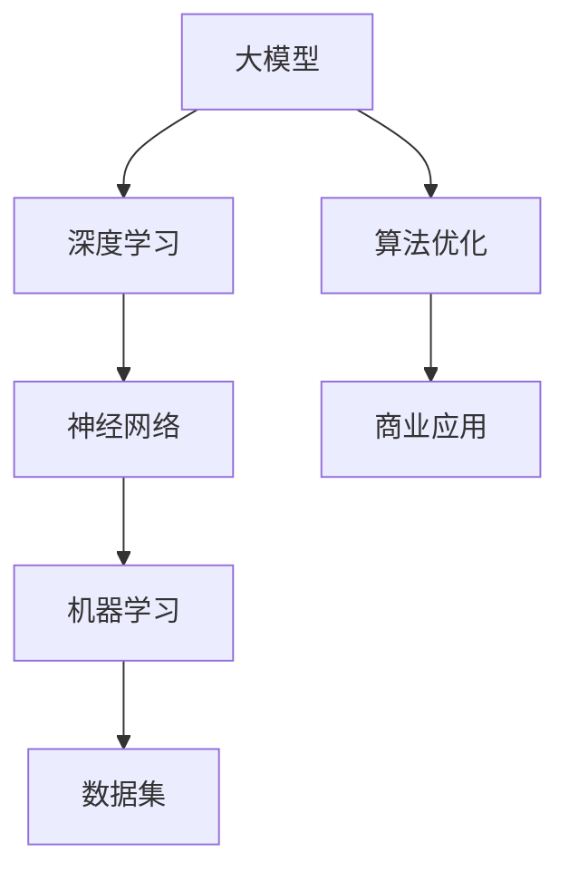

                 

关键词：大模型，AI 创业，产品创新，深度学习，机器学习，神经网络，模型训练，数据集，算法优化，商业应用。

## 摘要

本文将探讨大模型在 AI 创业产品创新中的重要性。随着深度学习和机器学习技术的迅猛发展，大模型作为一种关键技术，正逐渐成为推动 AI 创业产品创新的核心驱动力。本文将从大模型的定义、核心概念、算法原理、数学模型、应用实践、实际场景和未来展望等方面进行详细阐述，以期为 AI 创业者和研发人员提供有价值的参考和启示。

## 1. 背景介绍

在过去的几十年里，计算机科学和人工智能领域经历了飞速的发展。从最初的规则驱动系统到基于统计学习的机器学习模型，再到如今深度学习技术的广泛应用，人工智能正在深刻地改变着我们的生活方式和社会运行方式。随着大数据的积累和计算能力的提升，大模型应运而生。

大模型通常指的是参数规模庞大的神经网络模型，这些模型能够在海量数据上进行训练，从而学习到复杂的模式和信息。与传统的中小型模型相比，大模型具有更强的表达能力和泛化能力，能够更好地应对复杂的现实世界问题。

### 1.1 大模型的定义

大模型是指那些具有数百万甚至数十亿个参数的神经网络模型。这些模型通常用于处理复杂的任务，如图像识别、自然语言处理、语音识别等。大模型的出现，标志着人工智能技术从传统的手工设计规则到自动学习的转变。

### 1.2 大模型的发展历程

大模型的发展历程可以追溯到上世纪80年代，当时研究人员开始探索如何通过增加神经网络中的神经元和连接来提高模型的性能。随着计算能力的提升和数据集的增大，大模型的研究和应用逐渐成为主流。特别是在深度学习领域，大模型的兴起推动了人工智能技术的快速发展。

### 1.3 大模型的应用领域

大模型在多个领域都有着广泛的应用。在图像识别领域，大模型可以准确识别复杂的图像内容，例如人脸识别、物体检测等。在自然语言处理领域，大模型能够理解并生成自然语言，如机器翻译、文本生成等。在语音识别领域，大模型可以准确识别语音并将其转换为文本。此外，大模型还在推荐系统、医疗诊断、金融风控等领域发挥着重要作用。

## 2. 核心概念与联系

为了更好地理解大模型在 AI 创业产品创新中的重要性，我们需要先了解一些核心概念和它们之间的联系。以下是一个简化的 Mermaid 流程图，用于展示这些概念之间的关系。



### 2.1 深度学习

深度学习是一种机器学习的方法，它通过模仿人脑的神经网络结构，利用多层神经网络对数据进行自动学习和特征提取。深度学习是构建大模型的基础。

### 2.2 神经网络

神经网络是由大量神经元（节点）和连接（边）组成的网络结构。每个神经元都可以接收输入信号，通过激活函数产生输出。神经网络是深度学习的基本单元。

### 2.3 机器学习

机器学习是使计算机从数据中学习并获得知识或预测能力的技术。它包括监督学习、无监督学习和强化学习等多种方法。机器学习为深度学习和大模型提供了理论基础。

### 2.4 数据集

数据集是机器学习模型训练的基础。大模型的训练需要大量的高质量数据集，这些数据集可以来源于各种领域和应用场景。

### 2.5 算法优化

算法优化是指通过改进算法的结构和参数来提高模型的性能。在大模型训练过程中，算法优化非常重要，它决定了模型能否在复杂任务中取得更好的效果。

### 2.6 商业应用

商业应用是指将大模型技术应用于实际业务场景中，解决实际问题并创造价值。商业应用是衡量大模型技术成功与否的重要标准。

## 3. 核心算法原理 & 具体操作步骤

### 3.1 算法原理概述

大模型的核心算法是深度学习。深度学习通过多层神经网络对数据进行学习和预测。每一层神经网络都能够提取更高层次的特征，最终实现复杂任务的目标。以下是一个简化的深度学习算法原理：

1. **输入层**：接收原始数据。
2. **隐藏层**：通过神经网络结构对输入数据进行特征提取。
3. **输出层**：根据提取的特征进行预测或分类。

### 3.2 算法步骤详解

1. **数据预处理**：对输入数据进行标准化、去噪等处理，确保数据质量。
2. **模型构建**：定义神经网络结构，包括层数、每层的神经元数量、激活函数等。
3. **模型训练**：使用训练数据集对模型进行训练，调整模型参数，使其在训练集上取得更好的性能。
4. **模型评估**：使用验证数据集评估模型在未知数据上的性能，调整模型参数，优化模型性能。
5. **模型部署**：将训练好的模型部署到生产环境中，用于实际业务场景。

### 3.3 算法优缺点

#### 优点：

- **强大的表达能力和泛化能力**：大模型能够学习到复杂的模式和规律，具有更强的泛化能力。
- **自动特征提取**：大模型可以自动从数据中提取特征，减少人工干预。
- **高效的计算能力**：随着计算能力的提升，大模型的训练和推理速度逐渐提高。

#### 缺点：

- **需要大量的数据**：大模型训练需要大量的高质量数据集，数据收集和预处理成本较高。
- **计算资源消耗大**：大模型训练和推理需要大量的计算资源，对硬件设备要求较高。
- **过拟合风险**：大模型在训练过程中容易发生过拟合现象，需要采用各种技巧和方法进行优化。

### 3.4 算法应用领域

大模型在多个领域都有广泛的应用，以下是其中的一些典型领域：

- **图像识别**：大模型可以准确识别复杂的图像内容，如人脸识别、物体检测等。
- **自然语言处理**：大模型可以理解并生成自然语言，如机器翻译、文本生成等。
- **语音识别**：大模型可以准确识别语音并将其转换为文本。
- **推荐系统**：大模型可以基于用户行为和偏好进行精准推荐。
- **医疗诊断**：大模型可以辅助医生进行疾病诊断和治疗方案制定。

## 4. 数学模型和公式 & 详细讲解 & 举例说明

### 4.1 数学模型构建

大模型的数学模型主要包括两部分：前向传播和反向传播。

#### 前向传播：

前向传播是指将输入数据通过神经网络结构进行逐层计算，最终得到输出。假设一个三层神经网络，其输入层、隐藏层和输出层的神经元数量分别为 $x_1, x_2, x_3$，激活函数分别为 $f_1, f_2, f_3$，输入数据为 $x$，输出数据为 $y$，则前向传播的计算过程如下：

$$
z_2 = x_1 \cdot w_1 + b_1 \\
a_2 = f_2(z_2) \\
z_3 = a_2 \cdot w_2 + b_2 \\
a_3 = f_3(z_3) = y
$$

其中，$w_1, b_1, w_2, b_2$ 分别为权重和偏置。

#### 反向传播：

反向传播是指根据输出误差，反向更新神经网络中的权重和偏置。假设输出误差为 $E$，则反向传播的计算过程如下：

$$
\Delta w_2 = \frac{\partial E}{\partial w_2} \\
w_2 = w_2 - \alpha \Delta w_2 \\
\Delta b_2 = \frac{\partial E}{\partial b_2} \\
b_2 = b_2 - \alpha \Delta b_2 \\
\Delta w_1 = \frac{\partial E}{\partial w_1} \\
w_1 = w_1 - \alpha \Delta w_1 \\
\Delta b_1 = \frac{\partial E}{\partial b_1} \\
b_1 = b_1 - \alpha \Delta b_1
$$

其中，$\alpha$ 为学习率。

### 4.2 公式推导过程

为了更好地理解大模型的数学模型，下面将介绍一些关键的公式推导过程。

#### 梯度下降法：

梯度下降法是一种常用的优化算法，用于求解最小值问题。假设 $f(x)$ 是一个函数，$x$ 是 $f(x)$ 的参数，则梯度下降法的迭代公式如下：

$$
x_{\text{new}} = x_{\text{old}} - \alpha \nabla f(x)
$$

其中，$\alpha$ 是学习率，$\nabla f(x)$ 是 $f(x)$ 在 $x$ 处的梯度。

#### 反向传播：

反向传播的核心思想是将输出误差反向传播到前一层，更新权重和偏置。假设输出误差为 $E$，输入数据为 $x$，输出数据为 $y$，则反向传播的公式如下：

$$
\Delta w = \frac{\partial E}{\partial w} \\
w = w - \alpha \Delta w
$$

其中，$\Delta w$ 是权重变化，$\alpha$ 是学习率，$\frac{\partial E}{\partial w}$ 是权重关于误差的梯度。

### 4.3 案例分析与讲解

为了更好地理解大模型的数学模型，我们来看一个简单的例子。

假设我们有一个二元分类问题，输入数据为 $(x, y)$，其中 $x$ 是特征向量，$y$ 是标签（0或1）。我们的目标是训练一个神经网络，使其能够对新的输入数据进行分类。

1. **数据预处理**：对输入数据进行标准化处理，使其在相同的尺度范围内。
2. **模型构建**：构建一个包含一层隐藏层的三层神经网络，隐藏层神经元数量为 10。
3. **模型训练**：使用梯度下降法训练模型，学习率设置为 0.1。
4. **模型评估**：使用验证数据集评估模型性能。

假设我们使用 sigmoid 激活函数，模型损失函数为交叉熵损失函数。下面是具体的推导过程：

#### 前向传播：

$$
z_2 = x \cdot w_1 + b_1 \\
a_2 = \frac{1}{1 + e^{-z_2}} \\
z_3 = a_2 \cdot w_2 + b_2 \\
a_3 = \frac{1}{1 + e^{-z_3}} \\
y' = \frac{1}{1 + e^{-z_3}}
$$

其中，$w_1, b_1, w_2, b_2$ 分别为权重和偏置。

#### 反向传播：

$$
\Delta w_2 = (y - y') \cdot a_2 \cdot (1 - a_2) \\
w_2 = w_2 - \alpha \Delta w_2 \\
\Delta w_1 = (y - y') \cdot a_2 \cdot w_2 \cdot (1 - a_2) \\
w_1 = w_1 - \alpha \Delta w_1
$$

通过上述推导过程，我们可以看到如何使用大模型的数学模型对数据进行分类。

## 5. 项目实践：代码实例和详细解释说明

在本节中，我们将通过一个具体的代码实例来展示如何使用大模型进行图像识别任务。这个例子将使用 TensorFlow 和 Keras 框架来构建和训练一个卷积神经网络（CNN），用于对 CIFAR-10 数据集进行图像分类。

### 5.1 开发环境搭建

在开始编写代码之前，我们需要搭建一个合适的开发环境。以下是在 Python 中使用 TensorFlow 的基本步骤：

1. 安装 Python：确保 Python（版本 3.6 或更高）已安装在您的系统中。
2. 安装 TensorFlow：通过以下命令安装 TensorFlow：

```bash
pip install tensorflow
```

3. 安装其他依赖项：安装必要的库，例如 NumPy、Matplotlib 等。

### 5.2 源代码详细实现

以下是一个简单的 CNN 模型代码示例，用于对 CIFAR-10 数据集进行分类。

```python
import tensorflow as tf
from tensorflow.keras import layers, models
from tensorflow.keras.datasets import cifar10
from tensorflow.keras.utils import to_categorical

# 加载数据集
(x_train, y_train), (x_test, y_test) = cifar10.load_data()

# 数据预处理
x_train = x_train.astype('float32') / 255.0
x_test = x_test.astype('float32') / 255.0
y_train = to_categorical(y_train, 10)
y_test = to_categorical(y_test, 10)

# 构建模型
model = models.Sequential()
model.add(layers.Conv2D(32, (3, 3), activation='relu', input_shape=(32, 32, 3)))
model.add(layers.MaxPooling2D((2, 2)))
model.add(layers.Conv2D(64, (3, 3), activation='relu'))
model.add(layers.MaxPooling2D((2, 2)))
model.add(layers.Conv2D(64, (3, 3), activation='relu'))
model.add(layers.Flatten())
model.add(layers.Dense(64, activation='relu'))
model.add(layers.Dense(10, activation='softmax'))

# 编译模型
model.compile(optimizer='adam',
              loss='categorical_crossentropy',
              metrics=['accuracy'])

# 训练模型
model.fit(x_train, y_train, epochs=10, batch_size=64)

# 评估模型
test_loss, test_acc = model.evaluate(x_test, y_test)
print(f"Test accuracy: {test_acc:.4f}")
```

### 5.3 代码解读与分析

以下是代码的详细解读：

1. **导入库**：首先，导入 TensorFlow、NumPy 和 Matplotlib 等库。
2. **加载数据集**：使用 TensorFlow 的内置函数加载 CIFAR-10 数据集。
3. **数据预处理**：将图像数据转换为浮点型并归一化，将标签转换为独热编码。
4. **构建模型**：使用 Keras 的 Sequential 模型构建一个简单的 CNN，包括两个卷积层、一个最大池化层和一个全连接层。
5. **编译模型**：设置模型的优化器、损失函数和评估指标。
6. **训练模型**：使用训练数据集训练模型，设置训练轮数和批量大小。
7. **评估模型**：使用测试数据集评估模型的性能。

通过这个示例，我们可以看到如何使用大模型进行图像识别任务。这个简单的 CNN 模型已经能够取得相当不错的性能，但对于更复杂的图像任务，我们可能需要构建更复杂的网络结构。

## 6. 实际应用场景

大模型在多个领域都有着广泛的应用。以下是一些典型的实际应用场景：

### 6.1 图像识别

图像识别是大模型最典型的应用场景之一。通过卷积神经网络（CNN）等大模型，计算机可以准确识别复杂的图像内容，如图像分类、物体检测、人脸识别等。在实际应用中，图像识别技术被广泛应用于安防监控、自动驾驶、医疗影像诊断等领域。

### 6.2 自然语言处理

自然语言处理（NLP）是另一个大模型的重要应用领域。通过长短期记忆网络（LSTM）、变换器（Transformer）等大模型，计算机可以理解和生成自然语言。NLP 技术被广泛应用于机器翻译、文本生成、情感分析等领域，如自动客服系统、智能助手等。

### 6.3 语音识别

语音识别技术利用大模型对语音信号进行识别和转换，将语音转换为文本。在实际应用中，语音识别技术被广泛应用于智能音箱、语音助手、电话客服等领域。

### 6.4 推荐系统

推荐系统利用大模型对用户行为和偏好进行建模，为用户提供个性化的推荐。通过协同过滤、基于内容的推荐等方法，推荐系统可以预测用户可能感兴趣的内容，如电影推荐、商品推荐等。

### 6.5 医疗诊断

医疗诊断是另一个大模型的重要应用领域。通过卷积神经网络、循环神经网络等大模型，计算机可以辅助医生进行疾病诊断、治疗方案制定等。在实际应用中，医疗诊断技术被广泛应用于影像诊断、基因分析等领域。

### 6.6 金融风控

金融风控利用大模型对金融交易数据、用户行为等进行建模和分析，预测金融风险，如欺诈检测、市场预测等。在实际应用中，金融风控技术被广泛应用于银行、证券、保险等领域。

## 7. 工具和资源推荐

为了更好地研究和应用大模型，以下是一些推荐的工具和资源：

### 7.1 学习资源推荐

- **《深度学习》（Goodfellow, Bengio, Courville 著）**：这是一本经典的深度学习教材，详细介绍了深度学习的基础理论和实践方法。
- **[Kaggle](https://www.kaggle.com)**：Kaggle 是一个数据科学竞赛平台，提供了大量的数据集和竞赛题目，是学习和实践深度学习的绝佳资源。
- **[TensorFlow 官方文档](https://www.tensorflow.org/tutorials)**：TensorFlow 是一个强大的深度学习框架，其官方文档包含了丰富的教程和实践案例。

### 7.2 开发工具推荐

- **TensorFlow**：TensorFlow 是一个开源的深度学习框架，适用于构建和训练各种深度学习模型。
- **PyTorch**：PyTorch 是另一个流行的深度学习框架，以其灵活性和易用性而受到许多研究者和开发者的喜爱。
- **Google Colab**：Google Colab 是一个基于云计算的编程平台，提供了免费的 GPU 资源，适用于深度学习实验和开发。

### 7.3 相关论文推荐

- **"Deep Learning"（Goodfellow, Bengio, Courville 著）**：这是一本关于深度学习的经典论文集，涵盖了深度学习的各个方面。
- **"Attention Is All You Need"（Vaswani et al., 2017）**：这篇论文提出了 Transformer 模型，是 NLP 领域的重要突破。
- **"Residual Connections Improve Learning Rates of Deep Neural Networks"（He et al., 2016）**：这篇论文提出了残差网络，是深度学习领域的重要进展。

## 8. 总结：未来发展趋势与挑战

### 8.1 研究成果总结

大模型技术在过去几年取得了显著的成果。在图像识别、自然语言处理、语音识别等领域，大模型已经取得了比传统方法更好的性能。此外，随着计算能力的提升和数据集的增大，大模型的研究和应用正在不断深入，为各个领域带来了巨大的变革。

### 8.2 未来发展趋势

未来，大模型技术将继续发展，以下是几个可能的发展趋势：

- **模型压缩与优化**：为了降低大模型的计算资源消耗，研究人员将致力于模型压缩和优化技术，如知识蒸馏、模型剪枝等。
- **跨模态学习**：大模型将逐渐实现跨模态学习，如将图像、文本和语音等信息进行融合，提高模型的综合能力。
- **自适应学习**：大模型将逐渐具备自适应学习的能力，能够根据不同的任务和数据集自动调整模型结构和参数。

### 8.3 面临的挑战

尽管大模型技术取得了显著的成果，但仍然面临一些挑战：

- **计算资源消耗**：大模型训练需要大量的计算资源，这对硬件设备提出了更高的要求。
- **数据隐私与安全**：大模型在训练过程中需要大量数据，如何保护数据隐私和安全成为一个重要问题。
- **过拟合与泛化能力**：大模型在训练过程中容易发生过拟合现象，如何提高模型的泛化能力是一个重要挑战。

### 8.4 研究展望

未来，大模型技术将继续在人工智能领域发挥重要作用。随着计算能力的提升和数据集的增大，大模型将逐渐实现更高效、更智能的应用。同时，大模型技术也将与其他领域相结合，推动人工智能技术的全面发展。

## 9. 附录：常见问题与解答

### 9.1 什么是大模型？

大模型是指那些参数规模庞大的神经网络模型，通常具有数百万甚至数十亿个参数。这些模型能够在海量数据上进行训练，从而学习到复杂的模式和信息。

### 9.2 大模型与中小模型有什么区别？

大模型与中小模型的主要区别在于参数规模和训练数据量。大模型具有更强的表达能力和泛化能力，能够处理更复杂的任务。但相应地，大模型也需要更多的计算资源和数据集。

### 9.3 大模型为什么需要大量数据？

大模型需要大量数据是因为它们具有强大的表达能力和泛化能力。通过在海量数据上进行训练，大模型可以学习到更多的模式和规律，从而在未知数据上取得更好的性能。

### 9.4 如何优化大模型训练速度？

为了优化大模型训练速度，可以采用以下方法：

- **数据预处理**：对数据进行预处理，减少数据读取和处理的时间。
- **模型压缩**：使用模型压缩技术，如知识蒸馏、模型剪枝等，降低模型的计算复杂度。
- **并行计算**：使用分布式计算技术，如多 GPU 训练，提高训练速度。

### 9.5 大模型在自然语言处理领域有哪些应用？

大模型在自然语言处理领域有许多应用，包括：

- **机器翻译**：大模型可以准确翻译不同语言之间的文本。
- **文本生成**：大模型可以生成自然语言的文本，如新闻文章、小说等。
- **情感分析**：大模型可以分析文本中的情感倾向，如积极、消极等。

## 参考文献

1. Goodfellow, I., Bengio, Y., & Courville, A. (2016). Deep learning. MIT press.
2. Vaswani, A., Shazeer, N., Parmar, N., Uszkoreit, J., Jones, L., Gomez, A. N., ... & Polosukhin, I. (2017). Attention is all you need. Advances in neural information processing systems, 30.
3. He, K., Zhang, X., Ren, S., & Sun, J. (2016). Deep residual learning for image recognition. Proceedings of the IEEE conference on computer vision and pattern recognition, 770-778.
4. LeCun, Y., Bengio, Y., & Hinton, G. (2015). Deep learning. Nature, 521(7553), 436-444.

