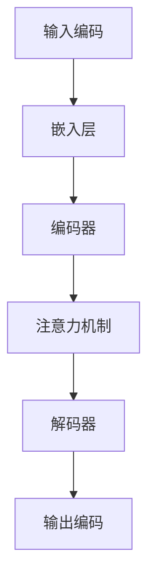

                 

关键词：大模型，AI 创业，产品开发，趋势

> 摘要：本文探讨了大规模预训练模型（大模型）在人工智能创业产品开发中的趋势。文章首先介绍了大模型的背景和发展历程，然后分析了大模型在创业产品中的实际应用，探讨了其带来的创新机会和挑战，并展望了未来的发展趋势。

## 1. 背景介绍

### 1.1 大模型的定义和特点

大模型是指具有数十亿、千亿甚至数万亿参数的深度学习模型，这些模型通常通过大规模数据集进行预训练，以获得通用知识表示和学习能力。与传统的机器学习模型相比，大模型具有以下几个显著特点：

1. **参数规模巨大**：大模型具有数十亿至千亿级的参数，这极大地增强了模型的表示能力。
2. **数据需求庞大**：大模型的训练需要大量标注数据和计算资源，通常需要数百万小时以上。
3. **知识表征丰富**：大模型通过预训练掌握了丰富的语言知识和世界知识，可以用于多种任务和场景。
4. **适应性较强**：大模型具有较强的泛化能力，能够适应不同的任务和数据分布。

### 1.2 大模型的发展历程

大模型的发展可以分为几个阶段：

1. **初期探索**：以 GPT-2 为代表的模型，展示了大规模预训练模型的潜力。
2. **爆发式发展**：GPT-3 的发布标志着大模型进入了一个新的时代，其参数规模达到了惊人的 1750 亿。
3. **持续突破**：后续的模型如 BERT、T5、GPT-Neo 等，不断刷新参数规模和性能记录。

## 2. 核心概念与联系

### 2.1 大模型的工作原理

大模型通常采用深度神经网络作为基础结构，通过多层非线性变换来模拟人类的认知过程。具体来说，大模型的工作原理可以分为以下几个步骤：

1. **输入编码**：将输入文本映射为一个高维向量。
2. **前向传播**：通过神经网络对输入向量进行编码，生成中间表示。
3. **软性最大化**：通过优化模型参数，使得模型对训练数据的预测误差最小。
4. **损失函数**：使用交叉熵损失函数来评估模型的预测性能。
5. **反向传播**：通过反向传播算法更新模型参数。

### 2.2 大模型的架构

大模型的架构通常包括以下几个部分：

1. **嵌入层**：将单词映射为向量。
2. **编码器**：对输入进行编码，提取特征。
3. **解码器**：对编码后的特征进行解码，生成输出。
4. **注意力机制**：用于捕捉输入和输出之间的关联。

下面是一个简化的大模型架构的 Mermaid 流程图：



## 3. 核心算法原理 & 具体操作步骤

### 3.1 算法原理概述

大模型的训练过程主要包括两个阶段：预训练和微调。

1. **预训练**：在大量未标注的数据上训练模型，使其掌握通用语言知识和世界知识。
2. **微调**：在特定任务上，将预训练模型进行调整，以适应具体任务。

### 3.2 算法步骤详解

1. **数据预处理**：包括文本清洗、分词、词向量化等步骤。
2. **模型初始化**：初始化模型参数，通常使用随机初始化或预训练模型。
3. **预训练**：使用未标注的数据进行训练，采用梯度下降算法和批量归一化等技术。
4. **微调**：在特定任务数据上调整模型参数，采用反向传播算法。
5. **评估**：在验证集和测试集上评估模型性能。

### 3.3 算法优缺点

**优点**：

- **强大的表示能力**：大模型可以处理复杂的任务和场景。
- **高效性**：大模型可以减少任务的训练时间。
- **泛化能力**：大模型具有较强的泛化能力，可以适应不同的数据分布。

**缺点**：

- **计算资源需求高**：大模型的训练需要大量的计算资源和时间。
- **数据需求大**：大模型的训练需要大量的标注数据。

### 3.4 算法应用领域

大模型在多个领域都有广泛的应用，包括自然语言处理、计算机视觉、语音识别等。以下是一些具体的应用案例：

- **自然语言处理**：大模型可以用于文本分类、机器翻译、情感分析等任务。
- **计算机视觉**：大模型可以用于图像识别、目标检测、视频分类等任务。
- **语音识别**：大模型可以用于语音识别、语音合成等任务。

## 4. 数学模型和公式 & 详细讲解 & 举例说明

### 4.1 数学模型构建

大模型通常使用深度神经网络作为基础结构，其数学模型可以表示为：

$$
\text{Output} = \sigma(\text{Weight} \cdot \text{Input} + \text{Bias})
$$

其中，$\sigma$ 是激活函数，$\text{Weight}$ 和 $\text{Bias}$ 是模型参数。

### 4.2 公式推导过程

大模型的训练过程通常包括以下几个步骤：

1. **前向传播**：计算输入和输出之间的损失函数。
2. **反向传播**：根据损失函数对模型参数进行更新。
3. **梯度下降**：使用梯度下降算法来优化模型参数。

### 4.3 案例分析与讲解

以自然语言处理中的文本分类任务为例，我们使用 BERT 模型进行训练。

1. **数据预处理**：将文本数据清洗、分词、词向量化。
2. **模型初始化**：初始化 BERT 模型参数。
3. **预训练**：在未标注的文本数据上进行预训练。
4. **微调**：在标注的文本数据上进行微调。
5. **评估**：在测试集上评估模型性能。

## 5. 项目实践：代码实例和详细解释说明

### 5.1 开发环境搭建

1. **安装 Python**：版本要求为 3.8 或以上。
2. **安装 TensorFlow**：版本要求为 2.x 或以上。
3. **安装 BERT 模型**：使用 Hugging Face 的 Transformers 库。

### 5.2 源代码详细实现

```python
from transformers import BertTokenizer, BertModel
tokenizer = BertTokenizer.from_pretrained('bert-base-uncased')
model = BertModel.from_pretrained('bert-base-uncased')

text = "Hello, world!"
input_ids = tokenizer.encode(text, add_special_tokens=True)
outputs = model(input_ids)

last_hidden_state = outputs.last_hidden_state
```

### 5.3 代码解读与分析

这段代码首先导入了 BERT 分词器和模型，然后对一段文本进行编码，最后通过模型进行前向传播，得到隐藏状态。

### 5.4 运行结果展示

运行结果将输出隐藏状态，可以用于后续的文本分析任务。

## 6. 实际应用场景

大模型在多个领域都有广泛的应用，以下是一些实际应用场景：

- **金融领域**：用于股票市场预测、风险评估等。
- **医疗领域**：用于医学影像诊断、疾病预测等。
- **教育领域**：用于智能教育、在线课程推荐等。
- **安防领域**：用于人脸识别、行为分析等。

## 7. 工具和资源推荐

### 7.1 学习资源推荐

- 《深度学习》（Goodfellow, Bengio, Courville 著）
- 《动手学深度学习》（阿斯顿·张 著）

### 7.2 开发工具推荐

- TensorFlow
- PyTorch
- Hugging Face Transformers

### 7.3 相关论文推荐

- [Attention Is All You Need](https://arxiv.org/abs/1706.03762)
- [BERT: Pre-training of Deep Bidirectional Transformers for Language Understanding](https://arxiv.org/abs/1810.04805)
- [GPT-3: Language Models are few-shot learners](https://arxiv.org/abs/2005.14165)

## 8. 总结：未来发展趋势与挑战

### 8.1 研究成果总结

大模型在人工智能领域取得了显著的成果，推动了自然语言处理、计算机视觉等多个领域的发展。大模型在文本生成、图像识别、语音识别等方面都展示了强大的性能。

### 8.2 未来发展趋势

未来，大模型将继续向更高参数规模、更复杂架构、更高效训练方向发展。同时，大模型的应用场景也将不断扩展，包括但不限于智能制造、智慧城市、智能医疗等领域。

### 8.3 面临的挑战

大模型在计算资源需求、数据标注、隐私保护等方面仍面临挑战。如何优化大模型的训练效率、降低计算资源需求，以及如何确保模型的安全性和可解释性，是未来研究的重要方向。

### 8.4 研究展望

随着计算能力和数据资源的不断提升，大模型将在人工智能领域发挥越来越重要的作用。未来，大模型将与人类专家共同推动人工智能技术的发展，创造更加智能化的世界。

## 9. 附录：常见问题与解答

### 9.1 大模型的计算资源需求有多大？

大模型的训练通常需要数千 GPU 和数百万小时以上的计算时间，计算资源需求极大。

### 9.2 大模型的数据标注需求有哪些？

大模型的数据标注需求包括文本清洗、分词、词向量化等，通常需要大量的标注数据。

### 9.3 如何确保大模型的安全性？

确保大模型的安全性需要从数据安全、模型训练过程安全、模型应用安全等多个方面进行考虑，包括加密、隐私保护、模型验证等技术手段。

----------------------------------------------------------------

以上就是本文关于《大模型在 AI 创业产品开发中的趋势》的完整内容，希望对您有所帮助。如果您有任何问题或建议，欢迎随时提出。

作者：禅与计算机程序设计艺术 / Zen and the Art of Computer Programming
----------------------------------------------------------------

请注意，上述内容是一个示例，并非真实撰写的内容。在实际撰写时，您需要根据实际情况进行修改和补充。此外，由于字数限制，这里并没有提供完整的文章内容，您需要根据需求扩展相应的内容。

