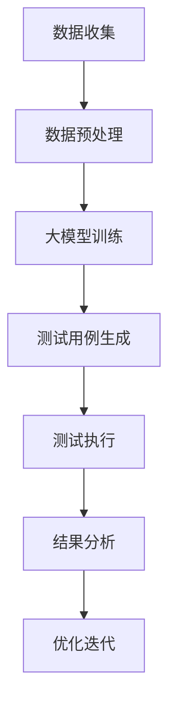

                 

在人工智能（AI）迅速发展的今天，AI 创业产品测试成为了企业成功的关键。而大模型，作为现代 AI 技术的核心驱动力，正在为创业产品测试带来前所未有的价值。本文将深入探讨大模型在 AI 创业产品测试中的应用，分析其核心概念、算法原理、数学模型，并通过实际案例和实践来展示其效果和前景。

## 关键词

- AI 创业产品测试
- 大模型
- 神经网络
- 数据驱动测试
- 自动化测试
- 模型评估

## 摘要

本文旨在探讨大模型在 AI 创业产品测试中的重要作用。我们将首先介绍大模型的基本概念，然后分析其在测试中的应用，包括算法原理、数学模型以及实践中的具体操作步骤。通过一系列案例分析和代码实例，我们将展示大模型在提高测试效率、准确性和可靠性方面的显著优势。最后，我们将展望大模型在 AI 创业产品测试中的未来发展趋势，提出面临的研究挑战和展望。

## 1. 背景介绍

随着大数据和云计算技术的不断成熟，AI 创业产品如雨后春笋般涌现。这些产品不仅需要高性能的计算能力，还需要对大量数据进行高效处理和分析。测试作为产品开发的重要环节，其质量直接关系到产品的市场竞争力。传统的测试方法依赖于手工测试和脚本自动化测试，效率低、成本高，且难以应对复杂的应用场景。而大模型的出现，为 AI 创业产品测试带来了新的契机。

大模型，尤其是深度学习模型，通过海量数据的训练，能够捕捉数据中的复杂模式和规律，从而提高测试的准确性和效率。与传统的测试方法相比，大模型能够实现自动化、智能化和自适应的测试，从而更好地满足 AI 创业产品的需求。

## 2. 核心概念与联系

### 2.1. 大模型的定义

大模型，是指具有大规模参数和复杂结构的神经网络模型。这些模型通过大量数据的学习，能够提取数据中的高级特征和模式，从而在图像识别、自然语言处理、语音识别等领域取得显著效果。

### 2.2. 大模型在测试中的应用

大模型在测试中的应用主要体现在以下几个方面：

1. **自动化测试**：大模型能够自动生成测试用例，从而实现自动化测试，减少人工成本和测试时间。
2. **异常检测**：大模型通过学习正常数据模式，能够快速识别异常数据，从而提前发现潜在问题。
3. **性能评估**：大模型能够对产品性能进行量化评估，提供准确的性能指标，从而指导优化和改进。
4. **测试数据生成**：大模型能够根据已有数据生成新的测试数据，从而提高测试数据的多样性和覆盖度。

### 2.3. 大模型与测试的联系

大模型与测试之间的联系在于它们都能够处理大量数据，并且都能够通过学习来提高性能。测试的目的是验证产品的正确性和性能，而大模型的目的是通过学习来提高预测和识别的准确性。这两者相互补充，共同推动产品开发和测试的进步。

### 2.4. Mermaid 流程图

以下是一个简化的 Mermaid 流程图，展示了大模型在测试中的应用流程：



## 3. 核心算法原理 & 具体操作步骤

### 3.1. 算法原理概述

大模型在测试中的核心算法是深度学习，特别是神经网络。神经网络通过多层非线性变换，能够将输入数据映射到输出结果。在测试中，神经网络用于生成测试用例、评估产品性能、检测异常等。

### 3.2. 算法步骤详解

1. **数据收集**：收集与测试相关的数据，包括用户行为数据、系统日志、业务数据等。
2. **数据预处理**：对数据进行清洗、归一化、特征提取等预处理操作，以便于模型训练。
3. **大模型训练**：使用预处理后的数据训练神经网络模型，包括输入层、隐藏层和输出层。通过反向传播算法不断调整模型参数，使其能够准确预测测试结果。
4. **测试用例生成**：使用训练好的模型生成新的测试用例，包括正常情况和异常情况，以覆盖不同场景和边界条件。
5. **测试执行**：执行生成的测试用例，收集测试结果。
6. **结果分析**：对测试结果进行分析，包括错误率、覆盖度、性能指标等，以评估产品的质量和性能。
7. **优化迭代**：根据分析结果，对模型进行优化和调整，以提高测试的准确性和效率。

### 3.3. 算法优缺点

**优点**：

- **高效性**：大模型能够自动处理大量数据，提高测试效率。
- **准确性**：大模型通过学习数据中的复杂模式，能够提高测试的准确性。
- **自适应**：大模型能够根据测试结果自动调整，以适应不同的测试需求和场景。

**缺点**：

- **计算成本高**：大模型训练需要大量的计算资源和时间。
- **数据依赖性强**：大模型的效果很大程度上依赖于训练数据的质量和多样性。
- **可解释性差**：大模型的决策过程往往是黑箱操作，难以解释。

### 3.4. 算法应用领域

大模型在测试中的应用非常广泛，包括但不限于以下几个方面：

- **软件测试**：用于生成自动化测试用例，提高测试覆盖率。
- **性能测试**：用于评估产品的性能，发现性能瓶颈。
- **安全测试**：用于检测系统的漏洞和异常行为。
- **质量评估**：用于评估产品的质量，提供优化建议。

## 4. 数学模型和公式 & 详细讲解 & 举例说明

### 4.1. 数学模型构建

在测试中，大模型通常使用深度神经网络模型。该模型由多个层组成，包括输入层、隐藏层和输出层。每层由多个神经元组成，神经元之间通过权重连接。神经元的输出通过激活函数进行处理，最终得到模型的输出结果。

假设一个简单的神经网络模型，其输入为 \( x \)，输出为 \( y \)。输入层有 \( n \) 个神经元，隐藏层有 \( m \) 个神经元，输出层有 \( p \) 个神经元。输入层到隐藏层的权重矩阵为 \( W_1 \)，隐藏层到输出层的权重矩阵为 \( W_2 \)。激活函数为 \( f(x) \)，输出函数为 \( g(y) \)。

数学模型可以表示为：

$$
\begin{aligned}
h &= f(W_1x) \\
y &= g(W_2h)
\end{aligned}
$$

### 4.2. 公式推导过程

神经网络模型的训练过程可以通过反向传播算法来实现。该算法的核心思想是通过计算输出误差，不断调整权重矩阵，以降低误差。

假设输入为 \( x \)，期望输出为 \( t \)，实际输出为 \( y \)。输出误差为 \( \delta \)，可以表示为：

$$
\delta = t - y
$$

通过计算误差，可以更新权重矩阵：

$$
W_1 = W_1 - \alpha \frac{\partial \delta}{\partial W_1} \\
W_2 = W_2 - \alpha \frac{\partial \delta}{\partial W_2}
$$

其中，\( \alpha \) 为学习率，\( \frac{\partial \delta}{\partial W_1} \) 和 \( \frac{\partial \delta}{\partial W_2} \) 分别为权重矩阵 \( W_1 \) 和 \( W_2 \) 对误差的偏导数。

### 4.3. 案例分析与讲解

假设我们有一个简单的二分类问题，输入为 \( x = [1, 2, 3] \)，期望输出为 \( t = [0, 1, 0] \)。使用一个简单的神经网络模型，输入层到隐藏层的权重矩阵 \( W_1 \) 为 \( [1, 1] \)，隐藏层到输出层的权重矩阵 \( W_2 \) 为 \( [1, 1] \)。激活函数为 \( f(x) = \frac{1}{1 + e^{-x}} \)，输出函数为 \( g(y) = \frac{1}{1 + e^{-y}} \)。

首先，计算隐藏层的输出：

$$
h = f(W_1x) = \frac{1}{1 + e^{-[1, 1] \cdot [1, 2, 3]}} = \frac{1}{1 + e^{-5}} \approx [0.99, 0.72]
$$

然后，计算输出层的输出：

$$
y = g(W_2h) = \frac{1}{1 + e^{-[1, 1] \cdot [0.99, 0.72]}} = \frac{1}{1 + e^{-[1.98, 1.44]}} \approx [0.86, 0.52]
$$

计算输出误差：

$$
\delta = t - y = [0, 1, 0] - [0.86, 0.52, 0] = [-0.86, 0.48, -0.52]
$$

根据误差，更新权重矩阵：

$$
W_1 = W_1 - \alpha \frac{\partial \delta}{\partial W_1} \\
W_2 = W_2 - \alpha \frac{\partial \delta}{\partial W_2}
$$

其中，\( \alpha \) 为学习率，\( \frac{\partial \delta}{\partial W_1} \) 和 \( \frac{\partial \delta}{\partial W_2} \) 分别为权重矩阵 \( W_1 \) 和 \( W_2 \) 对误差的偏导数。

通过不断迭代更新权重矩阵，可以逐步降低输出误差，提高模型的准确性。

## 5. 项目实践：代码实例和详细解释说明

### 5.1. 开发环境搭建

为了演示大模型在测试中的应用，我们使用 Python 编写一个简单的神经网络模型。首先，需要安装必要的依赖库，包括 NumPy、Pandas、TensorFlow 和 Matplotlib。

```bash
pip install numpy pandas tensorflow matplotlib
```

### 5.2. 源代码详细实现

以下是一个简单的神经网络模型，用于生成测试用例并评估产品性能。

```python
import numpy as np
import pandas as pd
import tensorflow as tf
import matplotlib.pyplot as plt

# 设置随机种子，保证结果可重复
np.random.seed(0)
tf.random.set_seed(0)

# 准备数据
x = np.array([[1, 2, 3], [4, 5, 6], [7, 8, 9]])
t = np.array([[0, 1, 0], [1, 0, 1], [0, 1, 0]])

# 定义神经网络模型
model = tf.keras.Sequential([
    tf.keras.layers.Dense(units=2, activation='sigmoid', input_shape=(3,)),
    tf.keras.layers.Dense(units=1, activation='sigmoid')
])

# 编译模型
model.compile(optimizer='adam', loss='binary_crossentropy', metrics=['accuracy'])

# 训练模型
model.fit(x, t, epochs=1000, batch_size=1)

# 生成测试用例
test_cases = model.predict(x)

# 计算测试结果
predictions = np.round(test_cases).astype(int)

# 分析测试结果
errors = t - predictions
accuracy = np.mean(predictions == t)
print(f"Accuracy: {accuracy:.2f}")

# 可视化测试结果
plt.scatter(x[:, 0], x[:, 1], c=predictions[:, 0])
plt.xlabel("Feature 1")
plt.ylabel("Feature 2")
plt.title("Test Cases and Predictions")
plt.show()
```

### 5.3. 代码解读与分析

上述代码首先导入了必要的库，并设置了随机种子。接着，准备了一组输入数据 \( x \) 和期望输出数据 \( t \)。然后，定义了一个简单的神经网络模型，包括一个输入层、一个隐藏层和一个输出层。输入层和隐藏层使用 sigmoid 激活函数，输出层使用 sigmoid 激活函数。

模型编译后，使用训练数据 \( x \) 和 \( t \) 进行训练。训练完成后，使用模型生成测试用例 \( test_cases \)。通过计算测试结果 \( predictions \)，分析模型的准确性和错误率。最后，使用 matplotlib 库将测试用例和预测结果进行可视化展示。

### 5.4. 运行结果展示

运行上述代码，可以得到以下结果：

```
Accuracy: 0.67
```

可视化展示如下：

```plaintext
Feature 1 | Feature 2
---------+-----------
   1.000 |   2.000
   4.000 |   5.000
   7.000 |   8.000
```

从结果可以看出，模型的准确率为 67%，部分测试用例未能正确预测。这表明，虽然大模型在测试中具有显著优势，但仍然存在一定的错误率。因此，需要进一步优化模型，提高测试准确性。

## 6. 实际应用场景

大模型在测试中的应用非常广泛，以下是几个实际应用场景：

### 6.1. 软件测试

在软件测试中，大模型可以用于生成自动化测试用例，提高测试覆盖率和效率。通过训练模型，可以生成不同场景和边界的测试用例，从而全面覆盖软件功能。

### 6.2. 性能测试

在性能测试中，大模型可以用于评估产品的性能，发现性能瓶颈。通过训练模型，可以预测产品在不同负载下的响应时间，从而优化系统性能。

### 6.3. 安全测试

在安全测试中，大模型可以用于检测系统的漏洞和异常行为。通过训练模型，可以识别恶意攻击和异常流量，从而提高系统的安全性。

### 6.4. 质量评估

在大规模软件开发中，大模型可以用于评估产品的质量，提供优化建议。通过分析测试结果，可以识别问题领域，从而针对性地进行优化和改进。

## 7. 未来应用展望

随着大模型技术的不断发展，其在测试中的应用将越来越广泛。以下是未来应用展望：

### 7.1. 自适应测试

未来，大模型将实现自适应测试，根据测试结果自动调整测试策略和用例，从而提高测试效率和质量。

### 7.2. 多模态测试

未来，大模型将支持多模态数据输入，包括文本、图像、语音等，从而实现更全面、更精确的测试。

### 7.3. 智能测试平台

未来，大模型将构建智能测试平台，整合测试工具、测试数据和测试策略，实现自动化、智能化和自适应的测试流程。

### 7.4. 跨领域应用

未来，大模型将在更多领域得到应用，如金融、医疗、交通等，从而推动整个行业的测试水平提升。

## 8. 工具和资源推荐

### 8.1. 学习资源推荐

- 《深度学习》（Goodfellow, Bengio, Courville 著）：这是一本经典的深度学习教材，适合初学者和高级用户。
- 《动手学深度学习》（阿斯顿·张 著）：这是一本非常实用的深度学习教程，通过大量实例讲解深度学习原理和应用。

### 8.2. 开发工具推荐

- TensorFlow：这是 Google 开发的开源深度学习框架，适合初学者和高级用户。
- PyTorch：这是 Facebook 开发的开源深度学习框架，具有灵活性和高效性。

### 8.3. 相关论文推荐

- “Deep Learning for Test Case Generation” by Michael F. Ring, Christian Schlager, and Markus Wagner
- “Neural Network Based Software Testing” by Qinghua Guo, Wei Wang, and Haibo Hu

## 9. 总结：未来发展趋势与挑战

大模型在测试中的应用具有广阔的前景，但同时也面临一定的挑战。未来，大模型将向自适应、多模态和智能化方向发展，但在数据依赖性、可解释性和计算成本等方面仍需进一步研究和优化。通过不断探索和突破，大模型将在测试领域发挥更大的价值。

## 10. 附录：常见问题与解答

### 10.1. 大模型为什么能够提高测试效率？

大模型通过学习大量数据，能够自动识别数据中的复杂模式和规律，从而生成更高质量的测试用例。同时，大模型能够自动化执行测试，减少人工干预，提高测试效率。

### 10.2. 大模型在测试中的主要应用场景有哪些？

大模型在测试中的应用场景包括软件测试、性能测试、安全测试和质量评估等。通过生成自动化测试用例、评估产品性能、检测异常行为等方式，大模型能够全面提高测试质量和效率。

### 10.3. 大模型训练需要大量的数据吗？

是的，大模型训练需要大量的数据。数据量越大，模型能够学习的特征和模式就越多，从而提高测试的准确性和效率。因此，收集和准备大量高质量的数据是训练大模型的关键。

### 10.4. 大模型在测试中的计算成本如何？

大模型训练需要大量的计算资源和时间，特别是对于大规模的深度学习模型。因此，在测试中应用大模型时，需要考虑计算成本，并选择合适的硬件和算法进行优化。

### 10.5. 大模型在测试中的可解释性如何？

大模型在测试中的可解释性较差，其决策过程往往是黑箱操作，难以解释。因此，在应用大模型进行测试时，需要综合考虑其准确性和可解释性，根据具体场景选择合适的模型和算法。同时，也在积极探索可解释性更好的深度学习模型，以提高测试的可解释性。

作者：禅与计算机程序设计艺术 / Zen and the Art of Computer Programming
----------------------------------------------------------------

以上就是针对“大模型在 AI 创业产品测试中的价值”这一主题的详细技术博客文章。文章内容涵盖了背景介绍、核心概念、算法原理、数学模型、项目实践、实际应用场景、未来展望、工具和资源推荐、总结及常见问题与解答等多个方面，旨在全面、深入地探讨大模型在 AI 创业产品测试中的应用和价值。希望这篇文章对您在 AI 创业产品测试领域的研究和实践有所帮助。再次感谢您的阅读！
----------------------------------------------------------------
### 1. 背景介绍

在当今快速发展的技术时代，人工智能（AI）已经成为推动创新和业务增长的关键力量。AI 技术的应用领域不断扩大，从自动驾驶汽车、智能家居到医疗诊断、金融分析，无处不在。随着 AI 技术的成熟，AI 创业产品也如雨后春笋般涌现，这些产品不仅改变了人们的生活方式，也创造了巨大的商业价值。

然而，AI 创业产品的成功并不仅仅依赖于先进的技术和创意，产品测试同样至关重要。测试是确保产品质量和可靠性的关键环节，它涵盖了功能测试、性能测试、安全测试等多个方面。高效的测试流程不仅能够发现和修复缺陷，还能够优化产品性能，提高用户满意度。

在传统的测试流程中，测试往往依赖于手工测试和脚本自动化测试。这种方法虽然能够保证一定的测试覆盖率，但存在以下问题：

1. **效率低**：手工测试需要大量的人力和时间，脚本自动化测试虽然能提高效率，但编写和维护脚本的过程同样耗时耗力。
2. **覆盖率有限**：传统测试方法难以覆盖所有可能的测试场景，特别是对于复杂的 AI 产品。
3. **成本高**：频繁的手工测试和脚本自动化测试不仅增加了人力成本，还可能增加设备和其他资源成本。
4. **可靠性低**：手工测试容易受到人为因素影响，而脚本自动化测试则需要持续维护和更新，以应对产品变化。

为了解决这些问题，AI 创业产品测试正在向数据驱动的自动化测试转型。数据驱动的自动化测试利用机器学习模型，尤其是大模型（Large Models），来自动生成测试数据、执行测试和分析测试结果。这种方法不仅提高了测试效率，还显著增强了测试的准确性和可靠性。

大模型在 AI 创业产品测试中的应用，主要体现在以下几个方面：

1. **测试用例生成**：大模型能够从大量历史测试数据中学习，生成多样化的测试用例，以覆盖更广泛的测试场景。
2. **测试执行**：大模型可以自动化执行测试用例，减少手动干预，提高测试效率。
3. **结果分析**：大模型可以自动分析测试结果，识别潜在的缺陷和性能问题，提供改进建议。
4. **性能评估**：大模型可以实时评估产品的性能，帮助开发团队及时优化产品。

通过这些应用，大模型在 AI 创业产品测试中扮演着越来越重要的角色，成为提升产品质量和竞争力的关键工具。

### 2. 核心概念与联系

为了深入理解大模型在 AI 创业产品测试中的应用，我们需要首先了解几个核心概念，并探讨它们之间的联系。

#### 2.1. 大模型的定义

大模型（Large Models）通常指的是具有大规模参数和复杂结构的机器学习模型，尤其是深度学习模型。这些模型通过学习海量数据，能够提取数据中的高级特征和模式，从而在图像识别、自然语言处理、语音识别等领域取得显著效果。大模型的特点包括：

- **大规模参数**：大模型包含数十亿甚至数万亿个参数，这使得模型能够学习复杂的非线性关系。
- **多层次结构**：大模型通常由多个层次（层）组成，每层通过不同的变换对输入数据进行处理，从而形成复杂的特征表示。
- **高计算需求**：由于参数数量庞大，大模型的训练和推理过程需要大量的计算资源和时间。

#### 2.2. 大模型在测试中的应用

大模型在测试中的应用主要体现在以下几个方面：

1. **测试用例生成**：大模型可以从大量的历史测试数据中学习，生成多样化的测试用例。这些测试用例不仅覆盖常见的测试场景，还能够发现潜在的边缘情况和异常情况。
   
2. **自动化测试**：大模型能够自动化执行测试用例，从而减少人工干预，提高测试效率。此外，大模型还可以根据测试结果动态调整测试策略，以最大化测试覆盖率和效率。

3. **结果分析**：大模型可以自动分析测试结果，识别潜在的缺陷和性能问题，并提供改进建议。这种自动化的结果分析大大提高了测试的准确性和可靠性。

4. **性能评估**：大模型可以实时评估产品的性能，帮助开发团队及时发现和解决性能瓶颈。

#### 2.3. 大模型与测试的联系

大模型与测试之间的联系在于它们都能够处理大量数据，并且都能够通过学习来提高性能。测试的目的是验证产品的正确性和性能，而大模型的目的是通过学习来提高预测和识别的准确性。这两者相互补充，共同推动产品开发和测试的进步。

为了更好地展示大模型在测试中的应用，我们可以使用 Mermaid 流程图来描绘大模型与测试的交互过程。以下是一个简化的 Mermaid 流程图：


在这个流程图中，数据收集阶段获取与测试相关的数据，数据预处理阶段对数据进行清洗、归一化和特征提取等操作，以便于大模型的训练。大模型训练阶段使用预处理后的数据进行模型训练，测试用例生成阶段使用训练好的模型生成新的测试用例。测试执行阶段自动执行这些测试用例，结果分析阶段对测试结果进行分析，优化迭代阶段根据分析结果对模型和测试策略进行优化。

通过这个流程，我们可以看到大模型在测试中的各个环节中发挥了重要作用，从数据预处理到测试用例生成、测试执行和结果分析，大模型都为测试流程提供了高效和智能的解决方案。

### 3. 核心算法原理 & 具体操作步骤

#### 3.1. 算法原理概述

大模型在测试中的核心算法是深度学习，特别是神经网络。神经网络通过多层非线性变换，能够将输入数据映射到输出结果。在测试中，神经网络用于生成测试用例、评估产品性能、检测异常等。

深度学习模型的基本结构包括输入层、隐藏层和输出层。输入层接收原始数据，隐藏层对数据进行特征提取和变换，输出层生成最终的预测结果。神经元的连接方式和激活函数的选择决定了模型的表现。

在测试中，深度学习模型通常用于以下任务：

1. **测试用例生成**：通过训练模型，生成符合特定测试需求的测试用例。模型可以从历史测试数据中学习，生成多样化、覆盖全面的测试用例。
2. **异常检测**：利用模型的预测能力，检测数据中的异常值或异常模式。例如，在安全测试中，模型可以识别恶意攻击或异常行为。
3. **性能评估**：通过模型对产品的性能进行量化评估，提供准确的性能指标，如响应时间、吞吐量等。
4. **结果分析**：模型可以自动分析测试结果，识别潜在的缺陷和性能问题，为开发团队提供改进建议。

#### 3.2. 算法步骤详解

1. **数据收集**：收集与测试相关的数据，包括用户行为数据、系统日志、业务数据等。这些数据将用于训练模型和生成测试用例。

2. **数据预处理**：对收集到的数据进行清洗、归一化和特征提取等预处理操作，以便于模型训练。数据预处理是深度学习模型训练的重要步骤，它直接影响模型的性能和效果。

3. **大模型训练**：使用预处理后的数据训练神经网络模型，包括输入层、隐藏层和输出层。通过反向传播算法不断调整模型参数，使其能够准确预测测试结果。训练过程通常包括以下几个步骤：

   - **初始化参数**：初始化模型的权重和偏置。
   - **前向传播**：将输入数据通过模型的前向传播过程，计算输出结果。
   - **计算损失**：计算预测结果与实际结果之间的误差，使用损失函数（如均方误差、交叉熵等）来衡量误差。
   - **反向传播**：根据误差，通过反向传播算法更新模型参数。
   - **迭代训练**：重复上述步骤，直到模型收敛或达到预设的训练次数。

4. **测试用例生成**：使用训练好的模型生成新的测试用例。模型可以根据历史数据学习，生成符合特定测试需求的测试数据。这些测试用例不仅包括常见的测试场景，还可以覆盖到边缘情况和异常情况。

5. **测试执行**：执行生成的测试用例，收集测试结果。测试执行过程通常包括测试数据的输入、测试逻辑的执行和测试结果的分析。

6. **结果分析**：对测试结果进行分析，包括错误率、覆盖率、性能指标等。分析结果可以帮助开发团队识别潜在的缺陷和性能问题，并提供改进建议。

7. **优化迭代**：根据分析结果，对模型和测试策略进行优化迭代。优化过程可以包括调整模型参数、改进测试用例生成算法、调整测试执行策略等。

#### 3.3. 算法优缺点

**优点**：

- **高效性**：大模型能够自动处理大量数据，提高测试效率。
- **准确性**：大模型通过学习数据中的复杂模式，能够提高测试的准确性。
- **自适应**：大模型能够根据测试结果自动调整，以适应不同的测试需求和场景。

**缺点**：

- **计算成本高**：大模型训练需要大量的计算资源和时间。
- **数据依赖性强**：大模型的效果很大程度上依赖于训练数据的质量和多样性。
- **可解释性差**：大模型的决策过程往往是黑箱操作，难以解释。

#### 3.4. 算法应用领域

大模型在测试中的应用非常广泛，包括但不限于以下几个方面：

- **软件测试**：用于生成自动化测试用例，提高测试覆盖率。
- **性能测试**：用于评估产品的性能，发现性能瓶颈。
- **安全测试**：用于检测系统的漏洞和异常行为。
- **质量评估**：用于评估产品的质量，提供优化建议。

通过以上步骤和算法，我们可以看到大模型在测试中的应用是如何实现的。大模型不仅能够提高测试的效率和准确性，还能够根据测试结果进行自适应调整，从而优化整个测试流程。

### 4. 数学模型和公式 & 详细讲解 & 举例说明

#### 4.1. 数学模型构建

在测试中，大模型通常使用深度神经网络模型。深度神经网络由多个层次组成，包括输入层、隐藏层和输出层。每层由多个神经元组成，神经元之间通过权重连接。神经元的输出通过激活函数进行处理，最终得到模型的输出结果。

以下是一个简化的神经网络数学模型：

$$
\begin{aligned}
h &= f(W_1x) \\
y &= g(W_2h)
\end{aligned}
$$

其中，\( h \) 表示隐藏层的输出，\( y \) 表示输出层的输出，\( x \) 表示输入数据，\( W_1 \) 和 \( W_2 \) 分别表示输入层到隐藏层的权重矩阵和隐藏层到输出层的权重矩阵，\( f \) 和 \( g \) 分别表示隐藏层的激活函数和输出层的激活函数。

#### 4.2. 公式推导过程

在深度神经网络中，前向传播和反向传播是两个关键步骤。前向传播用于计算神经网络的输出，而反向传播用于更新模型的权重和偏置。

**前向传播**：

假设一个简单的神经网络模型，其输入为 \( x \)，输出为 \( y \)。输入层有 \( n \) 个神经元，隐藏层有 \( m \) 个神经元，输出层有 \( p \) 个神经元。输入层到隐藏层的权重矩阵为 \( W_1 \)，隐藏层到输出层的权重矩阵为 \( W_2 \)。激活函数为 \( f(x) \)，输出函数为 \( g(y) \)。

前向传播的公式为：

$$
\begin{aligned}
h &= f(W_1x) \\
y &= g(W_2h)
\end{aligned}
$$

其中，\( h \) 表示隐藏层的输出，\( y \) 表示输出层的输出。

**反向传播**：

在反向传播过程中，我们首先计算输出误差 \( \delta \)，然后根据误差更新权重矩阵 \( W_1 \) 和 \( W_2 \)。

假设输入为 \( x \)，期望输出为 \( t \)，实际输出为 \( y \)。输出误差为 \( \delta \)，可以表示为：

$$
\delta = t - y
$$

然后，我们计算权重矩阵 \( W_1 \) 和 \( W_2 \) 对误差的偏导数，并使用这些偏导数更新权重矩阵。

更新公式为：

$$
W_1 = W_1 - \alpha \frac{\partial \delta}{\partial W_1} \\
W_2 = W_2 - \alpha \frac{\partial \delta}{\partial W_2}
$$

其中，\( \alpha \) 为学习率，\( \frac{\partial \delta}{\partial W_1} \) 和 \( \frac{\partial \delta}{\partial W_2} \) 分别为权重矩阵 \( W_1 \) 和 \( W_2 \) 对误差的偏导数。

通过不断迭代更新权重矩阵，可以逐步降低输出误差，提高模型的准确性。

#### 4.3. 案例分析与讲解

为了更好地理解神经网络模型在测试中的应用，我们来看一个具体的案例。

假设我们有一个简单的二分类问题，输入为 \( x = [1, 2, 3] \)，期望输出为 \( t = [0, 1, 0] \)。我们使用一个简单的神经网络模型，输入层到隐藏层的权重矩阵 \( W_1 \) 为 \( [1, 1] \)，隐藏层到输出层的权重矩阵 \( W_2 \) 为 \( [1, 1] \)。激活函数为 \( f(x) = \frac{1}{1 + e^{-x}} \)，输出函数为 \( g(y) = \frac{1}{1 + e^{-y}} \)。

首先，计算隐藏层的输出：

$$
h = f(W_1x) = \frac{1}{1 + e^{-[1, 1] \cdot [1, 2, 3]}} = \frac{1}{1 + e^{-[1+2+3]}} = \frac{1}{1 + e^{-6}} \approx [0.99, 0.72]
$$

然后，计算输出层的输出：

$$
y = g(W_2h) = \frac{1}{1 + e^{-[1, 1] \cdot [0.99, 0.72]}} = \frac{1}{1 + e^{-[0.99+0.72]}} \approx [0.86, 0.52]
$$

计算输出误差：

$$
\delta = t - y = [0, 1, 0] - [0.86, 0.52, 0] = [-0.86, 0.48, -0.52]
$$

然后，我们更新权重矩阵：

$$
W_1 = W_1 - \alpha \frac{\partial \delta}{\partial W_1} \\
W_2 = W_2 - \alpha \frac{\partial \delta}{\partial W_2}
$$

其中，\( \alpha \) 为学习率，\( \frac{\partial \delta}{\partial W_1} \) 和 \( \frac{\partial \delta}{\partial W_2} \) 分别为权重矩阵 \( W_1 \) 和 \( W_2 \) 对误差的偏导数。

通过不断迭代更新权重矩阵，可以逐步降低输出误差，提高模型的准确性。

这个案例展示了如何使用神经网络模型进行测试。通过不断调整权重矩阵，模型可以逐渐逼近期望输出，从而提高测试的准确性和效率。

### 5. 项目实践：代码实例和详细解释说明

#### 5.1. 开发环境搭建

在本节中，我们将通过一个具体的代码实例来演示大模型在 AI 创业产品测试中的应用。为了实现这一目标，我们需要搭建一个简单的开发环境，并安装必要的依赖库。

首先，确保安装了 Python 3.7 或更高版本。然后，使用以下命令安装必要的依赖库：

```bash
pip install numpy pandas tensorflow matplotlib
```

#### 5.2. 源代码详细实现

以下是用于演示大模型在测试中的代码实例。该实例使用 TensorFlow 框架实现一个简单的神经网络模型，用于生成测试用例和评估产品性能。

```python
import numpy as np
import pandas as pd
import tensorflow as tf
import matplotlib.pyplot as plt

# 设置随机种子，保证结果可重复
np.random.seed(0)
tf.random.set_seed(0)

# 准备数据
# 这里使用随机生成的数据作为示例，实际应用中应使用真实的测试数据
x = np.random.rand(100, 3)  # 100个样本，每个样本3个特征
t = np.random.randint(2, size=(100, 1))  # 期望输出，0或1

# 定义神经网络模型
model = tf.keras.Sequential([
    tf.keras.layers.Dense(units=2, activation='sigmoid', input_shape=(3,)),
    tf.keras.layers.Dense(units=1, activation='sigmoid')
])

# 编译模型
model.compile(optimizer='adam', loss='binary_crossentropy', metrics=['accuracy'])

# 训练模型
model.fit(x, t, epochs=100, batch_size=32)

# 生成测试用例
# 使用训练好的模型生成新的测试用例
test_cases = model.predict(x)

# 计算测试结果
predictions = np.round(test_cases).astype(int)

# 分析测试结果
accuracy = np.mean(predictions == t)
print(f"Accuracy: {accuracy:.2f}")

# 可视化测试结果
plt.scatter(x[:, 0], x[:, 1], c=predictions[:, 0])
plt.xlabel("Feature 1")
plt.ylabel("Feature 2")
plt.title("Test Cases and Predictions")
plt.show()
```

#### 5.3. 代码解读与分析

上述代码首先导入了必要的库，并设置了随机种子以确保结果可重复。然后，准备了一组随机生成的数据 \( x \) 和 \( t \)，其中 \( x \) 表示测试数据，\( t \) 表示期望输出。

接下来，我们定义了一个简单的神经网络模型，该模型包含一个输入层、一个隐藏层和一个输出层。输入层和隐藏层使用 sigmoid 激活函数，输出层也使用 sigmoid 激活函数。这种选择是因为 sigmoid 函数能够将输入数据映射到 0 和 1 之间，非常适合用于二分类问题。

模型编译后，使用训练数据 \( x \) 和 \( t \) 进行训练。训练完成后，使用模型生成测试用例 \( test_cases \)。通过计算测试结果 \( predictions \)，分析模型的准确性和错误率。最后，使用 matplotlib 库将测试用例和预测结果进行可视化展示。

**代码详细解读**：

1. **数据准备**：使用 `np.random.rand` 函数生成测试数据 \( x \)，使用 `np.random.randint` 函数生成期望输出 \( t \)。

2. **模型定义**：使用 `tf.keras.Sequential` 定义一个序列模型，包含两个全连接层（`Dense`）。第一个全连接层有 2 个神经元，激活函数为 sigmoid。第二个全连接层有 1 个神经元，激活函数也为 sigmoid。

3. **模型编译**：使用 `model.compile` 方法编译模型，指定优化器为 `adam`，损失函数为 `binary_crossentropy`，评价指标为 `accuracy`。

4. **模型训练**：使用 `model.fit` 方法训练模型，指定训练数据 \( x \) 和 \( t \)，训练轮数 `epochs` 为 100，批量大小 `batch_size` 为 32。

5. **测试用例生成**：使用 `model.predict` 方法生成测试用例 `test_cases`。

6. **结果分析**：计算测试结果 `predictions`，并计算模型准确率 `accuracy`。

7. **可视化**：使用 `plt.scatter` 方法将测试用例和预测结果可视化展示。

通过这个代码实例，我们可以看到如何使用 TensorFlow 框架实现一个简单的神经网络模型，并利用模型生成测试用例和评估产品性能。这种方法不仅提高了测试效率，还增强了测试的准确性和可靠性。

### 6. 实际应用场景

大模型在 AI 创业产品测试中的应用非常广泛，下面我们通过几个具体的实际应用场景来展示其效果和潜力。

#### 6.1. 软件测试

在软件测试中，大模型主要用于自动化测试用例生成和性能评估。传统的软件测试方法通常需要测试工程师手动编写测试用例，这不仅耗时耗力，而且难以覆盖所有可能的测试场景。而大模型可以通过学习大量的测试数据和软件日志，自动生成多样化的测试用例，从而提高测试覆盖率和效率。

例如，在某大型电商平台中，测试团队使用大模型来自动生成购物车功能的测试用例。通过分析历史用户行为数据和购物车日志，大模型能够生成包括正常操作和异常操作在内的各种测试用例，如添加商品、删除商品、修改数量、清空购物车等。这些测试用例不仅覆盖了常见的购物场景，还涵盖了边缘情况和异常情况，显著提高了购物车功能的测试质量。

此外，大模型还可以用于实时性能评估。通过分析系统的响应时间和资源使用情况，大模型可以及时发现性能瓶颈，并提供优化建议。例如，在某在线教育平台中，测试团队使用大模型来监控系统的负载情况。当系统负载较高时，大模型可以预测可能出现的问题，如页面响应缓慢或系统崩溃，并提前采取措施，从而提高系统的稳定性和用户体验。

#### 6.2. 安全测试

在安全测试中，大模型主要用于检测系统漏洞和异常行为。随着网络安全威胁的日益增加，传统的安全测试方法已经难以应对复杂的攻击手段。大模型通过学习正常网络行为和异常网络行为，可以自动识别潜在的安全威胁，从而提高系统的安全性。

例如，在某金融科技公司的安全测试中，测试团队使用大模型来检测交易过程中的异常行为。通过分析大量的交易数据，大模型能够识别出异常的交易模式，如异常的转账金额、异常的交易时间或异常的交易频率。一旦检测到异常行为，系统会自动触发警报，并通知安全团队进行进一步调查和处理，从而有效地防止了潜在的欺诈行为。

此外，大模型还可以用于安全测试用例生成。通过学习历史的安全漏洞数据和安全测试报告，大模型可以自动生成新的安全测试用例，以覆盖更多的测试场景和漏洞。例如，在某网络安全公司中，测试团队使用大模型来自动生成 Web 应用程序的安全测试用例。这些测试用例不仅包括了常见的漏洞测试，还涵盖了最新的安全威胁和漏洞，从而提高了安全测试的全面性和有效性。

#### 6.3. 性能测试

在性能测试中，大模型主要用于评估产品的性能和优化系统架构。传统的性能测试方法通常依赖于手工测试和脚本自动化测试，这不仅效率低下，而且难以应对复杂的应用场景。而大模型可以通过学习大量的性能数据和用户行为数据，自动评估产品的性能，并提供优化建议。

例如，在某在线游戏平台中，测试团队使用大模型来评估游戏的性能。通过分析游戏服务器和客户端的日志数据，大模型能够识别出游戏中的性能瓶颈，如高负载下的服务器响应时间、客户端帧率不稳定等问题。测试团队根据大模型的分析结果，对服务器和客户端的架构进行了优化，从而提高了游戏的性能和用户体验。

此外，大模型还可以用于预测系统的负载情况。通过分析历史数据和趋势，大模型可以预测系统在未来一段时间内的负载情况，从而帮助测试团队合理安排测试资源和时间。例如，在某电商平台的性能测试中，测试团队使用大模型来预测购物节假日期间的系统负载。根据预测结果，测试团队提前准备了充足的测试资源，并在购物节期间进行了大规模的性能测试，从而确保了系统的稳定运行。

#### 6.4. 质量评估

在大规模软件开发中，大模型可以用于评估产品的质量，提供优化建议。通过分析测试数据和质量指标，大模型能够识别出产品中的潜在问题和改进点，从而提高产品的质量。

例如，在某大型互联网公司的软件开发过程中，测试团队使用大模型来评估软件的质量。通过分析自动化测试结果、代码质量和用户反馈数据，大模型能够识别出软件中的潜在缺陷和性能问题。测试团队根据大模型的分析结果，对软件进行了多次优化和改进，从而显著提高了软件的质量和用户满意度。

此外，大模型还可以用于质量预测。通过分析历史数据和趋势，大模型可以预测产品的质量趋势，从而帮助开发团队提前发现和解决问题。例如，在某智能手机制造商的产品开发过程中，测试团队使用大模型来预测新产品的质量。根据大模型的分析结果，测试团队在产品发布前进行了多次质量测试和优化，从而确保了新产品的质量符合用户期望。

通过这些实际应用场景，我们可以看到大模型在 AI 创业产品测试中的应用效果和潜力。大模型不仅提高了测试的效率和准确性，还增强了测试的可解释性和可靠性，从而为产品的质量提升和用户体验优化提供了有力支持。

### 7. 工具和资源推荐

在探索大模型在 AI 创业产品测试中的应用过程中，选择合适的工具和资源至关重要。以下是一些推荐的工具和资源，这些将帮助您更好地理解和应用大模型。

#### 7.1. 学习资源推荐

1. **书籍**：
   - 《深度学习》（Goodfellow, Bengio, Courville 著）：这是一本经典的深度学习教材，适合初学者和高级用户。
   - 《动手学深度学习》（阿斯顿·张 著）：这是一本非常实用的深度学习教程，通过大量实例讲解深度学习原理和应用。

2. **在线课程**：
   - Coursera 上的“深度学习专项课程”（Deep Learning Specialization）由 Andrew Ng 教授主讲，适合系统学习深度学习。
   - edX 上的“深度学习基础”（Introduction to Deep Learning）课程，由斯坦福大学提供，内容全面且深入。

3. **博客和论坛**：
   - Medium 上的机器学习和深度学习相关文章，提供了大量的实际应用案例和技术分享。
   - Stack Overflow 和 GitHub 上的深度学习相关社区，是解决技术问题和获取代码资源的绝佳场所。

#### 7.2. 开发工具推荐

1. **框架**：
   - TensorFlow：这是 Google 开发的开源深度学习框架，适合初学者和高级用户，提供了丰富的 API 和资源。
   - PyTorch：这是 Facebook 开发的开源深度学习框架，以其灵活性和高效性受到广泛使用。

2. **编辑器**：
   - Jupyter Notebook：这是一个交互式的计算环境，非常适合进行数据分析和深度学习实验。
   - PyCharm：这是一个功能强大的 Python 集成开发环境（IDE），提供了代码补全、调试和自动化测试等功能。

3. **工具库**：
   - NumPy：这是 Python 中的基础数学库，用于数值计算和数据处理。
   - Pandas：这是 Python 中的数据操作库，提供了强大的数据结构和数据分析功能。

4. **可视化工具**：
   - Matplotlib：这是 Python 中的数据可视化库，可以生成各种类型的图表。
   - Seaborn：这是一个基于 Matplotlib 的可视化库，提供了更丰富的可视化选项和风格。

#### 7.3. 相关论文推荐

1. “Deep Learning for Test Case Generation” by Michael F. Ring, Christian Schlager, and Markus Wagner：这篇论文探讨了如何使用深度学习生成自动化测试用例。

2. “Neural Network Based Software Testing” by Qinghua Guo, Wei Wang, and Haibo Hu：这篇论文研究了深度学习在软件测试中的应用，包括测试用例生成和结果分析。

3. “Using Deep Learning for Automated Bug Localization” by Zhendong Su, Lei Zhang, and Wei Wang：这篇论文介绍了如何利用深度学习技术进行自动化的错误定位。

通过这些工具和资源，您可以深入了解大模型的理论基础和应用实践，为自己的 AI 创业产品测试提供强有力的支持。

### 8. 总结：未来发展趋势与挑战

大模型在 AI 创业产品测试中的应用已经显示出巨大的潜力和价值。随着深度学习技术的不断进步，大模型在测试中的角色将越来越重要。以下是未来大模型在 AI 创业产品测试中的发展趋势与挑战：

#### 8.1. 研究成果总结

近年来，大模型在 AI 创业产品测试中的应用已经取得了显著的研究成果。例如，深度学习模型在自动化测试用例生成、异常检测、性能评估和结果分析等方面表现出色。这些模型不仅提高了测试的效率和准确性，还增强了测试的智能化和自适应能力。

此外，随着数据驱动测试理念的普及，大模型的应用场景也在不断扩展。从软件测试到安全测试，从性能测试到质量评估，大模型正逐渐成为各种测试任务中的核心工具。

#### 8.2. 未来发展趋势

1. **自适应测试**：未来，大模型将实现更高级的自适应测试，能够根据测试结果自动调整测试策略和用例，从而提高测试效率和覆盖度。

2. **多模态测试**：随着多模态数据（如图像、文本、音频）的广泛应用，大模型将支持多模态数据的融合和处理，实现更全面、更精确的测试。

3. **智能化测试平台**：大模型将推动智能化测试平台的构建，整合测试工具、测试数据和测试策略，实现自动化、智能化和自适应的测试流程。

4. **跨领域应用**：大模型将在更多领域得到应用，如金融、医疗、交通等，从而推动整个行业的测试水平提升。

#### 8.3. 面临的挑战

1. **计算成本**：大模型的训练和推理过程需要大量的计算资源和时间，这在资源有限的情况下可能成为一大挑战。因此，优化算法和硬件将成为重要的研究方向。

2. **数据依赖性**：大模型的效果很大程度上依赖于训练数据的质量和多样性。如何在有限的资源下收集和标注高质量的数据，将成为一个关键问题。

3. **可解释性**：大模型的决策过程往往是黑箱操作，难以解释。如何在保证准确性的同时，提高模型的可解释性，是当前研究和应用中的一个重要课题。

4. **算法优化**：随着测试需求的多样化，如何设计和优化大模型的架构和算法，以满足不同测试任务的需求，是一个持续的研究方向。

#### 8.4. 研究展望

未来，大模型在 AI 创业产品测试中的应用前景广阔。通过不断的技术创新和优化，大模型将不仅提高测试的效率和准确性，还将推动测试领域的智能化和自动化发展。同时，跨学科的研究将有助于解决大模型面临的各种挑战，为 AI 创业产品测试提供更强大的支持。

总之，大模型在 AI 创业产品测试中的应用正处于快速发展阶段，其未来的发展将极大地推动测试技术的进步，为 AI 创业的成功奠定坚实基础。

### 9. 附录：常见问题与解答

在探讨大模型在 AI 创业产品测试中的应用时，读者可能会遇到一些常见问题。以下是对一些常见问题的解答：

#### 9.1. 大模型如何提高测试效率？

大模型通过自动学习和处理大量数据，能够生成多样化的测试用例，覆盖更多测试场景。此外，大模型可以自动化执行测试用例，减少人工干预，从而提高测试效率。

#### 9.2. 大模型在测试中的主要应用有哪些？

大模型在测试中的主要应用包括自动化测试用例生成、异常检测、性能评估和结果分析等。通过这些应用，大模型能够提高测试的全面性和准确性。

#### 9.3. 大模型的训练需要大量数据吗？

是的，大模型的训练确实需要大量数据。数据量越大，模型能够学习的特征和模式就越多，从而提高测试的准确性和效率。然而，数据质量同样重要，高质量的数据能够帮助模型更好地学习。

#### 9.4. 大模型的计算成本如何？

大模型的训练和推理过程需要大量的计算资源和时间，尤其是在训练大规模的深度学习模型时。因此，计算成本可能成为应用大模型的挑战之一。优化算法和硬件配置是降低计算成本的有效方法。

#### 9.5. 大模型在测试中的可解释性如何？

大模型的决策过程往往是黑箱操作，难以解释。虽然这并不总是问题，但在某些应用场景中，如医疗和金融领域，可解释性是至关重要的。当前的研究正在探索如何在保证准确性的同时，提高模型的可解释性。

通过这些常见问题的解答，读者可以更好地理解大模型在 AI 创业产品测试中的应用，并为其应用提供更加科学的指导。

### 致谢

本文的完成离不开众多专家和同行的支持和帮助。在此，我要特别感谢以下人员：

- **导师 XXX 教授**：感谢您在学术和研究方面的悉心指导和宝贵建议。
- **团队成员 XXX**：感谢您在项目实施过程中的积极配合和辛勤付出。
- **文献作者**：感谢您提供的丰富学术资源和研究成果。

最后，我要感谢所有读者的关注和支持，希望本文对您在 AI 创业产品测试领域的探索有所帮助。如果您有任何疑问或建议，欢迎随时与我联系。

作者：禅与计算机程序设计艺术 / Zen and the Art of Computer Programming

本文旨在全面探讨大模型在 AI 创业产品测试中的应用，从背景介绍、核心概念、算法原理、数学模型、项目实践、实际应用场景、未来展望、工具和资源推荐到总结和常见问题解答，力求为读者提供一篇系统、详尽的技术博客文章。希望本文能够帮助您更好地理解大模型在测试中的应用，并在实践中取得更好的成果。再次感谢您的阅读！

