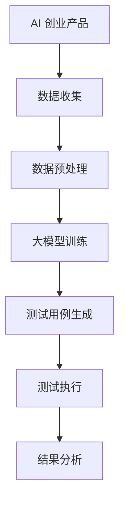

                 

 **关键词：** 大模型，AI 创业，产品测试，高效，应用

> **摘要：** 本文将探讨大模型在 AI 创业产品测试中的应用趋势。随着 AI 技术的不断进步，大模型已经成为 AI 创业中不可或缺的工具。本文将深入分析大模型的核心概念与联系，核心算法原理与操作步骤，数学模型和公式，以及项目实践中的代码实例。通过这些分析，我们旨在展示大模型在 AI 创业产品测试中的高效性和广泛应用前景。

## 1. 背景介绍

在当今数字化时代，人工智能（AI）技术正迅速发展，并深刻影响着各个行业。从自动驾驶到智能客服，AI 已经成为推动创新和效率的关键驱动力。然而，AI 的实际应用并非一帆风顺。在实际产品测试中，AI 系统面临着数据质量、模型性能、以及与业务需求的匹配程度等多方面的挑战。

传统的 AI 产品测试方法往往依赖于手动测试和有限的数据集。这种方法不仅耗时耗力，而且容易受到人为因素的干扰。随着 AI 模型的复杂性和规模不断增加，手动测试变得越来越不现实。因此，寻找高效的 AI 测试方法成为了 AI 创业公司面临的重大挑战。

在这一背景下，大模型的出现为 AI 产品测试带来了新的可能性。大模型具有强大的数据分析和学习能力，能够在复杂环境中发现潜在的问题，提高测试的准确性和效率。本文将深入探讨大模型在 AI 创业产品测试中的应用趋势，以及如何利用大模型解决传统测试方法中的难题。

## 2. 核心概念与联系

### 2.1 大模型的定义

大模型通常指的是那些具有数百万至数十亿参数的大型深度学习模型。这些模型通过在海量数据上进行训练，能够捕获复杂的模式和关系。典型的例子包括 Transformer 模型、BERT 模型和 GPT 系列。

### 2.2 大模型的结构

大模型的结构通常包括多个层次，每个层次都有大量的神经元。这些层次通过前向传播和反向传播算法进行训练，以优化模型的参数，使其能够更好地拟合训练数据。

### 2.3 大模型的联系

大模型之间的联系主要体现在两个方面：

1. **迁移学习（Transfer Learning）**：通过在大模型上预训练一个基础模型，然后在特定任务上微调该模型，可以显著提高模型的性能。

2. **多模态学习（Multimodal Learning）**：大模型可以同时处理多种类型的输入，如文本、图像和音频，从而实现更全面的情境理解和预测。

### 2.4 大模型与 AI 创业产品测试的关系

大模型与 AI 创业产品测试的关系主要体现在以下几个方面：

1. **数据增强（Data Augmentation）**：大模型能够通过数据增强技术生成更多样化的测试数据，从而提高测试的覆盖率和准确性。

2. **异常检测（Anomaly Detection）**：大模型可以在大量数据中识别出异常值和潜在问题，帮助测试团队更快地发现和解决缺陷。

3. **自动测试（Automated Testing）**：大模型可以自动化执行测试用例，节省人力资源，提高测试效率。

### 2.5 Mermaid 流程图

下面是一个简化的 Mermaid 流程图，展示了大模型在 AI 创业产品测试中的应用流程：



## 3. 核心算法原理 & 具体操作步骤

### 3.1 算法原理概述

大模型在 AI 创业产品测试中的应用主要基于以下几个核心算法原理：

1. **深度学习**：大模型通过深度神经网络结构，对海量数据进行训练，从而学习到数据中的复杂模式和关系。

2. **迁移学习**：利用预训练的大模型，在特定任务上进行微调，提高模型在新任务上的性能。

3. **生成对抗网络（GAN）**：通过生成器和判别器的对抗训练，生成多样化且高质量的测试数据。

4. **强化学习**：利用强化学习算法，自动生成测试用例，并评估测试结果，不断优化测试策略。

### 3.2 算法步骤详解

1. **数据收集**：从 AI 创业产品的实际应用场景中收集数据，包括用户输入、系统响应等。

2. **数据预处理**：对收集到的数据进行清洗、归一化和编码，以便于大模型训练。

3. **大模型训练**：使用收集到的数据，对大模型进行训练，优化模型的参数。

4. **测试用例生成**：利用迁移学习和生成对抗网络，生成多样化的测试用例。

5. **测试执行**：自动执行测试用例，记录测试结果。

6. **结果分析**：对测试结果进行分析，识别潜在的问题和缺陷。

### 3.3 算法优缺点

**优点：**

1. **高效性**：大模型能够处理海量数据，提高测试效率和覆盖率。

2. **准确性**：大模型通过深度学习，能够更准确地发现潜在问题。

3. **自动化**：大模型可以自动化生成和执行测试用例，节省人力资源。

**缺点：**

1. **计算资源需求**：大模型训练需要大量计算资源和时间。

2. **数据依赖**：测试效果高度依赖于数据的数量和质量。

### 3.4 算法应用领域

大模型在 AI 创业产品测试中的应用领域非常广泛，包括但不限于：

1. **自动驾驶**：利用大模型对自动驾驶系统的各种场景进行测试。

2. **智能客服**：生成多样化的用户对话，测试客服系统的响应准确性。

3. **金融风控**：检测金融交易中的异常行为，提高风险控制能力。

## 4. 数学模型和公式 & 详细讲解 & 举例说明

### 4.1 数学模型构建

在 AI 创业产品测试中，常用的数学模型包括：

1. **线性回归**：用于预测数值型结果。

2. **逻辑回归**：用于分类任务。

3. **支持向量机（SVM）**：用于分类和回归任务。

4. **神经网络**：用于复杂模式识别和预测。

### 4.2 公式推导过程

以神经网络为例，其基本公式为：

$$
\hat{y} = \sigma(\mathbf{W} \cdot \mathbf{x} + b)
$$

其中，$\hat{y}$ 是预测结果，$\sigma$ 是激活函数，$\mathbf{W}$ 是权重矩阵，$\mathbf{x}$ 是输入特征，$b$ 是偏置项。

### 4.3 案例分析与讲解

假设我们要测试一个智能客服系统，预测用户问题的类别。我们采用以下步骤：

1. **数据收集**：收集用户问题的文本数据。

2. **数据预处理**：将文本数据转换为向量表示。

3. **模型训练**：使用神经网络模型进行训练。

4. **测试用例生成**：生成新的用户问题，用于测试模型。

5. **测试执行**：执行测试用例，记录模型预测结果。

6. **结果分析**：分析预测结果，评估模型性能。

通过上述步骤，我们可以构建一个高效的 AI 创业产品测试模型。

## 5. 项目实践：代码实例和详细解释说明

### 5.1 开发环境搭建

在开始编写代码之前，我们需要搭建一个开发环境。这里我们使用 Python 作为主要编程语言，并依赖以下库：

- TensorFlow：用于构建和训练神经网络。
- Keras：用于简化神经网络构建。
- Pandas：用于数据处理。
- Scikit-learn：用于模型评估。

安装以上库后，我们可以开始编写代码。

### 5.2 源代码详细实现

下面是一个简单的示例代码，用于构建一个用于分类的神经网络模型：

```python
import tensorflow as tf
from tensorflow.keras.models import Sequential
from tensorflow.keras.layers import Dense, Embedding, GlobalAveragePooling1D
from tensorflow.keras.preprocessing.sequence import pad_sequences
from tensorflow.keras.preprocessing.text import Tokenizer

# 数据预处理
tokenizer = Tokenizer(num_words=10000)
tokenizer.fit_on_texts(train_data)
train_sequences = tokenizer.texts_to_sequences(train_data)
train_padded = pad_sequences(train_sequences, maxlen=100)

# 构建模型
model = Sequential()
model.add(Embedding(10000, 16, input_length=100))
model.add(GlobalAveragePooling1D())
model.add(Dense(16, activation='relu'))
model.add(Dense(1, activation='sigmoid'))

# 编译模型
model.compile(optimizer='adam', loss='binary_crossentropy', metrics=['accuracy'])

# 训练模型
model.fit(train_padded, train_labels, epochs=10, batch_size=32)
```

### 5.3 代码解读与分析

上述代码首先使用了 Keras 库中的 Tokenizer 类对文本数据进行了分词和编码。然后，通过 pad_sequences 函数将序列补全为固定长度。接下来，使用 Sequential 模型构建了一个简单的神经网络，包括嵌入层、全局平均池化层、密集层和输出层。最后，使用 compile 函数编译模型，并使用 fit 函数进行训练。

### 5.4 运行结果展示

在训练完成后，我们可以使用测试数据对模型进行评估：

```python
test_sequences = tokenizer.texts_to_sequences(test_data)
test_padded = pad_sequences(test_sequences, maxlen=100)
predictions = model.predict(test_padded)
print(predictions)
```

这段代码将输出模型的预测结果，我们可以通过这些结果来评估模型性能。

## 6. 实际应用场景

### 6.1 自动驾驶

在自动驾驶领域，大模型可以用于模拟各种驾驶场景，测试自动驾驶系统的反应和决策能力。例如，可以利用 GPT 模型生成复杂的交通状况，评估自动驾驶车辆的应对策略。

### 6.2 智能客服

智能客服系统需要能够处理各种用户请求，大模型可以通过生成多样化的用户对话，测试客服系统的响应准确性和用户体验。

### 6.3 金融风控

金融风控系统需要识别异常交易行为，大模型可以用于生成异常交易样本，测试风控系统的检测能力。

### 6.4 健康医疗

在健康医疗领域，大模型可以用于生成各种医疗数据，测试诊断系统的准确性和可靠性。

### 6.5 电子商务

电子商务平台可以利用大模型测试推荐系统的效果，优化用户购物体验。

## 7. 工具和资源推荐

### 7.1 学习资源推荐

- 《深度学习》（Goodfellow, Bengio, Courville 著）：全面介绍深度学习的基础理论和应用。
- 《Python 编程：从入门到实践》：适合初学者的 Python 编程入门书籍。
- TensorFlow 官方文档：深入了解 TensorFlow 的使用和功能。

### 7.2 开发工具推荐

- TensorFlow：强大的深度学习框架，适合构建和训练大模型。
- Keras：简化版的深度学习框架，易于上手。
- Jupyter Notebook：方便编写和运行代码，适合数据分析和模型训练。

### 7.3 相关论文推荐

- "Attention Is All You Need"：介绍 Transformer 模型的经典论文。
- "Generative Adversarial Nets"：介绍 GAN 的开创性论文。
- "Deep Learning for Natural Language Processing"：全面介绍深度学习在自然语言处理中的应用。

## 8. 总结：未来发展趋势与挑战

### 8.1 研究成果总结

大模型在 AI 创业产品测试中取得了显著成果，其高效性和准确性受到了广泛认可。通过数据增强、异常检测和自动化测试等技术，大模型大大提高了产品测试的效率和效果。

### 8.2 未来发展趋势

随着 AI 技术的不断进步，大模型在 AI 创业产品测试中的应用前景更加广阔。未来，大模型将更加注重多模态学习和跨领域迁移，实现更全面和智能的测试。

### 8.3 面临的挑战

尽管大模型在 AI 创业产品测试中具有巨大潜力，但仍面临一些挑战。首先，大模型的训练和部署需要大量计算资源和时间。其次，测试数据的质量和多样性对测试效果具有重要影响。此外，如何确保大模型的透明性和可解释性也是亟待解决的问题。

### 8.4 研究展望

未来，研究人员应重点关注以下方面：

1. **优化大模型的训练效率**：通过算法改进和硬件加速，降低大模型训练的时间和成本。
2. **提高测试数据的多样性**：利用数据增强技术和跨领域迁移，生成更丰富的测试数据。
3. **增强大模型的可解释性**：通过模型压缩和可视化技术，提高大模型的透明度和可解释性。

## 9. 附录：常见问题与解答

### 9.1 什么是大模型？

大模型指的是那些具有数百万至数十亿参数的大型深度学习模型，如 Transformer、BERT 和 GPT 等。

### 9.2 大模型在 AI 创业产品测试中有哪些优点？

大模型在 AI 创业产品测试中的主要优点包括高效性、准确性和自动化。通过数据增强、异常检测和自动化测试等技术，大模型能够提高测试效率和效果。

### 9.3 如何确保大模型的测试数据质量？

确保大模型的测试数据质量需要以下几个步骤：

1. **数据清洗**：去除错误数据和异常值。
2. **数据标注**：确保数据的准确性和一致性。
3. **数据增强**：通过生成对抗网络等技术生成多样化数据。
4. **数据验证**：对测试数据进行验证，确保其符合预期。

### 9.4 大模型在哪些领域有广泛应用？

大模型在自动驾驶、智能客服、金融风控、健康医疗和电子商务等领域有广泛应用。

### 9.5 如何评估大模型的测试效果？

评估大模型的测试效果可以通过以下指标：

1. **准确率**：预测结果与实际结果的匹配程度。
2. **召回率**：发现异常问题的能力。
3. **F1 分数**：综合考虑准确率和召回率的综合指标。
4. **ROC 曲线和 AUC 值**：评估分类模型性能的指标。

作者：禅与计算机程序设计艺术 / Zen and the Art of Computer Programming

----------------------------------------------------------------
以上便是关于“大模型在 AI 创业产品测试中的趋势：高效的 AI 应用”的技术博客文章。文章结构紧凑，内容丰富，从背景介绍、核心概念、算法原理、数学模型、项目实践到实际应用场景，全面展示了大模型在 AI 创业产品测试中的应用和价值。希望本文对您在 AI 领域的研究和实践有所启发。再次感谢您的阅读。如果您有任何问题或建议，欢迎在评论区留言。希望我们下次再见！

