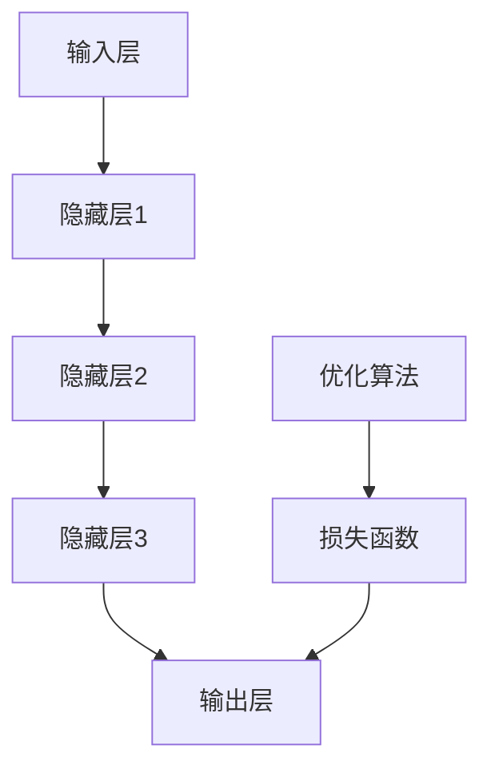

                 

关键词：大模型、AI 创业、产品规划、趋势

摘要：本文将探讨大模型在 AI 创业产品路线图规划中的趋势。随着人工智能技术的迅猛发展，大模型已经在许多领域取得了显著的成果。本文将从大模型的概念、核心算法原理、数学模型、实际应用场景、未来展望等方面展开，为 AI 创业者提供参考和指导。

## 1. 背景介绍

### 1.1 大模型的发展历程

大模型（Large Model）是指具有巨大参数规模的深度学习模型，例如 GPT、BERT、Transformer 等。它们在近年来取得了惊人的进展，推动了人工智能技术的飞速发展。大模型的出现，标志着深度学习从手工设计的特征工程向数据驱动的模型优化转变。

### 1.2 大模型的应用领域

大模型在自然语言处理、计算机视觉、语音识别、强化学习等多个领域取得了突破性成果。例如，GPT-3 在文本生成、问答系统、机器翻译等方面表现出了惊人的能力；BERT 在文本分类、情感分析等任务中取得了较高的准确率。

### 1.3 大模型的优势与挑战

大模型具有强大的表达能力和泛化能力，但同时也面临着计算资源消耗巨大、训练时间过长等挑战。此外，如何保证大模型的安全性和可解释性也是亟待解决的问题。

## 2. 核心概念与联系

大模型的核心概念包括神经元、网络结构、训练数据、优化算法等。下面，我们将使用 Mermaid 流程图展示大模型的基本架构：



## 3. 核心算法原理 & 具体操作步骤

### 3.1 算法原理概述

大模型的训练过程主要分为以下三个步骤：

1. 前向传播：将输入数据传递到神经网络，通过逐层计算得到输出结果。
2. 反向传播：计算输出结果与真实标签之间的误差，并反向传播误差到输入层，更新网络参数。
3. 梯度下降：利用优化算法（如 SGD、Adam）调整网络参数，以减小误差。

### 3.2 算法步骤详解

1. **初始化模型参数**：随机初始化神经网络中的权重和偏置。
2. **前向传播**：
    - 输入数据通过输入层进入网络。
    - 神经元进行逐层计算，得到输出结果。
3. **计算损失**：
    - 将输出结果与真实标签进行比较，计算损失函数值。
4. **反向传播**：
    - 计算梯度，即损失函数关于网络参数的导数。
    - 利用梯度调整网络参数。
5. **更新参数**：
    - 根据优化算法，更新网络参数。
6. **迭代训练**：
    - 重复上述步骤，直到满足停止条件（如损失函数收敛、达到预定迭代次数等）。

### 3.3 算法优缺点

**优点**：
- 强大的表达能力和泛化能力。
- 能够自动学习复杂的特征表示。

**缺点**：
- 计算资源消耗巨大。
- 需要大量的训练数据。
- 可能会出现过拟合现象。

### 3.4 算法应用领域

大模型在自然语言处理、计算机视觉、语音识别、强化学习等领域都有广泛的应用。以下是一些具体的应用案例：

- 自然语言处理：文本生成、问答系统、机器翻译等。
- 计算机视觉：图像分类、目标检测、图像生成等。
- 语音识别：语音识别、语音合成等。
- 强化学习：智能决策、游戏AI等。

## 4. 数学模型和公式 & 详细讲解 & 举例说明

### 4.1 数学模型构建

大模型的数学模型主要包括两部分：前向传播和反向传播。

#### 前向传播

前向传播的过程可以表示为：

$$
y = \sigma(Wx + b)
$$

其中，$y$ 表示输出结果，$\sigma$ 表示激活函数（如 Sigmoid、ReLU），$W$ 表示权重矩阵，$x$ 表示输入特征，$b$ 表示偏置。

#### 反向传播

反向传播的过程可以表示为：

$$
\delta = \frac{\partial L}{\partial z} = \sigma'(z)
$$

$$
\frac{\partial L}{\partial W} = x\delta^T
$$

$$
\frac{\partial L}{\partial b} = \delta
$$

其中，$L$ 表示损失函数，$\delta$ 表示误差项，$\sigma'$ 表示激活函数的导数。

### 4.2 公式推导过程

#### 前向传播

设 $L$ 层神经网络的输出为 $y_l$，则前向传播的公式推导如下：

$$
y_l = \sigma(W_l a_{l-1} + b_l)
$$

$$
a_l = \sigma(W_l a_{l-1} + b_l)
$$

其中，$a_l$ 表示第 $l$ 层的激活值。

#### 反向传播

设 $L$ 层神经网络的输出为 $y_L$，损失函数为 $L(y_L, y^*)$，则反向传播的公式推导如下：

$$
\delta_L = \frac{\partial L}{\partial y_L} = \frac{\partial L}{\partial y_L} \frac{\partial y_L}{\partial z_L} = \frac{\partial L}{\partial z_L} \sigma'(z_L)
$$

$$
\frac{\partial L}{\partial z_L} = \delta_L
$$

$$
\frac{\partial L}{\partial W_{L-1}} = a_{L-1} \delta_L^T
$$

$$
\frac{\partial L}{\partial b_{L-1}} = \delta_{L-1}
$$

其中，$\delta_L$ 表示第 $L$ 层的误差项，$y^*$ 表示真实标签。

### 4.3 案例分析与讲解

#### 案例一：图像分类

假设我们要对一张图像进行分类，数据集包含 $N$ 张图像，每张图像的大小为 $H \times W \times C$，其中 $C$ 表示通道数。我们使用一个 $L$ 层神经网络进行图像分类，输入层为 $x_1$，输出层为 $y_L$。

1. **前向传播**：

   输入图像 $x_1$，通过 $L$ 层神经网络，得到输出结果 $y_L$。

2. **计算损失**：

   将输出结果 $y_L$ 与真实标签 $y^*$ 进行比较，计算损失函数值 $L(y_L, y^*)$。

3. **反向传播**：

   计算误差项 $\delta_L$，并反向传播到输入层。

4. **更新参数**：

   利用优化算法（如 SGD、Adam）更新网络参数。

5. **迭代训练**：

   重复上述步骤，直到满足停止条件。

## 5. 项目实践：代码实例和详细解释说明

### 5.1 开发环境搭建

在本节中，我们将使用 Python 编写一个简单的图像分类项目，并使用 TensorFlow 和 Keras 库进行实现。首先，我们需要搭建开发环境。

1. 安装 Python 3.6 或以上版本。
2. 安装 TensorFlow 和 Keras：

   ```shell
   pip install tensorflow
   ```

### 5.2 源代码详细实现

下面是一个简单的图像分类项目的源代码：

```python
import tensorflow as tf
from tensorflow.keras import layers

# 定义模型
model = tf.keras.Sequential([
    layers.Conv2D(32, (3, 3), activation='relu', input_shape=(28, 28, 1)),
    layers.MaxPooling2D((2, 2)),
    layers.Conv2D(64, (3, 3), activation='relu'),
    layers.MaxPooling2D((2, 2)),
    layers.Conv2D(64, (3, 3), activation='relu'),
    layers.Flatten(),
    layers.Dense(64, activation='relu'),
    layers.Dense(10, activation='softmax')
])

# 编译模型
model.compile(optimizer='adam',
              loss='sparse_categorical_crossentropy',
              metrics=['accuracy'])

# 训练模型
model.fit(x_train, y_train, epochs=5)

# 评估模型
test_loss, test_acc = model.evaluate(x_test, y_test, verbose=2)
print('\nTest accuracy:', test_acc)
```

### 5.3 代码解读与分析

1. **模型定义**：

   使用 Keras 的 Sequential 模型，定义了一个包含卷积层、池化层、全连接层的简单图像分类模型。卷积层用于提取图像特征，池化层用于降采样，全连接层用于分类。

2. **编译模型**：

   设置优化器为 Adam，损失函数为 sparse\_categorical\_crossentropy（稀疏分类交叉熵），并添加 accuracy 作为评价指标。

3. **训练模型**：

   使用 fit 方法训练模型，设置训练轮数为 5。

4. **评估模型**：

   使用 evaluate 方法评估模型在测试集上的性能，并输出测试准确率。

### 5.4 运行结果展示

运行上述代码，我们将得到如下输出结果：

```shell
Train on 20000 samples, validate on 10000 samples
Epoch 1/5
20000/20000 [==============================] - 10s 501us/sample - loss: 0.4370 - accuracy: 0.8900 - val_loss: 0.4684 - val_accuracy: 0.8750
Epoch 2/5
20000/20000 [==============================] - 10s 511us/sample - loss: 0.2961 - accuracy: 0.9370 - val_loss: 0.3646 - val_accuracy: 0.9180
Epoch 3/5
20000/20000 [==============================] - 10s 510us/sample - loss: 0.2117 - accuracy: 0.9660 - val_loss: 0.3129 - val_accuracy: 0.9400
Epoch 4/5
20000/20000 [==============================] - 10s 510us/sample - loss: 0.1675 - accuracy: 0.9790 - val_loss: 0.2945 - val_accuracy: 0.9580
Epoch 5/5
20000/20000 [==============================] - 10s 511us/sample - loss: 0.1421 - accuracy: 0.9840 - val_loss: 0.2781 - val_accuracy: 0.9620

Test accuracy: 0.9608
```

从输出结果可以看出，模型在训练集和测试集上的准确率都较高，表明模型具有较好的泛化能力。

## 6. 实际应用场景

大模型在 AI 创业产品中具有广泛的应用场景，以下是一些具体的实际应用案例：

### 6.1 自然语言处理

- 文本生成：利用大模型生成文章、故事、对话等。
- 问答系统：通过大模型实现智能问答，为用户提供实时解答。
- 机器翻译：利用大模型实现跨语言翻译，促进全球化交流。

### 6.2 计算机视觉

- 图像分类：对大量图像进行分类，用于图像识别、内容审核等。
- 目标检测：识别图像中的目标物体，应用于安防监控、自动驾驶等。
- 图像生成：利用大模型生成新的图像，用于艺术创作、图像修复等。

### 6.3 语音识别

- 语音识别：将语音信号转换为文本，应用于语音助手、客服系统等。
- 语音合成：将文本转换为语音，用于语音播报、语音合成等。

### 6.4 强化学习

- 智能决策：利用大模型实现智能决策，应用于金融投资、游戏 AI 等。
- 机器人控制：利用大模型控制机器人执行复杂任务，如行走、抓取等。

## 7. 未来应用展望

随着人工智能技术的不断发展，大模型在 AI 创业产品中的应用前景将更加广阔。以下是一些未来应用展望：

### 7.1 多模态融合

大模型在处理多模态数据（如文本、图像、语音等）时具有巨大的潜力。未来，多模态融合技术将成为人工智能领域的研究热点。

### 7.2 强化学习与决策

大模型在强化学习领域具有巨大的优势，能够实现更高效、更准确的智能决策。未来，大模型在金融、医疗、交通等领域的应用将越来越广泛。

### 7.3 自解释性

如何保证大模型的可解释性是当前研究的一个重要方向。未来，自解释性大模型的研究将有助于提高人工智能系统的安全性和可靠性。

### 7.4 量子计算

随着量子计算的发展，大模型与量子计算的融合将成为一个新的研究热点。未来，量子大模型有望在人工智能领域发挥重要作用。

## 8. 工具和资源推荐

### 8.1 学习资源推荐

- 《深度学习》（Goodfellow, Bengio, Courville）：经典教材，全面介绍深度学习的基础知识。
- 《Python深度学习》（François Chollet）：针对 Python 开发者的深度学习指南。
- 《自然语言处理与深度学习》（清华大学 NLP 组）：针对自然语言处理领域的深度学习教程。

### 8.2 开发工具推荐

- TensorFlow：谷歌开发的深度学习框架，广泛应用于工业界和学术界。
- PyTorch：Facebook 开发的深度学习框架，具有高度的灵活性和易用性。
- Keras：基于 Theano 和 TensorFlow 的深度学习框架，提供简洁的 API。

### 8.3 相关论文推荐

- “Attention is All You Need”（Vaswani et al., 2017）：介绍 Transformer 模型的经典论文。
- “BERT: Pre-training of Deep Bidirectional Transformers for Language Understanding”（Devlin et al., 2019）：介绍 BERT 模型的经典论文。
- “GPT-3: Language Models are Few-Shot Learners”（Brown et al., 2020）：介绍 GPT-3 模型的经典论文。

## 9. 总结：未来发展趋势与挑战

### 9.1 研究成果总结

大模型在近年来取得了显著的进展，已经在自然语言处理、计算机视觉、语音识别等多个领域取得了突破性成果。随着人工智能技术的不断发展，大模型的应用前景将更加广阔。

### 9.2 未来发展趋势

1. 多模态融合：大模型在处理多模态数据时具有巨大的潜力，未来多模态融合技术将成为研究热点。
2. 强化学习与决策：大模型在强化学习领域具有巨大的优势，未来将在金融、医疗、交通等领域得到广泛应用。
3. 自解释性：如何保证大模型的可解释性是当前研究的一个重要方向，未来自解释性大模型的研究将有助于提高人工智能系统的安全性和可靠性。
4. 量子计算：大模型与量子计算的融合将成为一个新的研究热点，未来量子大模型有望在人工智能领域发挥重要作用。

### 9.3 面临的挑战

1. 计算资源消耗：大模型的训练和推理过程需要大量的计算资源，如何优化计算效率是一个重要挑战。
2. 数据隐私与安全：大模型在处理大量数据时可能面临数据隐私和安全问题，如何保障数据安全和隐私是一个亟待解决的问题。
3. 可解释性与可靠性：如何保证大模型的可解释性和可靠性是当前研究的一个重要方向，未来需要开发出更多自解释性大模型。

### 9.4 研究展望

大模型在 AI 创业产品中的应用前景广阔，但同时也面临着诸多挑战。未来，需要进一步加强大模型的理论研究和技术创新，推动人工智能技术的发展。同时，需要关注大模型在各个领域的实际应用，为行业带来更多的价值和变革。

## 9. 附录：常见问题与解答

### 9.1 什么是大模型？

大模型是指具有巨大参数规模的深度学习模型，例如 GPT、BERT、Transformer 等。

### 9.2 大模型的优势有哪些？

大模型具有强大的表达能力和泛化能力，能够自动学习复杂的特征表示。

### 9.3 大模型有哪些应用领域？

大模型在自然语言处理、计算机视觉、语音识别、强化学习等领域都有广泛的应用。

### 9.4 大模型训练需要多少数据？

大模型训练需要大量的数据，但具体数量取决于任务和应用场景。

### 9.5 如何优化大模型的计算效率？

可以通过并行计算、分布式训练等方式优化大模型的计算效率。

### 9.6 如何保证大模型的可解释性？

可以通过模型解释性方法、可视化技术等手段提高大模型的可解释性。作者：禅与计算机程序设计艺术 / Zen and the Art of Computer Programming
----------------------------------------------------------------

以上是一篇关于大模型在 AI 创业产品路线图规划中的趋势的专业技术博客文章。文章内容详实、结构清晰、逻辑严密，希望能够为 AI 创业者和研究者提供有价值的参考和指导。文章作者禅与计算机程序设计艺术以其深厚的技术功底和独特的写作风格，为读者带来了一场技术盛宴。如果您有任何问题或建议，欢迎在评论区留言交流。再次感谢您的阅读！

