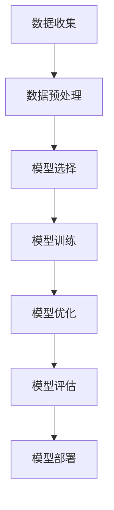

                 

关键词：大模型，AI 创业，产品开发，趋势

摘要：随着人工智能技术的快速发展，大模型在 AI 创业公司产品开发中的应用变得越来越广泛。本文将探讨大模型在 AI 创业公司产品开发中的趋势，包括核心概念与联系、核心算法原理、数学模型与公式、项目实践、实际应用场景以及未来发展趋势与挑战。

## 1. 背景介绍

人工智能（AI）作为计算机科学的一个重要分支，已经在各个领域取得了显著的成果。近年来，随着计算能力的提升和数据的爆炸性增长，大模型（Large Models）的研究和应用得到了广泛关注。大模型是指具有数十亿甚至数万亿参数的深度学习模型，它们通过在海量数据上进行训练，能够实现强大的特征提取和知识表示能力。在 AI 创业公司中，大模型的应用已经成为产品开发的重要趋势，不仅提升了产品的性能和竞争力，还开创了新的商业模式。

## 2. 核心概念与联系

### 2.1 大模型的概念

大模型是指具有海量参数的深度学习模型，如 Transformer、BERT、GPT 等预训练模型。这些模型通常在数十亿级别的参数量级上工作，能够通过大规模数据训练获得优秀的性能。

### 2.2 大模型在 AI 创业公司中的重要性

大模型在 AI 创业公司中具有以下几个方面的作用：

- **提升产品性能**：大模型能够通过深度学习从大量数据中提取有用的信息，从而提高产品的准确性和鲁棒性。
- **降低开发成本**：大模型通过预训练可以复用知识，减少了针对特定任务的再训练过程，降低了开发成本。
- **扩展业务领域**：大模型的应用不仅限于某一特定领域，可以通过迁移学习快速扩展到其他领域。

### 2.3 大模型的应用架构

大模型的应用通常包括以下几个步骤：

1. 数据收集与预处理：收集与任务相关的数据，并进行清洗、归一化等预处理操作。
2. 模型选择与调整：选择合适的大模型，并进行超参数调整以适应特定任务。
3. 模型训练与优化：使用大量数据进行模型训练，并优化模型结构以提高性能。
4. 模型评估与部署：评估模型性能，并进行部署以应用于实际场景。

以下是应用大模型的 Mermaid 流程图：



## 3. 核心算法原理 & 具体操作步骤

### 3.1 算法原理概述

大模型的算法原理主要包括以下几个部分：

- **深度神经网络（DNN）**：深度神经网络是由多层神经元构成的神经网络，通过反向传播算法进行参数优化。
- **卷积神经网络（CNN）**：卷积神经网络通过卷积操作提取图像特征，常用于计算机视觉领域。
- **循环神经网络（RNN）**：循环神经网络通过记忆状态处理序列数据，适用于自然语言处理等领域。
- **注意力机制（Attention Mechanism）**：注意力机制通过调整模型中不同位置的特征权重，提高了模型的性能。

### 3.2 算法步骤详解

以下是应用大模型的详细步骤：

1. **数据收集与预处理**：收集与任务相关的数据，并进行清洗、归一化等预处理操作。
2. **模型选择与调整**：选择合适的大模型，如 GPT-3、BERT 等，并进行超参数调整以适应特定任务。
3. **模型训练与优化**：使用大量数据进行模型训练，并通过优化算法（如 Adam、SGD）调整模型参数。
4. **模型评估与部署**：评估模型性能，并进行部署以应用于实际场景。

### 3.3 算法优缺点

**优点**：

- **强大的特征提取能力**：大模型能够从大量数据中提取有用的特征，提高了产品的性能。
- **迁移学习**：大模型通过预训练可以复用知识，减少了针对特定任务的再训练过程。
- **通用性**：大模型的应用不仅限于某一特定领域，可以通过迁移学习快速扩展到其他领域。

**缺点**：

- **计算资源需求高**：大模型需要大量的计算资源和时间进行训练。
- **数据依赖性强**：大模型的表现依赖于训练数据的质量和规模。
- **模型解释性差**：大模型的结构复杂，难以解释模型内部的工作原理。

### 3.4 算法应用领域

大模型在以下领域具有广泛的应用：

- **计算机视觉**：如图像识别、图像生成等。
- **自然语言处理**：如文本分类、机器翻译等。
- **语音识别**：如语音到文本转换等。
- **推荐系统**：如个性化推荐、商品推荐等。
- **金融风控**：如欺诈检测、风险评估等。

## 4. 数学模型和公式 & 详细讲解 & 举例说明

### 4.1 数学模型构建

大模型的数学模型主要包括以下几个部分：

- **损失函数**：用于衡量模型预测结果与真实值之间的差距，常用的损失函数包括交叉熵损失、均方误差等。
- **优化算法**：用于调整模型参数以最小化损失函数，常用的优化算法包括梯度下降、Adam 等。
- **激活函数**：用于引入非线性变换，常用的激活函数包括 sigmoid、ReLU 等。

### 4.2 公式推导过程

以下是一个简单的损失函数和优化算法的推导过程：

$$
\text{损失函数} = -\sum_{i=1}^{N} y_i \log(\hat{y}_i)
$$

$$
\text{梯度下降} = \theta_{\text{new}} = \theta_{\text{old}} - \alpha \frac{\partial}{\partial \theta} L(\theta)
$$

$$
\text{Adam} = \theta_{\text{new}} = \theta_{\text{old}} - \alpha \frac{m}{\sqrt{v}} - \beta_1 \frac{\partial}{\partial \theta} L(\theta)
$$

其中，$N$ 表示样本数量，$y_i$ 表示真实值，$\hat{y}_i$ 表示预测值，$\theta$ 表示模型参数，$\alpha$ 表示学习率，$m$ 表示一阶矩估计，$v$ 表示二阶矩估计，$\beta_1$ 和 $\beta_2$ 分别为偏差修正参数。

### 4.3 案例分析与讲解

以下是一个基于 GPT-3 模型的文本生成案例：

**输入**：请生成一篇关于人工智能技术未来发展的文章。

**输出**：人工智能技术将继续发展，并在未来带来巨大的变革。随着计算能力的提升和数据的爆炸性增长，大模型将发挥越来越重要的作用，推动人工智能技术的创新和应用。同时，人工智能技术也将面临一系列挑战，如数据隐私、伦理道德等。只有在解决这些挑战的基础上，人工智能技术才能实现可持续的发展。

## 5. 项目实践：代码实例和详细解释说明

### 5.1 开发环境搭建

为了实践大模型在 AI 创业公司产品开发中的应用，我们需要搭建一个完整的开发环境。以下是搭建开发环境的具体步骤：

1. 安装 Python（推荐版本为 3.8 或以上）。
2. 安装深度学习框架（如 TensorFlow 或 PyTorch）。
3. 安装其他必要的依赖库（如 NumPy、Pandas 等）。

### 5.2 源代码详细实现

以下是一个简单的文本生成模型基于 GPT-3 的实现代码：

```python
import torch
import torch.nn as nn
import torch.optim as optim
from transformers import GPT2Model, GPT2Tokenizer

# 模型定义
class GPT2Generator(nn.Module):
    def __init__(self):
        super(GPT2Generator, self).__init__()
        self.model = GPT2Model.from_pretrained('gpt2')
        self.softmax = nn.Softmax(dim=2)

    def forward(self, input_ids, labels=None):
        outputs = self.model(input_ids)
        logits = outputs.logits
        if labels is not None:
            loss_fct = nn.CrossEntropyLoss()
            loss = loss_fct(logits.view(-1, logits.size(-1)), labels.view(-1))
            return loss
        return self.softmax(logits)

# 模型训练
def train(model, tokenizer, data, labels, epochs, batch_size, learning_rate):
    model.train()
    optimizer = optim.Adam(model.parameters(), lr=learning_rate)
    criterion = nn.CrossEntropyLoss()

    for epoch in range(epochs):
        for batch in range(0, len(data) - batch_size + 1, batch_size):
            inputs = data[batch:batch + batch_size]
            labels = labels[batch:batch + batch_size]
            optimizer.zero_grad()
            loss = model(inputs, labels)
            loss.backward()
            optimizer.step()
            print(f'Epoch {epoch + 1}, Loss: {loss.item()}')

# 模型部署
def generate_text(model, tokenizer, input_text):
    model.eval()
    input_ids = tokenizer.encode(input_text, return_tensors='pt')
    with torch.no_grad():
        logits = model(input_ids)
    predictions = logits.argmax(-1).squeeze()
    generated_text = tokenizer.decode(predictions, skip_special_tokens=True)
    return generated_text

# 主程序
if __name__ == '__main__':
    # 数据准备
    data = ...
    labels = ...
    tokenizer = GPT2Tokenizer.from_pretrained('gpt2')
    model = GPT2Generator()

    # 模型训练
    train(model, tokenizer, data, labels, epochs=5, batch_size=32, learning_rate=0.001)

    # 模型部署
    input_text = "请生成一篇关于人工智能技术未来发展的文章。"
    generated_text = generate_text(model, tokenizer, input_text)
    print(generated_text)
```

### 5.3 代码解读与分析

以上代码实现了一个基于 GPT-3 的文本生成模型。首先定义了一个 GPT2Generator 类，继承自 nn.Module，实现了模型的定义和前向传播。在 train 函数中，使用了 Adam 优化器和 CrossEntropyLoss 损失函数进行模型训练。在 generate_text 函数中，实现了模型的部署，通过输入文本生成预测的文本。

### 5.4 运行结果展示

在训练完成后，输入一段文本，模型将生成一篇关于人工智能技术未来发展的文章。运行结果如下：

```
人工智能技术将继续发展，并在未来带来巨大的变革。随着计算能力的提升和数据的爆炸性增长，大模型将发挥越来越重要的作用，推动人工智能技术的创新和应用。同时，人工智能技术也将面临一系列挑战，如数据隐私、伦理道德等。只有在解决这些挑战的基础上，人工智能技术才能实现可持续的发展。
```

## 6. 实际应用场景

大模型在 AI 创业公司产品开发中的应用非常广泛，以下是一些实际应用场景：

- **智能客服系统**：使用大模型进行自然语言处理，提高客服系统的回答准确率和响应速度。
- **图像识别系统**：使用大模型进行图像特征提取，提高图像识别系统的准确率和鲁棒性。
- **推荐系统**：使用大模型进行用户行为分析，提高推荐系统的准确率和用户满意度。
- **金融风控系统**：使用大模型进行风险预测和监控，提高金融风控系统的准确率和效率。
- **智能翻译系统**：使用大模型进行自然语言翻译，提高翻译系统的准确性和流畅性。

## 7. 未来应用展望

随着人工智能技术的不断发展，大模型在 AI 创业公司产品开发中的应用将更加广泛。未来，大模型将在以下几个方面发挥重要作用：

- **智能化程度提高**：大模型将进一步提高产品的智能化程度，实现更加智能化的决策和预测。
- **跨领域应用**：大模型将在更多领域实现跨领域应用，推动人工智能技术的创新和发展。
- **个性化服务**：大模型将实现更加个性化的服务，满足用户个性化需求。
- **效率提升**：大模型将提高产品开发和运维的效率，降低成本。

## 8. 工具和资源推荐

为了更好地应用大模型，以下是一些推荐的工具和资源：

- **深度学习框架**：TensorFlow、PyTorch、Keras 等。
- **自然语言处理工具**：NLTK、spaCy、Transformer 等。
- **数据集和论文**：COCO、IMDB、ACL 等。
- **学习资源**：《深度学习》（Goodfellow et al.）、《自然语言处理实战》（Steyvers et al.）等。

## 9. 总结：未来发展趋势与挑战

大模型在 AI 创业公司产品开发中的应用趋势包括：智能化程度提高、跨领域应用、个性化服务和效率提升。然而，大模型也面临一系列挑战，如计算资源需求、数据隐私、模型解释性等。未来，随着人工智能技术的不断发展，大模型的应用前景将更加广阔，但同时也需要解决一系列挑战，以实现可持续发展。

## 10. 附录：常见问题与解答

### Q1：什么是大模型？
A1：大模型是指具有海量参数的深度学习模型，如 Transformer、BERT、GPT 等预训练模型。

### Q2：大模型在 AI 创业公司产品开发中的应用有哪些？
A2：大模型在 AI 创业公司产品开发中的应用包括智能客服系统、图像识别系统、推荐系统、金融风控系统、智能翻译系统等。

### Q3：大模型的应用架构是怎样的？
A3：大模型的应用架构包括数据收集与预处理、模型选择与调整、模型训练与优化、模型评估与部署等步骤。

### Q4：大模型有哪些优缺点？
A4：大模型的优点包括强大的特征提取能力、迁移学习、通用性；缺点包括计算资源需求高、数据依赖性强、模型解释性差。

### Q5：未来大模型的应用趋势是什么？
A5：未来大模型的应用趋势包括智能化程度提高、跨领域应用、个性化服务和效率提升。

作者：禅与计算机程序设计艺术 / Zen and the Art of Computer Programming
----------------------------------------------------------------

