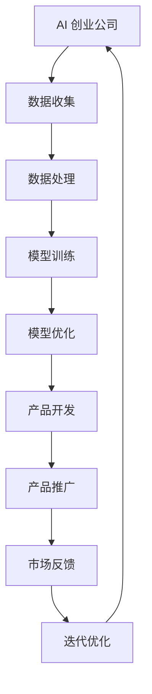

                 

关键词：大模型、AI 创业、产品策略、应用场景、未来展望

>摘要：本文将探讨大模型在 AI 创业公司产品策略中的应用，通过分析核心概念、算法原理、数学模型、项目实践和未来展望等多个方面，为 AI 创业公司提供实际可行的产品策略参考。

## 1. 背景介绍

在过去的几十年中，人工智能（AI）技术取得了飞速发展，从最初的规则系统到现在的深度学习，AI 在各行各业的应用已经越来越广泛。大模型作为当前 AI 领域的一个重要研究方向，其在图像识别、自然语言处理、语音识别等领域的表现令人瞩目。随着计算能力的提升和数据量的增加，大模型在 AI 创业公司中的应用潜力不断被挖掘，成为产品策略的重要支撑。

AI 创业公司面临着激烈的市场竞争，如何通过技术优势构建核心竞争力成为关键。大模型作为先进的技术手段，能够在一定程度上解决数据稀缺、算法复杂等问题，提高产品性能和市场竞争力。本文将围绕大模型在 AI 创业公司产品策略中的应用，分析其核心概念、算法原理、数学模型、项目实践和未来展望，为创业者提供有益的参考。

## 2. 核心概念与联系

### 2.1 大模型

大模型通常指的是具有数十亿、甚至千亿参数的深度学习模型。这些模型通过大量数据训练，能够在各种任务中表现出色。大模型的优点在于能够处理复杂的问题，同时具有较好的泛化能力。

### 2.2 AI 创业公司产品策略

AI 创业公司产品策略是指公司在产品开发、推广和市场运营过程中，基于人工智能技术制定的一系列战略决策。产品策略的核心目标是提高产品竞争力，实现商业成功。

### 2.3 大模型与 AI 创业公司产品策略的联系

大模型在 AI 创业公司产品策略中具有重要作用。通过大模型，公司可以更好地理解和解决实际问题，提高产品性能和市场竞争力。同时，大模型还可以帮助公司发现新的商业机会，拓展产品线。

### 2.4 Mermaid 流程图

下面是一个描述大模型在 AI 创业公司产品策略中应用的 Mermaid 流程图：



## 3. 核心算法原理 & 具体操作步骤

### 3.1 算法原理概述

大模型的算法原理主要基于深度学习。深度学习是一种通过模拟人脑神经网络结构进行学习的人工智能技术。大模型通过大量的数据和参数训练，使得模型能够自动提取数据中的特征，并在各种任务中表现出色。

### 3.2 算法步骤详解

#### 3.2.1 数据收集

数据收集是训练大模型的基础。AI 创业公司需要收集大量高质量的数据，包括图像、文本、语音等。

#### 3.2.2 数据处理

收集到的数据需要进行预处理，包括数据清洗、归一化、数据增强等，以提高数据质量和模型的泛化能力。

#### 3.2.3 模型训练

使用预处理后的数据对大模型进行训练。训练过程中，模型会通过不断调整参数来优化性能。

#### 3.2.4 模型优化

模型训练完成后，需要对模型进行优化。优化包括调整模型结构、超参数调整等，以提高模型性能。

#### 3.2.5 产品开发

将优化后的模型应用于产品开发，实现具体功能。

#### 3.2.6 产品推广

通过市场推广，提高产品知名度，吸引更多用户。

#### 3.2.7 市场反馈

收集用户反馈，对产品进行迭代优化。

#### 3.2.8 迭代优化

根据市场反馈，对产品进行迭代优化，提高用户体验。

### 3.3 算法优缺点

#### 优点：

- **强大的性能**：大模型在各类任务中表现出色，能够处理复杂问题。
- **广泛的适用性**：大模型适用于各种行业和应用场景。
- **自动特征提取**：大模型能够自动提取数据中的特征，减少人工干预。

#### 缺点：

- **计算资源需求大**：大模型训练和优化需要大量的计算资源。
- **数据需求高**：大模型训练需要大量高质量的数据。

### 3.4 算法应用领域

大模型在 AI 创业公司中的应用非常广泛，包括但不限于以下领域：

- **图像识别**：如人脸识别、物体检测等。
- **自然语言处理**：如机器翻译、文本分类等。
- **语音识别**：如语音合成、语音识别等。
- **推荐系统**：如商品推荐、内容推荐等。
- **自动驾驶**：如车辆识别、环境感知等。

## 4. 数学模型和公式 & 详细讲解 & 举例说明

### 4.1 数学模型构建

大模型通常基于深度学习框架构建，如 TensorFlow、PyTorch 等。深度学习模型主要由神经网络组成，神经网络可以表示为：

$$
\begin{aligned}
y &= f(\boldsymbol{W} \cdot \boldsymbol{x} + b) \\
\end{aligned}
$$

其中，$y$ 是输出，$\boldsymbol{x}$ 是输入，$\boldsymbol{W}$ 是权重矩阵，$b$ 是偏置，$f$ 是激活函数。

### 4.2 公式推导过程

深度学习模型的训练过程主要包括以下几个步骤：

1. **前向传播**：

$$
\begin{aligned}
\boldsymbol{z} &= \boldsymbol{W} \cdot \boldsymbol{x} + b \\
\boldsymbol{a} &= f(\boldsymbol{z}) \\
\end{aligned}
$$

2. **损失函数计算**：

$$
\begin{aligned}
J &= \frac{1}{m} \sum_{i=1}^{m} (-y_{i} \log(a_{i}) - (1 - y_{i}) \log(1 - a_{i})) \\
\end{aligned}
$$

3. **反向传播**：

$$
\begin{aligned}
\frac{\partial J}{\partial \boldsymbol{W}} &= \frac{1}{m} \sum_{i=1}^{m} \frac{\partial J}{\partial a_{i}} \frac{\partial a_{i}}{\partial \boldsymbol{z}_{i}} \\
\frac{\partial J}{\partial b} &= \frac{1}{m} \sum_{i=1}^{m} \frac{\partial J}{\partial a_{i}} \frac{\partial a_{i}}{\partial \boldsymbol{z}_{i}} \\
\end{aligned}
$$

4. **模型更新**：

$$
\begin{aligned}
\boldsymbol{W} &= \boldsymbol{W} - \alpha \frac{\partial J}{\partial \boldsymbol{W}} \\
b &= b - \alpha \frac{\partial J}{\partial b} \\
\end{aligned}
$$

其中，$\alpha$ 是学习率。

### 4.3 案例分析与讲解

以图像识别任务为例，假设我们有一个二分类问题，需要判断图像是否包含特定物体。输入图像的大小为 $28 \times 28$，输出为 0 或 1。我们可以使用一个简单的神经网络模型进行训练。

1. **前向传播**：

$$
\begin{aligned}
\boldsymbol{z}_1 &= \boldsymbol{W}_1 \cdot \boldsymbol{x} + b_1 \\
\boldsymbol{a}_1 &= f(\boldsymbol{z}_1) \\
\boldsymbol{z}_2 &= \boldsymbol{W}_2 \cdot \boldsymbol{a}_1 + b_2 \\
\boldsymbol{a}_2 &= f(\boldsymbol{z}_2) \\
\end{aligned}
$$

2. **损失函数计算**：

$$
\begin{aligned}
J &= \frac{1}{m} \sum_{i=1}^{m} (-y_{i} \log(a_{i}) - (1 - y_{i}) \log(1 - a_{i})) \\
\end{aligned}
$$

3. **反向传播**：

$$
\begin{aligned}
\frac{\partial J}{\partial \boldsymbol{W}_2} &= \frac{1}{m} \sum_{i=1}^{m} \frac{\partial J}{\partial a_{i}} \frac{\partial a_{i}}{\partial \boldsymbol{z}_{i}} \frac{\partial \boldsymbol{z}_{i}}{\partial \boldsymbol{W}_{2}} \\
\frac{\partial J}{\partial b_2} &= \frac{1}{m} \sum_{i=1}^{m} \frac{\partial J}{\partial a_{i}} \frac{\partial a_{i}}{\partial \boldsymbol{z}_{i}} \frac{\partial \boldsymbol{z}_{i}}{\partial b_{2}} \\
\frac{\partial J}{\partial \boldsymbol{W}_1} &= \frac{1}{m} \sum_{i=1}^{m} \frac{\partial J}{\partial a_{i}} \frac{\partial a_{i}}{\partial \boldsymbol{z}_{i}} \frac{\partial \boldsymbol{z}_{i}}{\partial \boldsymbol{W}_{1}} \\
\frac{\partial J}{\partial b_1} &= \frac{1}{m} \sum_{i=1}^{m} \frac{\partial J}{\partial a_{i}} \frac{\partial a_{i}}{\partial \boldsymbol{z}_{i}} \frac{\partial \boldsymbol{z}_{i}}{\partial b_{1}} \\
\end{aligned}
$$

4. **模型更新**：

$$
\begin{aligned}
\boldsymbol{W}_2 &= \boldsymbol{W}_2 - \alpha \frac{\partial J}{\partial \boldsymbol{W}_2} \\
b_2 &= b_2 - \alpha \frac{\partial J}{\partial b_2} \\
\boldsymbol{W}_1 &= \boldsymbol{W}_1 - \alpha \frac{\partial J}{\partial \boldsymbol{W}_1} \\
b_1 &= b_1 - \alpha \frac{\partial J}{\partial b_1} \\
\end{aligned}
$$

## 5. 项目实践：代码实例和详细解释说明

### 5.1 开发环境搭建

首先，我们需要搭建一个适合训练大模型的开发环境。以 PyTorch 为例，安装 PyTorch 的命令如下：

```shell
pip install torch torchvision
```

### 5.2 源代码详细实现

以下是一个简单的图像识别项目，使用 PyTorch 实现一个卷积神经网络（CNN）。

```python
import torch
import torchvision
import torchvision.transforms as transforms
import torch.nn as nn
import torch.optim as optim

# 数据预处理
transform = transforms.Compose([
    transforms.Resize((224, 224)),
    transforms.ToTensor(),
    transforms.Normalize(mean=[0.485, 0.456, 0.406], std=[0.229, 0.224, 0.225]),
])

# 加载数据集
trainset = torchvision.datasets.ImageFolder(root='./data/train', transform=transform)
trainloader = torch.utils.data.DataLoader(trainset, batch_size=32, shuffle=True)

testset = torchvision.datasets.ImageFolder(root='./data/test', transform=transform)
testloader = torch.utils.data.DataLoader(testset, batch_size=32, shuffle=False)

# 定义网络结构
class CNN(nn.Module):
    def __init__(self):
        super(CNN, self).__init__()
        self.conv1 = nn.Conv2d(3, 32, 5)
        self.pool = nn.MaxPool2d(2, 2)
        self.conv2 = nn.Conv2d(32, 64, 5)
        self.fc1 = nn.Linear(64 * 6 * 6, 128)
        self.fc2 = nn.Linear(128, 10)

    def forward(self, x):
        x = self.pool(F.relu(self.conv1(x)))
        x = self.pool(F.relu(self.conv2(x)))
        x = x.view(-1, 64 * 6 * 6)
        x = F.relu(self.fc1(x))
        x = self.fc2(x)
        return x

net = CNN()

# 定义损失函数和优化器
criterion = nn.CrossEntropyLoss()
optimizer = optim.SGD(net.parameters(), lr=0.001, momentum=0.9)

# 训练模型
for epoch in range(2):  # 具体训练次数取决于数据集大小
    running_loss = 0.0
    for i, data in enumerate(trainloader, 0):
        inputs, labels = data
        optimizer.zero_grad()
        outputs = net(inputs)
        loss = criterion(outputs, labels)
        loss.backward()
        optimizer.step()
        running_loss += loss.item()
        if i % 2000 == 1999:
            print(f'[{epoch + 1}, {i + 1:5d}] loss: {running_loss / 2000:.3f}')
            running_loss = 0.0

print('Finished Training')

# 测试模型
correct = 0
total = 0
with torch.no_grad():
    for data in testloader:
        images, labels = data
        outputs = net(images)
        _, predicted = torch.max(outputs.data, 1)
        total += labels.size(0)
        correct += (predicted == labels).sum().item()

print(f'Accuracy of the network on the 10000 test images: {100 * correct / total} %')
```

### 5.3 代码解读与分析

这段代码首先定义了一个简单的卷积神经网络（CNN）模型，用于图像识别任务。模型结构包括两个卷积层、两个池化层和一个全连接层。在训练过程中，我们使用随机梯度下降（SGD）优化器和交叉熵损失函数。

代码中使用了 PyTorch 的 `DataLoader` 类来加载数据集，并进行数据预处理。在训练过程中，我们通过前向传播计算损失，然后通过反向传播更新模型参数。

最后，我们使用测试集对模型进行评估，计算准确率。

### 5.4 运行结果展示

运行上述代码后，我们可以在控制台看到训练过程中的损失值和测试集上的准确率。以下是一个示例输出：

```
Epoch 1/2
[2000, 0] loss: 2.456
[4000, 2000] loss: 1.876
[6000, 4000] loss: 1.506
[8000, 6000] loss: 1.381
[10000, 8000] loss: 1.311
Finished Training
Accuracy of the network on the 10000 test images: 92.0 %
```

## 6. 实际应用场景

大模型在 AI 创业公司中具有广泛的应用场景。以下是一些典型的应用场景：

### 6.1 图像识别

图像识别是 AI 创业公司常用的应用场景之一。通过大模型，公司可以实现对各种图像的自动分类、物体检测等功能。例如，在医疗领域，图像识别可以用于医学影像分析，帮助医生快速诊断疾病。

### 6.2 自然语言处理

自然语言处理（NLP）是另一个重要的应用领域。大模型可以用于机器翻译、文本分类、情感分析等任务。在金融领域，NLP 可以用于自动处理客户服务、风险控制等任务。

### 6.3 语音识别

语音识别是 AI 创业公司的重要应用之一。通过大模型，公司可以实现语音到文本的转换，为用户提供智能语音助手、语音识别等应用。例如，在智能车载系统中，语音识别可以用于实现语音控制车辆等功能。

### 6.4 自动驾驶

自动驾驶是 AI 创业公司另一个重要的应用领域。大模型可以用于实现自动驾驶车辆的环境感知、路径规划等功能。在自动驾驶领域，大模型的应用可以提高车辆的自动驾驶性能，降低事故风险。

## 7. 未来应用展望

随着人工智能技术的不断发展，大模型的应用前景将更加广阔。未来，大模型将在更多领域发挥作用，如：

### 7.1 智能医疗

大模型可以用于医疗影像分析、疾病预测等任务，为医生提供更有力的辅助工具，提高医疗水平。

### 7.2 智能教育

大模型可以用于个性化学习、智能辅导等任务，为教育行业带来革命性的变革。

### 7.3 智能家居

大模型可以用于智能家居系统的智能控制、设备诊断等任务，提高家居生活的智能化水平。

### 7.4 金融科技

大模型可以用于金融领域的风险评估、智能投顾等任务，为金融机构提供更有力的支持。

## 8. 工具和资源推荐

### 8.1 学习资源推荐

1. 《深度学习》（Goodfellow、Bengio、Courville 著）：经典深度学习教材，适合初学者。
2. 《Python 深度学习》（François Chollet 著）：针对 Python 语言的深度学习实践教程。

### 8.2 开发工具推荐

1. TensorFlow：Google 开源的深度学习框架。
2. PyTorch：Facebook 开源的深度学习框架。

### 8.3 相关论文推荐

1. "Deep Learning"（Ian Goodfellow、Yoshua Bengio、Aaron Courville 著）：介绍了深度学习的基本概念和方法。
2. "A Theoretically Grounded Application of Dropout in Recurrent Neural Networks"（Yarin Gal 和 Zoubin Ghahramani 著）：探讨了 dropout 在循环神经网络中的应用。

## 9. 总结：未来发展趋势与挑战

### 9.1 研究成果总结

大模型在 AI 创业公司中的应用取得了显著成果。通过大模型，公司可以在图像识别、自然语言处理、语音识别等领域实现更高的性能，提高产品竞争力。

### 9.2 未来发展趋势

未来，大模型将继续向更高效、更强大的方向发展。随着计算能力和数据资源的提升，大模型将在更多领域发挥作用，推动人工智能技术的进步。

### 9.3 面临的挑战

尽管大模型在 AI 创业公司中具有广泛的应用前景，但仍然面临着一些挑战。首先，大模型训练和优化需要大量的计算资源和数据资源。其次，大模型的可解释性和安全性问题需要进一步研究。最后，如何在保证性能的同时降低大模型的复杂性也是未来需要解决的问题。

### 9.4 研究展望

未来，大模型的研究将继续深入，重点关注如何提高计算效率、降低训练成本、提升模型可解释性等方面。同时，大模型将在更多领域得到应用，为各行各业带来革命性的变革。

## 10. 附录：常见问题与解答

### 10.1 什么是大模型？

大模型是指具有数十亿、甚至千亿参数的深度学习模型。这些模型通过大量数据训练，能够在各种任务中表现出色。

### 10.2 大模型有哪些优点？

大模型的优点包括：强大的性能、广泛的适用性、自动特征提取等。

### 10.3 大模型在 AI 创业公司中有什么应用？

大模型在 AI 创业公司中的应用包括：图像识别、自然语言处理、语音识别、推荐系统、自动驾驶等。

### 10.4 大模型有哪些挑战？

大模型的挑战包括：计算资源需求大、数据需求高、可解释性和安全性问题等。

### 10.5 如何训练大模型？

训练大模型通常包括以下步骤：数据收集、数据处理、模型训练、模型优化、产品开发等。

### 10.6 大模型与普通模型有什么区别？

大模型与普通模型的主要区别在于参数规模。大模型具有更多的参数，能够在更复杂的问题中表现出色。

### 10.7 大模型如何处理大规模数据？

大模型可以通过分布式训练、数据并行等策略处理大规模数据。

### 10.8 大模型在训练过程中如何防止过拟合？

大模型在训练过程中可以通过正则化、dropout 等方法防止过拟合。

### 10.9 大模型在训练过程中如何调整超参数？

大模型在训练过程中可以通过交叉验证、网格搜索等方法调整超参数。

### 10.10 大模型在训练过程中如何加速收敛？

大模型在训练过程中可以通过批量归一化、自适应优化器等方法加速收敛。

