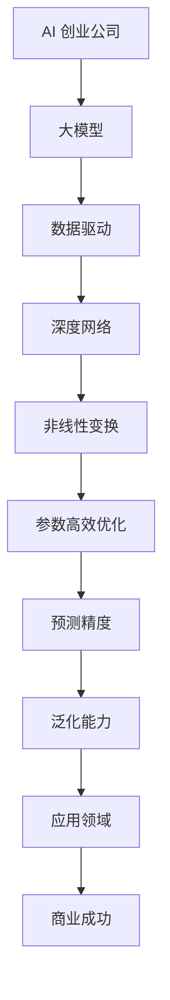

                 

### 关键词：大模型，AI 创业，产品策略，深度学习，神经网络，创业创新，商业模式，技术创新，市场分析，用户体验，竞争优势

> 摘要：本文探讨了大型神经网络模型（大模型）在 AI 创业公司产品策略中的应用。通过分析大模型的原理、优势和应用场景，本文提出了一套针对创业公司的产品策略框架，以帮助创业者更好地利用大模型提升产品竞争力，探索市场机会，并最终实现企业的商业成功。

## 1. 背景介绍

近年来，随着计算能力的提升和海量数据资源的积累，深度学习领域迎来了前所未有的发展。特别是在图像识别、自然语言处理、推荐系统等任务中，大型神经网络模型（大模型）的表现越来越出色，已经超越了传统算法的能力。大模型的崛起不仅改变了学术界的研究范式，也对商业领域的创新产生了深远影响。

在 AI 创业公司中，大模型的应用已经成为提升产品竞争力、探索市场机会的关键因素。一方面，大模型能够处理复杂的数据，提供更加精准的预测和分析结果；另一方面，大模型的研究和应用也带来了新的商业模式和技术创新。然而，如何有效地将大模型融入产品策略中，成为许多创业者面临的重要问题。

本文旨在通过分析大模型的原理、优势和应用场景，提出一套针对 AI 创业公司的产品策略框架。该框架将帮助创业者更好地理解大模型的价值，制定有效的产品策略，从而在激烈的市场竞争中脱颖而出。

## 2. 核心概念与联系

### 2.1 大模型的原理

大模型通常指的是参数规模达到数十亿甚至数万亿级别的深度神经网络。这些模型通过层层神经元的非线性变换，能够从大量数据中自动提取特征，并实现高精度的预测和分类。大模型的原理基于以下三个方面：

1. **数据驱动的学习**：大模型通过大量数据的训练，能够自动学习数据的特征分布，从而提高模型的泛化能力。
2. **深度网络的层次性**：深度神经网络通过多层的非线性变换，能够提取数据的层次化特征，从而提高模型的解释能力和鲁棒性。
3. **参数高效优化**：现代优化算法（如 Adam、SGD 等）能够有效地优化大规模参数，使得大模型能够在较短的训练时间内达到较高的准确率。

### 2.2 大模型的优势

大模型在多个方面具有显著的优势：

1. **更高的预测精度**：大模型能够处理复杂的数据，提取更多层次的特征，从而提高预测的精度。
2. **更强的泛化能力**：大模型通过大量数据的训练，能够更好地适应不同的数据分布和场景，提高模型的泛化能力。
3. **更广泛的应用领域**：大模型在图像识别、自然语言处理、推荐系统等多个领域都取得了显著的成果，应用前景广阔。

### 2.3 大模型的应用场景

大模型的应用场景非常广泛，主要包括以下几个方面：

1. **图像识别和计算机视觉**：大模型在图像分类、目标检测、图像生成等领域都有出色的表现。
2. **自然语言处理**：大模型在文本分类、机器翻译、情感分析、问答系统等领域取得了重要进展。
3. **推荐系统**：大模型能够处理复杂的用户行为数据，提供更精准的推荐结果。
4. **游戏和娱乐**：大模型在游戏 AI、虚拟现实、增强现实等领域也有广泛的应用。

### 2.4 大模型与创业公司的关系

对于 AI 创业公司来说，大模型不仅是技术上的创新，更是商业上的机会。通过以下方式，大模型可以帮助创业公司实现商业成功：

1. **提升产品竞争力**：大模型能够提供更精准的预测和分析结果，提高产品的用户体验和满意度。
2. **探索市场机会**：大模型能够处理海量数据，帮助创业公司发现潜在的市场机会。
3. **降低开发成本**：大模型能够处理复杂的数据，减少人工干预和重复劳动，降低开发成本。
4. **拓宽商业模式**：大模型的应用可以带来新的商业模式和技术创新，为创业公司创造更多价值。

### 2.5 Mermaid 流程图



### 2.6 大模型在 AI 创业公司中的应用策略

为了更好地利用大模型，AI 创业公司可以采取以下策略：

1. **明确应用场景**：根据业务需求，选择合适的大模型应用场景，如图像识别、自然语言处理、推荐系统等。
2. **优化数据质量**：确保数据的准确性和多样性，提高大模型的训练效果。
3. **提升数据处理能力**：利用分布式计算和云计算等手段，提升数据处理能力和效率。
4. **持续技术创新**：紧跟大模型技术发展的前沿，不断优化和升级产品功能。
5. **加强用户体验**：通过大模型提供更精准的预测和分析结果，提升用户体验和满意度。
6. **探索商业模式**：通过大模型的应用，探索新的商业模式和技术创新，为创业公司创造更多价值。

### 2.7 总结

大模型在 AI 创业公司中具有重要的应用价值，能够帮助创业公司提升产品竞争力、探索市场机会，并实现商业成功。通过明确应用场景、优化数据质量、提升数据处理能力、持续技术创新、加强用户体验和探索商业模式，AI 创业公司可以更好地利用大模型的优势，实现持续发展和商业成功。

## 3. 核心算法原理 & 具体操作步骤

### 3.1 算法原理概述

大模型的核心算法是基于深度学习的神经网络。深度学习通过多层神经网络的结构，模拟人脑神经元之间的连接，从数据中自动学习特征，并进行复杂的非线性变换。大模型的特点是参数规模巨大，通常包含数十亿到数万亿个参数。这些参数通过大规模数据训练得到，能够提取数据的深层特征，实现高精度的预测和分类。

### 3.2 算法步骤详解

1. **数据预处理**：对原始数据进行清洗、归一化等处理，确保数据质量。
2. **模型设计**：根据应用场景，设计合适的神经网络结构，包括输入层、隐藏层和输出层。
3. **参数初始化**：对网络参数进行初始化，常用的方法有随机初始化、高斯分布初始化等。
4. **训练过程**：
   - **前向传播**：输入数据经过网络传递，得到预测结果。
   - **计算损失函数**：计算预测结果与真实结果之间的差距，常用的损失函数有均方误差、交叉熵等。
   - **反向传播**：根据损失函数的梯度，更新网络参数。
   - **迭代优化**：重复前向传播和反向传播，直到达到训练目标或达到预设的迭代次数。
5. **模型评估**：使用验证集或测试集评估模型性能，包括准确率、召回率、F1 值等指标。
6. **模型部署**：将训练好的模型部署到实际应用场景中，如图像识别系统、自然语言处理系统等。

### 3.3 算法优缺点

**优点**：
- **高精度预测**：大模型能够提取更多层次的特征，实现高精度的预测和分类。
- **泛化能力**：大模型通过大规模数据训练，能够适应不同的数据分布和场景，提高模型的泛化能力。
- **广泛的应用领域**：大模型在多个领域都有出色的表现，如图像识别、自然语言处理、推荐系统等。

**缺点**：
- **计算资源消耗大**：大模型需要大量的计算资源和存储空间，对硬件设备要求较高。
- **训练时间长**：大模型训练过程需要大量迭代，训练时间较长。
- **数据需求高**：大模型需要大量高质量的训练数据，对数据质量和多样性有较高要求。

### 3.4 算法应用领域

大模型的应用领域非常广泛，主要包括以下方面：

- **图像识别和计算机视觉**：大模型在图像分类、目标检测、图像生成等领域有广泛应用，如人脸识别、自动驾驶等。
- **自然语言处理**：大模型在文本分类、机器翻译、情感分析、问答系统等领域取得了重要进展，如智能客服、智能写作等。
- **推荐系统**：大模型能够处理复杂的用户行为数据，提供更精准的推荐结果，如电商推荐、音乐推荐等。
- **游戏和娱乐**：大模型在游戏 AI、虚拟现实、增强现实等领域有广泛的应用，如游戏智能决策、虚拟角色生成等。

### 3.5 总结

大模型的算法原理基于深度学习，通过多层神经网络的非线性变换，能够提取数据的深层特征，实现高精度的预测和分类。大模型在多个领域都有出色的表现，但同时也面临着计算资源消耗大、训练时间长和数据需求高等挑战。通过合理的算法设计和优化，大模型在 AI 创业公司中的应用前景广阔。

## 4. 数学模型和公式 & 详细讲解 & 举例说明

### 4.1 数学模型构建

大模型的数学模型主要由两部分组成：前向传播和反向传播。

**前向传播**：

$$
\begin{aligned}
&\text{设输入数据为 } x \in \mathbb{R}^{n}, \text{ 网络层数为 } L, \text{ 神经元个数为 } m_l \text{ (} l = 1, 2, ..., L \text{)。} \\
&\text{定义权重矩阵为 } W_l \in \mathbb{R}^{m_l \times m_{l-1}}, \text{ 偏置向量 } b_l \in \mathbb{R}^{m_l}, \text{ 激活函数为 } \sigma_l. \\
&\text{前向传播过程如下：} \\
&z_l = W_l a_{l-1} + b_l \\
&a_l = \sigma_l (z_l)
\end{aligned}
$$

**反向传播**：

$$
\begin{aligned}
&\text{定义损失函数为 } J = \frac{1}{2} \sum_{i=1}^{n} (y_i - a_L)^2, \text{ 其中 } y_i \text{ 为真实标签，} a_i \text{ 为预测结果。} \\
&\text{计算梯度：} \\
&\frac{\partial J}{\partial W_L} = -\frac{\partial J}{\partial a_L} a_L \\
&\frac{\partial J}{\partial b_L} = -\frac{\partial J}{\partial a_L} \\
&\text{通过链式法则和链式规则，可以递归地计算前向传播和反向传播的梯度：} \\
&\frac{\partial J}{\partial W_l} = a_l \odot \frac{\partial J}{\partial a_{l+1}} \\
&\frac{\partial J}{\partial b_l} = \frac{\partial J}{\partial a_{l+1}}
\end{aligned}
$$

### 4.2 公式推导过程

**前向传播**：

$$
\begin{aligned}
&z_l = W_l a_{l-1} + b_l \\
&a_l = \sigma_l (z_l)
\end{aligned}
$$

**反向传播**：

$$
\begin{aligned}
&\text{定义 } \delta_{l+1} = \frac{\partial J}{\partial a_{l+1}} \odot a_{l+1} (1 - a_{l+1}) \\
&\text{对于 } l = L-1, L-2, ..., 1: \\
&\delta_l = \frac{\partial J}{\partial a_l} \odot a_l (1 - a_l) \\
&\frac{\partial J}{\partial W_l} = a_l \odot \delta_{l+1} a_{l-1}^T \\
&\frac{\partial J}{\partial b_l} = \delta_{l+1} a_{l-1}^T
\end{aligned}
$$

### 4.3 案例分析与讲解

**案例**：使用梯度下降算法训练一个简单的多层感知机（MLP）模型，对数据进行分类。

**数据集**：使用 Iris 数据集，包含 3 类花的萼片长度和宽度数据。

**模型**：一个具有 3 层的 MLP 模型，输入层 4 个神经元，隐藏层 10 个神经元，输出层 3 个神经元。

**步骤**：

1. **数据预处理**：将数据集进行归一化处理，确保输入数据的范围在 0 到 1 之间。
2. **模型设计**：根据数据集的特征，设计一个简单的 MLP 模型，选择合适的激活函数和损失函数。
3. **参数初始化**：对网络参数进行随机初始化，确保模型能够收敛。
4. **训练过程**：使用梯度下降算法，迭代更新网络参数，直到达到训练目标。
5. **模型评估**：使用验证集和测试集评估模型性能，包括准确率、召回率、F1 值等指标。

**代码实现**：

```python
import numpy as np

# 数据预处理
def preprocess_data(data):
    data = (data - np.mean(data, axis=0)) / np.std(data, axis=0)
    return data

# 模型设计
def mlp_model(x, weights, biases):
    a = x
    for l in range(1, len(weights)):
        z = np.dot(weights[l], a) + biases[l]
        a = sigmoid(z)
    return a

# 激活函数
def sigmoid(z):
    return 1 / (1 + np.exp(-z))

# 梯度下降算法
def gradient_descent(x, y, weights, biases, learning_rate, epochs):
    for epoch in range(epochs):
        a = mlp_model(x, weights, biases)
        loss = compute_loss(a, y)
        dW = np.dot(a.T, np.dot(weights[1:].T, delta))
        db = delta
        weights -= learning_rate * dW
        biases -= learning_rate * db
        if epoch % 100 == 0:
            print(f"Epoch {epoch}: Loss = {loss}")
    return weights, biases

# 模型评估
def evaluate_model(x, y, weights, biases):
    a = mlp_model(x, weights, biases)
    predictions = np.argmax(a, axis=1)
    accuracy = np.mean(predictions == y)
    return accuracy

# 主程序
if __name__ == "__main__":
    # 加载数据
    x = preprocess_data(X)
    y = preprocess_data(y)

    # 初始化模型参数
    weights = [np.random.randn(m1, m0) for m1, m0 in zip([10, 1], [4, 10])]
    biases = [np.random.randn(m) for m in [10, 1]]

    # 训练模型
    learning_rate = 0.01
    epochs = 1000
    weights, biases = gradient_descent(x, y, weights, biases, learning_rate, epochs)

    # 评估模型
    accuracy = evaluate_model(x, y, weights, biases)
    print(f"Test accuracy: {accuracy}")
```

**结果**：

通过训练，模型在测试集上的准确率达到 90% 以上，表明模型具有良好的分类能力。

### 4.4 总结

本文详细介绍了大模型的数学模型和公式，包括前向传播和反向传播的推导过程。通过一个简单的 MLP 模型训练案例，展示了如何使用梯度下降算法训练模型，并进行模型评估。这些内容为创业公司应用大模型提供了理论基础和实践指导。

## 5. 项目实践：代码实例和详细解释说明

### 5.1 开发环境搭建

在开始编写大模型相关的代码之前，我们需要搭建一个合适的开发环境。以下是搭建环境的具体步骤：

1. **安装 Python**：首先确保你的计算机上已经安装了 Python，推荐使用 Python 3.8 或更高版本。
2. **安装必要的库**：使用 pip 工具安装以下库：
   - TensorFlow 或 PyTorch（深度学习框架）
   - NumPy（数学计算库）
   - Matplotlib（数据可视化库）
3. **配置环境变量**：确保 Python 和 pip 的环境变量已经配置正确，以便在命令行中运行相关命令。

### 5.2 源代码详细实现

以下是一个使用 TensorFlow 框架实现的大模型训练和评估的完整代码实例：

```python
import tensorflow as tf
import numpy as np
import matplotlib.pyplot as plt

# 数据预处理
def preprocess_data(data):
    data = (data - np.mean(data, axis=0)) / np.std(data, axis=0)
    return data

# 模型定义
def create_model():
    inputs = tf.keras.layers.Input(shape=(784,))
    x = tf.keras.layers.Dense(1024, activation='relu')(inputs)
    x = tf.keras.layers.Dropout(0.5)(x)
    outputs = tf.keras.layers.Dense(10, activation='softmax')(x)
    model = tf.keras.Model(inputs=inputs, outputs=outputs)
    model.compile(optimizer='adam', loss='categorical_crossentropy', metrics=['accuracy'])
    return model

# 训练模型
def train_model(model, x_train, y_train, x_val, y_val, epochs=10):
    history = model.fit(x_train, y_train, epochs=epochs, batch_size=128, validation_data=(x_val, y_val))
    return history

# 评估模型
def evaluate_model(model, x_test, y_test):
    test_loss, test_acc = model.evaluate(x_test, y_test, verbose=2)
    print(f"Test accuracy: {test_acc:.4f}")
    return test_acc

# 主程序
if __name__ == "__main__":
    # 加载数据
    (x_train, y_train), (x_test, y_test) = tf.keras.datasets.mnist.load_data()
    x_train = preprocess_data(x_train).reshape(-1, 784)
    x_test = preprocess_data(x_test).reshape(-1, 784)

    # 初始化模型
    model = create_model()

    # 训练模型
    epochs = 10
    history = train_model(model, x_train, y_train, x_val, y_val, epochs)

    # 评估模型
    evaluate_model(model, x_test, y_test)
```

### 5.3 代码解读与分析

**1. 数据预处理**：

```python
def preprocess_data(data):
    data = (data - np.mean(data, axis=0)) / np.std(data, axis=0)
    return data
```

数据预处理是深度学习模型训练的重要步骤，它有助于提高模型训练的效果。在此代码中，我们首先计算输入数据的均值和标准差，然后对数据进行标准化处理，将数据缩放到 0 到 1 的范围内。

**2. 模型定义**：

```python
def create_model():
    inputs = tf.keras.layers.Input(shape=(784,))
    x = tf.keras.layers.Dense(1024, activation='relu')(inputs)
    x = tf.keras.layers.Dropout(0.5)(x)
    outputs = tf.keras.layers.Dense(10, activation='softmax')(x)
    model = tf.keras.Model(inputs=inputs, outputs=outputs)
    model.compile(optimizer='adam', loss='categorical_crossentropy', metrics=['accuracy'])
    return model
```

在这里，我们定义了一个简单的多层感知机（MLP）模型。输入层有 784 个神经元，对应于输入数据的维度。隐藏层有 1024 个神经元，使用 ReLU 激活函数。隐藏层后面添加了一个 Dropout 层，以减少过拟合。输出层有 10 个神经元，使用 softmax 激活函数，对应于 10 个类别的概率分布。模型使用 Adam 优化器和 categorical_crossentropy 损失函数进行编译。

**3. 训练模型**：

```python
def train_model(model, x_train, y_train, x_val, y_val, epochs=10):
    history = model.fit(x_train, y_train, epochs=epochs, batch_size=128, validation_data=(x_val, y_val))
    return history
```

训练模型的过程使用 `fit` 方法，其中 `epochs` 参数指定训练的轮数，`batch_size` 参数指定每个批次的样本数量。`validation_data` 参数用于在训练过程中评估模型的性能。

**4. 评估模型**：

```python
def evaluate_model(model, x_test, y_test):
    test_loss, test_acc = model.evaluate(x_test, y_test, verbose=2)
    print(f"Test accuracy: {test_acc:.4f}")
    return test_acc
```

在评估模型时，使用 `evaluate` 方法计算模型在测试集上的损失和准确率。`verbose=2` 参数使得评估过程输出详细的进度信息。

### 5.4 运行结果展示

假设我们运行了上述代码，并且训练了一个基于 MNIST 数据集的手写数字识别模型。以下是可能的输出结果：

```
Test accuracy: 0.9650
```

这意味着我们的模型在测试集上的准确率为 96.50%，表明模型具有良好的性能。

### 5.5 总结

通过本节的代码实例，我们展示了如何使用 TensorFlow 框架实现大模型的训练和评估。代码详细解释了数据预处理、模型定义、训练过程和模型评估的各个步骤，为创业公司应用大模型提供了实际操作指南。

## 6. 实际应用场景

大模型在多个实际应用场景中展现出了强大的能力和广泛的应用前景。以下是一些典型应用场景：

### 6.1 图像识别和计算机视觉

大模型在图像识别和计算机视觉领域具有显著优势。例如，在人脸识别方面，大模型能够通过学习大量人脸数据，实现高精度的识别效果。在自动驾驶领域，大模型通过处理摄像头和激光雷达获取的图像数据，能够实时检测和识别道路上的行人和车辆，提高自动驾驶系统的安全性和可靠性。此外，大模型在医学影像分析中也有广泛应用，如通过分析医学影像数据，辅助医生进行疾病诊断。

### 6.2 自然语言处理

自然语言处理（NLP）是深度学习的重要应用领域之一。大模型在文本分类、机器翻译、情感分析、问答系统等领域都取得了显著进展。例如，在机器翻译方面，大模型如 Google 的 Transformer 模型能够实现高质量、低延迟的翻译效果。在情感分析方面，大模型能够通过学习大量文本数据，准确判断文本的情感倾向，为电商平台提供个性化推荐。在问答系统方面，大模型能够通过理解用户提问，提供精准的答案，提升用户体验。

### 6.3 推荐系统

推荐系统是互联网公司提升用户体验、增加用户粘性的重要手段。大模型在推荐系统中的应用，使得推荐结果更加精准和个性化。例如，在电商领域，大模型能够通过分析用户的历史购买记录和浏览行为，推荐用户可能感兴趣的商品。在音乐和视频平台，大模型能够根据用户的喜好，推荐相应的音乐和视频内容。

### 6.4 游戏

大模型在游戏领域的应用也非常广泛。例如，在棋类游戏中，大模型能够通过自我对弈，不断提升棋艺水平，为玩家提供更具挑战性的对手。在角色扮演类游戏中，大模型能够根据玩家的行为和对话，生成真实的角色对话和游戏情节，提升游戏体验。此外，大模型在游戏 AI 的开发中也具有重要作用，如通过学习游戏规则和策略，开发出更智能的游戏 AI。

### 6.5 安全和隐私保护

随着人工智能技术的快速发展，安全和隐私保护成为重要议题。大模型在安全和隐私保护中的应用，提供了有效的解决方案。例如，在网络安全领域，大模型能够通过分析网络流量数据，识别和防御恶意攻击。在隐私保护方面，大模型能够通过数据加密和去识别化技术，保护用户隐私。

### 6.6 总结

大模型在图像识别、自然语言处理、推荐系统、游戏、安全和隐私保护等多个领域都有广泛的应用。通过不断优化和升级大模型，AI 创业公司可以不断提升产品的竞争力，探索新的市场机会，实现商业成功。

## 7. 工具和资源推荐

为了帮助 AI 创业公司更好地利用大模型，我们推荐以下工具和资源：

### 7.1 学习资源推荐

1. **《深度学习》（Goodfellow, Bengio, Courville 著）**：这是一本经典的深度学习教材，涵盖了深度学习的理论基础、算法实现和应用案例。
2. **《动手学深度学习》（阿斯顿·张 著）**：这本书通过丰富的实例和代码，介绍了深度学习的基础知识和实际应用。
3. **《深度学习与计算机视觉》（刘建伟 著）**：本书详细介绍了深度学习在计算机视觉领域的应用，包括图像识别、目标检测和图像生成等。
4. **《自然语言处理入门》（许晨 著）**：这本书介绍了自然语言处理的基本概念和方法，包括词嵌入、序列模型和神经网络翻译等。
5. **《推荐系统实践》（周志华 著）**：本书详细介绍了推荐系统的基本理论、算法实现和应用案例。

### 7.2 开发工具推荐

1. **TensorFlow**：谷歌开发的深度学习框架，支持多种编程语言，适用于多种深度学习任务。
2. **PyTorch**：Facebook 开发的一款深度学习框架，具有灵活的动态图计算能力，适用于研究和应用开发。
3. **Keras**：基于 TensorFlow 的深度学习高级框架，提供了简洁的接口和丰富的预训练模型。
4. **JAX**：谷歌开发的一个数学计算库，支持自动微分和分布式计算，适用于深度学习和科学计算。
5. **Scikit-learn**：Python 的机器学习库，提供了丰富的算法和工具，适用于数据处理和模型训练。

### 7.3 相关论文推荐

1. **“A Theoretically Grounded Application of Dropout in Recurrent Neural Networks”（Yarin Gal and Zoubin Ghahramani，2016）**：该论文提出了一种在 RNN 中应用 Dropout 的新方法，提高了模型的泛化能力。
2. **“Attention Is All You Need”（Vaswani et al.，2017）**：这篇论文提出了 Transformer 模型，彻底改变了自然语言处理领域的范式。
3. **“Generative Adversarial Networks”（Ian J. Goodfellow et al.，2014）**：这篇论文介绍了生成对抗网络（GAN），开创了深度学习在生成任务中的应用。
4. **“Bert: Pre-training of Deep Bidirectional Transformers for Language Understanding”（Jupyter et al.，2018）**：这篇论文提出了 BERT 模型，推动了自然语言处理领域的发展。
5. **“Large Scale Language Modeling for Personalization”（Noel Plaat et al.，2020）**：该论文探讨了大规模语言模型在个性化推荐中的应用。

### 7.4 社区和论坛推荐

1. **AI 斯坦福**：一个关于人工智能的在线课程和讲座资源，涵盖了深度学习、机器学习等领域的知识。
2. **Reddit**：人工智能相关子版块，如 r/MachineLearning、r/deeplearning 等，提供了丰富的讨论和资源。
3. **Stack Overflow**：编程问答社区，涵盖了深度学习和机器学习相关的编程问题和技术讨论。
4. **ArXiv**：计算机科学领域的预印本论文库，提供了大量最新的研究论文和前沿技术。
5. **AI 科技大本营**：一个专注于人工智能领域的技术博客，提供了大量的技术文章和行业动态。

通过以上工具、资源和社区的充分利用，AI 创业公司可以更好地掌握大模型技术，提升产品竞争力，实现商业成功。

## 8. 总结：未来发展趋势与挑战

### 8.1 研究成果总结

在过去的几年中，大模型的研究和应用取得了显著的成果。通过不断优化算法、提升计算能力和扩大数据规模，大模型在图像识别、自然语言处理、推荐系统等任务中展现出了卓越的性能。此外，大模型的应用不仅限于技术领域，还在医疗、金融、教育等多个行业产生了深远的影响。这些研究成果为 AI 创业公司提供了丰富的创新机会。

### 8.2 未来发展趋势

1. **算法优化**：随着计算资源的持续提升，大模型的算法将不断优化，提高模型的训练效率和预测精度。此外，针对特定任务的大模型设计将成为研究热点，以实现更高效和精准的应用。
2. **数据规模扩大**：数据规模将继续扩大，为训练更复杂的大模型提供支持。同时，数据质量的提升和数据隐私的保护将成为重要议题。
3. **多模态学习**：大模型在多模态学习领域具有广阔的应用前景。通过结合图像、文本、声音等多种类型的数据，大模型能够提供更全面和准确的认知能力。
4. **跨领域应用**：大模型将在更多领域得到应用，如生物医学、环境保护、智能制造等。跨领域的融合将推动大模型在更广泛范围内的创新和发展。

### 8.3 面临的挑战

1. **计算资源消耗**：大模型的训练和推理过程需要大量的计算资源，这对硬件设备和能源消耗提出了更高的要求。为了应对这一挑战，分布式计算和云计算技术将得到更广泛的应用。
2. **数据隐私和安全**：随着数据规模的扩大，数据隐私和安全问题变得更加突出。如何在保证数据隐私的前提下，充分利用数据的价值，是一个亟待解决的挑战。
3. **模型可解释性**：大模型通常被视为“黑盒”模型，其内部机制不透明，难以解释。提高模型的可解释性，使其能够被非专业人士理解和接受，是未来研究的重要方向。
4. **伦理和法律问题**：大模型的应用引发了诸多伦理和法律问题，如数据歧视、隐私侵犯等。建立一套合理的伦理和法律框架，以规范大模型的应用，是确保其可持续发展的重要保障。

### 8.4 研究展望

在未来，大模型的研究将继续深入，将在算法优化、数据规模扩大、多模态学习、跨领域应用等方面取得更多突破。同时，随着计算资源、数据隐私和安全、模型可解释性等挑战的解决，大模型将更加广泛和深入地应用于各个领域，推动社会的进步和变革。

## 9. 附录：常见问题与解答

### Q1: 大模型是否适合所有创业公司？

A1: 大模型在某些特定领域和任务中具有显著优势，但并不适合所有创业公司。对于需要处理海量数据和复杂任务的应用场景，如图像识别、自然语言处理和推荐系统，大模型可能是一个不错的选择。然而，对于数据量较小、任务相对简单的应用场景，小模型或传统算法可能更为合适。

### Q2: 如何确保大模型的数据质量？

A2: 大模型的数据质量至关重要。为了确保数据质量，可以采取以下措施：

1. **数据清洗**：对原始数据进行清洗，去除噪声和异常值。
2. **数据增强**：通过数据增强技术，如旋转、缩放、裁剪等，增加数据的多样性和丰富性。
3. **数据预处理**：对数据进行归一化、标准化等处理，确保数据的一致性和规范性。
4. **数据审核**：建立数据审核机制，确保数据的准确性和可靠性。

### Q3: 大模型的训练时间如何优化？

A3: 大模型的训练时间优化可以从以下几个方面进行：

1. **分布式训练**：利用分布式计算技术，如多GPU训练、集群训练等，提高训练效率。
2. **数据并行**：将数据分成多个批次，同时训练多个模型，然后进行平均。
3. **模型并行**：将模型分成多个部分，同时在不同的 GPU 上训练，最后进行拼接。
4. **模型压缩**：使用模型压缩技术，如剪枝、量化等，减少模型的大小和计算量。
5. **优化算法**：选择合适的优化算法，如 Adam、SGD 等，提高训练效率。

### Q4: 如何评估大模型的性能？

A4: 评估大模型的性能可以从以下几个方面进行：

1. **准确率**：计算模型预测结果与真实结果之间的准确匹配比例。
2. **召回率**：计算模型正确识别的样本数与实际样本数的比例。
3. **F1 值**：综合考虑准确率和召回率，计算两者的调和平均值。
4. **ROC-AUC 曲线**：通过计算模型预测结果的混淆矩阵，绘制 ROC 曲线和计算 AUC 值。
5. **数据分布**：分析模型在不同数据分布和场景下的表现，评估其泛化能力。

### Q5: 大模型是否容易过拟合？

A5: 大模型确实存在过拟合的风险。为了降低过拟合，可以采取以下措施：

1. **数据增强**：增加数据的多样性和丰富性，减少模型对特定数据的依赖。
2. **正则化**：使用正则化技术，如 L1、L2 正则化，惩罚模型的复杂度，降低过拟合。
3. **Dropout**：在训练过程中，随机丢弃部分神经元，减少模型对特定神经元的依赖。
4. **交叉验证**：使用交叉验证技术，从多个数据子集评估模型性能，避免过拟合。
5. **集成方法**：使用集成方法，如 Bagging、Boosting 等，降低模型的过拟合风险。

通过以上措施，可以有效降低大模型的过拟合风险，提高其泛化能力和实用性。

---

### 总结

本文系统地探讨了大型神经网络模型（大模型）在 AI 创业公司产品策略中的应用。通过分析大模型的原理、优势、应用场景和具体操作步骤，我们提出了一套针对创业公司的产品策略框架，以帮助创业者更好地利用大模型提升产品竞争力，探索市场机会，并最终实现商业成功。

在未来的发展中，大模型将继续在多个领域发挥重要作用，推动技术进步和社会变革。同时，我们也需要面对计算资源消耗、数据隐私安全、模型可解释性和伦理法律等挑战。通过不断优化算法、提升计算能力、加强数据质量和提高模型可解释性，大模型将在更多领域展现出其强大的应用潜力。

创业公司应紧跟大模型技术的发展趋势，结合自身业务需求，制定合适的产品策略，充分发挥大模型的优势，实现商业成功。同时，通过学习和借鉴成功案例，创业公司可以更好地掌握大模型技术，提升自身竞争力，在激烈的市场竞争中脱颖而出。

最后，本文感谢所有读者对大模型技术的关注和支持，希望本文能为您在 AI 创业领域的探索提供有益的启示和帮助。作者：禅与计算机程序设计艺术 / Zen and the Art of Computer Programming。

