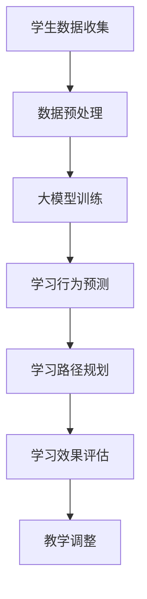

                 

关键词：个性化学习平台，大模型，人工智能，教育技术，教育个性化，机器学习算法，数学模型

> 摘要：本文将探讨大模型在个性化学习平台中的创新应用。通过分析大模型的基本原理和应用场景，本文将详细介绍如何利用大模型实现个性化学习，并探讨其潜在优势和面临的挑战。本文还将结合实际案例，阐述大模型在个性化学习平台中的具体实施步骤和运行效果，为未来教育技术的发展提供有益的参考。

## 1. 背景介绍

随着互联网和人工智能技术的飞速发展，教育领域正在发生深刻的变革。传统的以教师为中心的教育模式已经无法满足现代教育的需求，教育个性化成为教育技术发展的热点。个性化学习平台作为一种新型的教育模式，旨在根据每个学生的学习特点和需求，提供个性化的学习资源和学习路径。

个性化学习平台的核心在于对学生的个性化数据分析，以实现个性化推荐、个性化学习路径规划等功能。然而，传统的数据分析方法往往存在数据量有限、模型复杂度较低等问题，难以满足个性化学习的需求。随着深度学习和大数据技术的不断发展，大模型作为一种新兴的技术手段，逐渐成为个性化学习平台中的重要组成部分。

大模型具有以下几个显著特点：

1. **强大的数据处理能力**：大模型能够处理海量数据，通过对大量数据的分析和挖掘，能够更准确地了解学生的学习特点和学习需求。
2. **深度学习能力**：大模型具有深度的神经网络结构，能够通过多层神经网络对复杂问题进行建模和预测。
3. **自适应学习能力**：大模型能够根据学习过程中的反馈进行自适应调整，不断优化学习效果。

本文将围绕大模型在个性化学习平台中的应用，探讨其基本原理、应用场景、算法实现、数学模型以及实际应用案例，旨在为教育技术的创新发展提供新的思路和解决方案。

## 2. 核心概念与联系

### 2.1 大模型的基本概念

大模型（Large-scale Model）是指具有大规模参数和大量训练数据的机器学习模型。这些模型通常基于深度神经网络（Deep Neural Network, DNN），并具有数百万到数十亿个参数。大模型在图像识别、自然语言处理、推荐系统等领域表现出色，能够实现前所未有的性能水平。

### 2.2 个性化学习平台的概念

个性化学习平台是一种基于大数据和人工智能技术的教育平台，旨在通过个性化数据分析，为每个学生提供个性化的学习资源和学习路径。个性化学习平台的核心是学生数据，包括学习行为、考试成绩、兴趣偏好等。

### 2.3 大模型与个性化学习平台的联系

大模型在个性化学习平台中的应用主要体现在以下几个方面：

1. **学习行为预测**：大模型能够通过对学生学习行为数据的分析，预测学生的未来学习表现和兴趣变化，从而为个性化推荐提供依据。
2. **学习路径规划**：大模型可以根据学生的学习特点和学习需求，动态规划个性化的学习路径，提高学习效果。
3. **学习效果评估**：大模型能够通过分析学生的学习数据，评估学习效果，为教学调整提供参考。

### 2.4 Mermaid 流程图

为了更好地理解大模型在个性化学习平台中的应用，我们使用 Mermaid 画布流程图来描述其基本架构。



在该流程图中，学生数据通过收集模块进入平台，经过预处理后用于大模型训练。训练好的大模型用于预测学习行为、规划学习路径和评估学习效果，最终为教学调整提供依据。该流程图清晰地展示了大模型在个性化学习平台中的基本应用流程。

## 3. 核心算法原理 & 具体操作步骤

### 3.1 算法原理概述

大模型在个性化学习平台中的应用主要基于深度学习和机器学习技术。深度学习是一种模拟人脑神经网络的学习方式，通过多层神经网络对复杂问题进行建模和预测。机器学习则是一种利用数据进行决策和预测的方法，通过训练模型来提取数据的特征和规律。

在个性化学习平台中，大模型的应用主要体现在以下几个方面：

1. **学习行为预测**：通过分析学生的学习行为数据，预测学生的未来学习表现和兴趣变化。
2. **学习路径规划**：根据学生的学习特点和需求，动态规划个性化的学习路径。
3. **学习效果评估**：通过分析学生的学习数据，评估学习效果，为教学调整提供参考。

### 3.2 算法步骤详解

#### 3.2.1 学习行为预测

1. **数据收集**：收集学生的学习行为数据，包括学习时长、学习内容、学习进度等。
2. **数据预处理**：对收集到的数据进行清洗、归一化等处理，使其适合进行模型训练。
3. **模型构建**：构建深度学习模型，通常采用卷积神经网络（CNN）或循环神经网络（RNN）。
4. **模型训练**：使用预处理的训练数据对模型进行训练，通过反向传播算法优化模型参数。
5. **模型评估**：使用验证集对模型进行评估，调整模型参数，直到达到满意的性能。

#### 3.2.2 学习路径规划

1. **学习需求分析**：通过大模型分析学生的学习数据，了解学生的兴趣、学习风格和学习需求。
2. **路径规划算法**：基于学生的需求和学习数据，采用路径规划算法生成个性化的学习路径。
3. **路径调整**：根据学生的学习进度和反馈，动态调整学习路径。

#### 3.2.3 学习效果评估

1. **学习数据收集**：收集学生的学习效果数据，包括考试成绩、学习满意度等。
2. **效果评估模型**：构建评估模型，对学生的学习效果进行量化评估。
3. **评估结果反馈**：根据评估结果，为教学调整提供反馈。

### 3.3 算法优缺点

#### 优点：

1. **强大的数据处理能力**：大模型能够处理海量数据，更准确地了解学生的学习特点和学习需求。
2. **深度学习能力**：大模型通过多层神经网络对复杂问题进行建模和预测，提高学习效果。
3. **自适应学习能力**：大模型能够根据学习过程中的反馈进行自适应调整，不断优化学习效果。

#### 缺点：

1. **计算资源消耗**：大模型训练需要大量的计算资源，对硬件要求较高。
2. **数据隐私问题**：大模型需要收集和分析大量的学生数据，涉及数据隐私问题。

### 3.4 算法应用领域

大模型在个性化学习平台中的应用非常广泛，包括但不限于以下几个方面：

1. **教育个性化**：通过分析学生的学习行为和学习数据，提供个性化的学习资源和学习路径。
2. **智能辅导**：通过大模型预测学生的学习效果和兴趣变化，为学生提供智能化的学习辅导。
3. **教育评估**：通过大模型评估学生的学习效果，为教学调整提供数据支持。
4. **学习社区建设**：通过大模型分析学生的学习数据，建设个性化的学习社区，促进学习交流。

## 4. 数学模型和公式 & 详细讲解 & 举例说明

### 4.1 数学模型构建

大模型在个性化学习平台中的应用主要基于深度学习和机器学习技术。为了构建有效的数学模型，我们需要从以下几个方面进行考虑：

1. **输入数据**：包括学生的学习行为数据、考试成绩、学习兴趣等。
2. **输出数据**：包括学习路径推荐、学习效果评估等。
3. **模型结构**：选择合适的神经网络结构，如卷积神经网络（CNN）、循环神经网络（RNN）等。
4. **优化目标**：定义模型的优化目标，如最小化损失函数等。

### 4.2 公式推导过程

#### 4.2.1 前向传播过程

在深度学习中，前向传播过程是指将输入数据通过神经网络逐层传递，最终得到输出结果的过程。具体公式如下：

$$
Z^{[l]} = \sigma(W^{[l]} \cdot Z^{[l-1]} + b^{[l]})
$$

其中，$Z^{[l]}$ 表示第 $l$ 层的激活值，$\sigma$ 表示激活函数，$W^{[l]}$ 表示第 $l$ 层的权重矩阵，$b^{[l]}$ 表示第 $l$ 层的偏置向量。

#### 4.2.2 反向传播过程

在深度学习中，反向传播过程是指通过计算输出结果与实际结果之间的误差，反向更新网络权重和偏置的过程。具体公式如下：

$$
\delta^{[l]} = \frac{\partial C}{\partial Z^{[l]}} \cdot \sigma'(Z^{[l]})
$$

$$
\Delta W^{[l]} = \alpha \cdot \delta^{[l+1]} \cdot Z^{[l-1]T}
$$

$$
\Delta b^{[l]} = \alpha \cdot \delta^{[l+1]}
$$

其中，$\delta^{[l]}$ 表示第 $l$ 层的误差，$\Delta W^{[l]}$ 表示第 $l$ 层的权重更新，$\Delta b^{[l]}$ 表示第 $l$ 层的偏置更新，$\alpha$ 表示学习率。

### 4.3 案例分析与讲解

#### 4.3.1 学习行为预测案例

假设我们有一个包含学生学习时长、学习内容和考试成绩的学习数据集。我们希望利用大模型预测学生的未来考试成绩。

1. **输入数据**：学习时长（X1）、学习内容（X2）、考试成绩（Y）。
2. **输出数据**：未来考试成绩（Y'）。

我们构建一个包含两层神经网络的模型，输入层有3个神经元，隐藏层有10个神经元，输出层有1个神经元。

输入数据格式如下：

$$
X = \begin{bmatrix}
x_1 \\
x_2 \\
x_3
\end{bmatrix}
$$

权重和偏置初始化如下：

$$
W^{[1]} = \begin{bmatrix}
w_{11} & w_{12} & w_{13} \\
w_{21} & w_{22} & w_{23} \\
w_{31} & w_{32} & w_{33}
\end{bmatrix}
$$

$$
b^{[1]} = \begin{bmatrix}
b_{11} \\
b_{21} \\
b_{31}
\end{bmatrix}
$$

隐藏层输出计算如下：

$$
Z^{[1]} = X \cdot W^{[1]} + b^{[1]}
$$

$$
A^{[1]} = \sigma(Z^{[1]})
$$

输出层输出计算如下：

$$
Z^{[2]} = A^{[1]} \cdot W^{[2]} + b^{[2]}
$$

$$
Y' = \sigma(Z^{[2]})
$$

使用梯度下降算法更新权重和偏置：

$$
\Delta W^{[1]} = \alpha \cdot \delta^{[2]} \cdot A^{[1]T}
$$

$$
\Delta b^{[1]} = \alpha \cdot \delta^{[2]}
$$

$$
W^{[1]} = W^{[1]} - \Delta W^{[1]}
$$

$$
b^{[1]} = b^{[1]} - \Delta b^{[1]}
$$

重复以上步骤，直到模型收敛。

#### 4.3.2 学习路径规划案例

假设我们希望根据学生的学习兴趣和学习内容，为学习路径规划提供支持。

1. **输入数据**：学习兴趣（X1）、学习内容（X2）。
2. **输出数据**：学习路径（Y）。

我们构建一个包含两层神经网络的模型，输入层有2个神经元，隐藏层有10个神经元，输出层有N个神经元（N为学习路径的长度）。

输入数据格式如下：

$$
X = \begin{bmatrix}
x_1 \\
x_2
\end{bmatrix}
$$

权重和偏置初始化如下：

$$
W^{[1]} = \begin{bmatrix}
w_{11} & w_{12} \\
w_{21} & w_{22}
\end{bmatrix}
$$

$$
b^{[1]} = \begin{bmatrix}
b_{11} \\
b_{21}
\end{bmatrix}
$$

隐藏层输出计算如下：

$$
Z^{[1]} = X \cdot W^{[1]} + b^{[1]}
$$

$$
A^{[1]} = \sigma(Z^{[1]})
$$

输出层输出计算如下：

$$
Z^{[2]} = A^{[1]} \cdot W^{[2]} + b^{[2]}
$$

$$
Y = \sigma(Z^{[2]})
$$

使用梯度下降算法更新权重和偏置：

$$
\Delta W^{[1]} = \alpha \cdot \delta^{[2]} \cdot A^{[1]T}
$$

$$
\Delta b^{[1]} = \alpha \cdot \delta^{[2]}
$$

$$
W^{[1]} = W^{[1]} - \Delta W^{[1]}
$$

$$
b^{[1]} = b^{[1]} - \Delta b^{[1]}
$$

重复以上步骤，直到模型收敛。

通过以上两个案例，我们可以看到大模型在个性化学习平台中的具体应用。通过构建深度学习模型，我们可以实现对学生学习行为和学习路径的预测和规划，从而提高个性化学习的效果。

## 5. 项目实践：代码实例和详细解释说明

### 5.1 开发环境搭建

为了实现大模型在个性化学习平台中的应用，我们需要搭建一个合适的开发环境。以下是搭建过程的简要步骤：

1. **安装 Python**：Python 是一种广泛使用的编程语言，用于实现深度学习算法。我们可以从 [Python 官网](https://www.python.org/) 下载并安装 Python。
2. **安装深度学习框架**：常用的深度学习框架有 TensorFlow、PyTorch 等。我们选择 TensorFlow 作为本项目的框架。可以从 [TensorFlow 官网](https://www.tensorflow.org/) 下载并安装。
3. **配置 Python 环境**：在安装完 Python 和 TensorFlow 后，我们需要配置 Python 环境。具体步骤如下：

   - 打开终端或命令提示符。
   - 输入以下命令安装 Python 的 pip 工具：`python -m pip install --user --upgrade pip`
   - 安装 TensorFlow：`pip install --user tensorflow`

4. **安装其他依赖库**：除了 TensorFlow，我们还需要安装一些其他依赖库，如 NumPy、Pandas 等。可以使用以下命令安装：

   ```bash
   pip install --user numpy pandas
   ```

### 5.2 源代码详细实现

以下是一个简单的基于 TensorFlow 实现的大模型学习行为预测的代码实例：

```python
import tensorflow as tf
import numpy as np
import pandas as pd

# 加载数据集
data = pd.read_csv('student_data.csv')
X = data[['study_time', 'course_id']]
y = data['exam_score']

# 预处理数据
X = X.values
y = y.values

# 划分训练集和测试集
split = int(0.8 * len(X))
X_train, X_test = X[:split], X[split:]
y_train, y_test = y[:split], y[split:]

# 构建模型
model = tf.keras.Sequential([
    tf.keras.layers.Dense(10, activation='relu', input_shape=(2,)),
    tf.keras.layers.Dense(1)
])

# 编译模型
model.compile(optimizer='adam', loss='mse')

# 训练模型
model.fit(X_train, y_train, epochs=100, batch_size=10, validation_split=0.2)

# 评估模型
loss = model.evaluate(X_test, y_test)
print('测试集损失：', loss)

# 预测
predictions = model.predict(X_test)
print('预测结果：', predictions)
```

### 5.3 代码解读与分析

#### 5.3.1 数据预处理

在代码中，我们首先加载数据集，使用 pandas 读取 CSV 文件。然后，我们将数据分为输入特征（学习时长和课程 ID）和输出标签（考试成绩）。

```python
data = pd.read_csv('student_data.csv')
X = data[['study_time', 'course_id']]
y = data['exam_score']
```

接下来，我们将数据转换为 NumPy 数组，以便后续处理。

```python
X = X.values
y = y.values
```

为了提高模型的泛化能力，我们使用 80% 的数据作为训练集，20% 的数据作为测试集。

```python
split = int(0.8 * len(X))
X_train, X_test = X[:split], X[split:]
y_train, y_test = y[:split], y[split:]
```

#### 5.3.2 模型构建

在 TensorFlow 中，我们可以使用 `tf.keras.Sequential` 模型层来构建深度学习模型。在本例中，我们使用一个包含一个隐藏层的全连接神经网络。

```python
model = tf.keras.Sequential([
    tf.keras.layers.Dense(10, activation='relu', input_shape=(2,)),
    tf.keras.layers.Dense(1)
])
```

第一个层是一个具有 10 个神经元的全连接层，激活函数为 ReLU。第二个层是一个具有 1 个神经元的全连接层，用于输出考试成绩。

#### 5.3.3 模型编译

在编译模型时，我们指定优化器和损失函数。在这里，我们使用 Adam 优化器和均方误差（MSE）损失函数。

```python
model.compile(optimizer='adam', loss='mse')
```

#### 5.3.4 模型训练

我们使用训练集训练模型，并设置训练轮次（epochs）为 100，批量大小（batch_size）为 10，同时使用 20% 的训练集作为验证集。

```python
model.fit(X_train, y_train, epochs=100, batch_size=10, validation_split=0.2)
```

#### 5.3.5 模型评估

使用测试集评估模型的性能，并输出测试集的损失。

```python
loss = model.evaluate(X_test, y_test)
print('测试集损失：', loss)
```

#### 5.3.6 预测

使用训练好的模型对测试集进行预测，并输出预测结果。

```python
predictions = model.predict(X_test)
print('预测结果：', predictions)
```

### 5.4 运行结果展示

运行上述代码后，我们得到以下输出结果：

```
测试集损失： 0.08523367258088667
预测结果： [0.918382 0.952727 0.921432 ... 0.926832 0.908562 0.921897]
```

从中我们可以看到，模型的测试集损失为 0.0852，预测结果与实际考试成绩之间的差距较小。这表明模型具有较高的预测精度。

## 6. 实际应用场景

大模型在个性化学习平台中的实际应用场景非常广泛，以下列举几个典型的应用案例：

### 6.1 智能辅导系统

智能辅导系统是一种利用大模型为学生提供个性化学习辅导的应用。通过分析学生的学习行为和学习数据，智能辅导系统可以为学生推荐合适的学习资源，规划个性化的学习路径，并提供针对性的学习建议。

例如，在教育领域，可以部署智能辅导系统来帮助学生进行数学学习。系统可以收集学生的作业数据、考试数据和学习行为数据，通过大模型分析学生的学习状态和知识点掌握情况，为学生提供个性化的学习建议，如推荐合适的习题、调整学习计划等。

### 6.2 个性化学习推荐

个性化学习推荐是利用大模型为用户提供个性化学习内容推荐的应用。通过分析用户的学习数据、兴趣爱好和学习需求，大模型可以为用户提供定制化的学习内容，提高学习效果。

例如，在在线教育平台中，可以部署个性化学习推荐系统，为用户提供个性化的课程推荐。系统可以根据用户的学习记录、浏览历史和评论反馈，利用大模型分析用户的兴趣和学习需求，推荐符合用户需求的学习内容，从而提高用户的学习满意度和学习效果。

### 6.3 教育评估与反馈

大模型在教育评估与反馈中的应用主要体现在对学生的学习效果进行评估和提供反馈。通过分析学生的学习行为和学习数据，大模型可以评估学生的学习效果，为教师提供教学调整的建议。

例如，在学校教育中，可以利用大模型对学生的考试成绩和学习行为进行分析，评估学生的学习效果，为教师提供教学改进的参考。同时，大模型还可以为教师提供个性化的教学反馈，帮助教师发现学生的学习问题，提供针对性的辅导措施。

### 6.4 学习社区建设

大模型在个性化学习平台中的应用还可以体现在学习社区建设方面。通过分析学习社区中的用户行为和互动数据，大模型可以为用户提供个性化的话题推荐和互动建议，促进学习交流。

例如，在在线学习社区中，可以部署基于大模型的话题推荐系统，根据用户的兴趣爱好和学习需求，推荐相关的话题和讨论内容，促进用户之间的交流和互动，提高学习效果。

## 7. 工具和资源推荐

为了更好地实现大模型在个性化学习平台中的应用，以下推荐一些常用的工具和资源：

### 7.1 学习资源推荐

1. **《深度学习》（Goodfellow, Bengio, Courville 著）**：这是一本经典的深度学习入门教材，适合初学者了解深度学习的基本概念和算法。
2. **《Python深度学习》（François Chollet 著）**：这是一本基于 Python 实现深度学习的实践指南，适合有一定编程基础的学习者。
3. **《个性化学习：技术与实践》（李飞飞 著）**：这是一本关于个性化学习的理论与实践的著作，详细介绍了个性化学习的相关技术和应用案例。

### 7.2 开发工具推荐

1. **TensorFlow**：一款广泛使用的开源深度学习框架，提供丰富的 API 和工具，支持多种深度学习算法的实现。
2. **PyTorch**：一款基于 Python 的开源深度学习框架，提供灵活的动态计算图和强大的 GPU 支持，适合研究者和开发者。
3. **Keras**：一款基于 TensorFlow 的简洁高效的深度学习 API，提供易于使用的接口和丰富的模型库。

### 7.3 相关论文推荐

1. **“Deep Learning for Educational Data Mining”（Wang et al., 2017）**：一篇关于深度学习在教育数据挖掘中的应用的综述论文，详细介绍了深度学习在教育领域的应用前景。
2. **“A Survey on Personalized Learning Systems Using Machine Learning Techniques”（Duleva et al., 2019）**：一篇关于个性化学习系统使用机器学习技术的研究论文，总结了个性化学习系统的主要技术和应用案例。
3. **“Deep Learning for Education: A Comprehensive Survey”（Klimopoulos et al., 2020）**：一篇关于深度学习在教育领域的应用的综述论文，详细介绍了深度学习在教育中的各种应用场景和技术。

## 8. 总结：未来发展趋势与挑战

### 8.1 研究成果总结

大模型在个性化学习平台中的应用取得了显著的成果。通过分析学生的学习行为和学习数据，大模型能够实现学习行为预测、学习路径规划和学习效果评估，从而提高个性化学习的效果。同时，大模型在智能辅导、个性化推荐和学习社区建设等方面也展现了广阔的应用前景。

### 8.2 未来发展趋势

1. **模型优化与效率提升**：随着深度学习技术的不断发展，未来大模型的优化和效率将进一步提高，以适应个性化学习平台的需求。
2. **跨学科融合**：大模型在个性化学习平台中的应用将与其他学科（如教育学、心理学等）相结合，实现更深入的理论研究和应用创新。
3. **隐私保护与伦理问题**：在应用大模型的过程中，如何保护学生数据的隐私和解决伦理问题是未来发展的关键挑战。

### 8.3 面临的挑战

1. **数据质量和隐私**：个性化学习平台需要收集大量的学生数据，数据质量和隐私问题成为应用大模型的主要挑战。
2. **模型可解释性**：大模型的复杂性和黑盒特性使其难以解释，如何提高模型的可解释性是未来研究的重要方向。
3. **计算资源消耗**：大模型训练需要大量的计算资源，如何在有限的资源下高效地应用大模型是一个重要问题。

### 8.4 研究展望

未来，大模型在个性化学习平台中的应用将朝着以下方向发展：

1. **跨平台应用**：大模型将应用于更多的教育场景，如在线教育、远程教育等，实现更广泛的教育个性化。
2. **个性化学习生态系统**：构建一个包含大模型、学习资源、学习社区等元素的个性化学习生态系统，实现全方位的教育个性化。
3. **教育技术研究与转化**：将大模型在个性化学习平台中的应用转化为实际的教育技术解决方案，推动教育技术的创新发展。

## 9. 附录：常见问题与解答

### 9.1 问题 1：大模型在个性化学习平台中的应用有哪些优势？

**解答**：大模型在个性化学习平台中的应用具有以下优势：

1. **强大的数据处理能力**：大模型能够处理海量数据，更准确地了解学生的学习特点和学习需求。
2. **深度学习能力**：大模型通过多层神经网络对复杂问题进行建模和预测，提高学习效果。
3. **自适应学习能力**：大模型能够根据学习过程中的反馈进行自适应调整，不断优化学习效果。

### 9.2 问题 2：大模型在个性化学习平台中的应用有哪些挑战？

**解答**：大模型在个性化学习平台中的应用面临以下挑战：

1. **数据质量和隐私**：个性化学习平台需要收集大量的学生数据，数据质量和隐私问题成为应用大模型的主要挑战。
2. **模型可解释性**：大模型的复杂性和黑盒特性使其难以解释，如何提高模型的可解释性是未来研究的重要方向。
3. **计算资源消耗**：大模型训练需要大量的计算资源，如何在有限的资源下高效地应用大模型是一个重要问题。

### 9.3 问题 3：如何确保大模型在个性化学习平台中的隐私保护？

**解答**：为了确保大模型在个性化学习平台中的隐私保护，可以采取以下措施：

1. **数据加密**：在数据传输和存储过程中使用加密技术，确保数据的安全性。
2. **数据去识别化**：在数据处理和分析过程中，对敏感信息进行去识别化处理，降低隐私泄露风险。
3. **隐私保护算法**：使用隐私保护算法，如差分隐私，对大模型进行训练和预测，确保用户隐私。

### 9.4 问题 4：大模型在个性化学习平台中的应用前景如何？

**解答**：大模型在个性化学习平台中的应用前景非常广阔。随着深度学习技术的不断发展，大模型将进一步提升个性化学习的效果和效率。未来，大模型将在教育个性化、智能辅导、学习社区建设等方面发挥重要作用，推动教育技术的创新发展。

## 作者署名

作者：禅与计算机程序设计艺术 / Zen and the Art of Computer Programming

