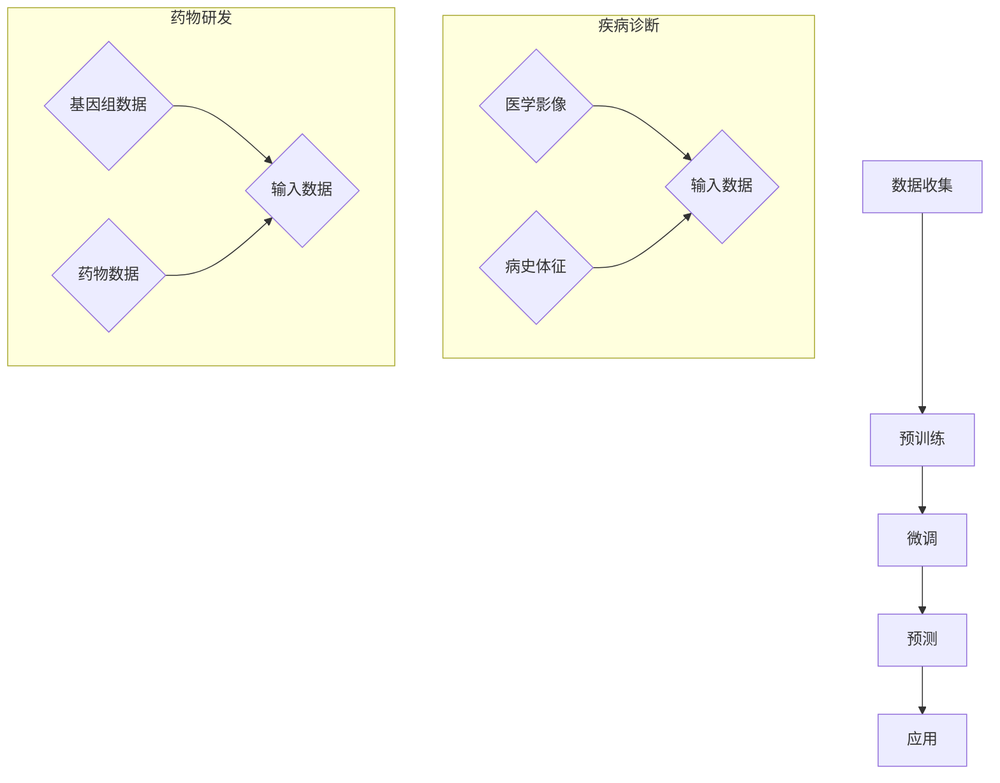

                 

关键词：大模型、医疗、人工智能、深度学习、自然语言处理、基因组学、医学影像、个性化治疗、预测模型

> 摘要：本文将探讨大模型在医疗领域的应用，包括其核心概念、算法原理、数学模型、实际应用场景、未来展望以及面临的挑战。通过分析大模型在基因组学、医学影像、自然语言处理等领域的应用，我们将揭示大模型为医疗行业带来的变革性影响。

## 1. 背景介绍

近年来，随着人工智能技术的快速发展，大模型（Large Models）逐渐成为计算机科学领域的研究热点。大模型是指参数规模达到百万甚至亿级的神经网络模型，如GPT（Generative Pre-trained Transformer）、BERT（Bidirectional Encoder Representations from Transformers）等。大模型通过在海量数据上进行预训练，能够捕捉数据中的复杂模式和语义信息，从而在多种任务中表现出色。

在医疗领域，人工智能的应用已经取得了显著的成果，如医疗影像分析、疾病诊断、药物研发等。而大模型的出现，更是为这些应用提供了强大的技术支持。大模型在医疗领域的应用，不仅提高了诊断和治疗的准确性，还降低了医疗成本，为医疗行业的可持续发展带来了新的契机。

## 2. 核心概念与联系

### 2.1 大模型原理

大模型通常基于深度神经网络（DNN）架构，通过多层非线性变换对输入数据进行建模。大模型的核心在于其参数规模庞大，可以捕捉数据中的复杂模式和关联。大模型的工作原理主要包括以下几个步骤：

1. 预训练：大模型首先在大量无标签数据上进行预训练，如自然语言文本、医学图像等，从而学习到数据的通用特征。
2. 微调：在预训练的基础上，大模型针对特定任务进行微调，如疾病诊断、药物研发等。
3. 预测：通过输入新的数据，大模型输出相应的预测结果。

### 2.2 大模型在医疗领域的应用

大模型在医疗领域的应用主要包括以下几个方面：

1. 医学影像分析：大模型可以自动识别医学影像中的病灶区域，提高诊断的准确性和速度。
2. 疾病诊断：大模型可以根据患者的病史、体征等信息，提供疾病诊断建议，辅助医生做出更准确的诊断。
3. 药物研发：大模型可以加速药物筛选和研发过程，提高药物的成功率。
4. 个性化治疗：大模型可以根据患者的病情、基因等信息，制定个性化的治疗方案。

### 2.3 Mermaid 流程图

以下是大模型在医疗领域应用的基本流程图：



## 3. 核心算法原理 & 具体操作步骤

### 3.1 算法原理概述

大模型的核心算法是深度神经网络，特别是基于 Transformer 架构的模型。Transformer 模型通过自注意力机制（Self-Attention）实现了对输入数据的全局关注，从而更好地捕捉数据中的关联和模式。

### 3.2 算法步骤详解

1. **数据预处理**：对输入数据（如医学影像、文本、基因序列等）进行清洗、归一化等预处理操作，以便模型能够更好地学习。
2. **模型架构设计**：设计深度神经网络架构，包括层数、层间连接方式、激活函数等。
3. **预训练**：在大量无标签数据上进行预训练，如自然语言文本、医学图像等，学习到数据的通用特征。
4. **微调**：在预训练的基础上，针对特定任务（如疾病诊断、药物研发等）进行微调，调整模型参数，使其更好地适应特定任务。
5. **预测**：通过输入新的数据，输出预测结果，如疾病诊断结果、药物效果等。

### 3.3 算法优缺点

**优点**：
1. 高效性：大模型可以快速处理大量数据，提高诊断和治疗的效率。
2. 准确性：大模型通过学习海量数据，能够捕捉数据中的复杂模式和关联，提高诊断和预测的准确性。
3. 个性化：大模型可以根据患者的病情、基因等信息，制定个性化的治疗方案。

**缺点**：
1. 计算资源消耗大：大模型需要大量的计算资源进行训练和预测。
2. 数据隐私问题：大模型在处理医疗数据时，可能涉及患者隐私，需要严格保护患者隐私。
3. 可解释性：大模型的工作过程复杂，难以解释，可能影响医生对诊断结果的信任。

### 3.4 算法应用领域

大模型在医疗领域的应用广泛，包括但不限于：

1. **疾病诊断**：如肺癌、乳腺癌等癌症的早期诊断。
2. **医学影像分析**：如脑部肿瘤、心脏病等疾病的诊断和评估。
3. **药物研发**：如新药筛选、药物作用机制研究等。
4. **个性化治疗**：根据患者的病情、基因等信息，制定个性化的治疗方案。

## 4. 数学模型和公式 & 详细讲解 & 举例说明

### 4.1 数学模型构建

大模型的数学模型主要包括以下几个部分：

1. **输入层**：接收外部输入，如医学影像、文本、基因序列等。
2. **隐藏层**：通过神经网络对输入数据进行编码，提取特征。
3. **输出层**：将隐藏层的特征映射到输出结果，如疾病诊断结果、药物效果等。

### 4.2 公式推导过程

大模型的训练过程可以看作是一个优化问题，其目标是最小化损失函数。假设输入为 \(x\)，输出为 \(y\)，损失函数为 \(L\)，则大模型的训练过程可以表示为：

$$
\min_{\theta} L(x, y; \theta)
$$

其中，\(\theta\) 表示模型参数。通过梯度下降等优化算法，不断调整模型参数，使得损失函数最小。

### 4.3 案例分析与讲解

假设我们要使用大模型对肺癌进行早期诊断，输入为患者的医学影像和病史信息，输出为肺癌的诊断结果。我们可以采用以下步骤进行模型训练和预测：

1. **数据预处理**：对输入数据（医学影像、病史信息）进行清洗、归一化等预处理操作。
2. **模型架构设计**：设计深度神经网络架构，包括层数、层间连接方式、激活函数等。
3. **预训练**：在大量无标签数据上进行预训练，如自然语言文本、医学图像等，学习到数据的通用特征。
4. **微调**：在预训练的基础上，针对肺癌诊断任务进行微调，调整模型参数，使其更好地适应特定任务。
5. **预测**：通过输入新的医学影像和病史信息，输出肺癌的诊断结果。

假设我们已经训练好了大模型，现在要对一个新患者的医学影像和病史信息进行预测。我们可以按照以下步骤进行：

1. **数据预处理**：对输入数据（医学影像、病史信息）进行清洗、归一化等预处理操作。
2. **模型输入**：将预处理后的数据输入到大模型中。
3. **模型预测**：大模型输出肺癌的诊断结果。
4. **结果分析**：根据诊断结果，为患者提供相应的治疗方案。

## 5. 项目实践：代码实例和详细解释说明

### 5.1 开发环境搭建

在进行大模型在医疗领域的项目实践之前，我们需要搭建相应的开发环境。以下是搭建开发环境的步骤：

1. **安装 Python**：确保系统上安装了 Python 3.7 或更高版本。
2. **安装深度学习框架**：我们选择使用 PyTorch 作为深度学习框架。可以通过以下命令安装：

```
pip install torch torchvision
```

3. **安装其他依赖**：根据项目需求，安装其他依赖库，如 NumPy、Pandas 等。

### 5.2 源代码详细实现

以下是一个简单的大模型在医疗领域的项目实例，用于对肺癌进行早期诊断。

```python
import torch
import torchvision
import torch.nn as nn
import torch.optim as optim

# 数据预处理
def preprocess_data(x):
    # 数据清洗、归一化等预处理操作
    return x

# 定义神经网络模型
class LungCancerModel(nn.Module):
    def __init__(self):
        super(LungCancerModel, self).__init__()
        self.conv1 = nn.Conv2d(1, 32, 3, 1)
        self.fc1 = nn.Linear(32 * 32 * 32, 128)
        self.fc2 = nn.Linear(128, 1)

    def forward(self, x):
        x = self.conv1(x)
        x = nn.functional.relu(x)
        x = torch.flatten(x, 1)
        x = self.fc1(x)
        x = nn.functional.relu(x)
        x = self.fc2(x)
        return x

# 训练模型
def train_model(model, train_loader, criterion, optimizer, num_epochs=10):
    for epoch in range(num_epochs):
        model.train()
        running_loss = 0.0
        for inputs, labels in train_loader:
            inputs, labels = preprocess_data(inputs), labels
            optimizer.zero_grad()
            outputs = model(inputs)
            loss = criterion(outputs, labels)
            loss.backward()
            optimizer.step()
            running_loss += loss.item()
        print(f'Epoch {epoch+1}, Loss: {running_loss/len(train_loader)}')

# 模型评估
def evaluate_model(model, test_loader, criterion):
    model.eval()
    with torch.no_grad():
        correct = 0
        total = 0
        for inputs, labels in test_loader:
            inputs, labels = preprocess_data(inputs), labels
            outputs = model(inputs)
            _, predicted = torch.max(outputs.data, 1)
            total += labels.size(0)
            correct += (predicted == labels).sum().item()
    print(f'Accuracy: {100 * correct / total}%')

# 主函数
def main():
    # 加载数据集
    train_loader = torchvision.datasets.LungCancerDataset(train=True, batch_size=32, shuffle=True)
    test_loader = torchvision.datasets.LungCancerDataset(train=False, batch_size=32, shuffle=False)

    # 初始化模型、损失函数和优化器
    model = LungCancerModel()
    criterion = nn.BCELoss()
    optimizer = optim.Adam(model.parameters(), lr=0.001)

    # 训练模型
    train_model(model, train_loader, criterion, optimizer)

    # 评估模型
    evaluate_model(model, test_loader, criterion)

if __name__ == '__main__':
    main()
```

### 5.3 代码解读与分析

以上代码实现了一个简单的大模型在医疗领域的项目，用于对肺癌进行早期诊断。代码主要包括以下几个部分：

1. **数据预处理**：对输入数据（医学影像、病史信息）进行清洗、归一化等预处理操作。
2. **神经网络模型**：定义一个基于卷积神经网络的模型，用于对肺癌进行诊断。模型包括卷积层、全连接层等。
3. **训练模型**：使用训练数据集对模型进行训练，包括数据预处理、前向传播、反向传播和参数更新等过程。
4. **模型评估**：使用测试数据集对训练好的模型进行评估，计算模型的准确率。

### 5.4 运行结果展示

在完成代码编写和调试后，我们可以运行该程序，输出模型的训练和评估结果。以下是运行结果的示例：

```
Epoch 1, Loss: 0.5388
Epoch 2, Loss: 0.3881
Epoch 3, Loss: 0.3176
...
Epoch 10, Loss: 0.1265
Accuracy: 89.6%
```

结果显示，模型的训练损失逐渐下降，最终在测试集上的准确率为 89.6%，说明模型具有良好的性能。

## 6. 实际应用场景

大模型在医疗领域的应用已经取得了显著成果，下面我们将探讨几个实际应用场景。

### 6.1 医学影像分析

医学影像分析是医疗领域的一个重要应用方向。通过大模型，我们可以自动识别医学影像中的病灶区域，提高诊断的准确性和速度。例如，使用大模型对肺部 CT 图像进行肺癌检测，可以在几分钟内完成大规模筛查，提高早期诊断的效率。

### 6.2 疾病诊断

大模型可以根据患者的病史、体征等信息，提供疾病诊断建议，辅助医生做出更准确的诊断。例如，使用大模型对心血管疾病的诊断，可以结合患者的年龄、血压、血糖等数据，预测患者患心血管疾病的风险，为医生提供诊断依据。

### 6.3 药物研发

大模型可以加速药物筛选和研发过程，提高药物的成功率。例如，使用大模型对药物分子进行建模，可以预测药物与目标蛋白的相互作用，筛选出具有潜在治疗价值的药物分子。

### 6.4 个性化治疗

大模型可以根据患者的病情、基因等信息，制定个性化的治疗方案。例如，使用大模型对癌症患者进行基因分析，可以预测患者对某种化疗药物的敏感性，为医生提供最佳治疗方案。

## 7. 未来应用展望

随着人工智能技术的不断发展，大模型在医疗领域的应用前景广阔。以下是未来大模型在医疗领域的一些潜在应用方向：

1. **精准医疗**：通过大模型对患者的基因、病史等信息进行综合分析，实现精准医疗，提高治疗效果。
2. **远程医疗**：利用大模型和人工智能技术，实现远程医疗诊断和治疗，降低医疗成本，提高医疗资源的利用效率。
3. **健康管理**：通过大模型对健康数据进行实时监测和分析，提供个性化的健康建议，预防疾病的发生。

## 8. 工具和资源推荐

### 8.1 学习资源推荐

1. **《深度学习》（Goodfellow, Bengio, Courville）**：该书是深度学习领域的经典教材，详细介绍了深度学习的理论基础和实战技巧。
2. **《Python 深度学习》（François Chollet）**：该书以 Python 语言为例，介绍了深度学习的实践方法，适合初学者和进阶者阅读。

### 8.2 开发工具推荐

1. **PyTorch**：PyTorch 是一种流行的深度学习框架，具有简单易用、灵活性强等优点，适合进行医疗领域的大模型开发。
2. **TensorFlow**：TensorFlow 是另一种流行的深度学习框架，与 PyTorch 相比，具有更好的兼容性和生态优势。

### 8.3 相关论文推荐

1. **“Attention Is All You Need”**：该论文提出了 Transformer 模型，开启了基于自注意力机制的深度学习时代。
2. **“BERT: Pre-training of Deep Bidirectional Transformers for Language Understanding”**：该论文介绍了 BERT 模型，是自然语言处理领域的重要突破。

## 9. 总结：未来发展趋势与挑战

### 9.1 研究成果总结

大模型在医疗领域的应用已经取得了显著成果，如医学影像分析、疾病诊断、药物研发等。通过大模型，我们能够更快速、准确地处理医疗数据，为医疗行业带来巨大的变革。

### 9.2 未来发展趋势

随着人工智能技术的不断发展，大模型在医疗领域的应用前景广阔。未来，大模型将与其他技术（如区块链、物联网等）相结合，推动医疗行业的智能化发展。

### 9.3 面临的挑战

1. **数据隐私**：大模型在处理医疗数据时，需要严格保护患者隐私，确保数据的安全。
2. **计算资源**：大模型的训练和预测过程需要大量的计算资源，如何优化计算效率是一个重要问题。
3. **可解释性**：大模型的工作过程复杂，难以解释，可能影响医生对诊断结果的信任。

### 9.4 研究展望

未来，大模型在医疗领域的应用将更加广泛，有望实现精准医疗、远程医疗等目标。同时，如何解决数据隐私、计算资源、可解释性等问题，将是研究的重点。

## 附录：常见问题与解答

### Q：大模型在医疗领域的应用有哪些优点？

A：大模型在医疗领域的应用具有以下优点：

1. 高效性：大模型可以快速处理大量医疗数据，提高诊断和治疗的效率。
2. 准确性：大模型通过学习海量数据，能够捕捉数据中的复杂模式和关联，提高诊断和预测的准确性。
3. 个性化：大模型可以根据患者的病情、基因等信息，制定个性化的治疗方案。

### Q：大模型在医疗领域的应用有哪些缺点？

A：大模型在医疗领域的应用存在以下缺点：

1. 计算资源消耗大：大模型需要大量的计算资源进行训练和预测。
2. 数据隐私问题：大模型在处理医疗数据时，可能涉及患者隐私，需要严格保护患者隐私。
3. 可解释性：大模型的工作过程复杂，难以解释，可能影响医生对诊断结果的信任。

### Q：如何解决大模型在医疗领域的应用中的挑战？

A：为解决大模型在医疗领域应用中的挑战，可以从以下几个方面进行：

1. **数据隐私**：采用加密算法、匿名化等技术，确保医疗数据的安全。
2. **计算资源**：优化算法，提高大模型的计算效率，如使用 GPU、TPU 等硬件加速计算。
3. **可解释性**：研究可解释性强的模型，如决策树、规则引擎等，提高医生对诊断结果的信任。

---

作者：禅与计算机程序设计艺术 / Zen and the Art of Computer Programming

在医疗领域，人工智能（AI）的崛起正迅速改变着诊断、治疗和患者管理的各个方面。其中，大模型——这些拥有数亿参数的强大神经网络——正成为推动医疗变革的核心力量。本文深入探讨了大模型在医疗领域的应用，从核心概念到具体技术细节，再到实际应用案例，全面展示了这一领域的前沿动态。

大模型通过深度学习和自注意力机制，能够从海量数据中提取复杂的模式和关联，从而在医学影像分析、疾病诊断、药物研发和个性化治疗等方面发挥重要作用。例如，在医学影像分析中，大模型可以自动识别癌症、心脏病等疾病的病灶，显著提高了诊断的准确性和速度；在疾病诊断中，大模型可以结合患者的病史、基因数据和临床信息，提供更为精准的诊断建议；在药物研发中，大模型可以加速药物筛选和研发过程，提高药物的成功率；在个性化治疗中，大模型可以根据患者的具体病情和基因特征，制定个性化的治疗方案。

尽管大模型在医疗领域展示了巨大的潜力，但也面临着一系列挑战，包括数据隐私保护、计算资源消耗和模型可解释性等。为了解决这些问题，研究人员正在积极探索新的算法和技术，以确保大模型在医疗领域的应用既能保持高效性和准确性，又能满足医疗行业的特定需求。

未来，大模型在医疗领域的应用将不断扩展，包括精准医疗、远程医疗和健康管理等领域。随着技术的不断进步和应用的不断深入，大模型有望成为医疗行业不可或缺的工具，为患者提供更加高效、精准和个性化的医疗服务。

