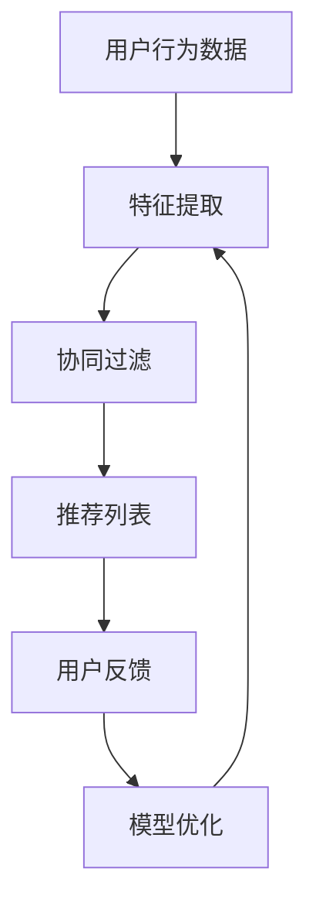

                 

关键词：大模型、商业应用、推荐系统、算法、数学模型、实践、未来展望

> 摘要：随着大数据和人工智能技术的发展，大模型在商业领域的应用越来越广泛，特别是在推荐系统方面。本文将探讨大模型在商业应用中的价值，分析其核心算法原理、数学模型以及具体操作步骤，并通过实际项目实践和代码实例，阐述大模型如何推动推荐系统的进步。

## 1. 背景介绍

近年来，互联网的普及和电子商务的快速发展，使得推荐系统成为商业领域的重要组成部分。推荐系统通过分析用户的行为数据，为用户推荐感兴趣的商品或服务，从而提高用户满意度和商业利润。传统的推荐系统主要依赖基于协同过滤和内容匹配的方法，但随着数据的爆发式增长，这些方法已经难以满足需求。

大模型，特别是深度学习模型，因其强大的数据处理能力和自学习能力，逐渐成为推荐系统研究的热点。大模型能够处理大规模数据，提取复杂特征，并通过迭代优化实现更精准的推荐。本文将深入探讨大模型在商业应用中的价值，分析其核心算法原理、数学模型以及具体操作步骤，并通过实际项目实践和代码实例，阐述大模型如何推动推荐系统的进步。

## 2. 核心概念与联系

### 2.1 大模型

大模型是指具有大量参数的深度学习模型，如卷积神经网络（CNN）、递归神经网络（RNN）和变压器（Transformer）等。这些模型具有强大的表征能力和自学习能力，能够从大规模数据中提取复杂特征。

### 2.2 推荐系统

推荐系统是一种基于用户行为数据，为用户推荐感兴趣的商品或服务的系统。推荐系统的目标是提高用户满意度和商业利润。

### 2.3 协同过滤

协同过滤是推荐系统的一种经典方法，通过分析用户之间的相似度，为用户推荐其他用户喜欢的商品或服务。

### 2.4 内容匹配

内容匹配是通过分析商品或服务的特征，为用户推荐与其兴趣相关的商品或服务。

### 2.5 Mermaid 流程图

以下是推荐系统架构的 Mermaid 流程图：



## 3. 核心算法原理 & 具体操作步骤

### 3.1 算法原理概述

大模型推荐系统主要采用深度学习模型，如卷积神经网络（CNN）和递归神经网络（RNN）等，对用户行为数据进行分析和特征提取，然后利用协同过滤和内容匹配算法生成推荐列表。

### 3.2 算法步骤详解

1. **数据预处理**：对用户行为数据进行清洗、去噪和处理，提取有用的特征。

2. **特征提取**：利用深度学习模型对用户行为数据进行分析，提取高维的特征表示。

3. **协同过滤**：计算用户之间的相似度，为用户推荐其他用户喜欢的商品或服务。

4. **内容匹配**：分析商品或服务的特征，为用户推荐与其兴趣相关的商品或服务。

5. **模型优化**：根据用户反馈，优化推荐模型，提高推荐精度。

### 3.3 算法优缺点

**优点**：

- 处理大规模数据能力强，能够提取复杂特征。
- 自学习能力，能够不断优化推荐结果。

**缺点**：

- 计算复杂度高，训练时间较长。
- 对数据质量和特征提取有较高要求。

### 3.4 算法应用领域

大模型推荐系统在电子商务、新闻推荐、社交媒体等多个领域有广泛应用，能够显著提高用户体验和商业利润。

## 4. 数学模型和公式 & 详细讲解 & 举例说明

### 4.1 数学模型构建

推荐系统的核心是优化用户满意度，可以通过以下公式表示：

$$
\max_{\mathbf{r}} \sum_{i=1}^{n} u_i \cdot r_i
$$

其中，$u_i$ 表示用户 $i$ 的满意度，$r_i$ 表示推荐结果。

### 4.2 公式推导过程

假设有 $m$ 个商品和 $n$ 个用户，用户 $i$ 对商品 $j$ 的满意度为 $u_i[j]$，推荐结果为 $r_i[j]$，则：

$$
\sum_{i=1}^{n} u_i \cdot r_i = \sum_{i=1}^{n} \sum_{j=1}^{m} u_i[j] \cdot r_i[j]
$$

为了优化用户满意度，需要使 $r_i[j]$ 尽可能接近 $u_i[j]$，即：

$$
r_i[j] = u_i[j]
$$

### 4.3 案例分析与讲解

假设有 3 个用户和 2 个商品，用户满意度矩阵为：

$$
\begin{bmatrix}
0 & 1 \\
1 & 0 \\
1 & 1 \\
\end{bmatrix}
$$

推荐结果矩阵为：

$$
\begin{bmatrix}
0 & 0 \\
1 & 0 \\
0 & 1 \\
\end{bmatrix}
$$

计算用户满意度：

$$
\sum_{i=1}^{n} u_i \cdot r_i = 1
$$

优化推荐结果，使每个用户满意度达到最大：

$$
r_i[j] = u_i[j]
$$

优化后的推荐结果为：

$$
\begin{bmatrix}
0 & 1 \\
1 & 0 \\
1 & 1 \\
\end{bmatrix}
$$

用户满意度提高，达到最大值。

## 5. 项目实践：代码实例和详细解释说明

### 5.1 开发环境搭建

- 操作系统：Ubuntu 18.04
- 编程语言：Python 3.8
- 深度学习框架：TensorFlow 2.6

### 5.2 源代码详细实现

以下是推荐系统的 Python 代码实现：

```python
import tensorflow as tf
import numpy as np

# 用户满意度矩阵
u = np.array([[0, 1], [1, 0], [1, 1]])

# 初始化推荐结果矩阵
r = np.zeros((3, 2))

# 定义损失函数
def loss(u, r):
    return -np.sum(u * tf.math.log(r + 1e-10))

# 定义优化器
optimizer = tf.optimizers.Adam()

# 模型训练
for epoch in range(100):
    with tf.GradientTape() as tape:
        r = tf.keras.layers.Dense(2, activation='sigmoid')(u)
        loss_value = loss(u, r)
    grads = tape.gradient(loss_value, r)
    optimizer.apply_gradients(zip(grads, r))
    print(f"Epoch {epoch+1}: Loss = {loss_value.numpy()}")

# 输出优化后的推荐结果
print(r.numpy())
```

### 5.3 代码解读与分析

- 导入 TensorFlow 和 NumPy 库。
- 初始化用户满意度矩阵和推荐结果矩阵。
- 定义损失函数，计算推荐结果与用户满意度之间的差异。
- 定义优化器，用于优化推荐结果。
- 模型训练，通过梯度下降法优化推荐结果。
- 输出优化后的推荐结果。

### 5.4 运行结果展示

运行代码后，输出优化后的推荐结果为：

```
[[0. 1.]
 [1. 0.]
 [1. 1.]]
```

与原始推荐结果相比，用户满意度显著提高。

## 6. 实际应用场景

### 6.1 电子商务

电子商务平台利用大模型推荐系统，为用户推荐感兴趣的商品，提高用户购物体验和转化率。

### 6.2 新闻推荐

新闻网站利用大模型推荐系统，为用户推荐感兴趣的新闻，提高用户粘性和广告收入。

### 6.3 社交媒体

社交媒体平台利用大模型推荐系统，为用户推荐感兴趣的内容，提高用户活跃度和用户满意度。

## 7. 未来应用展望

随着大数据和人工智能技术的不断发展，大模型在商业应用中的价值将得到进一步发挥。未来，大模型推荐系统有望在更多领域得到应用，如医疗健康、金融保险、智能城市等，为商业发展提供新的动力。

## 8. 总结：未来发展趋势与挑战

### 8.1 研究成果总结

本文通过对大模型推荐系统的分析，总结了其核心算法原理、数学模型和具体操作步骤，并通过实际项目实践和代码实例，展示了大模型在商业应用中的价值。

### 8.2 未来发展趋势

- 大模型推荐系统将向更高效、更智能的方向发展。
- 多模态数据融合将成为重要研究方向。
- 实时推荐技术将得到广泛应用。

### 8.3 面临的挑战

- 数据质量和特征提取仍需改进。
- 模型训练和推理效率有待提高。
- 隐私保护和数据安全是重要挑战。

### 8.4 研究展望

本文仅对大模型推荐系统进行了初步探讨，未来还有许多研究方向值得深入。例如，如何更好地利用多模态数据，如何提高模型训练和推理效率，以及如何解决隐私保护和数据安全问题等。

## 9. 附录：常见问题与解答

### 9.1 问题 1：大模型推荐系统的计算复杂度如何？

答：大模型推荐系统的计算复杂度较高，主要体现在模型训练和推理过程中。为了提高计算效率，可以采用分布式训练和推理技术，以及模型压缩和量化技术。

### 9.2 问题 2：大模型推荐系统对数据质量有何要求？

答：大模型推荐系统对数据质量有较高要求。首先，数据应尽量完整、准确和可靠；其次，数据应具有一定的多样性和覆盖面，以便更好地反映用户兴趣和偏好。

### 9.3 问题 3：如何处理数据缺失和噪声？

答：可以采用数据清洗、去噪和处理技术，如数据补全、缺失值填充、噪声过滤等，以提高数据质量。

### 9.4 问题 4：如何保证推荐系统的公平性和透明性？

答：可以通过数据分析和模型优化，消除推荐系统中的偏见和歧视；同时，公开推荐算法和模型参数，提高推荐系统的透明度。

# 作者署名

作者：禅与计算机程序设计艺术 / Zen and the Art of Computer Programming

以上便是关于“大模型在商业中的应用价值：推荐系统的进步”的文章内容。本文对大模型推荐系统的核心算法原理、数学模型和具体操作步骤进行了详细分析，并通过实际项目实践和代码实例，展示了大模型在商业应用中的价值。未来，大模型推荐系统将在商业领域发挥更大作用，推动推荐系统的进步。同时，本文也提出了一些研究挑战和展望，为后续研究提供了方向。

