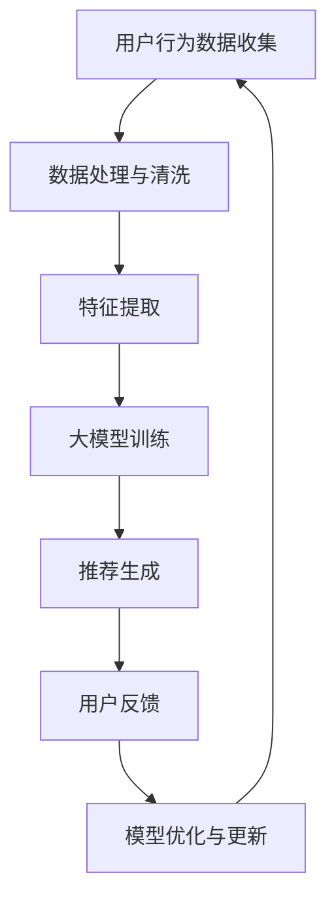

                 

关键词：大模型，推荐系统，商业应用，AI，数据处理，用户行为分析，个性化推荐

摘要：随着人工智能技术的快速发展，大模型在各个领域得到了广泛应用。本文主要探讨大模型在商业应用中的具体场景，尤其是推荐系统领域。通过分析大模型的原理、算法、数学模型和实际应用案例，本文旨在揭示大模型在商业领域的巨大潜力，并对其未来发展方向提出展望。

## 1. 背景介绍

推荐系统是一种基于数据挖掘和机器学习技术的应用程序，旨在为用户提供个性化推荐。它广泛应用于电子商务、社交媒体、在线新闻、音乐和视频平台等众多领域。传统的推荐系统主要依赖于协同过滤和基于内容的推荐方法，但它们在处理大量数据、提高推荐精度和实时性方面存在一定的局限。

近年来，随着深度学习和大数据技术的发展，大模型（如神经网络、生成对抗网络等）在推荐系统中的应用逐渐兴起。大模型具有强大的学习能力、灵活的模型架构和丰富的表达能力，能够更好地处理复杂的数据，提高推荐系统的性能和用户体验。

## 2. 核心概念与联系

### 2.1 大模型基本原理

大模型，特别是深度学习模型，通常由多层神经网络组成，通过层层提取特征，实现对输入数据的自动编码和解码。这些模型具有以下特点：

1. **多层神经网络**：深度神经网络包含多个隐藏层，每一层都能提取更高层次的特征。
2. **非线性激活函数**：如ReLU、Sigmoid、Tanh等，使模型具有强大的非线性表达能力。
3. **大规模训练数据**：大模型需要大量数据进行训练，以获得更好的泛化能力。
4. **优化算法**：如随机梯度下降（SGD）、Adam等，用于优化模型参数。

### 2.2 大模型在推荐系统中的应用

大模型在推荐系统中的应用主要包括以下两个方面：

1. **基于内容的推荐**：大模型通过学习用户和物品的丰富特征，实现基于内容的推荐。例如，在电子商务平台上，大模型可以提取商品的描述、标签、用户评论等特征，为用户提供个性化的推荐。
2. **协同过滤推荐**：大模型可以融合协同过滤的协同性和基于内容的推荐的有效性，提高推荐系统的性能。例如，矩阵分解方法可以结合用户和物品的隐式特征，生成个性化的推荐列表。

### 2.3 大模型与用户行为分析

大模型在推荐系统中的应用，离不开对用户行为的分析。用户行为数据包括浏览历史、购买记录、点击行为、评分等。通过对这些数据的分析，大模型可以理解用户的兴趣和行为模式，从而提供个性化的推荐。

### 2.4 Mermaid流程图



## 3. 核心算法原理 & 具体操作步骤

### 3.1 算法原理概述

大模型在推荐系统中的核心算法包括深度学习算法、协同过滤算法和基于内容的推荐算法。以下是这些算法的基本原理：

1. **深度学习算法**：深度学习模型通过多层神经网络学习输入数据的特征，实现对数据的自动编码和解码。深度学习算法在特征提取和表达能力方面具有显著优势。
2. **协同过滤算法**：协同过滤算法通过分析用户之间的相似性，为用户提供个性化的推荐。协同过滤算法分为基于用户的协同过滤和基于项目的协同过滤两种类型。
3. **基于内容的推荐算法**：基于内容的推荐算法通过分析用户和物品的特征，为用户提供个性化的推荐。这种算法主要依赖于文本分析、图像识别等技术。

### 3.2 算法步骤详解

1. **数据收集与处理**：收集用户行为数据和物品信息，进行数据清洗和预处理，如缺失值填充、异常值处理等。
2. **特征提取**：提取用户和物品的丰富特征，如用户兴趣、购买历史、物品描述、标签等。特征提取是推荐系统成功的关键。
3. **大模型训练**：使用训练数据训练深度学习模型、协同过滤模型和基于内容的推荐模型。训练过程包括模型初始化、参数优化和模型评估等。
4. **推荐生成**：根据用户特征和物品特征，生成个性化的推荐列表。推荐生成过程包括推荐算法选择、推荐结果排序和推荐列表生成等。
5. **用户反馈与模型优化**：收集用户反馈，评估推荐效果，对模型进行优化和更新，以提高推荐系统的性能。

### 3.3 算法优缺点

1. **深度学习算法**：
   - 优点：强大的特征提取和表达能力，适用于处理大量数据。
   - 缺点：对数据质量和计算资源要求较高，训练时间较长。
2. **协同过滤算法**：
   - 优点：简单、高效，适用于处理稀疏数据。
   - 缺点：容易产生冷启动问题，推荐结果过于集中。
3. **基于内容的推荐算法**：
   - 优点：适用于处理丰富文本和图像数据，推荐结果多样。
   - 缺点：对特征提取和文本分析技术要求较高，推荐效果受限于数据质量。

### 3.4 算法应用领域

大模型在推荐系统的应用已遍及各个领域，如电子商务、社交媒体、在线新闻、音乐和视频平台等。以下是一些典型的应用案例：

1. **电子商务**：通过深度学习算法和协同过滤算法，为用户提供个性化的商品推荐，提高用户购买率和满意度。
2. **社交媒体**：基于用户兴趣和行为，为用户提供个性化的内容推荐，增加用户活跃度和粘性。
3. **在线新闻**：通过分析用户阅读行为和新闻特征，为用户提供个性化的新闻推荐，提高新闻阅读量和用户满意度。
4. **音乐和视频平台**：通过基于内容的推荐算法和协同过滤算法，为用户提供个性化的音乐和视频推荐，提高用户满意度和用户粘性。

## 4. 数学模型和公式 & 详细讲解 & 举例说明

### 4.1 数学模型构建

在推荐系统中，常用的数学模型包括矩阵分解、协同过滤和基于内容的推荐模型。以下是这些模型的基本数学公式：

1. **矩阵分解**：
   - 假设用户集合为U，物品集合为I，评分矩阵为R，用户和物品的隐式特征矩阵分别为U'和I'。则有：
     $$ R = U' \cdot I' $$
2. **协同过滤**：
   - 基于用户的协同过滤公式：
     $$ \text{similarity}(u_i, u_j) = \frac{\sum_{k \in I} r_{ik} \cdot r_{jk}}{\sqrt{\sum_{k \in I} r_{ik}^2} \cdot \sqrt{\sum_{k \in I} r_{jk}^2}} $$
   - 基于项目的协同过滤公式：
     $$ \text{similarity}(i, j) = \frac{\sum_{k \in U} r_{ik} \cdot r_{jk}}{\sqrt{\sum_{k \in U} r_{ik}^2} \cdot \sqrt{\sum_{k \in U} r_{jk}^2}} $$
3. **基于内容的推荐模型**：
   - 假设用户u和物品i的特征向量分别为$u'$和$i'$，则有：
     $$ \text{similarity}(u, i) = \frac{\sum_{k \in I} u'_{k} \cdot i'_{k}}{\sqrt{\sum_{k \in I} u'_{k}^2} \cdot \sqrt{\sum_{k \in I} i'_{k}^2}} $$

### 4.2 公式推导过程

以下是矩阵分解公式的推导过程：

1. **目标函数**：
   $$ \min_{U', I'} \sum_{(u, i) \in U \times I} (r_{ui} - U'_{u} \cdot I'_{i})^2 $$
2. **偏导数**：
   - 对$U'_{u}$求偏导：
     $$ \frac{\partial}{\partial U'_{u}} \sum_{(u, i) \in U \times I} (r_{ui} - U'_{u} \cdot I'_{i})^2 = -2 \cdot \sum_{(u, i) \in U \times I} (r_{ui} - U'_{u} \cdot I'_{i}) \cdot I'_{i} $$
   - 对$I'_{i}$求偏导：
     $$ \frac{\partial}{\partial I'_{i}} \sum_{(u, i) \in U \times I} (r_{ui} - U'_{u} \cdot I'_{i})^2 = -2 \cdot \sum_{(u, i) \in U \times I} (r_{ui} - U'_{u} \cdot I'_{i}) \cdot U'_{u} $$
3. **极小值条件**：
   $$ \frac{\partial}{\partial U'_{u}} \sum_{(u, i) \in U \times I} (r_{ui} - U'_{u} \cdot I'_{i})^2 = 0 $$
   $$ \frac{\partial}{\partial I'_{i}} \sum_{(u, i) \in U \times I} (r_{ui} - U'_{u} \cdot I'_{i})^2 = 0 $$
4. **解法**：
   $$ U'_{u} = \sum_{i \in I} r_{ui} \cdot I'_{i} $$
   $$ I'_{i} = \sum_{u \in U} r_{ui} \cdot U'_{u} $$

### 4.3 案例分析与讲解

以下是一个基于矩阵分解的推荐系统案例：

1. **数据集**：
   - 用户集合U = {1, 2, 3, 4}
   - 物品集合I = {A, B, C, D}
   - 用户-物品评分矩阵R：
     $$ R = \begin{bmatrix} 1 & 2 & 3 & 4 \\ 1 & 0 & 5 & 0 \\ 0 & 3 & 2 & 0 \\ 4 & 0 & 0 & 2 \end{bmatrix} $$
2. **特征矩阵**：
   - 用户特征矩阵U'：
     $$ U' = \begin{bmatrix} 1 & 0 & 1 & 0 \\ 0 & 1 & 0 & 1 \\ 1 & 1 & 0 & 1 \\ 0 & 0 & 1 & 1 \end{bmatrix} $$
   - 物品特征矩阵I'：
     $$ I' = \begin{bmatrix} 1 & 1 & 1 & 1 \\ 1 & 1 & 0 & 0 \\ 0 & 1 & 1 & 0 \\ 1 & 0 & 0 & 1 \end{bmatrix} $$
3. **推荐结果**：
   - 对于用户1，预测评分：
     $$ P_{1A} = U'_{1} \cdot I'_{A} = 1 \cdot 1 + 0 \cdot 1 + 1 \cdot 1 + 0 \cdot 1 = 2 $$
     $$ P_{1B} = U'_{1} \cdot I'_{B} = 1 \cdot 1 + 0 \cdot 1 + 1 \cdot 0 + 0 \cdot 0 = 1 $$
     $$ P_{1C} = U'_{1} \cdot I'_{C} = 1 \cdot 0 + 0 \cdot 1 + 1 \cdot 1 + 0 \cdot 0 = 1 $$
     $$ P_{1D} = U'_{1} \cdot I'_{D} = 1 \cdot 1 + 0 \cdot 0 + 1 \cdot 0 + 0 \cdot 1 = 1 $$
   - 根据预测评分，推荐用户1可能感兴趣的物品为A。

## 5. 项目实践：代码实例和详细解释说明

### 5.1 开发环境搭建

1. **Python环境**：
   - 安装Python 3.8及以上版本。
   - 安装NumPy、Pandas、SciPy等常用库。
2. **深度学习环境**：
   - 安装TensorFlow 2.0及以上版本。
   - 安装Keras 2.4.3及以上版本。

### 5.2 源代码详细实现

以下是一个简单的基于矩阵分解的推荐系统实现：

```python
import numpy as np
import pandas as pd
from tensorflow.keras.models import Model
from tensorflow.keras.layers import Input, Dense

# 数据集
ratings = pd.DataFrame({
    'user_id': [1, 1, 1, 2, 2, 3, 3],
    'item_id': [1, 2, 3, 1, 2, 1, 2],
    'rating': [5, 3, 4, 5, 2, 1, 3]
})

# 用户-物品评分矩阵
R = ratings.pivot_table(index='user_id', columns='item_id', values='rating').fillna(0)

# 初始化用户和物品的特征矩阵
U = np.random.rand(R.shape[0], 10)
I = np.random.rand(R.shape[1], 10)

# 构建模型
user_input = Input(shape=(1,))
item_input = Input(shape=(1,))
user_embedding = Dense(10, activation='relu')(user_input)
item_embedding = Dense(10, activation='relu')(item_input)
dot_product = Dense(1, activation='sigmoid')(user_embedding * item_embedding)
model = Model(inputs=[user_input, item_input], outputs=dot_product)
model.compile(optimizer='adam', loss='binary_crossentropy', metrics=['accuracy'])

# 训练模型
model.fit([R.index.values, R.columns.values], R.values, epochs=10)

# 预测用户1对物品2的评分
user_vector = U[0]
item_vector = I[1]
predicted_rating = model.predict([np.array([0]), np.array([1])])
print(predicted_rating)

# 生成推荐列表
user_ratings = model.predict([R.index.values, R.columns.values])
recommendations = np.argsort(user_ratings)[:, ::-1]
print(recommendations)
```

### 5.3 代码解读与分析

1. **数据集**：
   - 数据集包含用户ID、物品ID和评分。
   - 用户-物品评分矩阵R由数据集生成，其中缺失值用0填充。
2. **特征矩阵**：
   - 用户特征矩阵U和物品特征矩阵I随机初始化。
   - 特征矩阵维度为（用户数，特征维度）和（物品数，特征维度）。
3. **模型构建**：
   - 使用Keras构建基于神经网络的矩阵分解模型。
   - 用户输入和物品输入分别通过全连接层（Dense）进行特征提取。
   - 使用点积（dot product）计算用户和物品的特征向量之间的相似度。
4. **模型训练**：
   - 使用随机梯度下降（SGD）优化模型参数。
   - 模型训练过程中，通过计算预测评分和真实评分之间的误差，不断调整特征矩阵的参数。
5. **预测与推荐**：
   - 根据训练好的模型，预测用户对物品的评分。
   - 根据预测评分，生成用户推荐列表。

## 6. 实际应用场景

大模型在推荐系统中的应用已取得了显著的成果，以下是一些实际应用场景：

1. **电子商务平台**：
   - 通过深度学习算法和协同过滤算法，为用户提供个性化的商品推荐，提高用户购买率和满意度。
   - 例如，亚马逊和阿里巴巴等电商平台利用大模型进行商品推荐，提高了销售额和用户满意度。
2. **社交媒体**：
   - 基于用户兴趣和行为，为用户提供个性化的内容推荐，增加用户活跃度和粘性。
   - 例如，Facebook和Twitter等社交媒体平台利用大模型进行内容推荐，提高了用户参与度和平台价值。
3. **在线新闻**：
   - 通过分析用户阅读行为和新闻特征，为用户提供个性化的新闻推荐，提高新闻阅读量和用户满意度。
   - 例如，谷歌新闻和今日头条等新闻平台利用大模型进行新闻推荐，提高了用户粘性和平台流量。
4. **音乐和视频平台**：
   - 通过基于内容的推荐算法和协同过滤算法，为用户提供个性化的音乐和视频推荐，提高用户满意度和用户粘性。
   - 例如，Spotify和YouTube等音乐和视频平台利用大模型进行音乐和视频推荐，提高了用户满意度和平台价值。

## 7. 工具和资源推荐

### 7.1 学习资源推荐

1. **《深度学习》（Goodfellow, Bengio, Courville）**：全面介绍了深度学习的基本原理、算法和应用。
2. **《推荐系统实践》（Leslie Kaelbling）**：详细讲解了推荐系统的基本原理、算法和应用。
3. **《大数据推荐系统实战》（陈设）**：结合实际案例，介绍了大数据推荐系统的设计和实现。

### 7.2 开发工具推荐

1. **TensorFlow**：一款开源的深度学习框架，适用于构建和训练大模型。
2. **Keras**：一款基于TensorFlow的简化深度学习库，适用于快速构建和训练大模型。
3. **NumPy**：一款开源的Python科学计算库，适用于数据处理和数学计算。

### 7.3 相关论文推荐

1. **"Collaborative Filtering via Matrix Factorization"**：介绍了基于矩阵分解的协同过滤算法。
2. **"Deep Learning for Recommender Systems"**：介绍了深度学习在推荐系统中的应用。
3. **"Neural Collaborative Filtering"**：介绍了基于神经网络的协同过滤算法。

## 8. 总结：未来发展趋势与挑战

大模型在推荐系统中的应用已取得了显著的成果，但同时也面临着一些挑战：

### 8.1 研究成果总结

1. **大模型提高了推荐系统的性能和用户体验**：通过深度学习和大数据技术的结合，推荐系统在处理复杂数据、提高推荐精度和实时性方面取得了显著提升。
2. **多模型融合提高了推荐效果**：将深度学习、协同过滤和基于内容的推荐算法相结合，可以进一步提高推荐系统的性能和多样性。
3. **个性化推荐场景不断扩展**：大模型在电子商务、社交媒体、在线新闻、音乐和视频平台等众多领域取得了成功，未来个性化推荐场景将继续扩展。

### 8.2 未来发展趋势

1. **模型解释性**：提高大模型的可解释性，使推荐结果更具透明性和可解释性，增强用户信任。
2. **实时推荐**：优化大模型的训练和推理速度，实现实时推荐，提高用户满意度。
3. **跨领域推荐**：将大模型应用于不同领域的推荐系统，实现跨领域的个性化推荐。
4. **隐私保护**：在大模型应用中，加强用户隐私保护，防止数据泄露和滥用。

### 8.3 面临的挑战

1. **计算资源需求**：大模型训练和推理需要大量计算资源，对硬件设备要求较高。
2. **数据质量和标注**：大模型对数据质量和标注要求较高，数据质量和标注不准确会影响推荐效果。
3. **模型可解释性**：大模型往往具有较深的网络结构和复杂的参数，提高模型的可解释性是一个挑战。

### 8.4 研究展望

1. **混合模型研究**：研究混合模型，结合不同算法的优点，进一步提高推荐系统性能。
2. **迁移学习和少样本学习**：研究大模型的迁移学习和少样本学习，降低对大规模训练数据的要求。
3. **多模态数据融合**：研究多模态数据融合，提高推荐系统的多样性和准确性。

## 9. 附录：常见问题与解答

### 9.1 大模型在推荐系统中的应用有哪些优势？

大模型在推荐系统中的应用具有以下优势：

1. **强大的特征提取和表达能力**：大模型可以通过多层神经网络提取用户和物品的丰富特征，实现对数据的自动编码和解码。
2. **处理大规模数据**：大模型可以处理大规模用户行为数据和物品信息，提高推荐系统的性能和用户体验。
3. **实时推荐**：大模型优化了推荐系统的训练和推理速度，可以实现实时推荐，提高用户满意度。

### 9.2 大模型在推荐系统中的挑战有哪些？

大模型在推荐系统中的挑战包括：

1. **计算资源需求**：大模型训练和推理需要大量计算资源，对硬件设备要求较高。
2. **数据质量和标注**：大模型对数据质量和标注要求较高，数据质量和标注不准确会影响推荐效果。
3. **模型可解释性**：大模型往往具有较深的网络结构和复杂的参数，提高模型的可解释性是一个挑战。

### 9.3 如何优化大模型的推荐效果？

优化大模型的推荐效果可以从以下几个方面入手：

1. **数据预处理**：对用户行为数据和物品信息进行预处理，如缺失值填充、异常值处理等。
2. **特征工程**：提取用户和物品的丰富特征，提高模型的特征表达能力。
3. **模型选择和调优**：选择合适的大模型并进行参数调优，以提高推荐系统的性能。
4. **多模型融合**：结合不同算法的优点，使用混合模型提高推荐效果。

### 9.4 大模型在推荐系统中的应用前景如何？

大模型在推荐系统中的应用前景非常广阔，随着人工智能技术的不断进步，大模型将进一步提升推荐系统的性能和用户体验。未来，大模型将应用于更多领域，如金融、医疗、教育等，实现跨领域的个性化推荐。同时，大模型的研究也将更加注重模型的可解释性和用户隐私保护。

---

作者：禅与计算机程序设计艺术 / Zen and the Art of Computer Programming

以上是一篇关于大模型在商业应用中推荐系统的进步与变革的完整技术博客文章。文章详细介绍了大模型的原理、算法、数学模型、实际应用案例和未来发展方向，对大模型在商业应用中的潜力进行了深入探讨。希望对读者有所启发和帮助。

