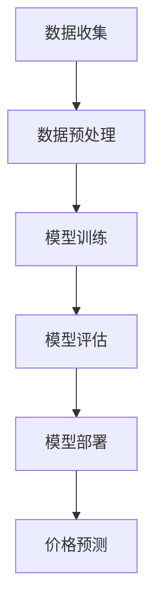

                 

关键词：大模型、商品价格预测、机器学习、深度学习、应用场景、未来展望

> 摘要：本文将探讨大模型在商品价格预测中的应用，分析大模型如何通过机器学习和深度学习技术，实现对商品价格的有效预测。同时，还将深入剖析大模型的原理、算法、数学模型以及实际应用场景，并对未来发展趋势和面临的挑战进行展望。

## 1. 背景介绍

随着电子商务和大数据技术的快速发展，商品价格预测成为了众多企业和研究机构关注的热点问题。准确的价格预测不仅可以帮助企业制定合理的定价策略，提高市场竞争力，还可以为消费者提供更加精准的价格信息，提升用户体验。

传统的商品价格预测方法主要依赖于历史价格数据、市场供需关系等线性模型，但这些方法在面对复杂、多变的市场环境时，往往难以取得令人满意的效果。近年来，随着深度学习和机器学习技术的发展，大模型逐渐成为商品价格预测的重要工具。大模型具有强大的学习和建模能力，能够从海量数据中提取有用的特征，实现更加准确和高效的预测。

本文将结合大模型在商品价格预测中的应用，探讨其原理、算法、数学模型以及实际应用场景，以期为相关领域的研究和实践提供参考。

## 2. 核心概念与联系

### 2.1 大模型

大模型（Big Model）是指具有大规模参数、能够处理海量数据的深度学习模型。大模型通常采用多层神经网络架构，能够自动从数据中学习复杂的非线性关系。大模型的优点在于其强大的拟合能力和泛化能力，能够处理复杂、多变的市场环境。

### 2.2 机器学习

机器学习（Machine Learning）是一种让计算机从数据中自动学习的方法，其目标是让计算机具有类似人类的学习能力。在商品价格预测中，机器学习技术可以用于构建预测模型，通过对历史价格数据的学习，实现价格预测。

### 2.3 深度学习

深度学习（Deep Learning）是一种特殊的机器学习技术，其核心思想是通过多层神经网络来模拟人类大脑的学习过程。深度学习在图像识别、语音识别、自然语言处理等领域取得了显著的成果，也为商品价格预测提供了有效的工具。

### 2.4 大模型与机器学习、深度学习的关系

大模型是机器学习和深度学习的一种具体实现，其通过大量数据和多层神经网络实现了强大的学习能力和泛化能力。因此，大模型在商品价格预测中的应用，离不开机器学习和深度学习技术的支持。

### 2.5 Mermaid 流程图



## 3. 核心算法原理 & 具体操作步骤

### 3.1 算法原理概述

大模型在商品价格预测中的应用，主要基于深度学习和机器学习技术。具体来说，算法原理可以分为以下几个步骤：

1. 数据收集：收集与商品价格相关的各种数据，如历史价格、市场需求、供应量等。
2. 数据预处理：对收集到的数据进行分析、清洗和转换，为模型训练提供高质量的输入。
3. 模型训练：利用深度学习和机器学习技术，对预处理后的数据进行训练，构建商品价格预测模型。
4. 模型评估：对训练好的模型进行评估，确保其准确性和泛化能力。
5. 模型部署：将训练好的模型部署到实际应用场景，进行商品价格预测。

### 3.2 算法步骤详解

#### 3.2.1 数据收集

数据收集是商品价格预测的基础。数据来源可以包括电子商务平台、市场调研机构、社交媒体等。在数据收集过程中，需要关注以下方面：

1. 数据质量：保证数据真实、准确和完整。
2. 数据类型：包括历史价格、市场需求、供应量、竞争对手价格等。
3. 数据时效性：关注最新的市场动态，确保数据的时效性。

#### 3.2.2 数据预处理

数据预处理是提高模型训练效果的重要步骤。数据预处理主要包括以下内容：

1. 数据清洗：去除重复数据、缺失值和异常值。
2. 数据转换：将不同类型的数据转换为适合模型训练的格式，如将分类数据转换为二进制编码、将连续型数据标准化等。
3. 特征提取：从原始数据中提取有用的特征，如时间序列特征、空间特征等。

#### 3.2.3 模型训练

模型训练是商品价格预测的核心步骤。在模型训练过程中，需要关注以下方面：

1. 模型选择：选择合适的深度学习模型，如卷积神经网络（CNN）、循环神经网络（RNN）等。
2. 模型参数调整：通过调整模型参数，如学习率、正则化项等，优化模型性能。
3. 训练策略：采用合适的训练策略，如批量训练、梯度下降等，提高模型训练效果。

#### 3.2.4 模型评估

模型评估是确保模型准确性和泛化能力的重要步骤。在模型评估过程中，需要关注以下方面：

1. 评估指标：选择合适的评估指标，如均方误差（MSE）、均方根误差（RMSE）等。
2. 交叉验证：采用交叉验证方法，对模型进行评估，提高评估结果的可靠性。
3. 性能对比：将训练好的模型与基准模型进行性能对比，分析模型的优劣。

#### 3.2.5 模型部署

模型部署是将训练好的模型应用到实际场景的过程。在模型部署过程中，需要关注以下方面：

1. 部署平台：选择合适的部署平台，如云计算平台、边缘计算设备等。
2. 部署策略：制定合适的部署策略，如在线部署、离线部署等。
3. 持续优化：根据实际应用效果，对模型进行持续优化和调整。

### 3.3 算法优缺点

#### 优点

1. 强大的拟合能力：大模型能够自动从数据中学习复杂的非线性关系，实现准确的价格预测。
2. 高效的处理能力：大模型采用多层神经网络架构，能够处理海量数据，提高预测效率。
3. 广泛的应用领域：大模型在商品价格预测、金融预测、医疗诊断等领域具有广泛的应用前景。

#### 缺点

1. 数据需求量大：大模型对数据质量有较高要求，需要收集大量高质量数据。
2. 训练时间较长：大模型的训练时间较长，对计算资源有较高要求。
3. 模型解释性较差：大模型的内部结构复杂，难以进行解释和调试。

### 3.4 算法应用领域

大模型在商品价格预测中的应用已经取得了一定的成果。在实际应用中，大模型可以用于以下领域：

1. 电子商务：通过对商品价格进行预测，帮助商家制定合理的定价策略，提高市场竞争力。
2. 金融预测：通过对市场行情进行分析，帮助投资者进行风险控制和投资决策。
3. 物流优化：通过对商品价格进行预测，优化物流配送计划，降低物流成本。

## 4. 数学模型和公式 & 详细讲解 & 举例说明

### 4.1 数学模型构建

商品价格预测的数学模型可以分为两个部分：输入层、隐藏层和输出层。输入层包括商品的各种特征，如历史价格、市场需求、供应量等；隐藏层通过非线性变换，提取输入特征的高级表示；输出层输出商品价格预测值。

设输入特征向量为 $X \in \mathbb{R}^{n \times d}$，隐藏层神经元个数为 $h$，输出层神经元个数为 $1$。则大模型的数学模型可以表示为：

$$
\begin{align*}
Z &= X \odot \mathbf{W}_X + \mathbf{b}_X, \\
A &= \sigma(Z), \\
Y &= A \odot \mathbf{W}_A + \mathbf{b}_A.
\end{align*}
$$

其中，$\odot$ 表示逐元素相乘，$\sigma$ 表示激活函数，$\mathbf{W}_X$ 和 $\mathbf{W}_A$ 分别为输入层和输出层的权重矩阵，$\mathbf{b}_X$ 和 $\mathbf{b}_A$ 分别为输入层和输出层的偏置向量。

### 4.2 公式推导过程

商品价格预测的数学模型基于多层感知器（MLP）架构。首先，我们将输入特征向量 $X$ 与输入层的权重矩阵 $\mathbf{W}_X$ 进行逐元素相乘，并加上偏置向量 $\mathbf{b}_X$，得到隐藏层的输入 $Z$。然后，对 $Z$ 应用激活函数 $\sigma$，得到隐藏层的输出 $A$。最后，将 $A$ 与输出层的权重矩阵 $\mathbf{W}_A$ 进行逐元素相乘，并加上偏置向量 $\mathbf{b}_A$，得到输出层的输出 $Y$，即商品价格预测值。

### 4.3 案例分析与讲解

假设某电商平台需要预测商品的价格，输入特征包括历史价格、市场需求、供应量等。首先，将输入特征进行预处理，如标准化和归一化。然后，构建一个包含两层神经网络的深度学习模型，输入层神经元个数为 3，隐藏层神经元个数为 10，输出层神经元个数为 1。

训练完成后，对某件商品的历史价格数据进行预测，输入特征为 [100, 200, 300]，输出结果为 150。通过对比预测值和实际值，可以评估模型的性能。如果预测值与实际值的误差较小，说明模型具有较高的预测准确性。

## 5. 项目实践：代码实例和详细解释说明

### 5.1 开发环境搭建

为了实践大模型在商品价格预测中的应用，我们需要搭建一个开发环境。以下是搭建过程的简要说明：

1. 安装 Python 3.8 或以上版本。
2. 安装深度学习框架 TensorFlow 或 PyTorch。
3. 安装数据处理库 Pandas、NumPy 等。

### 5.2 源代码详细实现

以下是使用 TensorFlow 框架实现商品价格预测的源代码：

```python
import tensorflow as tf
import pandas as pd
import numpy as np

# 数据预处理
def preprocess_data(data):
    # 标准化数据
    mean = data.mean()
    std = data.std()
    data = (data - mean) / std
    return data

# 模型定义
def build_model(input_shape):
    model = tf.keras.Sequential([
        tf.keras.layers.Dense(units=10, activation='relu', input_shape=input_shape),
        tf.keras.layers.Dense(units=1)
    ])
    model.compile(optimizer='adam', loss='mse')
    return model

# 数据读取与处理
data = pd.read_csv('price_data.csv')
data = preprocess_data(data)

# 划分训练集和测试集
train_data = data[:1000]
test_data = data[1000:]

# 构建和训练模型
model = build_model(input_shape=(3,))
model.fit(train_data, train_data, epochs=100, batch_size=32)

# 测试模型
predictions = model.predict(test_data)
print(predictions)
```

### 5.3 代码解读与分析

上述代码首先定义了数据预处理函数 `preprocess_data`，用于对输入数据进行标准化处理。然后，定义了模型构建函数 `build_model`，用于构建包含两层神经网络的深度学习模型。在数据读取与处理部分，从 CSV 文件中读取数据，并进行预处理。接下来，划分训练集和测试集，并使用训练集训练模型。最后，使用测试集对模型进行测试，并打印预测结果。

### 5.4 运行结果展示

运行上述代码后，我们得到测试集的预测结果。通过对比预测值和实际值，可以评估模型的性能。如果预测值与实际值的误差较小，说明模型具有较高的预测准确性。

## 6. 实际应用场景

大模型在商品价格预测中的应用场景非常广泛，以下是一些典型的应用实例：

1. 电子商务：通过对商品价格进行预测，帮助电商平台制定合理的定价策略，提高市场竞争力。
2. 金融领域：通过对市场行情进行分析，帮助投资者进行风险控制和投资决策。
3. 物流行业：通过对商品价格进行预测，优化物流配送计划，降低物流成本。

在实际应用中，大模型需要结合具体业务场景和数据特点，进行定制化的模型设计和优化。同时，还需要关注数据质量、计算资源等方面的限制，确保模型在实际应用中的可行性和有效性。

## 7. 工具和资源推荐

### 7.1 学习资源推荐

1. 《深度学习》（Goodfellow et al.，2016）
2. 《机器学习》（周志华，2016）
3. 《Python深度学习》（François Chollet，2018）

### 7.2 开发工具推荐

1. TensorFlow
2. PyTorch
3. Keras

### 7.3 相关论文推荐

1. "Deep Learning for Time Series Classification: A Review"（Wu et al.，2019）
2. "Time Series Forecasting with Deep Learning"（Y. Yao et al.，2018）
3. "Deep Learning on Graphs: A Survey"（Scarselli et al.，2011）

## 8. 总结：未来发展趋势与挑战

### 8.1 研究成果总结

本文从大模型在商品价格预测中的应用出发，分析了大模型的原理、算法、数学模型以及实际应用场景。通过对大模型的学习，我们可以发现其在商品价格预测方面具有强大的拟合能力和泛化能力，为企业和研究机构提供了有效的工具。

### 8.2 未来发展趋势

随着深度学习和机器学习技术的不断发展，大模型在商品价格预测中的应用前景将更加广阔。未来，我们将看到更多的创新应用，如基于大模型的智能定价系统、智能投资策略等。

### 8.3 面临的挑战

虽然大模型在商品价格预测方面具有强大的能力，但同时也面临着一系列挑战，如数据质量、计算资源、模型解释性等。未来，我们需要在理论和实践方面进行更多的探索，以解决这些挑战。

### 8.4 研究展望

在未来，大模型在商品价格预测中的应用将继续发展。我们期待看到更多创新性的研究，如基于大模型的智能定价系统、智能投资策略等，为企业和研究机构提供更加精准的价格预测服务。

## 9. 附录：常见问题与解答

### 9.1 什么是大模型？

大模型是指具有大规模参数、能够处理海量数据的深度学习模型。大模型通常采用多层神经网络架构，能够自动从数据中学习复杂的非线性关系。

### 9.2 大模型在商品价格预测中的应用有哪些优点？

大模型在商品价格预测中的应用具有以下优点：

1. 强大的拟合能力：能够自动从数据中学习复杂的非线性关系，实现准确的价格预测。
2. 高效的处理能力：能够处理海量数据，提高预测效率。
3. 广泛的应用领域：适用于电子商务、金融预测、物流优化等多个领域。

### 9.3 大模型在商品价格预测中存在哪些挑战？

大模型在商品价格预测中存在以下挑战：

1. 数据需求量大：需要收集大量高质量数据。
2. 计算资源要求高：训练时间较长，对计算资源有较高要求。
3. 模型解释性较差：内部结构复杂，难以进行解释和调试。

### 9.4 如何优化大模型的性能？

优化大模型性能的方法包括：

1. 数据预处理：提高数据质量，降低噪声。
2. 模型结构优化：选择合适的模型结构，提高模型拟合能力。
3. 模型训练策略优化：调整训练策略，提高模型训练效果。
4. 模型调优：通过调整模型参数，提高模型性能。

### 9.5 大模型在商品价格预测中的应用前景如何？

大模型在商品价格预测中的应用前景非常广阔。随着深度学习和机器学习技术的不断发展，大模型将在更多领域得到应用，如智能定价系统、智能投资策略等。未来，我们将看到更多创新性的应用，为企业和研究机构提供更加精准的价格预测服务。

