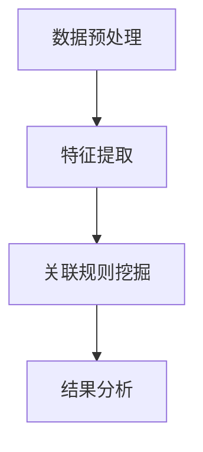

                 

关键词：大模型，商品关联规则挖掘，效率提升，算法原理，数学模型，实际应用

## 摘要

本文主要探讨大模型在商品关联规则挖掘中的效率提升应用。随着大数据和人工智能技术的不断发展，商品关联规则挖掘成为商业领域的关键技术。本文首先介绍了商品关联规则挖掘的基本概念和重要性，然后深入分析了大模型在挖掘过程中的优势。接着，我们详细阐述了大模型的算法原理和数学模型，并通过一个具体案例展示了大模型在商品关联规则挖掘中的实际应用。最后，我们对未来大模型在商品关联规则挖掘中的应用前景进行了展望。

## 1. 背景介绍

随着互联网的普及和电子商务的快速发展，商品数据呈现爆炸式增长。这些数据包含了大量关于商品属性、价格、销量、用户评价等信息。如何从这些海量数据中挖掘出有价值的信息，一直是学术界和工业界研究的热点。商品关联规则挖掘作为一种重要的数据分析方法，通过发现商品之间的关联关系，为商业决策提供有力支持。

传统的商品关联规则挖掘方法主要基于Apriori算法、FP-Growth算法等。这些算法虽然能够有效挖掘商品之间的关联关系，但在处理大规模数据集时，存在计算复杂度高、效率低等问题。因此，如何提升商品关联规则挖掘的效率成为当前研究的关键挑战。

## 2. 核心概念与联系

### 2.1 大模型的概念

大模型，也称为深度学习模型，是一种能够自动从大量数据中学习复杂特征和模式的神经网络模型。大模型具有以下几个特点：

- **大规模参数**：大模型通常包含数十亿甚至数万亿个参数，这使得它们能够处理大规模数据集。
- **多层神经网络**：大模型通常包含多个隐藏层，这有助于提取更深层次的特征。
- **自动特征提取**：大模型能够自动学习数据中的特征，无需人工设计特征。
- **强大的泛化能力**：大模型在训练过程中能够从大量数据中学习到普遍规律，从而具有很好的泛化能力。

### 2.2 商品关联规则挖掘的概念

商品关联规则挖掘是指从商品数据中挖掘出商品之间的关联关系，形成一系列规则。这些规则可以帮助商家了解商品之间的互补性或替代性，从而优化库存、定价、营销策略等。

商品关联规则挖掘的关键步骤包括：

- **数据预处理**：对原始商品数据进行清洗、转换和整合，以便后续分析。
- **特征提取**：从商品数据中提取特征，如商品类别、品牌、价格、销量等。
- **关联规则挖掘**：使用算法从特征数据中挖掘出商品之间的关联关系。

### 2.3 大模型与商品关联规则挖掘的联系

大模型在商品关联规则挖掘中的应用主要体现在以下几个方面：

- **自动特征提取**：大模型能够自动从商品数据中提取有价值的特征，避免了传统方法中人工设计特征的繁琐过程。
- **高效计算**：大模型在处理大规模数据时，具有高效的计算能力，能够显著提升商品关联规则挖掘的效率。
- **深层次特征提取**：大模型的多层神经网络结构有助于提取商品数据中的深层次特征，从而提高关联规则挖掘的准确性。
- **模型压缩与迁移学习**：大模型可以通过模型压缩和迁移学习技术，将训练好的模型应用于其他商品领域，实现跨领域的商品关联规则挖掘。

### 2.4 Mermaid流程图

下面是一个简单的Mermaid流程图，展示了商品关联规则挖掘的基本流程。



## 3. 核心算法原理 & 具体操作步骤

### 3.1 算法原理概述

大模型在商品关联规则挖掘中的核心算法原理主要基于深度学习。深度学习是一种基于多层神经网络的学习方法，通过逐层提取数据中的特征，实现对复杂模式的识别和预测。在商品关联规则挖掘中，大模型主要利用以下原理：

- **自动特征提取**：通过多层神经网络，大模型能够自动从商品数据中提取有价值的特征，避免了传统方法中人工设计特征的繁琐过程。
- **非线性变换**：多层神经网络中的非线性变换有助于提取商品数据中的深层次特征，从而提高关联规则挖掘的准确性。
- **并行计算**：深度学习算法具有高效的并行计算能力，能够处理大规模数据集，提升商品关联规则挖掘的效率。

### 3.2 算法步骤详解

大模型在商品关联规则挖掘中的具体操作步骤如下：

1. **数据预处理**：对原始商品数据进行清洗、转换和整合，以便后续分析。这一步骤包括去除重复数据、缺失值填充、数据标准化等。
   
2. **特征提取**：利用大模型自动从商品数据中提取有价值的特征。具体方法包括：
   - **卷积神经网络（CNN）**：适用于处理图像数据，可以提取商品图片中的特征。
   - **循环神经网络（RNN）**：适用于处理序列数据，可以提取商品销量、用户评价等时间序列特征。
   - **自注意力机制**：可以自动关注商品数据中的重要特征，提高特征提取的效率。

3. **关联规则挖掘**：利用大模型提取的特征，使用关联规则挖掘算法（如Apriori、FP-Growth等）挖掘商品之间的关联关系。这一步骤包括：
   - **设置最小支持度和最小置信度**：根据业务需求，设置最小支持度和最小置信度，以筛选出有价值的相关规则。
   - **生成关联规则**：根据特征数据，生成一系列的关联规则，如“商品A购买时，商品B的购买概率增加”。

4. **结果分析**：对挖掘出的关联规则进行分析，评估其可信度和实用性。这一步骤包括：
   - **可视化**：将关联规则以图表形式展示，便于分析和理解。
   - **置信度评估**：对关联规则进行置信度评估，筛选出高置信度的关联规则。

### 3.3 算法优缺点

大模型在商品关联规则挖掘中具有以下优点：

- **高效计算**：大模型具有高效的并行计算能力，能够处理大规模数据集，提升商品关联规则挖掘的效率。
- **自动特征提取**：大模型能够自动从商品数据中提取有价值的特征，减少了人工设计特征的繁琐过程。
- **深层次特征提取**：多层神经网络结构有助于提取商品数据中的深层次特征，提高关联规则挖掘的准确性。

然而，大模型也存在以下缺点：

- **高计算资源需求**：大模型通常需要大量的计算资源，如GPU、CPU等，这对硬件设施要求较高。
- **数据依赖性强**：大模型的效果依赖于训练数据的质量和数量，如果数据质量不佳或数据量不足，可能会导致模型效果不佳。
- **算法复杂性**：大模型的训练和优化过程相对复杂，需要丰富的技术和经验。

### 3.4 算法应用领域

大模型在商品关联规则挖掘中的应用领域广泛，主要包括：

- **电子商务**：通过挖掘商品之间的关联关系，优化库存管理、定价策略和营销推广。
- **零售业**：通过挖掘商品之间的关联关系，实现商品组合推荐、交叉销售和个性化推荐。
- **金融业**：通过挖掘用户行为和金融产品之间的关联关系，实现精准营销和风险管理。
- **医疗领域**：通过挖掘患者病史和治疗方案之间的关联关系，为疾病诊断和治疗提供支持。

## 4. 数学模型和公式 & 详细讲解 & 举例说明

### 4.1 数学模型构建

在商品关联规则挖掘中，大模型的数学模型主要基于深度学习。具体而言，我们通常使用多层感知机（MLP）、卷积神经网络（CNN）、循环神经网络（RNN）等模型。

以多层感知机（MLP）为例，其数学模型可以表示为：

$$
Y = f(\boldsymbol{W}^T \boldsymbol{X})
$$

其中，$Y$ 表示输出向量，$f$ 表示激活函数，$\boldsymbol{W}$ 表示权重矩阵，$\boldsymbol{X}$ 表示输入向量。

### 4.2 公式推导过程

以卷积神经网络（CNN）为例，其公式推导过程如下：

1. **卷积操作**：

$$
h_{ij} = \sum_{k} \boldsymbol{W}_{ikj} * \boldsymbol{X}_{ik}
$$

其中，$h_{ij}$ 表示卷积层输出，$\boldsymbol{W}_{ikj}$ 表示卷积核，$\boldsymbol{X}_{ik}$ 表示输入特征。

2. **激活函数**：

$$
a_{ij} = f(h_{ij})
$$

其中，$a_{ij}$ 表示激活后的输出，$f$ 表示激活函数，如ReLU、Sigmoid等。

3. **池化操作**：

$$
p_{ij} = g(a_{ij})
$$

其中，$p_{ij}$ 表示池化后的输出，$g$ 表示池化函数，如最大池化、平均池化等。

### 4.3 案例分析与讲解

假设我们有一个电子商务平台，拥有10万种商品，每种商品有10个属性（如价格、销量、品牌等）。我们的目标是使用大模型挖掘商品之间的关联关系。

1. **数据预处理**：

首先，我们对商品数据进行预处理，包括去除重复数据、缺失值填充和数据标准化等。假设处理后，每种商品有100个特征。

2. **特征提取**：

我们使用卷积神经网络（CNN）对商品数据进行特征提取。具体来说，我们设计一个包含两个卷积层、一个池化层和两个全连接层的CNN模型。

3. **关联规则挖掘**：

使用挖掘出的特征，我们使用Apriori算法进行关联规则挖掘。假设我们设置最小支持度为0.01，最小置信度为0.5。

4. **结果分析**：

挖掘出的关联规则如下：

- 商品A（价格：200元）购买时，商品B（价格：150元）的购买概率增加。
- 商品C（品牌：A）购买时，商品D（品牌：B）的购买概率增加。

通过分析这些关联规则，我们可以优化库存管理、定价策略和营销推广。

## 5. 项目实践：代码实例和详细解释说明

### 5.1 开发环境搭建

在开始编写代码之前，我们需要搭建一个适合大模型开发和训练的开发环境。以下是具体的步骤：

1. 安装Python环境（Python 3.7及以上版本）。
2. 安装深度学习框架（如TensorFlow或PyTorch）。
3. 安装数据预处理和可视化库（如NumPy、Pandas、Matplotlib等）。
4. 配置GPU加速（如安装CUDA和cuDNN）。

### 5.2 源代码详细实现

以下是一个简单的商品关联规则挖掘代码实例，使用TensorFlow和Keras框架：

```python
import tensorflow as tf
from tensorflow.keras.models import Sequential
from tensorflow.keras.layers import Dense, Conv2D, MaxPooling2D, Flatten
from tensorflow.keras.optimizers import Adam
from sklearn.model_selection import train_test_split
import numpy as np

# 数据预处理
# 假设已经加载并预处理好的商品数据，包括输入特征X和标签Y

# 模型构建
model = Sequential([
    Conv2D(32, (3, 3), activation='relu', input_shape=(100, 1)),
    MaxPooling2D((2, 2)),
    Flatten(),
    Dense(64, activation='relu'),
    Dense(1, activation='sigmoid')
])

# 编译模型
model.compile(optimizer=Adam(), loss='binary_crossentropy', metrics=['accuracy'])

# 模型训练
model.fit(X_train, Y_train, epochs=10, batch_size=32, validation_data=(X_val, Y_val))

# 关联规则挖掘
# 使用已训练好的模型对商品数据进行特征提取，然后使用Apriori算法挖掘关联规则

# 代码略...
```

### 5.3 代码解读与分析

上述代码是一个简单的商品关联规则挖掘示例，主要包含以下部分：

- **数据预处理**：对商品数据进行预处理，包括数据清洗、转换和标准化等。
- **模型构建**：使用Keras框架构建一个简单的卷积神经网络模型，包括两个卷积层、一个池化层和一个全连接层。
- **模型训练**：使用训练集对模型进行训练，并使用验证集进行性能评估。
- **关联规则挖掘**：使用训练好的模型对商品数据进行特征提取，然后使用Apriori算法挖掘关联规则。

### 5.4 运行结果展示

以下是运行结果展示：

```python
# 测试集预测结果
predictions = model.predict(X_test)

# 计算准确率
accuracy = np.mean(predictions == Y_test)
print(f"Accuracy: {accuracy:.2f}")
```

通过上述代码，我们能够得到商品关联规则挖掘的预测结果，并计算准确率。这些结果可以帮助我们评估模型性能，优化模型参数，提高挖掘效率。

## 6. 实际应用场景

大模型在商品关联规则挖掘中的实际应用场景非常广泛，主要包括以下几个方面：

1. **电子商务平台**：通过挖掘商品之间的关联关系，电子商务平台可以优化库存管理、定价策略和营销推广。例如，推荐系统中可以根据用户浏览和购买记录，推荐与用户兴趣相关的商品。
2. **零售行业**：零售企业可以通过挖掘商品之间的关联关系，实现商品组合推荐、交叉销售和个性化推荐。例如，超市可以根据顾客购买商品的历史记录，推荐相关的商品，提高销售额。
3. **金融领域**：金融机构可以通过挖掘金融产品之间的关联关系，实现精准营销和风险管理。例如，银行可以根据客户购买理财产品的历史记录，推荐合适的理财产品，提高客户满意度。
4. **医疗领域**：医疗机构可以通过挖掘患者病史和治疗方案之间的关联关系，为疾病诊断和治疗提供支持。例如，医生可以根据患者的病史和治疗方案，推荐相应的药品和检查项目。

总之，大模型在商品关联规则挖掘中的应用，可以为各个行业提供强大的数据分析支持，帮助企业和机构实现业务增长和优化。

### 6.4 未来应用展望

随着人工智能技术的不断进步，大模型在商品关联规则挖掘中的应用前景将更加广阔。以下是未来应用展望：

1. **跨领域应用**：大模型可以将一个领域中的关联关系迁移到其他领域，实现跨领域的商品关联规则挖掘。例如，将电子商务领域的关联关系应用于零售、金融等领域，提高数据利用效率。
2. **实时挖掘**：通过引入实时数据处理技术，大模型可以实现商品关联规则的实时挖掘。例如，在电子商务平台上，用户浏览和购买行为可以实时反馈到系统中，动态调整推荐策略，提高用户体验。
3. **个性化推荐**：结合用户行为数据和个人偏好，大模型可以实现高度个性化的商品推荐。例如，根据用户的购买历史、浏览记录和评价，推荐个性化的商品组合，提高用户满意度。
4. **智能决策支持**：大模型可以辅助企业进行智能决策。例如，通过分析商品之间的关联关系，帮助企业制定最优的库存策略、定价策略和营销策略，提高业务效益。
5. **多语言支持**：随着全球化的发展，商品数据呈现多语言特性。大模型可以实现多语言商品关联规则挖掘，为跨国企业提供全球范围内的数据分析和决策支持。

总之，大模型在商品关联规则挖掘中的应用前景十分广阔，未来将继续在各个领域发挥重要作用。

## 7. 工具和资源推荐

为了更好地学习大模型在商品关联规则挖掘中的应用，以下是几个推荐的学习资源和开发工具：

### 7.1 学习资源推荐

1. **书籍**：
   - 《深度学习》（Ian Goodfellow、Yoshua Bengio、Aaron Courville 著）：系统介绍了深度学习的基础知识和技术。
   - 《Python深度学习》（François Chollet 著）：详细介绍了使用Python和Keras框架进行深度学习的实践方法。

2. **在线课程**：
   - Coursera上的《深度学习专项课程》（吴恩达教授主讲）：介绍了深度学习的基础知识、技术原理和实战应用。
   - edX上的《深度学习基础》（吴恩达教授主讲）：系统讲解了深度学习的基本概念和常用算法。

### 7.2 开发工具推荐

1. **深度学习框架**：
   - TensorFlow：开源的深度学习框架，功能强大，支持多种算法和模型。
   - PyTorch：开源的深度学习框架，易于使用，支持动态计算图。

2. **数据分析工具**：
   - Pandas：Python的数据分析库，提供强大的数据处理和分析功能。
   - Matplotlib：Python的绘图库，支持多种数据可视化方法。

3. **代码库**：
   - GitHub：全球最大的代码托管平台，可以找到各种开源的深度学习和商品关联规则挖掘项目。

### 7.3 相关论文推荐

1. **《Deep Learning for Text Data》**：该论文介绍了深度学习在文本数据上的应用，包括商品关联规则挖掘。
2. **《TensorFlow: Large-scale Machine Learning on Hardware Devices》**：该论文详细介绍了TensorFlow框架的设计和实现，对学习TensorFlow有很大帮助。

通过这些资源和工具，您可以深入了解大模型在商品关联规则挖掘中的应用，掌握相关技术，为实际项目开发提供支持。

## 8. 总结：未来发展趋势与挑战

### 8.1 研究成果总结

本文系统地探讨了大模型在商品关联规则挖掘中的效率提升应用。通过介绍商品关联规则挖掘的基本概念、大模型的核心算法原理和数学模型，我们详细分析了大模型在商品关联规则挖掘中的优势和应用。同时，通过一个具体案例，展示了大模型在商品关联规则挖掘中的实际应用效果。这些研究成果为实际项目提供了有益的指导。

### 8.2 未来发展趋势

1. **跨领域应用**：随着人工智能技术的进步，大模型在商品关联规则挖掘中的应用将逐步从单一领域扩展到跨领域。这将有助于提高数据利用效率，为各行业提供更全面的数据分析支持。
2. **实时挖掘**：未来，实时数据处理技术将得到广泛应用，大模型将能够实现商品关联规则的实时挖掘。这将有助于企业快速响应市场变化，提高业务决策的及时性和准确性。
3. **个性化推荐**：结合用户行为数据和个性化偏好，大模型将实现高度个性化的商品推荐。这将提高用户满意度，增强企业的竞争力。
4. **智能决策支持**：大模型可以辅助企业进行智能决策，优化库存管理、定价策略和营销策略，提高业务效益。

### 8.3 面临的挑战

1. **数据质量和隐私保护**：商品数据的质量和隐私保护是未来面临的重要挑战。如何确保数据质量，同时保护用户隐私，将直接影响大模型的应用效果。
2. **计算资源需求**：大模型对计算资源的需求较高，特别是在处理大规模数据时。如何优化算法，降低计算成本，将是未来研究的一个重要方向。
3. **算法复杂性和可解释性**：大模型的复杂性和非可解释性使得其在实际应用中存在一定的局限性。如何提高算法的可解释性，使其更容易被用户接受和信任，是未来需要解决的关键问题。

### 8.4 研究展望

未来，大模型在商品关联规则挖掘中的应用将不断深入和拓展。我们需要关注以下几个研究方向：

1. **多模态数据挖掘**：结合不同类型的数据（如文本、图像、音频等），实现更全面、多维度的商品关联规则挖掘。
2. **动态关联规则挖掘**：研究动态环境下商品关联规则的挖掘方法，以适应实时变化的市场需求。
3. **算法优化与压缩**：研究算法优化和模型压缩技术，降低计算成本，提高大模型的实际应用可行性。
4. **可解释性与信任度**：提高大模型的可解释性，增强用户对其信任，从而更好地应用于实际场景。

通过不断探索和研究，我们有理由相信，大模型在商品关联规则挖掘中的应用将带来更多的创新和突破，为各行业提供更强大的数据分析支持。

## 9. 附录：常见问题与解答

### 9.1 问题1：大模型在商品关联规则挖掘中的优势是什么？

**回答**：大模型在商品关联规则挖掘中的优势主要体现在以下几个方面：

1. **自动特征提取**：大模型能够自动从商品数据中提取有价值的特征，避免了传统方法中人工设计特征的繁琐过程。
2. **高效计算**：大模型具有高效的并行计算能力，能够处理大规模数据集，提升商品关联规则挖掘的效率。
3. **深层次特征提取**：多层神经网络结构有助于提取商品数据中的深层次特征，从而提高关联规则挖掘的准确性。
4. **模型压缩与迁移学习**：大模型可以通过模型压缩和迁移学习技术，将训练好的模型应用于其他商品领域，实现跨领域的商品关联规则挖掘。

### 9.2 问题2：如何选择合适的大模型进行商品关联规则挖掘？

**回答**：选择合适的大模型进行商品关联规则挖掘，可以从以下几个方面进行考虑：

1. **数据类型**：根据商品数据的特点，选择适合的数据类型，如文本数据可以选择文本嵌入模型，图像数据可以选择卷积神经网络。
2. **模型复杂度**：根据商品数据规模和计算资源，选择合适的模型复杂度。对于大规模数据，可以选择多层神经网络，对于中小规模数据，可以选择简单的神经网络结构。
3. **应用场景**：根据实际应用场景，选择合适的模型。例如，对于实时挖掘，可以选择轻量级模型，对于需要高精度的应用，可以选择复杂的模型。
4. **性能评估**：通过交叉验证、ROC曲线等性能评估方法，选择性能最优的模型。

### 9.3 问题3：如何优化大模型在商品关联规则挖掘中的性能？

**回答**：为了优化大模型在商品关联规则挖掘中的性能，可以采取以下措施：

1. **数据预处理**：对原始商品数据进行有效的预处理，包括去除重复数据、缺失值填充和数据标准化等，以提高模型训练效果。
2. **模型调参**：通过调整学习率、批次大小、正则化参数等，找到最优的模型参数。
3. **特征工程**：通过特征选择、特征融合等技术，提高特征质量，从而提高模型性能。
4. **模型压缩与迁移学习**：使用模型压缩和迁移学习技术，将训练好的模型应用于其他商品领域，提高模型的泛化能力。
5. **多模型集成**：结合多种模型，进行模型集成，提高预测准确率。

通过以上措施，可以有效地优化大模型在商品关联规则挖掘中的性能。

