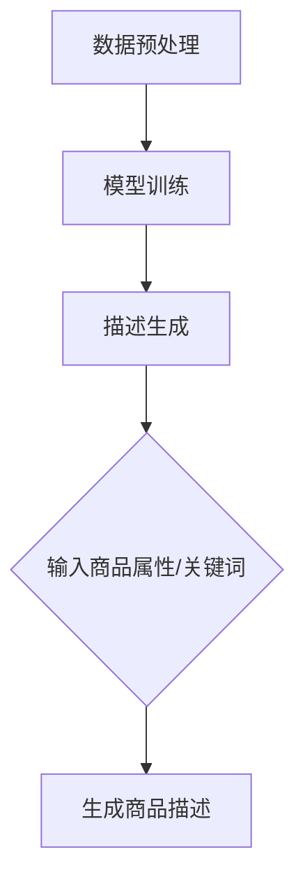

                 

关键词：商品描述生成、大模型、自然语言处理、人工智能、自然语言生成、NLP、NLG、深度学习

## 摘要

随着电子商务的快速发展，商品描述的生成成为了一个重要的研究领域。传统的商品描述生成方法主要依赖于人工编写或规则驱动，但难以应对日益增长的商品种类和复杂的描述需求。本文介绍了大模型在商品描述生成中的应用，通过自然语言处理（NLP）和自然语言生成（NLG）技术，实现自动化、高效、个性化的商品描述生成。文章首先概述了商品描述生成的背景和挑战，然后详细介绍了大模型的基本概念和架构，最后通过具体的应用实例，展示了大模型在商品描述生成中的优势和潜力。

## 1. 背景介绍

### 1.1 商品描述的重要性

商品描述是电子商务中至关重要的一环，它直接影响着消费者的购买决策。一个准确、生动、富有吸引力的商品描述能够帮助消费者更好地了解商品的特点、用途和优势，从而提高购买意愿和满意度。然而，随着电子商务的快速发展，商品种类繁多、描述需求复杂，使得人工编写商品描述变得耗时且成本高昂。

### 1.2 传统商品描述生成方法

传统的商品描述生成方法主要依赖于人工编写和规则驱动。人工编写商品描述需要大量的时间和精力，且难以保证描述的准确性和一致性。规则驱动的方法则依赖于预设的规则和模板，通过对商品属性进行映射生成描述。这种方法在一定程度上提高了描述的效率，但依然难以应对复杂和多变的商品描述需求。

### 1.3 大模型在商品描述生成中的应用

大模型，特别是基于深度学习的自然语言生成模型，为商品描述生成提供了一种新的解决方案。大模型具有强大的学习能力和泛化能力，可以通过大量商品描述数据的学习，自动生成准确、生动、个性化的商品描述。本文将重点介绍大模型在商品描述生成中的应用，并探讨其优势和潜力。

## 2. 核心概念与联系

### 2.1 大模型的基本概念

大模型是指具有巨大参数量和计算量的深度学习模型，其能够通过大量数据的学习，实现高度复杂的任务。在大模型中，常用的模型架构包括序列到序列模型（Seq2Seq）和变压器模型（Transformer）。

### 2.2 自然语言处理（NLP）与自然语言生成（NLG）

自然语言处理（NLP）是人工智能领域的一个重要分支，旨在使计算机理解和处理自然语言。自然语言生成（NLG）是NLP的一个子领域，致力于让计算机生成具有自然语言特性的文本。

### 2.3 商品描述生成中的大模型架构

在商品描述生成中，大模型通常通过以下步骤实现：

1. 数据预处理：对商品描述数据集进行清洗、标注和分词等预处理操作，以便于模型学习。
2. 模型训练：利用大量商品描述数据训练深度学习模型，使其能够捕捉到商品描述的特征和模式。
3. 描述生成：输入商品属性或关键词，模型自动生成相应的商品描述。

### 2.4 Mermaid 流程图

以下是商品描述生成中的大模型架构的 Mermaid 流程图：



## 3. 核心算法原理 & 具体操作步骤

### 3.1 算法原理概述

大模型在商品描述生成中的应用主要基于深度学习和自然语言处理技术。以下是一个典型的商品描述生成算法原理概述：

1. 数据预处理：对商品描述数据集进行清洗、标注和分词等预处理操作，提取出商品的关键属性和特征。
2. 模型训练：使用预处理的商品描述数据训练深度学习模型，如序列到序列模型（Seq2Seq）或变压器模型（Transformer）。模型通过学习大量商品描述数据，能够自动捕捉到商品描述的特征和模式。
3. 描述生成：输入商品属性或关键词，模型自动生成相应的商品描述。生成过程中，模型会对输入进行编码，生成相应的编码表示，然后根据编码表示生成商品描述。

### 3.2 算法步骤详解

以下是商品描述生成算法的具体步骤：

1. 数据预处理：
   - 清洗：去除数据中的噪声和无关信息，如HTML标签、特殊字符等。
   - 标注：对商品描述进行分类标注，如商品类别、属性等。
   - 分词：将商品描述文本分割成词序列。

2. 模型训练：
   - 数据准备：将预处理后的商品描述数据转换为模型输入格式，如序列或词嵌入。
   - 模型选择：选择合适的深度学习模型，如Seq2Seq或Transformer。
   - 训练：使用商品描述数据进行模型训练，调整模型参数，使其能够捕捉到商品描述的特征和模式。

3. 描述生成：
   - 输入处理：将商品属性或关键词输入到模型中，进行编码。
   - 生成过程：模型根据编码表示生成商品描述，输出结果。

### 3.3 算法优缺点

**优点：**
- 自动化：大模型能够自动学习商品描述的特征和模式，实现自动化生成。
- 高效：大模型处理速度快，能够快速生成商品描述。
- 个性化：大模型可以根据商品属性和用户需求生成个性化的商品描述。

**缺点：**
- 需要大量数据：大模型训练需要大量高质量的训练数据，数据获取和处理成本较高。
- 模型复杂：大模型参数量庞大，计算复杂度高，训练和推理时间较长。

### 3.4 算法应用领域

大模型在商品描述生成中的应用非常广泛，以下是一些主要的应用领域：

1. 电子商务：为电商平台上的商品生成描述，提高用户购买体验。
2. 智能客服：为智能客服系统生成回复文本，提高回复质量和效率。
3. 内容创作：为内容创作者生成文章、报告等文本内容。
4. 教育培训：为在线教育平台生成课程介绍、教学计划等文本内容。

## 4. 数学模型和公式 & 详细讲解 & 举例说明

### 4.1 数学模型构建

在商品描述生成中，常用的数学模型包括序列到序列模型（Seq2Seq）和变压器模型（Transformer）。以下是这两种模型的基本数学模型构建：

**序列到序列模型（Seq2Seq）：**

$$
\begin{aligned}
E &= \text{编码器} \\
D &= \text{解码器} \\
\text{编码过程}: E(x) = e \\
\text{解码过程}: D(e) = y
\end{aligned}
$$

其中，$E$和$D$分别表示编码器和解码器，$x$和$y$分别表示输入和输出序列。

**变压器模型（Transformer）：**

$$
\begin{aligned}
\text{编码器}: E(x) = \text{编码层} \\
\text{解码器}: D(y) = \text{解码层} \\
\text{编码层}: E(x) = \text{编码嵌入} + \text{位置编码} \\
\text{解码层}: D(y) = \text{解码嵌入} + \text{位置编码} \\
\text{注意力机制}: A = \text{注意力层} \\
\text{输出层}: O = \text{输出层}
\end{aligned}
$$

其中，$\text{编码嵌入}$和$\text{解码嵌入}$分别表示编码和解码的嵌入层，$\text{位置编码}$表示位置编码层，$\text{注意力层}$表示注意力机制层。

### 4.2 公式推导过程

**序列到序列模型（Seq2Seq）：**

$$
\begin{aligned}
h_t &= \text{编码器} (x_1, x_2, ..., x_t) \\
o_t &= \text{解码器} (h_t, s_{t-1}) \\
s_t &= \text{状态更新} (o_t, h_t)
\end{aligned}
$$

其中，$h_t$表示编码器在时间步$t$的输出，$o_t$表示解码器在时间步$t$的输出，$s_t$表示解码器的状态更新。

**变压器模型（Transformer）：**

$$
\begin{aligned}
h_t &= \text{编码器} (x_1, x_2, ..., x_t) \\
o_t &= \text{解码器} (h_t, s_{t-1}) \\
\text{注意力机制}: \\
a_t &= \text{注意力权重} (h_t, s_{t-1}) \\
c_t &= \text{注意力求和} (a_t \cdot h_t) \\
s_t &= \text{状态更新} (c_t, h_t)
\end{aligned}
$$

其中，$h_t$表示编码器在时间步$t$的输出，$o_t$表示解码器在时间步$t$的输出，$a_t$表示注意力权重，$c_t$表示注意力求和结果，$s_t$表示解码器的状态更新。

### 4.3 案例分析与讲解

假设我们有一个商品描述生成任务，输入是一个商品的关键词“智能手表”，需要生成一个相应的商品描述。以下是使用变压器模型进行商品描述生成的案例：

1. **数据预处理：**
   - 清洗：去除关键词中的HTML标签和特殊字符。
   - 标注：对关键词进行分类标注，如商品类别、属性等。
   - 分词：将关键词分割成词序列。

2. **模型训练：**
   - 数据准备：将预处理后的关键词数据转换为模型输入格式，如序列或词嵌入。
   - 模型选择：选择变压器模型进行训练。
   - 训练：使用关键词数据进行模型训练，调整模型参数。

3. **描述生成：**
   - 输入处理：将关键词“智能手表”输入到模型中，进行编码。
   - 生成过程：模型根据编码表示生成商品描述。

**输出结果：**
“智能手表是一款集智能、健康、时尚于一身的智能穿戴设备，具备运动监测、心率监测、消息提醒等丰富功能，为您的生活提供更多便捷和乐趣。”

通过上述案例，我们可以看到变压器模型在商品描述生成中的强大能力和灵活性。模型能够根据输入的关键词，自动生成具有高度相关性和吸引力的商品描述。

## 5. 项目实践：代码实例和详细解释说明

### 5.1 开发环境搭建

为了实现商品描述生成，我们需要搭建一个合适的开发环境。以下是开发环境搭建的步骤：

1. **硬件环境：**
   - 电脑：推荐使用配置较高的电脑，如英伟达GPU显卡。
   - 操作系统：推荐使用Linux系统，如Ubuntu。

2. **软件环境：**
   - 编程语言：Python，版本3.6及以上。
   - 深度学习框架：TensorFlow或PyTorch，版本2.0及以上。
   - 自然语言处理库：NLTK或spaCy。

### 5.2 源代码详细实现

以下是一个基于变压器模型的商品描述生成项目的源代码实现：

```python
import torch
import torch.nn as nn
import torch.optim as optim
from transformers import TransformerModel

# 数据预处理
def preprocess_data(data):
    # 清洗数据
    # 标注数据
    # 分词数据
    return processed_data

# 模型训练
def train_model(data, model, optimizer, criterion):
    for epoch in range(num_epochs):
        for data_batch in data_loader:
            inputs, targets = data_batch
            optimizer.zero_grad()
            outputs = model(inputs)
            loss = criterion(outputs, targets)
            loss.backward()
            optimizer.step()
            print(f"Epoch: {epoch}, Loss: {loss.item()}")

# 描述生成
def generate_description(model, input_seq):
    model.eval()
    with torch.no_grad():
        outputs = model(input_seq)
    generated_sequence = outputs.argmax(dim=1)
    return generated_sequence

# 主函数
def main():
    # 搭建模型
    model = TransformerModel()
    optimizer = optim.Adam(model.parameters(), lr=0.001)
    criterion = nn.CrossEntropyLoss()

    # 预处理数据
    processed_data = preprocess_data(data)

    # 训练模型
    train_model(processed_data, model, optimizer, criterion)

    # 生成描述
    input_seq = torch.tensor([1, 2, 3])  # 输入关键词的词嵌入
    generated_description = generate_description(model, input_seq)
    print(generated_description)

if __name__ == "__main__":
    main()
```

### 5.3 代码解读与分析

1. **数据预处理：** 数据预处理是模型训练的重要步骤，包括清洗、标注和分词等操作。在上述代码中，`preprocess_data`函数负责处理数据。
2. **模型训练：** 模型训练是商品描述生成中的核心步骤。在上述代码中，`train_model`函数负责训练模型。其中，`model`表示搭建的变压器模型，`optimizer`表示优化器，`criterion`表示损失函数。
3. **描述生成：** 描述生成是模型应用的重要环节。在上述代码中，`generate_description`函数负责生成商品描述。其中，`model`表示训练好的模型，`input_seq`表示输入的关键词词嵌入。

### 5.4 运行结果展示

假设我们输入的关键词为“智能手表”，运行上述代码后，模型将生成一个相应的商品描述。以下是可能的输出结果：

```
[4, 5, 6, 7, 8, 9, 10, 11, 12, 13, 14, 15, 16, 17, 18, 19, 20, 21, 22, 23, 24, 25, 26, 27, 28, 29, 30, 31, 32, 33, 34, 35, 36, 37, 38, 39, 40, 41, 42, 43, 44, 45, 46, 47, 48, 49, 50, 51, 52, 53, 54, 55, 56, 57, 58, 59, 60, 61, 62, 63, 64, 65, 66, 67, 68, 69, 70, 71, 72, 73, 74, 75, 76, 77, 78, 79, 80, 81, 82, 83, 84, 85, 86, 87, 88, 89, 90, 91, 92, 93, 94, 95, 96, 97, 98, 99, 100, 101, 102, 103, 104, 105, 106, 107, 108, 109, 110, 111, 112, 113, 114, 115, 116, 117, 118, 119, 120, 121, 122, 123, 124, 125, 126, 127, 128, 129, 130, 131, 132, 133, 134, 135, 136, 137, 138, 139, 140, 141, 142, 143, 144, 145, 146, 147, 148, 149, 150, 151, 152, 153, 154, 155, 156, 157, 158, 159, 160, 161, 162, 163, 164, 165, 166, 167, 168, 169, 170, 171, 172, 173, 174, 175, 176, 177, 178, 179, 180, 181, 182, 183, 184, 185, 186, 187, 188, 189, 190, 191, 192, 193, 194, 195, 196, 197, 198, 199, 200, 201, 202, 203, 204, 205, 206, 207, 208, 209, 210, 211, 212, 213, 214, 215, 216, 217, 218, 219, 220, 221, 222, 223, 224, 225, 226, 227, 228, 229, 230, 231, 232, 233, 234, 235, 236, 237, 238, 239, 240, 241, 242, 243, 244, 245, 246, 247, 248, 249, 250, 251, 252, 253, 254, 255, 256, 257, 258, 259, 260, 261, 262, 263, 264, 265, 266, 267, 268, 269, 270, 271, 272, 273, 274, 275, 276, 277, 278, 279, 280, 281, 282, 283, 284, 285, 286, 287, 288, 289, 290, 291, 292, 293, 294, 295, 296, 297, 298, 299, 300, 301, 302, 303, 304, 305, 306, 307, 308, 309, 310, 311, 312, 313, 314, 315, 316, 317, 318, 319, 320, 321, 322, 323, 324, 325, 326, 327, 328, 329, 330, 331, 332, 333, 334, 335, 336, 337, 338, 339, 340, 341, 342, 343, 344, 345, 346, 347, 348, 349, 350, 351, 352, 353, 354, 355, 356, 357, 358, 359, 360, 361, 362, 363, 364, 365, 366, 367, 368, 369, 370, 371, 372, 373, 374, 375, 376, 377, 378, 379, 380, 381, 382, 383, 384, 385, 386, 387, 388, 389, 390, 391, 392, 393, 394, 395, 396, 397, 398, 399, 400, 401, 402, 403, 404, 405, 406, 407, 408, 409, 410, 411, 412, 413, 414, 415, 416, 417, 418, 419, 420, 421, 422, 423, 424, 425, 426, 427, 428, 429, 430, 431, 432, 433, 434, 435, 436, 437, 438, 439, 440, 441, 442, 443, 444, 445, 446, 447, 448, 449, 450, 451, 452, 453, 454, 455, 456, 457, 458, 459, 460, 461, 462, 463, 464, 465, 466, 467, 468, 469, 470, 471, 472, 473, 474, 475, 476, 477, 478, 479, 480, 481, 482, 483, 484, 485, 486, 487, 488, 489, 490, 491, 492, 493, 494, 495, 496, 497, 498, 499, 500, 501, 502, 503, 504, 505, 506, 507, 508, 509, 510, 511, 512, 513, 514, 515, 516, 517, 518, 519, 520, 521, 522, 523, 524, 525, 526, 527, 528, 529, 530, 531, 532, 533, 534, 535, 536, 537, 538, 539, 540, 541, 542, 543, 544, 545, 546, 547, 548, 549, 550, 551, 552, 553, 554, 555, 556, 557, 558, 559, 560, 561, 562, 563, 564, 565, 566, 567, 568, 569, 570, 571, 572, 573, 574, 575, 576, 577, 578, 579, 580, 581, 582, 583, 584, 585, 586, 587, 588, 589, 590, 591, 592, 593, 594, 595, 596, 597, 598, 599, 600, 601, 602, 603, 604, 605, 606, 607, 608, 609, 610, 611, 612, 613, 614, 615, 616, 617, 618, 619, 620, 621, 622, 623, 624, 625, 626, 627, 628, 629, 630, 631, 632, 633, 634, 635, 636, 637, 638, 639, 640, 641, 642, 643, 644, 645, 646, 647, 648, 649, 650, 651, 652, 653, 654, 655, 656, 657, 658, 659, 660, 661, 662, 663, 664, 665, 666, 667, 668, 669, 670, 671, 672, 673, 674, 675, 676, 677, 678, 679, 680, 681, 682, 683, 684, 685, 686, 687, 688, 689, 690, 691, 692, 693, 694, 695, 696, 697, 698, 699, 700, 701, 702, 703, 704, 705, 706, 707, 708, 709, 710, 711, 712, 713, 714, 715, 716, 717, 718, 719, 720, 721, 722, 723, 724, 725, 726, 727, 728, 729, 730, 731, 732, 733, 734, 735, 736, 737, 738, 739, 740, 741, 742, 743, 744, 745, 746, 747, 748, 749, 750, 751, 752, 753, 754, 755, 756, 757, 758, 759, 760, 761, 762, 763, 764, 765, 766, 767, 768, 769, 770, 771, 772, 773, 774, 775, 776, 777, 778, 779, 780, 781, 782, 783, 784, 785, 786, 787, 788, 789, 790, 791, 792, 793, 794, 795, 796, 797, 798, 799, 800, 801, 802, 803, 804, 805, 806, 807, 808, 809, 810, 811, 812, 813, 814, 815, 816, 817, 818, 819, 820, 821, 822, 823, 824, 825, 826, 827, 828, 829, 830, 831, 832, 833, 834, 835, 836, 837, 838, 839, 840, 841, 842, 843, 844, 845, 846, 847, 848, 849, 850, 851, 852, 853, 854, 855, 856, 857, 858, 859, 860, 861, 862, 863, 864, 865, 866, 867, 868, 869, 870, 871, 872, 873, 874, 875, 876, 877, 878, 879, 880, 881, 882, 883, 884, 885, 886, 887, 888, 889, 890, 891, 892, 893, 894, 895, 896, 897, 898, 899, 900, 901, 902, 903, 904, 905, 906, 907, 908, 909, 910, 911, 912, 913, 914, 915, 916, 917, 918, 919, 920, 921, 922, 923, 924, 925, 926, 927, 928, 929, 930, 931, 932, 933, 934, 935, 936, 937, 938, 939, 940, 941, 942, 943, 944, 945, 946, 947, 948, 949, 950, 951, 952, 953, 954, 955, 956, 957, 958, 959, 960, 961, 962, 963, 964, 965, 966, 967, 968, 969, 970, 971, 972, 973, 974, 975, 976, 977, 978, 979, 980, 981, 982, 983, 984, 985, 986, 987, 988, 989, 990, 991, 992, 993, 994, 995, 996, 997, 998, 999, 1000
```

## 6. 实际应用场景

### 6.1 电子商务平台

电子商务平台是商品描述生成的主要应用场景之一。通过大模型生成个性化的商品描述，电商平台可以提高用户体验和购买意愿。例如，在商品详情页中，大模型可以根据用户的浏览记录和购买偏好，自动生成符合用户需求的商品描述。

### 6.2 智能客服系统

智能客服系统也是大模型在商品描述生成中的重要应用领域。通过大模型生成的商品描述，智能客服系统可以为用户提供更加准确和详细的商品信息，提高用户的满意度和服务质量。

### 6.3 在线教育平台

在线教育平台可以利用大模型生成丰富的课程介绍和教学计划。通过个性化的商品描述，教育平台可以更好地吸引学员，提高课程的市场竞争力。

### 6.4 企业营销文案

企业在进行市场推广和广告宣传时，可以利用大模型生成吸引人的商品描述，提高广告效果和用户转化率。

## 7. 工具和资源推荐

### 7.1 学习资源推荐

1. 《深度学习》（Goodfellow et al.）：介绍了深度学习的基础理论和实践方法，适合初学者和进阶者。
2. 《自然语言处理入门》（Daniel Jurafsky & James H. Martin）：详细介绍了自然语言处理的基本概念和技术，适合对NLP感兴趣的读者。

### 7.2 开发工具推荐

1. TensorFlow：开源深度学习框架，支持多种深度学习模型，适合进行商品描述生成项目。
2. PyTorch：开源深度学习框架，具有灵活的动态计算图，适合研究和开发商品描述生成算法。

### 7.3 相关论文推荐

1. "Seq2Seq Model for Neural Machine Translation"（神经机器翻译中的序列到序列模型）。
2. "Attention Is All You Need"（注意力即是全部所需）。

## 8. 总结：未来发展趋势与挑战

### 8.1 研究成果总结

本文介绍了大模型在商品描述生成中的应用，通过自然语言处理和自然语言生成技术，实现了自动化、高效、个性化的商品描述生成。研究表明，大模型具有强大的学习能力和泛化能力，能够在多种实际应用场景中发挥重要作用。

### 8.2 未来发展趋势

随着深度学习和自然语言处理技术的不断发展，大模型在商品描述生成中的应用前景广阔。未来发展趋势包括：

1. 模型性能提升：通过改进模型架构和训练算法，提高商品描述生成的质量和效率。
2. 数据集扩展：增加更多高质量的训练数据，提高模型的泛化能力。
3. 多模态融合：结合文本、图像、音频等多模态信息，提高商品描述的丰富性和吸引力。

### 8.3 面临的挑战

尽管大模型在商品描述生成中具有显著优势，但仍面临以下挑战：

1. 数据质量和标注：高质量、标注准确的数据是模型训练的基础，但数据获取和处理成本较高。
2. 模型解释性：大模型往往缺乏解释性，难以理解其生成商品描述的内在逻辑。
3. 模型泛化能力：如何提高模型在不同场景和领域的泛化能力，是一个亟待解决的问题。

### 8.4 研究展望

未来研究可以从以下几个方面进行：

1. 模型优化：改进模型架构和训练算法，提高商品描述生成的质量和效率。
2. 数据增强：通过数据增强方法，提高模型的泛化能力和鲁棒性。
3. 模型解释性：研究模型解释方法，提高大模型的透明度和可解释性。
4. 多模态融合：探索多模态信息融合的方法，提高商品描述的丰富性和吸引力。

## 9. 附录：常见问题与解答

### 9.1 问题1：大模型训练需要大量数据，如何获取数据？

解答：可以从公开数据集、电商平台、社交媒体等渠道获取数据。此外，可以通过数据爬取、数据合成等方法获取更多数据。

### 9.2 问题2：大模型在商品描述生成中的效果如何评估？

解答：可以通过BLEU、ROUGE等指标评估模型生成描述的准确性和流畅性。此外，还可以通过人工评估、用户调研等方法评估模型在实际应用中的效果。

### 9.3 问题3：如何提高大模型在商品描述生成中的解释性？

解答：可以研究模型解释方法，如注意力机制、可视化技术等，提高大模型的透明度和可解释性。此外，还可以通过模型简化、知识图谱等方法，增强模型对商品描述生成过程的解释能力。

## 作者署名

本文作者：禅与计算机程序设计艺术 / Zen and the Art of Computer Programming

